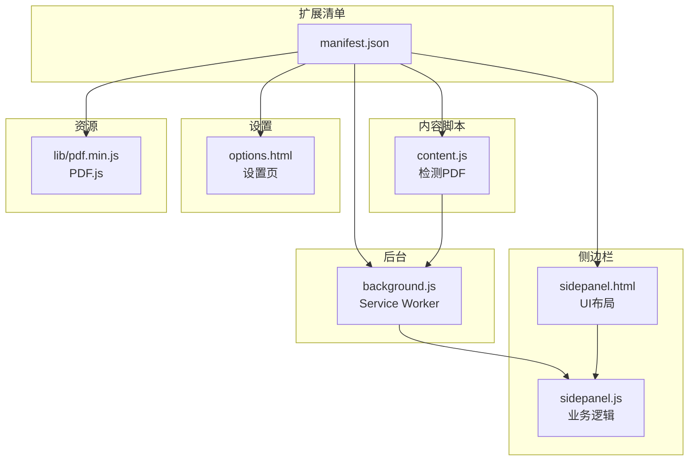
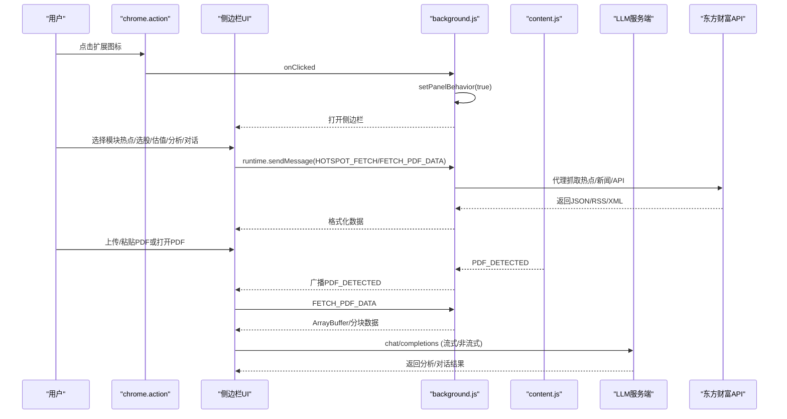
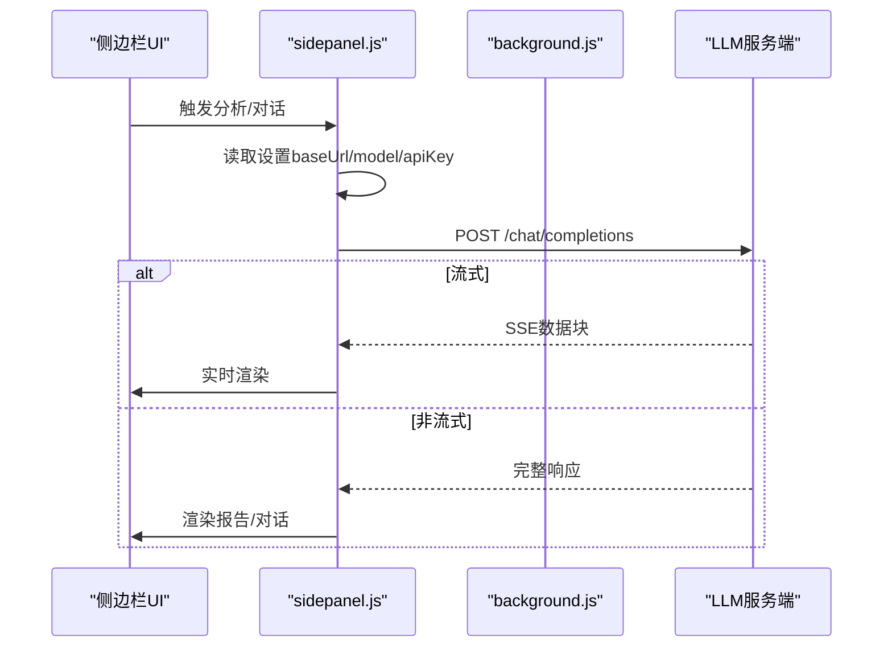
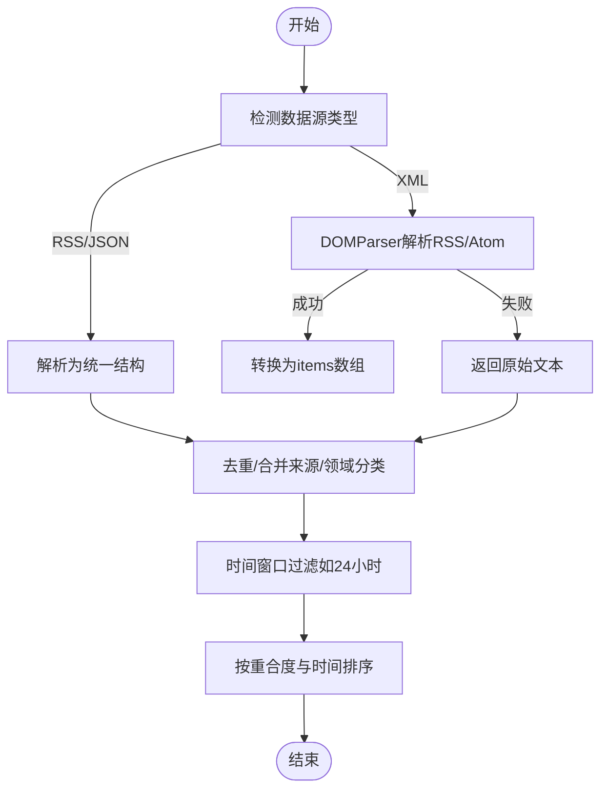
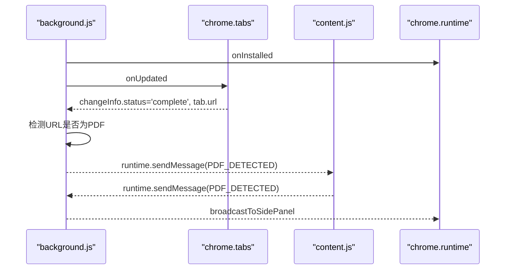
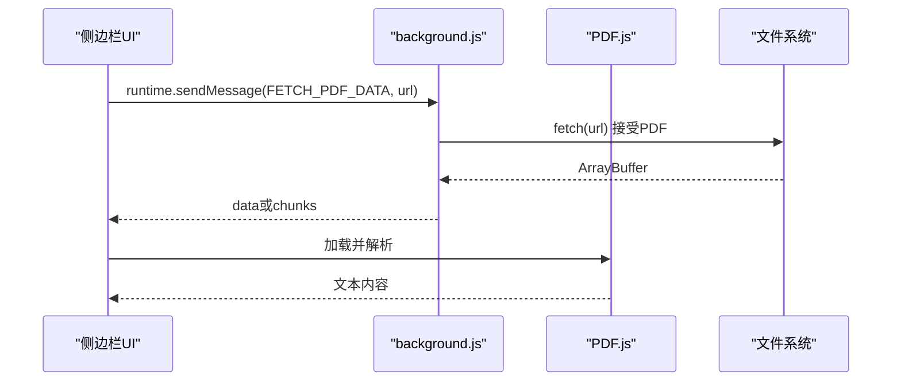
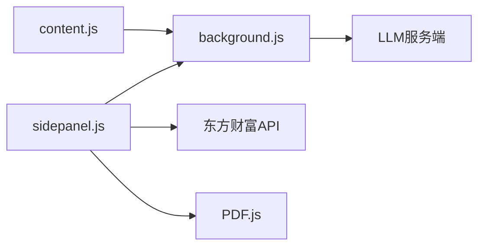

# API参考

<cite>
**本文引用的文件**
- [manifest.json](file://manifest.json)
- [background.js](file://background/background.js)
- [content.js](file://content/content.js)
- [sidepanel.js](file://sidebar/sidepanel.js)
- [sidepanel.html](file://sidebar/sidepanel.html)
- [options.html](file://sidebar/options.html)
- [README.md](file://README.md)
</cite>

## 目录
1. [简介](#简介)
2. [项目结构](#项目结构)
3. [核心组件](#核心组件)
4. [架构总览](#架构总览)
5. [详细组件分析](#详细组件分析)
6. [依赖关系分析](#依赖关系分析)
7. [性能考虑](#性能考虑)
8. [故障排查指南](#故障排查指南)
9. [结论](#结论)
10. [附录](#附录)

## 简介
本文件为“投资助手”Chrome扩展的API参考文档，涵盖以下方面：
- LLM API集成接口：支持的AI服务提供商（OpenAI、DeepSeek、智谱、通义千问等）、调用方式、参数配置与错误处理。
- 股票数据API使用：东方财富相关接口的调用方式、数据字段说明与注意事项。
- Chrome扩展API使用规范：权限配置、功能调用与事件处理机制。
- 完整接口规范、示例路径与常见问题解答，以及协议特定的调试与监控方法。

## 项目结构
该项目采用Manifest V3架构，包含后台服务工作线程、内容脚本、侧边栏界面与设置页面，以及PDF.js本地库。

图表来源
- [manifest.json:1-48](file://manifest.json#L1-L48)
- [background.js:1-117](file://background/background.js#L1-L117)
- [content.js:1-36](file://content/content.js#L1-L36)
- [sidepanel.js:1-120](file://sidebar/sidepanel.js#L1-L120)
- [sidepanel.html:1-60](file://sidebar/sidepanel.html#L1-L60)

章节来源
- [manifest.json:1-48](file://manifest.json#L1-L48)
- [README.md:108-126](file://README.md#L108-L126)

## 核心组件
- 后台服务工作线程（background.js）
  - 管理侧边栏打开、PDF检测与下载、消息路由与代理fetch。
- 内容脚本（content.js）
  - 检测网页中嵌入的PDF并上报后台。
- 侧边栏主逻辑（sidepanel.js）
  - LLM调用、热点抓取、股票数据获取、PDF文本提取与报告生成、对话与TTS。
- 设置页面（options.html）
  - LLM服务商与API配置的持久化存储。
- 扩展清单（manifest.json）
  - 权限声明、侧边栏默认路径、web可访问资源与图标。

章节来源
- [background.js:11-117](file://background/background.js#L11-L117)
- [content.js:1-36](file://content/content.js#L1-L36)
- [sidepanel.js:1-120](file://sidebar/sidepanel.js#L1-L120)
- [options.html:72-121](file://sidebar/options.html#L72-L121)
- [manifest.json:6-30](file://manifest.json#L6-L30)

## 架构总览
整体交互流程如下：

图表来源
- [background.js:12-117](file://background/background.js#L12-L117)
- [content.js:11-28](file://content/content.js#L11-L28)
- [sidepanel.js:1073-1086](file://sidebar/sidepanel.js#L1073-L1086)
- [sidepanel.js:2613-2697](file://sidebar/sidepanel.js#L2613-L2697)
- [sidepanel.js:3362-3425](file://sidebar/sidepanel.js#L3362-L3425)

## 详细组件分析

### LLM API集成接口
- 支持的服务商与默认配置
  - OpenAI（GPT-4系列）
  - DeepSeek（DeepSeek系列）
  - 智谱（GLM系列）
  - 通义千问（Qwen系列）
  - 自定义API（可配置Base URL与模型）

- 调用方式
  - 非流式：POST /chat/completions，返回完整内容。
  - 流式：POST /chat/completions，SSE逐块推送，前端实时渲染。

- 请求参数
  - 必填：Authorization: Bearer {apiKey}
  - 必填：model（来自设置）
  - 必填：messages（system + user）
  - 可选：temperature、max_tokens、stream

- 错误处理
  - HTTP状态码非2xx：解析错误消息或返回状态码。
  - API Key无效/401：提示设置面板并高亮API Key输入。
  - 空返回：抛出“返回为空”错误。

- 示例路径
  - 非流式调用：[callLLM:3362-3395](file://sidebar/sidepanel.js#L3362-L3395)
  - 流式调用：[callLLMChat:3397-3425](file://sidebar/sidepanel.js#L3397-L3425)
  - SSE解析：[handleStreamResponse:3427-3452](file://sidebar/sidepanel.js#L3427-L3452)

图表来源
- [sidepanel.js:3362-3425](file://sidebar/sidepanel.js#L3362-L3425)
- [sidepanel.js:3427-3452](file://sidebar/sidepanel.js#L3427-L3452)

章节来源
- [sidepanel.js:417-423](file://sidebar/sidepanel.js#L417-L423)
- [sidepanel.js:3362-3425](file://sidebar/sidepanel.js#L3362-L3425)
- [sidepanel.js:3427-3452](file://sidebar/sidepanel.js#L3427-L3452)
- [options.html:72-121](file://sidebar/options.html#L72-L121)

### 股票数据API（东方财富）
- 调用方式
  - 通过background代理fetch，绕过CORS限制。
  - 支持RSS/JSON/XML自动识别与解析。

- 数据源与接口
  - 财联社电报：/nodeapi/updateTelegraphList
  - 东方财富7×24：/np-listapi.eastmoney.com/...
  - 自定义RSS/JSON：支持内置与用户自定义URL
  - 个股新闻：search-api-web.eastmoney.com/search/jsonp
  - 公告：np-anotice-stock.eastmoney.com/...

- 数据字段说明（示例）
  - 财联社：roll_data[{id,title,content,ctime,stock_list,tags}]
  - 东方财富：list[{title,summary,url,showTime,...}]
  - 搜索新闻：result.cmsArticleWebOld[{title,content,mediaName,date,url}]
  - 公告：data.list[{notice_date,title_ch,art_code,columns,...}]

- 频率限制与注意事项
  - 项目未显式设置频率限制，建议合理控制并发与轮询间隔。
  - RSS/XML解析失败时降级为原始文本。

- 示例路径
  - 代理fetch：[hotspotFetch:1073-1086](file://sidebar/sidepanel.js#L1073-L1086)
  - 财联社电报：[fetchCLSTelegraph:1091-1120](file://sidebar/sidepanel.js#L1091-L1120)
  - 东方财富7×24：[fetchEastmoneyNews:1125-1150](file://sidebar/sidepanel.js#L1125-L1150)
  - 自定义RSS/JSON：[fetchCustomSource:1155-1211](file://sidebar/sidepanel.js#L1155-L1211)
  - 搜索新闻（JSONP）：[fetchCompanyNewsFromSearchAPI:2251-2328](file://sidebar/sidepanel.js#L2251-L2328)
  - 公告：[fetchCompanyAnnouncements:2334-2388](file://sidebar/sidepanel.js#L2334-L2388)

图表来源
- [background.js:192-251](file://background/background.js#L192-L251)
- [sidepanel.js:1275-1363](file://sidebar/sidepanel.js#L1275-L1363)

章节来源
- [sidepanel.js:1073-1211](file://sidebar/sidepanel.js#L1073-L1211)
- [sidepanel.js:2194-2388](file://sidebar/sidepanel.js#L2194-L2388)
- [background.js:192-251](file://background/background.js#L192-L251)

### Chrome扩展API使用规范
- 权限与行为
  - permissions：sidePanel、activeTab、scripting、storage、downloads
  - host_permissions：<all_urls>（用于background代理fetch）
  - web_accessible_resources：暴露PDF.js库给任意页面

- 事件与消息
  - action.onClicked：打开侧边栏
  - runtime.onInstalled：设置默认侧边栏行为
  - tabs.onUpdated：监听PDF URL变化
  - runtime.onMessage：消息路由（HOTSPOT_FETCH、FETCH_PDF_DATA、PDF_DETECTED、GET_CURRENT_TAB）
  - content脚本：发送PDF_DETECTED消息

- 示例路径
  - 权限与清单：[manifest.json:6-30](file://manifest.json#L6-L30)
  - 事件监听与消息路由：[background.js:12-117](file://background/background.js#L12-L117)
  - PDF检测与上报：[content.js:11-28](file://content/content.js#L11-L28)

图表来源
- [background.js:21-34](file://background/background.js#L21-L34)
- [content.js:11-28](file://content/content.js#L11-L28)
- [background.js:47-54](file://background/background.js#L47-L54)

章节来源
- [manifest.json:6-30](file://manifest.json#L6-L30)
- [background.js:12-117](file://background/background.js#L12-L117)
- [content.js:1-36](file://content/content.js#L1-L36)

### PDF处理与文本提取
- 流程
  - 检测PDF：chrome://pdf-viewer或直接URL
  - background下载PDF（支持分块传输）
  - 侧边栏加载PDF.js，逐页提取文本并拼接

- 错误处理
  - URL解析失败、下载失败、PDF.js加载失败、解析失败均返回错误信息并引导手动粘贴。

- 示例路径
  - PDF检测与上报：[onPDFDetected:2613-2619](file://sidebar/sidepanel.js#L2613-L2619)
  - 提取PDF文本：[extractPDFText:2621-2697](file://sidebar/sidepanel.js#L2621-L2697)
  - 分块传输与ArrayBuffer组装：[background.js:125-177](file://background/background.js#L125-L177)

图表来源
- [sidepanel.js:2621-2697](file://sidebar/sidepanel.js#L2621-L2697)
- [background.js:125-177](file://background/background.js#L125-L177)

章节来源
- [sidepanel.js:2613-2697](file://sidebar/sidepanel.js#L2613-L2697)
- [background.js:125-177](file://background/background.js#L125-L177)

### 设置与持久化
- 设置项
  - 服务商、Base URL、API Key、模型名称
  - 热点模块：自动刷新间隔、数据源开关、自定义RSS、关键词过滤
  - 关注公司列表（本地存储）

- 示例路径
  - 设置页与默认配置：[options.html:72-121](file://sidebar/options.html#L72-L121)
  - 侧边栏设置读取与保存：[sidepanel.js:609-637](file://sidebar/sidepanel.js#L609-L637)
  - 热点配置加载/保存：[sidepanel.js:1693-1717](file://sidebar/sidepanel.js#L1693-L1717)

章节来源
- [options.html:72-121](file://sidebar/options.html#L72-L121)
- [sidepanel.js:609-637](file://sidebar/sidepanel.js#L609-L637)
- [sidepanel.js:1693-1717](file://sidebar/sidepanel.js#L1693-L1717)

## 依赖关系分析
- 组件耦合
  - sidepanel.js依赖background.js的消息通道与代理fetch能力。
  - content.js与background.js通过runtime消息进行PDF检测联动。
  - PDF.js作为本地库，通过web_accessible_resources暴露。

- 外部依赖
  - LLM服务端：OpenAI/DeepSeek/智谱/通义千问或自定义兼容接口。
  - 东方财富API：新闻、公告、搜索等REST接口。

图表来源
- [sidepanel.js:1073-1086](file://sidebar/sidepanel.js#L1073-L1086)
- [background.js:65-117](file://background/background.js#L65-L117)
- [manifest.json:22-30](file://manifest.json#L22-L30)

章节来源
- [sidepanel.js:1073-1086](file://sidebar/sidepanel.js#L1073-L1086)
- [background.js:65-117](file://background/background.js#L65-L117)
- [manifest.json:22-30](file://manifest.json#L22-L30)

## 性能考虑
- 并发与去重
  - 热点抓取使用Promise.allSettled并行抓取，随后合并去重与来源聚合。
- 分块传输
  - PDF大于阈值时分块传输，避免消息传递过大。
- 重合度与排序
  - 基于来源数量与时间排序，提升信息质量。
- 本地存储
  - 设置与关注列表使用localStorage，减少网络请求。

[本节为通用指导，无需引用具体文件]

## 故障排查指南
- LLM调用失败
  - 检查API Key是否配置与有效；若返回401或包含“API key”，自动跳转设置面板。
  - 确认Base URL与模型名称正确；查看HTTP状态码与错误消息。
  - 参考：[错误处理与提示:3343-3357](file://sidebar/sidepanel.js#L3343-L3357)

- PDF无法提取
  - 若文本过少，提示可能是扫描版PDF，建议手动粘贴。
  - 检查URL是否为chrome://pdf-viewer，需解析src参数。
  - 参考：[extractPDFText:2621-2697](file://sidebar/sidepanel.js#L2621-L2697)

- 热点数据异常
  - RSS/XML解析失败时降级为原始文本；检查URL有效性与内容类型。
  - 参考：[RSS解析与降级:192-251](file://background/background.js#L192-L251)

- CORS与跨域
  - background拥有host_permissions，通过runtime.sendMessage代理fetch。
  - 参考：[HOTSPOT_FETCH处理:65-117](file://background/background.js#L65-L117)

章节来源
- [sidepanel.js:3343-3357](file://sidebar/sidepanel.js#L3343-L3357)
- [sidepanel.js:2621-2697](file://sidebar/sidepanel.js#L2621-L2697)
- [background.js:65-117](file://background/background.js#L65-L117)
- [background.js:192-251](file://background/background.js#L192-L251)

## 结论
本扩展通过清晰的模块划分与消息路由，实现了LLM驱动的财报解读、热点资讯聚合、PDF文本提取与对话分析。LLM与数据API的调用均具备完善的错误处理与调试提示，设置面板支持多服务商与自定义配置。建议在生产环境中配合合理的并发控制与缓存策略，进一步提升稳定性与性能。

[本节为总结，无需引用具体文件]

## 附录

### A. LLM API调用规范
- 端点
  - POST {baseUrl}/chat/completions
- 请求头
  - Authorization: Bearer {apiKey}
  - Content-Type: application/json
- 请求体
  - model: string
  - messages: [{role: "system"|"user", content: string}]
  - stream: boolean（可选）
  - temperature: number（可选）
  - max_tokens: number（可选）
- 响应
  - 非流式：choices[0].message.content
  - 流式：SSE数据块，逐块解析choices[0].delta.content

示例路径
- [callLLM:3362-3395](file://sidebar/sidepanel.js#L3362-L3395)
- [callLLMChat:3397-3425](file://sidebar/sidepanel.js#L3397-L3425)
- [handleStreamResponse:3427-3452](file://sidebar/sidepanel.js#L3427-L3452)

章节来源
- [sidepanel.js:3362-3425](file://sidebar/sidepanel.js#L3362-L3425)
- [sidepanel.js:3427-3452](file://sidebar/sidepanel.js#L3427-L3452)

### B. 股票数据API调用规范
- 热点抓取
  - 财联社电报：/nodeapi/updateTelegraphList
  - 东方财富7×24：/np-listapi.eastmoney.com/...
  - 自定义RSS/JSON：支持内置与用户自定义URL
- 个股数据
  - 新闻：search-api-web.eastmoney.com/search/jsonp
  - 公告：np-anotice-stock.eastmoney.com/...

示例路径
- [fetchCLSTelegraph:1091-1120](file://sidebar/sidepanel.js#L1091-L1120)
- [fetchEastmoneyNews:1125-1150](file://sidebar/sidepanel.js#L1125-L1150)
- [fetchCustomSource:1155-1211](file://sidebar/sidepanel.js#L1155-L1211)
- [fetchCompanyNewsFromSearchAPI:2251-2328](file://sidebar/sidepanel.js#L2251-L2328)
- [fetchCompanyAnnouncements:2334-2388](file://sidebar/sidepanel.js#L2334-L2388)

章节来源
- [sidepanel.js:1091-1211](file://sidebar/sidepanel.js#L1091-L1211)
- [sidepanel.js:2251-2388](file://sidebar/sidepanel.js#L2251-L2388)

### C. Chrome扩展API使用清单
- 权限
  - sidePanel、activeTab、scripting、storage、downloads、<all_urls>
- 事件
  - action.onClicked、runtime.onInstalled、tabs.onUpdated、runtime.onMessage
- 资源
  - web_accessible_resources暴露pdf.min.js与pdf.worker.min.js

示例路径
- [manifest.json:6-30](file://manifest.json#L6-L30)
- [background.js:12-117](file://background/background.js#L12-L117)

章节来源
- [manifest.json:6-30](file://manifest.json#L6-L30)
- [background.js:12-117](file://background/background.js#L12-L117)