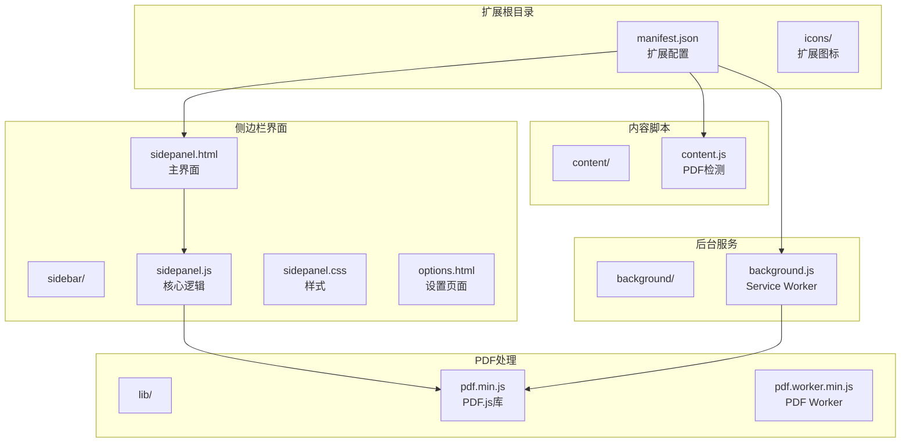
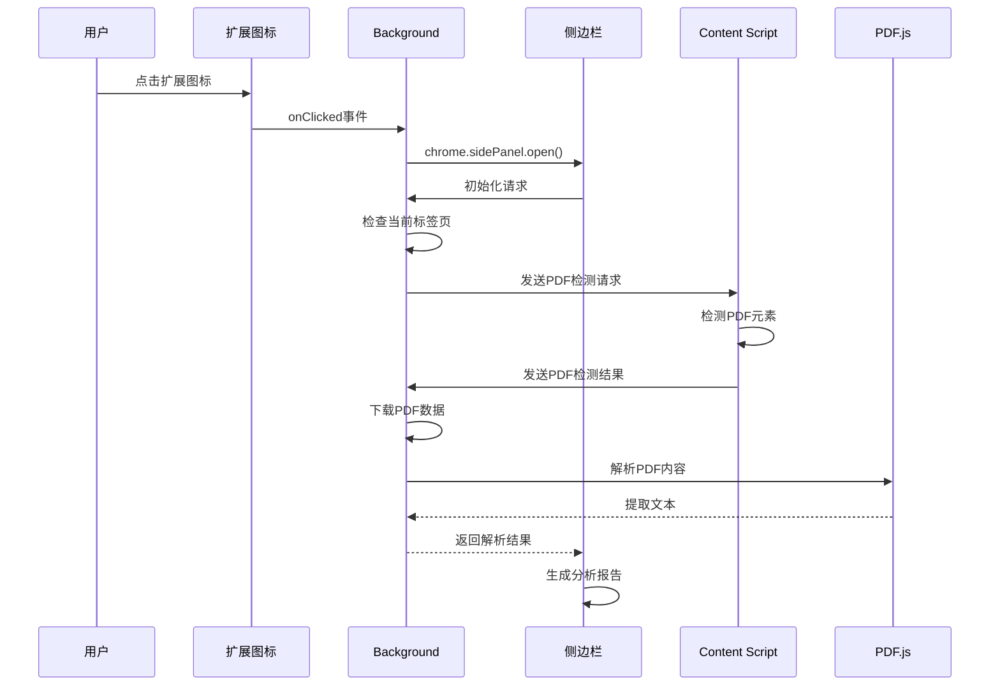
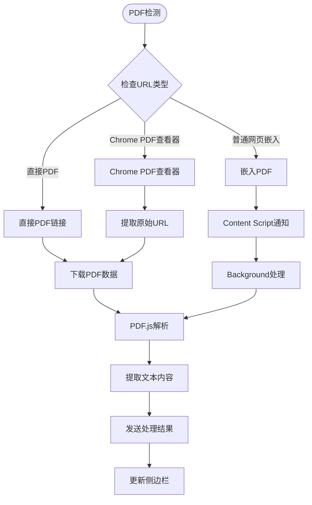
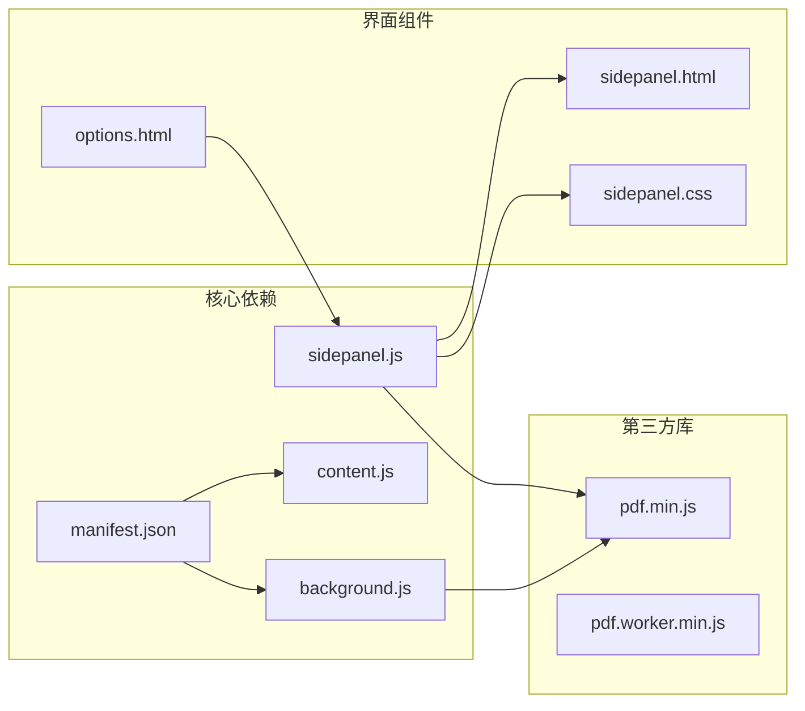

# Chrome扩展API

<cite>
**本文档引用的文件**
- [manifest.json](file://manifest.json)
- [background.js](file://background/background.js)
- [content.js](file://content/content.js)
- [sidepanel.js](file://sidebar/sidepanel.js)
- [sidepanel.html](file://sidebar/sidepanel.html)
- [sidepanel.css](file://sidebar/sidepanel.css)
- [options.html](file://sidebar/options.html)
- [pdf.min.js](file://lib/pdf.min.js)
- [README.md](file://README.md)
</cite>

## 目录
1. [简介](#简介)
2. [项目结构](#项目结构)
3. [核心组件](#核心组件)
4. [架构概览](#架构概览)
5. [详细组件分析](#详细组件分析)
6. [依赖关系分析](#依赖关系分析)
7. [性能考虑](#性能考虑)
8. [故障排除指南](#故障排除指南)
9. [结论](#结论)
10. [附录](#附录)

## 简介

这是一个基于Chrome扩展API构建的投资决策助手扩展，融合了巴菲特、林奇、费雪、芒格、格雷厄姆五大价值投资大师策略。该扩展提供了PDF财报解读、智能选股器、内在价值计算器、热点资讯抓取、AI对话分析等核心功能。

## 项目结构

该项目采用清晰的功能模块化组织结构：



**图表来源**
- [manifest.json:1-48](file://manifest.json#L1-L48)
- [background.js:1-307](file://background/background.js#L1-L307)
- [content.js:1-36](file://content/content.js#L1-L36)
- [sidepanel.js:1-800](file://sidebar/sidepanel.js#L1-L800)
- [pdf.min.js:1-22](file://lib/pdf.min.js#L1-L22)

**章节来源**
- [manifest.json:1-48](file://manifest.json#L1-L48)
- [README.md:108-126](file://README.md#L108-L126)

## 核心组件

### Manifest V3配置规范

该扩展使用Chrome扩展的最新标准Manifest V3，配置了完整的权限体系和功能模块：

**权限声明**：
- `sidePanel` - 侧边栏API权限
- `activeTab` - 访问当前标签页权限
- `scripting` - 动态脚本注入权限
- `storage` - 本地存储权限
- `downloads` - 下载API权限

**主机权限**：
- `<all_urls>` - 允许访问所有网站

**侧边栏配置**：
- 默认路径：`sidebar/sidepanel.html`
- 通过`chrome.sidePanel` API控制显示

**后台脚本设置**：
- Service Worker：`background/background.js`
- 自动安装时设置点击行为

**Web可访问资源**：
- PDF.js库文件
- PDF Worker文件

**应用图标和标题**：
- 默认标题："投资助手"
- 多尺寸图标支持

**章节来源**
- [manifest.json:6-46](file://manifest.json#L6-L46)

### Service Worker生命周期管理

Background Service Worker负责扩展的核心后台逻辑：

**初始化流程**：
1. 监听扩展安装事件
2. 设置侧边栏点击行为
3. 监听标签页更新事件
4. 处理消息路由

**PDF检测机制**：
- 监听标签页状态变化
- 检测PDF URL模式
- 通知侧边栏处理

**消息处理系统**：
- PDF数据下载请求
- Content Script通知转发
- 当前标签页信息查询
- 代理HTTP请求（绕过CORS）

**章节来源**
- [background.js:11-117](file://background/background.js#L11-L117)

### Side Panel API使用

侧边栏作为扩展的主要交互界面：

**面板显示控制**：
- 通过`chrome.action.onClicked`事件打开
- `chrome.sidePanel.open()`方法控制显示
- `chrome.sidePanel.setPanelBehavior()`配置行为

**内容更新机制**：
- 通过`chrome.runtime.sendMessage()`进行消息传递
- 支持PDF检测通知
- 实时状态同步

**界面组织**：
- 四标签布局：热点、选股器、估值、财报解读
- 每个标签对应独立的功能模块
- 响应式设计适配不同屏幕尺寸

**章节来源**
- [background.js:12-19](file://background/background.js#L12-L19)
- [sidepanel.js:990-1005](file://sidebar/sidepanel.js#L990-L1005)

### Content Script注入机制

Content Script负责在网页环境中检测PDF内容：

**检测逻辑**：
- 检测`<embed type="application/pdf">`元素
- 检测`<object type="application/pdf">`元素  
- 检测`<iframe src*=".pdf">`元素

**注入时机**：
- 页面加载完成后执行
- 支持动态内容检测
- 通过`document.readyState`判断加载状态

**通信机制**：
- 使用`chrome.runtime.sendMessage()`发送检测结果
- 通知Background进行后续处理

**章节来源**
- [content.js:11-35](file://content/content.js#L11-L35)

## 架构概览

该扩展采用典型的Chrome扩展架构模式：



**图表来源**
- [background.js:12-34](file://background/background.js#L12-L34)
- [content.js:23-27](file://content/content.js#L23-L27)
- [sidepanel.js:974-979](file://sidebar/sidepanel.js#L974-L979)

**章节来源**
- [background.js:1-307](file://background/background.js#L1-L307)
- [content.js:1-36](file://content/content.js#L1-L36)

## 详细组件分析

### PDF下载与处理系统

该系统实现了完整的PDF处理流程：



**图表来源**
- [background.js:21-34](file://background/background.js#L21-L34)
- [background.js:125-177](file://background/background.js#L125-L177)
- [content.js:11-28](file://content/content.js#L11-L28)

**处理流程特点**：
- 支持多种PDF来源检测
- 自动处理Chrome PDF查看器URL
- 大文件分块传输优化
- 错误处理和重试机制

**章节来源**
- [background.js:125-177](file://background/background.js#L125-L177)
- [content.js:11-28](file://content/content.js#L11-L28)

### 热点资讯抓取系统

侧边栏实现了复杂的信息聚合功能：

**数据源管理**：
- 内置数据源：财联社、东方财富、巨潮资讯等
- 自定义RSS/JSON API支持
- 数据源配置和过滤

**抓取流程**：
- 并行抓取多个数据源
- RSS/Atom格式解析
- JSON数据结构标准化
- 重合度计算和去重

**领域分类系统**：
- 关键词匹配算法
- 多领域标签支持
- 自定义关键词过滤

**章节来源**
- [sidepanel.js:1026-1363](file://sidebar/sidepanel.js#L1026-L1363)
- [sidepanel.js:1371-1492](file://sidebar/sidepanel.js#L1371-L1492)

### 选股器与估值计算器

集成多种价值投资策略：

**策略引擎**：
- 格雷厄姆深度价值策略
- 巴菲特护城河策略  
- 彼得·林奇PEG策略
- 费雪长期成长策略
- 芒格理性投资策略
- 综合大师策略

**估值方法**：
- DCF折现模型
- 格雷厄姆公式
- DDM股息贴现模型
- 相对估值法
- EVA经济附加值

**章节来源**
- [sidepanel.js:14-297](file://sidebar/sidepanel.js#L14-L297)

### AI对话与分析系统

基于LLM的智能分析功能：

**多服务商支持**：
- OpenAI (GPT-4)
- DeepSeek
- 智谱 (GLM)
- 通义千问
- 自定义API

**对话管理**：
- 历史消息存储
- 流式输出支持
- 预设问题模板
- 上下文保持

**章节来源**
- [sidepanel.js:407-415](file://sidebar/sidepanel.js#L407-L415)
- [options.html:73-121](file://sidebar/options.html#L73-L121)

## 依赖关系分析



**图表来源**
- [manifest.json:1-48](file://manifest.json#L1-L48)
- [pdf.min.js:1-22](file://lib/pdf.min.js#L1-L22)

**依赖特点**：
- PDF.js库本地打包，避免网络依赖
- 无运行时JavaScript依赖
- 模块化设计便于维护

**章节来源**
- [manifest.json:22-29](file://manifest.json#L22-L29)
- [pdf.min.js:1-22](file://lib/pdf.min.js#L1-L22)

## 性能考虑

### 内存管理
- PDF数据分块传输，避免内存溢出
- 图像资源及时释放
- 事件监听器正确清理

### 网络优化
- 并行数据源抓取
- 缓存机制减少重复请求
- 增量更新策略

### 用户体验
- 响应式界面适配
- 加载状态指示
- 错误恢复机制

## 故障排除指南

### 常见问题诊断

**PDF无法检测**：
1. 检查Content Script是否正常注入
2. 验证PDF URL格式
3. 确认Background权限配置

**侧边栏不显示**：
1. 验证sidePanel权限
2. 检查chrome.sidePanel API调用
3. 确认manifest配置

**LLM API连接失败**：
1. 检查API Key配置
2. 验证网络连接
3. 确认服务商可用性

**章节来源**
- [background.js:182-186](file://background/background.js#L182-L186)
- [sidepanel.js:1007-1024](file://sidebar/sidepanel.js#L1007-L1024)

## 结论

该Chrome扩展API参考文档详细记录了现代Chrome扩展开发的最佳实践，包括：

- **完整的Manifest V3配置**：权限声明、侧边栏配置、后台脚本设置
- **Service Worker生命周期管理**：事件监听、消息路由、异步处理
- **Side Panel API使用**：面板控制、内容更新、状态管理
- **Content Script注入**：时机控制、页面交互、通信机制
- **PDF处理系统**：检测、下载、解析、错误处理
- **扩展间通信**：消息传递、权限检查、跨标签页通信

该实现展示了如何构建高性能、用户体验优秀的Chrome扩展，为类似项目提供了完整的参考模板。

## 附录

### API调用示例

**权限检查示例**：
```javascript
// 检查sidePanel权限
if (chrome.sidePanel) {
    // 执行侧边栏相关操作
}

// 检查runtime权限
chrome.runtime.sendMessage({type: 'CHECK_PERMISSION'}, 
    (response) => {
        if (response.allowed) {
            // 执行需要权限的操作
        }
    }
);
```

**异步处理示例**：
```javascript
// 异步PDF下载
async function downloadPDF(url) {
    try {
        const response = await fetch(url);
        const arrayBuffer = await response.arrayBuffer();
        return Array.from(new Uint8Array(arrayBuffer));
    } catch (error) {
        console.error('下载失败:', error);
        throw error;
    }
}
```

**错误处理示例**：
```javascript
// 统一错误处理
function handleError(error, context) {
    console.error(`错误发生在${context}:`, error);
    // 显示用户友好的错误信息
    showToast(`操作失败: ${error.message}`);
}
```

**章节来源**
- [background.js:37-117](file://background/background.js#L37-L117)
- [sidepanel.js:974-979](file://sidebar/sidepanel.js#L974-L979)