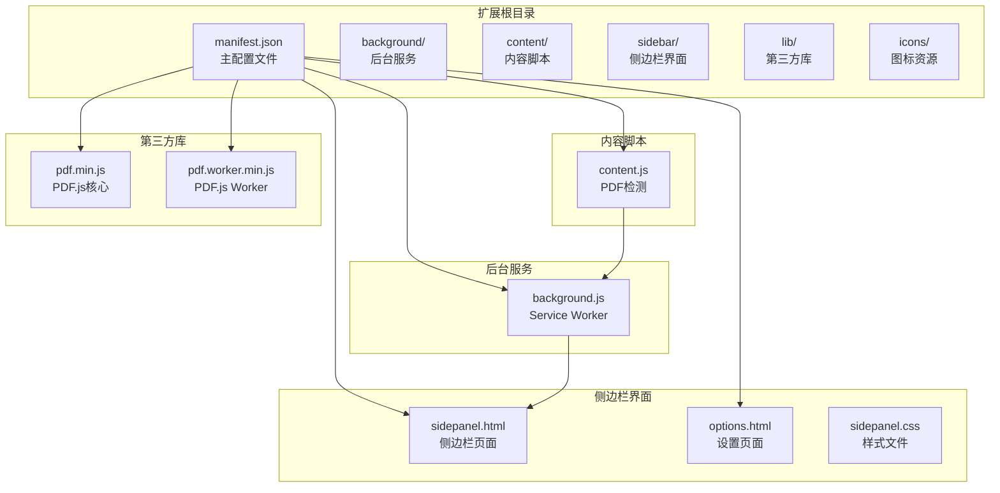
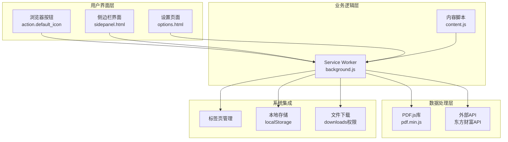
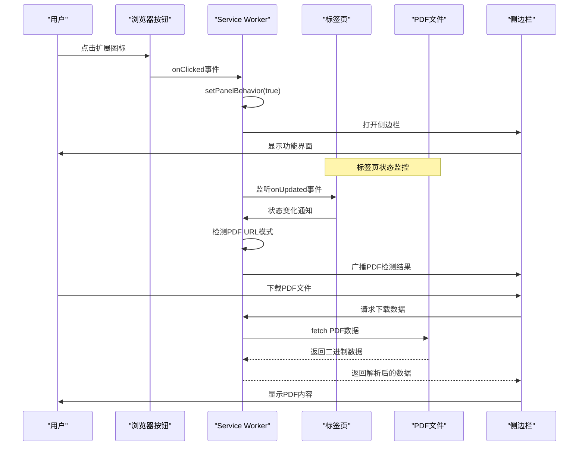
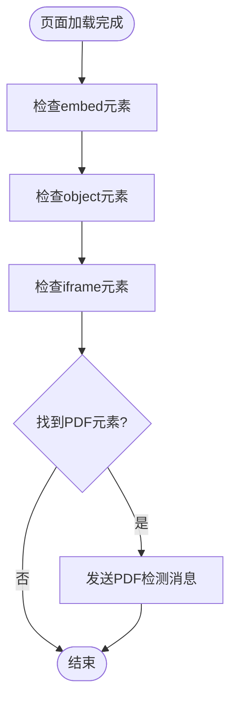
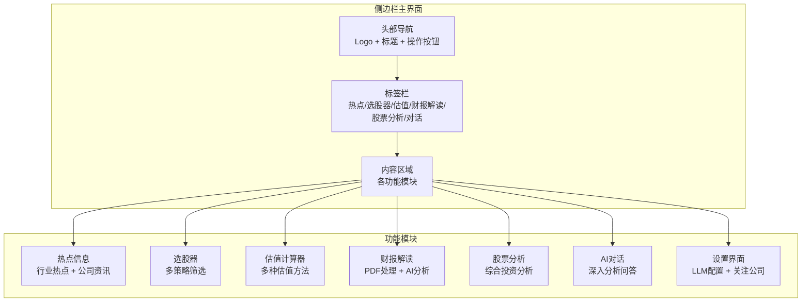
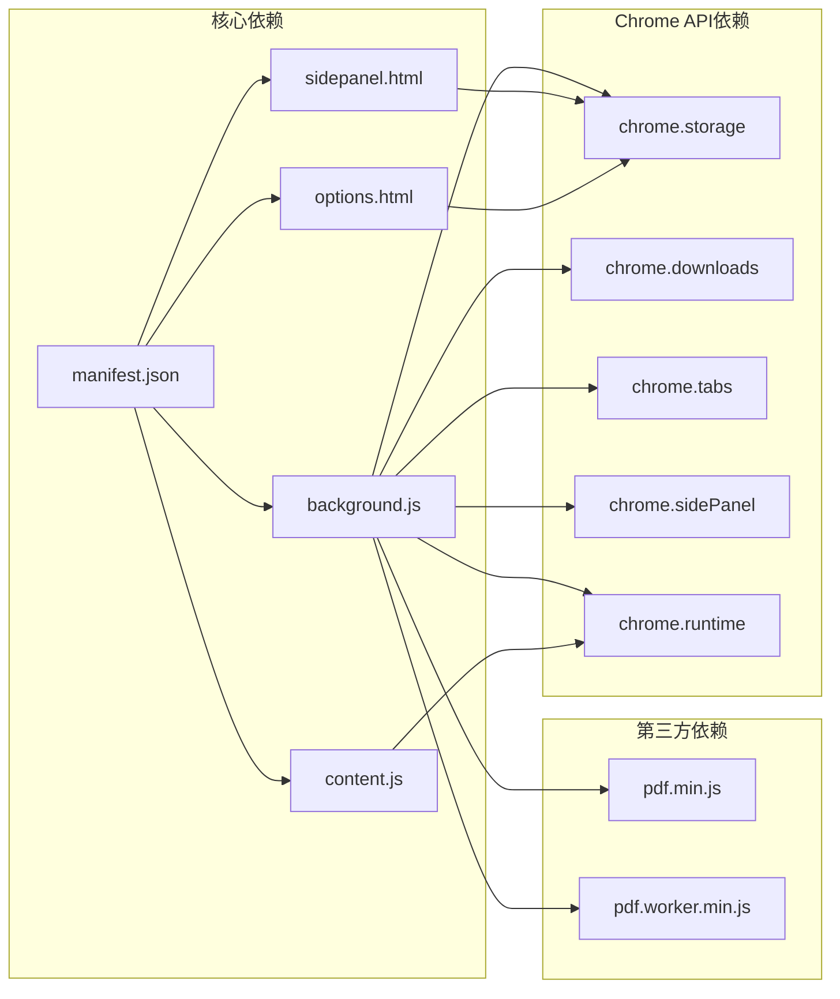

# Manifest V3配置

<cite>
**本文档引用的文件**
- [manifest.json](file://manifest.json)
- [README.md](file://README.md)
- [background.js](file://background/background.js)
- [content.js](file://content/content.js)
- [options.html](file://sidebar/options.html)
- [sidepanel.html](file://sidebar/sidepanel.html)
- [sidepanel.css](file://sidebar/sidepanel.css)
</cite>

## 目录
1. [简介](#简介)
2. [项目结构](#项目结构)
3. [核心组件](#核心组件)
4. [架构概览](#架构概览)
5. [详细组件分析](#详细组件分析)
6. [依赖关系分析](#依赖关系分析)
7. [性能考虑](#性能考虑)
8. [故障排除指南](#故障排除指南)
9. [结论](#结论)

## 简介

这是一个基于Chrome Extension Manifest V3标准开发的投资助手扩展程序。该扩展集成了多个功能模块，包括价值投资大师选股器、企业内在价值计算器、财报解读报告生成、AI对话分析等核心功能。项目采用现代化的技术架构，充分利用了Chrome扩展的新特性，特别是Side Panel API和PDF.js库的集成。

## 项目结构

该项目遵循标准的Chrome扩展目录结构，主要包含以下核心文件和目录：

**图表来源**
- [manifest.json:1-48](file://manifest.json#L1-L48)
- [background.js:1-307](file://background/background.js#L1-L307)
- [content.js:1-36](file://content/content.js#L1-L36)

**章节来源**
- [manifest.json:1-48](file://manifest.json#L1-L48)
- [README.md:108-126](file://README.md#L108-L126)

## 核心组件

### Manifest V3基础配置

该扩展使用Manifest V3标准，提供了完整的配置结构，包括基本信息、权限声明、功能配置等各个方面。

**章节来源**
- [manifest.json:1-48](file://manifest.json#L1-L48)

### 权限管理系统

扩展采用了最小权限原则，仅声明必要的权限来实现核心功能。

**章节来源**
- [manifest.json:6-12](file://manifest.json#L6-L12)

## 架构概览

该扩展采用三层架构设计：用户界面层、业务逻辑层和数据处理层。

**图表来源**
- [manifest.json:16-21](file://manifest.json#L16-L21)
- [background.js:11-19](file://background/background.js#L11-L19)
- [content.js:11-28](file://content/content.js#L11-L28)

## 详细组件分析

### Manifest V3配置详解

#### 基础信息配置

扩展的基础信息配置包含了扩展的核心元数据：

- **manifest_version**: 3 - 指定使用Manifest V3标准
- **name**: "投资助手" - 扩展显示名称
- **version**: "2.11.1" - 版本号，用于更新管理
- **description**: 详细的功能描述，说明了扩展的核心价值主张

**章节来源**
- [manifest.json:2-5](file://manifest.json#L2-L5)

#### 权限声明详解

扩展声明了以下核心权限：

**sidePanel权限**
- 用途：启用侧边栏功能，允许扩展控制侧边栏的打开和行为
- 使用场景：用户点击扩展图标时自动打开侧边栏，提供完整的功能界面

**activeTab权限**
- 用途：允许扩展访问当前活动标签页的信息
- 使用场景：检测用户当前浏览的网页，特别是PDF文件的检测和处理

**scripting权限**
- 用途：允许扩展注入脚本到网页中
- 使用场景：在特定网页中执行内容脚本，增强页面功能

**storage权限**
- 用途：允许扩展访问Chrome存储API
- 使用场景：保存用户设置、偏好配置、API密钥等数据

**downloads权限**
- 用途：允许扩展下载文件
- 使用场景：下载PDF文件到本地，供离线分析使用

**章节来源**
- [manifest.json:6-12](file://manifest.json#L6-L12)

#### Host Permissions配置

扩展使用了宽松的URL访问权限配置：

- **<all_urls>**: 允许扩展访问所有网站的URL
- 用途：支持从任何网站下载PDF文件，特别是金融数据网站
- 安全考虑：虽然权限较宽，但通过具体的下载逻辑和错误处理来确保安全性

**章节来源**
- [manifest.json:13-15](file://manifest.json#L13-L15)

#### Side Panel配置

侧边栏配置提供了完整的UI界面：

- **default_path**: "sidebar/sidepanel.html" - 默认侧边栏页面路径
- 功能：提供4个主要功能模块的完整界面
- 用户体验：支持标签切换，提供流畅的多面板操作

**章节来源**
- [manifest.json:16-18](file://manifest.json#L16-L18)

#### Background Service Worker配置

后台服务配置实现了核心的后台功能：

- **service_worker**: "background/background.js" - 指定后台脚本文件
- 核心功能：
  - 侧边栏管理：监听用户点击事件，自动打开侧边栏
  - PDF检测：监控标签页状态变化，自动检测PDF文件
  - 数据下载：绕过CORS限制，下载PDF文件
  - 消息路由：在不同组件间传递消息

**章节来源**
- [manifest.json:19-21](file://manifest.json#L19-L21)

#### Web Accessible Resources配置

资源暴露配置确保了PDF.js库的正确使用：

- **pdf.min.js**: 主要的PDF.js库文件
- **pdf.worker.min.js**: PDF.js的Worker文件，用于处理PDF解析
- **matches**: "<all_urls>" - 允许在所有环境下访问这些资源
- 用途：支持PDF文件的本地解析和显示

**章节来源**
- [manifest.json:22-30](file://manifest.json#L22-L30)

#### Action和Icons配置

浏览器按钮和图标配置：

- **default_title**: "投资助手" - 浏览器按钮的工具提示
- **default_icon**: 多尺寸图标资源（16x16, 32x32, 48x48, 128x128）
- 用途：提供清晰的视觉标识和响应的用户交互

**章节来源**
- [manifest.json:31-45](file://manifest.json#L31-L45)

#### Options Page配置

设置页面集成：

- **options_page**: "sidebar/options.html" - 设置页面路径
- 功能：允许用户配置LLM服务提供商、API密钥、模型参数等
- 数据存储：使用localStorage保存用户配置

**章节来源**
- [manifest.json:46](file://manifest.json#L46)

### 后台服务工作流程

**图表来源**
- [background.js:11-19](file://background/background.js#L11-L19)
- [background.js:21-34](file://background/background.js#L21-L34)
- [background.js:125-177](file://background/background.js#L125-L177)

### 内容脚本检测机制

**图表来源**
- [content.js:11-28](file://content/content.js#L11-L28)

**章节来源**
- [content.js:1-36](file://content/content.js#L1-L36)

### 侧边栏界面架构

侧边栏采用多标签页设计，提供完整的功能界面：

**图表来源**
- [sidepanel.html:10-40](file://sidebar/sidepanel.html#L10-L40)
- [sidepanel.html:42-222](file://sidebar/sidepanel.html#L42-L222)

**章节来源**
- [sidepanel.html:1-646](file://sidebar/sidepanel.html#L1-L646)

## 依赖关系分析

该扩展的依赖关系相对简单，主要围绕Chrome扩展的标准架构：

**图表来源**
- [manifest.json:1-48](file://manifest.json#L1-L48)
- [background.js:1-307](file://background/background.js#L1-L307)

**章节来源**
- [manifest.json:1-48](file://manifest.json#L1-L48)

## 性能考虑

### 资源优化策略

1. **懒加载机制**：侧边栏界面采用按需加载，减少初始加载时间
2. **内存管理**：PDF数据采用Uint8Array格式，避免不必要的数据转换
3. **缓存策略**：用户设置使用localStorage缓存，减少重复读取
4. **异步处理**：所有网络请求采用Promise异步处理，避免阻塞UI

### 网络优化

1. **CORS绕过**：通过background脚本处理跨域请求，避免前端CORS限制
2. **分块传输**：大PDF文件采用分块传输，避免消息传递大小限制
3. **错误处理**：完善的错误处理机制，确保网络异常时的用户体验

## 故障排除指南

### 常见问题及解决方案

**侧边栏无法打开**
- 检查sidePanel权限是否正确声明
- 确认Service Worker是否正常运行
- 验证default_path路径是否正确

**PDF文件无法下载**
- 检查host_permissions配置
- 确认PDF URL格式是否被正确识别
- 验证CORS绕过逻辑是否正常工作

**设置页面无法保存**
- 检查storage权限配置
- 确认localStorage是否可用
- 验证设置数据格式是否正确

**章节来源**
- [background.js:125-177](file://background/background.js#L125-L177)
- [options.html:81-120](file://sidebar/options.html#L81-L120)

## 结论

该Manifest V3配置展现了现代Chrome扩展开发的最佳实践。通过合理的权限设计、清晰的架构分离和完善的错误处理机制，成功实现了复杂的投资辅助功能。配置文件结构清晰，功能覆盖全面，为用户提供了完整的投资分析工具集。

扩展的主要优势包括：
- 遵循最小权限原则，安全可靠
- 采用模块化设计，易于维护和扩展
- 提供完整的用户界面，体验友好
- 集成多种AI功能，实用性强

该配置为其他Chrome扩展项目提供了优秀的参考模板，特别是在侧边栏集成、PDF处理和AI功能整合方面具有重要的借鉴意义。