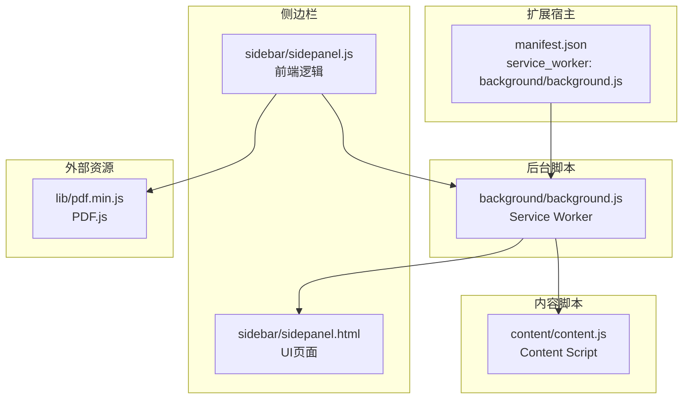
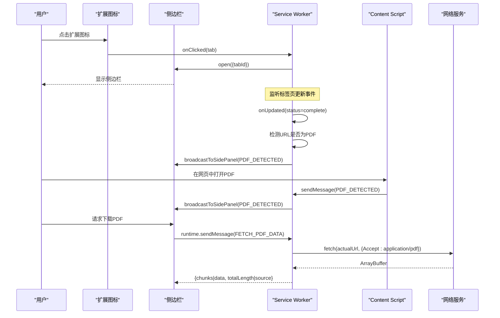
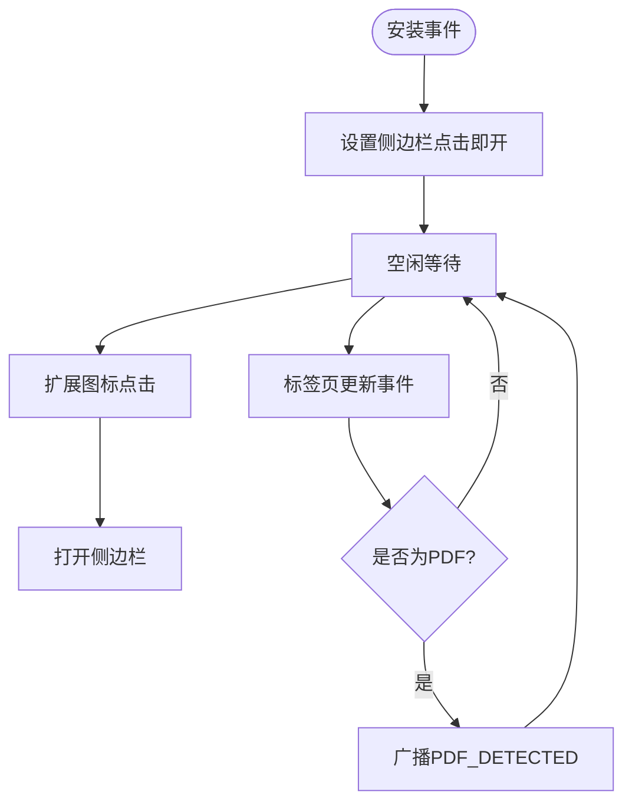
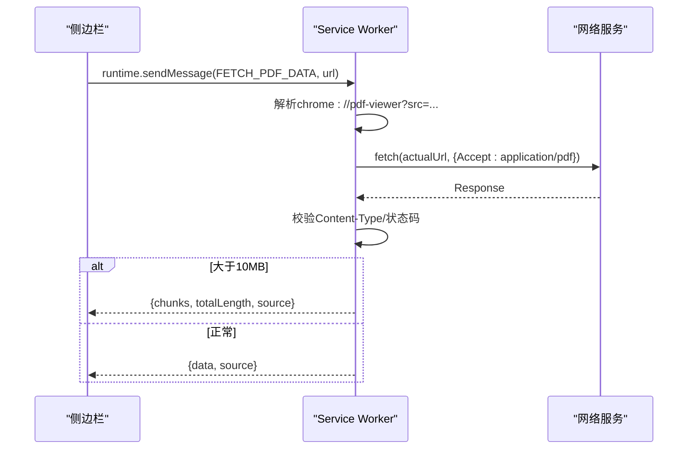
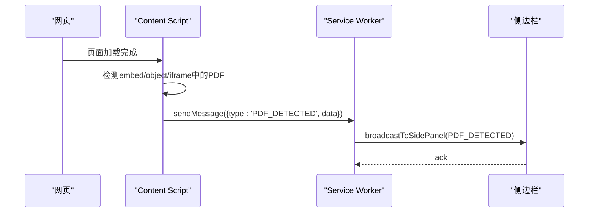
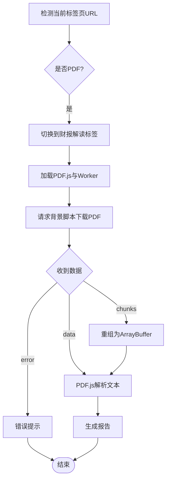
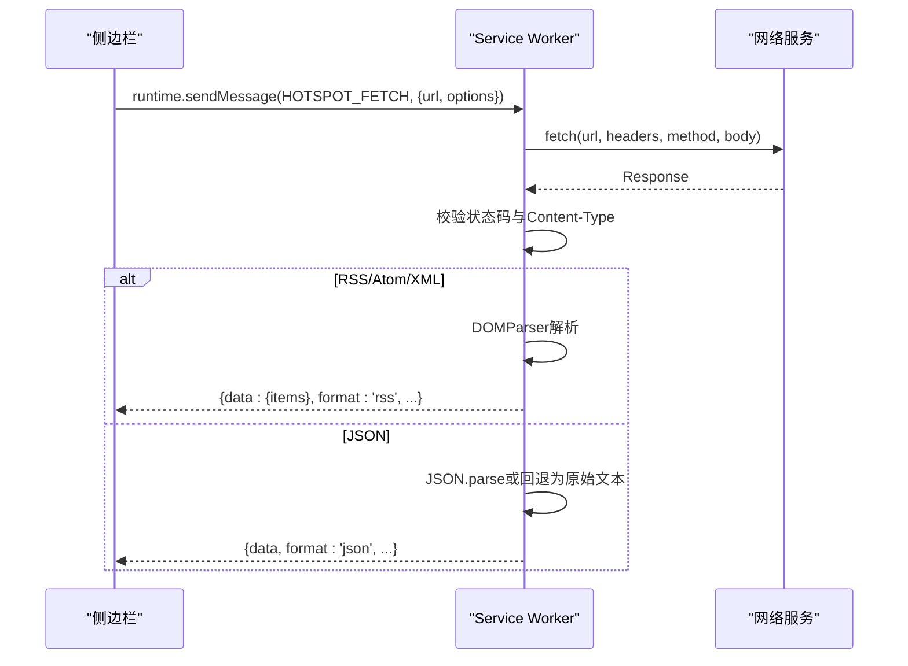
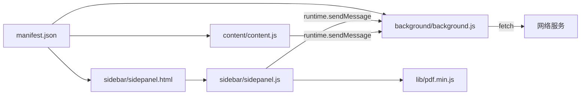

# Service Worker管理

<cite>
**本文档引用的文件**
- [manifest.json](file://manifest.json)
- [background.js](file://background/background.js)
- [content.js](file://content/content.js)
- [sidepanel.js](file://sidebar/sidepanel.js)
- [sidepanel.html](file://sidebar/sidepanel.html)
- [options.html](file://sidebar/options.html)
- [pdf.min.js](file://lib/pdf.min.js)
</cite>

## 目录
1. [简介](#简介)
2. [项目结构](#项目结构)
3. [核心组件](#核心组件)
4. [架构总览](#架构总览)
5. [详细组件分析](#详细组件分析)
6. [依赖关系分析](#依赖关系分析)
7. [性能考量](#性能考量)
8. [故障排查指南](#故障排查指南)
9. [结论](#结论)
10. [附录](#附录)

## 简介
本文件面向Chrome扩展开发者与使用者，系统化阐述本扩展中Service Worker（后台脚本）的管理与使用，涵盖生命周期、职责边界、消息通信、异步任务处理、持久化存储、内存与性能优化以及调试方法。重点围绕背景页（Manifest V3 Service Worker）如何实现PDF下载、消息路由、热点数据抓取与RSS解析、以及与Content Script和侧边栏的协作机制。

## 项目结构
- Manifest V3声明使用service_worker作为后台脚本，侧边栏通过Side Panel API打开。
- 背景脚本负责：
  - 侧边栏开关与初始化行为
  - 标签页更新事件监听与PDF检测
  - PDF二进制数据下载与分块传输
  - 消息路由与跨脚本通信
  - 代理fetch（热点数据抓取）与RSS/XML解析
- Content Script负责在普通网页中检测嵌入式PDF并上报给背景脚本。
- 侧边栏前端负责UI交互、状态管理、PDF文本提取与报告生成、热点数据抓取与展示、对话与导出等。

图表来源
- [manifest.json:19-21](file://manifest.json#L19-L21)
- [background.js:11-19](file://background/background.js#L11-L19)
- [content.js:1-35](file://content/content.js#L1-L35)
- [sidepanel.js:2567-2583](file://sidebar/sidepanel.js#L2567-L2583)

章节来源
- [manifest.json:1-48](file://manifest.json#L1-L48)
- [background.js:1-307](file://background/background.js#L1-L307)
- [content.js:1-36](file://content/content.js#L1-L36)
- [sidepanel.js:2565-2611](file://sidebar/sidepanel.js#L2565-L2611)

## 核心组件
- Service Worker（background.js）
  - 生命周期：安装时设置侧边栏点击行为；点击扩展图标打开侧边栏；监听标签页更新事件检测PDF；处理来自侧边栏与Content Script的消息。
  - PDF下载：支持chrome://pdf-viewer/链接解析、CORS绕过下载、Content-Type校验、超大文件分块传输。
  - 消息路由：统一处理FETCH_PDF_DATA、PDF_DETECTED、GET_CURRENT_TAB、HOTSPOT_FETCH等消息类型。
  - RSS/XML解析：基于DOMParser解析RSS/Atom，统一输出结构。
- Content Script（content.js）
  - 在普通网页中检测embed/object/iframe中的PDF，向背景脚本上报PDF_DETECTED。
- 侧边栏前端（sidepanel.js）
  - PDF检测与提取：加载PDF.js、下载PDF二进制、分块重组、PDF.js解析文本。
  - 热点数据抓取：代理fetch、RSS解析、自动刷新、配置持久化。
  - 对话与导出：流式输出、Markdown导出、TTS播报。
- PDF.js（lib/pdf.min.js）
  - 侧边栏前端通过动态加载PDF.js与worker，实现PDF文本提取。

章节来源
- [background.js:11-117](file://background/background.js#L11-L117)
- [background.js:119-177](file://background/background.js#L119-L177)
- [background.js:188-307](file://background/background.js#L188-L307)
- [content.js:11-28](file://content/content.js#L11-L28)
- [sidepanel.js:2567-2611](file://sidebar/sidepanel.js#L2567-L2611)
- [sidepanel.js:2621-2671](file://sidebar/sidepanel.js#L2621-L2671)

## 架构总览
Service Worker作为扩展的“中枢”，承担以下职责：
- 侧边栏行为控制：扩展图标点击打开侧边栏；安装时设置点击即开。
- PDF检测与下载：监听标签页完成事件，识别PDF URL；通过fetch下载二进制数据；对超大文件进行分块传输。
- 消息路由：接收来自侧边栏与Content Script的消息，执行相应任务并返回响应。
- 热点数据抓取：代理fetch，自动识别RSS/Atom/XML与JSON，统一解析输出。
- RSS解析：使用DOMParser解析RSS/Atom，提取字段并标准化输出。

图表来源
- [background.js:11-34](file://background/background.js#L11-L34)
- [background.js:37-62](file://background/background.js#L37-L62)
- [background.js:119-177](file://background/background.js#L119-L177)
- [content.js:22-27](file://content/content.js#L22-L27)

## 详细组件分析

### Service Worker生命周期与职责
- 注册与启动
  - Manifest V3声明service_worker指向background/background.js。
  - 安装事件设置侧边栏点击即开行为。
- 运行期职责
  - 监听标签页更新事件，检测PDF URL并在完成时广播给侧边栏。
  - 处理来自侧边栏与Content Script的消息，执行PDF下载、代理fetch、获取当前标签页等。
  - 广播消息给侧边栏，确保UI同步状态。
- 终止与回收
  - Service Worker在空闲时会被浏览器回收，消息通道在返回true时保持连接，避免回收导致响应丢失。

图表来源
- [manifest.json:19-21](file://manifest.json#L19-L21)
- [background.js:16-19](file://background/background.js#L16-L19)
- [background.js:21-34](file://background/background.js#L21-L34)

章节来源
- [manifest.json:19-21](file://manifest.json#L19-L21)
- [background.js:16-34](file://background/background.js#L16-L34)

### PDF下载与消息路由
- PDF下载流程
  - 侧边栏请求：chrome.runtime.sendMessage({type: 'FETCH_PDF_DATA', url})。
  - 背景脚本解析chrome://pdf-viewer/链接参数，获取真实URL。
  - 使用fetch下载，校验Content-Type，必要时警告但继续处理。
  - 对大于10MB的PDF进行分块传输，避免消息传递过大。
  - 返回包含chunks或data的数据给侧边栏。
- 消息路由
  - FETCH_PDF_DATA：下载PDF二进制。
  - PDF_DETECTED：Content Script或标签页检测上报。
  - GET_CURRENT_TAB：获取当前活动标签页。
  - HOTSPOT_FETCH：代理fetch热点数据，自动识别RSS/XML与JSON。

图表来源
- [background.js:37-45](file://background/background.js#L37-L45)
- [background.js:119-177](file://background/background.js#L119-L177)

章节来源
- [background.js:37-117](file://background/background.js#L37-L117)
- [background.js:119-177](file://background/background.js#L119-L177)

### Content Script与Service Worker通信
- Content Script职责
  - 在普通网页中检测embed/object/iframe中的PDF，构造消息上报PDF_DETECTED。
- 通信协议
  - 使用chrome.runtime.sendMessage发送消息，背景脚本通过onMessage统一处理。
  - 背景脚本收到后广播给侧边栏，确保UI同步。

图表来源
- [content.js:11-28](file://content/content.js#L11-L28)
- [background.js:47-54](file://background/background.js#L47-L54)

章节来源
- [content.js:11-28](file://content/content.js#L11-L28)
- [background.js:47-54](file://background/background.js#L47-L54)

### 侧边栏前端与PDF提取
- PDF.js加载与初始化
  - 通过动态script加载pdf.min.js与pdf.worker.min.js，设置GlobalWorkerOptions.workerSrc。
- PDF检测与提取
  - 检测当前标签页URL是否为PDF，若是则切换到“财报解读”标签并开始分析。
  - 通过chrome.runtime.sendMessage请求背景脚本下载PDF二进制。
  - 对分块数据进行重组为ArrayBuffer，使用PDF.js解析文本。
- 状态与UI
  - 提供加载状态提示、错误处理、Toast反馈。

图表来源
- [sidepanel.js:2587-2611](file://sidebar/sidepanel.js#L2587-L2611)
- [sidepanel.js:2621-2671](file://sidebar/sidepanel.js#L2621-L2671)
- [sidepanel.js:2567-2583](file://sidebar/sidepanel.js#L2567-L2583)

章节来源
- [sidepanel.js:2567-2611](file://sidebar/sidepanel.js#L2567-L2611)
- [sidepanel.js:2621-2671](file://sidebar/sidepanel.js#L2621-L2671)

### 热点数据抓取与RSS解析
- 代理fetch
  - 侧边栏通过HOTSPOT_FETCH消息请求背景脚本代理fetch，支持GET/POST与自定义headers。
  - 自动识别RSS/XML与JSON，统一输出结构。
- RSS/XML解析
  - 使用DOMParser解析RSS 2.0与Atom，提取标题、链接、摘要、时间、作者、分类等字段。
  - 对解析错误进行捕获并降级返回原始文本。
- 配置持久化
  - 使用chrome.storage.local保存热点配置（刷新间隔、数据源启用状态、自定义RSS源、关键词过滤等）。

图表来源
- [background.js:64-117](file://background/background.js#L64-L117)
- [background.js:188-307](file://background/background.js#L188-L307)

章节来源
- [background.js:64-117](file://background/background.js#L64-L117)
- [background.js:188-307](file://background/background.js#L188-L307)

### 异步任务处理与错误管理
- Promise与async/await
  - fetchPdfData、checkForPDF、getCurrentTab等均采用async/await，保证链式调用清晰。
- 错误处理
  - fetch异常、解析异常、PDF.js加载失败、消息通道异常均有try/catch与错误返回。
- 超时与分块
  - PDF下载超大文件采用分块传输，避免消息传递过大导致性能问题。
- 流式输出
  - 对话模块使用ReadableStream读取LLM流式响应，实时渲染。

章节来源
- [background.js:119-177](file://background/background.js#L119-L177)
- [sidepanel.js:2621-2671](file://sidebar/sidepanel.js#L2621-L2671)
- [sidepanel.js:3427-3452](file://sidebar/sidepanel.js#L3427-L3452)

### 持久化存储机制
- chrome.storage.local
  - 用于保存热点配置（hotspotConfig），包括刷新间隔、内置数据源启用状态、自定义RSS源、关键词过滤等。
  - 侧边栏设置页面与侧边栏前端分别读写localStorage（用于LLM设置）。
- 本地缓存与状态
  - 侧边栏前端使用state对象管理应用状态（PDF文本、报告、聊天历史、定时器等）。

章节来源
- [sidepanel.js:1641-1668](file://sidebar/sidepanel.js#L1641-L1668)
- [sidepanel.js:1693-1717](file://sidebar/sidepanel.js#L1693-L1717)
- [options.html:82-121](file://sidebar/options.html#L82-L121)

### Service Worker调试方法与常见问题
- 调试入口
  - 打开chrome://extensions/，启用“开发者模式”，找到扩展，点击“检查视图”查看后台脚本日志。
- 常见问题
  - PDF下载失败：检查URL是否为chrome://pdf-viewer/且包含src参数；确认fetch状态码与Content-Type。
  - RSS解析失败：确认URL返回的Content-Type或内容是否符合RSS/Atom规范。
  - 消息通道异常：确保onMessage返回true以保持通道；检查sendMessage是否在侧边栏打开后调用。
  - 超大PDF导致消息过大：确认分块传输逻辑生效；必要时降低PDF大小或优化侧边栏处理。
- 性能建议
  - 避免在Service Worker中执行重计算；将复杂解析放在侧边栏前端。
  - 合理使用定时器与自动刷新，避免频繁网络请求。

章节来源
- [background.js:37-117](file://background/background.js#L37-L117)
- [background.js:119-177](file://background/background.js#L119-L177)
- [sidepanel.js:2621-2671](file://sidebar/sidepanel.js#L2621-L2671)

## 依赖关系分析
- Manifest V3
  - 声明service_worker、side_panel、权限（storage、downloads、activeTab、scripting、sidePanel）。
- 背景脚本依赖
  - chrome.* API：runtime、tabs、sidePanel、action、storage、downloads。
  - fetch：用于PDF下载与热点数据抓取。
- 侧边栏前端依赖
  - PDF.js：动态加载pdf.min.js与pdf.worker.min.js。
  - chrome.* API：runtime、tabs、storage、downloads。
- Content Script依赖
  - chrome.runtime：sendMessage上报PDF检测。

图表来源
- [manifest.json:6-12](file://manifest.json#L6-L12)
- [manifest.json:19-21](file://manifest.json#L19-L21)
- [background.js:37-117](file://background/background.js#L37-L117)
- [sidepanel.js:2567-2583](file://sidebar/sidepanel.js#L2567-L2583)

章节来源
- [manifest.json:6-12](file://manifest.json#L6-L12)
- [manifest.json:19-21](file://manifest.json#L19-L21)
- [background.js:37-117](file://background/background.js#L37-L117)
- [sidepanel.js:2567-2583](file://sidebar/sidepanel.js#L2567-L2583)

## 性能考量
- Service Worker轻量化
  - 避免在后台脚本中执行重计算；将复杂解析与渲染移至侧边栏前端。
- 网络请求优化
  - 使用代理fetch统一处理CORS与内容类型识别；对RSS/XML与JSON进行差异化处理。
- 大文件处理
  - PDF分块传输避免消息过大；侧边栏前端重组ArrayBuffer后再解析。
- 定时器与刷新
  - 热点模块使用定时器自动刷新，支持配置刷新间隔，避免频繁请求。

章节来源
- [background.js:119-177](file://background/background.js#L119-L177)
- [sidepanel.js:1641-1668](file://sidebar/sidepanel.js#L1641-L1668)

## 故障排查指南
- PDF下载失败
  - 检查URL是否为chrome://pdf-viewer/且包含src参数；确认fetch状态码与Content-Type。
  - 若为非PDF但可解析，会发出警告但仍继续处理。
- RSS解析异常
  - 确认返回内容是否为RSS/Atom/XML；解析错误时降级返回原始文本。
- 消息通道异常
  - 确保onMessage返回true；检查sendMessage调用时机与侧边栏打开状态。
- 导出失败
  - 若指定目录写入失败，降级为传统下载方式；检查chrome.downloads权限。

章节来源
- [background.js:119-177](file://background/background.js#L119-L177)
- [background.js:188-307](file://background/background.js#L188-L307)
- [sidepanel.js:3735-3758](file://sidebar/sidepanel.js#L3735-L3758)

## 结论
本扩展通过Manifest V3 Service Worker实现了高效的后台任务管理：侧边栏行为控制、PDF检测与下载、消息路由、热点数据抓取与RSS解析。配合Content Script与侧边栏前端，形成清晰的职责分工与稳定的通信协议。通过分块传输、错误处理与配置持久化，系统在可用性与性能之间取得平衡。建议在后续迭代中进一步细化错误日志与监控，提升可维护性与用户体验。

## 附录
- 相关API与权限
  - permissions：sidePanel、activeTab、scripting、storage、downloads
  - host_permissions：<all_urls>
  - action：默认图标与标题
  - side_panel：默认路径为sidebar/sidepanel.html
- PDF.js集成
  - 侧边栏前端动态加载pdf.min.js与pdf.worker.min.js，设置worker路径后进行PDF文本提取。

章节来源
- [manifest.json:6-18](file://manifest.json#L6-L18)
- [sidepanel.js:2567-2583](file://sidebar/sidepanel.js#L2567-L2583)