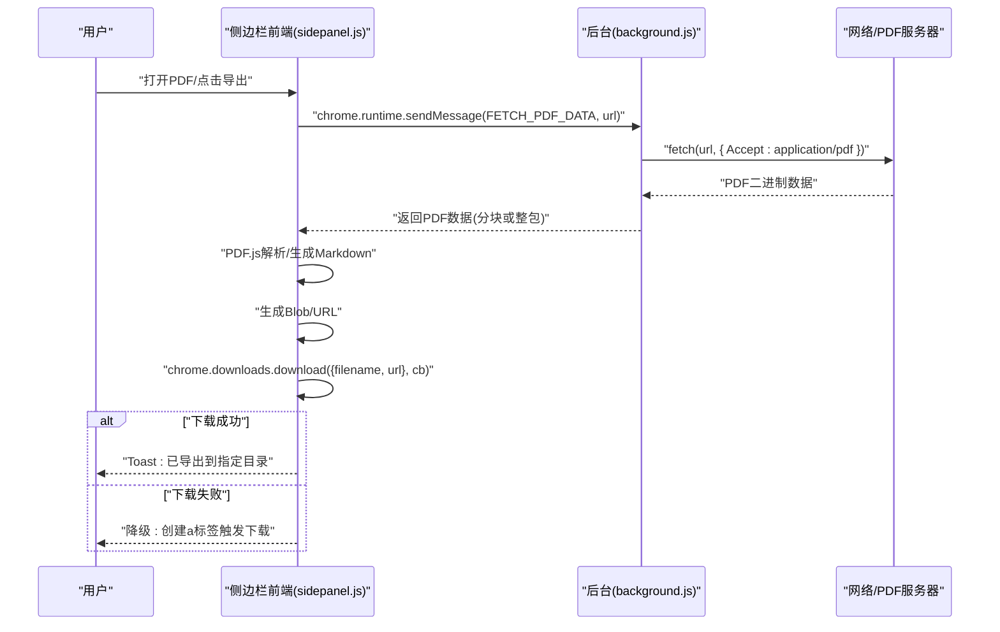
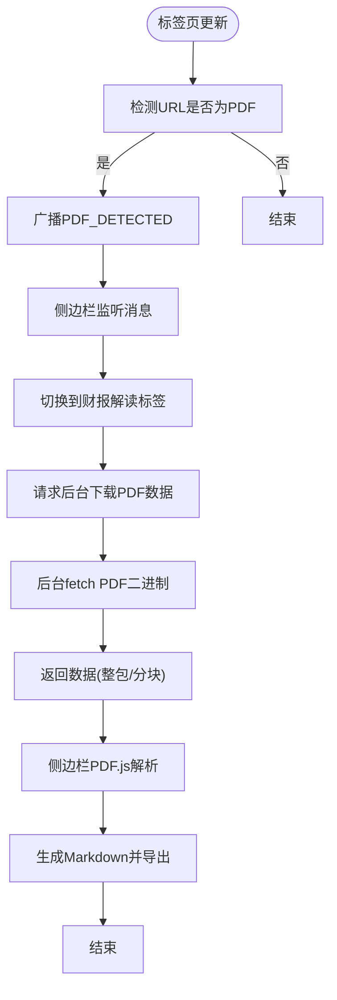
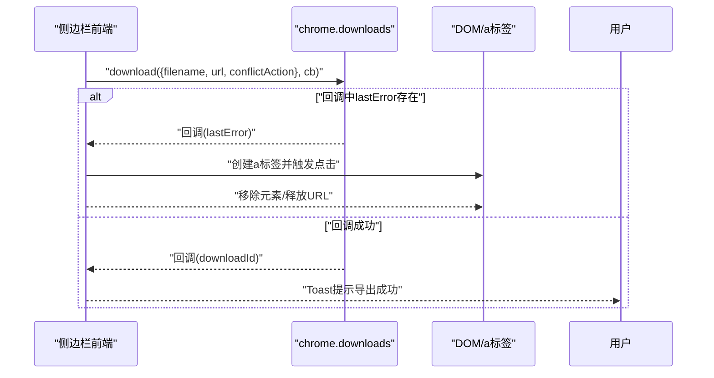
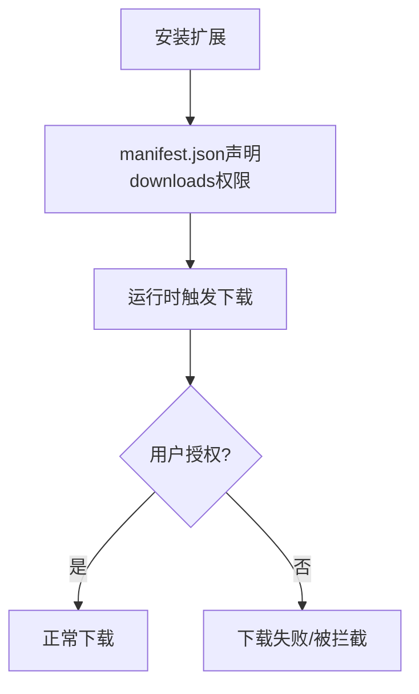
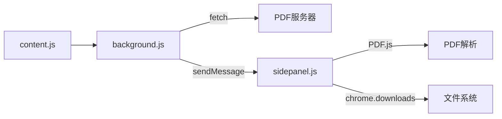

# 下载API

<cite>
**本文档引用的文件**
- [manifest.json](file://manifest.json)
- [background.js](file://background/background.js)
- [content.js](file://content/content.js)
- [sidepanel.js](file://sidebar/sidepanel.js)
- [sidepanel.html](file://sidebar/sidepanel.html)
- [README.md](file://README.md)
</cite>

## 目录
1. [简介](#简介)
2. [项目结构](#项目结构)
3. [核心组件](#核心组件)
4. [架构总览](#架构总览)
5. [详细组件分析](#详细组件分析)
6. [依赖关系分析](#依赖关系分析)
7. [性能考量](#性能考量)
8. [故障排查指南](#故障排查指南)
9. [结论](#结论)
10. [附录](#附录)

## 简介
本文件围绕 Chrome 扩展中的下载能力进行系统化文档化，重点覆盖：
- 使用 chrome.downloads API 的导出流程与降级方案
- PDF 文件的检测、URL 提取、下载触发与进度反馈
- 下载权限配置与用户授权流程
- 下载文件的存储位置与命名规则
- 失败错误处理与重试策略
- 下载进度通知与用户反馈机制
- 安全考虑与最佳实践

## 项目结构
该项目采用 Manifest V3 架构，包含后台服务工作线程、内容脚本与侧边栏前端界面。与下载相关的实现集中在后台与侧边栏前端之间通过消息通道协同完成。

```mermaid
graph TB
subgraph "扩展外壳"
M["manifest.json<br/>权限与清单配置"]
end
subgraph "后台服务"
BG["background.js<br/>PDF检测/下载/消息路由"]
CS["content.js<br/>嵌入PDF检测"]
end
subgraph "侧边栏前端"
SP["sidepanel.js<br/>PDF提取/下载导出/通知"]
HTML["sidepanel.html<br/>UI布局"]
end
M --> BG
M --> CS
BG <- --> SP
CS --> BG
SP --> BG
```

**图表来源**
- [manifest.json:1-48](file://manifest.json#L1-L48)
- [background.js:1-117](file://background/background.js#L1-L117)
- [content.js:1-36](file://content/content.js#L1-L36)
- [sidepanel.js:970-986](file://sidebar/sidepanel.js#L970-L986)
- [sidepanel.html:1-646](file://sidebar/sidepanel.html#L1-L646)

**章节来源**
- [manifest.json:1-48](file://manifest.json#L1-L48)
- [README.md:108-126](file://README.md#L108-L126)

## 核心组件
- 后台服务工作线程：负责监听标签页更新、检测 PDF、发起下载请求、解析 RSS/XML、消息路由与广播。
- 内容脚本：在普通网页中检测嵌入式 PDF 并上报后台。
- 侧边栏前端：负责 UI 交互、PDF 提取、调用后台下载、使用 chrome.downloads 导出、Toast 通知与降级下载。

**章节来源**
- [background.js:1-117](file://background/background.js#L1-L117)
- [content.js:1-36](file://content/content.js#L1-L36)
- [sidepanel.js:2621-2697](file://sidebar/sidepanel.js#L2621-L2697)
- [sidepanel.js:3735-3759](file://sidebar/sidepanel.js#L3735-L3759)

## 架构总览
整体流程：侧边栏检测到 PDF 后，向后台请求下载 PDF 二进制数据；后台通过 fetch 获取 PDF 并返回给侧边栏；侧边栏使用 chrome.downloads API 导出 Markdown 文件，若失败则降级为传统下载。



**图表来源**
- [sidepanel.js:2621-2697](file://sidebar/sidepanel.js#L2621-L2697)
- [sidepanel.js:3735-3759](file://sidebar/sidepanel.js#L3735-L3759)
- [background.js:125-177](file://background/background.js#L125-L177)

## 详细组件分析

### 组件A：PDF检测与下载触发
- 后台监听标签页更新，识别 PDF URL（含 chrome://pdf-viewer/ 类型），并向侧边栏广播“PDF_DETECTED”消息。
- 侧边栏收到消息后切换到“财报解读”标签并开始分析流程。
- 侧边栏通过 runtime.sendMessage 请求后台下载 PDF 二进制数据，后台使用 fetch 获取并返回数据（支持分块传输）。



**图表来源**
- [background.js:21-34](file://background/background.js#L21-L34)
- [background.js:37-62](file://background/background.js#L37-L62)
- [sidepanel.js:975-979](file://sidebar/sidepanel.js#L975-L979)
- [sidepanel.js:2621-2697](file://sidebar/sidepanel.js#L2621-L2697)

**章节来源**
- [background.js:21-34](file://background/background.js#L21-L34)
- [background.js:37-62](file://background/background.js#L37-L62)
- [content.js:11-28](file://content/content.js#L11-L28)
- [sidepanel.js:2613-2619](file://sidebar/sidepanel.js#L2613-L2619)
- [sidepanel.js:2621-2697](file://sidebar/sidepanel.js#L2621-L2697)

### 组件B：chrome.downloads API 导出与降级
- 侧边栏前端使用 chrome.downloads.download 导出 Markdown 文件，指定文件名与冲突处理策略。
- 若 chrome.runtime.lastError 存在（如权限/路径问题），执行降级逻辑：创建 a 标签触发下载，提示用户下载目录。



**图表来源**
- [sidepanel.js:3735-3759](file://sidebar/sidepanel.js#L3735-L3759)

**章节来源**
- [sidepanel.js:3735-3759](file://sidebar/sidepanel.js#L3735-L3759)

### 组件C：下载权限配置与用户授权
- manifest.json 声明 downloads 权限，允许扩展使用 chrome.downloads API。
- 用户首次安装或触发下载时，Chrome 可能弹出权限确认窗口，扩展需确保在用户交互后触发下载。



**图表来源**
- [manifest.json:6-12](file://manifest.json#L6-L12)

**章节来源**
- [manifest.json:6-12](file://manifest.json#L6-L12)

### 组件D：下载文件存储位置与命名规则
- 导出时指定 filename 参数，示例中包含完整路径前缀与日期后缀，便于归档。
- 命名规则：基于报告标题提取，去除非法字符，追加日期后缀，扩展名为 .md。

**章节来源**
- [sidepanel.js:3732-3733](file://sidebar/sidepanel.js#L3732-L3733)
- [sidepanel.js:3735-3759](file://sidebar/sidepanel.js#L3735-L3759)

### 组件E：错误处理与重试策略
- 网络错误：后台 fetch 失败或 HTTP 非 OK 状态，返回错误信息；侧边栏收到错误后提示用户。
- 权限问题：chrome.downloads 失败时降级为传统下载；同时记录日志便于诊断。
- 重试策略：当前实现未内置自动重试，建议在 UI 层提供“重试下载”按钮或在业务层增加指数退避重试。

**章节来源**
- [background.js:144-146](file://background/background.js#L144-L146)
- [sidepanel.js:3746-3753](file://sidebar/sidepanel.js#L3746-L3753)

### 组件F：下载进度通知与用户反馈
- 侧边栏在下载前后显示 Loading/Toast 提示，告知用户当前状态。
- 导出成功后 Toast 显示具体文件路径，失败时提示降级下载。

**章节来源**
- [sidepanel.js:2621-2622](file://sidebar/sidepanel.js#L2621-L2622)
- [sidepanel.js:3852-3864](file://sidebar/sidepanel.js#L3852-L3864)
- [sidepanel.js:3754-3755](file://sidebar/sidepanel.js#L3754-L3755)

## 依赖关系分析
- 后台依赖 host_permissions 与 downloads 权限，用于绕过 CORS 与发起下载。
- 侧边栏依赖 PDF.js 解析 PDF，依赖 chrome.downloads 导出 Markdown。
- 内容脚本辅助检测嵌入式 PDF，减少后台压力。



**图表来源**
- [background.js:125-177](file://background/background.js#L125-L177)
- [sidepanel.js:2621-2697](file://sidebar/sidepanel.js#L2621-L2697)
- [sidepanel.js:3735-3759](file://sidebar/sidepanel.js#L3735-L3759)
- [content.js:11-28](file://content/content.js#L11-L28)

**章节来源**
- [manifest.json:6-12](file://manifest.json#L6-L12)
- [background.js:125-177](file://background/background.js#L125-L177)
- [sidepanel.js:2621-2697](file://sidebar/sidepanel.js#L2621-L2697)
- [sidepanel.js:3735-3759](file://sidebar/sidepanel.js#L3735-L3759)
- [content.js:11-28](file://content/content.js#L11-L28)

## 性能考量
- PDF 数据过大时，后台采用分块传输，避免一次性消息传递导致内存压力。
- 侧边栏解析 PDF 时按页提取文本，建议在 UI 上显示进度条与页码提示。
- chrome.downloads 导出为异步操作，避免阻塞主线程；失败时立即降级，提升用户体验。

[本节为通用指导，无需特定文件引用]

## 故障排查指南
- 下载失败（权限/路径）：检查 manifest.json 是否声明 downloads 权限；确认目标路径是否存在或可写；查看 chrome.runtime.lastError。
- PDF 下载失败：确认 URL 可访问且返回 application/pdf；检查后台 fetch 的 Accept 头与响应状态。
- 导出文件名异常：检查标题提取与非法字符替换逻辑；确保日期后缀正确拼接。
- 用户未授权：确保在用户交互后触发下载；避免静默下载被浏览器拦截。

**章节来源**
- [manifest.json:6-12](file://manifest.json#L6-L12)
- [background.js:139-146](file://background/background.js#L139-L146)
- [sidepanel.js:3746-3753](file://sidebar/sidepanel.js#L3746-L3753)

## 结论
本扩展通过后台 fetch + 侧边栏 chrome.downloads 的组合，实现了 PDF 检测、下载与导出的完整链路。权限配置清晰，具备降级下载能力，能够有效应对权限与路径问题。建议后续增强：
- 在 UI 层增加“重试下载”按钮与指数退避策略
- 对 PDF 解析进度进行更细粒度的 UI 反馈
- 对导出路径进行用户可配置化

[本节为总结性内容，无需特定文件引用]

## 附录

### A. 下载API使用要点
- 使用 chrome.downloads.download 发起下载，传入 URL、文件名与冲突处理策略。
- 在回调中检查 chrome.runtime.lastError，必要时降级为传统下载。
- 确保在用户交互后触发下载，避免被浏览器拦截。

**章节来源**
- [sidepanel.js:3735-3759](file://sidebar/sidepanel.js#L3735-L3759)

### B. PDF检测与URL提取
- 后台监听标签页更新，识别 .pdf 结尾、带查询参数、chrome://pdf-viewer/ 类型。
- 侧边栏在 UI 层同样提供 isPDFUrl 判断与 chrome://pdf-viewer/ src 参数解析。

**章节来源**
- [background.js:22-33](file://background/background.js#L22-L33)
- [sidepanel.js:2598-2602](file://sidebar/sidepanel.js#L2598-L2602)
- [sidepanel.js:2628-2636](file://sidebar/sidepanel.js#L2628-L2636)

### C. 权限与清单
- downloads 权限用于 chrome.downloads API。
- host_permissions 用于后台 fetch 绕过 CORS。

**章节来源**
- [manifest.json:6-12](file://manifest.json#L6-L12)