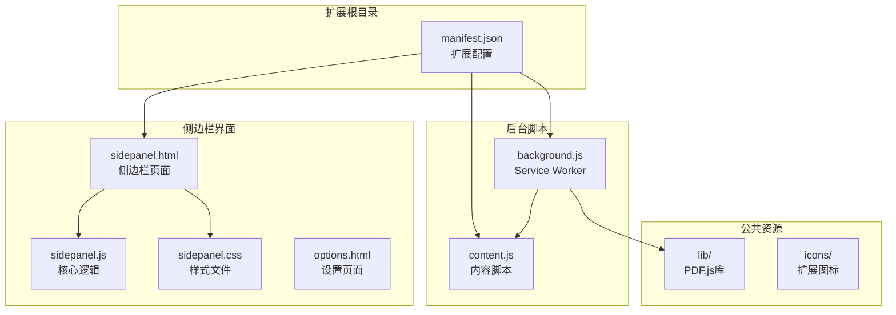
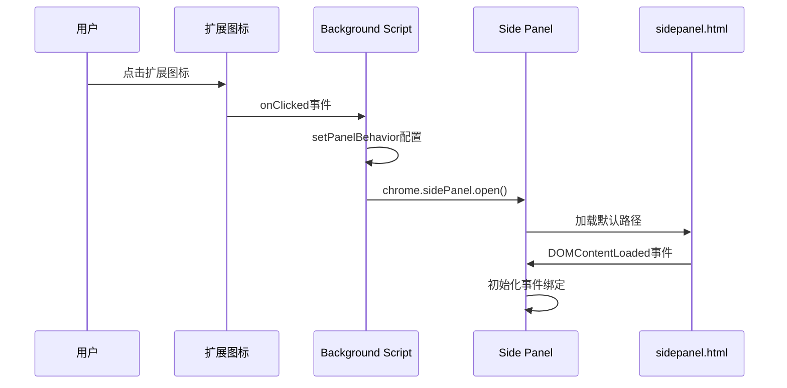
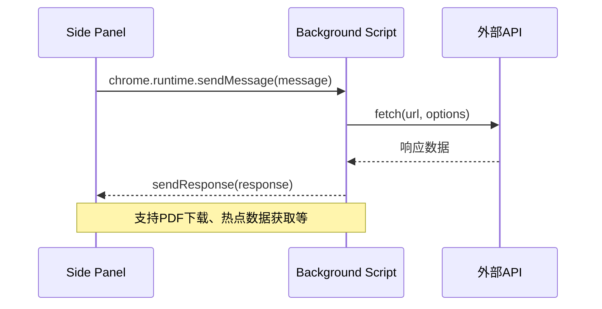
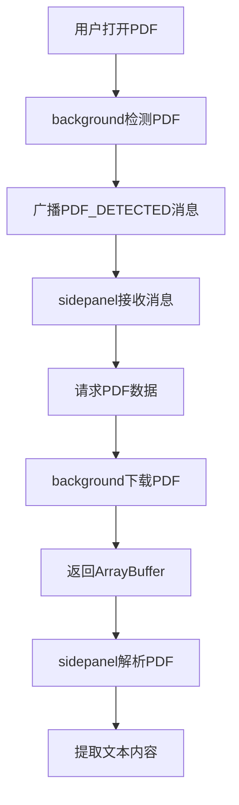
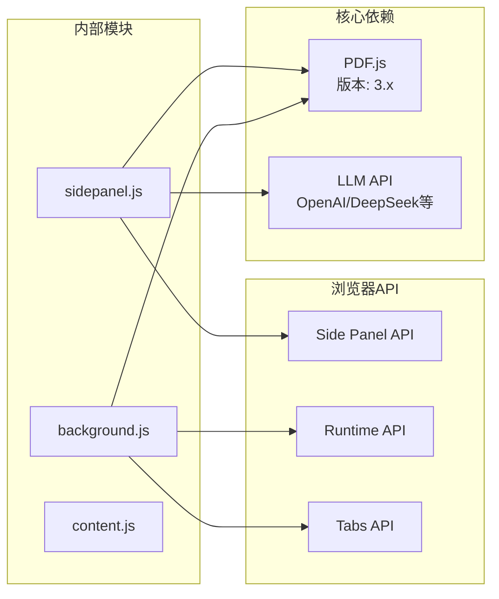
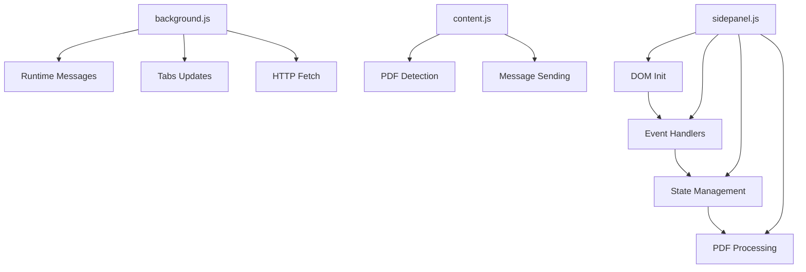

# 侧边栏API

<cite>
**本文档引用的文件**
- [manifest.json](file://manifest.json)
- [background.js](file://background/background.js)
- [content.js](file://content/content.js)
- [sidepanel.html](file://sidebar/sidepanel.html)
- [sidepanel.js](file://sidebar/sidepanel.js)
- [sidepanel.css](file://sidebar/sidepanel.css)
- [options.html](file://sidebar/options.html)
</cite>

## 目录
1. [简介](#简介)
2. [项目结构](#项目结构)
3. [核心组件](#核心组件)
4. [架构概览](#架构概览)
5. [详细组件分析](#详细组件分析)
6. [依赖关系分析](#依赖关系分析)
7. [性能考量](#性能考量)
8. [故障排除指南](#故障排除指南)
9. [结论](#结论)

## 简介

投资助手Chrome扩展是一个基于Manifest V3的侧边栏应用，提供价值投资分析、财报解读、股票筛选和AI对话等功能。该扩展利用Chrome的Side Panel API实现侧边栏的显示和隐藏控制，通过background script管理PDF检测和消息路由，通过content script检测嵌入式PDF。

## 项目结构

该项目采用清晰的模块化结构，主要包含以下核心目录：



**图表来源**
- [manifest.json:1-48](file://manifest.json#L1-L48)
- [background.js:1-307](file://background/background.js#L1-L307)
- [content.js:1-36](file://content/content.js#L1-L36)
- [sidepanel.html:1-646](file://sidebar/sidepanel.html#L1-L646)
- [sidepanel.js:1-5523](file://sidebar/sidepanel.js#L1-L5523)
- [sidepanel.css:1-2736](file://sidebar/sidepanel.css#L1-L2736)
- [options.html:1-124](file://sidebar/options.html#L1-L124)

**章节来源**
- [manifest.json:1-48](file://manifest.json#L1-L48)
- [README.md:108-126](file://README.md#L108-L126)

## 核心组件

### Side Panel API配置

扩展通过manifest.json配置侧边栏功能：

- **权限声明**：`"sidePanel"` 权限允许扩展控制侧边栏
- **默认路径**：`"default_path": "sidebar/sidepanel.html"`
- **行为设置**：在扩展安装时设置`openPanelOnActionClick: true`

### 背景脚本核心功能

background.js实现了以下关键功能：

- **侧边栏打开控制**：监听扩展图标点击事件，调用`chrome.sidePanel.open()`
- **PDF检测**：监控标签页更新，检测PDF URL变化
- **消息路由**：处理来自侧边栏和内容脚本的消息
- **CORS绕过**：提供代理fetch功能，解决跨域限制

### 内容脚本PDF检测

content.js负责检测嵌入在网页中的PDF：

- 检测`<embed>`, `<object>`, `<iframe>`中的PDF元素
- 通过`chrome.runtime.sendMessage()`通知background
- 专门处理Chrome内置PDF查看器无法注入的情况

**章节来源**
- [manifest.json:6-18](file://manifest.json#L6-L18)
- [background.js:11-19](file://background/background.js#L11-L19)
- [content.js:11-35](file://content/content.js#L11-L35)

## 架构概览

该扩展采用三层架构设计，确保功能分离和代码组织：

```mermaid
graph TB
subgraph "用户交互层"
UI[用户界面<br/>侧边栏标签页]
ICON[扩展图标]
end
subgraph "控制层"
BG[Background Script<br/>消息路由]
CS[Content Script<br/>PDF检测]
end
subgraph "业务逻辑层"
SP[Side Panel<br/>核心逻辑]
PDF[PDF.js<br/>文本提取]
LLM[LLM API<br/>AI分析]
end
subgraph "数据存储"
LS[localStorage<br/>用户设置]
CS[chrome.storage<br/>配置数据]
end
ICON --> BG
UI --> SP
BG <- --> CS
SP --> PDF
SP --> LLM
SP --> LS
BG --> CS
SP --> CS
```

**图表来源**
- [background.js:37-117](file://background/background.js#L37-L117)
- [sidepanel.js:589-607](file://sidebar/sidepanel.js#L589-L607)
- [content.js:11-35](file://content/content.js#L11-L35)

## 详细组件分析

### Side Panel API使用详解

#### 显示和隐藏控制

侧边栏的显示和隐藏通过以下机制实现：

**初始化设置**
```javascript
chrome.runtime.onInstalled.addListener(() => {
  chrome.sidePanel.setPanelBehavior({ openPanelOnActionClick: true });
});
```

**用户触发**
```javascript
chrome.action.onClicked.addListener(async (tab) => {
  await chrome.sidePanel.open({ tabId: tab.id });
});
```

**PDF自动检测**
```javascript
chrome.tabs.onUpdated.addListener((tabId, changeInfo, tab) => {
  if (changeInfo.status === 'complete' && tab.url) {
    const url = tab.url.toLowerCase();
    if (url.endsWith('.pdf') || /\.pdf[?#]/i.test(tab.url)) {
      broadcastToSidePanel({
        type: 'PDF_DETECTED',
        data: { url: tab.url, title: tab.title }
      });
    }
  }
});
```

#### setPanelBehavior方法详解

`setPanelBehavior`方法用于配置侧边栏的行为：

**激活条件**
- `openPanelOnActionClick: true` - 点击扩展图标时自动打开侧边栏
- 通过`chrome.sidePanel.open()`显式打开

**行为配置**
- 自动打开：用户点击扩展图标时立即显示侧边栏
- 手动控制：通过编程方式控制侧边栏的显示和隐藏

**章节来源**
- [background.js:16-19](file://background/background.js#L16-L19)
- [background.js:11-14](file://background/background.js#L11-L14)
- [background.js:21-34](file://background/background.js#L21-L34)

### 侧边栏内容加载机制

#### HTML文件加载流程

侧边栏页面通过manifest.json配置的默认路径加载：



**图表来源**
- [background.js:11-19](file://background/background.js#L11-L19)
- [sidepanel.html:1-10](file://sidebar/sidepanel.html#L1-L10)
- [sidepanel.js:591-607](file://sidebar/sidepanel.js#L591-L607)

#### 初始化过程

侧边栏初始化包含以下步骤：

1. **设置加载**：`loadSettings()` - 从localStorage加载用户配置
2. **事件绑定**：`bindEvents()` - 绑定所有DOM事件监听器
3. **PDF.js加载**：`loadPdfJs()` - 加载PDF.js库
4. **策略详情**：`showStrategyDetail('graham')` - 显示默认策略
5. **PDF检测**：`checkForPDF()` - 检测当前页面PDF
6. **估值计算器**：`initValuation()` - 初始化估值功能

**章节来源**
- [sidepanel.js:591-607](file://sidebar/sidepanel.js#L591-L607)
- [sidepanel.js:609-637](file://sidebar/sidepanel.js#L609-L637)

### 侧边栏与主页面交互

#### DOM访问和事件监听

侧边栏通过统一的选择器函数访问DOM元素：

```javascript
const $ = (sel) => document.querySelector(sel);
const $$ = (sel) => document.querySelectorAll(sel);
```

**事件绑定模式**
- 使用`addEventListener`绑定事件监听器
- 支持键盘导航（上下箭头、Enter、Escape）
- 事件委托模式处理动态内容

**滚动追踪**
```javascript
const reportContent = $('#report-content');
if (reportContent) {
  reportContent.addEventListener('scroll', updateTOCActiveOnScroll);
}
```

#### 消息传递机制

侧边栏与background之间的消息传递：



**图表来源**
- [sidepanel.js:974-985](file://sidebar/sidepanel.js#L974-L985)
- [background.js:37-117](file://background/background.js#L37-L117)

**章节来源**
- [sidepanel.js:586-587](file://sidebar/sidepanel.js#L586-L587)
- [sidepanel.js:974-985](file://sidebar/sidepanel.js#L974-L985)
- [background.js:37-117](file://background/background.js#L37-L117)

### 尺寸调整和响应式设计

#### 响应式布局

侧边栏采用Flexbox布局系统：

```css
#app {
  display: flex;
  flex-direction: column;
  height: 100vh;
}

.panel {
  flex: 1;
  overflow-y: auto;
  display: none;
}

.panel.active {
  display: flex;
  flex-direction: column;
}
```

**响应式特性**
- 使用`height: 100vh`确保全屏显示
- Flexbox布局自动适应内容变化
- 滚动容器支持垂直滚动
- 标签页切换时动态显示隐藏

#### 触摸和键盘交互

```javascript
// 键盘导航支持
screenerInput.addEventListener('keydown', (e) => {
  const suggest = $('#stock-suggest');
  if (suggest.style.display !== 'none') {
    if (e.key === 'ArrowDown') {
      // 向下导航
    } else if (e.key === 'ArrowUp') {
      // 向上导航
    } else if (e.key === 'Enter' && state.suggestIndex >= 0) {
      // 选择项目
    }
  }
});
```

**章节来源**
- [sidepanel.css:43-47](file://sidebar/sidepanel.css#L43-L47)
- [sidepanel.css:164-173](file://sidebar/sidepanel.css#L164-L173)
- [sidepanel.js:802-821](file://sidebar/sidepanel.js#L802-L821)

### 状态管理最佳实践

#### 用户偏好保存和恢复

**设置持久化**
```javascript
function saveSettings() {
  state.settings = {
    provider: $('#llm-provider').value,
    baseUrl: $('#llm-base-url').value,
    apiKey: $('#llm-api-key').value,
    model: $('#llm-model').value
  };
  localStorage.setItem('er_settings', JSON.stringify(state.settings));
}
```

**配置加载**
```javascript
function loadSettings() {
  const saved = localStorage.getItem('er_settings');
  if (saved) {
    try { Object.assign(state.settings, JSON.parse(saved)); } catch (e) {}
  }
}
```

**章节来源**
- [sidepanel.js:609-637](file://sidebar/sidepanel.js#L609-L637)
- [options.html:81-91](file://sidebar/options.html#L81-L91)

### 与其他扩展功能集成

#### 与下载API协作

**PDF下载流程**


**图表来源**
- [background.js:21-34](file://background/background.js#L21-L34)
- [background.js:125-177](file://background/background.js#L125-L177)
- [sidepanel.js:974-985](file://sidebar/sidepanel.js#L974-L985)

#### 与消息传递协作

**多通道消息处理**
- `PDF_DETECTED`：PDF检测通知
- `FETCH_PDF_DATA`：PDF数据请求
- `HOTSPOT_FETCH`：热点数据获取
- `GET_CURRENT_TAB`：当前标签信息

**章节来源**
- [background.js:37-117](file://background/background.js#L37-L117)
- [content.js:22-27](file://content/content.js#L22-L27)

## 依赖关系分析

### 外部依赖

扩展使用以下外部库：



**图表来源**
- [manifest.json:22-29](file://manifest.json#L22-L29)
- [background.js:125-177](file://background/background.js#L125-L177)
- [sidepanel.js:594](file://sidebar/sidepanel.js#L594)

### 内部模块依赖



**图表来源**
- [background.js:37-117](file://background/background.js#L37-L117)
- [sidepanel.js:591-607](file://sidebar/sidepanel.js#L591-L607)
- [content.js:11-35](file://content/content.js#L11-L35)

**章节来源**
- [manifest.json:6-12](file://manifest.json#L6-L12)
- [sidepanel.js:516-584](file://sidebar/sidepanel.js#L516-L584)

## 性能考量

### 内存管理

- **事件监听器清理**：使用`removeEventListener`避免内存泄漏
- **定时器管理**：及时清理`setInterval`和`setTimeout`
- **DOM引用管理**：使用弱引用避免循环引用

### 网络优化

- **CORS绕过**：通过background script代理fetch请求
- **缓存策略**：热点数据合并去重，最多保留500条
- **分块传输**：大PDF文件分块传输避免消息大小限制

### 用户体验优化

- **防抖处理**：搜索输入延迟300-350ms
- **渐进式加载**：热点数据分批渲染
- **状态反馈**：加载状态指示器和进度显示

## 故障排除指南

### 常见问题诊断

**侧边栏无法打开**
1. 检查`"sidePanel"`权限是否正确配置
2. 验证`chrome.sidePanel.open()`调用是否成功
3. 确认扩展图标点击事件监听器正常工作

**PDF检测失败**
1. 检查Chrome内置PDF查看器URL格式
2. 验证background script的PDF检测逻辑
3. 确认content script的PDF元素检测

**消息传递问题**
1. 检查`chrome.runtime.sendMessage`的回调处理
2. 验证消息格式和数据结构
3. 确认background script的消息监听器

**章节来源**
- [background.js:11-19](file://background/background.js#L11-L19)
- [content.js:11-35](file://content/content.js#L11-L35)
- [sidepanel.js:974-985](file://sidebar/sidepanel.js#L974-L985)

### 调试技巧

**开发工具使用**
- 使用Chrome DevTools检查Side Panel API调用
- 监控background script的网络请求
- 检查localStorage中的用户设置

**日志记录**
```javascript
console.log('[Invest Helper]', 'PDF detected:', url);
console.error('[Invest Helper]', 'PDF download failed:', error);
```

## 结论

该Chrome扩展通过精心设计的Side Panel API架构，提供了完整的投资分析工具链。扩展采用了现代的Manifest V3标准，利用background script处理复杂任务，sidepanel.js管理用户界面，实现了高性能、可维护的扩展应用。

关键优势包括：
- **现代化架构**：基于Manifest V3和Side Panel API
- **功能完整性**：涵盖价值投资分析的各个方面
- **用户体验**：响应式设计和流畅的交互体验
- **扩展性**：模块化设计便于功能扩展

该实现为Chrome扩展开发提供了优秀的参考案例，特别是在侧边栏API使用、消息传递机制和性能优化方面的最佳实践。