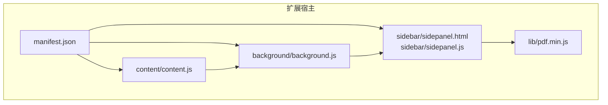
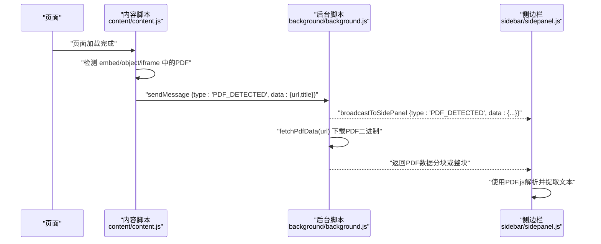
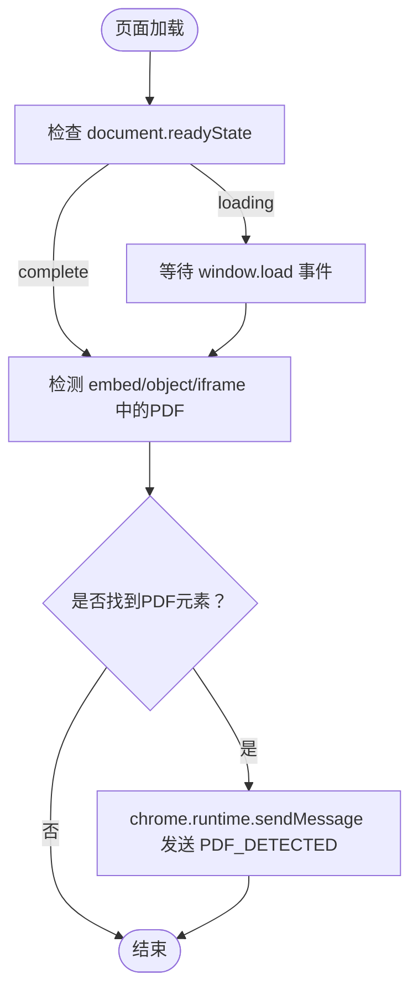
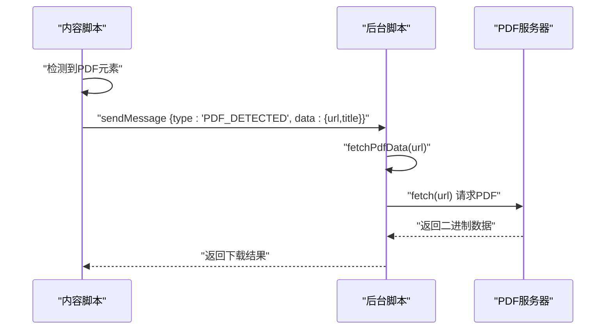
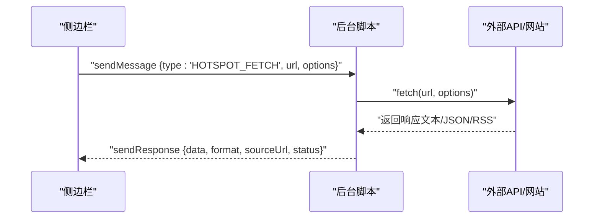
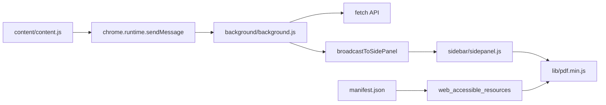

# 内容脚本集成

<cite>
**本文档引用的文件**
- [manifest.json](file://manifest.json)
- [content.js](file://content/content.js)
- [background.js](file://background/background.js)
- [sidepanel.js](file://sidebar/sidepanel.js)
- [sidepanel.html](file://sidebar/sidepanel.html)
- [pdf.min.js](file://lib/pdf.min.js)
- [README.md](file://README.md)
</cite>

## 目录
1. [简介](#简介)
2. [项目结构](#项目结构)
3. [核心组件](#核心组件)
4. [架构总览](#架构总览)
5. [详细组件分析](#详细组件分析)
6. [依赖关系分析](#依赖关系分析)
7. [性能考量](#性能考量)
8. [故障排查指南](#故障排查指南)
9. [结论](#结论)
10. [附录](#附录)

## 简介
本文件系统化阐述该Chrome扩展的内容脚本（Content Script）集成方案，涵盖以下主题：
- 内容脚本注入机制与时机控制：匹配规则、注入策略与生命周期
- 与页面DOM的交互：元素检测、事件监听、动态内容处理
- PDF元素检测与识别：链接识别、属性解析、下载触发
- 与后台脚本的消息传递：双向通信协议、数据交换格式
- 执行上下文与限制：与页面脚本隔离、权限边界
- 调试方法与性能优化：实用技巧与注意事项
- 跨域资源共享与安全考虑：CORS绕过、数据安全与隐私

## 项目结构
该项目采用Manifest V3架构，核心目录与文件如下：
- manifest.json：扩展清单，声明权限、侧边栏、web_accessible_resources等
- content/content.js：内容脚本，负责在普通网页中检测嵌入式PDF并上报
- background/background.js：后台Service Worker，负责PDF下载、消息路由、CORS代理
- sidebar/sidepanel.js：侧边栏主逻辑，负责UI交互、PDF文本提取与分析
- sidebar/sidepanel.html：侧边栏页面结构
- lib/pdf.min.js：PDF.js库（打包至扩展内）
- README.md：项目说明与使用指南

**图表来源**
- [manifest.json](file://manifest.json)
- [content.js](file://content/content.js)
- [background.js](file://background/background.js)
- [sidepanel.js](file://sidebar/sidepanel.js)
- [pdf.min.js](file://lib/pdf.min.js)

**章节来源**
- [manifest.json](file://manifest.json)
- [README.md](file://README.md)

## 核心组件
- 内容脚本（content/content.js）
  - 职责：在普通网页中检测嵌入式PDF（embed/object/iframe），并向后台发送“PDF_DETECTED”消息
  - 注入时机：页面加载完成后检测；若页面未完成，等待window.load事件
- 后台脚本（background/background.js）
  - 职责：监听标签页更新、接收内容脚本消息、代理fetch（绕过CORS）、下载PDF二进制数据、广播消息给侧边栏
  - 关键能力：利用host_permissions在后台不受CORS限制，直接下载任意URL的PDF
- 侧边栏（sidebar/sidepanel.js）
  - 职责：UI交互、热点信息抓取、PDF文本提取与分析、与后台的消息通信
  - PDF处理：通过background.js提供的数据进行PDF.js解析与文本提取
- 清单文件（manifest.json）
  - 权限：sidePanel、activeTab、scripting、storage、downloads
  - 资源：web_accessible_resources暴露pdf.min.js与pdf.worker
  - 后台：service_worker指向background.js
  - 侧边栏：default_path指向sidepanel.html

**章节来源**
- [content.js](file://content/content.js)
- [background.js](file://background/background.js)
- [sidepanel.js](file://sidebar/sidepanel.js)
- [manifest.json](file://manifest.json)

## 架构总览
整体架构分为三层：页面层（网页）、扩展层（内容脚本/后台/侧边栏）、外部资源（PDF服务器）。内容脚本负责在页面中探测PDF并上报；后台负责下载与CORS代理；侧边栏负责UI与PDF解析。

**图表来源**
- [content.js](file://content/content.js)
- [background.js](file://background/background.js)
- [sidepanel.js](file://sidebar/sidepanel.js)

## 详细组件分析

### 内容脚本注入机制与时机控制
- 注入策略
  - Manifest V3通过declarativeNetRequest与web_accessible_resources声明资源可用，内容脚本通过匹配规则在目标页面注入
  - 本项目未显式声明content_scripts匹配规则，但通过web_accessible_resources暴露PDF.js库，确保侧边栏可加载PDF解析资源
- 注入时机
  - 页面加载完成后立即检测；若页面未完成，等待window.load事件后再检测
- 匹配规则
  - 本项目未在manifest中声明content_scripts的matches，因此内容脚本并非在所有页面自动注入
  - 侧边栏打开时，通过activeTab权限与scripting API在当前标签页执行脚本（见下节“消息传递与脚本注入”）

**章节来源**
- [content.js](file://content/content.js)
- [manifest.json](file://manifest.json)

### 与页面DOM的交互：元素检测、事件监听、动态内容处理
- 元素检测
  - 检测三种常见嵌入式PDF：embed[type="application/pdf"]、object[type="application/pdf"]、iframe[src*=".pdf"]
  - 若找到匹配元素，提取src/data属性作为PDF URL
- 事件监听
  - 页面加载完成后检测；若页面未完成，注册window.load事件回调
- 动态内容处理
  - 本项目的内容脚本不修改DOM，仅读取PDF元素属性并上报

**图表来源**
- [content.js](file://content/content.js)

**章节来源**
- [content.js](file://content/content.js)

### PDF元素检测与识别机制
- 链接识别
  - 通过querySelector检测embed/object/iframe的src/data属性，识别PDF链接
- 属性解析
  - 优先使用embed/src，其次object/data，最后iframe/src
  - 获取URL与页面标题作为上报数据
- 下载触发
  - 内容脚本不直接下载PDF，仅上报“PDF_DETECTED”
  - 后台脚本在收到消息后，根据URL下载PDF二进制数据并返回给侧边栏

**图表来源**
- [content.js](file://content/content.js)
- [background.js](file://background/background.js)

**章节来源**
- [content.js](file://content/content.js)
- [background.js](file://background/background.js)

### 与后台脚本的消息传递：双向通信协议与数据交换
- 单向上报（内容脚本 → 后台）
  - 类型：PDF_DETECTED
  - 数据：{url, title}
- 双向通信（侧边栏 ↔ 后台）
  - 类型：HOTSPOT_FETCH（侧边栏请求后台代理fetch）
  - 数据：{url, options} → 返回{data, format, sourceUrl, status}或{error}
  - 类型：FETCH_PDF_DATA（侧边栏请求PDF二进制数据）
  - 数据：{url} → 返回{chunks|data, totalLength|source}
  - 类型：GET_CURRENT_TAB（侧边栏获取当前标签信息）
  - 数据：无 → 返回当前tab对象
- 消息路由
  - 后台通过runtime.onMessage监听消息，根据type分发处理
  - 通过broadcastToSidePanel向侧边栏广播PDF检测结果

**图表来源**
- [background.js](file://background/background.js)
- [sidepanel.js](file://sidebar/sidepanel.js)

**章节来源**
- [background.js](file://background/background.js)
- [sidepanel.js](file://sidebar/sidepanel.js)

### 执行上下文与限制：隔离与权限边界
- 执行上下文
  - 内容脚本运行在页面上下文中，可访问DOM但受限于CORS
  - 后台脚本运行在扩展上下文中，拥有更高权限（如host_permissions）
- 权限边界
  - Manifest声明activeTab、scripting、storage、downloads等权限
  - web_accessible_resources暴露pdf.min.js与pdf.worker，供侧边栏使用
- 隔离机制
  - 内容脚本与页面脚本共享DOM，但通过chrome.runtime.sendMessage与后台通信，避免直接跨域访问

**章节来源**
- [manifest.json](file://manifest.json)
- [background.js](file://background/background.js)

### 调试方法与性能优化
- 调试方法
  - 打开chrome://extensions，启用“开发者模式”，点击“详细信息”→“检查视图”查看后台脚本日志
  - 在侧边栏中通过控制台查看消息传递与fetch代理结果
- 性能优化
  - 内容脚本：仅在页面加载完成后检测一次，避免频繁DOM查询
  - 后台脚本：PDF下载超过阈值（约20MB）时分块传输，减少内存占用
  - 侧边栏：热点信息抓取采用Promise.allSettled并行处理，提升响应速度

**章节来源**
- [background.js](file://background/background.js)
- [sidepanel.js](file://sidebar/sidepanel.js)

### 跨域资源共享与安全考虑
- CORS绕过
  - 后台脚本通过host_permissions在扩展上下文中不受CORS限制，可直接fetch任意URL
  - 侧边栏通过HOTSPOT_FETCH请求后台代理fetch，从而绕过CORS限制
- 安全与隐私
  - API密钥存储在localStorage，不上传至任何服务器
  - 财报文本与选股请求仅发送到配置的LLM API
  - PDF下载与解析在扩展上下文中进行，避免泄露用户隐私

**章节来源**
- [manifest.json](file://manifest.json)
- [background.js](file://background/background.js)
- [README.md](file://README.md)

## 依赖关系分析
- 内容脚本依赖后台脚本进行PDF下载与消息路由
- 侧边栏依赖后台脚本进行CORS代理与PDF数据获取
- 清单文件声明权限与资源暴露，决定内容脚本与侧边栏的可用性

**图表来源**
- [content.js](file://content/content.js)
- [background.js](file://background/background.js)
- [sidepanel.js](file://sidebar/sidepanel.js)
- [manifest.json](file://manifest.json)
- [pdf.min.js](file://lib/pdf.min.js)

**章节来源**
- [manifest.json](file://manifest.json)
- [content.js](file://content/content.js)
- [background.js](file://background/background.js)
- [sidepanel.js](file://sidebar/sidepanel.js)
- [pdf.min.js](file://lib/pdf.min.js)

## 性能考量
- 内容脚本检测：仅在页面加载完成后执行一次，避免重复扫描
- 后台下载：大文件分块传输，降低内存峰值
- 侧边栏抓取：并行请求多个数据源，缩短首屏加载时间
- PDF解析：使用PDF.js在扩展上下文中解析，避免页面阻塞

[本节为通用指导，无需特定文件引用]

## 故障排查指南
- 内容脚本未检测到PDF
  - 检查页面是否为普通网页（非chrome://pdf-viewer）
  - 确认embed/object/iframe中存在PDF链接
- 后台无法下载PDF
  - 检查host_permissions是否生效
  - 确认URL可访问且Content-Type为application/pdf或octet-stream
- 侧边栏无法解析PDF
  - 确认后台返回的数据格式正确（chunks或data）
  - 检查PDF.js库是否成功加载

**章节来源**
- [content.js](file://content/content.js)
- [background.js](file://background/background.js)
- [sidepanel.js](file://sidebar/sidepanel.js)

## 结论
本项目通过清晰的职责划分与严格的上下文隔离，实现了内容脚本与后台脚本的高效协作。内容脚本专注于PDF元素检测，后台脚本负责下载与CORS代理，侧边栏负责UI与解析。通过分块传输与并行抓取等优化手段，系统在性能与用户体验方面表现良好。同时，清单文件与权限声明确保了扩展的安全边界与合规性。

[本节为总结性内容，无需特定文件引用]

## 附录
- 使用方式
  - 打开扩展图标 → 点击⚙️设置 → 选择LLM服务商并填写API Key → 保存设置
  - 在浏览器中打开财报PDF → 点击扩展图标 → 自动打开侧边栏 → 系统自动提取PDF内容并生成解读报告

**章节来源**
- [README.md](file://README.md)