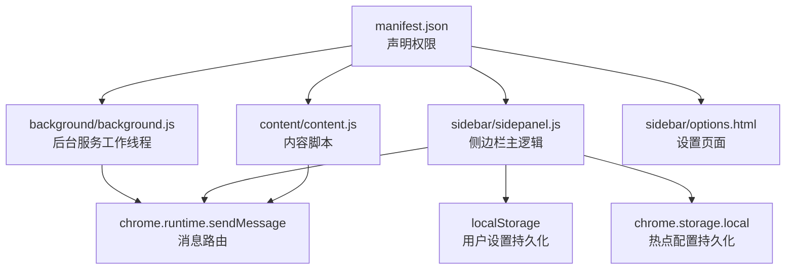
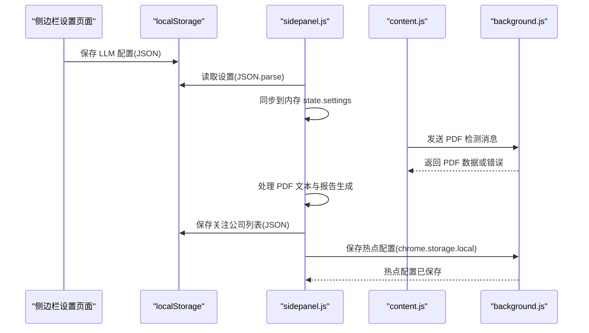
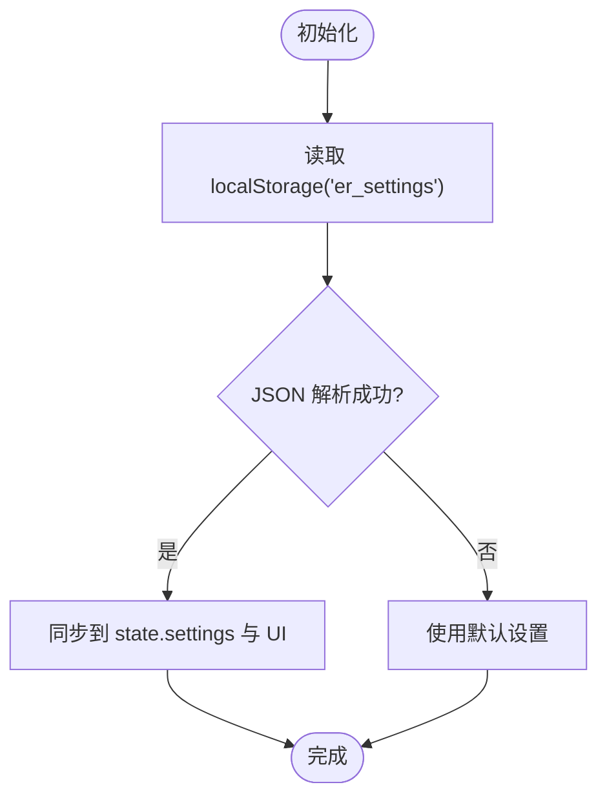
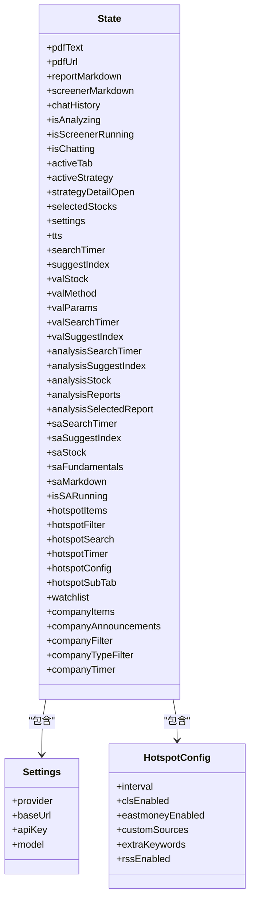
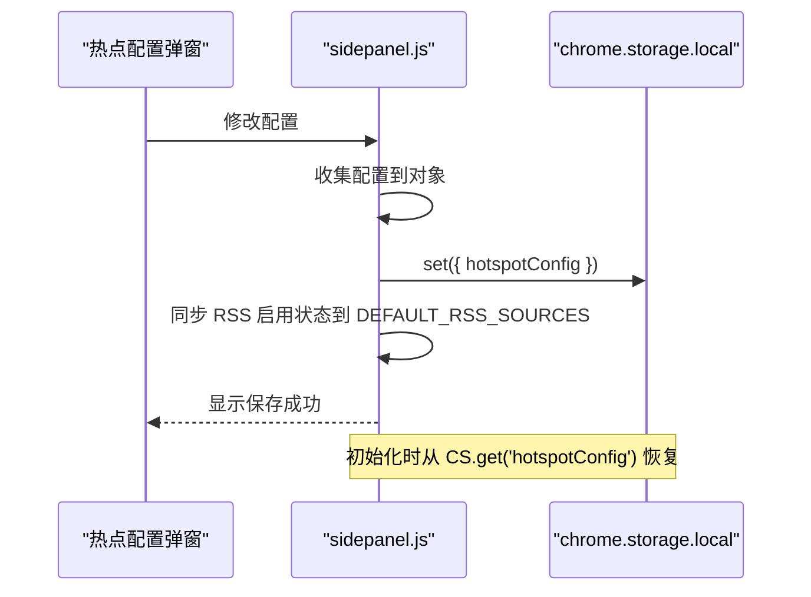
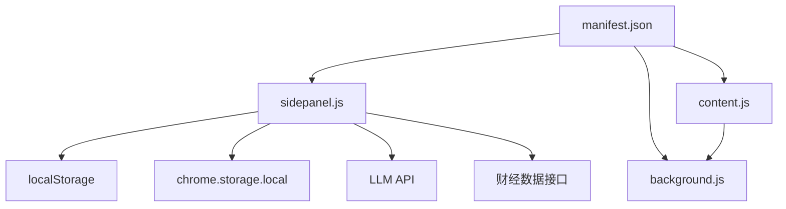

# 存储API

<cite>
**本文档引用的文件**
- [manifest.json](file://manifest.json)
- [background.js](file://background/background.js)
- [sidepanel.js](file://sidebar/sidepanel.js)
- [content.js](file://content/content.js)
- [options.html](file://sidebar/options.html)
</cite>

## 目录
1. [简介](#简介)
2. [项目结构](#项目结构)
3. [核心组件](#核心组件)
4. [架构总览](#架构总览)
5. [详细组件分析](#详细组件分析)
6. [依赖关系分析](#依赖关系分析)
7. [性能考量](#性能考量)
8. [故障排除指南](#故障排除指南)
9. [结论](#结论)

## 简介
本文件系统性梳理该项目中与“存储”相关的实现与实践，重点围绕以下方面：
- Chrome Storage API 的使用现状与替代方案
- 用户设置与扩展状态的持久化与恢复
- 扩展状态的数据管理（序列化/反序列化）
- 版本管理与迁移策略（向后兼容）
- 存储容量限制与性能考虑（大数据量处理技巧）
- 错误处理与异常情况处理
- 存储安全与隐私保护

说明：经代码分析，该项目在 Manifest V3 环境下，主要采用 localStorage 与 chrome.storage.local 进行用户设置与配置的持久化，未直接使用 chrome.storage.sync 与 chrome.storage.managed。本文将据此进行文档化，并提供相应的最佳实践建议。

## 项目结构
该项目采用 Manifest V3 架构，核心文件与存储相关的关系如下：
- manifest.json：声明权限（storage、sidePanel、activeTab、scripting、downloads 等）
- background/background.js：后台服务工作线程，负责消息路由、PDF 下载、RSS 抓取代理等
- sidebar/sidepanel.js：侧边栏主逻辑，包含大量状态管理、用户设置持久化、热点配置持久化等
- content/content.js：内容脚本，用于检测页面中的 PDF 并通知后台
- sidebar/options.html：设置页面，负责 LLM 服务商配置的持久化

图表来源
- [manifest.json:6-12](file://manifest.json#L6-L12)
- [background.js:11-19](file://background/background.js#L11-L19)
- [sidepanel.js:609-637](file://sidebar/sidepanel.js#L609-L637)
- [sidepanel.js:1694-1717](file://sidebar/sidepanel.js#L1694-L1717)
- [content.js:23-27](file://content/content.js#L23-L27)
- [options.html:102-121](file://sidebar/options.html#L102-L121)

章节来源
- [manifest.json:1-48](file://manifest.json#L1-L48)
- [background.js:1-117](file://background/background.js#L1-L117)
- [sidepanel.js:609-637](file://sidebar/sidepanel.js#L609-L637)
- [sidepanel.js:1694-1717](file://sidebar/sidepanel.js#L1694-L1717)
- [content.js:1-36](file://content/content.js#L1-L36)
- [options.html:1-124](file://sidebar/options.html#L1-L124)

## 核心组件
- 用户设置持久化
  - 侧边栏设置页面与选项页均使用 localStorage 存储 LLM 服务商配置（provider、baseUrl、apiKey、model）
  - 侧边栏主逻辑在初始化时从 localStorage 加载设置并同步到内存状态
- 热点配置持久化
  - 使用 chrome.storage.local 存储热点模块的配置（刷新间隔、RSS 源启用状态、自定义源、关键词等）
  - 初始化时从 chrome.storage.local 读取配置并恢复到 UI
- 扩展状态管理
  - 侧边栏主逻辑维护一个大型 state 对象，包含 PDF 文本、报告、聊天历史、分析状态、TTS 状态、搜索定时器、估值计算器状态、热点数据、公司资讯等
  - 该状态在内存中管理，部分配置通过 chrome.storage.local 或 localStorage 持久化
- 数据序列化与反序列化
  - 设置与配置均以 JSON 字符串形式存储，读取时通过 JSON.parse 恢复
- 版本管理与迁移
  - 代码中未发现显式的版本字段与迁移逻辑，建议后续引入版本号并在读取配置时进行兼容性处理
- 存储容量与性能
  - localStorage 与 chrome.storage.local 均有大小限制，侧边栏对大文本进行了截断与分块处理
- 错误处理
  - 对 JSON 解析失败、API Key 缺失、网络请求失败等情况进行提示与降级处理
- 安全与隐私
  - API Key 通过 localStorage 存储，建议在生产环境中考虑加密存储与最小权限原则

章节来源
- [sidepanel.js:609-637](file://sidebar/sidepanel.js#L609-L637)
- [sidepanel.js:1694-1717](file://sidebar/sidepanel.js#L1694-L1717)
- [options.html:102-121](file://sidebar/options.html#L102-L121)

## 架构总览
该项目的存储相关交互主要围绕“设置持久化”和“热点配置持久化”两条主线展开，同时涉及“扩展状态”的内存管理与“数据处理”的性能优化。

图表来源
- [sidepanel.js:609-637](file://sidebar/sidepanel.js#L609-L637)
- [sidepanel.js:1694-1717](file://sidebar/sidepanel.js#L1694-L1717)
- [content.js:23-27](file://content/content.js#L23-L27)
- [background.js:37-54](file://background/background.js#L37-L54)

## 详细组件分析

### 用户设置的存储与读取机制
- 设置项
  - provider：LLM 服务商（openai、deepseek、zhipu、qwen、custom）
  - baseUrl：API 地址
  - apiKey：API Key
  - model：模型名称
- 存储位置
  - 侧边栏设置页面与选项页均使用 localStorage.setItem(key, JSON.stringify(settings))
  - 侧边栏主逻辑在初始化时通过 localStorage.getItem('er_settings') 读取并 JSON.parse 恢复
- 恢复流程
  - 初始化时调用 loadSettings，若 JSON 解析失败则忽略
  - 将恢复的设置同步到 UI 输入框与 state.settings
- 错误处理
  - 若未配置 API Key，保存时显示错误状态，提示用户填写

图表来源
- [sidepanel.js:609-637](file://sidebar/sidepanel.js#L609-L637)
- [options.html:81-91](file://sidebar/options.html#L81-L91)

章节来源
- [sidepanel.js:609-637](file://sidebar/sidepanel.js#L609-L637)
- [options.html:81-121](file://sidebar/options.html#L81-L121)

### 扩展状态的数据管理（序列化与反序列化）
- 状态对象
  - sidepanel.js 维护一个大型 state 对象，包含 PDF 文本、报告、聊天历史、分析状态、TTS 状态、搜索定时器、估值计算器状态、热点数据、公司资讯等
- 序列化策略
  - 设置与配置通过 JSON.stringify 存储
  - 热点配置通过 chrome.storage.local.set({ hotspotConfig }) 存储
- 反序列化策略
  - 设置通过 JSON.parse 恢复
  - 热点配置通过 chrome.storage.local.get('hotspotConfig') 恢复
- 内存与持久化分离
  - 内存状态在运行时频繁更新，持久化仅针对必要的配置项

图表来源
- [sidepanel.js:516-584](file://sidebar/sidepanel.js#L516-L584)
- [sidepanel.js:1648-1665](file://sidebar/sidepanel.js#L1648-L1665)

章节来源
- [sidepanel.js:516-584](file://sidebar/sidepanel.js#L516-L584)
- [sidepanel.js:1648-1665](file://sidebar/sidepanel.js#L1648-L1665)

### 存储配置的持久化与恢复（热点模块）
- 存储键
  - hotspotConfig：包含刷新间隔、RSS 源启用状态、自定义源、关键词等
- 保存流程
  - 用户在配置弹窗中修改后，调用 saveHotspotConfig，收集 UI 状态并写入 chrome.storage.local.set
  - 同时同步 RSS 启用状态到 DEFAULT_RSS_SOURCES
- 加载流程
  - 初始化时调用 loadHotspotConfig，从 chrome.storage.local.get('hotspotConfig') 读取并恢复到 state.hotspotConfig
  - 将恢复的 RSS 启用状态同步回 DEFAULT_RSS_SOURCES
- UI 同步
  - 将恢复的配置同步到对应的 UI 控件（输入框、复选框、文本域）

图表来源
- [sidepanel.js:1641-1668](file://sidebar/sidepanel.js#L1641-L1668)
- [sidepanel.js:1694-1717](file://sidebar/sidepanel.js#L1694-L1717)

章节来源
- [sidepanel.js:1641-1668](file://sidebar/sidepanel.js#L1641-L1668)
- [sidepanel.js:1694-1717](file://sidebar/sidepanel.js#L1694-L1717)

### 扩展状态的数据管理（序列化与反序列化）
- 状态对象
  - sidepanel.js 维护一个大型 state 对象，包含 PDF 文本、报告、聊天历史、分析状态、TTS 状态、搜索定时器、估值计算器状态、热点数据、公司资讯等
- 序列化策略
  - 设置与配置通过 JSON.stringify 存储
  - 热点配置通过 chrome.storage.local.set({ hotspotConfig }) 存储
- 反序列化策略
  - 设置通过 JSON.parse 恢复
  - 热点配置通过 chrome.storage.local.get('hotspotConfig') 恢复
- 内存与持久化分离
  - 内存状态在运行时频繁更新，持久化仅针对必要的配置项

图表来源
- [sidepanel.js:516-584](file://sidebar/sidepanel.js#L516-L584)
- [sidepanel.js:1648-1665](file://sidebar/sidepanel.js#L1648-L1665)

章节来源
- [sidepanel.js:516-584](file://sidebar/sidepanel.js#L516-L584)
- [sidepanel.js:1648-1665](file://sidebar/sidepanel.js#L1648-L1665)

### 存储数据的版本管理与迁移策略
- 现状
  - 代码中未发现显式的版本字段与迁移逻辑
- 建议
  - 引入版本号字段（如 version: "2.x.x"），在读取配置时进行兼容性判断
  - 对新增字段提供默认值，对废弃字段进行清理
  - 对配置结构变更提供迁移函数，确保向后兼容

章节来源
- [sidepanel.js:1694-1717](file://sidebar/sidepanel.js#L1694-L1717)

### 存储容量限制与性能考虑
- 容量限制
  - localStorage 与 chrome.storage.local 均有大小限制，建议：
    - 对大文本进行截断（如 truncateText）
    - 对大对象进行分块传输（如 PDF 分块）
- 性能优化
  - 使用定时器去抖（如搜索输入的 setTimeout）
  - 并行抓取（Promise.allSettled）
  - 合并去重与重合度计算（computeHotspotOverlap）
- 大数据量处理技巧
  - 对热点数据进行 24 小时过滤与最多 500 条限制
  - 对热点列表进行最多 100 条展示
  - 对 PDF 文本进行分页提取与分块传输

章节来源
- [sidepanel.js:3826-3850](file://sidebar/sidepanel.js#L3826-L3850)
- [sidepanel.js:1324-1356](file://sidebar/sidepanel.js#L1324-L1356)
- [sidepanel.js:2654-2669](file://sidebar/sidepanel.js#L2654-L2669)

### 存储API的错误处理与异常情况处理
- JSON 解析失败
  - 设置加载时对 JSON.parse 进行 try/catch，失败则使用默认设置
- API Key 缺失
  - 保存设置时若未填写 API Key，显示错误状态并提示用户
- 网络请求失败
  - 对热点抓取、PDF 下载、LLM 调用等进行错误捕获与提示
- 数据格式异常
  - 对 PDF 数据格式进行校验与转换失败处理

章节来源
- [sidepanel.js:609-637](file://sidebar/sidepanel.js#L609-L637)
- [sidepanel.js:1324-1356](file://sidebar/sidepanel.js#L1324-L1356)
- [sidepanel.js:3381-3384](file://sidebar/sidepanel.js#L3381-L3384)

### 存储安全与隐私保护
- API Key 存储
  - 当前通过 localStorage 存储，建议：
    - 使用加密存储（如 chrome.storage.local + 加密算法）
    - 最小权限原则（仅在必要时访问）
    - 定期轮换与审计
- 配置敏感信息
  - 对自定义 API 地址与模型名称进行最小暴露
- 用户隐私
  - 对用户输入与搜索关键词进行本地处理，避免上传至第三方

章节来源
- [options.html:102-121](file://sidebar/options.html#L102-L121)
- [sidepanel.js:3362-3395](file://sidebar/sidepanel.js#L3362-L3395)

## 依赖关系分析
- 权限依赖
  - manifest.json 声明 storage 权限，允许使用 chrome.storage.local
- 组件耦合
  - sidepanel.js 与 chrome.storage.local 存在直接耦合（热点配置）
  - sidepanel.js 与 localStorage 存在直接耦合（设置）
  - content.js 与 background.js 通过 chrome.runtime.sendMessage 进行消息传递
- 外部依赖
  - LLM API（OpenAI、DeepSeek、智谱、通义等）
  - 财经数据接口（东方财富、巨潮资讯等）

图表来源
- [manifest.json:6-12](file://manifest.json#L6-L12)
- [sidepanel.js:1694-1717](file://sidebar/sidepanel.js#L1694-L1717)
- [content.js:23-27](file://content/content.js#L23-L27)
- [background.js:37-54](file://background/background.js#L37-L54)

章节来源
- [manifest.json:1-48](file://manifest.json#L1-L48)
- [sidepanel.js:1694-1717](file://sidebar/sidepanel.js#L1694-L1717)
- [content.js:1-36](file://content/content.js#L1-L36)
- [background.js:1-117](file://background/background.js#L1-L117)

## 性能考量
- 存储性能
  - localStorage 与 chrome.storage.local 的读写为同步操作，建议：
    - 避免在热路径频繁读写
    - 使用批量写入与去抖
- 网络性能
  - 并行抓取多个数据源，使用 Promise.allSettled
  - 对热点数据进行合并去重与重合度计算，减少重复展示
- 内存性能
  - 对大文本进行截断与分块传输
  - 对热点列表进行上限控制（最多 500 条，展示最多 100 条）

## 故障排除指南
- 设置无法加载
  - 检查 localStorage 中的 er_settings 是否为合法 JSON
  - 若解析失败，将使用默认设置
- 热点配置未生效
  - 检查 chrome.storage.local 中的 hotspotConfig 是否正确写入
  - 确认 RSS 启用状态是否同步到 DEFAULT_RSS_SOURCES
- API Key 无效
  - 检查 options 页面是否正确保存
  - 确认 LLM API 返回的错误信息
- PDF 解析失败
  - 检查 PDF URL 是否有效
  - 确认后台 fetch 是否返回 ArrayBuffer
  - 对于超大 PDF，确认分块传输是否正确

章节来源
- [sidepanel.js:609-637](file://sidebar/sidepanel.js#L609-L637)
- [sidepanel.js:1694-1717](file://sidebar/sidepanel.js#L1694-L1717)
- [sidepanel.js:3381-3384](file://sidebar/sidepanel.js#L3381-L3384)
- [sidepanel.js:2654-2669](file://sidebar/sidepanel.js#L2654-L2669)

## 结论
本项目在 Manifest V3 环境下，通过 localStorage 与 chrome.storage.local 实现了用户设置与热点配置的持久化，配合内存中的大型 state 对象管理扩展状态。在性能方面，项目采用了截断、分块、并行抓取、合并去重等策略以应对大数据量场景。建议后续引入版本管理与迁移策略，增强向后兼容性；同时加强存储安全，特别是 API Key 的加密与最小权限原则。