# API调用实现

<cite>
**本文档引用的文件**
- [manifest.json](file://manifest.json)
- [background.js](file://background/background.js)
- [content.js](file://content/content.js)
- [sidepanel.js](file://sidebar/sidepanel.js)
- [README.md](file://README.md)
</cite>

## 目录
1. [简介](#简介)
2. [项目结构](#项目结构)
3. [核心组件](#核心组件)
4. [架构概览](#架构概览)
5. [详细组件分析](#详细组件分析)
6. [依赖关系分析](#依赖关系分析)
7. [性能考虑](#性能考虑)
8. [故障排除指南](#故障排除指南)
9. [结论](#结论)

## 简介

这是一个基于Chrome扩展的AI投资助手项目，集成了多个AI服务提供商的API调用功能。项目采用Manifest V3架构，通过background script管理PDF下载和消息路由，sidepanel提供完整的AI分析功能。

该项目的核心特色包括：
- 支持多家LLM提供商（OpenAI、DeepSeek、智谱、通义千问）
- PDF文件自动检测和提取
- 财报解读和AI分析
- 多策略选股器
- 实时热点资讯抓取
- TTS语音播报功能

## 项目结构

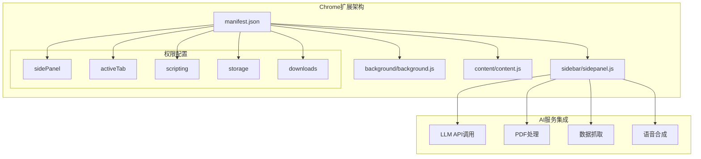

**图表来源**
- [manifest.json:1-48](file://manifest.json#L1-L48)
- [background.js:1-307](file://background/background.js#L1-L307)
- [sidepanel.js:1-800](file://sidebar/sidepanel.js#L1-L800)

**章节来源**
- [manifest.json:1-48](file://manifest.json#L1-L48)
- [README.md:108-126](file://README.md#L108-L126)

## 核心组件

### LLM API调用系统

项目实现了统一的LLM API调用接口，支持多种提供商：

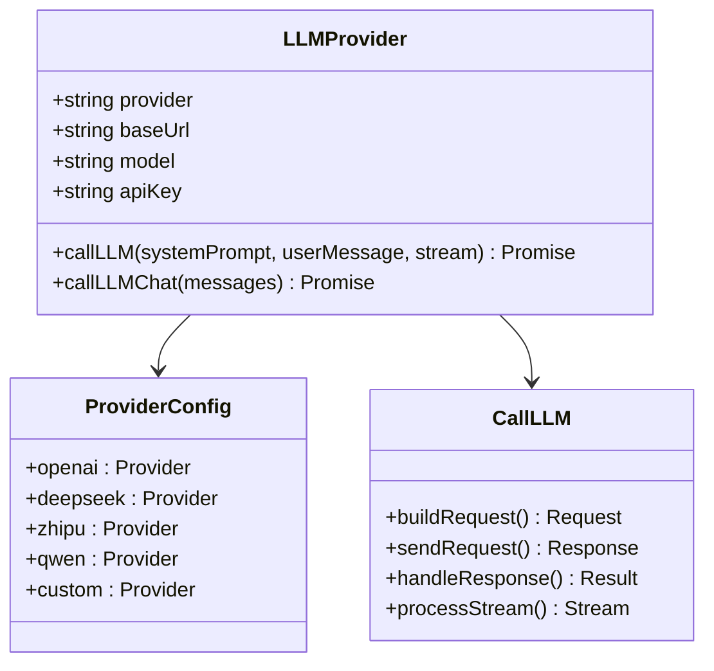

**图表来源**
- [sidepanel.js:417-423](file://sidebar/sidepanel.js#L417-L423)
- [sidepanel.js:529-534](file://sidebar/sidepanel.js#L529-L534)

### PDF处理管道

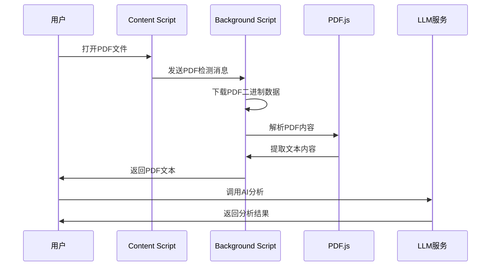

**图表来源**
- [content.js:11-28](file://content/content.js#L11-L28)
- [background.js:125-177](file://background/background.js#L125-L177)
- [sidepanel.js:2621-2697](file://sidebar/sidepanel.js#L2621-L2697)

**章节来源**
- [sidepanel.js:417-423](file://sidebar/sidepanel.js#L417-L423)
- [sidepanel.js:529-534](file://sidebar/sidepanel.js#L529-L534)

## 架构概览

项目采用分层架构设计，通过Chrome扩展的消息传递机制实现组件间通信：

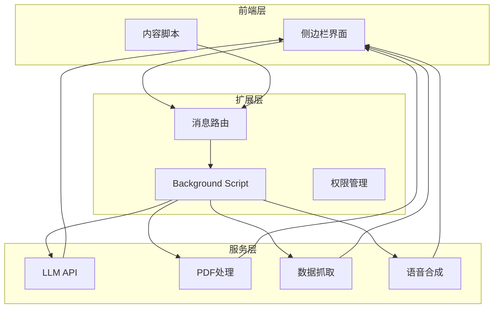

**图表来源**
- [background.js:37-117](file://background/background.js#L37-L117)
- [sidepanel.js:974-986](file://sidebar/sidepanel.js#L974-L986)

## 详细组件分析

### LLM API调用实现

#### 请求构建和参数配置

项目实现了灵活的LLM调用系统，支持多种提供商和配置选项：

**章节来源**
- [sidepanel.js:3361-3420](file://sidebar/sidepanel.js#L3361-L3420)
- [sidepanel.js:3396-3455](file://sidebar/sidepanel.js#L3396-L3455)

#### 同步和异步调用模式

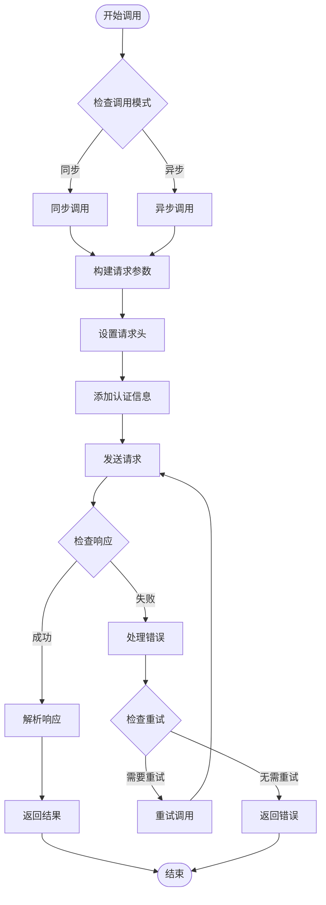

**图表来源**
- [sidepanel.js:3361-3420](file://sidebar/sidepanel.js#L3361-L3420)

#### 多提供商支持

项目内置支持多家LLM提供商，每家提供商都有特定的配置：

**章节来源**
- [sidepanel.js:417-423](file://sidebar/sidepanel.js#L417-L423)

### PDF处理和分析

#### PDF检测和下载

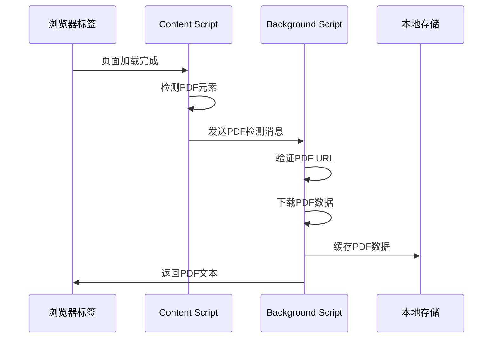

**图表来源**
- [content.js:11-28](file://content/content.js#L11-L28)
- [background.js:21-34](file://background/background.js#L21-L34)

#### PDF文本提取

**章节来源**
- [background.js:125-177](file://background/background.js#L125-L177)
- [sidepanel.js:2621-2697](file://sidebar/sidepanel.js#L2621-L2697)

### 数据抓取和热点分析

#### 多源数据抓取

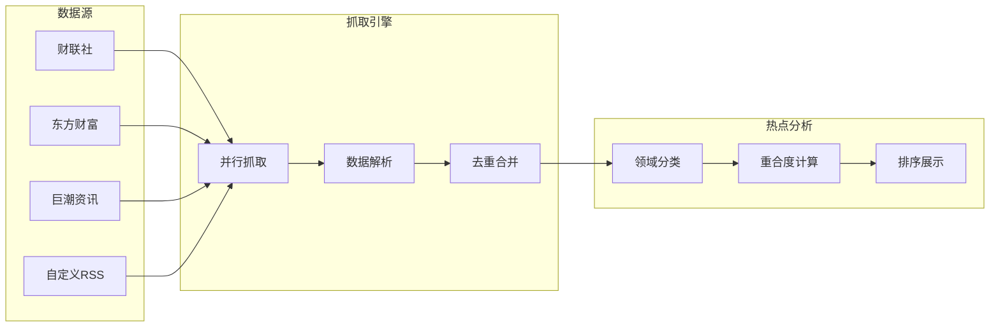

**图表来源**
- [sidepanel.js:1291-1363](file://sidebar/sidepanel.js#L1291-L1363)
- [sidepanel.js:1371-1492](file://sidebar/sidepanel.js#L1371-L1492)

**章节来源**
- [sidepanel.js:1073-1086](file://sidebar/sidepanel.js#L1073-L1086)
- [sidepanel.js:1091-1120](file://sidebar/sidepanel.js#L1091-L1120)
- [sidepanel.js:1125-1150](file://sidebar/sidepanel.js#L1125-L1150)

## 依赖关系分析

### 外部依赖

项目采用纯原生JavaScript实现，主要依赖以下外部服务：

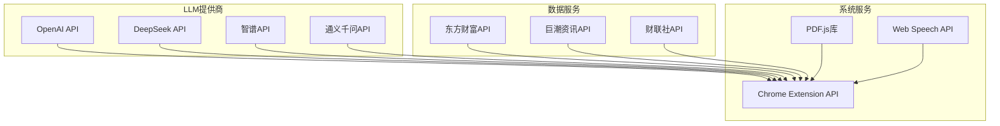

**图表来源**
- [README.md:134-136](file://README.md#L134-L136)
- [sidepanel.js:417-423](file://sidebar/sidepanel.js#L417-L423)

### 内部模块依赖

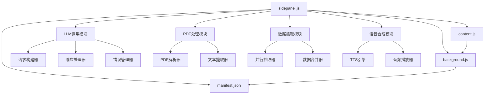

**图表来源**
- [sidepanel.js:1-800](file://sidebar/sidepanel.js#L1-L800)
- [background.js:1-307](file://background/background.js#L1-L307)

**章节来源**
- [manifest.json:6-30](file://manifest.json#L6-L30)
- [sidepanel.js:1-800](file://sidebar/sidepanel.js#L1-L800)

## 性能考虑

### 请求优化策略

项目实现了多项性能优化措施：

1. **并行数据抓取**：同时从多个数据源获取信息
2. **智能缓存机制**：利用localStorage存储用户设置和关注列表
3. **分块传输**：大PDF文件采用分块传输避免内存溢出
4. **请求去重**：热点数据抓取时进行去重处理

### 并发控制

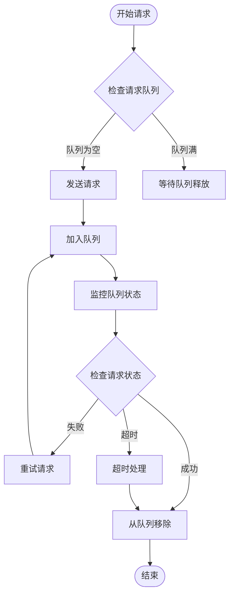

**图表来源**
- [sidepanel.js:1291-1363](file://sidebar/sidepanel.js#L1291-L1363)

### 内存管理

项目特别关注内存使用效率：

- PDF文件下载采用分块传输，支持20MB以上大文件
- 使用Uint8Array进行二进制数据处理
- 及时清理DOM节点和事件监听器
- 合理使用Promise和async/await避免回调地狱

## 故障排除指南

### 常见错误类型

1. **API密钥错误**：检查LLM提供商API Key配置
2. **网络连接问题**：验证网络连接和防火墙设置
3. **PDF解析失败**：检查PDF文件完整性
4. **内存不足**：处理大型PDF文件时的内存管理

### 错误处理机制

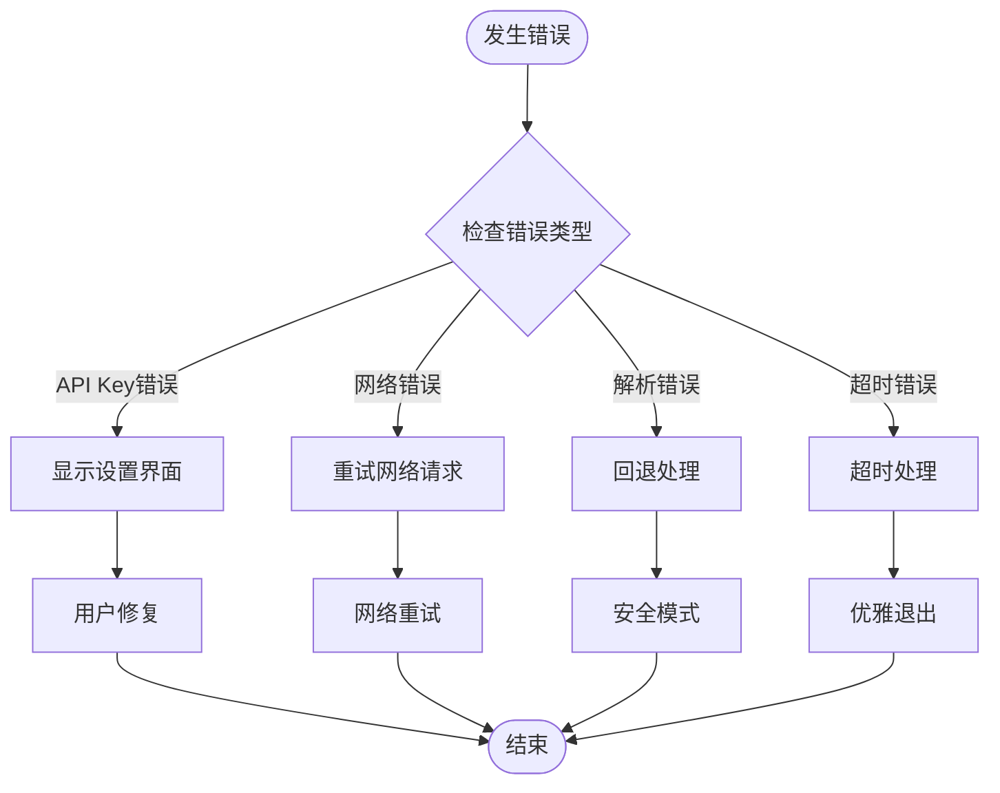

**图表来源**
- [sidepanel.js:2551-2563](file://sidebar/sidepanel.js#L2551-L2563)
- [sidepanel.js:3793-3801](file://sidebar/sidepanel.js#L3793-L3801)

### 调试技巧

1. **检查Chrome扩展控制台**：查看JavaScript错误日志
2. **验证API密钥**：在设置页面测试API连接
3. **监控网络请求**：使用Chrome DevTools Network面板
4. **调试PDF处理**：检查PDF.js解析状态

**章节来源**
- [sidepanel.js:2551-2563](file://sidebar/sidepanel.js#L2551-L2563)
- [sidepanel.js:3793-3801](file://sidebar/sidepanel.js#L3793-L3801)

## 结论

该项目展示了现代Chrome扩展应用的完整实现，特别是在AI服务集成方面的最佳实践。通过合理的架构设计和性能优化，实现了高效稳定的AI分析功能。

主要优势包括：
- 灵活的多提供商支持
- 高效的PDF处理管道
- 智能的数据抓取和分析
- 完善的错误处理和重试机制
- 优秀的用户体验设计

未来可以考虑的改进方向：
- 增加更多的LLM提供商支持
- 实现更智能的缓存策略
- 优化大数据量处理性能
- 增强离线功能支持