# LLM API集成

<cite>
**本文档引用的文件**
- [manifest.json](file://manifest.json)
- [background.js](file://background/background.js)
- [content.js](file://content/content.js)
- [sidepanel.js](file://sidebar/sidepanel.js)
- [sidepanel.html](file://sidebar/sidepanel.html)
- [options.html](file://sidebar/options.html)
- [README.md](file://README.md)
</cite>

## 目录
1. [简介](#简介)
2. [项目结构](#项目结构)
3. [核心组件](#核心组件)
4. [架构概览](#架构概览)
5. [详细组件分析](#详细组件分析)
6. [依赖关系分析](#依赖关系分析)
7. [性能考虑](#性能考虑)
8. [故障排除指南](#故障排除指南)
9. [结论](#结论)

## 简介

投资助手是一个基于Chrome扩展的价值投资AI分析工具，集成了多种LLM（大语言模型）服务提供商。该项目融合了巴菲特、林奇、费雪、芒格、格雷厄姆等多位价值投资大师的分析框架，为用户提供AI驱动的投资决策支持。

项目支持的AI服务提供商包括：OpenAI、DeepSeek、智谱（GLM）、通义千问（Qwen）以及自定义API。所有LLM调用均通过统一的API接口实现，确保了良好的可扩展性和兼容性。

## 项目结构

该项目采用Chrome扩展的标准架构，主要包含以下核心模块：

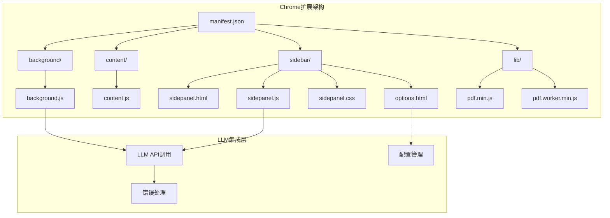

**图表来源**
- [manifest.json:1-48](file://manifest.json#L1-L48)
- [sidepanel.js:514-584](file://sidebar/sidepanel.js#L514-L584)

**章节来源**
- [manifest.json:1-48](file://manifest.json#L1-L48)
- [README.md:108-126](file://README.md#L108-L126)

## 核心组件

### LLM服务提供商配置

项目内置了5个预配置的LLM服务提供商，每个都包含基础URL和默认模型设置：

| 服务提供商 | 基础URL | 默认模型 | 特殊说明 |
|------------|---------|----------|----------|
| OpenAI | https://api.openai.com/v1 | gpt-4o | 官方API，支持流式输出 |
| DeepSeek | https://api.deepseek.com/v1 | deepseek-chat | 支持中文，性价比高 |
| 智谱 | https://open.bigmodel.cn/api/paas/v4 | glm-4 | 国产大模型，中文优化 |
| 通义千问 | https://dashscope.aliyuncs.com/compatible-mode/v1 | qwen-max | 阿里云API，稳定可靠 |
| 自定义 | 空字符串 | 空字符串 | 用户自定义API端点 |

### 设置状态管理

应用使用集中式的状态管理系统来维护LLM配置：

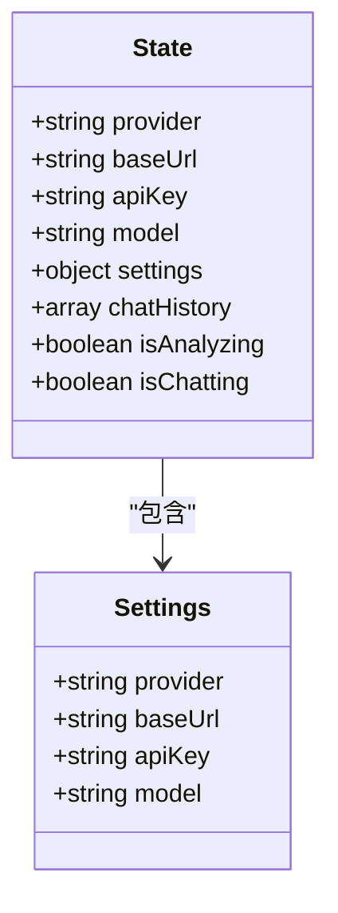

**图表来源**
- [sidepanel.js:516-584](file://sidebar/sidepanel.js#L516-L584)

**章节来源**
- [sidepanel.js:417-423](file://sidebar/sidepanel.js#L417-L423)
- [sidepanel.js:516-584](file://sidebar/sidepanel.js#L516-L584)

## 架构概览

项目采用分层架构设计，将LLM集成与UI逻辑分离：

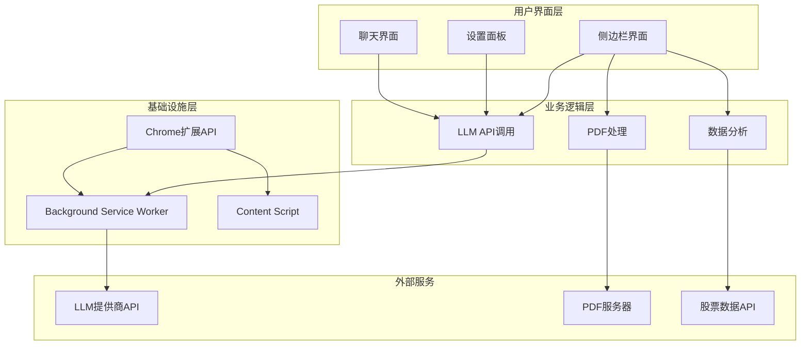

**图表来源**
- [sidepanel.js:3362-3425](file://sidebar/sidepanel.js#L3362-L3425)
- [background.js:125-177](file://background/background.js#L125-L177)

## 详细组件分析

### LLM API调用组件

#### 核心调用函数

项目实现了两个主要的LLM调用函数，分别用于不同的使用场景：

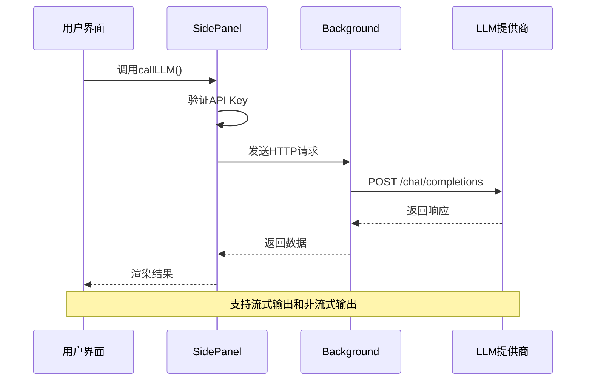

**图表来源**
- [sidepanel.js:3362-3395](file://sidebar/sidepanel.js#L3362-L3395)
- [sidepanel.js:3397-3425](file://sidebar/sidepanel.js#L3397-L3425)

#### 请求参数配置

LLM调用使用统一的参数配置：

| 参数 | 默认值 | 说明 |
|------|--------|------|
| model | 来自配置 | 指定使用的模型 |
| temperature | 0.3 | 生成随机性控制 |
| max_tokens | 8000 | 最大生成长度 |
| stream | false | 是否启用流式输出 |
| messages | 系统消息 + 用户消息 | 对话历史 |

#### 错误处理机制

系统实现了完善的错误处理机制：

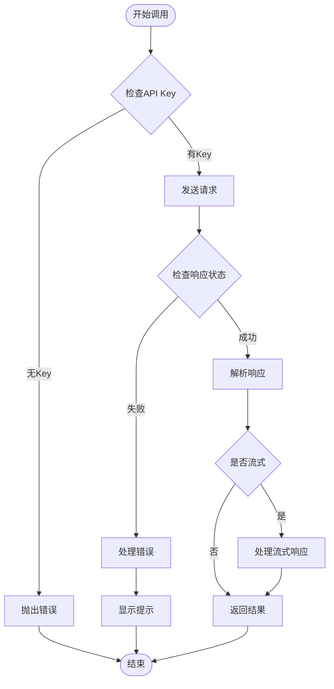

**图表来源**
- [sidepanel.js:3381-3395](file://sidebar/sidepanel.js#L3381-L3395)
- [sidepanel.js:3427-3452](file://sidebar/sidepanel.js#L3427-L3452)

**章节来源**
- [sidepanel.js:3362-3425](file://sidebar/sidepanel.js#L3362-L3425)
- [sidepanel.js:3427-3452](file://sidebar/sidepanel.js#L3427-L3452)

### 设置管理组件

#### 配置界面

设置界面提供了直观的配置选项：

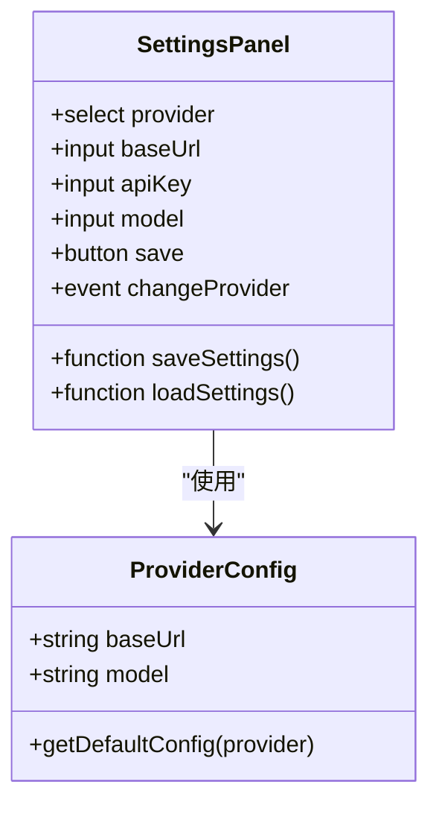

**图表来源**
- [sidepanel.html:564-617](file://sidebar/sidepanel.html#L564-L617)
- [options.html:73-121](file://sidebar/options.html#L73-L121)

#### 配置持久化

设置信息使用localStorage进行持久化存储：

| 存储键 | 数据类型 | 描述 |
|--------|----------|------|
| er_settings | JSON对象 | LLM配置信息 |
| provider | 字符串 | 选择的服务商 |
| baseUrl | 字符串 | API基础URL |
| apiKey | 字符串 | 认证密钥 |
| model | 字符串 | 模型名称 |

**章节来源**
- [sidepanel.js:609-637](file://sidebar/sidepanel.js#L609-L637)
- [options.html:81-121](file://sidebar/options.html#L81-L121)

### PDF处理组件

#### PDF检测与下载

项目实现了完整的PDF处理流程：

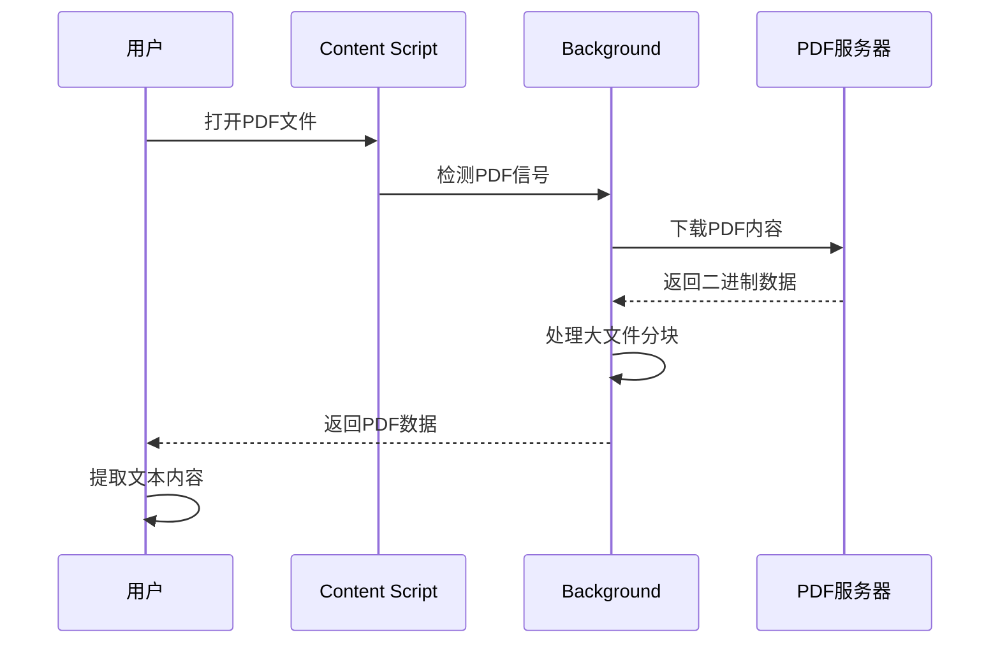

**图表来源**
- [content.js:11-36](file://content/content.js#L11-L36)
- [background.js:125-177](file://background/background.js#L125-L177)

#### PDF数据处理

系统支持多种PDF处理场景：

| 处理类型 | 说明 | 限制 |
|----------|------|------|
| 直接PDF链接 | 直接下载PDF文件 | 支持chrome://pdf-viewer/ |
| 嵌入式PDF | 检测网页中的PDF元素 | 仅限普通网页 |
| 大文件处理 | >10MB自动分块传输 | 单块最大10MB |
| 格式验证 | 验证Content-Type | 支持application/pdf |

**章节来源**
- [content.js:11-36](file://content/content.js#L11-L36)
- [background.js:125-177](file://background/background.js#L125-L177)

## 依赖关系分析

### 外部依赖

项目采用纯JavaScript实现，避免了额外的依赖：

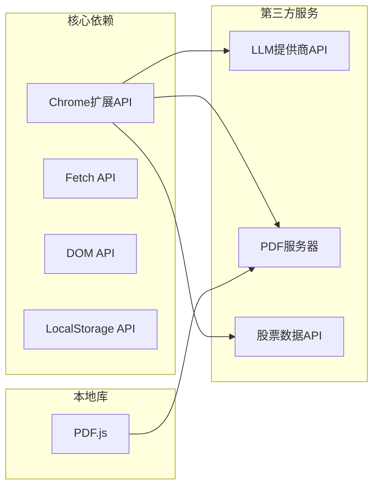

**图表来源**
- [manifest.json:6-30](file://manifest.json#L6-L30)
- [sidepanel.js:3362-3425](file://sidebar/sidepanel.js#L3362-L3425)

### 内部模块依赖

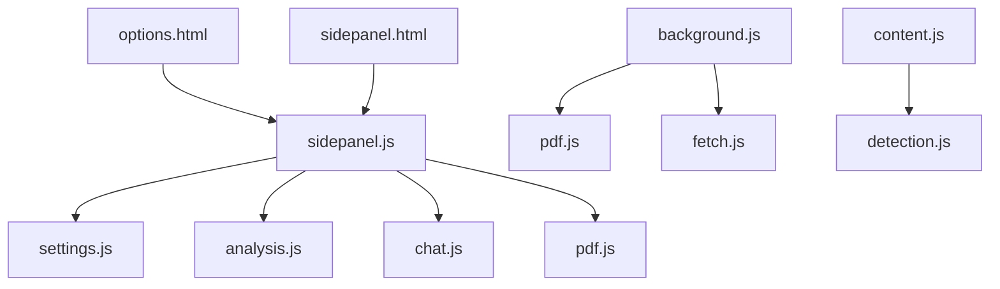

**图表来源**
- [sidepanel.js:589-607](file://sidebar/sidepanel.js#L589-L607)
- [background.js:11-117](file://background/background.js#L11-L117)

**章节来源**
- [manifest.json:6-30](file://manifest.json#L6-L30)
- [sidepanel.js:589-607](file://sidebar/sidepanel.js#L589-L607)

## 性能考虑

### 流式输出优化

系统实现了高效的流式输出机制，提升用户体验：

- **实时渲染**：流式响应实时显示，减少等待时间
- **内存优化**：使用增量渲染，避免大量DOM操作
- **断点续传**：支持流式输出的中断和恢复

### 缓存策略

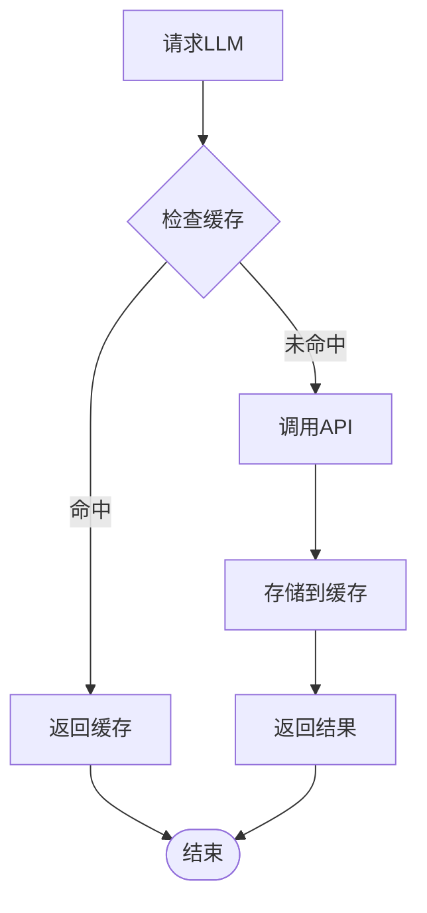

### 并发控制

系统实现了合理的并发控制机制：

| 功能模块 | 并发限制 | 说明 |
|----------|----------|------|
| LLM调用 | 1个活跃请求 | 防止API过载 |
| PDF下载 | 1个活跃请求 | 避免网络拥塞 |
| 数据分析 | 1个活跃请求 | 确保数据一致性 |

## 故障排除指南

### 常见问题诊断

#### API Key相关问题

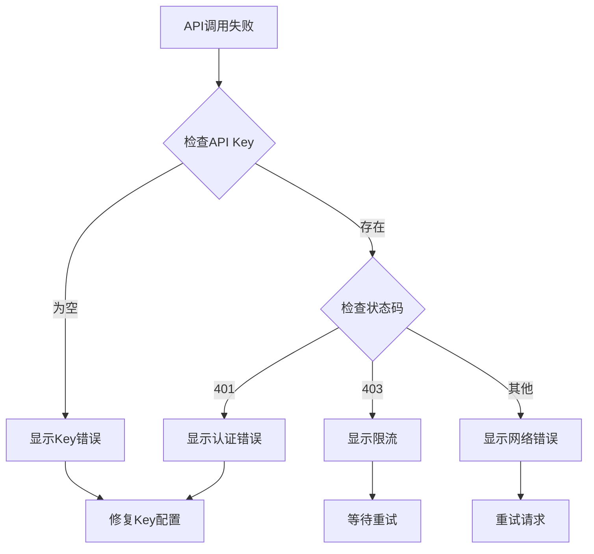

#### 网络连接问题

系统提供了多层次的网络错误处理：

| 错误类型 | 诊断方法 | 解决方案 |
|----------|----------|----------|
| DNS解析失败 | 检查网络连接 | 切换网络环境 |
| 连接超时 | 测试API可用性 | 调整超时设置 |
| SSL证书错误 | 验证证书有效性 | 更新系统时间 |
| 代理配置问题 | 检查代理设置 | 关闭代理或配置白名单 |

#### 流式输出问题

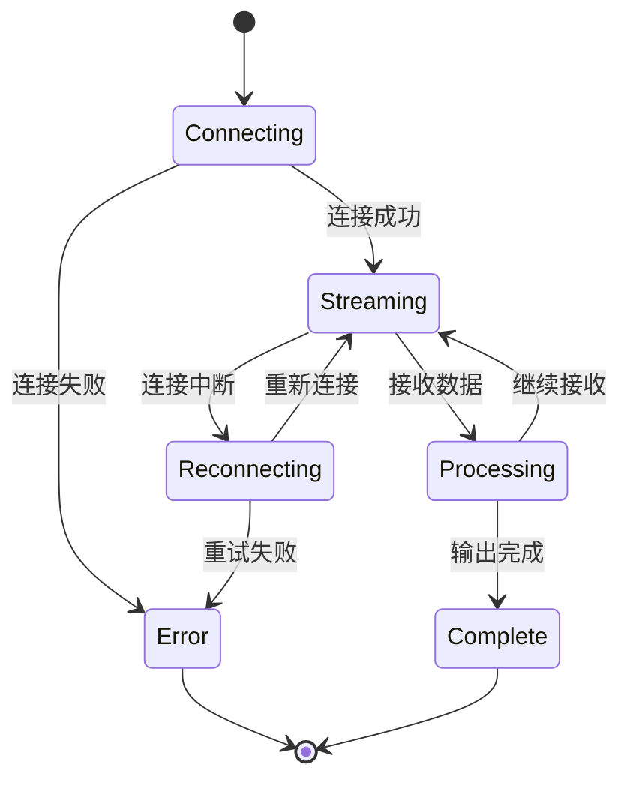

**章节来源**
- [sidepanel.js:3343-3358](file://sidebar/sidepanel.js#L3343-L3358)
- [sidepanel.js:3427-3452](file://sidebar/sidepanel.js#L3427-L3452)

### 调试工具

#### 开发者工具

系统提供了丰富的调试功能：

- **控制台日志**：详细的API调用日志
- **状态监控**：实时显示应用状态
- **错误追踪**：完整的错误堆栈信息
- **性能分析**：调用耗时统计

#### 日志记录

```javascript
// 示例：API调用日志
console.log('LLM调用开始', {
  provider: state.settings.provider,
  model: state.settings.model,
  timestamp: Date.now()
});

// 示例：错误日志
console.error('LLM调用失败', {
  error: error.message,
  status: response.status,
  timestamp: Date.now()
});
```

## 结论

投资助手的LLM API集成为用户提供了强大而灵活的AI分析能力。通过统一的接口设计和完善的错误处理机制，系统能够在多个LLM服务提供商之间无缝切换，同时保证了良好的用户体验和稳定性。

### 主要优势

1. **多提供商支持**：支持5个主流LLM服务提供商，满足不同需求
2. **统一接口**：抽象化的API调用接口，便于扩展和维护
3. **错误处理**：完善的错误处理和重试机制
4. **性能优化**：流式输出和缓存策略提升响应速度
5. **安全性**：API Key本地存储，保护用户隐私

### 未来改进方向

1. **配置管理**：增加配置模板和批量导入功能
2. **监控增强**：添加详细的使用统计和性能监控
3. **国际化**：支持多语言界面和提示信息
4. **插件扩展**：开放插件接口，支持自定义分析模块

该系统为价值投资分析提供了强大的技术支持，通过AI驱动的深度分析，帮助用户做出更明智的投资决策。