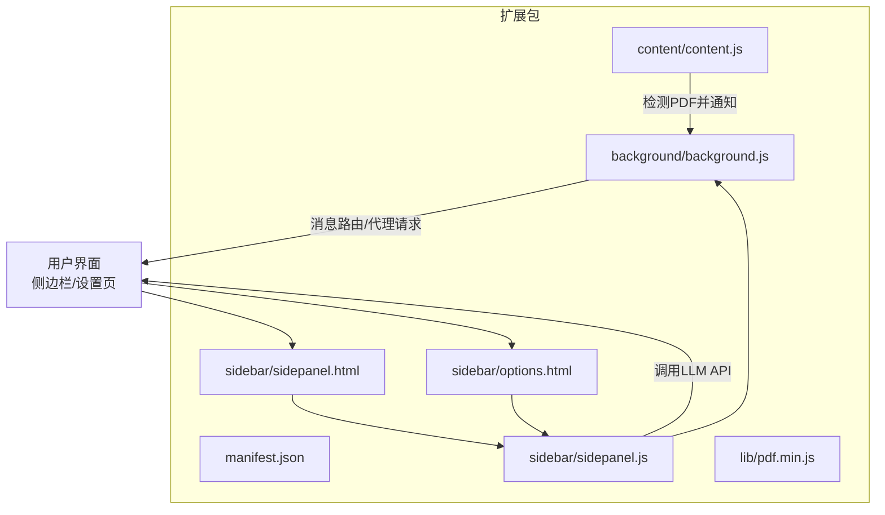
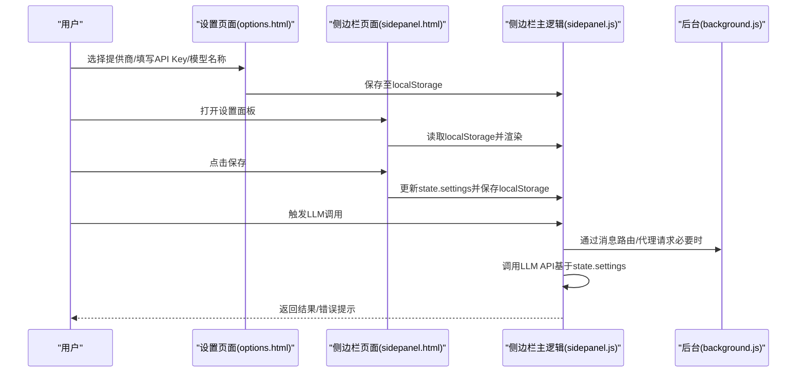
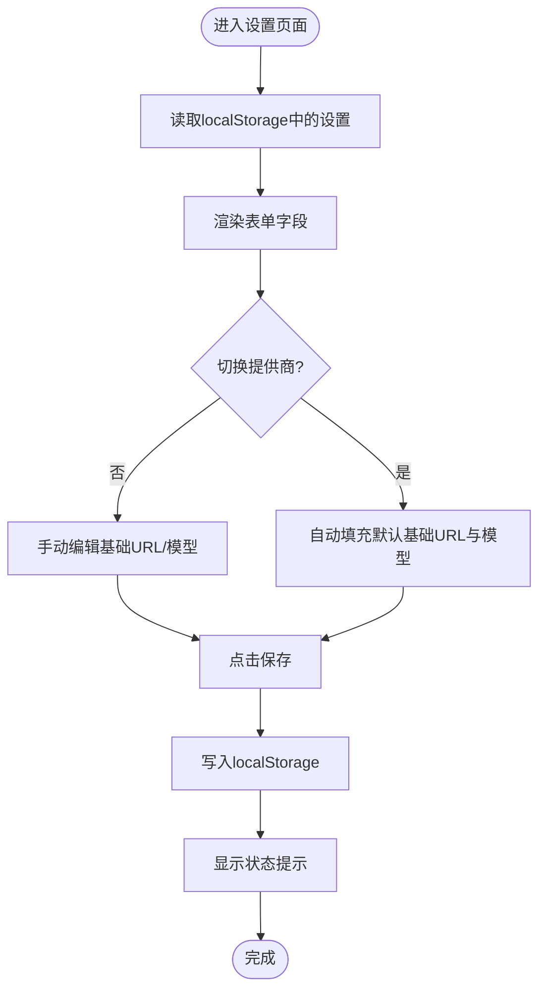
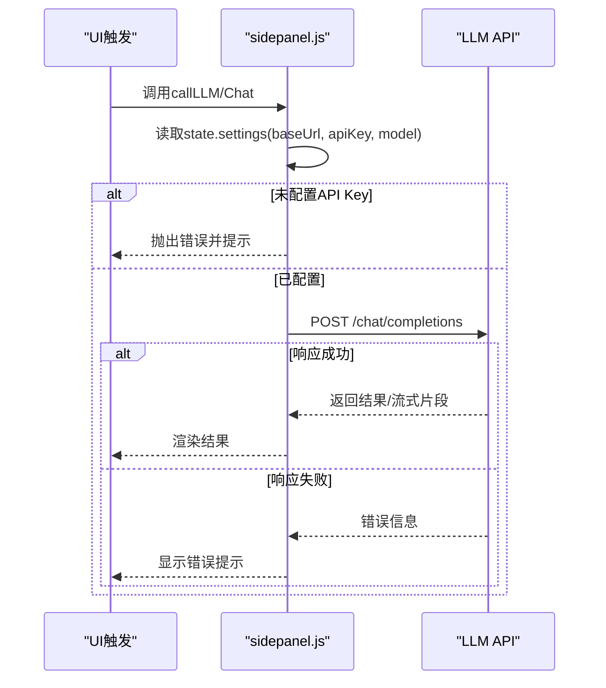
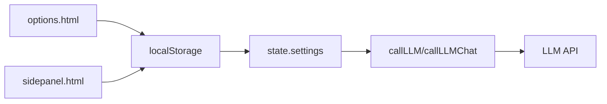

# 提供商配置

<cite>
**本文引用的文件**
- [manifest.json](file://manifest.json)
- [options.html](file://sidebar/options.html)
- [sidepanel.html](file://sidebar/sidepanel.html)
- [sidepanel.js](file://sidebar/sidepanel.js)
- [background.js](file://background/background.js)
- [content.js](file://content/content.js)
- [README.md](file://README.md)
</cite>

## 目录
1. [简介](#简介)
2. [项目结构](#项目结构)
3. [核心组件](#核心组件)
4. [架构总览](#架构总览)
5. [详细组件分析](#详细组件分析)
6. [依赖关系分析](#依赖关系分析)
7. [性能考量](#性能考量)
8. [故障排除指南](#故障排除指南)
9. [结论](#结论)
10. [附录](#附录)

## 简介
本文件面向“AI服务提供商配置”，围绕Chrome扩展中的LLM（大语言模型）提供商设置进行系统化说明。内容涵盖：
- 设置面板中如何配置不同AI服务提供商（基础URL、API密钥、模型名称）
- 默认提供商配置与自定义API配置的差异与使用场景
- 完整配置步骤（获取API密钥、保存设置、验证配置）
- 常见配置问题与故障排除
- 配置模板与示例参考

## 项目结构
该项目采用Chrome扩展Manifest V3架构，侧边栏作为主界面，设置页面位于独立HTML中，LLM调用逻辑集中在侧边栏主逻辑文件中。



图表来源
- [manifest.json:1-48](file://manifest.json#L1-L48)
- [sidepanel.html:1-646](file://sidebar/sidepanel.html#L1-L646)
- [options.html:1-124](file://sidebar/options.html#L1-L124)
- [sidepanel.js:1-800](file://sidebar/sidepanel.js#L1-L800)
- [background.js:1-307](file://background/background.js#L1-L307)
- [content.js:1-36](file://content/content.js#L1-L36)

章节来源
- [manifest.json:1-48](file://manifest.json#L1-L48)
- [sidepanel.html:1-646](file://sidebar/sidepanel.html#L1-L646)
- [options.html:1-124](file://sidebar/options.html#L1-L124)
- [sidepanel.js:1-800](file://sidebar/sidepanel.js#L1-L800)
- [background.js:1-307](file://background/background.js#L1-L307)
- [content.js:1-36](file://content/content.js#L1-L36)

## 核心组件
- 设置页面（options.html）：提供LLM提供商选择、基础URL、API Key、模型名称输入与保存功能。
- 侧边栏页面（sidepanel.html）：提供设置面板（与options.html结构一致），用于在扩展运行时修改LLM配置。
- 侧边栏主逻辑（sidepanel.js）：负责加载/保存设置、切换提供商、调用LLM API、错误处理与状态反馈。
- 背景脚本（background.js）：负责消息路由、代理fetch、PDF下载等后台任务。
- 内容脚本（content.js）：在普通网页中检测嵌入式PDF并通知后台。

章节来源
- [options.html:46-120](file://sidebar/options.html#L46-L120)
- [sidepanel.html:564-617](file://sidebar/sidepanel.html#L564-L617)
- [sidepanel.js:609-637](file://sidebar/sidepanel.js#L609-L637)
- [sidepanel.js:3361-3425](file://sidebar/sidepanel.js#L3361-L3425)
- [background.js:36-117](file://background/background.js#L36-L117)
- [content.js:11-36](file://content/content.js#L11-L36)

## 架构总览
LLM配置在前端（侧边栏/设置页）通过localStorage持久化，运行时由侧边栏主逻辑读取并用于调用LLM API。默认提供商配置与自定义API配置在设置页面中通过下拉框切换，自动填充基础URL与模型名称。



图表来源
- [options.html:81-120](file://sidebar/options.html#L81-L120)
- [sidepanel.html:564-617](file://sidebar/sidepanel.html#L564-L617)
- [sidepanel.js:609-637](file://sidebar/sidepanel.js#L609-L637)
- [sidepanel.js:3361-3425](file://sidebar/sidepanel.js#L3361-L3425)
- [background.js:36-117](file://background/background.js#L36-L117)

## 详细组件分析

### 设置页面与侧边栏设置面板
- 提供商选择：支持OpenAI、DeepSeek、智谱、通义千问、自定义API。
- 字段说明：
  - LLM 服务商：下拉选择，默认值来自localStorage或默认提供商。
  - API 地址：基础URL，自定义时需手动填写。
  - API Key：敏感信息，保存在localStorage。
  - 模型名称：对应服务商的模型标识。
- 保存行为：点击保存后写入localStorage，并在界面上显示成功/错误状态提示。



图表来源
- [options.html:81-120](file://sidebar/options.html#L81-L120)
- [sidepanel.html:564-617](file://sidebar/sidepanel.html#L564-L617)
- [sidepanel.js:609-637](file://sidebar/sidepanel.js#L609-L637)

章节来源
- [options.html:46-120](file://sidebar/options.html#L46-L120)
- [sidepanel.html:564-617](file://sidebar/sidepanel.html#L564-L617)
- [sidepanel.js:609-637](file://sidebar/sidepanel.js#L609-L637)

### 默认提供商配置与自定义API配置
- 默认提供商配置（DEFAULT_PROVIDERS）：
  - OpenAI：基础URL与模型名称
  - DeepSeek：基础URL与模型名称
  - 智谱：基础URL与模型名称
  - 通义千问：基础URL与模型名称
  - 自定义：基础URL与模型名称留空，需用户自行填写
- 自定义API配置：
  - 适用于非上述默认服务商，或需要使用私有部署/代理服务。
  - 需要用户提供正确的基础URL与模型名称。

```mermaid
classDiagram
class DEFAULT_PROVIDERS {
+openai : {baseUrl, model}
+deepseek : {baseUrl, model}
+zhipu : {baseUrl, model}
+qwen : {baseUrl, model}
+custom : {baseUrl, model}
}
class SettingsState {
+provider : string
+baseUrl : string
+apiKey : string
+model : string
}
DEFAULT_PROVIDERS --> SettingsState : "初始化/填充"
```

图表来源
- [options.html:73-79](file://sidebar/options.html#L73-L79)
- [sidepanel.js:417-423](file://sidebar/sidepanel.js#L417-L423)
- [sidepanel.js:529-534](file://sidebar/sidepanel.js#L529-L534)

章节来源
- [options.html:73-79](file://sidebar/options.html#L73-L79)
- [sidepanel.js:417-423](file://sidebar/sidepanel.js#L417-L423)
- [sidepanel.js:529-534](file://sidebar/sidepanel.js#L529-L534)

### LLM调用流程与错误处理
- 调用入口：
  - 选股器：调用callLLM，传入系统提示与用户消息，支持流式输出。
  - 财报解读/股票分析：调用callLLM，传入系统提示与用户消息，支持流式输出。
  - 对话：调用callLLMChat，传入历史消息，支持流式输出。
- 错误处理：
  - 未配置API Key：抛出错误并提示用户配置。
  - API请求失败：解析响应错误信息并提示。
  - 401/无效API Key：提示无效并引导用户打开设置页面。



图表来源
- [sidepanel.js:3361-3425](file://sidebar/sidepanel.js#L3361-L3425)
- [sidepanel.js:2511-2562](file://sidebar/sidepanel.js#L2511-L2562)

章节来源
- [sidepanel.js:3361-3425](file://sidebar/sidepanel.js#L3361-L3425)
- [sidepanel.js:2511-2562](file://sidebar/sidepanel.js#L2511-L2562)

### 配置模板与示例
- 默认提供商模板（用于参考）：
  - OpenAI：基础URL与模型名称
  - DeepSeek：基础URL与模型名称
  - 智谱：基础URL与模型名称
  - 通义千问：基础URL与模型名称
  - 自定义：基础URL与模型名称留空
- 示例字段说明：
  - 基础URL：通常为服务商的OpenAI兼容API端点（末尾不带斜杠）。
  - API Key：从服务商后台获取的密钥。
  - 模型名称：对应服务商的模型标识符。

章节来源
- [options.html:73-79](file://sidebar/options.html#L73-L79)
- [sidepanel.js:417-423](file://sidebar/sidepanel.js#L417-L423)

## 依赖关系分析
- 设置页面与侧边栏设置面板共享相同的字段与保存逻辑。
- 侧边栏主逻辑负责读取localStorage并将其注入到运行时状态中。
- LLM调用依赖state.settings中的provider、baseUrl、apiKey、model。
- 背景脚本提供消息路由与代理fetch能力，用于热点数据抓取等场景（与LLM配置无直接耦合）。



图表来源
- [options.html:81-120](file://sidebar/options.html#L81-L120)
- [sidepanel.html:564-617](file://sidebar/sidepanel.html#L564-L617)
- [sidepanel.js:609-637](file://sidebar/sidepanel.js#L609-L637)
- [sidepanel.js:3361-3425](file://sidebar/sidepanel.js#L3361-L3425)

章节来源
- [options.html:81-120](file://sidebar/options.html#L81-L120)
- [sidepanel.html:564-617](file://sidebar/sidepanel.html#L564-L617)
- [sidepanel.js:609-637](file://sidebar/sidepanel.js#L609-L637)
- [sidepanel.js:3361-3425](file://sidebar/sidepanel.js#L3361-L3425)

## 性能考量
- 流式输出：LLM调用支持流式响应，提升交互体验。
- 本地存储：设置信息保存在localStorage，避免网络传输。
- 背景脚本代理：热点数据抓取通过后台脚本代理，减少前台阻塞。

## 故障排除指南
- 未配置API Key
  - 现象：调用LLM时报错“未配置 API Key”。
  - 处理：打开设置页面，填写API Key并保存。
- API Key无效
  - 现象：出现401或API Key相关错误。
  - 处理：检查API Key是否正确、是否过期；确保服务商支持OpenAI兼容接口。
- 基础URL错误
  - 现象：请求失败或返回未知错误。
  - 处理：确认基础URL末尾不带斜杠；确保使用OpenAI兼容端点。
- 模型名称不匹配
  - 现象：模型不存在或调用失败。
  - 处理：核对模型名称是否与服务商一致。
- 自定义API配置
  - 现象：自定义基础URL/模型导致调用失败。
  - 处理：确保基础URL为OpenAI兼容端点，模型名称正确；必要时联系服务商确认接口规范。

章节来源
- [sidepanel.js:3361-3425](file://sidebar/sidepanel.js#L3361-L3425)
- [sidepanel.js:2511-2562](file://sidebar/sidepanel.js#L2511-L2562)

## 结论
本扩展提供了完善的LLM提供商配置能力，支持默认提供商与自定义API两种模式。通过设置页面与侧边栏设置面板，用户可以便捷地切换提供商、填写API Key与模型名称，并在运行时即时生效。建议在首次使用时优先选择默认提供商，若需使用私有部署或特殊代理，再切换至自定义API并正确填写基础URL与模型名称。

## 附录

### 配置步骤清单
- 打开扩展设置页面（设置/侧边栏设置面板）
- 选择LLM服务商（默认提供商之一或“自定义API”）
- 填写API Key
- 若选择“自定义API”，填写基础URL与模型名称
- 点击保存，查看状态提示
- 打开侧边栏，触发一次LLM调用以验证配置

章节来源
- [options.html:46-120](file://sidebar/options.html#L46-L120)
- [sidepanel.html:564-617](file://sidebar/sidepanel.html#L564-L617)
- [sidepanel.js:609-637](file://sidebar/sidepanel.js#L609-L637)

### 获取API密钥与验证配置
- 获取API密钥：在对应服务商后台创建密钥并复制。
- 验证配置：在侧边栏中触发一次LLM调用（如选股器或对话），观察是否返回结果或错误提示。

章节来源
- [README.md:92-107](file://README.md#L92-L107)
- [sidepanel.js:3361-3425](file://sidebar/sidepanel.js#L3361-L3425)