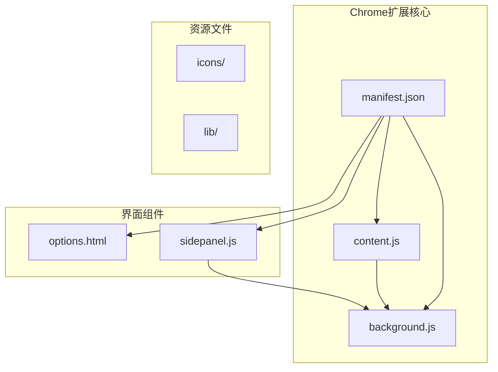
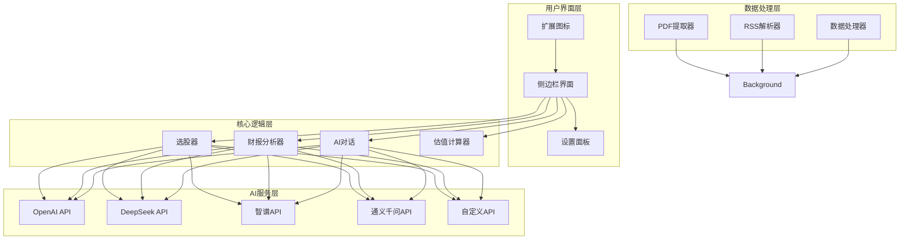
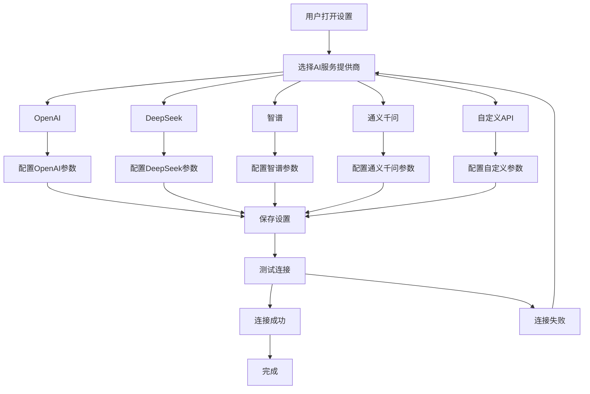
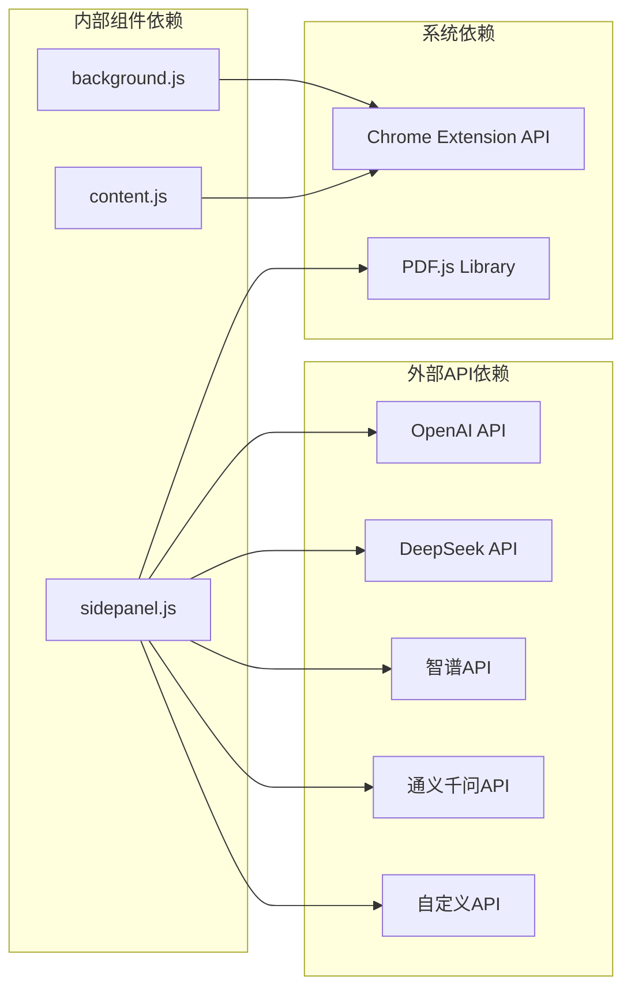

# 支持的AI服务提供商

<cite>
**本文档引用的文件**
- [manifest.json](file://manifest.json)
- [background.js](file://background/background.js)
- [content.js](file://content/content.js)
- [sidepanel.js](file://sidebar/sidepanel.js)
- [options.html](file://sidebar/options.html)
</cite>

## 目录
1. [简介](#简介)
2. [项目结构](#项目结构)
3. [核心组件](#核心组件)
4. [架构概览](#架构概览)
5. [详细组件分析](#详细组件分析)
6. [依赖分析](#依赖分析)
7. [性能考虑](#性能考虑)
8. [故障排除指南](#故障排除指南)
9. [结论](#结论)

## 简介

本项目是一个Chrome扩展程序，名为"投资助手"，提供AI驱动的投资决策支持。该项目集成了多个AI服务提供商，包括OpenAI、DeepSeek、智谱、通义千问和自定义API，为用户提供财报解读、股票分析、AI对话等核心功能。

该项目的核心特色包括：
- 多AI服务提供商支持
- 财报PDF自动检测和解读
- 价值投资策略模板
- 实时热点信息抓取
- 股票分析框架
- AI对话功能

## 项目结构

项目采用Chrome扩展的标准目录结构，主要包含以下组件：

**图表来源**
- [manifest.json:1-48](file://manifest.json#L1-L48)
- [background.js:1-307](file://background/background.js#L1-L307)
- [sidepanel.js:1-800](file://sidebar/sidepanel.js#L1-L800)

**章节来源**
- [manifest.json:1-48](file://manifest.json#L1-L48)
- [background.js:1-307](file://background/background.js#L1-L307)
- [content.js:1-36](file://content/content.js#L1-L36)

## 核心组件

### AI服务提供商配置

项目内置了五个AI服务提供商的配置，每个提供商都有其特定的基础URL、模型名称和认证方式：

| 服务提供商 | 基础URL | 默认模型 | 认证方式 | 特点 |
|------------|---------|----------|----------|------|
| OpenAI | https://api.openai.com/v1 | gpt-4o | API Key | 国际化程度高，支持多语言 |
| DeepSeek | https://api.deepseek.com/v1 | deepseek-chat | API Key | 中国本土化，延迟较低 |
| 智谱 | https://open.bigmodel.cn/api/paas/v4 | glm-4 | API Key | 国产大模型，中文理解强 |
| 通义千问 | https://dashscope.aliyuncs.com/compatible-mode/v1 | qwen-max | API Key | 阿里系生态，稳定性好 |
| 自定义 | 空 | 空 | API Key | 支持第三方API |

### 设置管理

用户可以通过设置面板配置AI服务提供商，包括：
- 选择服务提供商
- 配置API地址
- 输入API密钥
- 设置模型名称

**章节来源**
- [sidepanel.js:417-423](file://sidebar/sidepanel.js#L417-L423)
- [sidepanel.js:529-534](file://sidebar/sidepanel.js#L529-L534)
- [options.html:73-79](file://sidebar/options.html#L73-L79)

## 架构概览

项目采用Chrome扩展的标准架构，包含以下关键组件：

**图表来源**
- [sidepanel.js:14-297](file://sidebar/sidepanel.js#L14-L297)
- [sidepanel.js:417-423](file://sidebar/sidepanel.js#L417-L423)
- [background.js:36-117](file://background/background.js#L36-L117)

## 详细组件分析

### AI服务提供商选择器

项目提供了直观的AI服务提供商选择界面，用户可以根据需求选择最适合的服务：

**图表来源**
- [options.html:47-53](file://sidebar/options.html#L47-L53)
- [sidepanel.js:648-657](file://sidebar/sidepanel.js#L648-L657)

### 默认配置参数

每个AI服务提供商都有其默认配置参数：

#### OpenAI配置
- 基础URL: `https://api.openai.com/v1`
- 默认模型: `gpt-4o`
- 认证方式: API Key
- 适用场景: 国际化内容处理、多语言支持

#### DeepSeek配置
- 基础URL: `https://api.deepseek.com/v1`
- 默认模型: `deepseek-chat`
- 认证方式: API Key
- 适用场景: 中国本土化、低延迟访问

#### 智谱配置
- 基础URL: `https://open.bigmodel.cn/api/paas/v4`
- 默认模型: `glm-4`
- 认证方式: API Key
- 适用场景: 中文理解、本地化处理

#### 通义千问配置
- 基础URL: `https://dashscope.aliyuncs.com/compatible-mode/v1`
- 默认模型: `qwen-max`
- 认证方式: API Key
- 适用场景: 阿里生态集成、稳定性好

#### 自定义配置
- 基础URL: 空
- 默认模型: 空
- 认证方式: API Key
- 适用场景: 第三方API集成

**章节来源**
- [sidepanel.js:417-423](file://sidebar/sidepanel.js#L417-L423)
- [options.html:73-79](file://sidebar/options.html#L73-L79)

### 服务提供商选择指南

根据不同的使用场景和需求，推荐选择相应的AI服务提供商：

#### 选择OpenAI的情况
- 需要处理多语言内容
- 要求国际化程度高的AI模型
- 对英文内容处理有特殊需求
- 预算充足，追求模型质量

#### 选择DeepSeek的情况
- 主要使用中文内容
- 优先考虑低延迟访问
- 需要性价比高的解决方案
- 重视中国本土化服务

#### 选择智谱的情况
- 对中文理解和生成有特殊要求
- 需要国产化AI服务
- 重视数据安全和隐私保护
- 需要中文语境下的专业理解

#### 选择通义千问的情况
- 需要与阿里生态集成
- 重视服务稳定性和可靠性
- 需要企业级支持
- 重视技术支持质量

#### 选择自定义的情况
- 使用专用的AI服务
- 需要私有化部署
- 有特殊的API要求
- 需要定制化的AI功能

### API限制、价格和性能特点对比

由于API限制和价格信息会随时间变化，以下是基于项目配置的通用对比：

#### 性能特点
- **延迟**: DeepSeek和智谱通常具有更低的延迟
- **准确性**: OpenAI在多语言处理方面表现优异
- **稳定性**: 通义千问服务稳定性较好
- **成本**: 自定义API通常最具成本效益

#### 适用场景
- **实时分析**: DeepSeek和智谱适合实时性要求高的场景
- **批量处理**: OpenAI适合大规模数据分析
- **企业应用**: 通义千问适合企业级应用
- **个性化需求**: 自定义API满足特殊需求

## 依赖分析

项目对外部依赖的分析如下：

**图表来源**
- [sidepanel.js:3361-3400](file://sidebar/sidepanel.js#L3361-L3400)
- [background.js:1073-1086](file://background/background.js#L1073-L1086)

**章节来源**
- [sidepanel.js:3361-3400](file://sidebar/sidepanel.js#L3361-L3400)
- [background.js:1073-1086](file://background/background.js#L1073-L1086)

## 性能考虑

### 缓存策略
项目实现了多层次的缓存机制来优化性能：
- 本地存储设置配置
- 浏览器存储热点信息
- PDF内容分块传输

### 并发处理
- 多数据源并行抓取
- 异步API调用
- 非阻塞UI更新

### 资源管理
- PDF文件分块下载
- 内存使用优化
- 网络请求限制

## 故障排除指南

### 常见问题及解决方案

#### API连接失败
**症状**: 设置保存后出现连接错误
**解决方案**:
1. 检查API Key是否正确
2. 验证网络连接
3. 确认服务提供商状态
4. 重新配置服务

#### PDF处理问题
**症状**: PDF文件无法正常解析
**解决方案**:
1. 确认PDF文件可访问性
2. 检查文件大小限制
3. 验证PDF格式有效性
4. 尝试重新加载页面

#### 性能问题
**症状**: 页面响应缓慢
**解决方案**:
1. 清理浏览器缓存
2. 关闭不必要的标签页
3. 检查网络连接速度
4. 调整并发请求设置

**章节来源**
- [sidepanel.js:2551-2563](file://sidebar/sidepanel.js#L2551-L2563)
- [background.js:173-177](file://background/background.js#L173-L177)

## 结论

本项目提供了完整的AI服务提供商支持体系，通过灵活的配置选项和强大的功能集合，为用户提供了一站式的投资决策支持。各个AI服务提供商各有特色，用户可以根据具体需求选择最适合的服务。

项目的优势包括：
- 多服务提供商支持，提高可用性
- 完善的配置管理
- 丰富的投资分析功能
- 用户友好的界面设计

建议用户在选择AI服务提供商时，综合考虑性能、成本、功能需求等因素，以获得最佳的使用体验。