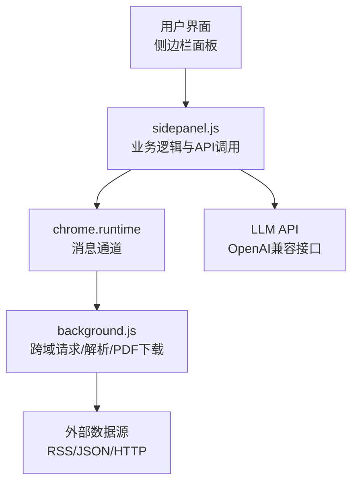
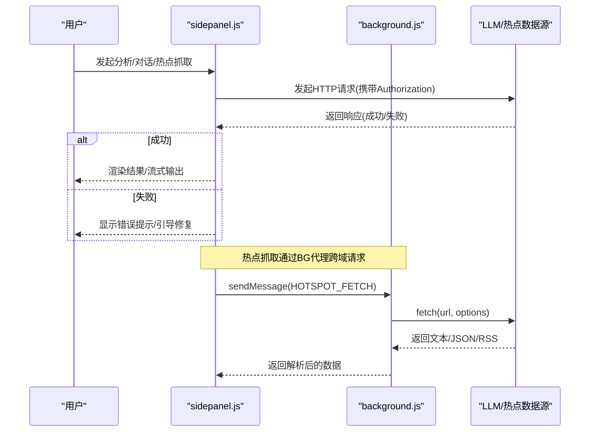
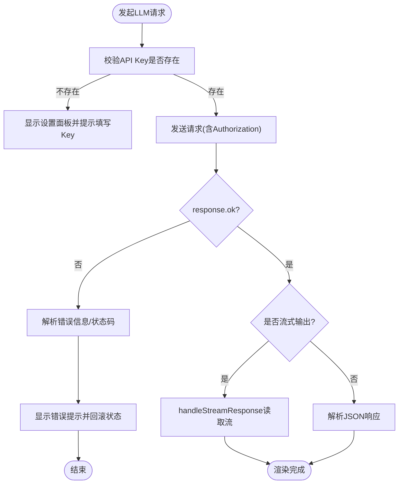
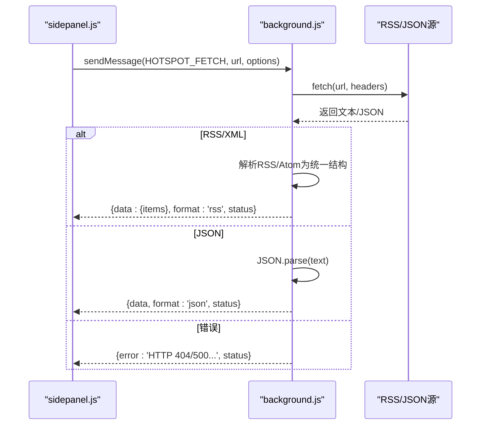
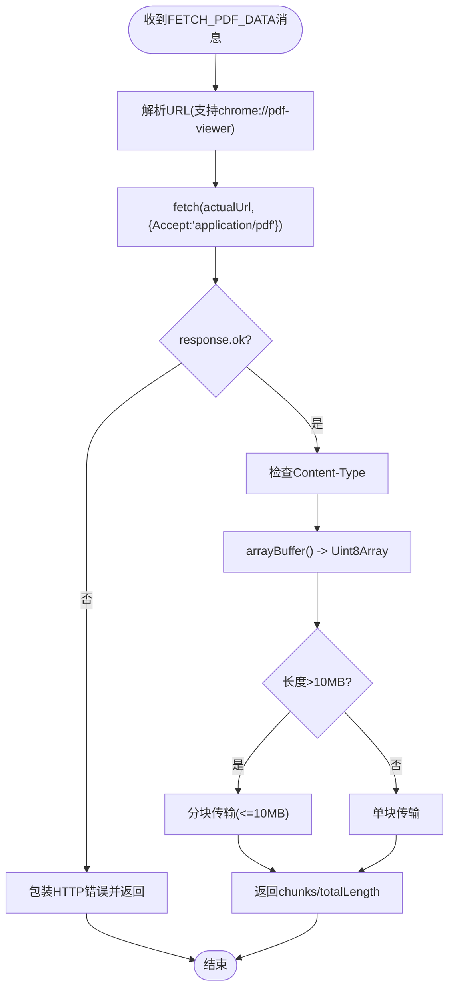
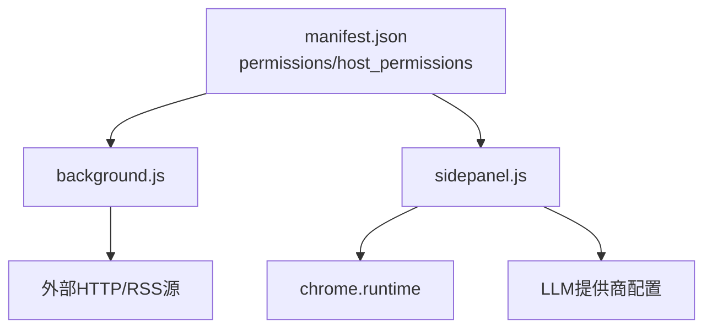

# 错误处理与重试

<cite>
**本文引用的文件**
- [manifest.json](file://manifest.json)
- [background.js](file://background/background.js)
- [content.js](file://content/content.js)
- [sidepanel.js](file://sidebar/sidepanel.js)
- [sidepanel.html](file://sidebar/sidepanel.html)
- [options.html](file://sidebar/options.html)
- [README.md](file://README.md)
</cite>

## 目录
1. [简介](#简介)
2. [项目结构](#项目结构)
3. [核心组件](#核心组件)
4. [架构总览](#架构总览)
5. [详细组件分析](#详细组件分析)
6. [依赖分析](#依赖分析)
7. [性能考量](#性能考量)
8. [故障排查指南](#故障排查指南)
9. [结论](#结论)
10. [附录](#附录)

## 简介
本文件聚焦于本Chrome扩展中“AI服务API错误处理与重试机制”的实现与最佳实践，涵盖网络错误、认证失败、API限流与服务器错误的识别与处理策略，以及错误日志记录与监控建议。同时提供错误代码对照表、用户友好提示与恢复建议，帮助开发者与使用者在遇到问题时快速定位与解决。

## 项目结构
该项目采用Manifest V3架构，核心交互链路如下：
- 用户在侧边栏面板发起请求（如生成报告、对话、估值计算等）
- 侧边栏通过chrome.runtime向后台脚本(background.js)发送消息
- 后台脚本负责跨域请求、RSS/XML解析、PDF下载等
- LLM API调用由侧边栏直接发起（OpenAI兼容接口）

图表来源
- [sidepanel.js:1073-1086](file://sidebar/sidepanel.js#L1073-L1086)
- [background.js:65-117](file://background/background.js#L65-L117)
- [manifest.json:1-48](file://manifest.json#L1-L48)

章节来源
- [manifest.json:1-48](file://manifest.json#L1-L48)
- [sidepanel.js:1073-1086](file://sidebar/sidepanel.js#L1073-L1086)
- [background.js:65-117](file://background/background.js#L65-L117)

## 核心组件
- 侧边栏面板(sidepanel.js)：负责用户交互、LLM调用、热点抓取、数据源解析、错误提示与状态管理
- 后台脚本(background.js)：负责跨域HTTP请求、RSS/XML解析、PDF下载与消息路由
- 设置页面(options.html/sidepanel.html)：负责LLM提供商、API地址、API Key的配置与持久化

章节来源
- [sidepanel.js:516-584](file://sidebar/sidepanel.js#L516-L584)
- [background.js:1-117](file://background/background.js#L1-L117)
- [sidepanel.html:564-592](file://sidebar/sidepanel.html#L564-L592)
- [options.html:72-123](file://sidebar/options.html#L72-L123)

## 架构总览
LLM调用与热点抓取的关键流程如下：

图表来源
- [sidepanel.js:3362-3425](file://sidebar/sidepanel.js#L3362-L3425)
- [sidepanel.js:1073-1086](file://sidebar/sidepanel.js#L1073-L1086)
- [background.js:65-117](file://background/background.js#L65-L117)

## 详细组件分析

### LLM API错误处理与用户提示
- 认证失败(401/403)：当Authorization无效或API Key缺失时，抛出错误并引导用户前往设置面板填写有效Key
- 服务器错误(5xx)：捕获响应状态码，构造用户可理解的错误信息
- 网络错误：捕获fetch异常，统一转化为可读提示
- 流式输出错误：在handleStreamResponse中对解析异常进行容错，避免中断

图表来源
- [sidepanel.js:3362-3425](file://sidebar/sidepanel.js#L3362-L3425)
- [sidepanel.js:3427-3452](file://sidebar/sidepanel.js#L3427-L3452)
- [sidepanel.js:3763-3801](file://sidebar/sidepanel.js#L3763-L3801)

章节来源
- [sidepanel.js:3362-3425](file://sidebar/sidepanel.js#L3362-L3425)
- [sidepanel.js:3427-3452](file://sidebar/sidepanel.js#L3427-L3452)
- [sidepanel.js:3763-3801](file://sidebar/sidepanel.js#L3763-L3801)

### 热点抓取与跨域请求错误处理
- 通过chrome.runtime.sendMessage触发后台脚本的HOTSPOT_FETCH
- 后台脚本使用fetch绕过CORS限制，对HTTP错误码进行统一包装
- 对RSS/XML与JSON两种格式分别解析，解析失败时返回原始文本或空数组
- Promise.allSettled并发抓取多数据源，保证部分失败不影响整体

图表来源
- [sidepanel.js:1073-1086](file://sidebar/sidepanel.js#L1073-L1086)
- [background.js:65-117](file://background/background.js#L65-L117)
- [sidepanel.js:1155-1211](file://sidebar/sidepanel.js#L1155-L1211)

章节来源
- [sidepanel.js:1073-1086](file://sidebar/sidepanel.js#L1073-L1086)
- [background.js:65-117](file://background/background.js#L65-L117)
- [sidepanel.js:1155-1211](file://sidebar/sidepanel.js#L1155-L1211)

### PDF下载与跨域错误处理
- 后台脚本拥有host_permissions权限，可绕过CORS直接下载PDF
- 对HTTP非2xx状态码进行统一错误包装
- 对PDF大小进行分块传输，避免消息传递过大
- 对Chrome PDF查看器URL进行src参数解析，无法解析时返回错误

图表来源
- [background.js:125-177](file://background/background.js#L125-L177)

章节来源
- [background.js:125-177](file://background/background.js#L125-L177)

### 错误处理策略与重试机制现状
- 当前实现未内置指数退避或最大重试次数的通用重试逻辑
- 对LLM API错误：通过状态提示与设置面板引导修复
- 对热点抓取：Promise.allSettled确保部分失败不影响整体
- 对PDF下载：未实现自动重试，但通过分块降低失败影响

章节来源
- [sidepanel.js:1291-1363](file://sidebar/sidepanel.js#L1291-L1363)
- [background.js:125-177](file://background/background.js#L125-L177)

## 依赖分析
- 权限与主机权限：manifest.json声明host_permissions为<all_urls>，使后台脚本可绕过CORS
- 消息通道：chrome.runtime用于侧边栏与后台之间的双向通信
- LLM提供商：支持OpenAI、DeepSeek、智谱、通义千问等，可通过设置面板切换

图表来源
- [manifest.json:6-15](file://manifest.json#L6-L15)
- [sidepanel.js:516-584](file://sidebar/sidepanel.js#L516-L584)
- [sidepanel.html:564-592](file://sidebar/sidepanel.html#L564-L592)

章节来源
- [manifest.json:6-15](file://manifest.json#L6-L15)
- [sidepanel.js:516-584](file://sidebar/sidepanel.js#L516-L584)
- [sidepanel.html:564-592](file://sidebar/sidepanel.html#L564-L592)

## 性能考量
- 并发抓取：热点模块使用Promise.allSettled并发抓取多个RSS/JSON源，提升吞吐
- 分块传输：PDF下载超过阈值时分块传输，避免消息传递过大导致性能问题
- 流式输出：LLM对话采用流式读取，提升用户体验

章节来源
- [sidepanel.js:1324-1333](file://sidebar/sidepanel.js#L1324-L1333)
- [background.js:159-176](file://background/background.js#L159-L176)
- [sidepanel.js:3427-3452](file://sidebar/sidepanel.js#L3427-L3452)

## 故障排查指南

### 常见错误类型与处理
- 网络错误
  - 现象：请求超时、DNS解析失败、连接被拒绝
  - 处理：检查网络连通性；若为热点抓取，确认数据源可用；若为LLM调用，检查API地址与代理设置
- 认证失败(401/403)
  - 现象：API返回401/403或提示Key无效
  - 处理：前往设置面板检查API Key；确认提供商与模型名称正确
- API限制(429/430/423)
  - 现象：请求被限流，返回429/430/423等
  - 处理：降低请求频率；增加延迟；必要时切换到更高配额的提供商
- 服务器错误(5xx)
  - 现象：服务端内部错误
  - 处理：稍后重试；检查提供商服务状态；联系技术支持
- 数据格式错误
  - 现象：RSS/XML解析失败或JSON解析异常
  - 处理：后台脚本会返回原始文本或空数组，前端可提示用户稍后再试或更换数据源

章节来源
- [sidepanel.js:3381-3384](file://sidebar/sidepanel.js#L3381-L3384)
- [sidepanel.js:1116-1120](file://sidebar/sidepanel.js#L1116-L1120)
- [sidepanel.js:1147-1149](file://sidebar/sidepanel.js#L1147-L1149)
- [sidepanel.js:1208-1210](file://sidebar/sidepanel.js#L1208-L1210)

### 错误代码对照表
- 400：请求参数错误
- 401：未授权/认证失败
- 403：禁止访问
- 404：资源不存在
- 429：请求过于频繁/限流
- 500：服务器内部错误
- 502/503：网关/服务不可用

章节来源
- [sidepanel.js:3381-3384](file://sidebar/sidepanel.js#L3381-L3384)
- [sidepanel.js:1116-1120](file://sidebar/sidepanel.js#L1116-L1120)

### 日志记录与监控建议
- 前端日志：在关键错误处记录console.error，便于调试
- 用户提示：通过toast或弹窗提示错误信息，引导用户修复
- 设置面板：在设置保存时验证API Key有效性，及时反馈
- 监控指标：统计错误类型分布、成功率、平均响应时间，辅助优化

章节来源
- [sidepanel.js:3345-3354](file://sidebar/sidepanel.js#L3345-L3354)
- [sidepanel.js:628-636](file://sidebar/sidepanel.js#L628-L636)
- [background.js:173-175](file://background/background.js#L173-L175)

### 用户友好提示与恢复建议
- API Key缺失：显示设置面板并提示“请先配置 API Key”
- 认证失败：提示“API Key 无效”，引导检查Key与提供商
- 网络异常：提示“网络不稳定，请稍后重试”
- 限流：提示“请求过于频繁，请降低频率或稍后再试”
- 服务器错误：提示“服务暂时不可用，请稍后再试”

章节来源
- [sidepanel.js:3346-3354](file://sidebar/sidepanel.js#L3346-L3354)
- [sidepanel.js:3767-3769](file://sidebar/sidepanel.js#L3767-L3769)
- [sidepanel.js:628-636](file://sidebar/sidepanel.js#L628-L636)

## 结论
本项目在错误处理方面具备良好的基础：对LLM API与热点抓取进行了统一的错误包装与用户提示；后台脚本通过host_permissions实现了跨域请求与PDF下载的健壮性。当前未实现通用的指数退避与最大重试次数，建议在后续版本中引入可配置的重试策略，以进一步提升稳定性与用户体验。

## 附录

### 设置面板与API配置
- 提供商选择：OpenAI、DeepSeek、智谱、通义千问、自定义
- API地址与模型名称：可在设置面板中配置
- API Key：保存在localStorage，首次使用需填写

章节来源
- [sidepanel.html:564-592](file://sidebar/sidepanel.html#L564-L592)
- [options.html:72-123](file://sidebar/options.html#L72-L123)
- [sidepanel.js:610-637](file://sidebar/sidepanel.js#L610-L637)