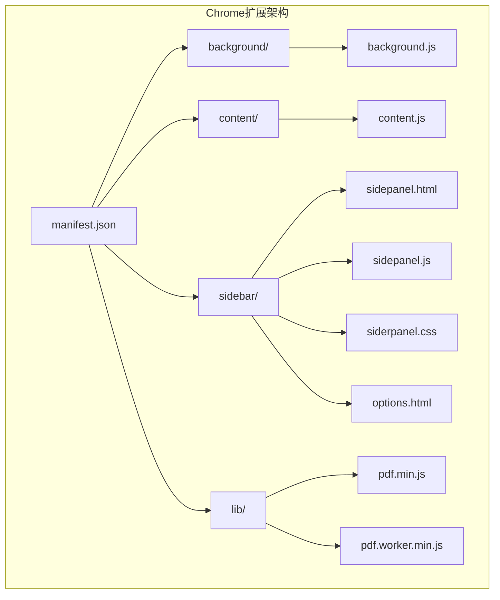
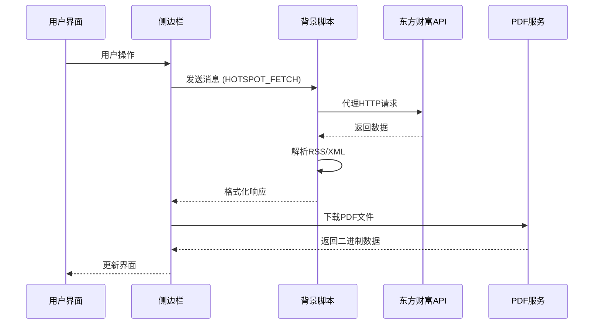
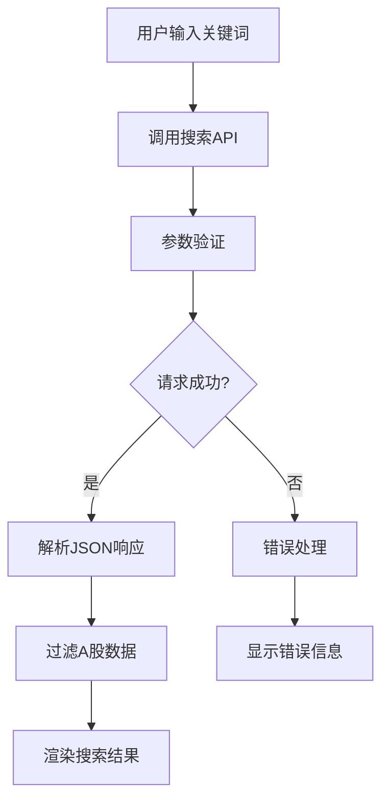
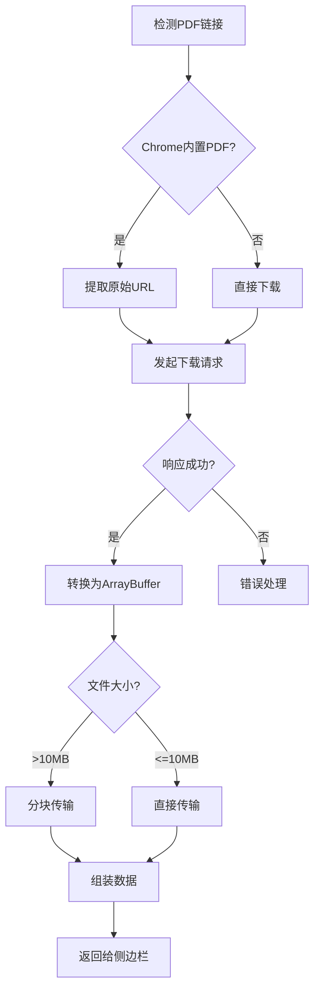
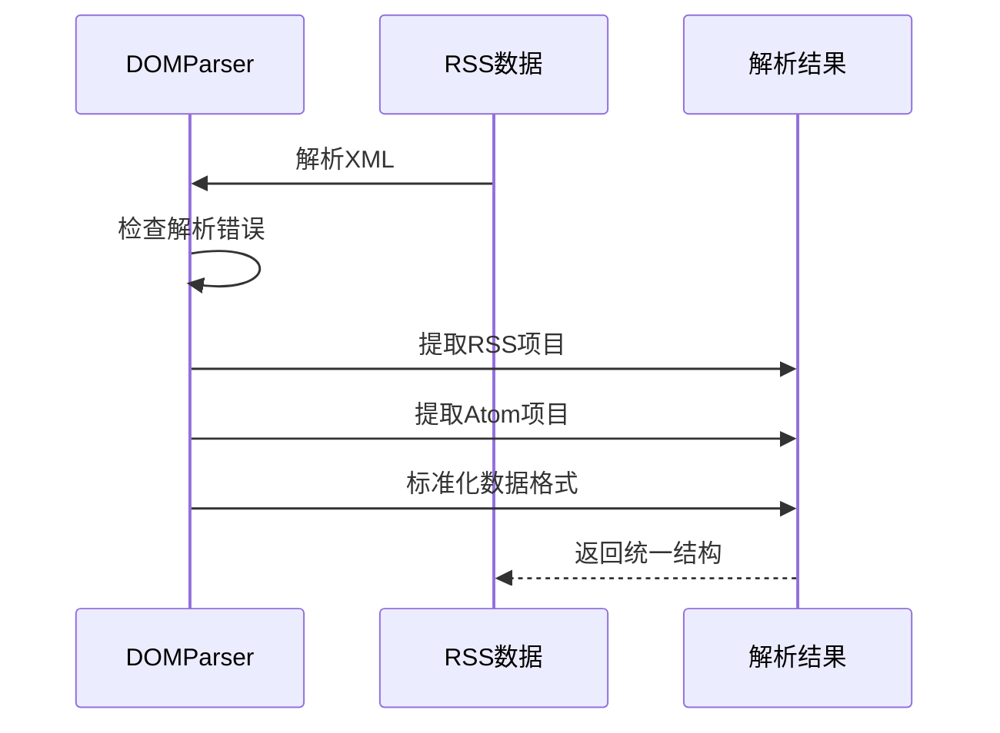
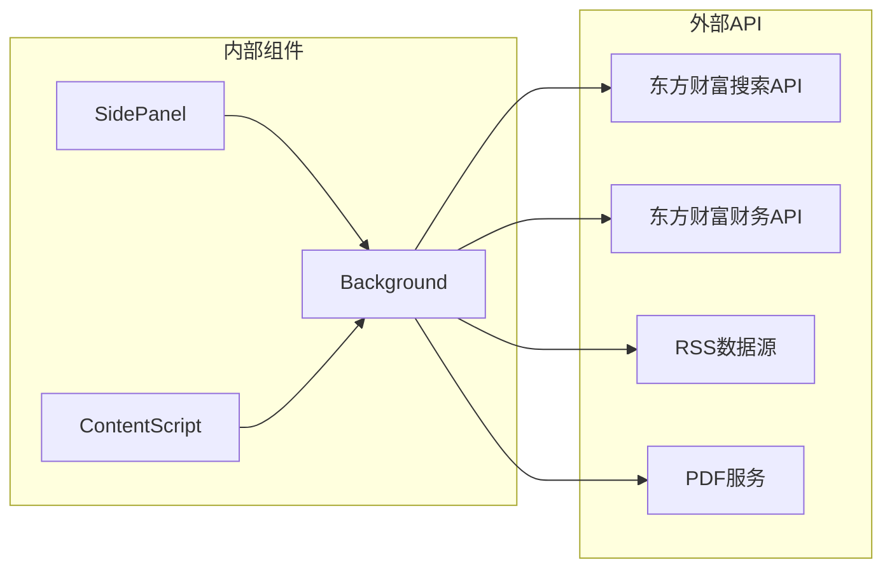
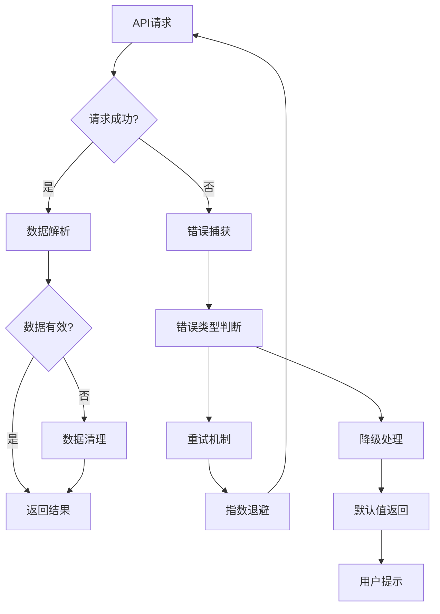

# 股票数据API

<cite>
**本文档引用的文件**
- [manifest.json](file://manifest.json)
- [background.js](file://background/background.js)
- [content.js](file://content/content.js)
- [sidepanel.js](file://sidebar/sidepanel.js)
- [README.md](file://README.md)
</cite>

## 目录
1. [简介](#简介)
2. [项目结构](#项目结构)
3. [核心组件](#核心组件)
4. [架构概览](#架构概览)
5. [详细组件分析](#详细组件分析)
6. [依赖关系分析](#依赖关系分析)
7. [性能考虑](#性能考虑)
8. [故障排除指南](#故障排除指南)
9. [结论](#结论)

## 简介

这是一个基于Chrome扩展的股票数据API集成系统，专门用于获取东方财富网的股票数据。该系统提供了完整的股票搜索、实时行情、财务报表分析等功能，通过代理API的方式绕过CORS限制，为用户提供便捷的股票数据分析工具。

## 项目结构

该项目采用Chrome扩展的标准架构，包含以下核心组件：

**图表来源**
- [manifest.json:1-48](file://manifest.json#L1-L48)
- [background.js:1-307](file://background/background.js#L1-L307)
- [content.js:1-36](file://content/content.js#L1-L36)
- [sidepanel.js:1-800](file://sidebar/sidepanel.js#L1-L800)

**章节来源**
- [manifest.json:1-48](file://manifest.json#L1-L48)
- [README.md:108-126](file://README.md#L108-L126)

## 核心组件

### 1. 背景服务工作器 (Background Service Worker)

负责处理跨域请求、PDF下载和消息路由的核心组件。

**主要功能：**
- 代理HTTP请求绕过CORS限制
- PDF文件下载和解析
- 消息路由和事件处理
- RSS/Atom数据源解析

### 2. 内容脚本 (Content Script)

轻量级脚本，专门用于检测网页中的PDF嵌入元素。

**主要功能：**
- 检测embed/object/iframe中的PDF
- 发送PDF检测通知给背景脚本
- 与背景脚本协同工作

### 3. 侧边栏界面 (Side Panel)

完整的用户界面，包含多个功能模块：

**主要模块：**
- 股票搜索和实时行情
- 财报解读和分析
- 价值投资策略筛选
- 公司资讯和公告
- AI对话和分析

**章节来源**
- [background.js:1-307](file://background/background.js#L1-L307)
- [content.js:1-36](file://content/content.js#L1-L36)
- [sidepanel.js:1-800](file://sidebar/sidepanel.js#L1-L800)

## 架构概览

系统采用代理模式架构，通过background脚本代理所有外部API请求：

**图表来源**
- [background.js:37-117](file://background/background.js#L37-L117)
- [sidepanel.js:1073-1086](file://sidebar/sidepanel.js#L1073-L1086)

## 详细组件分析

### 东方财富API集成

系统通过多种API端点获取股票数据：

#### 1. 股票搜索API

**图表来源**
- [sidepanel.js:3878-3911](file://sidebar/sidepanel.js#L3878-L3911)

#### 2. 实时行情API
系统使用多个API端点获取实时数据：

**报价数据接口：**
- URL: `https://push2.eastmoney.com/api/qt/ulist.np/get`
- 参数: `fltt=2&secids=${secid}&fields=f2,f3,f9,f12,f14,f20,f23,f115`
- 字段含义: 当前价格、涨跌幅、PE、代码、名称、总市值、PB、ROE

**章节来源**
- [sidepanel.js:2972-2980](file://sidebar/sidepanel.js#L2972-L2980)

#### 3. 财务报表API
系统集成多个财务数据接口：

**主要财务指标：**
- URL: `https://datacenter-web.eastmoney.com/api/data/v1/get`
- 表名: `RPT_F10_FINANCE_MAINFINADATA`
- 功能: 获取EPS、ROE、资产负债率等核心指标

**利润表数据：**
- URL: `https://datacenter-web.eastmoney.com/api/data/v1/get`
- 表名: `RPT_DMSK_FN_INCOME`
- 功能: 获取营业收入、净利润、成本等数据

**资产负债表数据：**
- URL: `https://datacenter-web.eastmoney.com/api/data/v1/get`
- 表名: `RPT_DMSK_FN_BALANCE`
- 功能: 获取总资产、总负债、净资产等数据

**现金流量表数据：**
- URL: `https://datacenter-web.eastmoney.com/api/data/v1/get`
- 表名: `RPT_DMSK_FN_CASHFLOW`
- 功能: 获取经营活动现金流、投资现金流、筹资现金流

**章节来源**
- [sidepanel.js:2896-3010](file://sidebar/sidepanel.js#L2896-L3010)

### PDF处理机制

系统提供完整的PDF处理能力：

**图表来源**
- [background.js:125-177](file://background/background.js#L125-L177)

**章节来源**
- [background.js:125-177](file://background/background.js#L125-L177)

### RSS数据源集成

系统支持多种RSS/Atom数据源：

**内置数据源：**
- 财联社: `https://rss.cls.cn/rss/headline.xml`
- 东方财富: `http://rss.eastmoney.com/news/rdt.rss`
- 巨潮资讯: `http://www.cninfo.com.cn/cninfo-new/rss/disclosure`

**RSS解析流程：**

**图表来源**
- [background.js:192-251](file://background/background.js#L192-L251)

**章节来源**
- [background.js:1043-1068](file://background/background.js#L1043-L1068)

## 依赖关系分析

### 外部依赖

系统主要依赖以下外部服务：

**图表来源**
- [sidepanel.js:3878-3911](file://sidebar/sidepanel.js#L3878-L3911)
- [background.js:1073-1086](file://background/background.js#L1073-L1086)

### 权限配置

扩展需要以下权限：

**核心权限：**
- `sidePanel`: 侧边栏显示
- `activeTab`: 访问当前标签页
- `scripting`: 注入脚本
- `storage`: 本地存储
- `downloads`: 文件下载

**网络权限：**
- `<all_urls>`: 访问所有网站
- 特定API域名: `*.eastmoney.com`, `*.cls.cn`

**章节来源**
- [manifest.json:6-15](file://manifest.json#L6-L15)
- [manifest.json:13-15](file://manifest.json#L13-L15)

## 性能考虑

### 缓存策略

系统采用多层次缓存机制：

1. **内存缓存**: 最近使用的股票数据缓存在内存中
2. **本地存储**: 用户设置和关注列表保存在localStorage
3. **API缓存**: RSS数据源定期缓存，避免频繁请求

### 请求优化

- **批量请求**: 合并多个API请求减少网络开销
- **延迟加载**: 按需加载财务数据，避免不必要的请求
- **分页处理**: 大量数据采用分页方式处理

### 错误处理

系统提供完善的错误处理机制：

**图表来源**
- [background.js:78-115](file://background/background.js#L78-L115)

## 故障排除指南

### 常见问题

**1. CORS错误**
- 症状: API请求被阻止
- 解决: 使用background脚本代理请求

**2. PDF下载失败**
- 症状: PDF无法下载或解析
- 解决: 检查Chrome PDF查看器URL提取

**3. API响应异常**
- 症状: 返回数据格式错误
- 解决: 检查JSON解析和数据验证

**4. 性能问题**
- 症状: 页面加载缓慢
- 解决: 启用缓存和优化请求频率

### 调试方法

1. **检查网络请求**: 使用Chrome开发者工具查看API调用
2. **验证数据格式**: 确认返回数据符合预期格式
3. **监控错误日志**: 查看console中的错误信息
4. **测试边界条件**: 验证空数据和异常数据处理

**章节来源**
- [background.js:112-115](file://background/background.js#L112-L115)

## 结论

该股票数据API系统通过精心设计的架构，成功解决了Chrome扩展中常见的CORS限制问题，为用户提供了完整的股票数据获取和分析功能。系统的主要优势包括：

1. **完整的API覆盖**: 涵盖股票搜索、实时行情、财务报表等多个方面
2. **可靠的错误处理**: 提供多层次的错误处理和降级机制
3. **高效的性能优化**: 通过缓存和批量处理提升用户体验
4. **灵活的数据源**: 支持多种RSS数据源和自定义API

该系统为后续的功能扩展奠定了良好的基础，可以轻松集成更多数据源和分析功能。