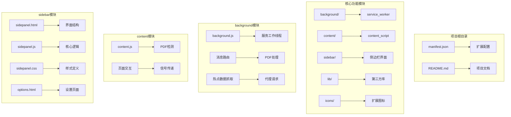
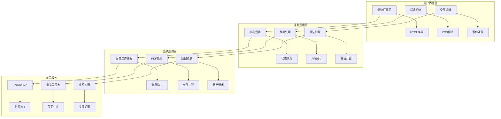
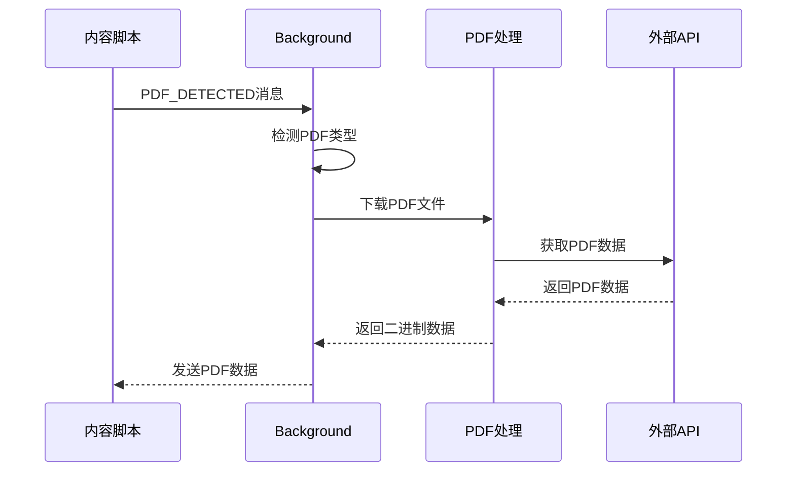
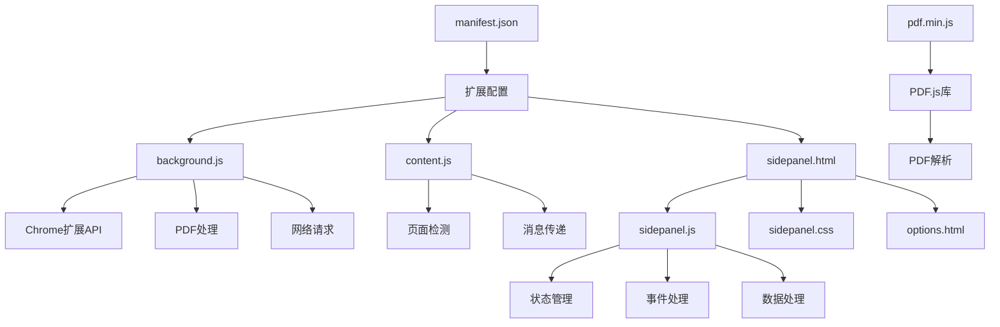

# 代码结构说明

<cite>
**本文档引用的文件**
- [manifest.json](file://manifest.json)
- [background.js](file://background/background.js)
- [content.js](file://content/content.js)
- [sidepanel.js](file://sidebar/sidepanel.js)
- [sidepanel.html](file://sidebar/sidepanel.html)
- [sidepanel.css](file://sidebar/sidepanel.css)
- [options.html](file://sidebar/options.html)
- [pdf.min.js](file://lib/pdf.min.js)
- [README.md](file://README.md)
</cite>

## 目录
1. [项目概述](#项目概述)
2. [项目结构](#项目结构)
3. [核心组件分析](#核心组件分析)
4. [架构概览](#架构概览)
5. [详细组件分析](#详细组件分析)
6. [依赖关系分析](#依赖关系分析)
7. [性能考虑](#性能考虑)
8. [故障排除指南](#故障排除指南)
9. [结论](#结论)

## 项目概述

投资助手是一个基于Chrome扩展的AI驱动投资决策助手，集成了财报解读、价值投资大师选股器和内在价值计算器等功能。该项目采用现代Chrome Extension Manifest V3架构，提供了完整的侧边栏界面和强大的PDF处理能力。

## 项目结构

项目采用清晰的模块化组织结构，每个核心功能都有独立的目录和文件：



**图表来源**
- [manifest.json:1-48](file://manifest.json#L1-L48)
- [background.js:1-307](file://background/background.js#L1-L307)
- [content.js:1-36](file://content/content.js#L1-L36)
- [sidepanel.js:1-800](file://sidebar/sidepanel.js#L1-L800)

**章节来源**
- [manifest.json:1-48](file://manifest.json#L1-L48)
- [README.md:108-126](file://README.md#L108-L126)

## 核心组件分析

### Manifest配置文件详解

manifest.json是Chrome扩展的核心配置文件，定义了扩展的基本信息、权限和功能模块：

**扩展基本信息**
- `manifest_version`: 3 - 使用最新的Manifest V3标准
- `name`: "投资助手" - 扩展名称
- `version`: "2.11.1" - 版本号
- `description`: 详细的功能描述

**权限配置**
- `sidePanel`: 启用侧边栏功能
- `activeTab`: 访问当前标签页
- `scripting`: 注入脚本权限
- `storage`: 本地存储权限
- `downloads`: 文件下载权限

**核心功能配置**
- `side_panel.default_path`: 指定侧边栏默认页面
- `background.service_worker`: 指定服务工作线程
- `web_accessible_resources`: 指定可访问的资源文件

**章节来源**
- [manifest.json:1-48](file://manifest.json#L1-L48)

### Background服务工作线程

background.js实现了扩展的核心服务功能，采用模块化设计：

**主要职责**
1. **侧边栏管理**: 处理扩展图标点击事件，控制侧边栏的打开和关闭
2. **PDF检测**: 监听标签页更新，自动检测PDF文件
3. **数据下载**: 在background环境中下载PDF文件，绕过CORS限制
4. **消息路由**: 统一处理来自不同模块的消息

**模块化设计特点**
- 清晰的函数分离：每个功能模块都有独立的函数
- 事件驱动架构：基于Chrome扩展事件API
- 异步处理：大量使用Promise和async/await
- 错误处理：完善的try-catch和错误反馈机制

**章节来源**
- [background.js:1-307](file://background/background.js#L1-L307)

### Content内容脚本

content.js实现了轻量级的内容脚本功能：

**核心功能**
- **PDF检测**: 检测网页中嵌入的PDF元素（embed/object/iframe）
- **信号传递**: 将检测到的PDF信息发送给background
- **页面集成**: 与页面内容无缝集成

**设计特点**
- 极简设计：只负责PDF检测，不处理PDF解析
- 事件驱动：基于页面加载完成事件
- 错误容忍：即使检测失败也不会影响页面功能

**章节来源**
- [content.js:1-36](file://content/content.js#L1-L36)

### Sidebar侧边栏界面

sidepanel.js是扩展的核心逻辑文件，实现了完整的用户界面和业务逻辑：

**模块化架构**
- **状态管理**: 集中式的状态管理，包含所有界面状态
- **事件绑定**: 完整的用户交互事件处理
- **数据处理**: 复杂的数据获取和处理逻辑
- **界面渲染**: 动态界面内容生成

**核心功能模块**
1. **价值投资策略模板**: 集成5位价值投资大师的选股策略
2. **热点信息模块**: 实时抓取和展示财经新闻
3. **财报解读模块**: PDF文件解析和AI分析
4. **股票分析模块**: 基于投资公司分析框架的深度分析
5. **AI对话模块**: 与用户的自然语言交互

**章节来源**
- [sidepanel.js:1-800](file://sidebar/sidepanel.js#L1-L800)

## 架构概览

项目采用了典型的Chrome扩展三层架构：



**图表来源**
- [sidepanel.js:514-584](file://sidebar/sidepanel.js#L514-L584)
- [background.js:36-117](file://background/background.js#L36-L117)

## 详细组件分析

### Sidepanel.js模块化设计

sidepanel.js采用了高度模块化的架构设计：

**状态管理系统**
```javascript
const state = {
  pdfText: '',
  pdfUrl: '',
  reportMarkdown: '',
  screenerMarkdown: '',
  chatHistory: [],
  isAnalyzing: false,
  isScreenerRunning: false,
  isChatting: false,
  activeTab: 'hotspot',
  activeStrategy: 'graham',
  // ... 更多状态属性
};
```

**事件绑定机制**
- 使用`$()`和`$$()`选择器简化DOM操作
- 事件委托减少内存占用
- 模块化事件处理器便于维护

**模块划分**
1. **状态管理模块**: 集中式状态存储和管理
2. **界面控制模块**: 标签切换、面板显示控制
3. **数据处理模块**: API调用、数据解析、缓存管理
4. **用户交互模块**: 表单验证、输入处理、反馈提示

**章节来源**
- [sidepanel.js:514-584](file://sidebar/sidepanel.js#L514-L584)
- [sidepanel.js:639-986](file://sidebar/sidepanel.js#L639-L986)

### 事件处理机制

项目实现了完整的事件驱动架构：

**用户事件处理**
- 键盘事件：支持上下箭头导航、回车确认
- 鼠标事件：点击、悬停、拖拽
- 窗口事件：滚动、大小调整

**系统事件处理**
- Chrome扩展事件：标签页更新、消息接收
- 页面事件：DOM加载完成、内容变化
- 定时器事件：自动刷新、延迟执行

**事件传播机制**
- 事件冒泡和捕获
- 事件委托模式
- 自定义事件系统

**章节来源**
- [sidepanel.js:758-844](file://sidebar/sidepanel.js#L758-L844)
- [sidepanel.js:974-986](file://sidebar/sidepanel.js#L974-L986)

### 状态管理机制

项目实现了集中式状态管理模式：

**状态层次结构**
1. **全局状态**: 应用级别的状态管理
2. **模块状态**: 各功能模块的独立状态
3. **组件状态**: 单个UI组件的状态

**状态同步机制**
- 本地存储：localStorage持久化
- 内存存储：运行时状态缓存
- Chrome存储：扩展专用存储

**状态更新策略**
- 变更检测：自动检测状态变化
- 响应式更新：状态变化自动触发界面更新
- 事务处理：批量状态更新

**章节来源**
- [sidepanel.js:516-584](file://sidebar/sidepanel.js#L516-L584)

### Background.js消息路由机制

background.js实现了复杂的消息路由系统：

**消息类型定义**
- `FETCH_PDF_DATA`: PDF文件下载请求
- `PDF_DETECTED`: PDF文件检测通知
- `GET_CURRENT_TAB`: 当前标签页信息请求
- `HOTSPOT_FETCH`: 热点数据抓取请求

**消息处理流程**


**图表来源**
- [background.js:36-117](file://background/background.js#L36-L117)
- [background.js:125-177](file://background/background.js#L125-L177)

**章节来源**
- [background.js:36-117](file://background/background.js#L36-L117)

### PDF处理架构

项目实现了完整的PDF处理流程：

**PDF检测机制**
- URL模式匹配：支持各种PDF URL格式
- 页面元素检测：检测embed/object/iframe元素
- Chrome PDF查看器支持：处理内置PDF查看器

**PDF下载流程**
- CORS绕过：利用background权限下载
- 分块传输：大文件分块传输避免内存溢出
- 缓存机制：重复文件的缓存处理

**PDF解析流程**
- PDF.js集成：使用PDF.js库解析PDF
- 文本提取：提取页面文本内容
- 格式化处理：整理提取的文本数据

**章节来源**
- [sidepanel.js:2567-2697](file://sidebar/sidepanel.js#L2567-L2697)
- [background.js:125-177](file://background/background.js#L125-L177)

## 依赖关系分析

项目具有清晰的依赖关系结构：



**图表来源**
- [manifest.json:16-46](file://manifest.json#L16-L46)
- [sidepanel.js:2567-2583](file://sidebar/sidepanel.js#L2567-L2583)

**章节来源**
- [manifest.json:16-46](file://manifest.json#L16-L46)

## 性能考虑

项目在性能方面采用了多项优化措施：

**内存管理**
- 模块化设计减少内存占用
- 及时清理事件监听器
- 避免内存泄漏

**网络优化**
- 请求缓存机制
- 批量数据处理
- 异步请求避免阻塞

**UI性能**
- 虚拟滚动处理大量数据
- 懒加载机制
- 防抖和节流优化

**扩展性能**
- 服务工作线程后台处理
- 权限最小化原则
- 资源按需加载

## 故障排除指南

### 常见问题诊断

**PDF处理问题**
- 检查CORS限制和权限配置
- 验证PDF.js库加载状态
- 确认Chrome PDF查看器兼容性

**消息通信问题**
- 检查Chrome扩展消息API使用
- 验证消息路由配置
- 确认异步处理逻辑

**界面显示问题**
- 检查CSS样式冲突
- 验证DOM元素加载状态
- 确认事件绑定完整性

### 调试技巧

**开发调试**
- 使用Chrome开发者工具
- 启用扩展调试模式
- 监控网络请求和响应

**生产调试**
- 实施错误日志记录
- 添加用户反馈机制
- 建立问题报告系统

**章节来源**
- [background.js:179-186](file://background/background.js#L179-L186)
- [sidepanel.js:1589-1595](file://sidebar/sidepanel.js#L1589-L1595)

## 结论

投资助手扩展展现了现代Chrome扩展开发的最佳实践：

**架构优势**
- 清晰的模块化设计
- 完善的事件驱动架构
- 高效的状态管理模式

**技术特色**
- 强大的PDF处理能力
- 智能的数据抓取机制
- 丰富的AI集成应用

**扩展性考虑**
- 模块化代码结构便于维护
- 插件化设计支持功能扩展
- 标准化的API接口

该项目为Chrome扩展开发提供了优秀的参考范例，展示了如何构建功能完整、性能优异的浏览器扩展应用。