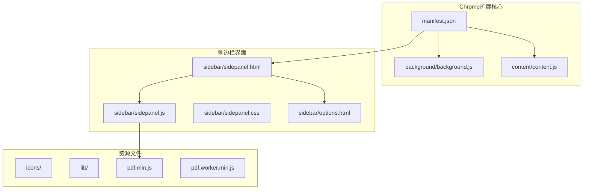
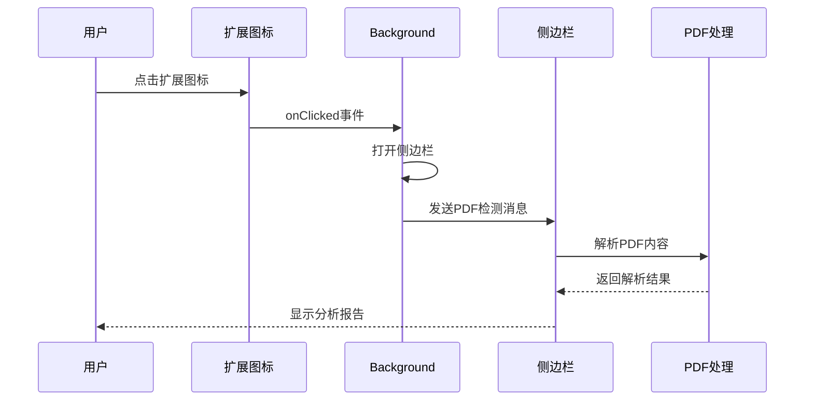
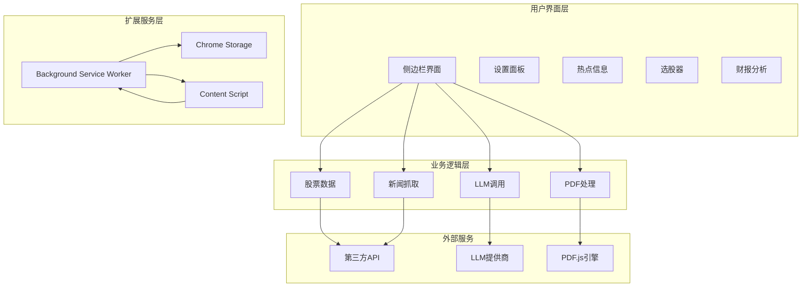
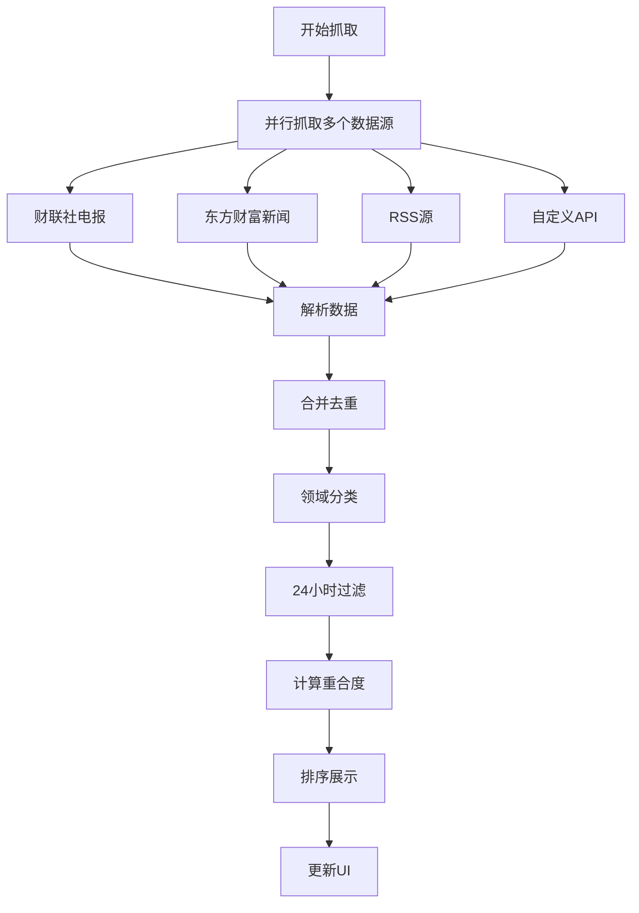
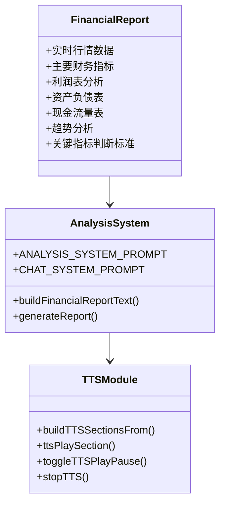
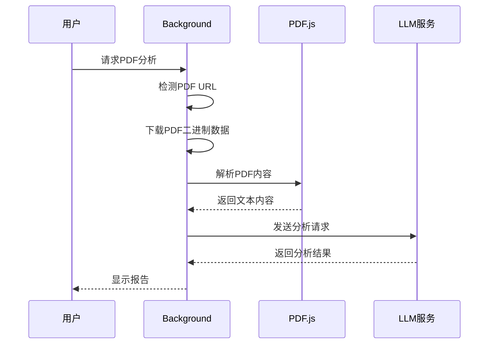
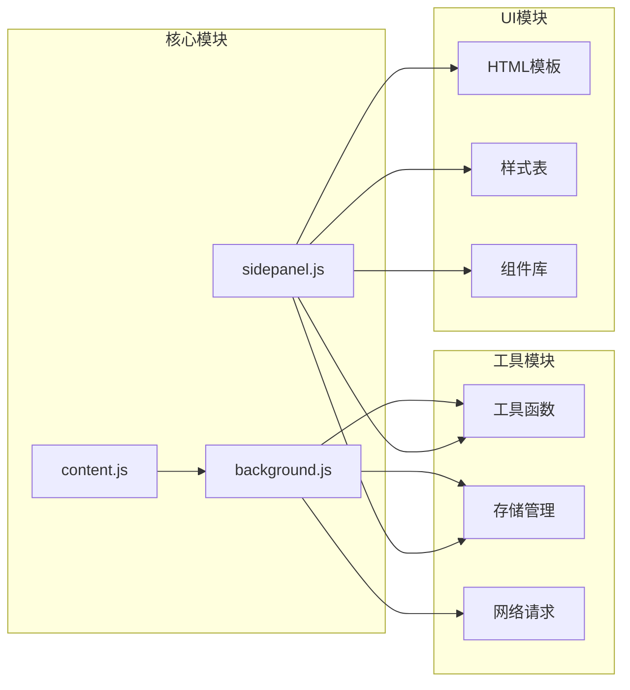
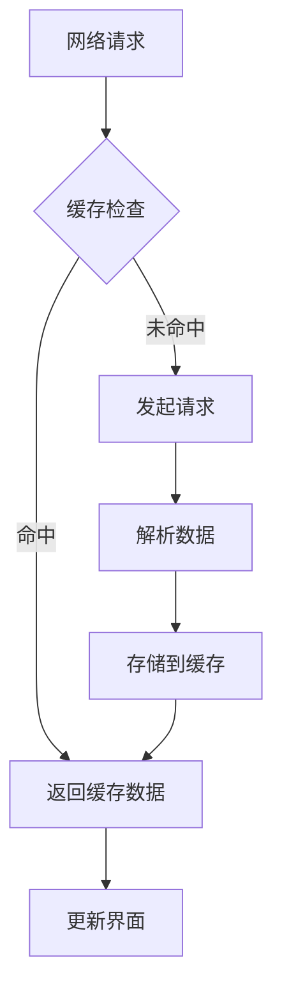

# 开发指南

<cite>
**本文档引用的文件**
- [manifest.json](file://manifest.json)
- [background.js](file://background/background.js)
- [content.js](file://content/content.js)
- [sidepanel.js](file://sidebar/sidepanel.js)
- [sidepanel.html](file://sidebar/sidepanel.html)
- [options.html](file://sidebar/options.html)
- [sidepanel.css](file://sidebar/sidepanel.css)
- [pdf.min.js](file://lib/pdf.min.js)
- [README.md](file://README.md)
</cite>

## 目录
1. [简介](#简介)
2. [项目结构](#项目结构)
3. [核心组件](#核心组件)
4. [架构概览](#架构概览)
5. [详细组件分析](#详细组件分析)
6. [依赖分析](#依赖分析)
7. [性能考虑](#性能考虑)
8. [故障排除指南](#故障排除指南)
9. [结论](#结论)
10. [附录](#附录)

## 简介

投资助手是一个基于Chrome扩展的AI驱动投资决策助手，融合了巴菲特、林奇、费雪、芒格、格雷厄姆等多位价值投资大师的策略理念。该项目提供了完整的投资分析解决方案，包括财报解读、选股器、内在价值计算器、热点信息抓取等功能。

## 项目结构

该项目采用清晰的模块化架构，主要分为以下几个核心部分：



**图表来源**
- [manifest.json:1-48](file://manifest.json#L1-L48)
- [background.js:1-307](file://background/background.js#L1-L307)
- [sidepanel.js:1-800](file://sidebar/sidepanel.js#L1-L800)

**章节来源**
- [manifest.json:1-48](file://manifest.json#L1-L48)
- [README.md:108-126](file://README.md#L108-L126)

## 核心组件

### 扩展配置与权限

项目使用Chrome Extension Manifest V3标准，配置了完整的权限体系：

| 权限类别 | 权限名称 | 用途说明 |
|---------|----------|----------|
| **核心权限** | `sidePanel` | 控制侧边栏的显示和交互 |
| | `activeTab` | 访问当前激活标签页信息 |
| | `scripting` | 注入内容脚本到网页 |
| | `storage` | 本地存储用户设置和数据 |
| | `downloads` | 导出文件到本地 |
| **网络权限** | `<all_urls>` | 访问所有网站资源 |
| **资源访问** | `lib/pdf.min.js` | PDF.js库文件访问 |

### 服务工作线程架构

Background Service Worker负责处理跨标签页通信和PDF处理：



**图表来源**
- [background.js:12-19](file://background/background.js#L12-L19)
- [sidepanel.js:2613-2619](file://sidebar/sidepanel.js#L2613-L2619)

**章节来源**
- [manifest.json:6-15](file://manifest.json#L6-L15)
- [background.js:1-307](file://background/background.js#L1-L307)

## 架构概览

项目采用分层架构设计，实现了清晰的关注点分离：



**图表来源**
- [sidepanel.js:1-800](file://sidebar/sidepanel.js#L1-L800)
- [background.js:1-307](file://background/background.js#L1-L307)

## 详细组件分析

### 侧边栏核心模块

侧边栏应用包含五个主要功能模块：

#### 1. 价值投资大师策略模板

项目集成了五位投资大师的核心策略：

| 策略名称 | 核心理念 | 关键指标 |
|---------|----------|----------|
| **格雷厄姆** | 深度价值 · 安全边际 | PE<15, PB<1.5, 股息≥3% |
| **巴菲特** | 护城河 · 优质企业 | ROE≥15%, 所有者盈余 |
| **林奇** | PEG · 成长价值 | PEG<1, 公司分类 |
| **费雪** | 长期成长 · 15要点 | 研发投入, 利润率 |
| **芒格** | 理性 · 逆向思维 | ROIC>WACC, 压力测试 |

#### 2. 热点信息模块

实现了多数据源聚合和智能分类：



**图表来源**
- [sidepanel.js:1291-1363](file://sidebar/sidepanel.js#L1291-L1363)
- [sidepanel.js:1371-1492](file://sidebar/sidepanel.js#L1371-L1492)

#### 3. 财报解读模块

集成了完整的财务分析框架：



**图表来源**
- [sidepanel.js:3016-3288](file://sidebar/sidepanel.js#L3016-L3288)
- [sidepanel.js:3360-3452](file://sidebar/sidepanel.js#L3360-L3452)

**章节来源**
- [sidepanel.js:14-297](file://sidebar/sidepanel.js#L14-L297)
- [sidepanel.js:1026-1799](file://sidebar/sidepanel.js#L1026-L1799)
- [sidepanel.js:2482-2799](file://sidebar/sidepanel.js#L2482-L2799)

### PDF处理与分析

项目实现了完整的PDF文档处理流程：



**图表来源**
- [background.js:125-177](file://background/background.js#L125-L177)
- [sidepanel.js:2621-2697](file://sidebar/sidepanel.js#L2621-L2697)

**章节来源**
- [background.js:125-177](file://background/background.js#L125-L177)
- [sidepanel.js:2565-2697](file://sidebar/sidepanel.js#L2565-L2697)

### 设置与配置管理

项目提供了灵活的配置系统：

| 配置项 | 类型 | 默认值 | 描述 |
|-------|------|--------|------|
| **LLM提供商** | 下拉选择 | OpenAI | 支持多家AI服务提供商 |
| **API地址** | 文本框 | https://api.openai.com/v1 | LLM API基础URL |
| **API Key** | 密码框 | 空 | 服务认证密钥 |
| **模型名称** | 文本框 | gpt-4o | AI模型标识符 |

**章节来源**
- [options.html:46-69](file://sidebar/options.html#L46-L69)
- [sidepanel.js:609-637](file://sidebar/sidepanel.js#L609-L637)

## 依赖分析

### 外部依赖

项目采用最小化依赖策略，主要依赖包括：

| 依赖类型 | 文件 | 版本 | 用途 |
|---------|------|------|------|
| **PDF处理** | pdf.min.js | 3.11.174 | PDF内容提取和解析 |
| **PDF Worker** | pdf.worker.min.js | 3.11.174 | PDF解析工作线程 |
| **Chrome扩展API** | Manifest V3 | - | 扩展核心功能 |
| **Web Speech API** | 浏览器原生 | - | 文本转语音功能 |

### 内部模块依赖



**图表来源**
- [sidepanel.js:1-800](file://sidebar/sidepanel.js#L1-L800)
- [background.js:1-307](file://background/background.js#L1-L307)

**章节来源**
- [pdf.min.js:1-22](file://lib/pdf.min.js#L1-L22)
- [sidepanel.css:1-800](file://sidebar/sidepanel.css#L1-L800)

## 性能考虑

### 内存管理

项目实现了多项内存优化策略：

1. **PDF数据分块传输**：超过10MB的PDF文件自动分块传输，避免内存溢出
2. **缓存机制**：热点数据和股票信息采用智能缓存策略
3. **垃圾回收**：及时清理不再使用的DOM元素和事件监听器

### 网络优化



**图表来源**
- [sidepanel.js:1371-1492](file://sidebar/sidepanel.js#L1371-L1492)

### 并发处理

项目采用异步并发模式处理多个数据源：

- **热点数据**：最多同时处理8个数据源
- **股票搜索**：防抖处理，减少API调用频率
- **LLM请求**：流式响应处理，提升用户体验

## 故障排除指南

### 常见问题诊断

| 问题类型 | 症状 | 可能原因 | 解决方案 |
|---------|------|----------|----------|
| **PDF解析失败** | 提取文本过少或空白 | PDF为扫描版或加密 | 使用手动粘贴功能 |
| **API Key无效** | LLM调用失败 | 密钥过期或格式错误 | 重新配置设置 |
| **热点数据不更新** | 信息陈旧 | 网络请求超时 | 检查网络连接和代理设置 |
| **侧边栏无法打开** | 点击图标无响应 | 权限不足或扩展未正确加载 | 重新安装扩展并授予权限 |

### 调试技巧

1. **开发者工具**：使用Chrome开发者工具检查控制台错误
2. **网络监控**：观察API请求和响应状态
3. **存储检查**：验证localStorage中的配置数据
4. **事件监听**：使用Chrome扩展的事件日志功能

**章节来源**
- [sidepanel.js:2698-3010](file://sidebar/sidepanel.js#L2698-L3010)
- [sidepanel.js:3343-3358](file://sidebar/sidepanel.js#L3343-L3358)

## 结论

投资助手扩展展现了现代Chrome扩展开发的最佳实践，通过合理的架构设计和模块化实现，成功整合了多个复杂的功能模块。项目在以下方面表现突出：

1. **架构清晰**：采用分层架构，职责分离明确
2. **性能优化**：实现了多项性能优化策略
3. **用户体验**：提供了流畅的交互体验
4. **扩展性强**：模块化设计便于功能扩展

## 附录

### 开发环境搭建

#### 系统要求
- Chrome浏览器版本：最新稳定版
- Node.js版本：16.x或更高版本
- 开发工具：VS Code或其他IDE

#### 安装步骤

1. **克隆项目**
```bash
git clone <repository-url>
cd earnings-report-extension
```

2. **加载扩展**
   - 打开Chrome浏览器，访问 `chrome://extensions/`
   - 开启"开发者模式"
   - 点击"加载已解压的扩展程序"
   - 选择项目根目录

3. **开发服务器**
```bash
# 启动本地服务器
npm install
npm run dev
```

#### 代码规范

1. **命名约定**
   - 变量使用驼峰命名法
   - 函数使用动词开头的驼峰命名
   - 常量使用全大写字母和下划线

2. **代码格式**
   - 使用4个空格缩进
   - 行尾不保留空格
   - 函数之间留一个空行

3. **注释规范**
   - 重要函数必须包含注释
   - 复杂逻辑需要详细说明
   - TODO标记需要明确截止日期

#### 测试指南

1. **单元测试**
   - 为关键函数编写测试用例
   - 测试边界条件和异常情况
   - 验证异步操作的正确性

2. **集成测试**
   - 测试完整的用户流程
   - 验证扩展与Chrome API的交互
   - 检查权限和安全限制

3. **性能测试**
   - 测量关键操作的响应时间
   - 监控内存使用情况
   - 验证大数据量处理能力

#### 部署流程

1. **构建优化**
```bash
# 生产环境构建
npm run build
```

2. **版本管理**
   - 更新manifest.json中的版本号
   - 生成变更日志
   - 创建Git标签

3. **发布准备**
   - 代码审查
   - 最终测试
   - 文档更新

**章节来源**
- [README.md:83-147](file://README.md#L83-L147)