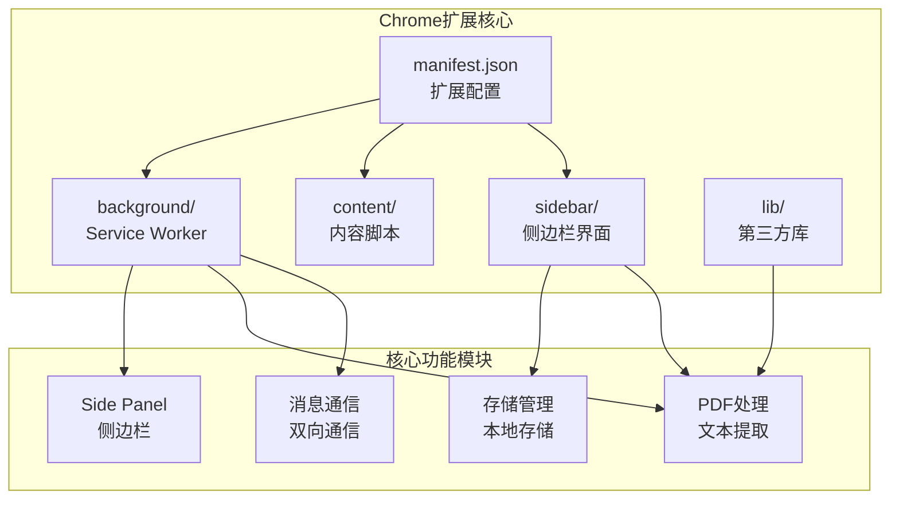
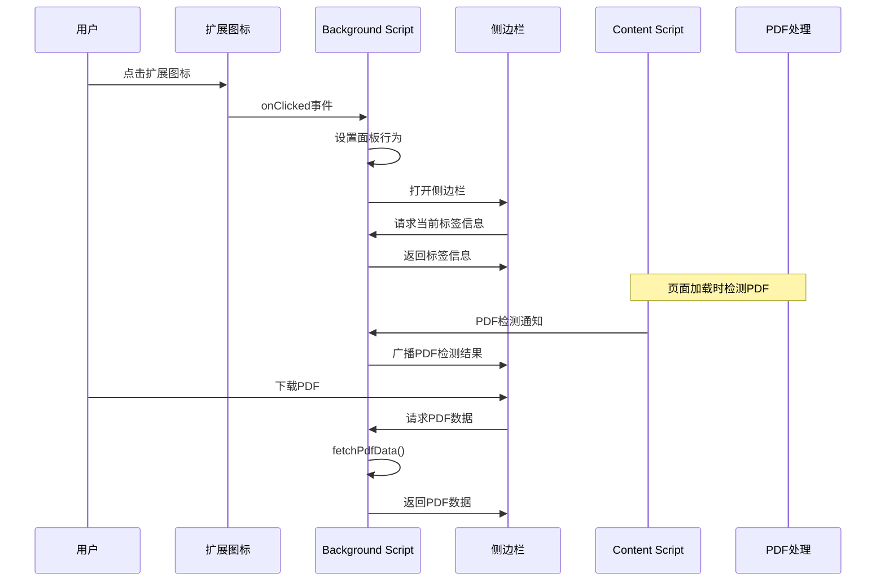
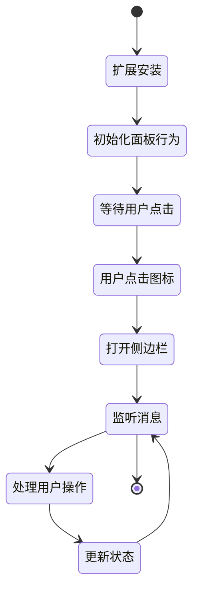
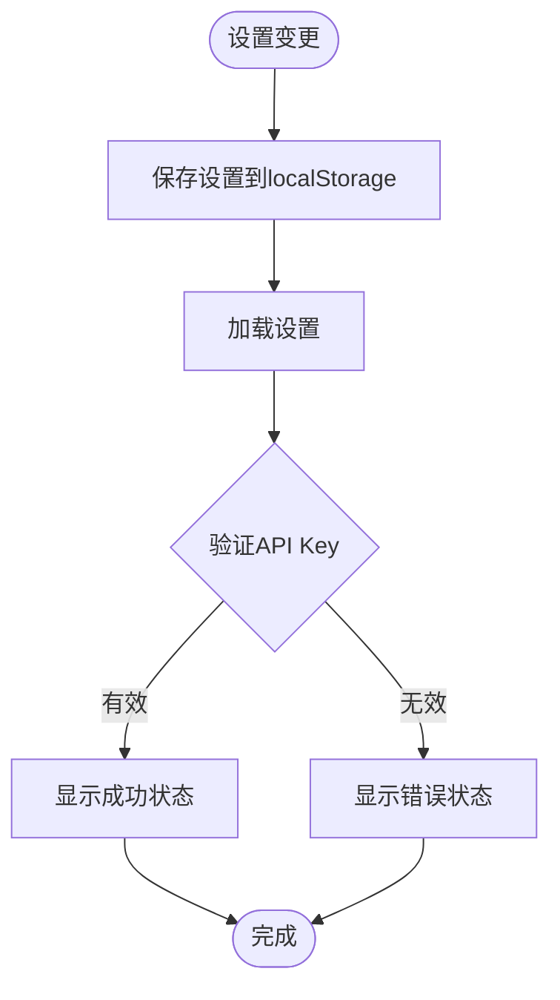
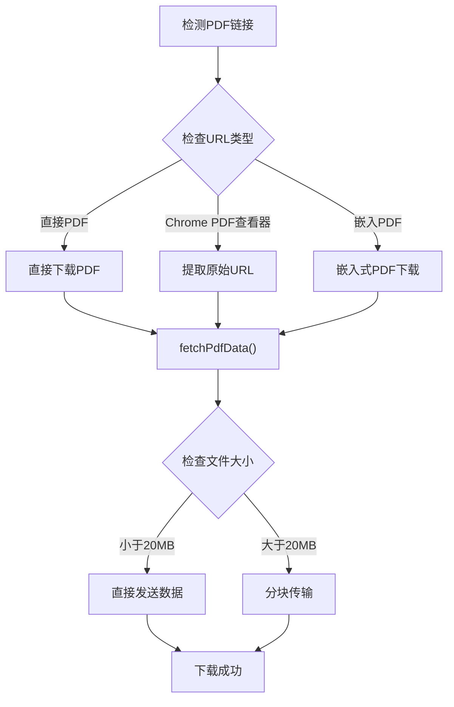
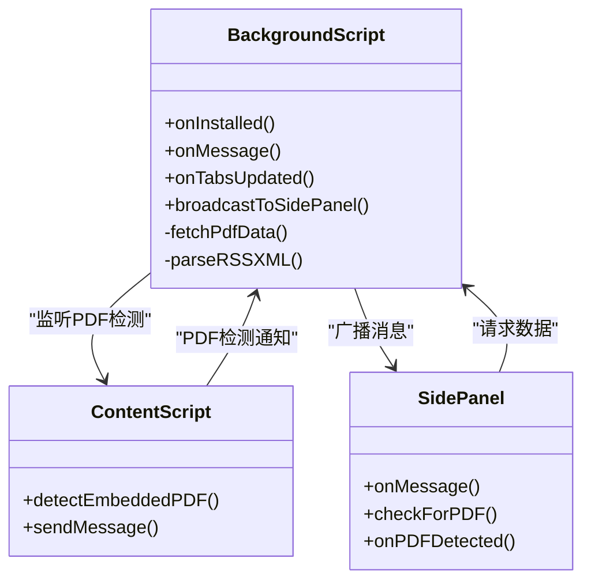
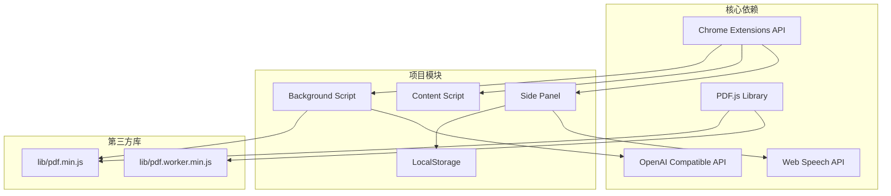

# Chrome扩展API使用

<cite>
**本文档引用的文件**
- [manifest.json](file://manifest.json)
- [background.js](file://background/background.js)
- [content.js](file://content/content.js)
- [sidepanel.js](file://sidebar/sidepanel.js)
- [sidepanel.html](file://sidebar/sidepanel.html)
- [options.html](file://sidebar/options.html)
- [pdf.min.js](file://lib/pdf.min.js)
</cite>

## 目录
1. [简介](#简介)
2. [项目结构](#项目结构)
3. [核心组件](#核心组件)
4. [架构概览](#架构概览)
5. [详细组件分析](#详细组件分析)
6. [依赖关系分析](#依赖关系分析)
7. [性能考虑](#性能考虑)
8. [故障排除指南](#故障排除指南)
9. [结论](#结论)

## 简介

这是一个基于Chrome扩展API构建的投资助手扩展，集成了多种现代Web技术栈。该项目展示了如何在Chrome扩展环境中有效使用Side Panel API、Storage API、Downloads API以及Content Script与Background Script之间的消息通信机制。

该扩展提供了完整的投资分析功能，包括价值投资大师选股器、财报解读、内在价值计算器、AI对话等核心功能，同时实现了PDF文件的自动检测和下载处理。

## 项目结构

项目采用清晰的模块化架构，每个目录都有特定的功能职责：

**图表来源**
- [manifest.json:1-48](file://manifest.json#L1-L48)
- [background.js:1-307](file://background/background.js#L1-L307)
- [sidepanel.js:1-800](file://sidebar/sidepanel.js#L1-L800)

**章节来源**
- [manifest.json:1-48](file://manifest.json#L1-L48)
- [README.md:108-126](file://README.md#L108-L126)

## 核心组件

### Side Panel API组件

Side Panel API是该项目的核心功能之一，负责提供交互式的侧边栏界面。系统通过Manifest V3配置启用Side Panel功能，并在扩展安装时自动设置面板行为。

### Storage API组件

项目实现了两种存储策略：
- **localStorage**：用于用户设置和偏好配置的本地持久化
- **chrome.storage**：用于扩展级别的数据存储（在代码中体现）

### Downloads API组件

虽然项目中没有直接使用Downloads API进行PDF下载，但通过Background Script的fetch功能实现了相同的功能，绕过了CORS限制并提供了更好的用户体验。

### 消息通信组件

实现了完整的双向消息通信机制，支持Content Script、Background Script和Side Panel之间的实时数据交换。

**章节来源**
- [background.js:11-19](file://background/background.js#L11-L19)
- [sidepanel.js:609-637](file://sidebar/sidepanel.js#L609-L637)

## 架构概览

该扩展采用了典型的Chrome扩展架构模式，通过Service Worker实现后台处理，通过Side Panel提供用户界面，通过Content Script实现页面集成。

**图表来源**
- [background.js:12-14](file://background/background.js#L12-L14)
- [background.js:21-34](file://background/background.js#L21-L34)
- [background.js:37-117](file://background/background.js#L37-L117)
- [sidepanel.js:974-979](file://sidebar/sidepanel.js#L974-L979)

## 详细组件分析

### Side Panel API实现

Side Panel API的使用体现了现代Chrome扩展的最佳实践：

#### 生命周期管理

**图表来源**
- [background.js:12-19](file://background/background.js#L12-L19)
- [sidepanel.js:591-607](file://sidebar/sidepanel.js#L591-L607)

#### 权限配置

Manifest V3配置确保了Side Panel功能的正确启用：

**章节来源**
- [manifest.json:6-12](file://manifest.json#L6-L12)
- [manifest.json:16-18](file://manifest.json#L16-L18)

### Storage API使用模式

项目实现了混合存储策略，结合了localStorage和chrome.storage的优势：

#### 用户设置存储

**图表来源**
- [sidepanel.js:609-637](file://sidebar/sidepanel.js#L609-L637)
- [options.html:82-120](file://sidebar/options.html#L82-L120)

#### 数据持久化策略

项目采用localStorage进行用户设置的持久化存储，确保用户配置在浏览器重启后仍然可用。

**章节来源**
- [sidepanel.js:609-637](file://sidebar/sidepanel.js#L609-L637)
- [options.html:82-120](file://sidebar/options.html#L82-L120)

### Downloads API实现

虽然项目没有直接使用Downloads API，但通过Background Script实现了相同的功能：

#### PDF下载处理

**图表来源**
- [background.js:125-177](file://background/background.js#L125-L177)
- [background.js:22-34](file://background/background.js#L22-L34)

#### 进度监控和错误处理

项目实现了完善的错误处理机制，包括HTTP错误、CORS限制绕过、文件格式验证等。

**章节来源**
- [background.js:125-177](file://background/background.js#L125-L177)
- [background.js:22-34](file://background/background.js#L22-L34)

### Content Script与Background Script消息通信

实现了完整的双向消息通信机制：

#### 消息路由系统

**图表来源**
- [background.js:17-19](file://background/background.js#L17-L19)
- [background.js:37-117](file://background/background.js#L37-L117)
- [content.js:11-28](file://content/content.js#L11-L28)
- [sidepanel.js:974-979](file://sidebar/sidepanel.js#L974-L979)

#### 异步操作处理

项目使用Promise和async/await模式处理所有异步操作，确保消息通信的可靠性和响应性。

**章节来源**
- [background.js:37-117](file://background/background.js#L37-L117)
- [content.js:11-28](file://content/content.js#L11-L28)
- [sidepanel.js:974-979](file://sidebar/sidepanel.js#L974-L979)

## 依赖关系分析

项目的技术依赖关系体现了现代化的Web开发实践：

**图表来源**
- [manifest.json:22-30](file://manifest.json#L22-L30)
- [background.js:125-177](file://background/background.js#L125-L177)
- [sidepanel.js:594](file://sidebar/sidepanel.js#L594)

**章节来源**
- [manifest.json:22-30](file://manifest.json#L22-L30)
- [pdf.min.js:1-22](file://lib/pdf.min.js#L1-L22)

## 性能考虑

### 内存管理

项目实现了高效的内存管理策略，特别是在处理大型PDF文件时：

- **分块传输**：超过20MB的PDF文件自动分块传输，避免内存溢出
- **及时清理**：不再使用的对象及时释放，减少内存占用
- **缓存策略**：合理使用缓存机制，平衡性能和内存消耗

### 网络优化

- **CORS绕过**：通过Background Script处理网络请求，绕过CORS限制
- **请求合并**：多个请求合并处理，减少网络开销
- **错误重试**：实现智能重试机制，提高成功率

### 用户体验优化

- **异步加载**：所有耗时操作异步执行，保持界面响应性
- **进度反馈**：提供清晰的进度指示和状态反馈
- **错误恢复**：优雅处理各种错误情况，提供用户友好的错误信息

## 故障排除指南

### 常见问题及解决方案

#### Side Panel无法打开

**症状**：点击扩展图标后侧边栏不显示

**可能原因**：
1. 权限配置不正确
2. Manifest V3配置错误
3. Service Worker启动失败

**解决步骤**：
1. 检查manifest.json中的permissions配置
2. 确认side_panel配置正确
3. 查看浏览器开发者工具中的错误日志

#### PDF检测失败

**症状**：无法检测到页面中的PDF文件

**可能原因**：
1. Content Script注入失败
2. PDF URL格式不支持
3. CORS限制

**解决步骤**：
1. 检查Content Script的注入时机
2. 验证PDF URL格式
3. 确认Background Script的网络权限

#### 消息通信异常

**症状**：Content Script与Background Script之间消息传递失败

**可能原因**：
1. 消息监听器未正确设置
2. 消息格式不正确
3. 异步操作处理不当

**解决步骤**：
1. 检查chrome.runtime.onMessage监听器
2. 验证消息格式和结构
3. 确保异步操作的正确处理

**章节来源**
- [background.js:17-19](file://background/background.js#L17-L19)
- [content.js:11-28](file://content/content.js#L11-L28)
- [sidepanel.js:974-979](file://sidebar/sidepanel.js#L974-L979)

## 结论

这个Chrome扩展项目展示了现代Web技术在浏览器扩展开发中的最佳实践。通过合理使用Chrome扩展API，实现了功能丰富、性能优良的投资分析工具。

### 主要成就

1. **完整的Side Panel集成**：实现了流畅的侧边栏用户体验
2. **强大的PDF处理能力**：通过Background Script绕过CORS限制
3. **可靠的存储管理**：结合localStorage和chrome.storage的优势
4. **高效的通信机制**：实现了Content Script、Background Script和Side Panel之间的无缝通信

### 技术亮点

- **现代化架构**：基于Manifest V3和Service Worker
- **性能优化**：内存管理和网络优化策略
- **用户体验**：异步处理和进度反馈机制
- **错误处理**：完善的错误处理和恢复机制

### 未来改进方向

1. **增强安全性**：进一步加强API Key的安全存储
2. **扩展功能**：增加更多投资分析功能
3. **性能优化**：继续优化大型文件处理性能
4. **用户体验**：改进界面设计和交互体验

这个项目为Chrome扩展开发提供了优秀的参考范例，展示了如何在有限的API约束下实现复杂的功能需求。