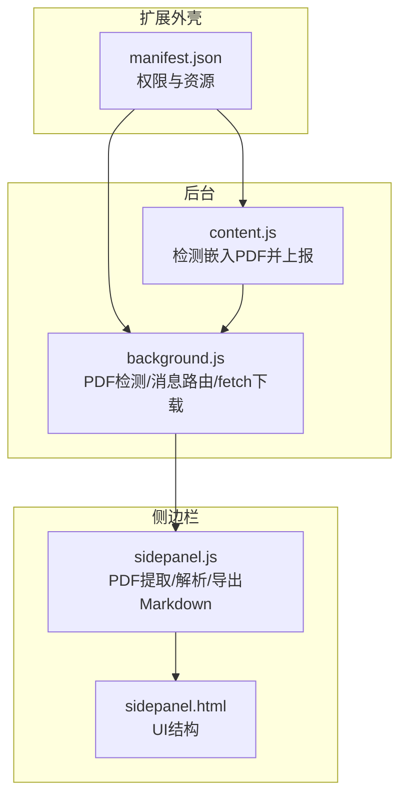
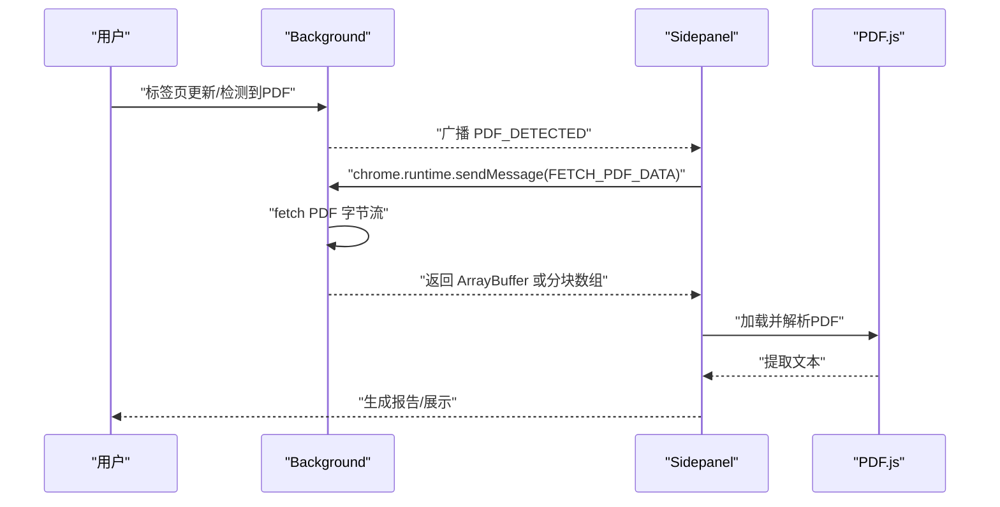
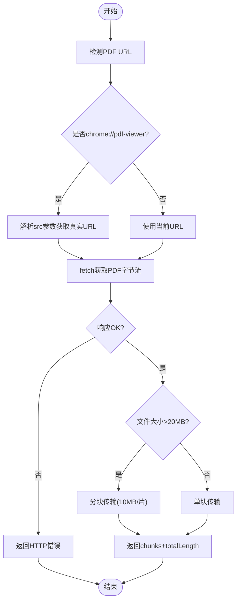
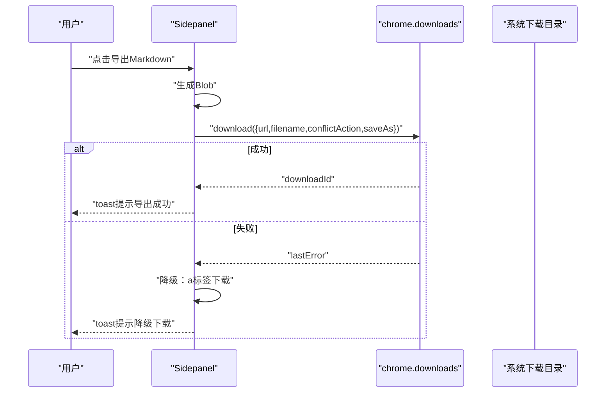
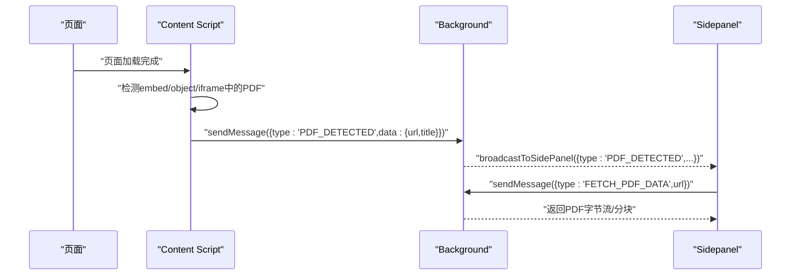
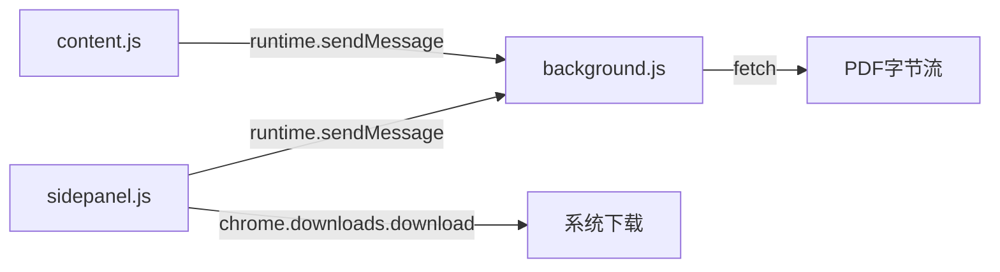

# Downloads API

<cite>
**本文引用的文件**
- [manifest.json](file://manifest.json)
- [background.js](file://background/background.js)
- [content.js](file://content/content.js)
- [sidepanel.js](file://sidebar/sidepanel.js)
- [sidepanel.html](file://sidebar/sidepanel.html)
- [README.md](file://README.md)
</cite>

## 目录
1. [简介](#简介)
2. [项目结构](#项目结构)
3. [核心组件](#核心组件)
4. [架构总览](#架构总览)
5. [详细组件分析](#详细组件分析)
6. [依赖关系分析](#依赖关系分析)
7. [性能考量](#性能考量)
8. [故障排查指南](#故障排查指南)
9. [结论](#结论)
10. [附录](#附录)

## 简介
本指南围绕“Downloads API”在该项目中的使用与实现进行系统化说明，重点覆盖：
- PDF 文件下载功能的实现与调用方式
- chrome.downloads.download API 的参数配置与行为
- 下载触发机制、URL 检测与自动下载流程
- 与 content script 的协作模式与后台脚本处理逻辑
- 错误处理、超时控制与用户权限验证
- 进度监控与分块传输策略

说明：该项目在侧边栏导出 Markdown 报告时使用了 chrome.downloads.download API；而在 PDF 文件下载与解析方面，采用的是 background 脚本通过 fetch 获取 PDF 字节流的方式，未直接使用 chrome.downloads.download API。因此本指南将分别阐述两种场景的实现与最佳实践。

**章节来源**
- [README.md:108-126](file://README.md#L108-L126)

## 项目结构
该项目采用 Manifest V3 架构，包含背景脚本、内容脚本、侧边栏页面与资源库。与 Downloads API 相关的关键文件如下：
- manifest.json：声明权限与资源暴露
- background/background.js：负责 PDF 检测、消息路由与 fetch 下载
- content/content.js：检测页面内嵌 PDF 并上报
- sidebar/sidepanel.js：侧边栏逻辑，包含导出 Markdown 时的 chrome.downloads.download 调用
- sidebar/sidepanel.html：侧边栏页面结构

**图表来源**
- [manifest.json:1-48](file://manifest.json#L1-L48)
- [background.js:1-307](file://background/background.js#L1-L307)
- [content.js:1-36](file://content/content.js#L1-L36)
- [sidepanel.js:1-800](file://sidebar/sidepanel.js#L1-L800)
- [sidepanel.html:1-646](file://sidebar/sidepanel.html#L1-L646)

**章节来源**
- [manifest.json:1-48](file://manifest.json#L1-L48)
- [background.js:1-307](file://background/background.js#L1-L307)
- [content.js:1-36](file://content/content.js#L1-L36)
- [sidepanel.js:1-800](file://sidebar/sidepanel.js#L1-L800)
- [sidepanel.html:1-646](file://sidebar/sidepanel.html#L1-L646)

## 核心组件
- 权限与资源
  - permissions：包含 downloads、activeTab、scripting、storage、sidePanel 等
  - host_permissions：<all_urls> 使 background 可绕过 CORS 直接访问任意 URL
  - web_accessible_resources：暴露 PDF.js 资源供侧边栏使用
- 后台脚本
  - 监听标签页更新，检测 PDF URL 并广播消息
  - 提供 FETCH_PDF_DATA 消息处理器，通过 fetch 获取 PDF 字节流
  - 对超大 PDF 进行分块传输，避免消息传递过大
- 内容脚本
  - 检测页面内 embed/object/iframe 中的 PDF，并上报给后台
- 侧边栏
  - 检测当前标签页 PDF URL，发起 fetch 请求，解析 PDF 文本
  - 导出 Markdown 报告时使用 chrome.downloads.download API

**章节来源**
- [manifest.json:6-30](file://manifest.json#L6-L30)
- [background.js:21-34](file://background/background.js#L21-L34)
- [background.js:37-117](file://background/background.js#L37-L117)
- [background.js:125-177](file://background/background.js#L125-L177)
- [content.js:11-28](file://content/content.js#L11-L28)
- [sidepanel.js:2587-2619](file://sidebar/sidepanel.js#L2587-L2619)
- [sidepanel.js:2621-2697](file://sidebar/sidepanel.js#L2621-L2697)
- [sidepanel.js:3735-3759](file://sidebar/sidepanel.js#L3735-L3759)

## 架构总览
PDF 下载与导出涉及两条主线：
- PDF 文件下载与解析（未直接使用 chrome.downloads.download）
  - 背景脚本监听 PDF URL → 通过 fetch 获取字节流 → 返回 ArrayBuffer/分块数组 → 侧边栏用 PDF.js 解析
- Markdown 导出（使用 chrome.downloads.download）
  - 侧边栏生成 Markdown → 创建 Blob → 调用 chrome.downloads.download → 降级为传统下载

**图表来源**
- [background.js:21-34](file://background/background.js#L21-L34)
- [background.js:37-45](file://background/background.js#L37-L45)
- [background.js:125-177](file://background/background.js#L125-L177)
- [sidepanel.js:2587-2619](file://sidebar/sidepanel.js#L2587-L2619)
- [sidepanel.js:2621-2697](file://sidebar/sidepanel.js#L2621-L2697)

## 详细组件分析

### 组件A：PDF 下载与解析（未直接使用 chrome.downloads.download）
- 触发机制
  - 背景脚本监听 tabs.onUpdated，检测 URL 是否为 PDF（含 chrome://pdf-viewer）
  - 内容脚本检测页面内嵌 PDF（embed/object/iframe），上报给后台
- URL 检测与自动下载流程
  - 若为 chrome://pdf-viewer，解析 src 参数获取真实 PDF 地址
  - 使用 fetch 获取 PDF 字节流，设置 Accept: application/pdf
  - 对超大 PDF（>20MB）进行分块传输，避免消息传递过大
- 进度监控
  - 侧边栏在提取过程中通过 loading 状态提示进度（页码/总页数）
- 错误处理
  - HTTP 非 OK 状态、Content-Type 不匹配、解析失败、消息通道异常均返回错误信息
- 用户权限验证
  - 通过 host_permissions:<all_urls> 绕过 CORS 限制，fetch 任意 URL
  - 无需 downloads 权限即可在后台下载 PDF 字节流

**图表来源**
- [background.js:125-177](file://background/background.js#L125-L177)
- [sidepanel.js:2621-2697](file://sidebar/sidepanel.js#L2621-L2697)

**章节来源**
- [background.js:21-34](file://background/background.js#L21-L34)
- [background.js:125-177](file://background/background.js#L125-L177)
- [content.js:11-28](file://content/content.js#L11-L28)
- [sidepanel.js:2587-2619](file://sidebar/sidepanel.js#L2587-L2619)
- [sidepanel.js:2621-2697](file://sidebar/sidepanel.js#L2621-L2697)

### 组件B：Markdown 导出（使用 chrome.downloads.download）
- 触发机制
  - 侧边栏生成报告后，点击导出按钮
- 调用方式与参数
  - 创建 Blob（text/markdown;charset=utf-8）
  - 通过 chrome.downloads.download 下载到指定路径
  - 参数：url、filename、conflictAction、saveAs
- 进度监控
  - 通过回调 downloadId 与 chrome.runtime.lastError 判断成功/失败
  - 成功：toast 提示导出路径
  - 失败：降级为传统 a 标签下载
- 错误处理
  - lastError 存在时执行降级方案
  - 超时/权限不足等异常通过回调与日志捕获

**图表来源**
- [sidepanel.js:3735-3759](file://sidebar/sidepanel.js#L3735-L3759)

**章节来源**
- [sidepanel.js:3735-3759](file://sidebar/sidepanel.js#L3735-L3759)

### 组件C：与 content script 的协作模式
- 内容脚本职责
  - 检测页面内嵌 PDF（embed/object/iframe），提取 src/url
  - 通过 runtime.sendMessage 上报 PDF_DETECTED
- 后台脚本职责
  - 接收消息，转发给侧边栏（若侧边栏打开）
  - 不直接参与下载，仅负责消息路由
- 侧边栏职责
  - 接收 PDF_DETECTED，切换到“财报解读”标签
  - 发起 FETCH_PDF_DATA 请求，解析 PDF 文本

**图表来源**
- [content.js:11-28](file://content/content.js#L11-L28)
- [background.js:37-54](file://background/background.js#L37-L54)
- [background.js:182-186](file://background/background.js#L182-L186)
- [sidepanel.js:2587-2619](file://sidebar/sidepanel.js#L2587-L2619)
- [sidepanel.js:2621-2648](file://sidebar/sidepanel.js#L2621-L2648)

**章节来源**
- [content.js:11-28](file://content/content.js#L11-L28)
- [background.js:37-54](file://background/background.js#L37-L54)
- [background.js:182-186](file://background/background.js#L182-L186)
- [sidepanel.js:2587-2619](file://sidebar/sidepanel.js#L2587-L2619)
- [sidepanel.js:2621-2648](file://sidebar/sidepanel.js#L2621-L2648)

## 依赖关系分析
- 权限依赖
  - downloads：用于导出 Markdown（侧边栏）
  - activeTab/scripting/storage/sidePanel：用于标签页交互、脚本注入与状态管理
  - host_permissions:<all_urls>：用于后台 fetch 任意 PDF URL
- 资源依赖
  - web_accessible_resources：暴露 pdf.min.js 与 pdf.worker.min.js，供侧边栏 PDF.js 使用
- 组件耦合
  - Sidepanel 与 Background 通过 runtime.sendMessage 通信
  - Content Script 与 Background 通过 runtime.sendMessage 通信
  - Background 与 PDF.js 无直接耦合，仅通过消息传递数据

**图表来源**
- [manifest.json:6-30](file://manifest.json#L6-L30)
- [background.js:37-45](file://background/background.js#L37-L45)
- [sidepanel.js:3735-3759](file://sidebar/sidepanel.js#L3735-L3759)

**章节来源**
- [manifest.json:6-30](file://manifest.json#L6-L30)
- [background.js:37-45](file://background/background.js#L37-L45)
- [sidepanel.js:3735-3759](file://sidebar/sidepanel.js#L3735-L3759)

## 性能考量
- PDF 分块传输
  - 超大 PDF（>20MB）按 10MB 分片，避免消息传递过大导致性能问题
- 进度提示
  - 侧边栏在提取过程中逐步更新 loading 文案，提升用户体验
- CORS 绕过
  - background 使用 host_permissions:<all_urls>，fetch 任意 URL，减少跨域限制带来的延迟
- 资源加载
  - PDF.js 通过 web_accessible_resources 暴露，避免重复下载与跨域问题

**章节来源**
- [background.js:159-167](file://background/background.js#L159-L167)
- [sidepanel.js:2678-2692](file://sidebar/sidepanel.js#L2678-L2692)

## 故障排查指南
- PDF 无法下载/解析
  - 检查后台 fetch 返回的 HTTP 状态码与 Content-Type
  - 若为 chrome://pdf-viewer，确认 src 参数解析正确
  - 超大 PDF 是否按分块传输返回
- 侧边栏未显示 PDF 检测
  - 确认 background 是否收到 PDF_DETECTED 消息
  - 确认 sidepanel 是否处于活跃状态
- 导出失败
  - 检查 chrome.downloads.download 回调中的 lastError
  - 确认导出目录是否存在写权限
  - 若失败，系统会自动降级为传统下载方式
- 权限问题
  - 确认 manifest 中包含 downloads、activeTab、scripting、storage、sidePanel、host_permissions 等权限
  - 确认 web_accessible_resources 正确暴露 PDF.js 资源

**章节来源**
- [background.js:134-146](file://background/background.js#L134-L146)
- [background.js:172-176](file://background/background.js#L172-L176)
- [sidepanel.js:3745-3758](file://sidebar/sidepanel.js#L3745-L3758)
- [manifest.json:6-30](file://manifest.json#L6-L30)

## 结论
- 本项目在 PDF 下载与解析方面采用“后台 fetch + 侧边栏 PDF.js”的架构，未直接使用 chrome.downloads.download，从而避免了权限与路径限制，同时通过分块传输保证大文件的稳定性。
- 在导出 Markdown 报告时，使用 chrome.downloads.download API，并具备完善的降级与错误处理机制。
- 与 content script 的协作清晰：内容脚本负责检测，后台负责消息路由，侧边栏负责下载与解析。
- 建议在生产环境中：
  - 为 fetch 下载增加超时控制（当前实现未显式设置超时）
  - 为 chrome.downloads.download 增加更详细的错误提示与重试策略
  - 对导出目录进行运行时校验与权限提示

[无章节来源：总结性内容]

## 附录

### A. 使用示例（步骤说明）
- PDF 文件下载与解析（未直接使用 chrome.downloads.download）
  1) 打开包含 PDF 的页面（或使用 Chrome PDF 查看器）
  2) 背景脚本检测到 PDF URL，广播 PDF_DETECTED
  3) 侧边栏切换到“财报解读”，发起 FETCH_PDF_DATA 请求
  4) 后台 fetch 获取 PDF 字节流，必要时分块传输
  5) 侧边栏用 PDF.js 解析并生成报告
- Markdown 导出（使用 chrome.downloads.download）
  1) 在侧边栏生成报告
  2) 点击导出按钮，侧边栏创建 Blob
  3) 调用 chrome.downloads.download 下载到指定路径
  4) 若失败，自动降级为传统下载

**章节来源**
- [background.js:21-34](file://background/background.js#L21-L34)
- [background.js:125-177](file://background/background.js#L125-L177)
- [sidepanel.js:2587-2619](file://sidebar/sidepanel.js#L2587-L2619)
- [sidepanel.js:2621-2697](file://sidebar/sidepanel.js#L2621-L2697)
- [sidepanel.js:3735-3759](file://sidebar/sidepanel.js#L3735-L3759)

### B. 关键参数与配置清单
- manifest.json 权限
  - downloads：允许导出
  - activeTab/scripting/storage/sidePanel：允许标签页交互与脚本注入
  - host_permissions:<all_urls>：允许后台 fetch 任意 URL
- chrome.downloads.download 参数
  - url：Blob URL
  - filename：导出文件名（含路径）
  - conflictAction：冲突处理（如 overwrite）
  - saveAs：是否显示另存为对话框
- fetch 下载参数
  - Accept: application/pdf
  - host_permissions:<all_urls> 绕过 CORS

**章节来源**
- [manifest.json:6-30](file://manifest.json#L6-L30)
- [sidepanel.js:3740-3745](file://sidebar/sidepanel.js#L3740-L3745)
- [background.js:139-142](file://background/background.js#L139-L142)