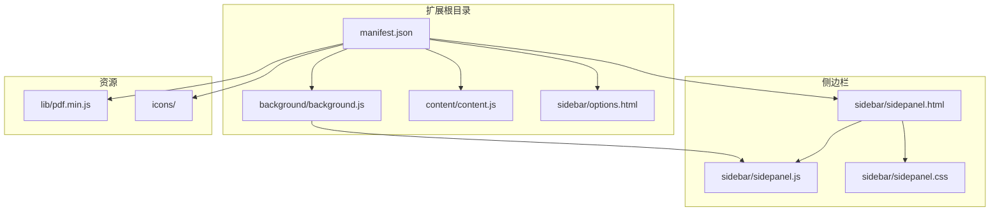
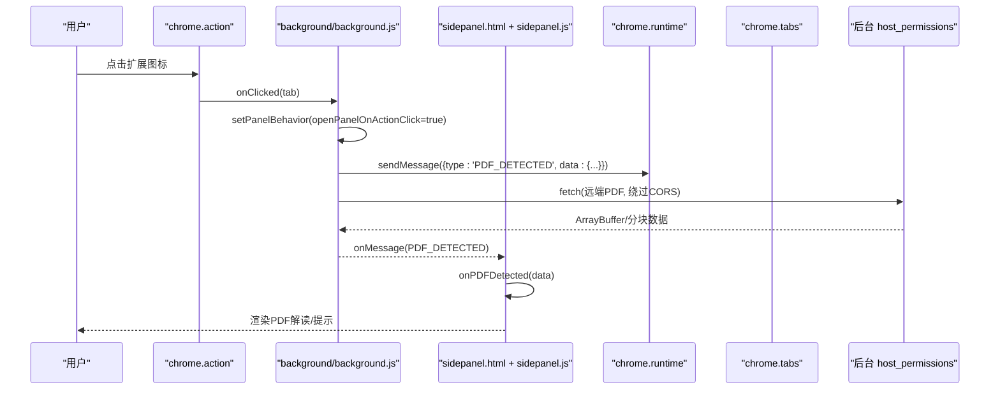
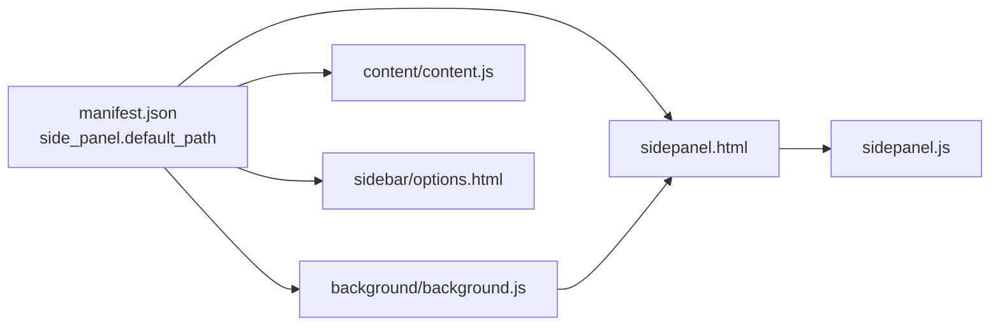

# Side Panel API

<cite>
**本文档引用的文件**
- [manifest.json](file://manifest.json)
- [background.js](file://background/background.js)
- [sidepanel.js](file://sidebar/sidepanel.js)
- [sidepanel.html](file://sidebar/sidepanel.html)
- [content.js](file://content/content.js)
- [options.html](file://sidebar/options.html)
- [README.md](file://README.md)
</cite>

## 目录
1. [简介](#简介)
2. [项目结构](#项目结构)
3. [核心组件](#核心组件)
4. [架构总览](#架构总览)
5. [详细组件分析](#详细组件分析)
6. [依赖关系分析](#依赖关系分析)
7. [性能考虑](#性能考虑)
8. [故障排除指南](#故障排除指南)
9. [结论](#结论)
10. [附录](#附录)

## 简介
本指南面向使用 Chrome 扩展 Side Panel API 的开发者，围绕“投资助手”扩展的 Side Panel 实现，系统讲解如何正确调用 chrome.sidePanel API、管理侧边栏生命周期、配置默认路径、动态加载内容、处理用户交互，以及与主页面的通信与状态同步。文档同时涵盖权限声明、错误处理与最佳实践，并提供完整的调用示例路径与参考。

## 项目结构
该项目采用 Manifest V3 标准，侧边栏页面位于 sidebar 目录，后台脚本负责侧边栏打开、行为控制与消息路由，内容脚本负责检测 PDF 并向后台发送信号。

图表来源
- [manifest.json:1-48](file://manifest.json#L1-L48)
- [background.js:1-307](file://background/background.js#L1-L307)
- [sidepanel.html:1-646](file://sidebar/sidepanel.html#L1-L646)
- [sidepanel.js:1-800](file://sidebar/sidepanel.js#L1-L800)

章节来源
- [manifest.json:1-48](file://manifest.json#L1-L48)
- [README.md:108-126](file://README.md#L108-L126)

## 核心组件
- Manifest 配置：声明 side_panel.default_path、permissions、action 等
- 后台脚本：注册 action 点击事件以打开侧边栏，设置 panel 行为，监听 tab 更新检测 PDF，转发消息
- 侧边栏页面：四标签布局，包含热点信息、选股器、估值计算器、财报解读、股票分析、AI 对话等模块
- 内容脚本：检测嵌入式 PDF，向后台发送信号
- 设置页面：LLM 服务商配置与关注公司管理

章节来源
- [manifest.json:6-18](file://manifest.json#L6-L18)
- [background.js:11-19](file://background/background.js#L11-L19)
- [sidepanel.html:33-40](file://sidebar/sidepanel.html#L33-L40)
- [content.js:11-28](file://content/content.js#L11-L28)
- [options.html:46-68](file://sidebar/options.html#L46-L68)

## 架构总览
Side Panel 的调用链路如下：用户点击扩展图标 → 后台脚本打开侧边栏 → 侧边栏页面加载并初始化 → 侧边栏与后台通过 runtime messaging 通信 → 后台通过 host_permissions 绕过 CORS 下载 PDF 并解析 → 侧边栏渲染结果并提供交互。

图表来源
- [background.js:12-19](file://background/background.js#L12-L19)
- [background.js:22-34](file://background/background.js#L22-L34)
- [background.js:37-117](file://background/background.js#L37-L117)
- [background.js:125-177](file://background/background.js#L125-L177)
- [sidepanel.js:974-979](file://sidebar/sidepanel.js#L974-L979)

## 详细组件分析

### 1) Side Panel API 调用与生命周期管理
- 打开侧边栏
  - 使用 chrome.action.onClicked 监听图标点击，调用 chrome.sidePanel.open({ tabId }) 打开指定标签的侧边栏
  - 参考路径：[background.js:12-14](file://background/background.js#L12-L14)
- 设置面板行为
  - 使用 chrome.sidePanel.setPanelBehavior({ openPanelOnActionClick: true }) 在安装时设置点击图标即打开侧边栏
  - 参考路径：[background.js:18](file://background/background.js#L18)
- 生命周期要点
  - 侧边栏随标签页打开/关闭而存在，后台监听 tabs.onUpdated 以检测 PDF 变化并向侧边栏广播
  - 参考路径：[background.js:22-34](file://background/background.js#L22-L34)

章节来源
- [background.js:12-19](file://background/background.js#L12-L19)
- [background.js:22-34](file://background/background.js#L22-L34)

### 2) setOptions 与 setPanelBehavior 的使用
- setPanelBehavior
  - 作用：控制点击 action 图标时是否自动打开侧边栏
  - 调用时机：扩展安装时设置
  - 参考路径：[background.js:18](file://background/background.js#L18)
- setOptions
  - 说明：Manifest V3 中，Side Panel 的默认路径通过 manifest 的 side_panel.default_path 配置，不涉及运行时 setOptions 调用
  - 参考路径：[manifest.json:16-18](file://manifest.json#L16-L18)

章节来源
- [background.js](file://background/background.js#L18)
- [manifest.json:16-18](file://manifest.json#L16-L18)

### 3) 显示与隐藏控制
- 显示
  - 点击扩展图标触发打开侧边栏
  - 参考路径：[background.js:12-14](file://background/background.js#L12-L14)
- 隐藏
  - 侧边栏本身无显式关闭 API；可通过切换标签页或关闭标签页实现“隐藏”
  - 若需在特定逻辑中关闭，可在业务层通过 UI 切换或在后台脚本中关闭当前标签页的侧边栏（需配合其他 API）

章节来源
- [background.js:12-14](file://background/background.js#L12-L14)

### 4) 与 manifest.json 中 side_panel 的关系
- default_path
  - 作用：指定侧边栏默认加载的 HTML 页面
  - 配置：side_panel.default_path = "sidebar/sidepanel.html"
  - 参考路径：[manifest.json:16-18](file://manifest.json#L16-L18)
- 与 setOptions 的关系
  - Manifest 中的 default_path 为静态配置，不等同于运行时 setOptions；两者共同决定侧边栏初始加载路径
  - 参考路径：[manifest.json:16-18](file://manifest.json#L16-L18)

章节来源
- [manifest.json:16-18](file://manifest.json#L16-L18)

### 5) 默认路径设置、动态内容加载与用户交互
- 默认路径
  - 通过 manifest 的 side_panel.default_path 指定
  - 参考路径：[manifest.json:16-18](file://manifest.json#L16-L18)
- 动态内容加载
  - 侧边栏页面 sidepanel.html 采用四标签布局，各模块在 DOMContentLoaded 后初始化并加载数据
  - 参考路径：[sidepanel.html:33-40](file://sidebar/sidepanel.html#L33-L40)
  - 初始化逻辑：[sidepanel.js:591-607](file://sidebar/sidepanel.js#L591-L607)
- 用户交互
  - 标签切换、设置面板、搜索、导出、TTS 播报等均在 sidepanel.js 中绑定事件
  - 参考路径：[sidepanel.js:641-986](file://sidebar/sidepanel.js#L641-L986)

章节来源
- [manifest.json:16-18](file://manifest.json#L16-L18)
- [sidepanel.html:33-40](file://sidebar/sidepanel.html#L33-L40)
- [sidepanel.js:591-607](file://sidebar/sidepanel.js#L591-L607)
- [sidepanel.js:641-986](file://sidebar/sidepanel.js#L641-L986)

### 6) 侧边栏与主页面的通信机制与状态同步
- 通信机制
  - 侧边栏通过 chrome.runtime.sendMessage 向后台发送请求（如热点抓取、PDF 下载、获取当前 tab）
  - 后台通过 chrome.runtime.onMessage 监听并处理，必要时广播给侧边栏
  - 参考路径：
    - [sidepanel.js:1073-1086](file://sidebar/sidepanel.js#L1073-L1086)
    - [background.js:37-117](file://background/background.js#L37-L117)
- 状态同步
  - 侧边栏维护全局状态对象 state，包含 PDF 文本、报告、聊天历史、活跃标签、策略、设置、TTS、搜索计时器等
  - 参考路径：[sidepanel.js:516-584](file://sidebar/sidepanel.js#L516-L584)
- PDF 检测与通知
  - 后台监听 tabs.onUpdated，检测 PDF URL 并向侧边栏广播 PDF_DETECTED
  - 内容脚本检测嵌入式 PDF 并发送 PDF_DETECTED
  - 参考路径：
    - [background.js:22-34](file://background/background.js#L22-L34)
    - [content.js:11-28](file://content/content.js#L11-L28)

章节来源
- [sidepanel.js:1073-1086](file://sidebar/sidepanel.js#L1073-L1086)
- [background.js:37-117](file://background/background.js#L37-L117)
- [sidepanel.js:516-584](file://sidebar/sidepanel.js#L516-L584)
- [background.js:22-34](file://background/background.js#L22-L34)
- [content.js:11-28](file://content/content.js#L11-L28)

### 7) 权限检查与错误处理
- 权限声明
  - permissions: ["sidePanel", "activeTab", "scripting", "storage", "downloads"]
  - host_permissions: ["<all_urls>"]（用于后台绕过 CORS）
  - 参考路径：[manifest.json:6-15](file://manifest.json#L6-L15)
- 错误处理
  - PDF 下载失败时返回错误信息，侧边栏显示提示
  - 参考路径：[background.js:173-177](file://background/background.js#L173-L177)
  - 热点抓取异常捕获与降级处理
  - 参考路径：[sidepanel.js:1331-1333](file://sidebar/sidepanel.js#L1331-L1333)
- 最佳实践
  - 使用 Promise.allSettled 并行抓取，避免单点阻塞
  - 对 RSS/JSON 解析失败进行降级（返回原始文本）
  - 参考路径：[sidepanel.js:1324-1333](file://sidebar/sidepanel.js#L1324-L1333)

章节来源
- [manifest.json:6-15](file://manifest.json#L6-L15)
- [background.js:173-177](file://background/background.js#L173-L177)
- [sidepanel.js:1324-1333](file://sidebar/sidepanel.js#L1324-L1333)

### 8) API 调用示例（路径参考）
- 打开侧边栏
  - [background.js:12-14](file://background/background.js#L12-L14)
- 设置面板行为
  - [background.js:18](file://background/background.js#L18)
- 监听 PDF 检测
  - [background.js:22-34](file://background/background.js#L22-L34)
  - [content.js:11-28](file://content/content.js#L11-L28)
- 向后台发送请求（热点抓取/下载PDF/获取当前tab）
  - [sidepanel.js:1073-1086](file://sidebar/sidepanel.js#L1073-L1086)
- 后台处理请求与响应
  - [background.js:37-117](file://background/background.js#L37-L117)
- 设置默认路径
  - [manifest.json:16-18](file://manifest.json#L16-L18)

章节来源
- [background.js:12-14](file://background/background.js#L12-L14)
- [background.js](file://background/background.js#L18)
- [background.js:22-34](file://background/background.js#L22-L34)
- [content.js:11-28](file://content/content.js#L11-L28)
- [sidepanel.js:1073-1086](file://sidebar/sidepanel.js#L1073-L1086)
- [background.js:37-117](file://background/background.js#L37-L117)
- [manifest.json:16-18](file://manifest.json#L16-L18)

## 依赖关系分析
- Manifest 依赖
  - side_panel.default_path 指向 sidepanel.html
  - permissions 包含 sidePanel、activeTab、scripting、storage、downloads
  - host_permissions 为 <all_urls>
  - 参考路径：[manifest.json:6-18](file://manifest.json#L6-L18)
- 后台依赖
  - 依赖 activeTab、scripting、storage、downloads 权限
  - 依赖 host_permissions 绕过 CORS
  - 参考路径：[manifest.json:6-15](file://manifest.json#L6-L15)
- 侧边栏依赖
  - sidepanel.html 作为默认页面
  - sidepanel.js 初始化各模块并绑定事件
  - 参考路径：[sidepanel.html:1-10](file://sidebar/sidepanel.html#L1-L10)
  - 参考路径：[sidepanel.js:591-607](file://sidebar/sidepanel.js#L591-L607)

图表来源
- [manifest.json:6-18](file://manifest.json#L6-L18)
- [sidepanel.html:1-10](file://sidebar/sidepanel.html#L1-L10)
- [sidepanel.js:591-607](file://sidebar/sidepanel.js#L591-L607)

章节来源
- [manifest.json:6-18](file://manifest.json#L6-L18)
- [sidepanel.html:1-10](file://sidebar/sidepanel.html#L1-L10)
- [sidepanel.js:591-607](file://sidebar/sidepanel.js#L591-L607)

## 性能考虑
- 并行抓取与降级
  - 使用 Promise.allSettled 并行抓取多个数据源，失败项单独处理，避免整体阻塞
  - 参考路径：[sidepanel.js:1324-1333](file://sidebar/sidepanel.js#L1324-L1333)
- PDF 大文件分块传输
  - 超过阈值的 PDF 采用分块传输，减少消息传递体积
  - 参考路径：[background.js:160-167](file://background/background.js#L160-L167)
- UI 搜索防抖
  - 输入搜索时使用 setTimeout 防抖，降低频繁请求
  - 参考路径：[sidepanel.js:689-697](file://sidebar/sidepanel.js#L689-L697)
- 自动刷新与去重
  - 热点信息自动刷新，合并去重并计算重合度，提升信息质量
  - 参考路径：[sidepanel.js:1291-1363](file://sidebar/sidepanel.js#L1291-L1363)

章节来源
- [sidepanel.js:1324-1333](file://sidebar/sidepanel.js#L1324-L1333)
- [background.js:160-167](file://background/background.js#L160-L167)
- [sidepanel.js:689-697](file://sidebar/sidepanel.js#L689-L697)
- [sidepanel.js:1291-1363](file://sidebar/sidepanel.js#L1291-L1363)

## 故障排除指南
- 侧边栏未打开
  - 检查 permissions 中是否包含 sidePanel
  - 检查 action 点击事件是否正确注册
  - 参考路径：[manifest.json:6-12](file://manifest.json#L6-L12)
  - 参考路径：[background.js:12-14](file://background/background.js#L12-L14)
- PDF 无法解析
  - 确认后台具有 host_permissions 权限
  - 检查返回的 Content-Type 是否为 PDF
  - 参考路径：[manifest.json:13-15](file://manifest.json#L13-L15)
  - 参考路径：[background.js:148-152](file://background/background.js#L148-L152)
- 热点抓取失败
  - 捕获异常并降级处理，检查网络与数据源可用性
  - 参考路径：[sidepanel.js:1331-1333](file://sidebar/sidepanel.js#L1331-L1333)
- 设置页面无法保存
  - 检查 localStorage 是否可用，API Key 是否为空
  - 参考路径：[options.html:102-120](file://sidebar/options.html#L102-L120)

章节来源
- [manifest.json:6-15](file://manifest.json#L6-L15)
- [background.js:12-14](file://background/background.js#L12-L14)
- [background.js:148-152](file://background/background.js#L148-L152)
- [sidepanel.js:1331-1333](file://sidebar/sidepanel.js#L1331-L1333)
- [options.html:102-120](file://sidebar/options.html#L102-L120)

## 结论
本项目完整展示了 Side Panel API 的典型用法：通过 action 点击打开侧边栏、设置面板行为、监听 PDF 变化并通过 runtime messaging 实现与后台的数据交互。Manifest 中的 side_panel.default_path 与 setPanelBehavior 共同决定了侧边栏的初始行为。通过合理的权限设计、错误处理与性能优化，Side Panel 能够提供流畅的用户体验与强大的功能扩展能力。

## 附录
- 术语
  - Side Panel：Chrome 扩展侧边栏界面
  - Manifest V3：Chrome 扩展最新规范
  - host_permissions：允许后台绕过 CORS 的权限
- 相关文件
  - [manifest.json:1-48](file://manifest.json#L1-L48)
  - [background.js:1-307](file://background/background.js#L1-L307)
  - [sidepanel.html:1-646](file://sidebar/sidepanel.html#L1-L646)
  - [sidepanel.js:1-5523](file://sidebar/sidepanel.js#L1-L5523)
  - [content.js:1-36](file://content/content.js#L1-L36)
  - [options.html:1-124](file://sidebar/options.html#L1-L124)
  - [README.md:1-147](file://README.md#L1-L147)