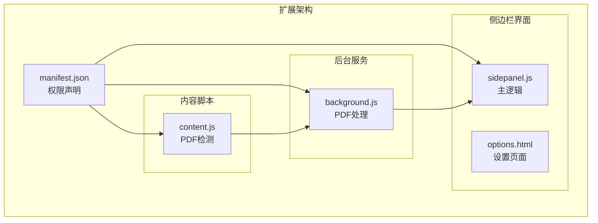
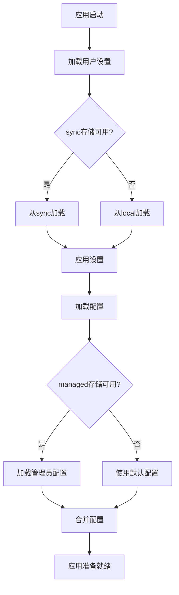
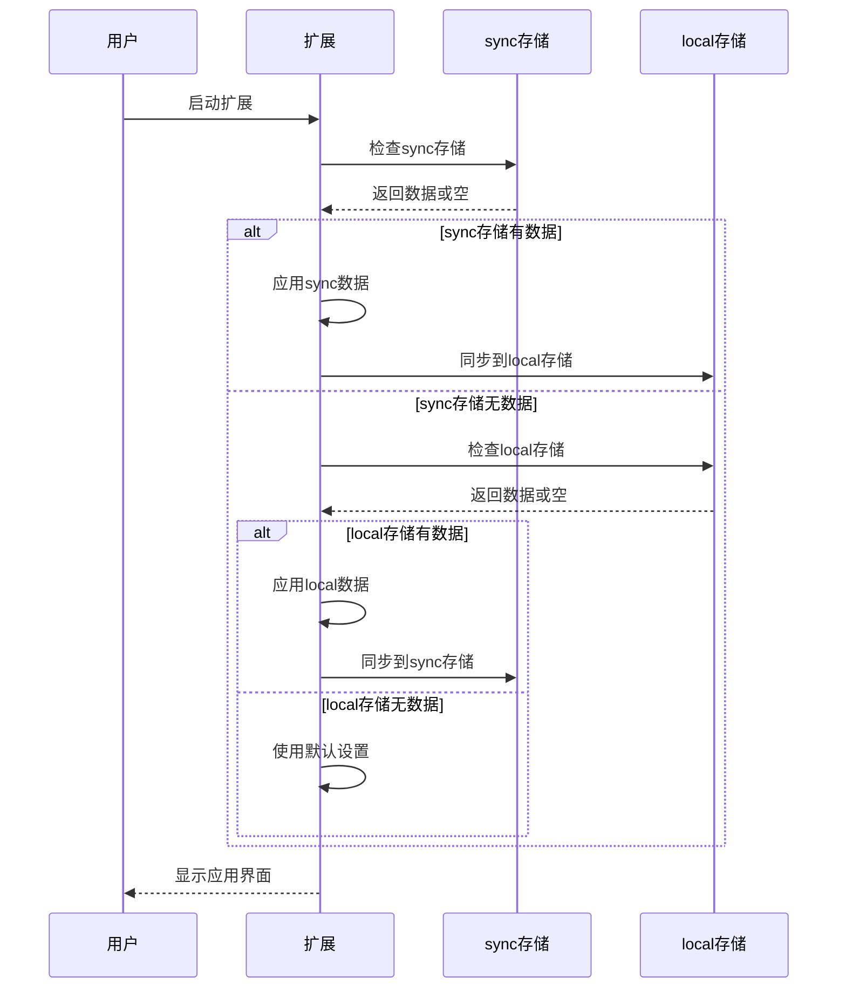
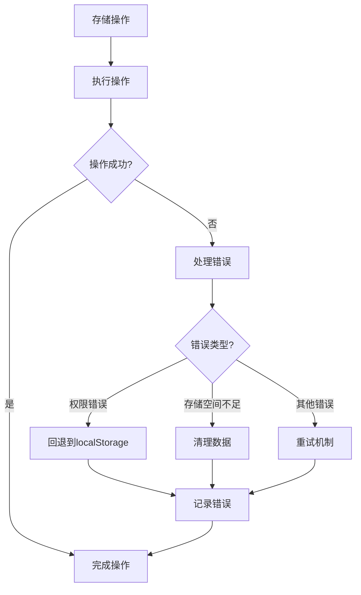
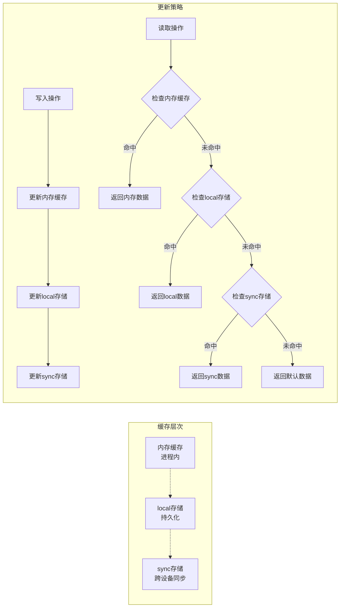
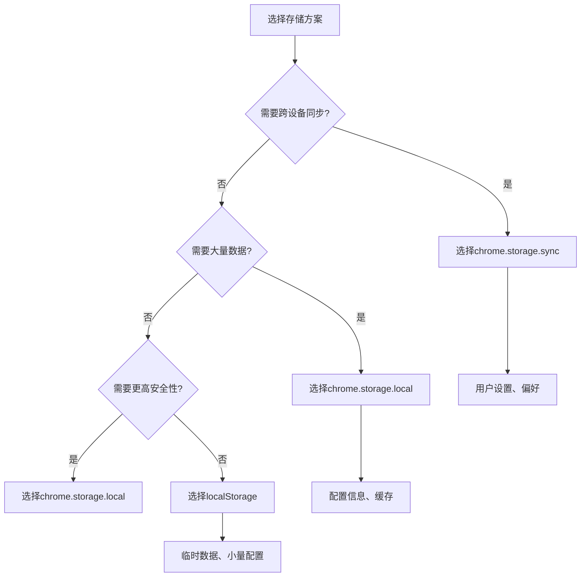

# Storage API 使用指南

<cite>
**本文档引用的文件**
- [manifest.json](file://manifest.json)
- [background.js](file://background/background.js)
- [sidepanel.js](file://sidebar/sidepanel.js)
- [content.js](file://content/content.js)
- [options.html](file://sidebar/options.html)
</cite>

## 目录
1. [简介](#简介)
2. [项目结构概述](#项目结构概述)
3. [Chrome Storage API 概述](#chrome-storage-api-概述)
4. [存储类型详解](#存储类型详解)
5. [数据持久化策略](#数据持久化策略)
6. [异步操作处理](#异步操作处理)
7. [数据访问模式](#数据访问模式)
8. [完整使用示例](#完整使用示例)
9. [localStorage 与 chrome.storage 区别](#localstorage-与-chrome-storage-区别)
10. [迁移方法](#迁移方法)
11. [最佳实践](#最佳实践)
12. [故障排除](#故障排除)

## 简介

本指南详细介绍了Chrome扩展中Chrome Storage API的使用模式，特别是针对投资助手扩展的实际应用场景。该扩展使用多种存储策略来管理用户设置、应用状态和配置信息，涵盖了sync、local和managed存储类型的差异和适用场景。

## 项目结构概述

该项目是一个功能丰富的Chrome扩展，主要包含以下核心组件：



**图表来源**
- [manifest.json:1-48](file://manifest.json#L1-L48)
- [background.js:1-307](file://background/background.js#L1-L307)
- [sidepanel.js:1-800](file://sidebar/sidepanel.js#L1-L800)

**章节来源**
- [manifest.json:1-48](file://manifest.json#L1-L48)

## Chrome Storage API 概述

Chrome Storage API提供了三种不同的存储类型，每种都有特定的用途和特性：

### 存储类型对比

| 存储类型 | 特性 | 适用场景 | 同步能力 | 大小限制 |
|---------|------|----------|----------|----------|
| **sync** | 同步到用户Chrome账户 | 跨设备设置同步 | ✅ | 8KB-100KB |
| **local** | 本地存储 | 临时数据、缓存 | ❌ | 5MB-10MB |
| **managed** | 管理员配置 | 企业部署策略 | ✅ | 取决于管理员 |

### 权限要求

扩展需要在manifest中声明相应的权限：

```json
{
  "permissions": [
    "storage"
  ]
}
```

**章节来源**
- [manifest.json:6-12](file://manifest.json#L6-L12)

## 存储类型详解

### sync 存储类型

sync存储用于需要跨设备同步的用户设置和配置信息。在投资助手扩展中，主要用于热点配置的同步。

#### 实际使用示例

```javascript
// 保存热点配置到sync存储
chrome.storage.sync.set({ hotspotConfig: config });

// 从sync存储读取热点配置
chrome.storage.sync.get('hotspotConfig', (result) => {
  if (result.hotspotConfig) {
    Object.assign(state.hotspotConfig, result.hotspotConfig);
  }
});
```

#### 适用场景
- 用户偏好设置
- 跨设备同步的配置
- 应用状态的备份

### local 存储类型

local存储用于本地持久化数据，不需要跨设备同步。投资助手扩展广泛使用local存储来保存各种配置和状态。

#### 实际使用示例

```javascript
// 保存热点配置到local存储
chrome.storage.local.set({ hotspotConfig: config });

// 从local存储读取热点配置
chrome.storage.local.get('hotspotConfig', (result) => {
  if (result.hotspotConfig) {
    Object.assign(state.hotspotConfig, result.hotspotConfig);
  }
});
```

#### 适用场景
- 临时数据缓存
- 大量配置信息
- 不需要跨设备同步的数据

### managed 存储类型

managed存储用于接收管理员配置，通常在企业环境中使用。虽然当前扩展未使用managed存储，但可以作为未来功能的基础。

#### 适用场景
- 企业部署策略
- 管理员强制配置
- 安全策略设置

**章节来源**
- [sidepanel.js:1664-1668](file://sidebar/sidepanel.js#L1664-L1668)
- [sidepanel.js:1693-1717](file://sidebar/sidepanel.js#L1693-L1717)

## 数据持久化策略

### 分层存储架构

投资助手扩展采用了分层的存储策略，根据数据的重要性和使用频率选择合适的存储类型：



**图表来源**
- [sidepanel.js:1693-1717](file://sidebar/sidepanel.js#L1693-L1717)

### 数据迁移策略

扩展实现了灵活的数据迁移机制，确保用户设置在不同版本间的安全迁移：



**图表来源**
- [sidepanel.js:1664-1668](file://sidebar/sidepanel.js#L1664-L1668)
- [sidepanel.js:1693-1717](file://sidebar/sidepanel.js#L1693-L1717)

**章节来源**
- [sidepanel.js:1664-1717](file://sidebar/sidepanel.js#L1664-L1717)

## 异步操作处理

### Promise 风格的存储操作

Chrome Storage API支持Promise风格的操作，提供了更好的异步处理体验：

```javascript
// Promise风格的存储操作
async function saveSettings(settings) {
  try {
    await chrome.storage.local.set({ settings });
    console.log('设置保存成功');
  } catch (error) {
    console.error('保存设置失败:', error);
  }
}

async function loadSettings() {
  try {
    const result = await chrome.storage.local.get('settings');
    return result.settings || {};
  } catch (error) {
    console.error('加载设置失败:', error);
    return {};
  }
}
```

### 错误处理策略

扩展实现了完善的错误处理机制，确保存储操作失败时的优雅降级：



**图表来源**
- [sidepanel.js:609-637](file://sidebar/sidepanel.js#L609-L637)

**章节来源**
- [sidepanel.js:609-637](file://sidebar/sidepanel.js#L609-L637)

## 数据访问模式

### 状态管理模式

扩展采用集中式状态管理模式，所有数据访问都通过统一的状态管理函数：

```javascript
const state = {
  settings: {
    provider: 'deepseek',
    baseUrl: 'https://api.deepseek.com/v1',
    apiKey: '',
    model: 'deepseek-chat'
  },
  hotspotConfig: {
    interval: 5,
    clsEnabled: true,
    eastmoneyEnabled: true,
    customSources: [],
    extraKeywords: []
  }
};

// 读取设置
function loadSettings() {
  const saved = localStorage.getItem('er_settings');
  if (saved) {
    try { 
      Object.assign(state.settings, JSON.parse(saved)); 
    } catch (e) {}
  }
}

// 保存设置
function saveSettings() {
  localStorage.setItem('er_settings', JSON.stringify(state.settings));
}
```

### 缓存策略

扩展实现了多层次的缓存策略，平衡性能和数据一致性：



**图表来源**
- [sidepanel.js:516-584](file://sidebar/sidepanel.js#L516-L584)

**章节来源**
- [sidepanel.js:516-584](file://sidebar/sidepanel.js#L516-L584)

## 完整使用示例

### 用户设置保存示例

```javascript
// 设置面板中的设置保存
function saveSettings() {
  state.settings = {
    provider: $('#llm-provider').value,
    baseUrl: $('#llm-base-url').value,
    apiKey: $('#llm-api-key').value,
    model: $('#llm-model').value
  };
  
  // 保存到localStorage（本地持久化）
  localStorage.setItem('er_settings', JSON.stringify(state.settings));
  
  // 显示保存状态
  const s = $('#settings-status');
  if (!state.settings.apiKey) {
    s.textContent = '⚠️ 请填写 API Key';
    s.className = 'settings-status error';
  } else {
    s.textContent = '✅ 设置已保存';
    s.className = 'settings-status success';
  }
  setTimeout(() => { s.textContent = ''; }, 3000);
}
```

### 应用状态管理示例

```javascript
// 热点配置的状态管理
function saveHotspotConfig() {
  const config = {
    interval: parseInt($('#hs-refresh-interval').value) || 5,
    clsEnabled: $('#hs-src-cls').checked,
    eastmoneyEnabled: $('#hs-src-eastmoney').checked,
    customSources: $('#hs-sources').value.split('\n').filter(Boolean),
    extraKeywords: $('#hs-extra-keywords').value.split('\n').filter(Boolean),
    rssEnabled: {}
  };

  // 保存到chrome.storage.local
  chrome.storage.local.set({ hotspotConfig: config });
  startHotspotAutoRefresh();
  showToast('✅ 热点配置已保存');
}

function loadHotspotConfig() {
  // 从chrome.storage.local读取
  chrome.storage.local.get('hotspotConfig', (result) => {
    if (result.hotspotConfig) {
      Object.assign(state.hotspotConfig, result.hotspotConfig);
      // 恢复RSS启用状态
      const savedRSS = state.hotspotConfig.rssEnabled || {};
      DEFAULT_RSS_SOURCES.forEach(src => {
        if (savedRSS[src.url] !== undefined) {
          src.enabled = savedRSS[src.url];
        }
      });
      // 同步到UI
      const ri = $('#hs-refresh-interval');
      const sc = $('#hs-src-cls');
      const se = $('#hs-src-eastmoney');
      const ss = $('#hs-sources');
      const ek = $('#hs-extra-keywords');
      if (ri) ri.value = state.hotspotConfig.interval || 5;
      if (sc) sc.checked = state.hotspotConfig.clsEnabled !== false;
      if (se) se.checked = state.hotspotConfig.eastmoneyEnabled !== false;
      if (ss) ss.value = (state.hotspotConfig.customSources || []).join('\n');
      if (ek) ek.value = (state.hotspotConfig.extraKeywords || []).join('\n');
    }
  });
}
```

### 数据迁移策略示例

```javascript
// 关注列表的数据迁移
function loadWatchlist() {
  // 首先尝试从localStorage加载
  const saved = localStorage.getItem('er_watchlist');
  if (saved) {
    try { 
      state.watchlist = JSON.parse(saved); 
    } catch (e) { 
      state.watchlist = []; 
    }
  }
  renderCompanyChips();
}

function saveWatchlist() {
  // 保存到localStorage
  localStorage.setItem('er_watchlist', JSON.stringify(state.watchlist));
  renderCompanyChips();
}
```

**章节来源**
- [sidepanel.js:609-637](file://sidebar/sidepanel.js#L609-L637)
- [sidepanel.js:1664-1717](file://sidebar/sidepanel.js#L1664-L1717)
- [sidepanel.js:1935-1949](file://sidebar/sidepanel.js#L1935-L1949)

## localStorage 与 chrome.storage 区别

### 主要差异对比

| 特性 | localStorage | chrome.storage |
|------|-------------|----------------|
| **存储位置** | 浏览器本地存储 | Chrome扩展存储API |
| **同步能力** | 本地存储，不跨设备 | 可选择同步到Chrome账户 |
| **数据大小** | ~5-10MB | sync: 8KB-100KB, local: 5MB-10MB |
| **访问权限** | 仅扩展自身 | 可设置访问权限 |
| **生命周期** | 持久化存储 | 可能被用户清除 |
| **安全性** | 相对较低 | 更安全的扩展环境 |

### 适用场景选择



**图表来源**
- [sidepanel.js:609-637](file://sidebar/sidepanel.js#L609-L637)

**章节来源**
- [sidepanel.js:609-637](file://sidebar/sidepanel.js#L609-L637)

## 迁移方法

### 从 localStorage 迁移到 chrome.storage

扩展提供了完整的迁移机制，确保用户数据的无缝迁移：

```javascript
// 迁移用户设置
function migrateSettings() {
  // 检查localStorage中是否存在旧设置
  const oldSettings = localStorage.getItem('er_settings');
  if (oldSettings) {
    try {
      const settings = JSON.parse(oldSettings);
      
      // 迁移到chrome.storage.local
      chrome.storage.local.set({ er_settings: settings }, () => {
        if (chrome.runtime.lastError) {
          console.error('迁移失败:', chrome.runtime.lastError);
          return;
        }
        
        // 删除旧的localStorage数据
        localStorage.removeItem('er_settings');
        console.log('设置迁移完成');
      });
    } catch (error) {
      console.error('解析旧设置失败:', error);
    }
  }
}

// 迁移关注列表
function migrateWatchlist() {
  const oldWatchlist = localStorage.getItem('er_watchlist');
  if (oldWatchlist) {
    try {
      const watchlist = JSON.parse(oldWatchlist);
      
      chrome.storage.local.set({ er_watchlist: watchlist }, () => {
        if (!chrome.runtime.lastError) {
          localStorage.removeItem('er_watchlist');
          console.log('关注列表迁移完成');
        }
      });
    } catch (error) {
      console.error('解析关注列表失败:', error);
    }
  }
}
```

### 数据兼容性处理

```javascript
// 检查并处理数据版本
function checkDataVersion() {
  const version = localStorage.getItem('data_version');
  if (!version || version < CURRENT_VERSION) {
    // 执行数据迁移
    performDataMigration(version);
    localStorage.setItem('data_version', CURRENT_VERSION);
  }
}

function performDataMigration(oldVersion) {
  switch (oldVersion) {
    case '1.0':
      migrateFromV1();
      break;
    case '2.0':
      migrateFromV2();
      break;
    default:
      // 处理未知版本，使用默认数据
      resetToDefault();
  }
}
```

**章节来源**
- [sidepanel.js:609-637](file://sidebar/sidepanel.js#L609-L637)
- [sidepanel.js:1935-1949](file://sidebar/sidepanel.js#L1935-L1949)

## 最佳实践

### 存储设计原则

1. **分层存储策略**
   - 用户设置：chrome.storage.sync
   - 配置信息：chrome.storage.local
   - 临时数据：localStorage

2. **错误处理**
   ```javascript
   async function safeStorageOperation(operation) {
     try {
       return await operation();
     } catch (error) {
       console.error('存储操作失败:', error);
       // 降级到localStorage或其他后备方案
       return fallbackOperation(error);
     }
   }
   ```

3. **性能优化**
   - 批量操作：合并多个set操作
   - 延迟加载：按需加载大型数据
   - 缓存策略：实现多级缓存

### 安全考虑

```javascript
// 敏感数据加密存储
function encryptAndStore(key, data) {
  const encrypted = encrypt(JSON.stringify(data));
  return chrome.storage.local.set({ [key]: encrypted });
}

function decryptAndLoad(key) {
  return chrome.storage.local.get(key).then(result => {
    if (result[key]) {
      return JSON.parse(decrypt(result[key]));
    }
    return null;
  });
}
```

### 数据完整性保证

```javascript
// 数据校验和
function storeWithChecksum(key, data) {
  const checksum = calculateChecksum(data);
  const payload = { data, checksum, timestamp: Date.now() };
  return chrome.storage.local.set({ [key]: payload });
}

function loadWithValidation(key) {
  return chrome.storage.local.get(key).then(result => {
    if (result[key]) {
      const { data, checksum, timestamp } = result[key];
      if (calculateChecksum(data) === checksum) {
        return data;
      }
    }
    return null;
  });
}
```

## 故障排除

### 常见问题诊断

1. **存储权限问题**
   ```javascript
   // 检查存储权限
   chrome.permissions.contains({ permissions: ['storage'] }, (hasPermission) => {
     if (!hasPermission) {
       console.error('缺少storage权限');
       // 引导用户授予权限
     }
   });
   ```

2. **存储空间不足**
   ```javascript
   // 检查存储使用情况
   chrome.storage.local.getBytesInUse((bytes) => {
     const usage = bytes / (1024 * 1024); // MB
     if (usage > 8) {
       console.warn('local存储接近上限');
       // 清理不必要的数据
     }
   });
   ```

3. **数据损坏恢复**
   ```javascript
   // 检测并修复损坏的数据
   function recoverCorruptedData() {
     const corruptedKeys = [];
     
     // 检查所有存储的数据
     chrome.storage.local.get(null, (allData) => {
       for (const [key, value] of Object.entries(allData)) {
         try {
           JSON.parse(JSON.stringify(value));
         } catch (e) {
           corruptedKeys.push(key);
         }
       }
       
       // 删除损坏的数据
       if (corruptedKeys.length > 0) {
         chrome.storage.local.remove(corruptedKeys);
         console.log(`删除了 ${corruptedKeys.length} 个损坏的数据项`);
       }
     });
   }
   ```

### 性能监控

```javascript
// 监控存储操作性能
function monitorStoragePerformance(operation, key) {
  const startTime = performance.now();
  
  return operation().finally(() => {
    const endTime = performance.now();
    const duration = endTime - startTime;
    
    if (duration > 100) { // 超过100ms
      console.warn(`存储操作耗时过长: ${duration}ms for ${key}`);
    }
  });
}
```

**章节来源**
- [sidepanel.js:609-637](file://sidebar/sidepanel.js#L609-L637)