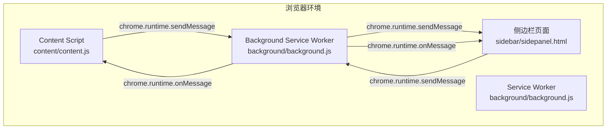
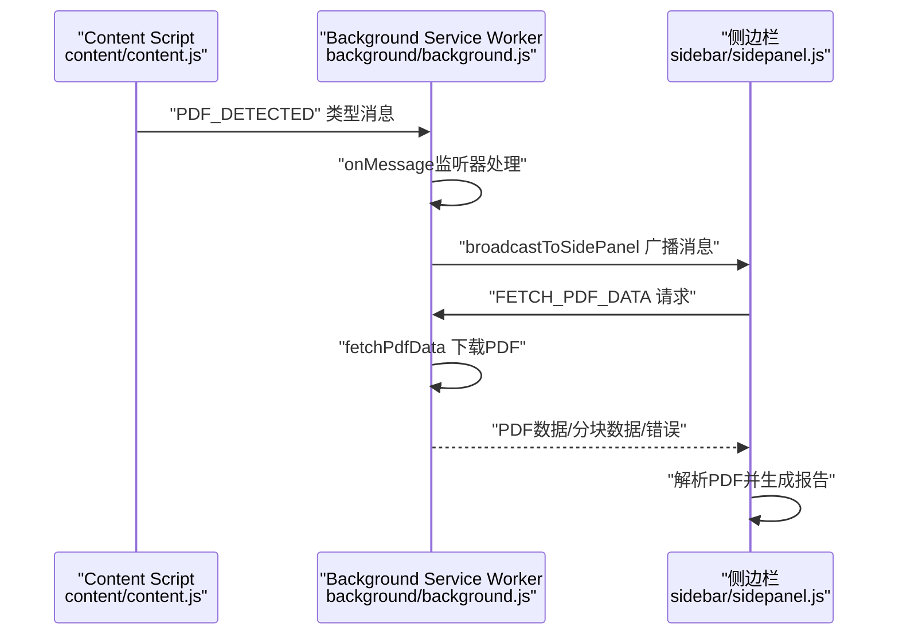
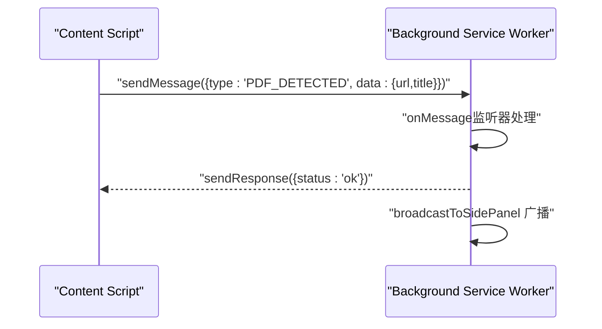
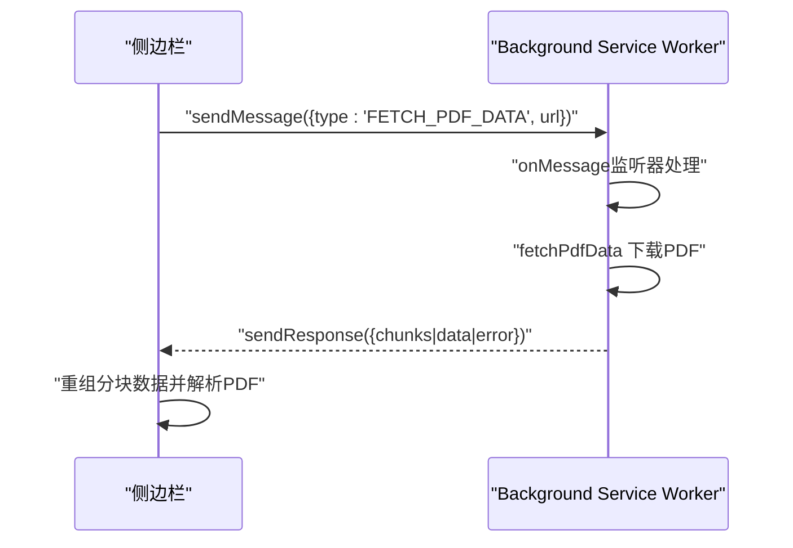
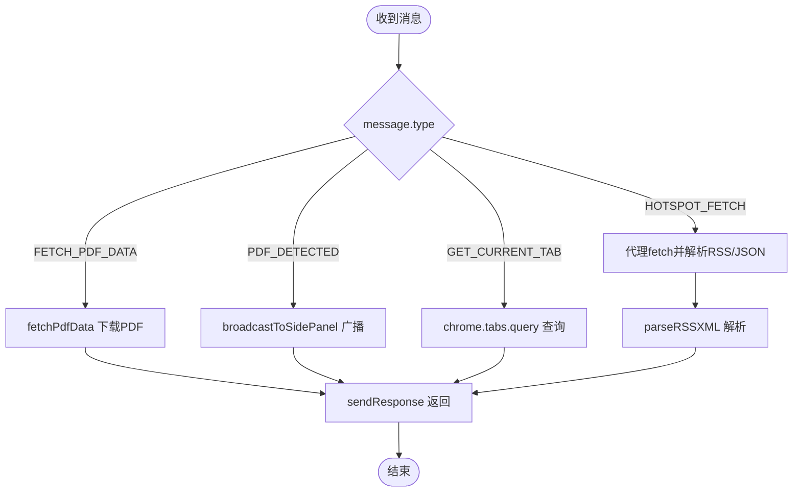

# 消息通信机制

<cite>
**本文档引用的文件**
- [manifest.json](file://manifest.json)
- [background.js](file://background/background.js)
- [content.js](file://content/content.js)
- [sidepanel.js](file://sidebar/sidepanel.js)
- [sidepanel.html](file://sidebar/sidepanel.html)
- [README.md](file://README.md)
</cite>

## 目录
1. [简介](#简介)
2. [项目结构](#项目结构)
3. [核心组件](#核心组件)
4. [架构总览](#架构总览)
5. [详细组件分析](#详细组件分析)
6. [依赖关系分析](#依赖关系分析)
7. [性能考量](#性能考量)
8. [故障排除指南](#故障排除指南)
9. [结论](#结论)

## 简介
本指南面向Chrome扩展开发者，系统讲解本项目中Content Script与Background Script之间的消息通信机制。文档覆盖chrome.runtime.sendMessage与chrome.runtime.onMessage的完整使用流程，包括消息监听器注册、消息格式定义、异步响应处理、双向通信示例、错误处理与性能优化，以及不同脚本间的通信边界与安全注意事项。

## 项目结构
该项目采用Manifest V3架构，包含以下关键模块：
- background/background.js：Service Worker，负责PDF下载、消息路由、热点数据抓取与RSS解析
- content/content.js：Content Script，负责检测网页中的嵌入式PDF并向background发送通知
- sidebar/sidepanel.js：侧边栏主逻辑，负责UI交互、消息监听与与background的双向通信
- sidebar/sidepanel.html：侧边栏页面结构
- manifest.json：扩展配置，声明权限与后台脚本

图表来源
- [background.js:36-117](file://background/background.js#L36-L117)
- [content.js:11-28](file://content/content.js#L11-L28)
- [sidepanel.js:974-979](file://sidebar/sidepanel.js#L974-L979)

章节来源
- [manifest.json:1-48](file://manifest.json#L1-L48)
- [README.md:108-126](file://README.md#L108-L126)

## 核心组件
本项目的通信核心围绕以下三个组件展开：
- Content Script（content/content.js）：在网页中检测嵌入式PDF，向background发送“PDF_DETECTED”类型消息
- Background Service Worker（background/background.js）：注册onMessage监听器，处理来自CS和SP的消息；负责PDF下载、热点数据抓取与RSS解析；通过broadcastToSidePanel向侧边栏广播消息
- 侧边栏（sidebar/sidepanel.js）：注册onMessage监听器接收background广播；通过sendMessage与background进行双向通信，如请求PDF数据、热点数据抓取等

章节来源
- [background.js:36-117](file://background/background.js#L36-L117)
- [content.js:11-28](file://content/content.js#L11-L28)
- [sidepanel.js:974-979](file://sidebar/sidepanel.js#L974-L979)

## 架构总览
下面的序列图展示了典型的消息流转过程：Content Script检测到PDF后通知Background，Background再向侧边栏广播PDF检测结果，侧边栏通过sendMessage请求PDF数据，Background执行下载并返回结果。

图表来源
- [content.js:22-27](file://content/content.js#L22-L27)
- [background.js:36-54](file://background/background.js#L36-L54)
- [background.js:124-177](file://background/background.js#L124-L177)
- [sidepanel.js:2641-2645](file://sidebar/sidepanel.js#L2641-L2645)

## 详细组件分析

### Content Script 与 Background 的消息通信
- 注册与发送：Content Script在页面加载完成后检测嵌入式PDF，使用chrome.runtime.sendMessage发送“PDF_DETECTED”类型消息，包含PDF URL与页面标题
- 监听与处理：Background在onMessage监听器中识别“PDF_DETECTED”，向侧边栏广播相同消息，并向CS返回状态确认
- 异步响应：CS发送消息后使用Promise.catch处理可能的错误，确保不会阻塞页面

图表来源
- [content.js:22-27](file://content/content.js#L22-L27)
- [background.js:36-54](file://background/background.js#L36-L54)

章节来源
- [content.js:11-36](file://content/content.js#L11-L36)
- [background.js:21-34](file://background/background.js#L21-L34)
- [background.js:36-54](file://background/background.js#L36-L54)

### 侧边栏与 Background 的双向消息通信
- 监听注册：侧边栏在DOM加载完成后注册chrome.runtime.onMessage监听器，接收来自background的“PDF_DETECTED”广播
- 请求发送：侧边栏通过chrome.runtime.sendMessage发送“FETCH_PDF_DATA”请求，携带PDF URL
- 响应处理：侧边栏使用Promise包装sendMessage，回调中处理错误与成功响应；对分块传输的数据进行重组
- 热点数据抓取：侧边栏通过“HOTSPOT_FETCH”类型消息请求background代理抓取，background解析RSS/Atom并返回统一格式

图表来源
- [sidepanel.js:2641-2645](file://sidebar/sidepanel.js#L2641-L2645)
- [background.js:124-177](file://background/background.js#L124-L177)
- [sidepanel.js:2652-2669](file://sidebar/sidepanel.js#L2652-L2669)

章节来源
- [sidepanel.js:974-979](file://sidebar/sidepanel.js#L974-L979)
- [sidepanel.js:1073-1086](file://sidebar/sidepanel.js#L1073-L1086)
- [background.js:36-117](file://background/background.js#L36-L117)

### Background 的消息路由与广播机制
- 路由处理：Background在onMessage监听器中根据message.type分发处理逻辑，包括PDF数据下载、热点数据抓取、当前tab信息查询等
- 广播机制：通过broadcastToSidePanel函数向侧边栏广播消息，若侧边栏未打开则忽略错误
- RSS解析：对RSS/Atom XML进行统一解析，返回items数组供侧边栏展示

图表来源
- [background.js:36-117](file://background/background.js#L36-L117)
- [background.js:181-186](file://background/background.js#L181-L186)
- [background.js:191-251](file://background/background.js#L191-L251)

章节来源
- [background.js:36-117](file://background/background.js#L36-L117)
- [background.js:181-186](file://background/background.js#L181-L186)
- [background.js:191-251](file://background/background.js#L191-L251)

### 消息格式定义与约定
- 消息字段：type（必需，字符串，标识消息类型）；data（可选，对象，承载业务数据）；url/options（可选，用于FETCH_PDF_DATA/HOTSPOT_FETCH）
- 响应约定：onMessage监听器中使用sendResponse返回结果；若需要异步处理，需在监听器中返回true以保持消息通道开放
- 广播约定：broadcastToSidePanel通过chrome.runtime.sendMessage发送消息，不期望响应

章节来源
- [content.js:22-27](file://content/content.js#L22-L27)
- [background.js:36-54](file://background/background.js#L36-L54)
- [background.js:124-177](file://background/background.js#L124-L177)
- [sidepanel.js:1073-1086](file://sidebar/sidepanel.js#L1073-L1086)

## 依赖关系分析
- Content Script依赖Background的PDF检测与下载能力，通过sendMessage建立单向通知
- 侧边栏依赖Background的代理抓取与RSS解析能力，通过sendMessage建立双向请求-响应
- Background同时依赖侧边栏的状态（是否打开）与用户操作（点击扩展图标打开侧边栏）

图表来源
- [content.js:22-27](file://content/content.js#L22-L27)
- [background.js:36-54](file://background/background.js#L36-L54)
- [sidepanel.js:974-979](file://sidebar/sidepanel.js#L974-L979)

章节来源
- [manifest.json:1-48](file://manifest.json#L1-L48)

## 性能考量
- 分块传输：当PDF过大时，Background将Uint8Array按固定大小分块传输，侧边栏重组后再解析，避免单次消息过大导致性能问题
- 异步处理：Background对fetch、XML解析等耗时操作采用异步处理，并在onMessage中返回true保持通道，提升用户体验
- 广播优化：broadcastToSidePanel对sendMessage的错误进行静默处理，避免因侧边栏未打开而产生不必要的错误日志

章节来源
- [background.js:159-167](file://background/background.js#L159-L167)
- [background.js:181-186](file://background/background.js#L181-L186)
- [sidepanel.js:2652-2669](file://sidebar/sidepanel.js#L2652-L2669)

## 故障排除指南
- 侧边栏未打开导致消息发送失败：broadcastToSidePanel对sendMessage错误进行catch，确保不影响其他流程
- PDF下载失败：Background在fetchPdfData中捕获异常并返回错误信息；侧边栏在收到错误时显示相应提示
- RSS解析失败：Background在parseRSSXML中对XML解析错误进行捕获并返回原始文本或错误信息
- 热点数据抓取失败：侧边栏通过hotspotFetch包装sendMessage，回调中处理错误并返回友好提示

章节来源
- [background.js:181-186](file://background/background.js#L181-L186)
- [background.js:124-177](file://background/background.js#L124-L177)
- [background.js:191-251](file://background/background.js#L191-L251)
- [sidepanel.js:1073-1086](file://sidebar/sidepanel.js#L1073-L1086)

## 结论
本项目通过清晰的消息格式与严格的监听器注册流程，实现了Content Script、Background与侧边栏之间的高效通信。通过分块传输、异步处理与错误静默等机制，既保证了功能完整性，又兼顾了性能与用户体验。开发者在扩展类似功能时，可参考本项目的消息约定与处理模式，确保通信的可靠性与可维护性。