# 事件处理与消息通信

<cite>
**本文档引用的文件**
- [manifest.json](file://manifest.json)
- [background.js](file://background/background.js)
- [content.js](file://content/content.js)
- [sidepanel.js](file://sidebar/sidepanel.js)
- [sidepanel.html](file://sidebar/sidepanel.html)
- [options.html](file://sidebar/options.html)
- [pdf.min.js](file://lib/pdf.min.js)
- [README.md](file://README.md)
</cite>

## 目录
1. [简介](#简介)
2. [项目结构](#项目结构)
3. [核心组件](#核心组件)
4. [架构总览](#架构总览)
5. [详细组件分析](#详细组件分析)
6. [依赖关系分析](#依赖关系分析)
7. [性能考虑](#性能考虑)
8. [故障排除指南](#故障排除指南)
9. [结论](#结论)
10. [附录](#附录)

## 简介
本指南专注于Chrome扩展中的事件处理与消息通信机制，基于"投资助手"扩展的实际实现，深入解析DOM事件处理模式、Chrome扩展的消息通信机制以及Content Script与Background Script之间的双向通信模式。该扩展实现了完整的事件处理系统，包括事件绑定、事件委托、异步事件处理、消息路由、错误处理策略和性能优化技巧。

## 项目结构
该项目采用Chrome Extension Manifest V3标准，采用模块化架构设计：

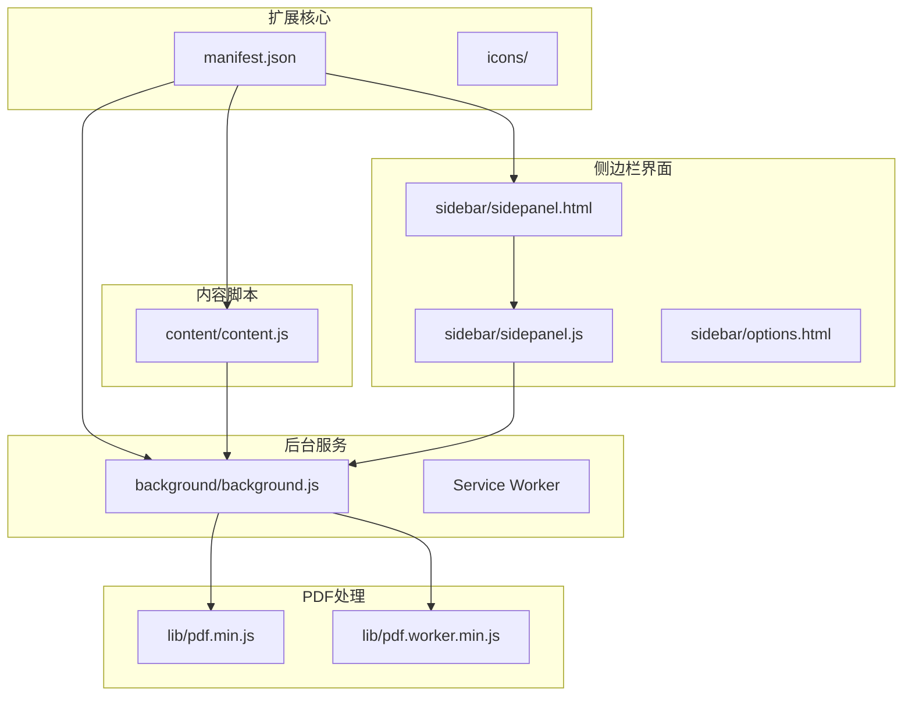

**图表来源**
- [manifest.json:1-48](file://manifest.json#L1-L48)
- [background.js:1-307](file://background/background.js#L1-L307)
- [content.js:1-36](file://content/content.js#L1-L36)

**章节来源**
- [manifest.json:1-48](file://manifest.json#L1-L48)
- [README.md:108-126](file://README.md#L108-L126)

## 核心组件
该扩展包含以下核心组件：

### 1. Background Service Worker
负责扩展的核心逻辑处理，包括：
- 侧边栏管理与打开
- PDF文件检测与下载
- 消息路由与处理
- 跨域请求代理

### 2. Content Script
轻量级脚本，专门用于检测网页中的PDF元素并通知后台。

### 3. Side Panel
完整的用户界面，包含多个功能模块：
- 价值投资大师选股器
- 财报解读系统
- 估值计算器
- 股票分析框架
- AI对话系统

### 4. PDF处理引擎
集成PDF.js库，支持PDF文档的解析和文本提取。

**章节来源**
- [background.js:1-307](file://background/background.js#L1-L307)
- [content.js:1-36](file://content/content.js#L1-L36)
- [sidepanel.js:1-800](file://sidebar/sidepanel.js#L1-L800)

## 架构总览
扩展采用分层架构设计，实现了清晰的职责分离：

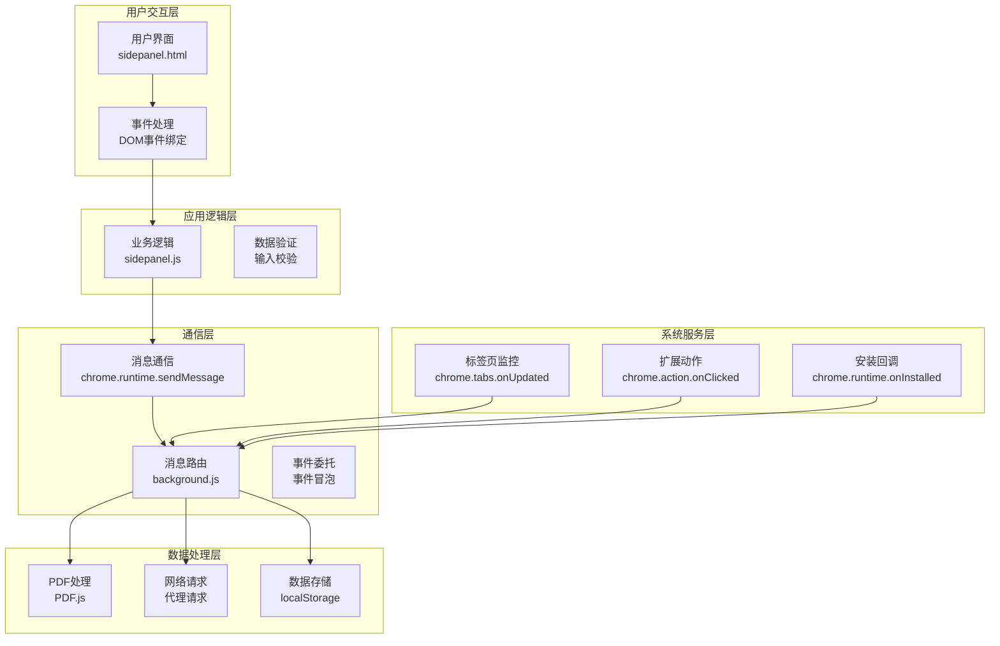

**图表来源**
- [background.js:11-117](file://background/background.js#L11-L117)
- [sidepanel.js:589-607](file://sidebar/sidepanel.js#L589-L607)

## 详细组件分析

### Background Service Worker 事件处理

#### 1. 侧边栏管理事件
Background Service Worker负责处理扩展动作点击事件，实现侧边栏的打开和初始化：

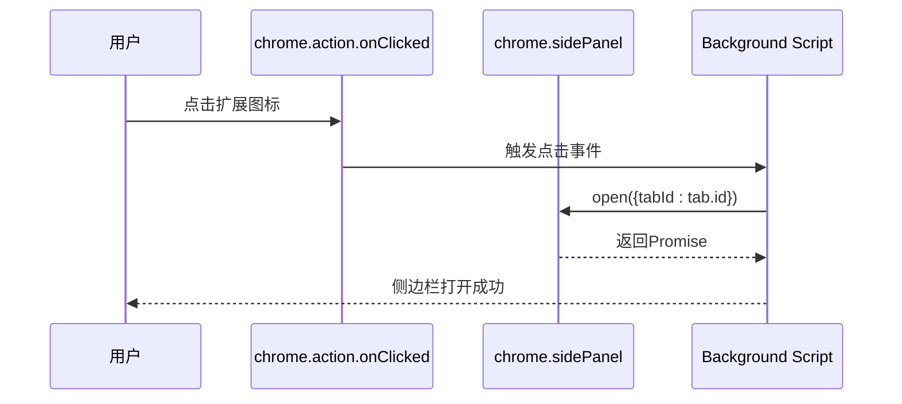

**图表来源**
- [background.js:12-14](file://background/background.js#L12-L14)

#### 2. PDF检测与通知机制
通过标签页更新监听器检测PDF文件的加载状态：

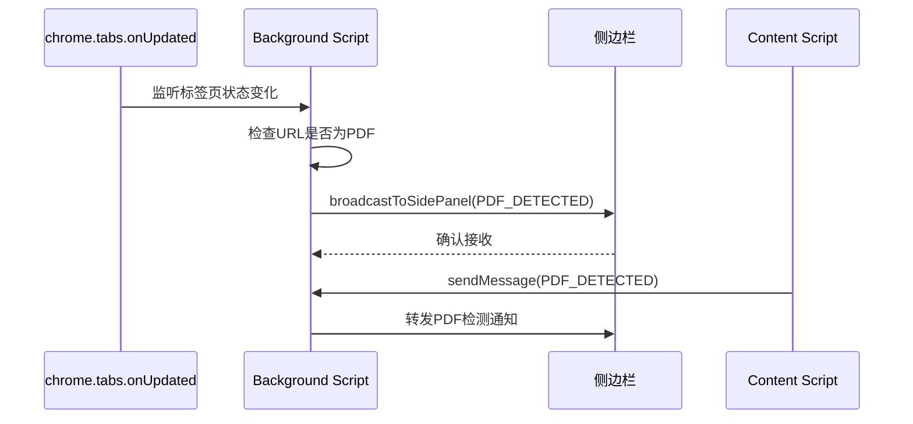

**图表来源**
- [background.js:21-34](file://background/background.js#L21-L34)
- [background.js:182-186](file://background/background.js#L182-L186)

#### 3. 消息路由与处理
Background Script实现了复杂的消息路由系统，支持多种消息类型：

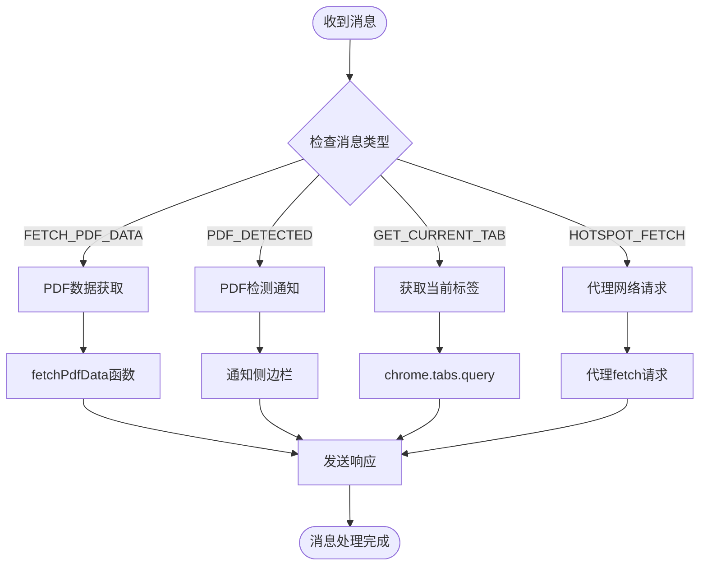

**图表来源**
- [background.js:37-117](file://background/background.js#L37-L117)

**章节来源**
- [background.js:11-117](file://background/background.js#L11-L117)

### Content Script 事件处理

#### 1. PDF检测机制
Content Script专门负责检测网页中的PDF元素：

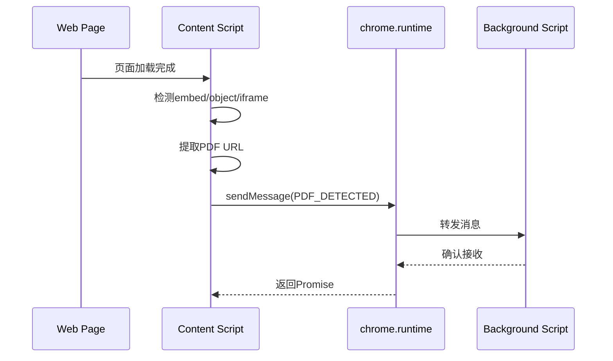

**图表来源**
- [content.js:11-28](file://content/content.js#L11-L28)

#### 2. 页面加载事件处理
Content Script正确处理了页面加载时机：

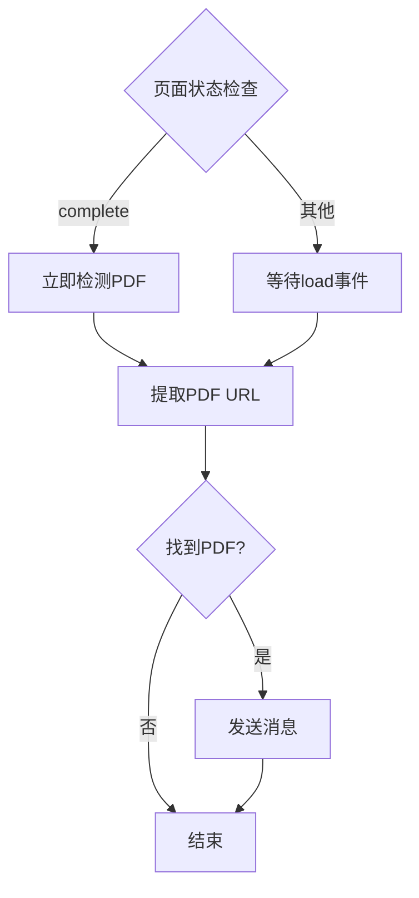

**图表来源**
- [content.js:30-36](file://content/content.js#L30-L36)

**章节来源**
- [content.js:1-36](file://content/content.js#L1-L36)

### Side Panel 事件处理系统

#### 1. DOM事件绑定与委托
Side Panel实现了完整的事件处理系统：

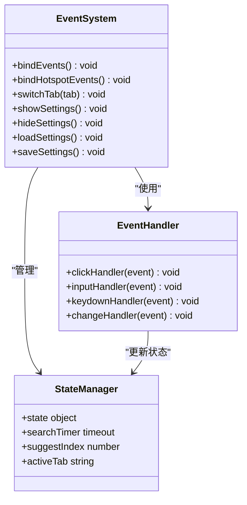

**图表来源**
- [sidepanel.js:639-800](file://sidebar/sidepanel.js#L639-L800)

#### 2. 异步事件处理模式
Side Panel采用了多种异步处理模式：

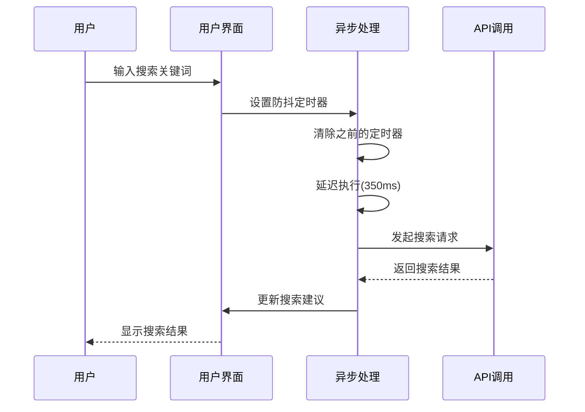

**图表来源**
- [sidepanel.js:687-718](file://sidebar/sidepanel.js#L687-L718)

**章节来源**
- [sidepanel.js:589-800](file://sidebar/sidepanel.js#L589-L800)

### 消息通信机制

#### 1. Chrome扩展消息通信
扩展实现了完整的消息通信体系：

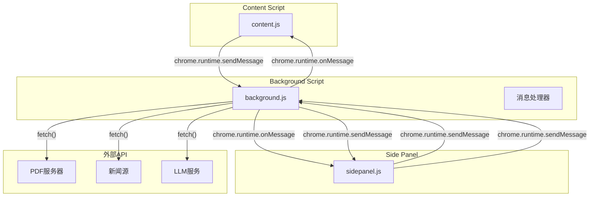

**图表来源**
- [background.js:37-117](file://background/background.js#L37-L117)
- [content.js:23-26](file://content/content.js#L23-L26)

#### 2. 消息格式设计
消息通信采用了标准化的消息格式：

| 消息类型 | 发送方 | 接收方 | 消息结构 | 用途 |
|---------|--------|--------|----------|------|
| FETCH_PDF_DATA | Side Panel | Background | `{type: 'FETCH_PDF_DATA', url: string}` | 请求PDF二进制数据 |
| PDF_DETECTED | Content Script/Background | Side Panel | `{type: 'PDF_DETECTED', data: object}` | 通知PDF检测结果 |
| GET_CURRENT_TAB | Side Panel | Background | `{type: 'GET_CURRENT_TAB'}` | 获取当前标签信息 |
| HOTSPOT_FETCH | Side Panel | Background | `{type: 'HOTSPOT_FETCH', url: string, options: object}` | 代理网络请求 |

**章节来源**
- [background.js:37-117](file://background/background.js#L37-L117)
- [content.js:23-26](file://content/content.js#L23-L26)

## 依赖关系分析

### 1. 组件耦合关系
扩展中的组件具有清晰的依赖关系：

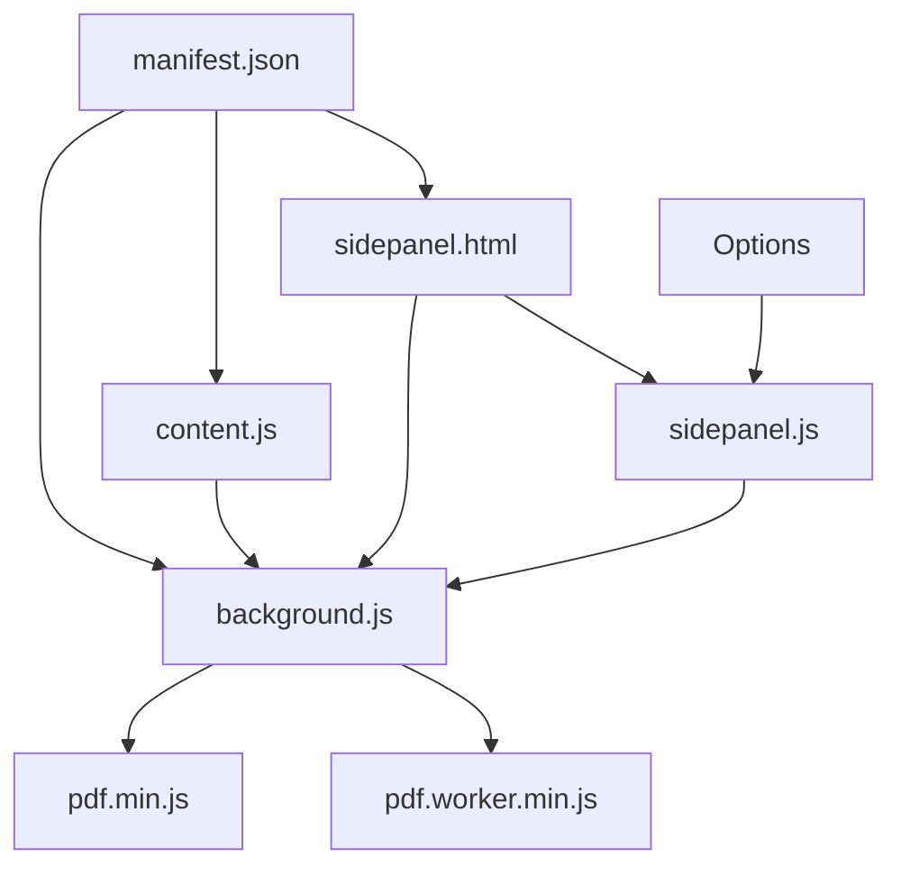

**图表来源**
- [manifest.json:16-30](file://manifest.json#L16-L30)

### 2. 外部依赖
扩展依赖的关键外部组件：

| 依赖组件 | 版本 | 用途 | 依赖方式 |
|---------|------|------|----------|
| PDF.js | 3.11.174 | PDF解析和文本提取 | 本地打包 |
| Chrome Extension API | Manifest V3 | 扩展功能 | 内置API |
| Web Speech API | 浏览器API | TTS播报 | 浏览器原生 |
| LocalStorage | 浏览器API | 设置持久化 | 浏览器原生 |

**章节来源**
- [manifest.json:22-30](file://manifest.json#L22-L30)
- [pdf.min.js:1-22](file://lib/pdf.min.js#L1-L22)

## 性能考虑

### 1. 事件处理优化
扩展实现了多项性能优化措施：

#### 防抖和节流机制
```javascript
// 搜索输入防抖 (350ms延迟)
state.searchTimer = setTimeout(() => {
    searchStockSuggest(keyword)
}, 350);

// 设置面板输入防抖 (300ms延迟)
settingsWatchlistSuggestTimer = setTimeout(() => {
    searchSettingsWatchlistStock(val)
}, 300);
```

#### 事件委托优化
```javascript
// 使用事件委托减少事件监听器数量
$$('.tab').forEach(tab => {
    tab.addEventListener('click', () => switchTab(tab.dataset.tab));
});

// 统一处理点击事件
document.addEventListener('click', (e) => {
    if (!e.target.closest('.analysis-search-wrap')) {
        hideAnalysisSuggest();
    }
});
```

#### 内存泄漏防护
```javascript
// 清理定时器
clearTimeout(state.analysisSearchTimer);
clearTimeout(settingsWatchlistSuggestTimer);

// 清理事件监听器
window.removeEventListener('load', detectEmbeddedPDF);
```

### 2. 异步操作优化
扩展采用了多种异步处理模式：

#### Promise链式调用
```javascript
// PDF数据获取的Promise链
fetchPdfData(message.url)
    .then(result => sendResponse(result))
    .catch(err => sendResponse({ error: err.message }));
return true;
```

#### async/await模式
```javascript
// 异步PDF下载
async function fetchPdfData(url) {
    try {
        const response = await fetch(actualUrl, {
            method: 'GET',
            headers: { 'Accept': 'application/pdf' }
        });
        
        const arrayBuffer = await response.arrayBuffer();
        // 处理数据...
    } catch (err) {
        console.error('[投资助手] PDF下载失败:', err);
    }
}
```

**章节来源**
- [sidepanel.js:687-718](file://sidebar/sidepanel.js#L687-L718)
- [background.js:125-177](file://background/background.js#L125-L177)

## 故障排除指南

### 1. 常见问题诊断

#### 消息通信问题
```javascript
// 检查消息发送是否成功
chrome.runtime.sendMessage({
    type: 'PDF_DETECTED',
    data: { url: pdfUrl, title: document.title }
}).catch(() => {
    console.error('消息发送失败');
});
```

#### PDF检测失败
```javascript
// 检查PDF URL格式
if (url.includes('chrome://pdf-viewer')) {
    const srcParam = new URL(url).searchParams.get('src');
    if (!srcParam) {
        return { error: '无法从 Chrome PDF 查看器获取原始 PDF 地址' };
    }
}
```

#### 事件处理问题
```javascript
// 检查事件绑定是否成功
const tabElements = $$('.tab');
if (tabElements.length > 0) {
    tabElements.forEach(tab => {
        tab.addEventListener('click', () => switchTab(tab.dataset.tab));
    });
} else {
    console.warn('未找到标签元素');
}
```

### 2. 调试技巧

#### 开发者工具使用
1. 打开Chrome扩展页面：`chrome://extensions/`
2. 启用"开发者模式"
3. 点击"详细信息"查看后台页面
4. 使用控制台检查错误日志

#### 日志记录策略
```javascript
// 使用结构化日志
console.log('[投资助手] PDF检测:', {
    url: tab.url,
    title: tab.title,
    timestamp: Date.now()
});

// 错误处理日志
console.error('[投资助手] PDF下载失败:', {
    url: actualUrl,
    error: err.message,
    stack: err.stack
});
```

**章节来源**
- [background.js:173-176](file://background/background.js#L173-L176)
- [content.js:23-26](file://content/content.js#L23-L26)

## 结论
该Chrome扩展展现了现代事件处理与消息通信的最佳实践：

### 主要成就
1. **完善的事件处理系统**：实现了DOM事件绑定、事件委托和异步事件处理的完整解决方案
2. **健壮的消息通信机制**：建立了Content Script、Background Script和Side Panel之间的可靠通信
3. **性能优化策略**：采用了防抖、节流、内存管理和异步处理等多种优化技术
4. **错误处理机制**：实现了全面的错误捕获和处理策略

### 技术亮点
- **模块化架构**：清晰的职责分离和组件边界
- **异步编程模式**：Promise链式调用和async/await的合理运用
- **性能优化**：定时器管理、事件委托和内存泄漏防护
- **用户体验**：流畅的交互反馈和错误提示

### 改进建议
1. **增加单元测试**：为关键事件处理函数编写测试用例
2. **增强错误恢复**：实现更完善的错误恢复机制
3. **性能监控**：添加性能指标监控和分析
4. **文档完善**：为复杂事件处理逻辑添加详细注释

## 附录

### 1. 事件处理最佳实践清单

#### DOM事件处理
- 使用事件委托减少监听器数量
- 合理使用防抖和节流
- 及时清理事件监听器
- 处理异步事件的错误

#### 消息通信
- 设计标准化的消息格式
- 实现消息路由和转发
- 处理消息发送失败的情况
- 管理消息通道的生命周期

#### 异步处理
- 使用Promise和async/await
- 实现合理的错误处理
- 管理异步操作的超时
- 避免内存泄漏

### 2. 代码示例路径
由于项目规模较大，以下是关键实现的代码示例路径：

- **事件绑定示例**：[sidepanel.js:641-650](file://sidebar/sidepanel.js#L641-L650)
- **事件委托示例**：[sidepanel.js:720-724](file://sidebar/sidepanel.js#L720-L724)
- **防抖实现示例**：[sidepanel.js:687-697](file://sidebar/sidepanel.js#L687-L697)
- **消息路由示例**：[background.js:37-117](file://background/background.js#L37-L117)
- **PDF检测示例**：[content.js:11-28](file://content/content.js#L11-L28)
- **异步处理示例**：[background.js:125-177](file://background/background.js#L125-L177)