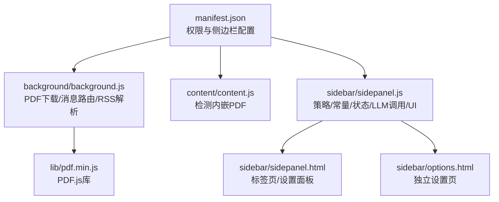
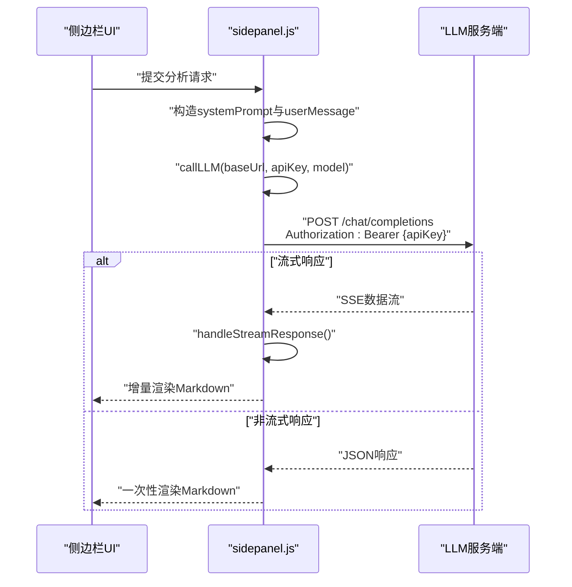
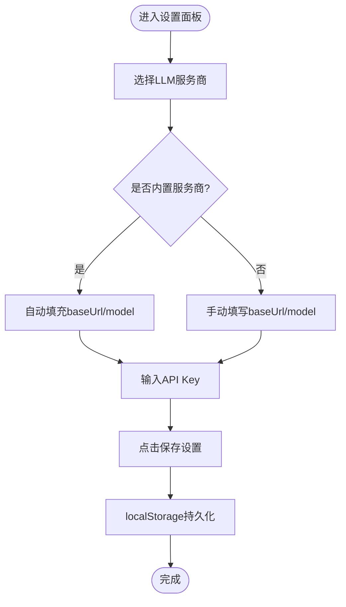
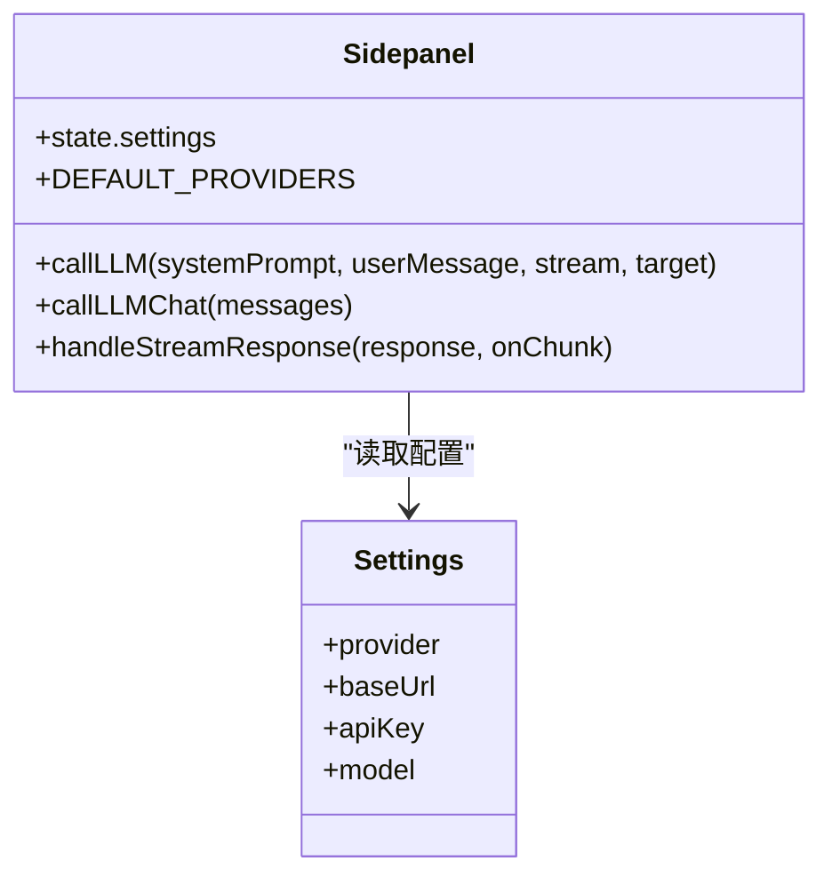
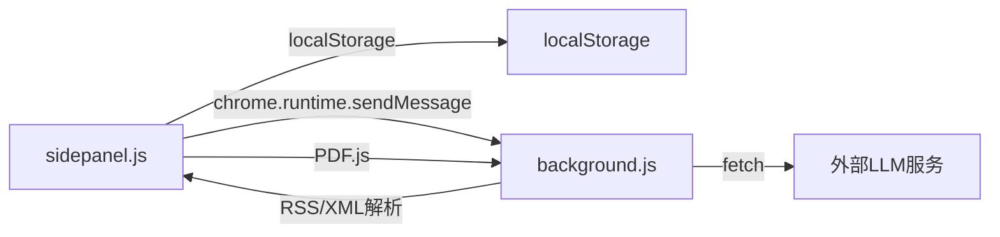

# AI服务提供商集成

<cite>
**本文引用的文件**
- [manifest.json](file://manifest.json)
- [background.js](file://background/background.js)
- [content.js](file://content/content.js)
- [sidepanel.js](file://sidebar/sidepanel.js)
- [sidepanel.html](file://sidebar/sidepanel.html)
- [options.html](file://sidebar/options.html)
- [README.md](file://README.md)
</cite>

## 目录
1. [简介](#简介)
2. [项目结构](#项目结构)
3. [核心组件](#核心组件)
4. [架构总览](#架构总览)
5. [详细组件分析](#详细组件分析)
6. [依赖关系分析](#依赖关系分析)
7. [性能考量](#性能考量)
8. [故障排查指南](#故障排查指南)
9. [结论](#结论)
10. [附录](#附录)

## 简介
本指南面向希望为“投资助手”Chrome扩展新增AI服务提供商的开发者。文档围绕以下目标展开：
- 明确DEFAULT_PROVIDERS配置、API端点设置与认证机制
- 解释LLM API集成的关键要素：baseUrl（API基础URL）、model（模型名称）与认证处理
- 提供从服务提供商注册到代码实现的完整集成流程
- 说明如何处理不同API响应格式、错误处理与重试机制
- 介绍自定义API提供商的配置方法与安全注意事项
- 提供可直接参考的配置模板与实现路径

## 项目结构
该项目采用Chrome Extension Manifest V3架构，核心模块如下：
- manifest.json：扩展清单，声明权限、侧边栏、后台脚本与可访问资源
- background/background.js：后台Service Worker，负责PDF下载、消息路由与RSS/XML解析
- content/content.js：内容脚本，检测网页内嵌PDF并通知后台
- sidebar/sidepanel.js：侧边栏主逻辑，包含策略模板、常量、状态管理、LLM调用与UI交互
- sidebar/sidepanel.html：侧边栏页面结构与设置面板
- sidebar/options.html：独立设置页（与侧边栏设置一致）
- README.md：功能说明与安装使用指南

图表来源
- [manifest.json:1-48](file://manifest.json#L1-L48)
- [background.js:1-307](file://background/background.js#L1-L307)
- [content.js:1-36](file://content/content.js#L1-L36)
- [sidepanel.js:1-800](file://sidebar/sidepanel.js#L1-L800)
- [sidepanel.html:1-646](file://sidebar/sidepanel.html#L1-L646)
- [options.html:1-124](file://sidebar/options.html#L1-L124)

章节来源
- [manifest.json:1-48](file://manifest.json#L1-L48)
- [README.md:108-126](file://README.md#L108-L126)

## 核心组件
- DEFAULT_PROVIDERS：内置服务提供商配置集合，包含baseUrl与model
- state.settings：运行时LLM配置（provider、baseUrl、apiKey、model）
- callLLM/callLLMChat：统一的LLM调用封装，支持流式与非流式响应
- handleStreamResponse：SSE流式响应解析，增量渲染
- 设置面板：提供LLM服务商选择、API地址、API Key与模型名称的输入与保存

章节来源
- [sidepanel.js:417-423](file://sidebar/sidepanel.js#L417-L423)
- [sidepanel.js:517-584](file://sidebar/sidepanel.js#L517-L584)
- [sidepanel.js:619-637](file://sidebar/sidepanel.js#L619-L637)
- [sidepanel.js:3362-3395](file://sidebar/sidepanel.js#L3362-L3395)
- [sidepanel.js:3397-3425](file://sidebar/sidepanel.js#L3397-L3425)
- [sidepanel.js:3427-3452](file://sidebar/sidepanel.js#L3427-L3452)
- [sidepanel.html:564-592](file://sidebar/sidepanel.html#L564-L592)
- [options.html:72-121](file://sidebar/options.html#L72-L121)

## 架构总览
LLM调用链路（从侧边栏到服务端）：
- 用户在侧边栏发起分析请求
- 侧边栏构造systemPrompt与userMessage，调用callLLM
- callLLM拼接baseUrl/chat/completions，附加Authorization: Bearer {apiKey}
- 若开启流式，handleStreamResponse解析SSE数据流并增量渲染
- 若非流式，解析JSON响应并返回文本内容

图表来源
- [sidepanel.js:3362-3395](file://sidebar/sidepanel.js#L3362-L3395)
- [sidepanel.js:3397-3425](file://sidebar/sidepanel.js#L3397-L3425)
- [sidepanel.js:3427-3452](file://sidebar/sidepanel.js#L3427-L3452)

## 详细组件分析

### DEFAULT_PROVIDERS与设置面板
- DEFAULT_PROVIDERS定义了内置服务提供商的baseUrl与model，便于用户快速选择
- 设置面板提供下拉选择、API地址输入、API Key输入与模型名称输入
- 选择服务商时，自动填充baseUrl与model；保存设置写入localStorage

图表来源
- [sidepanel.js:417-423](file://sidebar/sidepanel.js#L417-L423)
- [sidepanel.js:619-637](file://sidebar/sidepanel.js#L619-L637)
- [sidepanel.html:564-592](file://sidebar/sidepanel.html#L564-L592)
- [options.html:72-121](file://sidebar/options.html#L72-L121)

章节来源
- [sidepanel.js:417-423](file://sidebar/sidepanel.js#L417-L423)
- [sidepanel.js:619-637](file://sidebar/sidepanel.js#L619-L637)
- [sidepanel.html:564-592](file://sidebar/sidepanel.html#L564-L592)
- [options.html:72-121](file://sidebar/options.html#L72-L121)

### LLM API调用与认证
- 调用入口：callLLM与callLLMChat
- 认证方式：Authorization: Bearer {apiKey}
- 端点格式：{baseUrl}/chat/completions
- 响应处理：
  - 非流式：解析JSON，取choices[0].message.content
  - 流式：SSE数据行data: {...}，解析choices[0].delta.content增量拼接

图表来源
- [sidepanel.js:517-584](file://sidebar/sidepanel.js#L517-L584)
- [sidepanel.js:417-423](file://sidebar/sidepanel.js#L417-L423)
- [sidepanel.js:3362-3395](file://sidebar/sidepanel.js#L3362-L3395)
- [sidepanel.js:3397-3425](file://sidebar/sidepanel.js#L3397-L3425)
- [sidepanel.js:3427-3452](file://sidebar/sidepanel.js#L3427-L3452)

章节来源
- [sidepanel.js:3362-3395](file://sidebar/sidepanel.js#L3362-L3395)
- [sidepanel.js:3397-3425](file://sidebar/sidepanel.js#L3397-L3425)
- [sidepanel.js:3427-3452](file://sidebar/sidepanel.js#L3427-L3452)

### 错误处理与响应格式
- HTTP错误：非OK状态时解析JSON中的error.message或回退为状态码提示
- API Key无效：捕获包含“API key”或“401”的错误，引导用户打开设置面板
- 响应格式：
  - JSON：标准OpenAI兼容格式
  - SSE：data: 行，以[DONE]结束
- 背景脚本对RSS/Atom与XML的解析与统一输出，便于上游模块处理

章节来源
- [sidepanel.js:3381-3384](file://sidebar/sidepanel.js#L3381-L3384)
- [sidepanel.js:3346-3354](file://sidebar/sidepanel.js#L3346-L3354)
- [background.js:87-117](file://background/background.js#L87-L117)
- [background.js:192-251](file://background/background.js#L192-L251)

### PDF与热点数据抓取（与LLM集成的关系）
- 背景脚本负责PDF下载与RSS/XML解析，为侧边栏的“财报解读”与“热点信息”提供数据源
- 侧边栏通过background的代理fetch接口获取数据，避免CORS限制

章节来源
- [background.js:65-117](file://background/background.js#L65-L117)
- [background.js:125-177](file://background/background.js#L125-L177)

## 依赖关系分析
- 侧边栏依赖localStorage存储LLM配置
- 侧边栏依赖背景脚本的代理fetch与RSS解析
- 侧边栏依赖PDF.js库进行PDF文本提取（通过背景脚本下载后传递）

图表来源
- [sidepanel.js:619-637](file://sidebar/sidepanel.js#L619-L637)
- [background.js:65-117](file://background/background.js#L65-L117)
- [background.js:125-177](file://background/background.js#L125-L177)

章节来源
- [sidepanel.js:619-637](file://sidebar/sidepanel.js#L619-L637)
- [background.js:65-117](file://background/background.js#L65-L117)

## 性能考量
- 流式渲染：SSE增量渲染减少首屏等待时间，提升交互体验
- 超时与节流：流式渲染结束后自动移除游标并构建目录与TTS片段，避免重复计算
- 背景脚本下载：利用background的host_permissions绕过CORS，提高数据抓取效率

章节来源
- [sidepanel.js:3463-3478](file://sidebar/sidepanel.js#L3463-L3478)
- [background.js:125-177](file://background/background.js#L125-L177)

## 故障排查指南
- API Key无效或401：侧边栏会提示并自动打开设置面板，请检查API Key是否正确
- 网络错误：检查baseUrl与网络连通性；若返回非JSON错误，查看服务端返回的error.message
- 流式渲染异常：确认服务端支持SSE且响应以[DONE]结束；前端会持续读取直到完成
- 设置未保存：确认localStorage中存在er_settings；若为空，重新填写并保存

章节来源
- [sidepanel.js:3346-3354](file://sidebar/sidepanel.js#L3346-L3354)
- [sidepanel.js:3381-3384](file://sidebar/sidepanel.js#L3381-L3384)
- [sidepanel.js:3427-3452](file://sidebar/sidepanel.js#L3427-L3452)
- [sidepanel.js:619-637](file://sidebar/sidepanel.js#L619-L637)

## 结论
本项目提供了完善的LLM集成范式：通过DEFAULT_PROVIDERS与设置面板实现服务提供商注册，通过callLLM统一调用与handleStreamResponse实现流式渲染，配合错误处理与本地存储实现稳定的用户体验。新增服务提供商只需在DEFAULT_PROVIDERS中注册并确保baseUrl/chat/completions与Authorization: Bearer {apiKey}即可无缝接入。

## 附录

### 新增AI服务提供商的完整流程
- 在DEFAULT_PROVIDERS中添加新服务商的baseUrl与model
- 在设置面板中增加对应选项（若需要）
- 确保服务端支持OpenAI兼容的/chat/completions端点与Bearer认证
- 在侧边栏保存设置后，LLM调用将自动使用新配置

章节来源
- [sidepanel.js:417-423](file://sidebar/sidepanel.js#L417-L423)
- [sidepanel.js:619-637](file://sidebar/sidepanel.js#L619-L637)
- [sidepanel.html:564-592](file://sidebar/sidepanel.html#L564-L592)

### 配置模板（用于自定义API提供商）
- 服务商：自定义API
- API地址：填写服务端/chat/completions基础URL（不包含路径）
- API Key：服务端鉴权密钥
- 模型名称：服务端可用的模型标识

章节来源
- [sidepanel.html:564-592](file://sidebar/sidepanel.html#L564-L592)
- [options.html:72-121](file://sidebar/options.html#L72-L121)

### 安全与隐私
- API Key存储在localStorage，不上传至任何服务器
- 数据隐私：财报文本与选股请求仅发送到配置的LLM API
- 建议：定期轮换API Key，避免泄露

章节来源
- [README.md:138-142](file://README.md#L138-L142)