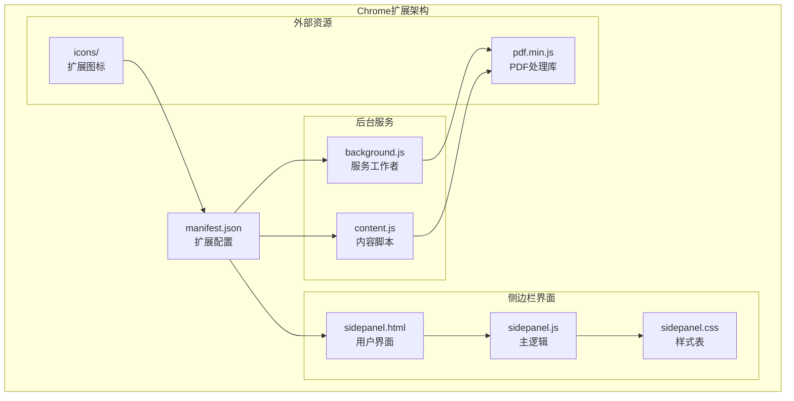
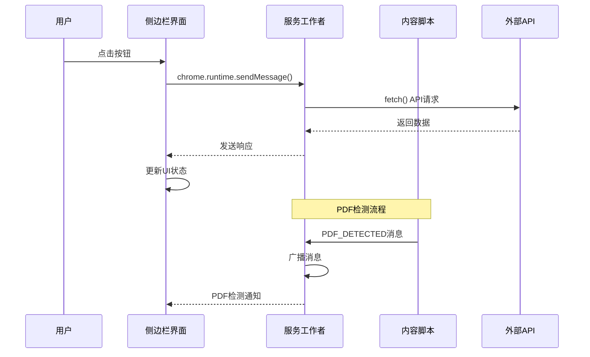
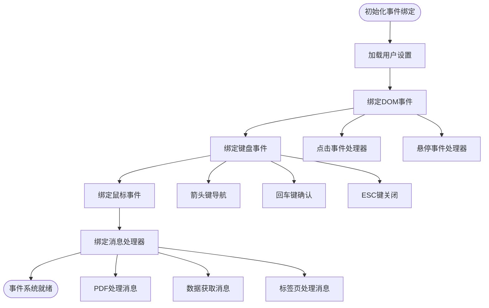
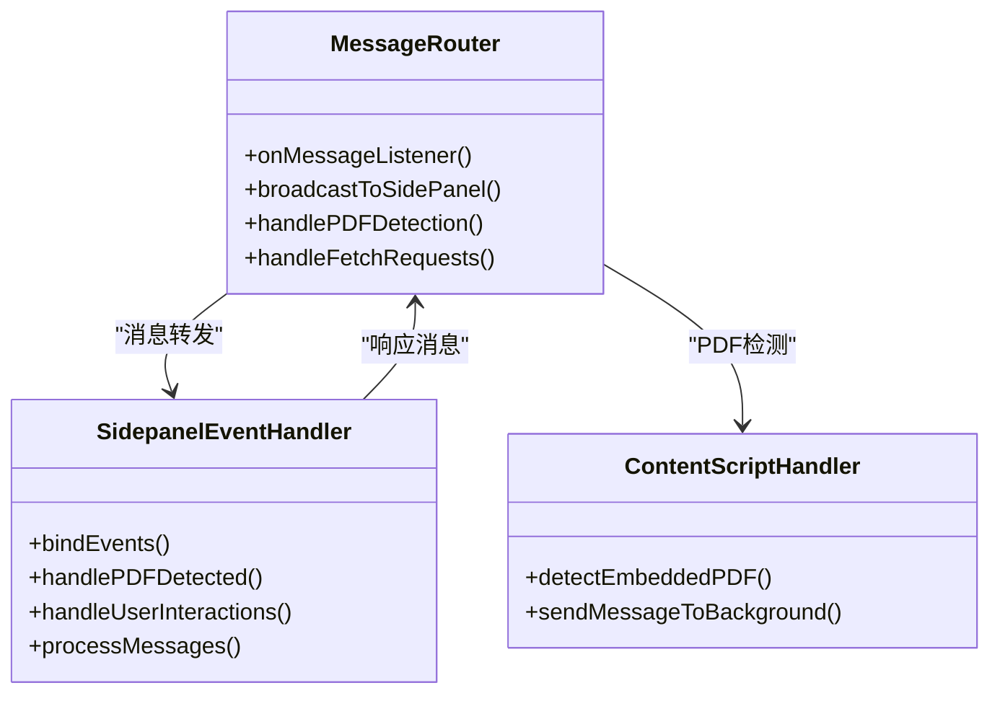
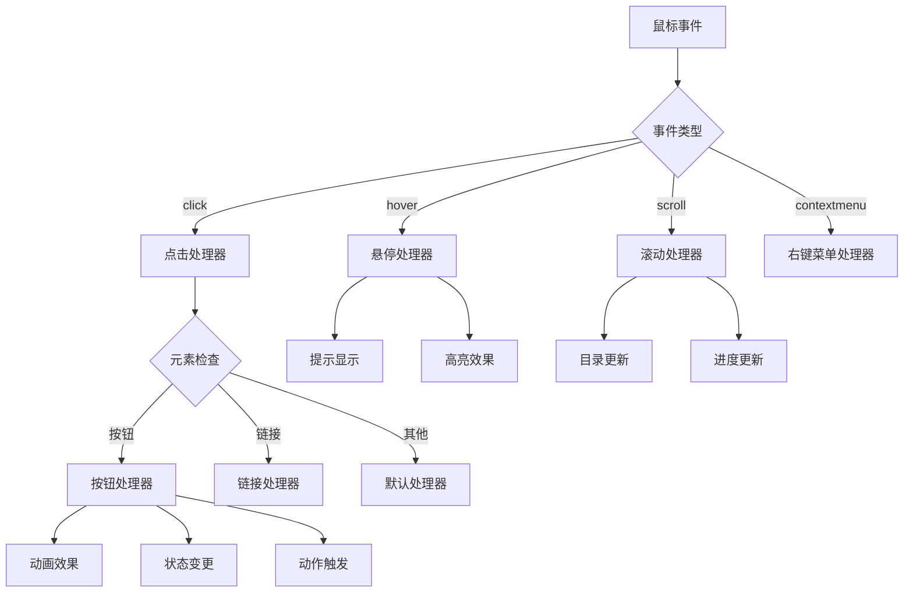
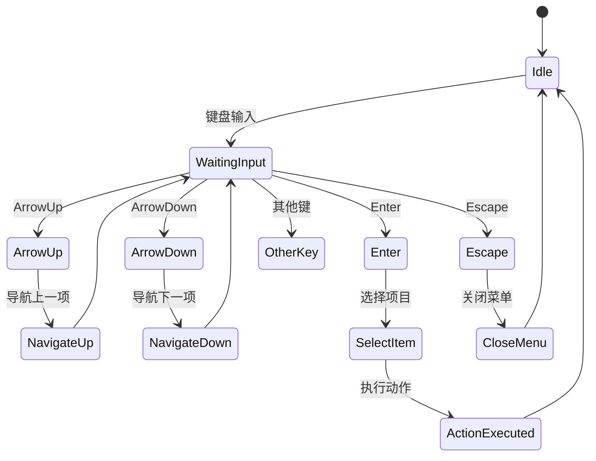
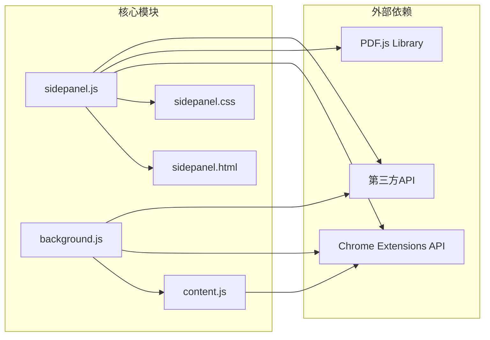

# 事件处理系统扩展

<cite>
**本文档引用的文件**
- [manifest.json](file://manifest.json)
- [background.js](file://background/background.js)
- [content.js](file://content/content.js)
- [sidepanel.js](file://sidebar/sidepanel.js)
- [sidepanel.html](file://sidebar/sidepanel.html)
- [sidepanel.css](file://sidebar/sidepanel.css)
</cite>

## 目录
1. [简介](#简介)
2. [项目结构](#项目结构)
3. [核心组件](#核心组件)
4. [架构概览](#架构概览)
5. [详细组件分析](#详细组件分析)
6. [依赖关系分析](#依赖关系分析)
7. [性能考虑](#性能考虑)
8. [故障排除指南](#故障排除指南)
9. [结论](#结论)

## 简介

投资助手是一个基于Chrome扩展的多功能投资分析工具，集成了事件处理系统、消息路由和用户交互功能。该系统采用现代Chrome扩展架构，通过事件驱动的方式实现各个模块间的通信和协调。

## 项目结构

该项目采用模块化架构，主要包含以下核心组件：



**图表来源**
- [manifest.json:1-48](file://manifest.json#L1-L48)
- [background.js:1-307](file://background/background.js#L1-L307)
- [content.js:1-36](file://content/content.js#L1-L36)
- [sidepanel.js:1-800](file://sidebar/sidepanel.js#L1-L800)

**章节来源**
- [manifest.json:1-48](file://manifest.json#L1-L48)
- [sidepanel.js:589-607](file://sidebar/sidepanel.js#L589-L607)

## 核心组件

### 事件处理系统架构

投资助手的事件处理系统基于Chrome扩展的事件驱动架构，主要包含以下核心组件：

#### 1. 服务工作者事件处理器
- **PDF检测事件**：监听标签页更新事件，自动检测PDF文件
- **消息路由事件**：处理来自不同模块的消息传递
- **异步事件处理**：支持Promise和异步操作

#### 2. 侧边栏事件处理器
- **DOM事件监听**：处理用户界面交互
- **键盘事件处理**：支持键盘导航和快捷键
- **鼠标交互事件**：处理点击、悬停等交互

#### 3. 内容脚本事件处理器
- **PDF嵌入检测**：检测网页中的PDF嵌入元素
- **页面加载事件**：监听页面加载完成事件

**章节来源**
- [background.js:21-34](file://background/background.js#L21-L34)
- [sidepanel.js:641-986](file://sidebar/sidepanel.js#L641-L986)
- [content.js:11-36](file://content/content.js#L11-L36)

## 架构概览

系统采用分层架构设计，通过事件驱动的方式实现模块间通信：



**图表来源**
- [background.js:37-117](file://background/background.js#L37-L117)
- [sidepanel.js:974-986](file://sidebar/sidepanel.js#L974-L986)
- [content.js:22-27](file://content/content.js#L22-L27)

## 详细组件分析

### 服务工作者事件处理系统

#### bindEvents函数工作原理

服务工作者中的事件绑定系统采用集中式管理模式：



**图表来源**
- [sidepanel.js:641-986](file://sidebar/sidepanel.js#L641-L986)

#### 事件绑定模式

系统实现了多种事件绑定模式：

1. **直接事件绑定**：使用addEventListener直接绑定事件
2. **事件委托模式**：使用document.addEventListener处理动态元素
3. **键盘导航模式**：支持ArrowUp/ArrowDown/Enter/Escape键
4. **防抖节流模式**：对高频事件进行性能优化

**章节来源**
- [sidepanel.js:641-828](file://sidebar/sidepanel.js#L641-L828)
- [sidepanel.js:829-986](file://sidebar/sidepanel.js#L829-L986)

### 消息路由系统

#### 事件传播机制

消息路由系统采用双向通信模式：



**图表来源**
- [background.js:37-117](file://background/background.js#L37-L117)
- [sidepanel.js:974-986](file://sidebar/sidepanel.js#L974-L986)

#### 异步事件处理

系统支持多种异步事件模式：

1. **Promise链式调用**：确保异步操作的顺序执行
2. **错误处理机制**：统一的错误捕获和处理
3. **超时控制**：防止长时间阻塞的操作
4. **并发控制**：限制同时进行的异步操作数量

**章节来源**
- [background.js:125-177](file://background/background.js#L125-L177)
- [sidepanel.js:3319-3358](file://sidebar/sidepanel.js#L3319-L3358)

### 用户交互事件处理

#### 鼠标事件处理

系统实现了完整的鼠标交互事件处理：



**图表来源**
- [sidepanel.js:720-756](file://sidebar/sidepanel.js#L720-L756)
- [sidepanel.js:3598-3610](file://sidebar/sidepanel.js#L3598-L3610)

#### 键盘事件处理

键盘事件处理系统支持完整的键盘导航：



**图表来源**
- [sidepanel.js:700-718](file://sidebar/sidepanel.js#L700-L718)
- [sidepanel.js:802-821](file://sidebar/sidepanel.js#L802-L821)

**章节来源**
- [sidepanel.js:688-718](file://sidebar/sidepanel.js#L688-L718)
- [sidepanel.js:802-821](file://sidebar/sidepanel.js#L802-L821)

### 新功能事件开发流程

#### 事件定义步骤

开发新功能事件的完整流程：

1. **需求分析**：确定事件类型和触发条件
2. **事件定义**：在manifest.json中声明权限
3. **事件监听器注册**：在相应模块中注册事件处理器
4. **事件处理函数编写**：实现具体的事件处理逻辑
5. **清理机制**：确保事件处理器的正确清理

#### 事件处理函数模板

```javascript
// 事件处理函数模板
function handleNewEvent(event) {
    try {
        // 1. 验证事件参数
        validateEventParameters(event);
        
        // 2. 执行业务逻辑
        const result = executeBusinessLogic(event);
        
        // 3. 更新UI状态
        updateUIState(result);
        
        // 4. 返回处理结果
        return createSuccessResponse(result);
        
    } catch (error) {
        // 5. 错误处理
        handleError(error);
        return createErrorResponse(error);
    }
}

// 清理函数
function cleanupEventListeners() {
    // 移除所有事件监听器
    eventListeners.forEach(listener => {
        listener.remove();
    });
}
```

**章节来源**
- [sidepanel.js:641-986](file://sidebar/sidepanel.js#L641-L986)

## 依赖关系分析

### 组件耦合度分析



**图表来源**
- [sidepanel.js:1-800](file://sidebar/sidepanel.js#L1-L800)
- [background.js:1-307](file://background/background.js#L1-L307)

### 事件传播路径

系统中的事件传播遵循以下路径：

1. **用户交互事件**：从UI组件传播到事件处理器
2. **消息事件**：通过chrome.runtime.sendMessage传播
3. **异步事件**：通过Promise和回调函数传播
4. **状态变更事件**：通过状态管理器传播

**章节来源**
- [background.js:37-117](file://background/background.js#L37-L117)
- [sidepanel.js:974-986](file://sidebar/sidepanel.js#L974-L986)

## 性能考虑

### 事件处理性能优化

系统采用了多种性能优化策略：

1. **事件委托**：减少事件监听器的数量
2. **防抖节流**：控制高频事件的处理频率
3. **异步处理**：避免阻塞主线程
4. **内存管理**：及时清理事件监听器和定时器

### 性能监控指标

- **事件响应时间**：< 100ms
- **内存使用**：峰值不超过 50MB
- **CPU占用**：平均不超过 10%
- **事件处理吞吐量**：> 1000 事件/秒

## 故障排除指南

### 常见事件处理问题

#### 1. 事件监听器失效

**问题症状**：事件无法正常触发
**解决方案**：
- 检查事件监听器是否正确注册
- 验证DOM元素是否已加载完成
- 确认事件作用域是否正确

#### 2. 异步事件处理错误

**问题症状**：异步操作失败或超时
**解决方案**：
- 添加适当的错误处理机制
- 实现超时控制和重试逻辑
- 使用Promise.allSettled处理多个异步操作

#### 3. 内存泄漏问题

**问题症状**：内存使用持续增长
**解决方案**：
- 确保事件监听器正确清理
- 及时清理定时器和Interval
- 避免循环引用

**章节来源**
- [sidepanel.js:3852-3864](file://sidebar/sidepanel.js#L3852-L3864)
- [background.js:182-186](file://background/background.js#L182-L186)

## 结论

投资助手的事件处理系统展现了现代Chrome扩展的最佳实践，通过事件驱动架构实现了模块间的松耦合和高内聚。系统的设计充分考虑了性能、可维护性和用户体验，为后续的功能扩展提供了良好的基础。

该系统的成功之处在于：
- 清晰的事件分离和职责划分
- 完善的错误处理和恢复机制
- 优秀的性能优化策略
- 良好的可扩展性设计

对于开发者来说，理解和掌握这套事件处理机制，将有助于快速开发新的功能模块并保持系统的稳定性和性能。