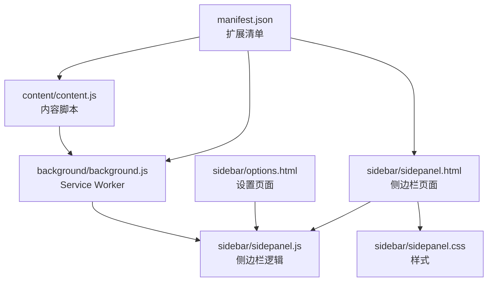
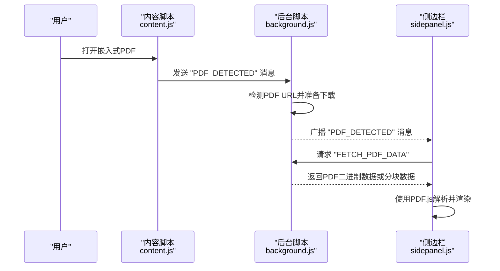
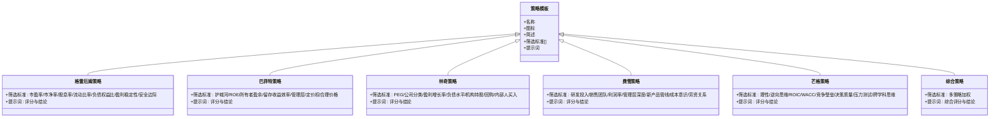
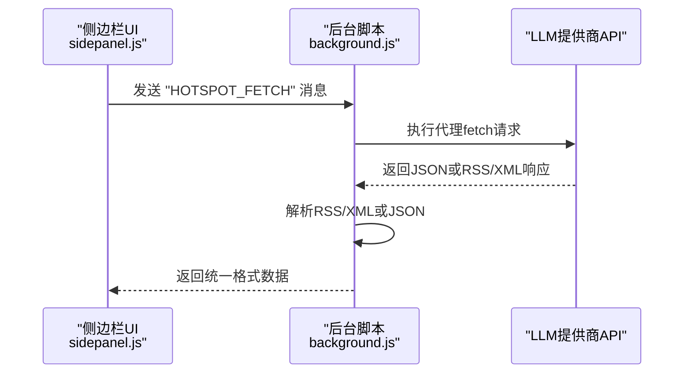
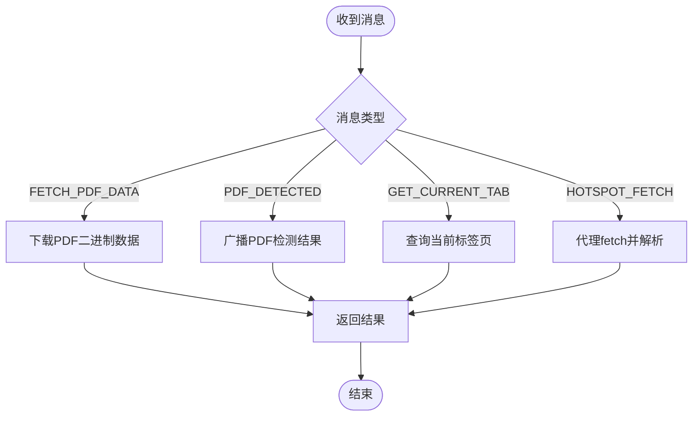
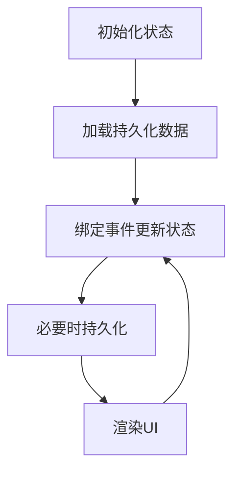
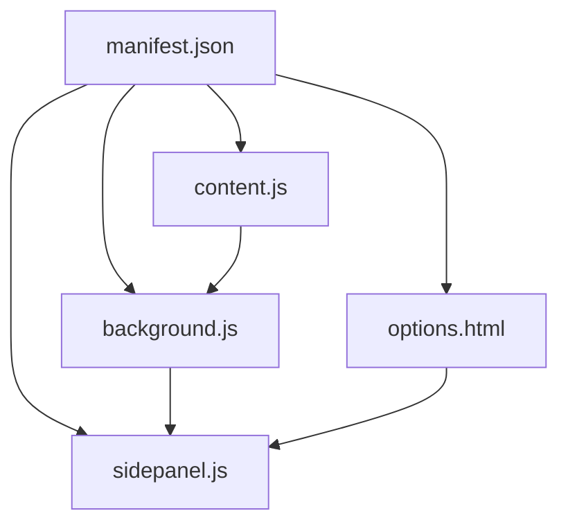

# 功能扩展开发

<cite>
**本文档引用的文件**
- [manifest.json](file://manifest.json)
- [background.js](file://background/background.js)
- [content.js](file://content/content.js)
- [sidepanel.js](file://sidebar/sidepanel.js)
- [sidepanel.html](file://sidebar/sidepanel.html)
- [options.html](file://sidebar/options.html)
- [sidepanel.css](file://sidebar/sidepanel.css)
- [README.md](file://README.md)
</cite>

## 目录
1. [简介](#简介)
2. [项目结构](#项目结构)
3. [核心组件](#核心组件)
4. [架构总览](#架构总览)
5. [详细组件分析](#详细组件分析)
6. [依赖分析](#依赖分析)
7. [性能考虑](#性能考虑)
8. [故障排除指南](#故障排除指南)
9. [结论](#结论)
10. [附录](#附录)

## 简介
本指南面向希望在现有Chrome扩展基础上进行功能扩展的开发者，围绕以下目标提供系统性的开发流程与最佳实践：
- 添加新的投资策略：包括策略模板结构、评估标准定义与提示词工程
- 集成新的AI服务提供商：包括API配置、认证处理与错误恢复机制
- 新功能模块开发流程：从需求分析到代码实现再到测试部署
- 事件处理系统扩展：自定义事件监听器与消息路由机制
- 状态管理扩展：新增状态字段与持久化策略
- 具体代码示例与最佳实践：确保新功能无缝集成现有架构

## 项目结构
该项目采用Chrome Extension Manifest V3架构，核心目录与职责如下：
- manifest.json：扩展清单，声明权限、侧边栏路径、图标与action配置
- background/background.js：Service Worker，负责侧边栏打开、PDF检测与消息路由
- content/content.js：内容脚本，检测嵌入式PDF并上报背景页
- sidebar/sidepanel.html：侧边栏页面结构，包含多个功能标签页
- sidebar/sidepanel.js：侧边栏主逻辑，包含策略模板、提示词、状态管理与UI交互
- sidebar/options.html：设置页面，用于LLM提供商配置
- sidebar/sidepanel.css：侧边栏样式
- README.md：项目说明文档

**图表来源**
- [manifest.json:1-48](file://manifest.json#L1-L48)
- [background.js:1-307](file://background/background.js#L1-L307)
- [content.js:1-36](file://content/content.js#L1-L36)
- [sidepanel.html:1-646](file://sidebar/sidepanel.html#L1-L646)
- [sidepanel.js:1-800](file://sidebar/sidepanel.js#L1-L800)
- [options.html:1-124](file://sidebar/options.html#L1-L124)

**章节来源**
- [manifest.json:1-48](file://manifest.json#L1-L48)
- [README.md:108-126](file://README.md#L108-L126)

## 核心组件
- 侧边栏主逻辑（sidepanel.js）
  - 策略模板与提示词：包含格雷厄姆、巴菲特、林奇、费雪、芒格与综合策略的模板与提示词
  - 状态管理：集中维护应用状态，包括PDF、选股、聊天、TTS、估值、热点信息等
  - 事件绑定：标签切换、设置、搜索、TTS、选股器等交互事件
  - LLM集成：默认提供商配置与设置页面联动
- Service Worker（background.js）
  - 侧边栏打开与行为配置
  - PDF检测与下载：监听标签更新与内容脚本上报，下载PDF二进制数据
  - 消息路由：处理来自侧边栏与内容脚本的消息，提供代理fetch与RSS解析
- 内容脚本（content.js）
  - 检测嵌入式PDF并通过消息通道上报
- 设置页面（options.html）
  - LLM提供商选择、API地址、API Key、模型名称配置
  - 本地存储持久化

**章节来源**
- [sidepanel.js:12-297](file://sidebar/sidepanel.js#L12-L297)
- [sidepanel.js:514-584](file://sidebar/sidepanel.js#L514-L584)
- [sidepanel.js:589-637](file://sidebar/sidepanel.js#L589-L637)
- [background.js:11-117](file://background/background.js#L11-L117)
- [content.js:11-36](file://content/content.js#L11-L36)
- [options.html:72-121](file://sidebar/options.html#L72-L121)

## 架构总览
整体架构采用“内容脚本 + Service Worker + 侧边栏”的通信模型，消息通过chrome.runtime进行路由，背景页负责跨域请求与PDF处理。

**图表来源**
- [content.js:22-27](file://content/content.js#L22-L27)
- [background.js:21-34](file://background/background.js#L21-L34)
- [background.js:125-177](file://background/background.js#L125-L177)
- [sidepanel.js:974-980](file://sidebar/sidepanel.js#L974-L980)

## 详细组件分析

### 策略模板与提示词工程
- 策略模板结构
  - STRATEGIES对象包含多种策略，每种策略包含名称、图标、简述、筛选标准与提示词
  - 提示词采用多段落结构，包含“筛选标准”、“输出格式”、“最终推荐”等模块
- 评估标准定义
  - 每个策略的criteria数组定义了可量化的筛选条件
  - 提示词中明确评分维度与权重，便于后续综合评分
- 提示词工程最佳实践
  - 明确输出格式与表格结构，保证前端渲染一致性
  - 提供“综合评分”与“结论”字段，便于UI展示
  - 使用占位符与分步说明，提升LLM理解与执行稳定性

**图表来源**
- [sidepanel.js:14-297](file://sidebar/sidepanel.js#L14-L297)

**章节来源**
- [sidepanel.js:14-297](file://sidebar/sidepanel.js#L14-L297)

### AI服务提供商集成
- 默认提供商配置
  - DEFAULT_PROVIDERS对象定义了OpenAI、DeepSeek、智谱、通义千问与自定义提供商的基础配置
- 设置页面联动
  - 选择提供商后自动填充baseUrl与model；保存设置到localStorage
- LLM调用流程
  - 侧边栏逻辑中通过chrome.runtime.sendMessage向背景页请求代理fetch
  - 背景页执行fetch并解析RSS/XML或JSON响应，返回给侧边栏

**图表来源**
- [sidepanel.js:1074-1080](file://sidebar/sidepanel.js#L1074-L1080)
- [background.js:65-116](file://background/background.js#L65-L116)
- [background.js:192-251](file://background/background.js#L192-L251)

**章节来源**
- [sidepanel.js:417-423](file://sidebar/sidepanel.js#L417-L423)
- [options.html:72-121](file://sidebar/options.html#L72-L121)
- [background.js:65-116](file://background/background.js#L65-L116)

### 事件处理系统扩展
- 消息路由机制
  - background.js监听runtime消息，处理PDF下载、RSS解析与通用代理fetch
  - sidepanel.js监听来自background的消息，更新UI状态
- 自定义事件监听器
  - 侧边栏通过DOM事件绑定策略切换、搜索、TTS、设置等交互
  - 建议新增事件时遵循统一命名规范与错误处理

**图表来源**
- [background.js:36-117](file://background/background.js#L36-L117)

**章节来源**
- [background.js:36-117](file://background/background.js#L36-L117)
- [sidepanel.js:974-980](file://sidebar/sidepanel.js#L974-L980)

### 状态管理扩展模式
- 状态集中管理
  - state对象集中维护应用状态，包括PDF、选股、聊天、TTS、估值、热点信息等
- 持久化策略
  - 设置与关注公司列表分别使用localStorage进行持久化
- 新增状态字段建议
  - 在state对象中新增字段，确保初始化与默认值
  - 在UI中绑定对应状态，使用事件驱动更新
  - 对敏感信息（如API Key）仅在必要时写入localStorage

**图表来源**
- [sidepanel.js:516-584](file://sidebar/sidepanel.js#L516-L584)
- [sidepanel.js:609-637](file://sidebar/sidepanel.js#L609-L637)
- [sidepanel.js:1935-1946](file://sidebar/sidepanel.js#L1935-L1946)

**章节来源**
- [sidepanel.js:516-584](file://sidebar/sidepanel.js#L516-L584)
- [sidepanel.js:609-637](file://sidebar/sidepanel.js#L609-L637)
- [sidepanel.js:1935-1946](file://sidebar/sidepanel.js#L1935-L1946)

## 依赖分析
- Manifest权限与行为
  - permissions：sidePanel、activeTab、scripting、storage、downloads
  - host_permissions：<all_urls>，允许背景页绕过CORS访问任意URL
  - action与icons：扩展图标与标题
- 模块间依赖
  - sidepanel.js依赖background.js的消息路由与PDF下载
  - content.js依赖background.js进行PDF检测与上报
  - options.html与sidepanel.js共享设置持久化逻辑

**图表来源**
- [manifest.json:6-18](file://manifest.json#L6-L18)
- [background.js:11-19](file://background/background.js#L11-L19)
- [content.js:11-14](file://content/content.js#L11-L14)
- [sidepanel.js:589-607](file://sidebar/sidepanel.js#L589-L607)

**章节来源**
- [manifest.json:6-18](file://manifest.json#L6-L18)
- [background.js:11-19](file://background/background.js#L11-L19)
- [content.js:11-14](file://content/content.js#L11-L14)
- [sidepanel.js:589-607](file://sidebar/sidepanel.js#L589-L607)

## 性能考虑
- PDF下载与传输
  - 背景页直接下载PDF并返回ArrayBuffer，避免CORS限制
  - 大文件采用分块传输，降低消息传递开销
- 消息处理
  - 使用chrome.runtime.onMessage监听，及时返回响应避免阻塞
- UI渲染
  - 使用局部更新与节流/防抖优化输入搜索与滚动事件
- LLM调用
  - 代理fetch时设置合理的User-Agent与Accept头，减少解析失败

**章节来源**
- [background.js:125-177](file://background/background.js#L125-L177)
- [sidepanel.js:688-718](file://sidebar/sidepanel.js#L688-L718)

## 故障排除指南
- PDF检测失败
  - 检查chrome://pdf-viewer类型的URL是否包含src参数
  - 确认content.js与background.js的消息通道是否正常
- LLM调用错误
  - 检查设置页面的API Key与模型名称是否正确
  - 确认代理fetch返回的状态码与内容类型
- RSS解析失败
  - 确认XML格式是否符合RSS/Atom规范，必要时降级为原始文本
- 设置未生效
  - 检查localStorage中er_settings与er_watchlist的存储与读取逻辑

**章节来源**
- [background.js:125-177](file://background/background.js#L125-L177)
- [background.js:192-251](file://background/background.js#L192-L251)
- [options.html:102-120](file://sidebar/options.html#L102-L120)
- [sidepanel.js:609-637](file://sidebar/sidepanel.js#L609-L637)
- [sidepanel.js:1935-1946](file://sidebar/sidepanel.js#L1935-L1946)

## 结论
通过以上分析与指导，开发者可以基于现有架构安全地扩展新功能：
- 策略模板与提示词工程遵循统一结构，便于维护与迭代
- AI服务提供商集成通过代理fetch与默认配置实现标准化接入
- 事件处理系统与状态管理提供了清晰的扩展点
- 性能与故障排除建议有助于保障用户体验

## 附录
- 开发流程建议
  - 需求分析：明确功能边界与用户场景
  - 设计阶段：绘制消息流图与状态图
  - 实现阶段：优先实现background与sidepanel.js核心逻辑
  - 测试阶段：覆盖消息路由、状态更新与错误处理
  - 部署阶段：更新manifest与设置页面，发布版本