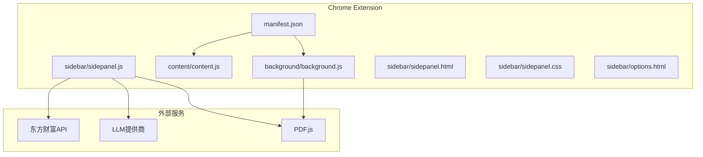
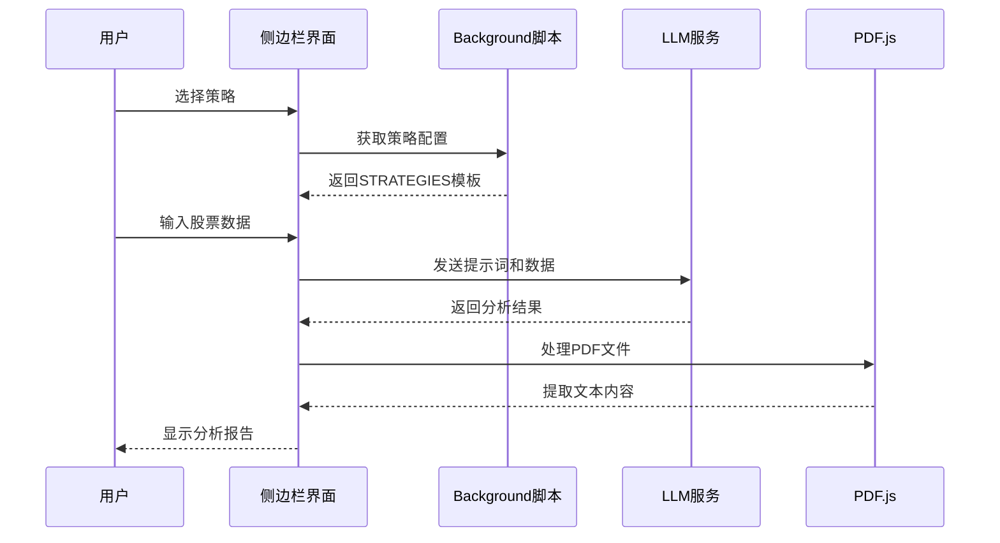
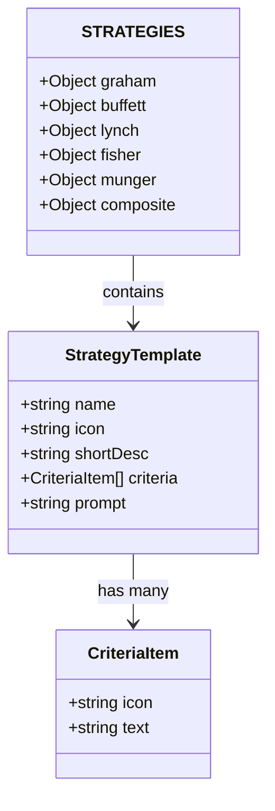
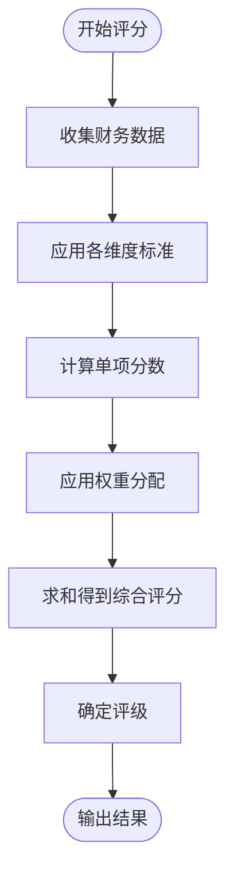
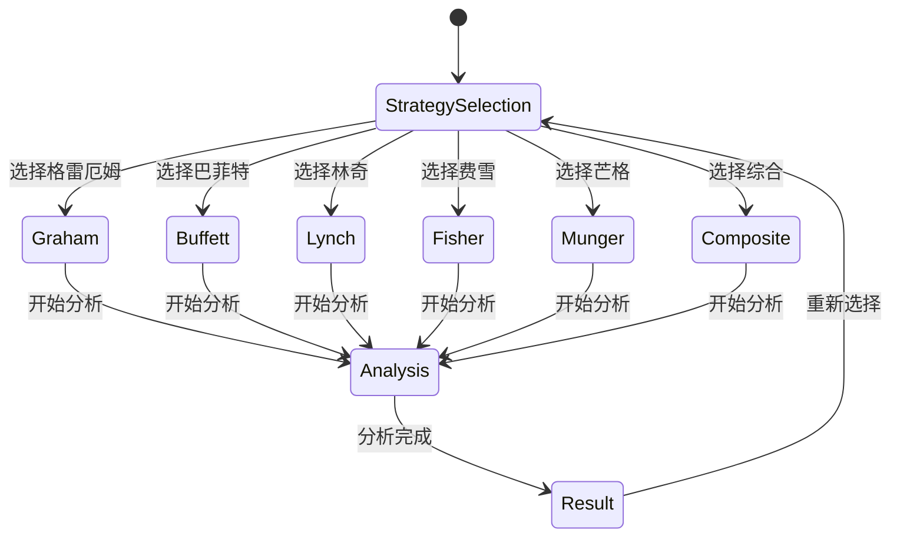
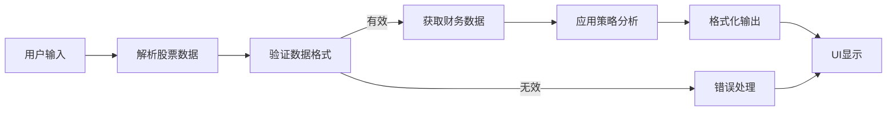
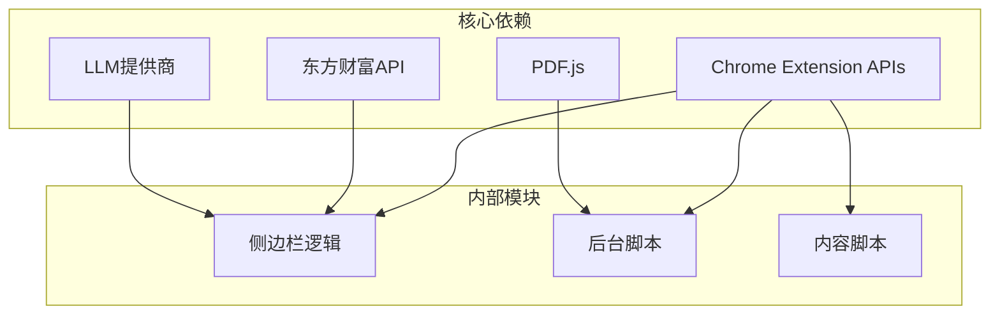

# 新投资策略开发

<cite>
**本文档引用的文件**
- [manifest.json](file://manifest.json)
- [background.js](file://background/background.js)
- [content.js](file://content/content.js)
- [sidepanel.js](file://sidebar/sidepanel.js)
- [sidepanel.html](file://sidebar/sidepanel.html)
- [sidepanel.css](file://sidebar/sidepanel.css)
- [options.html](file://sidebar/options.html)
- [README.md](file://README.md)
</cite>

## 目录
1. [简介](#简介)
2. [项目结构](#项目结构)
3. [核心组件](#核心组件)
4. [架构概览](#架构概览)
5. [详细组件分析](#详细组件分析)
6. [依赖分析](#依赖分析)
7. [性能考虑](#性能考虑)
8. [故障排除指南](#故障排除指南)
9. [结论](#结论)

## 简介

本指南面向新投资策略开发，基于现有的STRATEGIES模板系统，详细说明如何创建和集成新的投资策略。该项目是一个Chrome扩展程序，集成了价值投资大师策略、AI驱动的财报解读和股票分析功能。

## 项目结构

项目采用Chrome Extension Manifest V3架构，包含以下核心模块：

**图表来源**
- [manifest.json:1-48](file://manifest.json#L1-L48)
- [sidepanel.js:14-297](file://sidebar/sidepanel.js#L14-L297)

**章节来源**
- [manifest.json:1-48](file://manifest.json#L1-L48)
- [README.md:108-126](file://README.md#L108-L126)

## 核心组件

### STRATEGIES模板系统

项目的核心是STRATEGIES模板系统，定义了六种价值投资大师策略：

| 策略 | 核心思想 | 关键指标 |
|------|----------|----------|
| **🏛 格雷厄姆** | 深度价值 · 安全边际 | PE<15, PB<1.5, 股息≥3%, 流动比率≥2 |
| **🏰 巴菲特** | 护城河 · 优质企业 | ROE≥15%, 所有者盈余, 定价权, 管理层 |
| **🔍 彼得·林奇** | PEG · 成长价值 | PEG<1, 公司分类, 盈利增长15-30% |
| **🌱 费雪** | 长期成长 · 15要点 | 研发投入, 利润率, 管理层深度 |
| **⚖️ 芒格** | 理性 · 逆向思维 | ROIC>WACC, 逆向排除, 压力测试 |
| **🌟 综合大师** | 多策略融合 · 严选 | 5大师加权评分，综合排名 |

**章节来源**
- [sidepanel.js:14-297](file://sidebar/sidepanel.js#L14-L297)
- [README.md:10-17](file://README.md#L10-L17)

## 架构概览

系统采用模块化架构，通过消息传递实现组件间通信：

**图表来源**
- [sidepanel.js:758-784](file://sidebar/sidepanel.js#L758-L784)
- [background.js:37-117](file://background/background.js#L37-L117)

## 详细组件分析

### STRATEGIES模板结构详解

每个策略都包含以下标准化组件：

#### 基本配置结构

**图表来源**
- [sidepanel.js:14-297](file://sidebar/sidepanel.js#L14-L297)

#### 策略配置字段说明

1. **name（策略名称）**
   - 显示在UI中的策略标识
   - 用于策略切换和状态管理

2. **icon（表情符号）**
   - 策略的视觉标识
   - 在策略芯片和详情面板中显示

3. **shortDesc（简短描述）**
   - 策略核心理念的简洁概括
   - 用于快速了解策略特点

4. **criteria（评估标准数组）**
   - 具体的筛选条件列表
   - 每个条件包含图标和描述文本

5. **prompt（AI提示词）**
   - 完整的策略分析指令
   - 包含评估标准、输出格式和评分体系

**章节来源**
- [sidepanel.js:14-297](file://sidebar/sidepanel.js#L14-L297)

### 评分体系设计

每个策略都有独特的评分体系：

#### 格雷厄姆策略评分
- **PE评分**：15分制（PE < 10为满分）
- **PB评分**：15分制（PB < 1.5为满分）
- **股息率评分**：15分制（≥ 3%为满分）
- **流动比率评分**：10分制（≥ 2.0为满分）
- **负债权益比分**：10分制（≤ 0.5为满分）
- **盈利稳定性评分**：15分制（连续10年无亏损）
- **安全边际评分**：20分制（内在价值-市场价格 ≥ 33%）

#### 综合评分算法

**图表来源**
- [sidepanel.js:251-296](file://sidebar/sidepanel.js#L251-L296)

**章节来源**
- [sidepanel.js:251-296](file://sidebar/sidepanel.js#L251-L296)

### 提示词工程最佳实践

#### 结构化提示词模板

每个策略的提示词都遵循统一的结构：

1. **角色设定**：明确AI的投资顾问身份
2. **评估标准**：详细列出筛选条件
3. **输出格式**：规范化的报告结构
4. **评分体系**：清晰的打分规则
5. **最终推荐**：明确的投资建议

#### 提示词设计原则

- **具体性**：使用明确的数值阈值
- **可操作性**：提供可执行的评估步骤
- **一致性**：保持与其他策略的格式统一
- **完整性**：涵盖所有评估维度

**章节来源**
- [sidepanel.js:28-57](file://sidebar/sidepanel.js#L28-L57)
- [sidepanel.js:72-104](file://sidebar/sidepanel.js#L72-L104)

### UI集成与状态管理

#### 策略切换系统

**图表来源**
- [sidepanel.js:758-784](file://sidebar/sidepanel.js#L758-L784)

#### 状态管理机制

系统使用集中式状态管理：

- **activeStrategy**：当前激活的策略
- **strategyDetailOpen**：策略详情面板开关状态
- **selectedStocks**：已选择的股票列表
- **settings**：用户配置信息

**章节来源**
- [sidepanel.js:516-584](file://sidebar/sidepanel.js#L516-L584)
- [sidepanel.js:758-784](file://sidebar/sidepanel.js#L758-L784)

### 数据处理与分析流程

#### 股票数据处理

**图表来源**
- [sidepanel.js:3878-3911](file://sidebar/sidepanel.js#L3878-L3911)

#### PDF文件处理

系统支持多种PDF处理场景：

- **直接PDF链接**：自动检测和下载
- **Chrome PDF查看器**：特殊URL处理
- **嵌入式PDF**：content script检测
- **大文件分块传输**：内存优化

**章节来源**
- [background.js:21-34](file://background/background.js#L21-L34)
- [background.js:125-177](file://background/background.js#L125-L177)
- [content.js:11-28](file://content/content.js#L11-L28)

## 依赖分析

### 外部依赖关系

**图表来源**
- [manifest.json:6-12](file://manifest.json#L6-L12)
- [sidepanel.js:417-423](file://sidebar/sidepanel.js#L417-L423)

### 模块耦合度分析

- **低耦合**：各策略模块相互独立
- **高内聚**：每个策略包含完整的配置和逻辑
- **清晰边界**：UI层、逻辑层、数据层分离

**章节来源**
- [manifest.json:16-21](file://manifest.json#L16-L21)
- [sidepanel.js:14-297](file://sidebar/sidepanel.js#L14-L297)

## 性能考虑

### 内存管理

- **PDF文件分块传输**：避免大文件内存溢出
- **状态清理**：及时清理不再使用的数据
- **DOM优化**：虚拟滚动处理大量股票列表

### 网络优化

- **缓存策略**：重复请求的数据缓存
- **批量API调用**：减少网络请求次数
- **超时处理**：防止长时间阻塞

### UI响应性

- **异步处理**：所有耗时操作异步执行
- **进度反馈**：提供实时处理状态
- **错误恢复**：优雅处理各种异常情况

## 故障排除指南

### 常见问题及解决方案

#### 策略配置问题

**问题**：新策略不显示在UI中
**解决方案**：
1. 确保策略名称唯一且符合命名规范
2. 检查icon是否为有效的emoji字符
3. 验证shortDesc长度适中
4. 确认criteria数组格式正确

#### 数据获取问题

**问题**：股票数据获取失败
**解决方案**：
1. 检查东方财富API连接状态
2. 验证股票代码格式
3. 确认网络连接正常
4. 查看API响应状态码

#### LLM调用问题

**问题**：AI分析失败
**解决方案**：
1. 检查API Key配置
2. 验证LLM提供商可用性
3. 确认模型名称正确
4. 查看错误日志获取详细信息

#### PDF处理问题

**问题**：PDF文件无法解析
**解决方案**：
1. 检查PDF文件格式
2. 验证文件完整性
3. 确认Chrome PDF查看器权限
4. 尝试手动下载文件

**章节来源**
- [sidepanel.js:3343-3357](file://sidebar/sidepanel.js#L3343-L3357)
- [background.js:125-177](file://background/background.js#L125-L177)

## 结论

本指南提供了基于STRATEGIES模板系统开发新投资策略的完整方案。通过遵循本文档的设计原则和最佳实践，开发者可以快速创建符合项目架构要求的新策略，并确保与现有系统的无缝集成。

关键成功要素包括：
- 严格遵循STRATEGIES模板结构
- 设计清晰的评分体系
- 编写结构化的提示词
- 确保UI集成的完整性
- 考虑性能和用户体验