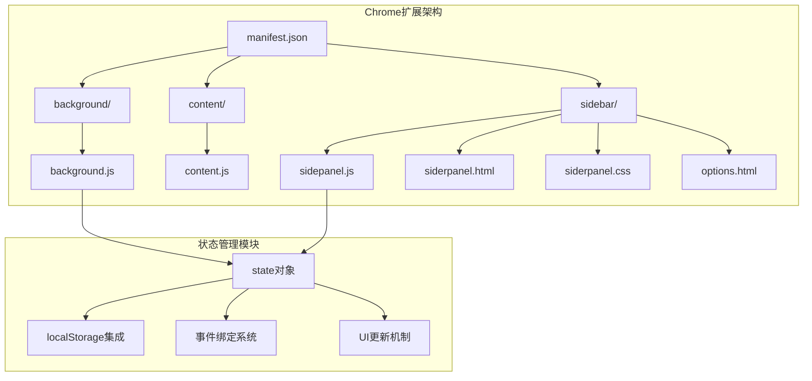
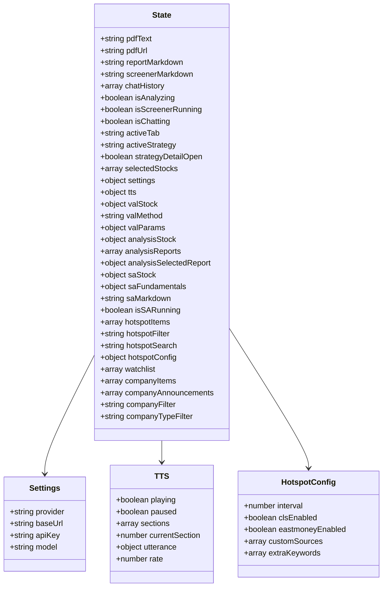
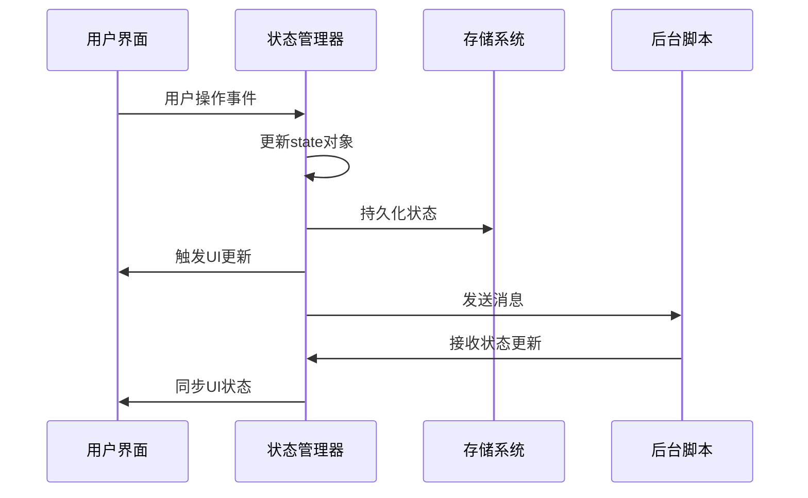
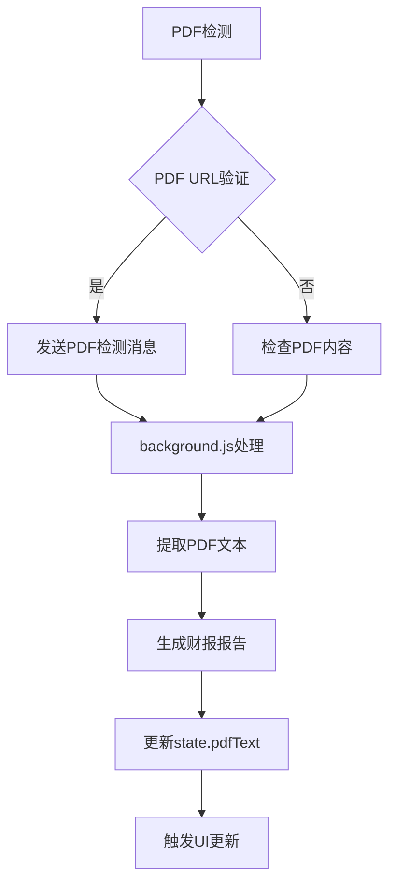
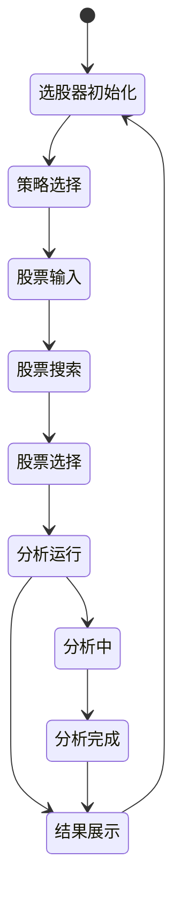
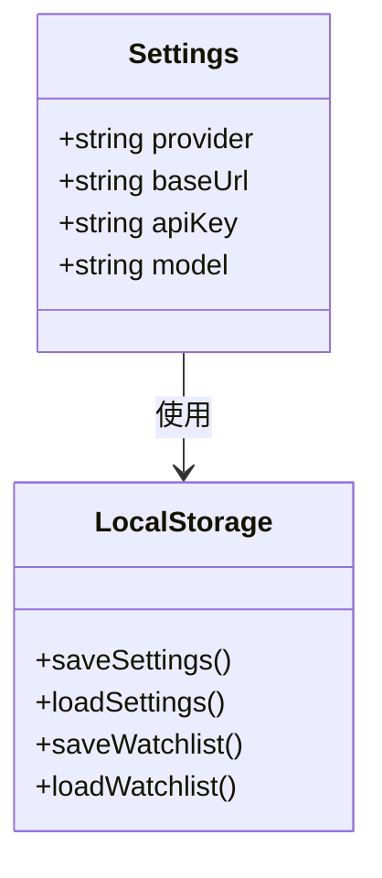
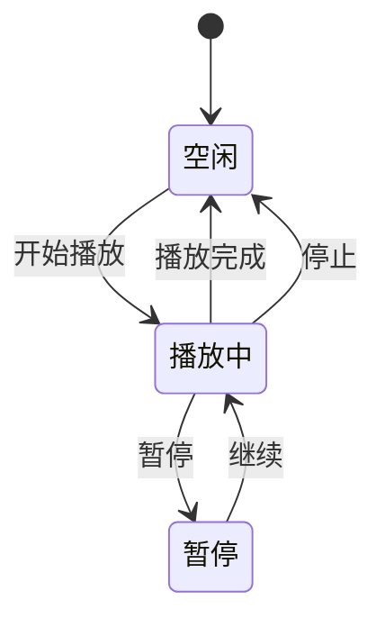
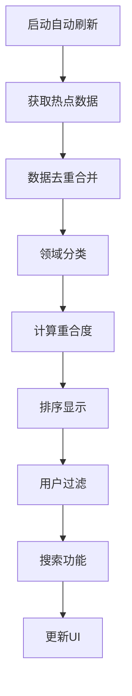
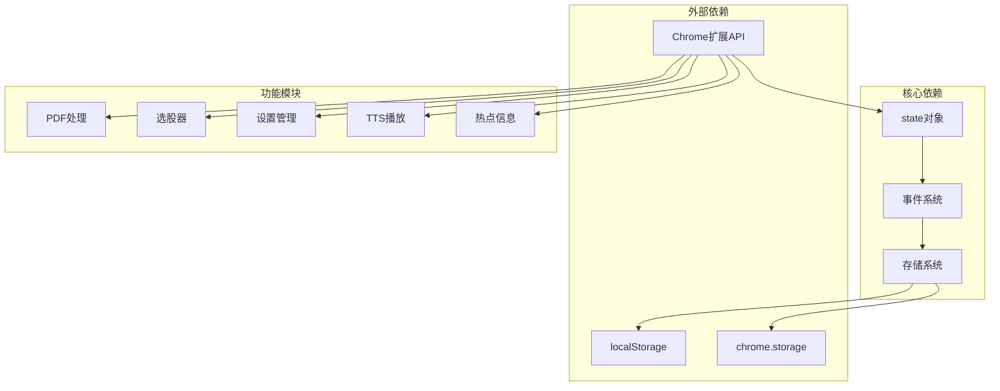

# 状态管理系统扩展

<cite>
**本文档引用的文件**
- [manifest.json](file://manifest.json)
- [background.js](file://background/background.js)
- [content.js](file://content/content.js)
- [sidepanel.js](file://sidebar/sidepanel.js)
- [README.md](file://README.md)
</cite>

## 目录
1. [简介](#简介)
2. [项目结构](#项目结构)
3. [核心组件](#核心组件)
4. [架构概览](#架构概览)
5. [详细组件分析](#详细组件分析)
6. [依赖分析](#依赖分析)
7. [性能考虑](#性能考虑)
8. [故障排除指南](#故障排除指南)
9. [结论](#结论)

## 简介

投资助手是一个基于Chrome扩展的AI驱动投资决策助手，集成了财报解读、价值投资大师选股器、内在价值计算器等功能。本文档专注于状态管理系统的扩展开发，提供详细的指导来扩展现有的状态管理机制。

该系统采用集中式状态管理模式，所有状态数据存储在一个全局state对象中，通过事件驱动的方式实现状态更新和UI同步。系统支持多种状态类型，包括简单值、对象、数组以及复杂的嵌套结构。

## 项目结构

项目采用模块化架构，主要包含以下核心模块：

**图表来源**
- [manifest.json:1-48](file://manifest.json#L1-L48)
- [sidepanel.js:516-584](file://sidebar/sidepanel.js#L516-L584)

**章节来源**
- [manifest.json:1-48](file://manifest.json#L1-L48)
- [README.md:108-126](file://README.md#L108-L126)

## 核心组件

### 状态对象结构

系统的核心是全局state对象，它包含了所有应用状态：

**图表来源**
- [sidepanel.js:516-584](file://sidebar/sidepanel.js#L516-L584)

### 状态管理模块

系统包含多个专门的状态管理模块：

1. **PDF状态管理**：处理PDF文件检测、文本提取和报告生成
2. **选股器状态管理**：管理股票筛选器、策略选择和分析结果
3. **设置状态管理**：处理用户配置、API密钥和偏好设置
4. **TTS状态管理**：控制文本转语音播放、暂停和进度
5. **热点信息状态管理**：管理新闻聚合、过滤和自动刷新
6. **估值计算器状态管理**：处理股票估值计算和参数管理

**章节来源**
- [sidepanel.js:516-584](file://sidebar/sidepanel.js#L516-L584)
- [sidepanel.js:609-637](file://sidebar/sidepanel.js#L609-L637)

## 架构概览

系统采用事件驱动的状态管理模式，通过以下机制实现状态同步：

**图表来源**
- [sidepanel.js:641-681](file://sidebar/sidepanel.js#L641-L681)
- [sidepanel.js:620-637](file://sidebar/sidepanel.js#L620-L637)

### 状态同步机制

系统实现了多层次的状态同步机制：

1. **本地状态同步**：通过事件监听器实现实时状态更新
2. **持久化存储**：使用localStorage和chrome.storage实现数据持久化
3. **跨组件通信**：通过事件系统实现组件间状态共享
4. **UI自动更新**：状态变更自动触发UI更新

**章节来源**
- [sidepanel.js:641-681](file://sidebar/sidepanel.js#L641-L681)
- [sidepanel.js:1935-1949](file://sidebar/sidepanel.js#L1935-L1949)

## 详细组件分析

### PDF状态管理

PDF状态管理负责处理PDF文件检测、文本提取和报告生成：

**图表来源**
- [sidepanel.js:2613-2697](file://sidebar/sidepanel.js#L2613-L2697)
- [background.js:21-34](file://background/background.js#L21-L34)

#### PDF状态字段

- `pdfText`: 提取的PDF文本内容
- `pdfUrl`: 当前PDF文件的URL
- `reportMarkdown`: 生成的财报报告Markdown

**章节来源**
- [sidepanel.js:2613-2697](file://sidebar/sidepanel.js#L2613-L2697)

### 选股器状态管理

选股器状态管理处理股票筛选、策略选择和分析结果：

**图表来源**
- [sidepanel.js:2504-2563](file://sidebar/sidepanel.js#L2504-L2563)

#### 选股器状态字段

- `selectedStocks`: 已选择的股票数组
- `activeStrategy`: 当前激活的策略
- `screenerMarkdown`: 选股分析结果
- `isScreenerRunning`: 分析运行状态

**章节来源**
- [sidepanel.js:2504-2563](file://sidebar/sidepanel.js#L2504-L2563)

### 设置状态管理

设置状态管理处理用户配置和偏好设置：

**图表来源**
- [sidepanel.js:529-534](file://sidebar/sidepanel.js#L529-L534)
- [sidepanel.js:609-637](file://sidebar/sidepanel.js#L609-L637)

#### 设置状态字段

- `settings.provider`: LLM提供商
- `settings.baseUrl`: API基础URL
- `settings.apiKey`: API密钥
- `settings.model`: 模型名称

**章节来源**
- [sidepanel.js:609-637](file://sidebar/sidepanel.js#L609-L637)

### TTS状态管理

TTS状态管理控制文本转语音播放：

**图表来源**
- [sidepanel.js:3640-3682](file://sidebar/sidepanel.js#L3640-L3682)

#### TTS状态字段

- `tts.playing`: 播放状态
- `tts.paused`: 暂停状态
- `tts.sections`: 播放章节数组
- `tts.currentSection`: 当前章节索引
- `tts.rate`: 播放速度

**章节来源**
- [sidepanel.js:3640-3682](file://sidebar/sidepanel.js#L3640-L3682)

### 热点信息状态管理

热点信息状态管理处理新闻聚合和过滤：

**图表来源**
- [sidepanel.js:1291-1363](file://sidebar/sidepanel.js#L1291-L1363)

#### 热点信息状态字段

- `hotspotItems`: 热点新闻列表
- `hotspotFilter`: 当前过滤条件
- `hotspotSearch`: 搜索关键词
- `hotspotConfig`: 配置选项

**章节来源**
- [sidepanel.js:1291-1363](file://sidebar/sidepanel.js#L1291-L1363)

## 依赖分析

系统状态管理依赖关系如下：

**图表来源**
- [sidepanel.js:516-584](file://sidebar/sidepanel.js#L516-L584)
- [manifest.json:6-12](file://manifest.json#L6-L12)

### 状态依赖关系

系统中的状态存在以下依赖关系：

1. **基础状态依赖**：所有其他状态都依赖于基础状态对象
2. **功能模块状态**：各功能模块维护自己的状态子集
3. **UI状态同步**：状态变更自动触发UI更新
4. **持久化依赖**：状态需要持久化存储以支持重启恢复

**章节来源**
- [sidepanel.js:516-584](file://sidebar/sidepanel.js#L516-L584)

## 性能考虑

### 状态更新优化

1. **防抖处理**：对频繁的状态更新操作使用防抖机制
2. **批量更新**：支持批量状态更新以减少UI重绘
3. **懒加载**：对大型状态对象采用懒加载策略
4. **内存管理**：及时清理不再使用的状态数据

### 存储优化

1. **增量存储**：只存储必要的状态数据
2. **压缩存储**：对大数据状态进行压缩存储
3. **异步存储**：使用异步存储避免阻塞主线程
4. **缓存策略**：实现智能缓存减少存储访问

## 故障排除指南

### 常见状态管理问题

1. **状态不同步**：检查事件监听器是否正确绑定
2. **数据丢失**：验证localStorage权限和容量
3. **性能问题**：分析状态更新频率和UI重绘次数
4. **内存泄漏**：检查事件监听器的清理机制

### 调试技巧

1. **状态监控**：使用console.log监控状态变更
2. **时间旅行**：实现状态历史记录功能
3. **热重载**：支持状态的热重载和恢复
4. **错误边界**：实现状态错误的捕获和处理

**章节来源**
- [sidepanel.js:609-637](file://sidebar/sidepanel.js#L609-L637)

## 结论

投资助手的状态管理系统采用集中式架构，通过事件驱动的方式实现了高效的状态管理。系统支持多种状态类型和复杂的嵌套结构，提供了完善的持久化和同步机制。

扩展开发的关键在于理解现有的状态管理模式，遵循既定的开发流程，确保新功能与现有系统的兼容性。通过合理的状态设计和优化策略，可以构建出高性能、可维护的状态管理系统。