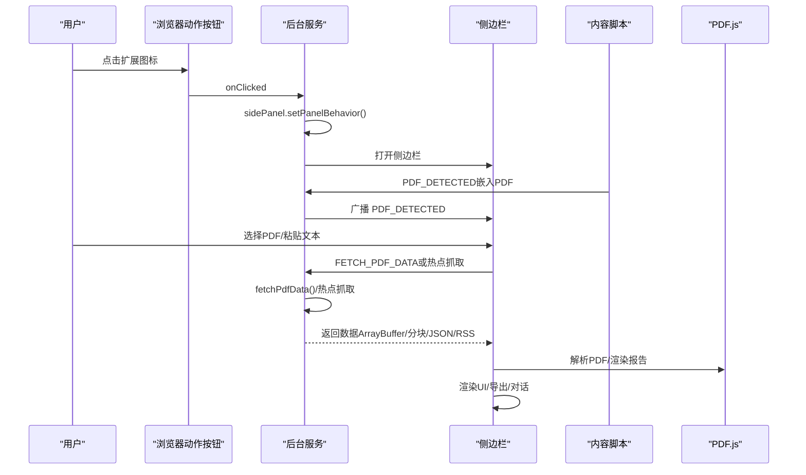
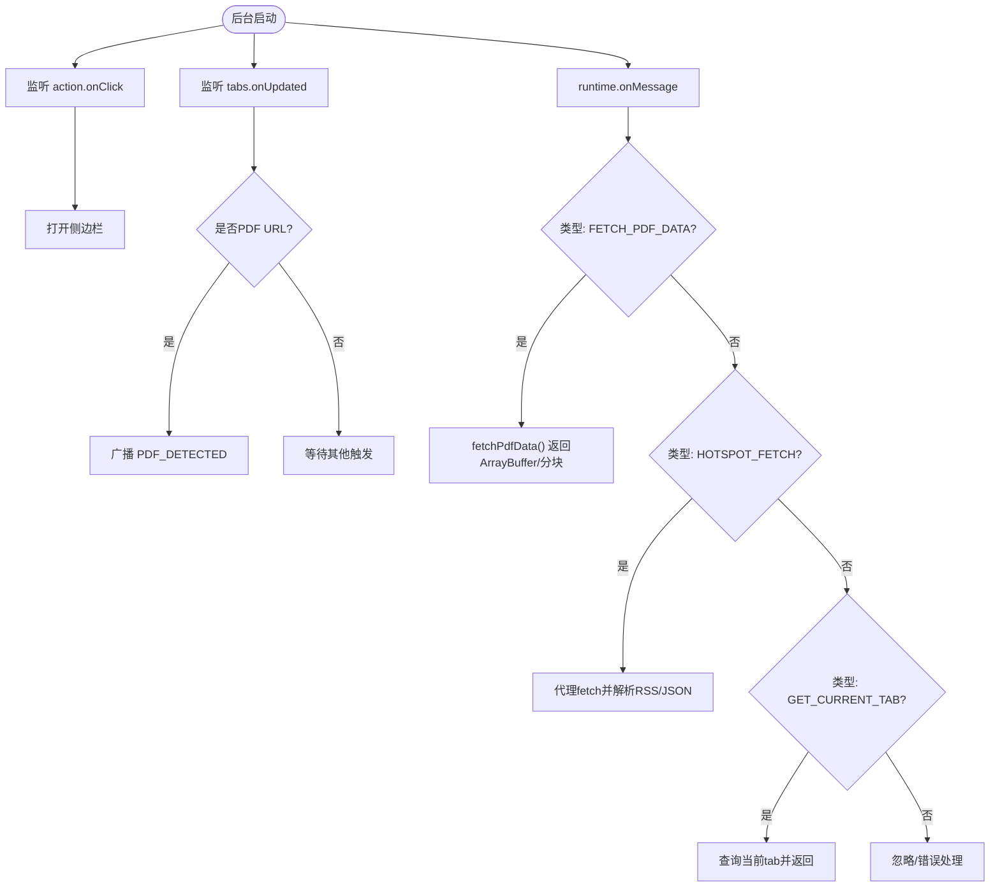
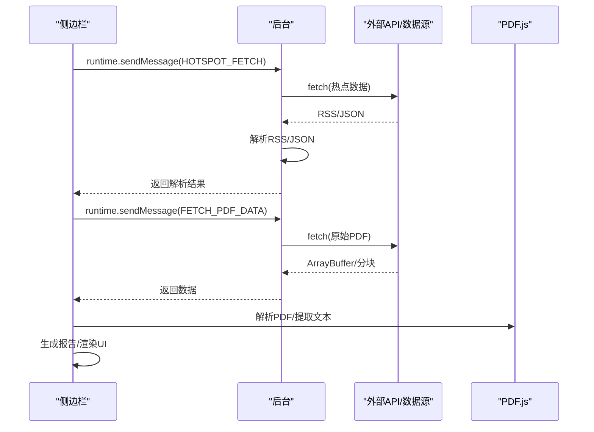
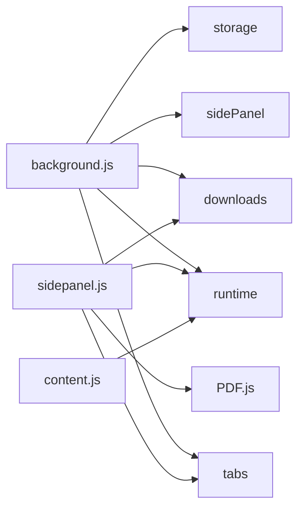

# 扩展开发

<cite>
**本文档引用的文件**
- [manifest.json](file://manifest.json)
- [background.js](file://background/background.js)
- [content.js](file://content/content.js)
- [sidepanel.js](file://sidebar/sidepanel.js)
- [sidepanel.html](file://sidebar/sidepanel.html)
- [sidepanel.css](file://sidebar/sidepanel.css)
- [options.html](file://sidebar/options.html)
- [pdf.min.js](file://lib/pdf.min.js)
</cite>

## 目录
1. [简介](#简介)
2. [项目结构](#项目结构)
3. [核心组件](#核心组件)
4. [架构总览](#架构总览)
5. [详细组件分析](#详细组件分析)
6. [依赖关系分析](#依赖关系分析)
7. [性能考虑](#性能考虑)
8. [故障排查指南](#故障排查指南)
9. [结论](#结论)
10. [附录](#附录)

## 简介
本指南面向希望基于现有 Chrome 扩展“投资助手”进行二次开发的工程师，系统讲解如何使用 Chrome Extension API（特别是 sidePanel、storage、downloads 等）完成新功能开发，涵盖从需求分析到代码实现再到测试部署的完整流程。文档同时提供事件处理、消息通信、异步操作的最佳实践，以及调试技巧与性能优化建议，帮助你在保证扩展稳定性的同时提升运行效率。

## 项目结构
该扩展采用“清单文件 + 后台服务工作线程 + 侧边栏界面 + 内容脚本”的经典架构，配合本地资源与 Web API 实现 PDF 解析、热点抓取、AI 对话与导出等功能。

```mermaid
graph TB
subgraph "扩展清单"
M["manifest.json"]
end
subgraph "后台服务"
BG["background.js"]
CS["content.js"]
end
subgraph "侧边栏界面"
SP_HTML["sidepanel.html"]
SP_JS["sidepanel.js"]
SP_CSS["sidepanel.css"]
OPT["options.html"]
end
subgraph "本地资源"
PDF["lib/pdf.min.js"]
end
M --> BG
M --> CS
M --> SP_HTML
SP_HTML --> SP_JS
SP_JS --> PDF
BG <- --> SP_JS
CS --> BG
```

**图表来源**
- [manifest.json:1-48](file://manifest.json#L1-L48)
- [background.js:1-307](file://background/background.js#L1-L307)
- [content.js:1-36](file://content/content.js#L1-L36)
- [sidepanel.js:1-120](file://sidebar/sidepanel.js#L1-L120)
- [sidepanel.html:1-646](file://sidebar/sidepanel.html#L1-L646)
- [sidepanel.css:1-800](file://sidebar/sidepanel.css#L1-L800)
- [options.html:1-124](file://sidebar/options.html#L1-L124)
- [pdf.min.js:1-22](file://lib/pdf.min.js#L1-L22)

**章节来源**
- [manifest.json:1-48](file://manifest.json#L1-L48)
- [background.js:1-307](file://background/background.js#L1-L307)
- [content.js:1-36](file://content/content.js#L1-L36)
- [sidepanel.js:1-120](file://sidebar/sidepanel.js#L1-L120)
- [sidepanel.html:1-646](file://sidebar/sidepanel.html#L1-L646)
- [sidepanel.css:1-800](file://sidebar/sidepanel.css#L1-L800)
- [options.html:1-124](file://sidebar/options.html#L1-L124)
- [pdf.min.js:1-22](file://lib/pdf.min.js#L1-L22)

## 核心组件
- 清单文件（manifest.json）：声明权限、行为与资源访问策略，启用 sidePanel、storage、downloads 等能力。
- 后台服务工作线程（background.js）：负责侧边栏打开、PDF 检测与下载、消息路由与 RSS/XML 解析、CORS 代理等。
- 内容脚本（content.js）：在网页中检测嵌入式 PDF，向后台发送信号。
- 侧边栏界面（sidepanel.html + sidepanel.js + sidepanel.css）：提供热点、选股器、估值、财报解读、股票分析、AI 对话等模块。
- 选项页（options.html）：LLM 服务商与 API Key 配置。
- 本地资源（lib/pdf.min.js）：PDF.js 库，用于侧边栏内解析 PDF。

**章节来源**
- [manifest.json:6-12](file://manifest.json#L6-L12)
- [background.js:11-117](file://background/background.js#L11-L117)
- [content.js:11-28](file://content/content.js#L11-L28)
- [sidepanel.js:516-584](file://sidebar/sidepanel.js#L516-L584)
- [options.html:46-69](file://sidebar/options.html#L46-L69)

## 架构总览
扩展采用“后台服务 + 侧边栏 + 内容脚本”的三层交互架构。后台负责与外部 API 交互、CORS 代理、消息分发；侧边栏负责用户交互与展示；内容脚本负责网页内 PDF 的探测与信号上报。



**图表来源**
- [background.js:12-34](file://background/background.js#L12-L34)
- [content.js:11-28](file://content/content.js#L11-L28)
- [sidepanel.js:2613-2697](file://sidebar/sidepanel.js#L2613-L2697)
- [sidepanel.js:1073-1086](file://sidebar/sidepanel.js#L1073-L1086)
- [pdf.min.js:1-22](file://lib/pdf.min.js#L1-L22)

## 详细组件分析

### 后台服务（background.js）
- 侧边栏管理：监听 action 点击打开侧边栏，设置点击即打开行为。
- PDF 检测：监听 tab 更新，识别 .pdf、带查询参数或 chrome://pdf-viewer 的 URL，向侧边栏广播。
- 消息路由：处理来自侧边栏的 FETCH_PDF_DATA、HOTSPOT_FETCH、GET_CURRENT_TAB 等消息。
- CORS 代理：对热点抓取与 PDF 下载使用 fetch，解析 RSS/Atom XML，支持分块传输大文件。
- RSS/XML 解析：统一输出结构，支持财联社、巨潮资讯、东方财富等数据源。
- 广播机制：向侧边栏广播 PDF 检测结果，避免侧边栏未打开时报错。



**图表来源**
- [background.js:12-34](file://background/background.js#L12-L34)
- [background.js:37-117](file://background/background.js#L37-L117)
- [background.js:125-177](file://background/background.js#L125-L177)
- [background.js:192-251](file://background/background.js#L192-L251)

**章节来源**
- [background.js:11-117](file://background/background.js#L11-L117)
- [background.js:125-177](file://background/background.js#L125-L177)
- [background.js:192-251](file://background/background.js#L192-L251)

### 内容脚本（content.js）
- 作用：在普通网页中检测 embed/object/iframe 中的 PDF，向后台发送 PDF_DETECTED 消息。
- 适用场景：Chrome 内置 PDF 查看器（chrome://pdf-viewer）无法注入内容脚本，因此 PDF 的实际下载与解析在后台与侧边栏完成，该脚本仅作为补充信号源。

**章节来源**
- [content.js:11-28](file://content/content.js#L11-L28)

### 侧边栏主逻辑（sidepanel.js）
- 模块划分：热点信息、选股器、估值计算器、财报解读、股票分析、AI 对话、TTS 播报、导出。
- 状态管理：集中维护各模块状态（state），使用 localStorage 存储设置。
- 事件绑定：标签切换、设置面板、搜索提示、热点列表、公司资讯、TTS 控制、导出等。
- PDF 流程：检测 PDF、下载二进制、解析文本、生成报告、TTS 播报、导出 Markdown。
- 热点抓取：并行抓取多个数据源（内置API + 默认RSS + 自定义RSS），去重与重合度计算，领域分类与关键词过滤。
- AI 对话：支持流式响应，可携带上下文，支持多模块上下文摘要。
- 导出：使用 chrome.downloads API 导出 Markdown 至指定目录，失败时回退至传统下载。



**图表来源**
- [sidepanel.js:1073-1086](file://sidebar/sidepanel.js#L1073-L1086)
- [sidepanel.js:1291-1363](file://sidebar/sidepanel.js#L1291-L1363)
- [sidepanel.js:2621-2697](file://sidebar/sidepanel.js#L2621-L2697)
- [pdf.min.js:1-22](file://lib/pdf.min.js#L1-L22)

**章节来源**
- [sidepanel.js:516-584](file://sidebar/sidepanel.js#L516-L584)
- [sidepanel.js:1073-1086](file://sidebar/sidepanel.js#L1073-L1086)
- [sidepanel.js:1291-1363](file://sidebar/sidepanel.js#L1291-L1363)
- [sidepanel.js:2621-2697](file://sidebar/sidepanel.js#L2621-L2697)

### 清单文件（manifest.json）
- 权限：sidePanel、activeTab、scripting、storage、downloads。
- 主题图标与默认标题。
- side_panel 默认路径指向 sidepanel.html。
- web_accessible_resources 暴露 PDF.js 资源，便于侧边栏加载。
- options_page 指向设置页。

**章节来源**
- [manifest.json:6-12](file://manifest.json#L6-L12)
- [manifest.json:16-18](file://manifest.json#L16-L18)
- [manifest.json:22-30](file://manifest.json#L22-L30)
- [manifest.json:31-47](file://manifest.json#L31-L47)

### 选项页（options.html）
- 提供 LLM 服务商选择、API 地址、API Key、模型名称配置。
- 保存到 localStorage，侧边栏初始化时加载。

**章节来源**
- [options.html:46-69](file://sidebar/options.html#L46-L69)

## 依赖关系分析
- 后台依赖：Chrome Extension API（runtime、tabs、sidePanel、downloads、storage）、DOMParser、fetch。
- 侧边栏依赖：Chrome Extension API（runtime、tabs、downloads）、PDF.js、Markdown 渲染、SpeechSynthesis。
- 内容脚本依赖：Chrome Extension API（runtime）。
- 资源依赖：PDF.js（lib/pdf.min.js）及其 worker。



**图表来源**
- [background.js:11-117](file://background/background.js#L11-L117)
- [sidepanel.js:1-120](file://sidebar/sidepanel.js#L1-L120)
- [content.js:1-36](file://content/content.js#L1-L36)
- [pdf.min.js:1-22](file://lib/pdf.min.js#L1-L22)

**章节来源**
- [background.js:11-117](file://background/background.js#L11-L117)
- [sidepanel.js:1-120](file://sidebar/sidepanel.js#L1-L120)
- [content.js:1-36](file://content/content.js#L1-L36)

## 性能考虑
- 并行抓取热点数据：使用 Promise.allSettled 并行请求多个数据源，减少总耗时。
- 去重与合并：热点数据合并去重，计算重合度，避免重复渲染与播报。
- 分块传输 PDF：后台对大文件进行分块传输，避免一次性消息过大导致性能问题。
- 流式渲染：LLM 对话与报告生成支持流式响应，及时更新 UI，提升交互体验。
- 缓存与懒加载：侧边栏模块按需渲染，PDF.js 脚本按需加载，降低首屏负担。
- 事件防抖：搜索与输入框输入采用定时器去抖，减少频繁请求。

[本节为通用指导，无需特定文件引用]

## 故障排查指南
- PDF 无法解析
  - 确认侧边栏已正确加载 PDF.js，并设置 worker 路径。
  - 检查后台是否成功下载 PDF（ArrayBuffer/分块），确认 content-type 与大小。
  - 若为 chrome://pdf-viewer，需从 URL 参数中提取原始地址。
- 热点抓取失败
  - 检查数据源可用性与 CORS 代理是否正常。
  - 确认 RSS/JSON 解析逻辑与域名分类规则。
- LLM 调用失败
  - 检查 API Key、模型名称与 API 地址配置。
  - 确认流式响应解析与错误码处理。
- 导出失败
  - 检查 downloads 权限与目标目录写入权限，必要时回退到传统下载方式。

**章节来源**
- [sidepanel.js:2567-2583](file://sidebar/sidepanel.js#L2567-L2583)
- [background.js:125-177](file://background/background.js#L125-L177)
- [sidepanel.js:1073-1086](file://sidebar/sidepanel.js#L1073-L1086)
- [sidepanel.js:3735-3759](file://sidebar/sidepanel.js#L3735-L3759)

## 结论
该扩展通过清晰的三层架构与完善的 API 使用，实现了从 PDF 检测、热点抓取到 AI 对话与报告导出的完整闭环。开发者可在现有基础上，按本文档的开发流程与最佳实践，快速扩展新的投资策略、集成新的 AI 服务提供商或扩展现有功能模块，确保扩展的稳定性与高效性。

[本节为总结性内容，无需特定文件引用]

## 附录

### 开发流程（从需求到上线）
- 需求分析：明确功能边界、数据来源、交互流程与性能要求。
- 设计与规划：确定模块划分、数据结构、消息协议与 UI 原型。
- 实现步骤：
  - 在 manifest.json 中声明所需权限与资源。
  - 在 background.js 中实现消息路由、CORS 代理与数据聚合。
  - 在 sidepanel.js 中实现 UI 交互、状态管理与导出逻辑。
  - 在 content.js 中实现网页内信号探测与上报。
  - 在 options.html 中提供配置入口。
- 测试与部署：
  - 单元测试与集成测试，覆盖关键路径（PDF 解析、热点抓取、LLM 对话）。
  - 使用 Chrome DevTools 调试消息通信与异步流程。
  - 打包发布前验证权限与资源加载。

[本节为流程性内容，无需特定文件引用]

### Chrome Extension API 使用要点
- sidePanel API：通过 action.onClick 打开侧边栏，设置点击即打开行为。
- storage API：使用 chrome.storage.local 存储热点配置，localStorage 存储设置与关注列表。
- downloads API：使用 chrome.downloads.download 导出 Markdown，失败时回退到传统下载。
- runtime API：跨脚本消息通信，支持同步响应与异步流式响应。
- tabs API：获取当前标签页信息，用于 PDF URL 解析与热点抓取。

**章节来源**
- [manifest.json:6-12](file://manifest.json#L6-L12)
- [manifest.json:16-18](file://manifest.json#L16-L18)
- [background.js:12-34](file://background/background.js#L12-L34)
- [background.js:37-117](file://background/background.js#L37-L117)
- [sidepanel.js:1073-1086](file://sidebar/sidepanel.js#L1073-L1086)
- [sidepanel.js:3735-3759](file://sidebar/sidepanel.js#L3735-L3759)