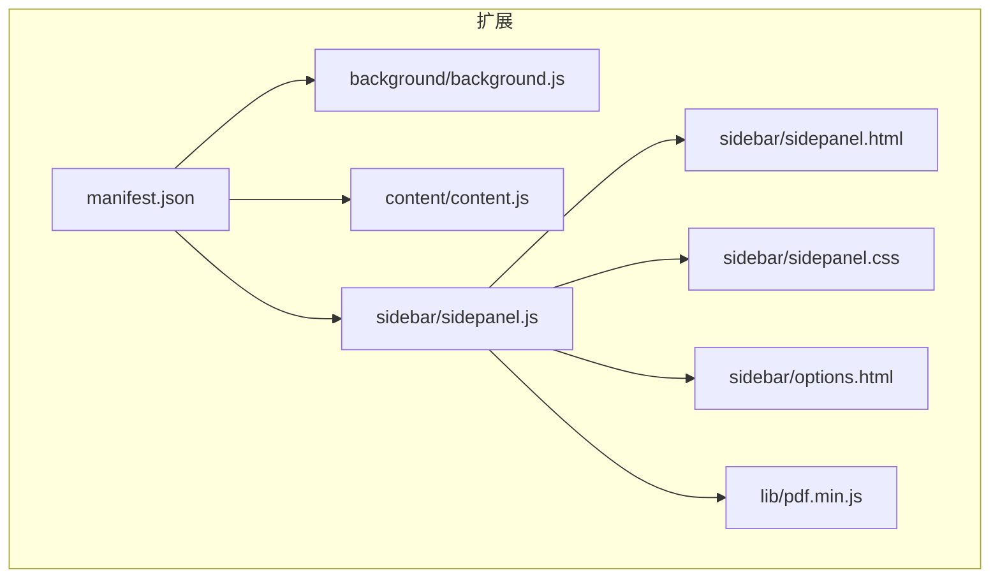
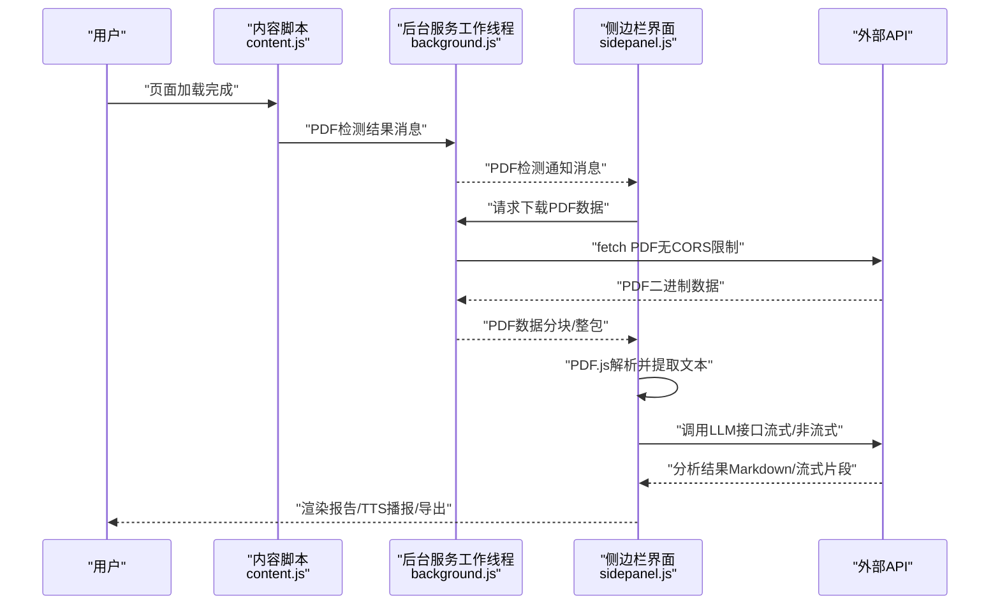
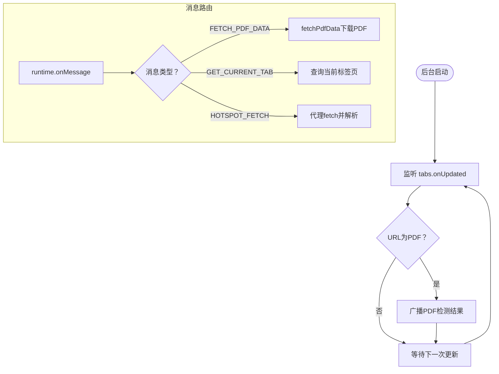
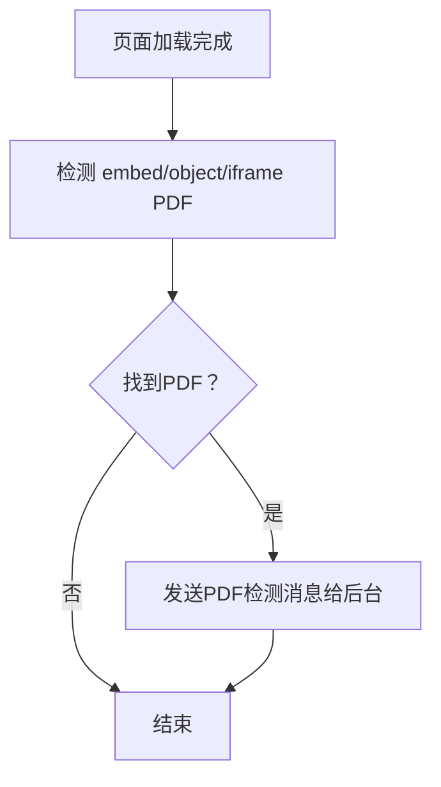
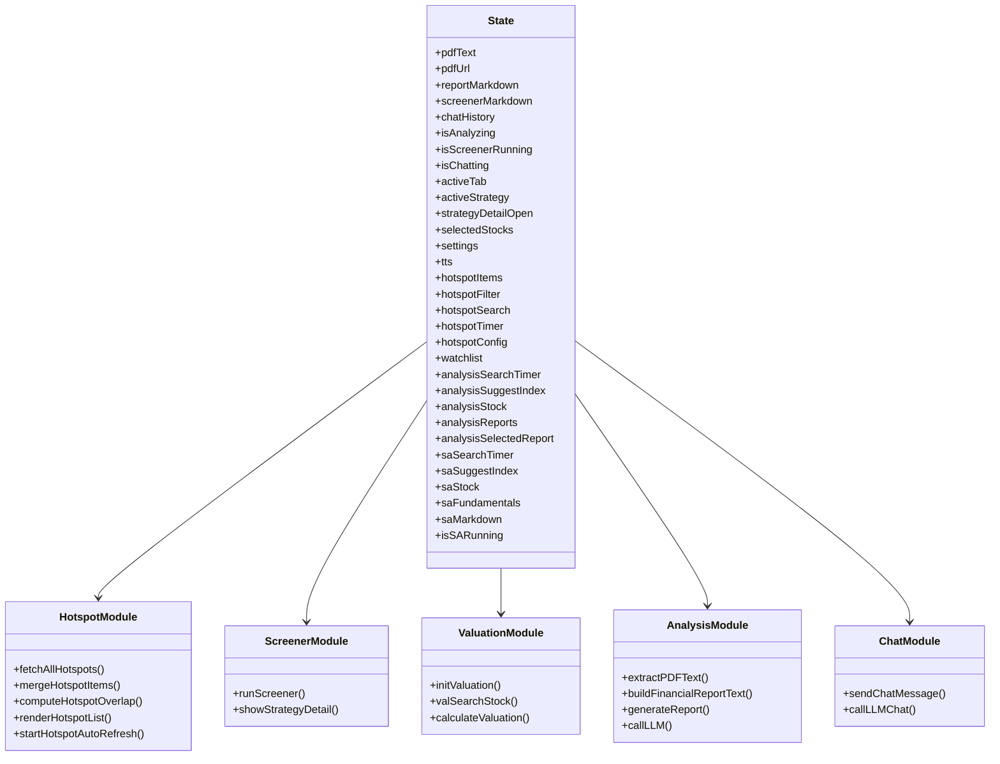
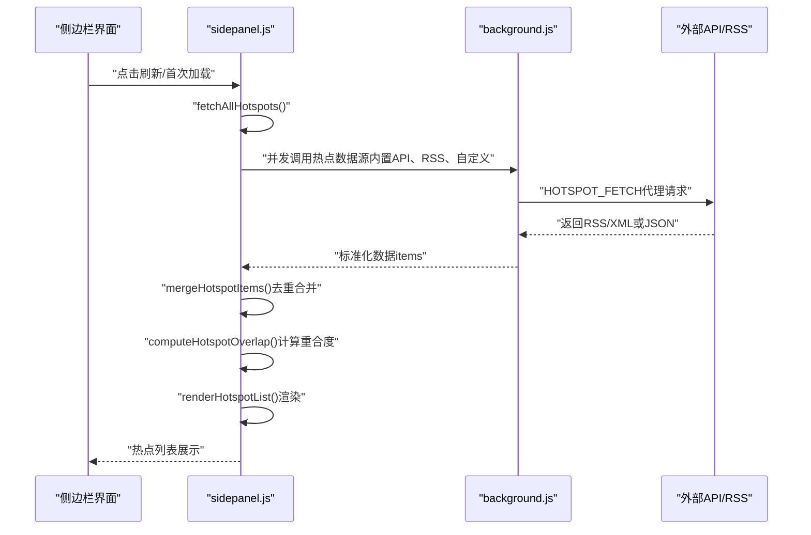
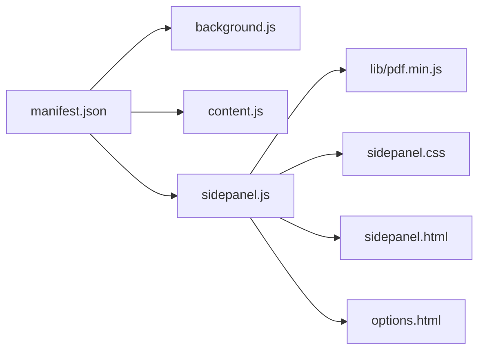

# 调试与性能优化

<cite>
**本文档引用的文件**
- [manifest.json](file://manifest.json)
- [background.js](file://background/background.js)
- [content.js](file://content/content.js)
- [sidepanel.js](file://sidebar/sidepanel.js)
- [sidepanel.html](file://sidebar/sidepanel.html)
- [sidepanel.css](file://sidebar/sidepanel.css)
- [options.html](file://sidebar/options.html)
- [README.md](file://README.md)
</cite>

## 目录
1. [简介](#简介)
2. [项目结构](#项目结构)
3. [核心组件](#核心组件)
4. [架构总览](#架构总览)
5. [详细组件分析](#详细组件分析)
6. [依赖关系分析](#依赖关系分析)
7. [性能考虑](#性能考虑)
8. [故障排查指南](#故障排查指南)
9. [结论](#结论)
10. [附录](#附录)

## 简介
本指南面向Chrome扩展开发者，围绕“调试与性能优化”主题，结合项目现有代码结构与实现细节，提供系统性的开发与运维建议。内容涵盖：
- Chrome扩展调试技巧（DevTools使用、断点设置、网络请求监控）
- 常见问题诊断（内存泄漏、性能瓶颈、错误日志收集）
- 性能优化策略（代码分割、懒加载、缓存机制）
- 用户体验优化（加载状态管理、错误提示设计、响应式布局适配）
- 生产环境监控与日志记录（错误上报、性能指标采集）
- 调试工具与性能分析方法

## 项目结构
该项目采用Manifest V3架构，包含后台服务工作线程、内容脚本、侧边栏界面与样式、以及PDF.js库资源。核心文件如下：
- manifest.json：扩展清单，声明权限、侧边栏默认路径、web_accessible_resources等
- background/background.js：服务工作线程，负责侧边栏打开、PDF检测与下载、消息路由、RSS/JSON抓取与解析
- content/content.js：内容脚本，检测页面中的嵌入式PDF并通知后台
- sidebar/sidepanel.js：侧边栏主逻辑，包含热点信息、选股器、估值计算器、财报解读、股票分析、AI对话等功能模块
- sidebar/sidepanel.html：侧边栏页面结构
- sidebar/sidepanel.css：侧边栏样式
- sidebar/options.html：设置页面（LLM提供商、API Key等）
- README.md：项目说明与安装使用指南

**图表来源**
- [manifest.json](file://manifest.json)
- [background.js](file://background/background.js)
- [content.js](file://content/content.js)
- [sidepanel.js](file://sidebar/sidepanel.js)
- [sidepanel.html](file://sidebar/sidepanel.html)
- [sidepanel.css](file://sidebar/sidepanel.css)
- [options.html](file://sidebar/options.html)

**章节来源**
- [manifest.json](file://manifest.json)
- [README.md](file://README.md)

## 核心组件
- 后台服务工作线程（background.js）
  - 侧边栏打开与行为控制
  - PDF检测与下载（支持chrome://pdf-viewer）
  - 消息路由与代理fetch（绕过CORS）
  - RSS/Atom解析与统一数据结构
- 内容脚本（content.js）
  - 检测页面中的embed/object/iframe PDF并通知后台
- 侧边栏主逻辑（sidepanel.js）
  - 热点信息模块（并行抓取、去重合并、热度计算、自动刷新）
  - 选股器模块（策略模板、搜索提示、Markdown渲染、TTS播报）
  - 估值计算器（多方法参数、自动填充、计算结果渲染）
  - 财报解读模块（PDF提取、接口数据拼装、LLM分析、Markdown渲染）
  - 股票分析模块（框架化分析、流式渲染）
  - AI对话模块（流式输出、上下文携带）
  - 设置模块（LLM提供商、API Key、关注公司管理）

**章节来源**
- [background.js](file://background/background.js)
- [content.js](file://content/content.js)
- [sidepanel.js](file://sidebar/sidepanel.js)

## 架构总览
扩展采用“后台服务工作线程 + 侧边栏界面 + 内容脚本”的典型架构。后台负责跨域请求与PDF处理，内容脚本负责页面PDF检测，侧边栏负责用户交互与数据展示。

**图表来源**
- [content.js](file://content/content.js)
- [background.js](file://background/background.js)
- [sidepanel.js](file://sidebar/sidepanel.js)

## 详细组件分析

### 后台服务工作线程（background.js）
- 侧边栏控制
  - onClicked监听扩展图标点击，打开侧边栏
  - onInstalled设置默认侧边栏行为
- PDF检测与下载
  - tabs.onUpdated监听URL变化，识别PDF（含chrome://pdf-viewer）
  - broadcastToSidePanel广播PDF检测结果
  - fetchPdfData支持chrome://pdf-viewer地址解析、CORS绕过下载、大文件分块传输
- 消息路由
  - runtime.onMessage监听来自侧边栏的消息，提供：
    - FETCH_PDF_DATA：下载PDF二进制
    - GET_CURRENT_TAB：获取当前标签页信息
    - HOTSPOT_FETCH：代理fetch，统一处理RSS/XML与JSON，返回标准化数据
- RSS/Atom解析
  - parseRSSXML支持RSS 2.0与Atom，统一输出items结构

**图表来源**
- [background.js](file://background/background.js)

**章节来源**
- [background.js](file://background/background.js)

### 内容脚本（content.js）
- 作用：检测页面中的embed/object/iframe PDF，向后台发送PDF检测消息
- 适用场景：Chrome内置PDF查看器无法注入内容脚本时的补充信号源

**图表来源**
- [content.js](file://content/content.js)

**章节来源**
- [content.js](file://content/content.js)

### 侧边栏主逻辑（sidepanel.js）
- 热点信息模块
  - 并行抓取多个数据源（内置API、RSS/JSON）
  - 合并去重与热度计算（重合度=来源数量）
  - 自动刷新与过滤（领域、关键词、时间窗口）
- 选股器模块
  - 多策略模板（格雷厄姆、巴菲特、林奇、费雪、芒格、综合）
  - 实时搜索提示、键盘导航、Markdown渲染、TTS播报、导出
- 估值计算器
  - 多方法（DCF、格雷厄姆、DDM、PE/PB、EVA）
  - 自动填充参数、计算结果可视化
- 财报解读模块
  - PDF提取（分页文本、页码标记）
  - 接口数据拼装（实时行情、三大报表、历史趋势）
  - LLM分析（流式输出、Markdown渲染、纲要导航、TTS）
- 股票分析模块
  - 框架化分析（行业与商业模式、财务稳健性、管理层质量、估值分析、核心风险、预期与触发点）
  - 流式渲染与导出
- AI对话模块
  - 上下文携带、流式输出、常用问题引导
- 设置模块
  - LLM提供商、API地址、API Key、模型名称
  - 关注公司管理（本地存储）

**图表来源**
- [sidepanel.js](file://sidebar/sidepanel.js)

**章节来源**
- [sidepanel.js](file://sidebar/sidepanel.js)

### API/服务组件序列图（热点抓取与渲染）

**图表来源**
- [sidepanel.js](file://sidebar/sidepanel.js)
- [background.js](file://background/background.js)

**章节来源**
- [sidepanel.js](file://sidebar/sidepanel.js)
- [background.js](file://background/background.js)

## 依赖关系分析
- manifest.json声明：
  - permissions：sidePanel、activeTab、scripting、storage、downloads
  - host_permissions：<all_urls>
  - web_accessible_resources：pdf.min.js与pdf.worker.min.js
  - action：扩展图标与默认标题、图标
  - side_panel：默认路径为sidebar/sidepanel.html
- 代码依赖：
  - sidepanel.js依赖PDF.js（通过lib/pdf.min.js与pdf.worker.min.js）
  - sidepanel.js通过chrome.runtime.sendMessage与background.js通信
  - sidepanel.js通过chrome.tabs与chrome.downloads等API与浏览器交互

**图表来源**
- [manifest.json](file://manifest.json)
- [sidepanel.js](file://sidebar/sidepanel.js)

**章节来源**
- [manifest.json](file://manifest.json)
- [sidepanel.js](file://sidebar/sidepanel.js)

## 性能考虑
- 并发与去重
  - 热点信息模块使用Promise.allSettled并行抓取多个数据源，减少总耗时
  - 合并去重与重合度计算，避免重复渲染与用户混淆
- 大文件处理
  - PDF下载支持分块传输（>10MB），降低消息传递体积与内存峰值
- 文本截断与流式渲染
  - 财报解读前对LLM输入文本进行截断，保留关键章节
  - LLM流式输出逐步渲染，提升首屏感知速度
- 自动刷新与节流
  - 热点与公司资讯模块支持可配置刷新间隔，避免频繁请求
- 缓存与本地存储
  - 设置与关注公司使用localStorage，减少重复输入
- 渲染优化
  - Markdown渲染与表格处理分离，减少DOM重排
  - TTS播报使用滚动高亮与进度条，避免全量重绘

[本节为通用指导，不直接分析具体文件]

## 故障排查指南
- PDF检测与提取
  - 现象：侧边栏未自动检测PDF或提取失败
  - 排查：
    - 检查content.js是否正确检测到embed/object/iframe PDF
    - 检查background.js的PDF URL解析（chrome://pdf-viewer）与fetch返回
    - 检查sidepanel.js的PDF提取流程与错误提示
  - 相关实现参考：
    - [content.js](file://content/content.js)
    - [background.js](file://background/background.js)
    - [sidepanel.js](file://sidebar/sidepanel.js)

- 热点信息抓取异常
  - 现象：热点列表为空或加载失败
  - 排查：
    - 检查HOTSPOT_FETCH代理请求与返回格式
    - 检查RSS/JSON解析与标准化流程
    - 检查合并去重与重合度计算逻辑
  - 相关实现参考：
    - [sidepanel.js](file://sidebar/sidepanel.js)
    - [background.js](file://background/background.js)

- LLM调用失败
  - 现象：API Key无效、流式输出中断、返回为空
  - 排查：
    - 检查设置页面的API Key保存与读取
    - 检查callLLM与callLLMChat的请求构造与错误处理
    - 检查handleStreamResponse的流式解析
  - 相关实现参考：
    - [sidepanel.js](file://sidebar/sidepanel.js)
    - [options.html](file://sidebar/options.html)

- 导出与下载
  - 现象：导出失败或未保存到期望目录
  - 排查：
    - 检查chrome.downloads.download的回调与降级方案
    - 检查文件名与路径合法性
  - 相关实现参考：
    - [sidepanel.js](file://sidebar/sidepanel.js)

**章节来源**
- [content.js](file://content/content.js)
- [background.js](file://background/background.js)
- [sidepanel.js](file://sidebar/sidepanel.js)
- [options.html](file://sidebar/options.html)

## 结论
本项目在架构层面清晰地划分了后台、内容脚本与侧边栏职责，配合Manifest V3的权限模型与Side Panel API，实现了PDF检测与解读、热点信息聚合、选股与估值、AI对话等完整功能。调试与性能优化的关键在于：
- 后台服务工作线程的跨域请求与PDF处理
- 侧边栏的并发抓取、去重合并与流式渲染
- 合理的缓存与本地存储策略
- 用户体验层面的加载状态、错误提示与响应式布局

通过本指南提供的调试方法与优化策略，开发者可以快速定位问题并持续改进扩展的稳定性与性能。

[本节为总结性内容，不直接分析具体文件]

## 附录

### Chrome扩展调试技巧
- DevTools
  - 打开后台页面与侧边栏页面的开发者工具，分别查看console与网络面板
  - 使用“按条件断点”在关键函数（如fetchPdfData、callLLM）处打断点
- 网络请求监控
  - 关注HOTSPOT_FETCH代理请求、PDF下载请求、LLM流式请求
  - 检查CORS、状态码与响应大小
- Storage与缓存
  - 检查chrome.storage与localStorage中的配置与数据
- 性能分析
  - 使用Performance面板记录关键操作（PDF提取、报告生成、TTS播报）
  - 使用Memory面板观察内存增长与垃圾回收

[本节为通用指导，不直接分析具体文件]

### 常见问题诊断清单
- PDF检测失败
  - 检查URL是否为PDF或chrome://pdf-viewer
  - 检查fetch返回与ArrayBuffer转换
- 热点抓取失败
  - 检查数据源可用性与返回格式
  - 检查RSS/JSON解析与标准化
- LLM调用失败
  - 检查API Key、请求URL与流式解析
- 导出失败
  - 检查下载回调与降级方案

[本节为通用指导，不直接分析具体文件]

### 性能优化建议
- 代码分割与懒加载
  - 将大型模块（如PDF.js、Markdown渲染）按需加载
- 缓存策略
  - 对热点数据与接口结果设置本地缓存与失效时间
- 流式渲染
  - 优先采用流式输出与增量渲染
- 自动刷新与节流
  - 合理设置刷新间隔，避免频繁请求

[本节为通用指导，不直接分析具体文件]

### 用户体验优化
- 加载状态管理
  - 使用loading态与进度条提示
- 错误提示设计
  - 明确错误原因与修复建议
- 响应式布局适配
  - 使用CSS媒体查询与弹性布局

[本节为通用指导，不直接分析具体文件]

### 生产环境监控与日志记录
- 错误上报
  - 在关键路径捕获异常并上报（如LLM调用、PDF提取、导出）
- 性能指标采集
  - 记录关键操作耗时（抓取、解析、渲染、TTS）
- 日志记录
  - 仅记录必要信息，避免敏感数据泄露

[本节为通用指导，不直接分析具体文件]