# 环境搭建

<cite>
**本文档引用的文件**
- [manifest.json](file://manifest.json)
- [README.md](file://README.md)
- [background.js](file://background/background.js)
- [content.js](file://content/content.js)
- [sidepanel.js](file://sidebar/sidepanel.js)
- [sidepanel.html](file://sidebar/sidepanel.html)
- [sidepanel.css](file://sidebar/sidepanel.css)
- [options.html](file://sidebar/options.html)
</cite>

## 目录
1. [简介](#简介)
2. [项目结构](#项目结构)
3. [开发环境要求](#开发环境要求)
4. [Node.js版本要求](#nodejs版本要求)
5. [Chrome浏览器配置](#chrome浏览器配置)
6. [Git版本控制设置](#git版本控制设置)
7. [项目克隆与安装](#项目克隆与安装)
8. [依赖包管理](#依赖包管理)
9. [开发工具链配置](#开发工具链配置)
10. [本地调试环境设置](#本地调试环境设置)
11. [Chrome扩展开发者模式](#chrome扩展开发者模式)
12. [热重载配置](#热重载配置)
13. [调试工具使用](#调试工具使用)
14. [manifest.json权限配置](#manifestjson权限配置)
15. [安全要求说明](#安全要求说明)
16. [常见环境问题排查](#常见环境问题排查)
17. [性能考虑](#性能考虑)
18. [故障排除指南](#故障排除指南)
19. [总结](#总结)

## 简介

投资助手是一个基于Chrome扩展的AI驱动投资决策助手，集成了财报解读、价值投资大师选股器、内在价值计算器等功能。该项目采用Manifest V3标准，使用PDF.js进行PDF文本提取，支持多种LLM服务提供商。

## 项目结构

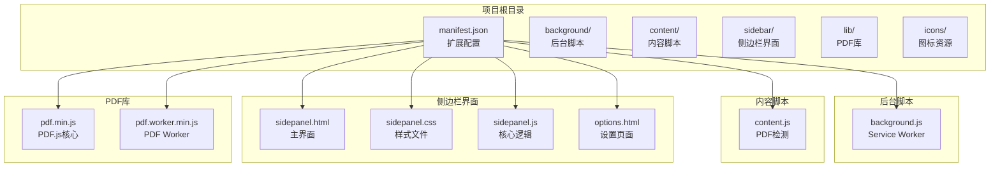

**图表来源**
- [manifest.json:1-48](file://manifest.json#L1-L48)
- [background.js:1-307](file://background/background.js#L1-L307)
- [content.js:1-36](file://content/content.js#L1-L36)
- [sidepanel.js:1-800](file://sidebar/sidepanel.js#L1-L800)

## 开发环境要求

### 硬件要求
- **处理器**: 至少Intel Core i5或同等AMD处理器
- **内存**: 8GB RAM（推荐16GB）
- **存储**: 至少500MB可用空间
- **网络**: 稳定的互联网连接（用于API调用）

### 软件要求
- **操作系统**: Windows 10+/macOS 10.15+/Linux Ubuntu 18.04+
- **Chrome浏览器**: 版本88或更高版本
- **Node.js**: 16.x或更高版本（可选，用于开发工具）
- **Git**: 2.20或更高版本

## Node.js版本要求

### 推荐版本
- **Node.js 18.x LTS** (推荐)
- **Node.js 20.x LTS** (最新稳定版)
- **Node.js 16.x** (长期支持)

### 版本兼容性
- **最低要求**: Node.js 16.0.0
- **最佳实践**: Node.js 18.17.0+ 或 20.10.0+
- **npm版本**: 8.0.0+ 或 9.0.0+

### 验证安装
```bash
# 检查Node.js版本
node --version

# 检查npm版本
npm --version

# 检查是否安装了所需版本
node -e "console.log(process.version)"
```

## Chrome浏览器配置

### 必需设置
1. **启用开发者模式**
   - 打开Chrome浏览器
   - 访问 `chrome://extensions/`
   - 开启右上角"开发者模式"

2. **允许安装第三方扩展**
   - 在扩展页面点击"加载已解压的扩展程序"
   - 选择项目根目录

### 浏览器版本要求
- **Chrome**: 88+
- **Chromium**: 88+
- **Edge**: 88+
- **Firefox**: 不支持（Chrome扩展）

### 开发者工具设置
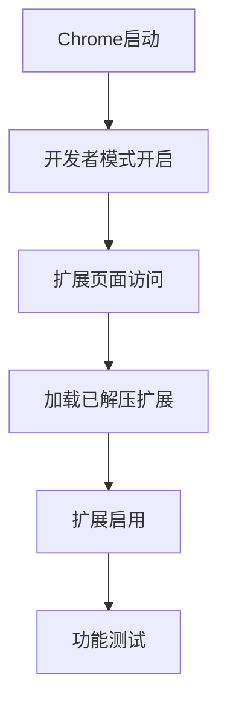

**图表来源**
- [README.md:83-89](file://README.md#L83-L89)

## Git版本控制设置

### 基础配置
```bash
# 用户信息配置
git config --global user.name "Your Name"
git config --global user.email "your.email@example.com"

# 编辑器设置
git config --global core.editor "code --wait"

# 颜色显示
git config --global color.ui auto

# 默认分支
git config --global init.defaultBranch main
```

### 项目特定配置
```bash
# 仓库初始化
git init

# 添加远程仓库
git remote add origin https://github.com/username/repository.git

# 创建开发分支
git checkout -b develop
```

### 提交规范
```bash
# 常用提交命令
git add .
git commit -m "feat: 添加新功能"
git push origin develop
```

## 项目克隆与安装

### 克隆项目
```bash
# 使用HTTPS
git clone https://github.com/username/earnings-report-extension.git

# 使用SSH
git clone git@github.com:username/earnings-report-extension.git

# 进入项目目录
cd earnings-report-extension
```

### 项目验证
```bash
# 检查文件完整性
ls -la

# 验证manifest文件
cat manifest.json

# 检查扩展结构
find . -name "*.js" | head -10
find . -name "*.html" | head -5
find . -name "*.css" | head -5
```

## 依赖包管理

### 项目依赖特点
该项目采用**纯原生JavaScript**实现，不包含传统意义上的Node.js依赖包。所有功能通过以下方式实现：

1. **PDF处理**: 使用PDF.js库（已内置于项目）
2. **扩展API**: 直接使用Chrome扩展API
3. **LLM集成**: 通过HTTP API调用外部服务

### 依赖文件结构
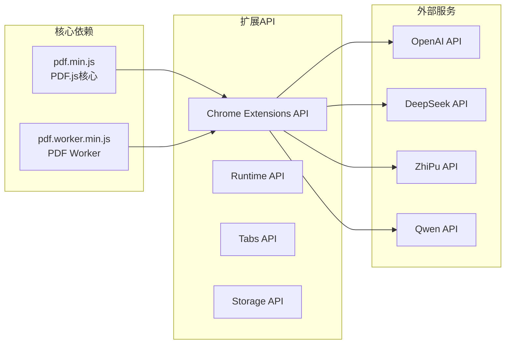

**图表来源**
- [manifest.json:22-30](file://manifest.json#L22-L30)
- [sidepanel.js:417-423](file://sidebar/sidepanel.js#L417-L423)

## 开发工具链配置

### 开发工具推荐
1. **代码编辑器**
   - VS Code (推荐)
   - WebStorm
   - Sublime Text

2. **扩展开发工具**
   - Chrome Dev Editor
   - Extensionizr

3. **调试工具**
   - Chrome DevTools
   - Firefox Developer Tools

### VS Code配置
```json
{
    "editor.tabSize": 2,
    "editor.insertSpaces": true,
    "editor.detectIndentation": true,
    "files.exclude": {
        "**/node_modules": true,
        "**/bower_components": true
    },
    "emmet.includeLanguages": {
        "javascript": "javascriptreact"
    }
}
```

## 本地调试环境设置

### 开发环境准备
```bash
# 创建开发目录
mkdir development
cd development

# 克隆项目
git clone https://github.com/username/earnings-report-extension.git
cd earnings-report-extension

# 配置开发环境
npm install -g live-server
```

### 本地服务器配置
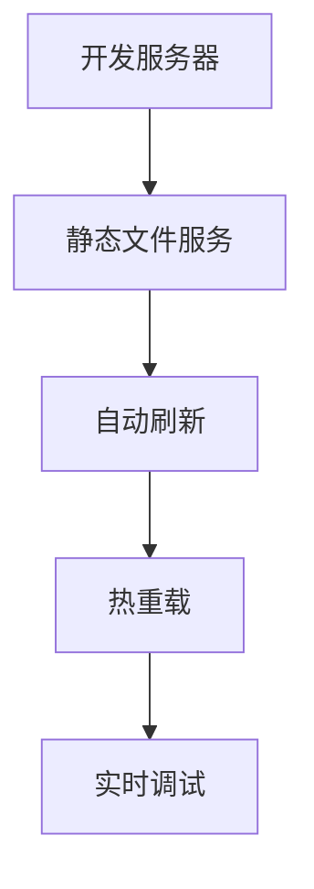

**图表来源**
- [sidepanel.js:589-607](file://sidebar/sidepanel.js#L589-L607)

## Chrome扩展开发者模式

### 启用步骤
1. **打开扩展页面**
   - 在Chrome地址栏输入 `chrome://extensions/`
   - 按Enter键访问

2. **启用开发者模式**
   - 点击右上角"开发者模式"开关
   - 界面会显示扩展ID和调试选项

3. **加载扩展**
   - 点击"加载已解压的扩展程序"
   - 选择项目根目录
   - 确认加载成功

### 扩展页面功能
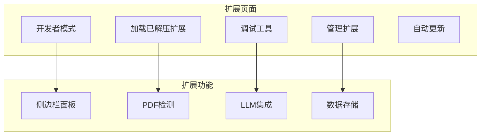

**图表来源**
- [README.md:83-89](file://README.md#L83-L89)

## 热重载配置

### 自动刷新机制
项目采用以下机制实现热重载：

1. **文件监控**
   - 监控HTML/CSS/JS文件变更
   - 自动重新加载扩展

2. **扩展更新**
   - Chrome自动检测文件变化
   - 重新加载扩展页面

3. **开发工作流**
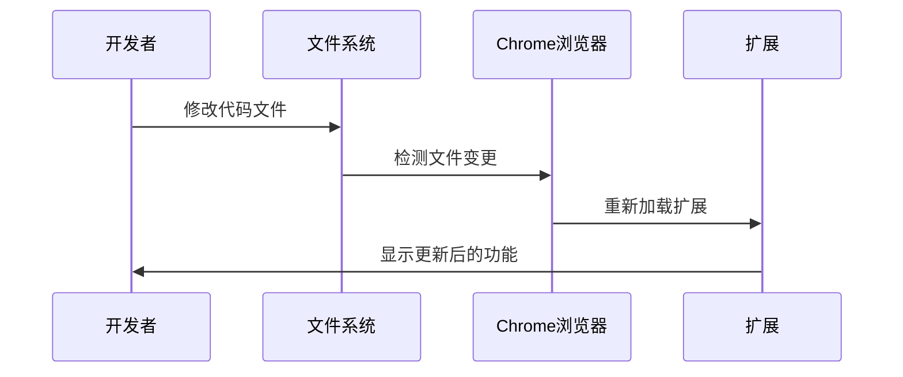

**图表来源**
- [background.js:11-19](file://background/background.js#L11-L19)
- [sidepanel.js:589-607](file://sidebar/sidepanel.js#L589-L607)

## 调试工具使用

### Chrome DevTools
1. **打开开发者工具**
   - 右键扩展图标
   - 选择"检查背景页面"

2. **调试选项卡**
   - **Elements**: HTML结构检查
   - **Console**: JavaScript控制台
   - **Sources**: 源码调试
   - **Network**: 网络请求监控
   - **Application**: 应用程序数据

### 调试技巧
```javascript
// 添加调试日志
console.log('调试信息:', variable);

// 断点调试
debugger;

// 错误捕获
try {
    // 代码逻辑
} catch (error) {
    console.error('错误:', error);
}
```

### 网络调试
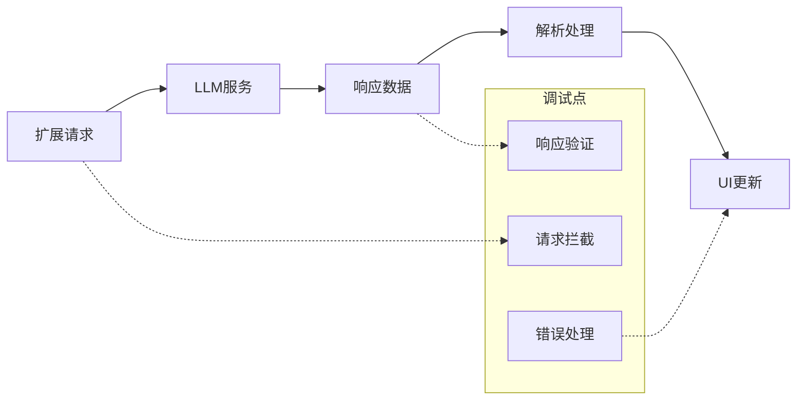

**图表来源**
- [sidepanel.js:417-423](file://sidebar/sidepanel.js#L417-L423)

## manifest.json权限配置

### 权限详解
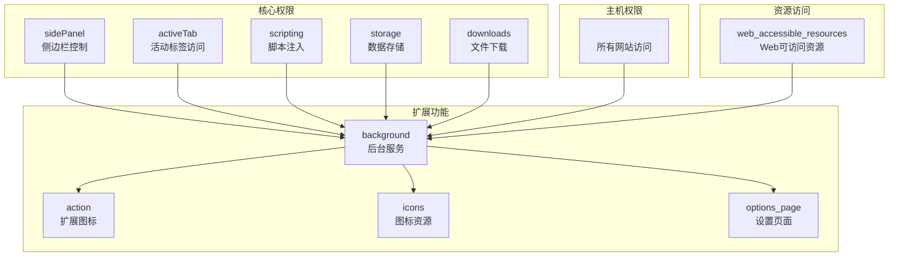

**图表来源**
- [manifest.json:6-15](file://manifest.json#L6-L15)
- [manifest.json:16-47](file://manifest.json#L16-L47)

### 权限安全考虑
1. **最小权限原则**
   - 仅授予必要权限
   - 定期审查权限使用

2. **数据保护**
   - API密钥存储在localStorage
   - 不上传敏感数据到服务器

3. **CORS限制**
   - 通过background脚本绕过限制
   - 使用代理请求处理跨域

## 安全要求说明

### 数据安全
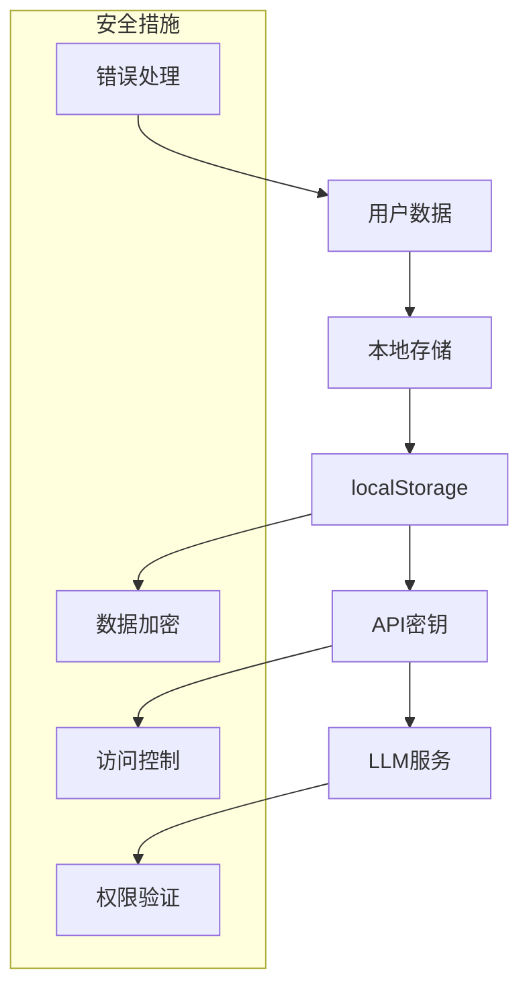

### API安全
1. **密钥管理**
   - API密钥存储在localStorage
   - 不在客户端代码中硬编码
   - 支持自定义API端点

2. **请求安全**
   - HTTPS协议
   - 请求验证
   - 错误处理

3. **隐私保护**
   - 不收集用户个人信息
   - 不上传敏感数据
   - 遵守数据保护法规

### 权限安全
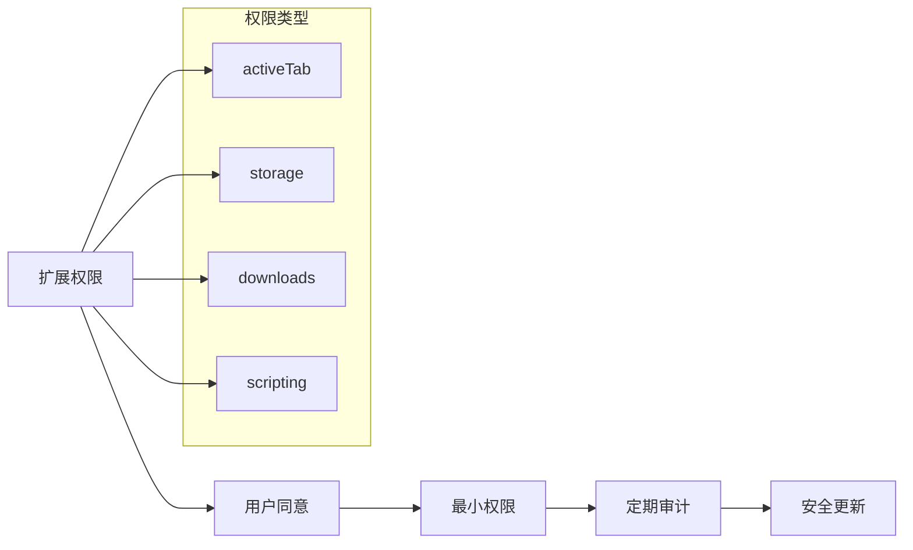

**图表来源**
- [README.md:138-142](file://README.md#L138-L142)

## 常见环境问题排查

### 扩展加载问题
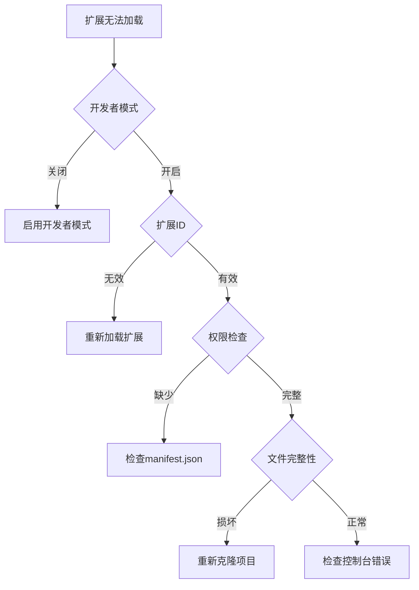

### 调试常见问题
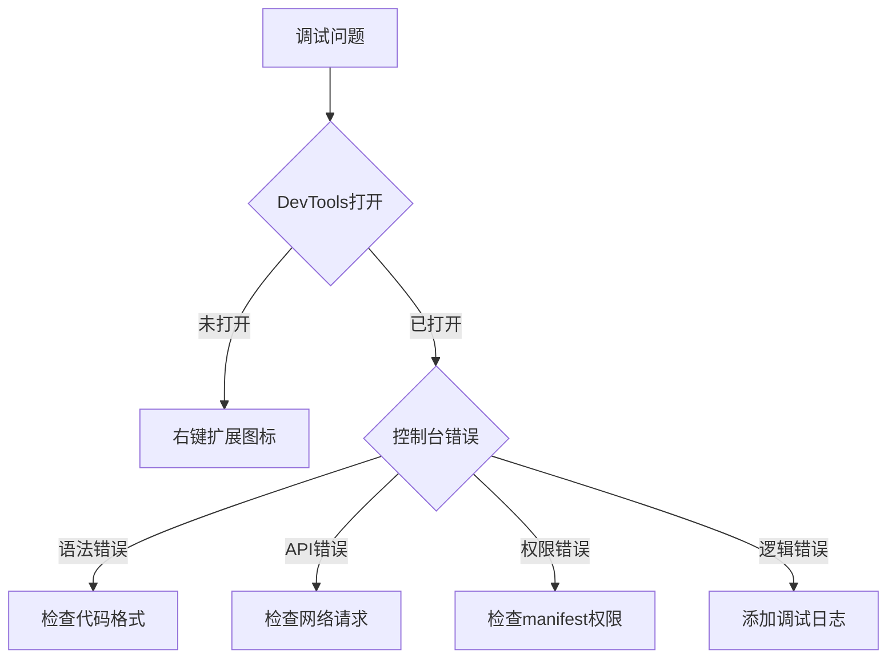

### 性能问题诊断
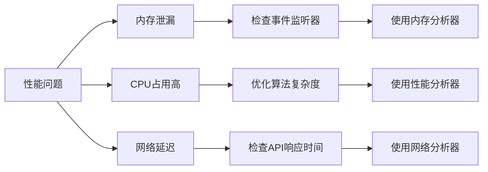

### 常见错误解决
1. **扩展未显示**
   - 检查开发者模式状态
   - 确认扩展ID正确
   - 清除浏览器缓存

2. **PDF无法解析**
   - 检查PDF.js库完整性
   - 验证PDF文件格式
   - 检查网络连接

3. **LLM API调用失败**
   - 验证API密钥
   - 检查网络连接
   - 确认API端点可用

## 性能考虑

### 代码优化
1. **文件大小优化**
   - 压缩CSS/JS文件
   - 移除未使用代码
   - 延迟加载非关键资源

2. **内存管理**
   - 及时清理事件监听器
   - 释放DOM引用
   - 避免内存泄漏

3. **网络优化**
   - 使用CDN加速
   - 实施缓存策略
   - 优化API调用频率

### 扩展性能
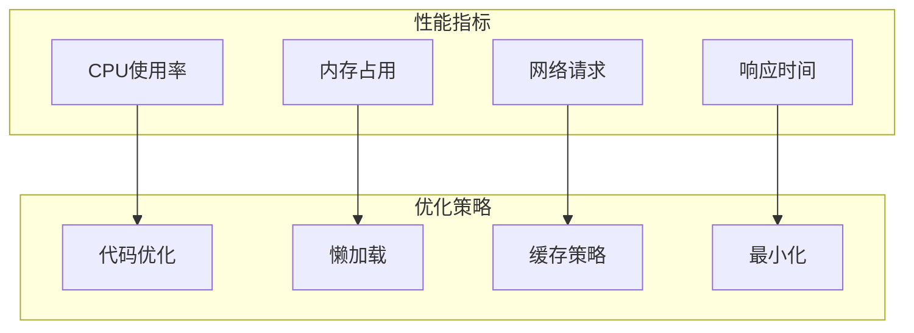

## 故障排除指南

### 开发环境故障
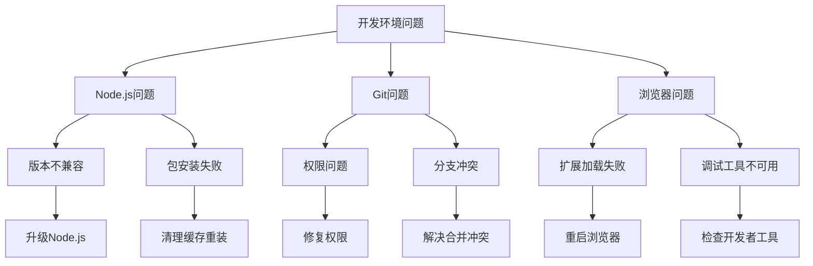

### 生产环境故障
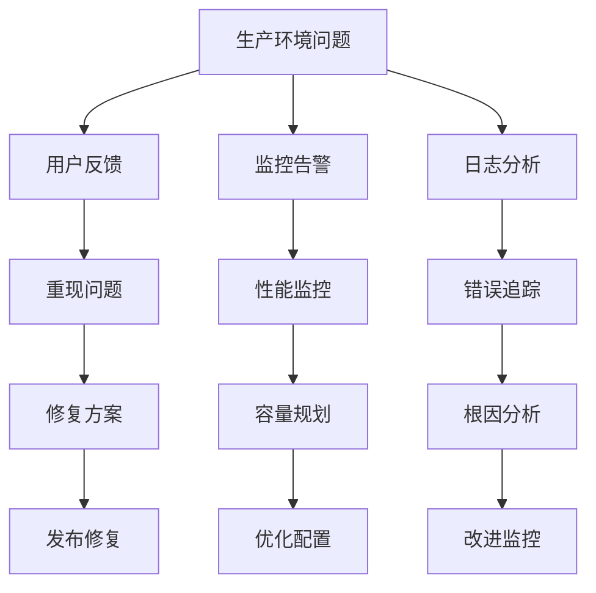

### 最佳实践
1. **预防性维护**
   - 定期更新依赖
   - 实施代码审查
   - 建立测试流程

2. **监控和告警**
   - 设置性能指标
   - 实施错误监控
   - 建立告警机制

3. **备份和恢复**
   - 定期备份代码
   - 建立恢复流程
   - 测试恢复机制

## 总结

投资助手扩展的开发环境搭建相对简单，主要特点包括：

### 关键要点
1. **零依赖架构**: 项目采用纯原生JavaScript，无需复杂的包管理
2. **Chrome扩展标准**: 遵循Manifest V3规范，确保兼容性
3. **PDF处理能力**: 内置PDF.js库，支持PDF文本提取
4. **多LLM集成**: 支持多种AI服务提供商
5. **安全设计**: 采用最小权限原则和数据保护措施

### 开发建议
1. **环境隔离**: 为不同功能模块建立独立的开发环境
2. **版本控制**: 使用Git进行版本管理，建立清晰的分支策略
3. **测试驱动**: 实施单元测试和集成测试
4. **文档维护**: 保持代码注释和文档的同步更新

### 未来扩展
1. **功能增强**: 可以添加更多投资分析功能
2. **性能优化**: 进一步优化代码性能和用户体验
3. **平台扩展**: 考虑支持其他浏览器平台
4. **社区贡献**: 建立开源贡献流程和社区支持

通过遵循本指南，开发者可以快速搭建并运行投资助手扩展的开发环境，进行功能开发和调试工作。