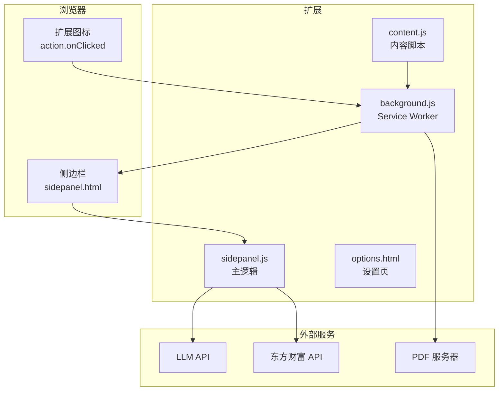
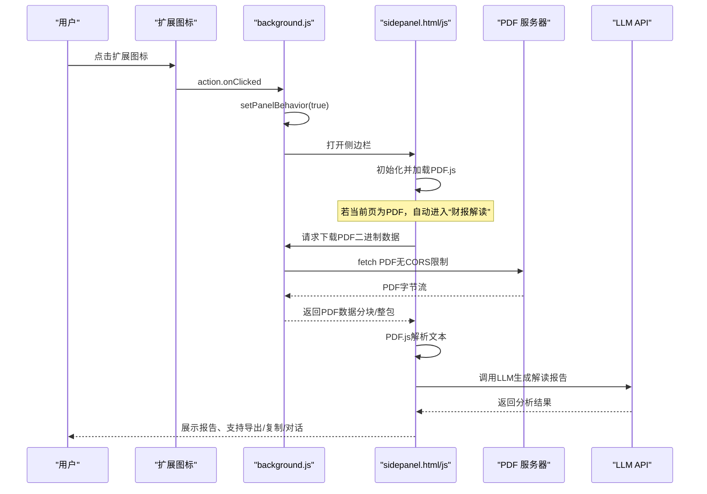
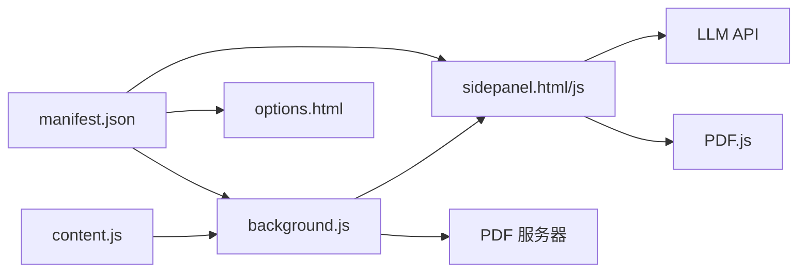

# 快速开始

<cite>
**本文引用的文件**
- [manifest.json](file://manifest.json)
- [README.md](file://README.md)
- [background/background.js](file://background/background.js)
- [content/content.js](file://content/content.js)
- [sidebar/sidepanel.html](file://sidebar/sidepanel.html)
- [sidebar/sidepanel.js](file://sidebar/sidepanel.js)
- [sidebar/options.html](file://sidebar/options.html)
- [sidebar/sidepanel.css](file://sidebar/sidepanel.css)
</cite>

## 目录
1. [简介](#简介)
2. [项目结构](#项目结构)
3. [核心组件](#核心组件)
4. [架构总览](#架构总览)
5. [详细组件分析](#详细组件分析)
6. [依赖关系分析](#依赖关系分析)
7. [性能考虑](#性能考虑)
8. [故障排除指南](#故障排除指南)
9. [结论](#结论)
10. [附录](#附录)

## 简介
本指南面向首次使用“投资助手”Chrome扩展的新用户，帮助你在5分钟内完成安装、启用开发者模式、加载扩展、打开侧边栏，并完成一次完整的使用体验（设置LLM、选股器、财报解读、AI对话）。文档同时提供常见问题与故障排除建议，确保你能顺畅上手。

## 项目结构
该扩展采用 Manifest V3 + Side Panel 架构，核心文件分布如下：
- manifest.json：扩展清单，声明权限、侧边栏路径、后台脚本、图标与选项页
- background/background.js：后台Service Worker，负责打开侧边栏、检测PDF、代理下载PDF、消息路由
- content/content.js：内容脚本，检测网页内嵌PDF并上报
- sidebar/sidepanel.html：侧边栏UI（四标签布局：热点、选股器、估值、财报解读、股票分析、对话）
- sidebar/sidepanel.js：侧边栏主逻辑（策略模板、LLM调用、PDF提取、估值计算、热点信息、对话）
- sidebar/options.html：设置页面（LLM提供商、API Key、模型、关注公司）
- sidebar/sidepanel.css：侧边栏样式

图表来源
- [manifest.json:16-18](file://manifest.json#L16-L18)
- [background/background.js:12-14](file://background/background.js#L12-L14)
- [content/content.js:12-27](file://content/content.js#L12-L27)
- [sidebar/sidepanel.js:3319-3326](file://sidebar/sidepanel.js#L3319-L3326)

章节来源
- [manifest.json:1-48](file://manifest.json#L1-L48)
- [README.md:108-126](file://README.md#L108-L126)

## 核心组件
- 侧边栏UI与交互：四标签布局，包含热点、选股器、估值、财报解读、股票分析、对话；支持纲要导航、TTS播报、导出Markdown
- 后台Service Worker：点击扩展图标即打开侧边栏；检测PDF并转发消息；代理下载PDF绕过CORS限制
- 内容脚本：检测网页内嵌PDF，辅助触发侧边栏分析
- 设置页：配置LLM提供商、API Key、模型、关注公司
- LLM集成：支持多家LLM服务商，流式输出，对话与分析一体化

章节来源
- [sidebar/sidepanel.html:32-40](file://sidebar/sidepanel.html#L32-L40)
- [sidebar/sidepanel.js:14-297](file://sidebar/sidepanel.js#L14-L297)
- [background/background.js:11-34](file://background/background.js#L11-L34)
- [content/content.js:11-35](file://content/content.js#L11-L35)
- [sidebar/options.html:46-68](file://sidebar/options.html#L46-L68)

## 架构总览
下面的序列图展示了从点击扩展图标到侧边栏打开、再到PDF检测与分析的端到端流程。

图表来源
- [background/background.js:12-14](file://background/background.js#L12-L14)
- [background/background.js:37-116](file://background/background.js#L37-L116)
- [sidebar/sidepanel.js:2613-2619](file://sidebar/sidepanel.js#L2613-L2619)
- [sidebar/sidepanel.js:2642-2676](file://sidebar/sidepanel.js#L2642-L2676)
- [sidebar/sidepanel.js:3319-3326](file://sidebar/sidepanel.js#L3319-L3326)

## 详细组件分析

### 安装与启用（5分钟上手）
- 打开浏览器访问扩展页面：chrome://extensions/
- 开启右上角“开发者模式”
- 点击“加载已解压的扩展程序”，选择扩展根目录
- 完成后，扩展图标出现在工具栏

章节来源
- [README.md:83-89](file://README.md#L83-L89)

### 首次使用：设置LLM
- 点击扩展图标，打开侧边栏
- 点击右上角“设置”按钮
- 选择LLM服务商（OpenAI/DeepSeek/智谱/通义/自定义）
- 填写API地址、API Key、模型名称
- 点击“保存设置”

章节来源
- [README.md:92-96](file://README.md#L92-L96)
- [sidebar/options.html:46-68](file://sidebar/options.html#L46-L68)
- [sidebar/sidepanel.js:609-637](file://sidebar/sidepanel.js#L609-L637)

### 选股器：选择策略与股票
- 切换到“🎯 选股器”标签
- 选择一种投资策略（格雷厄姆/巴菲特/林奇/费雪/芒格/综合）
- 在输入框中输入股票代码、名称或行业/条件描述
- 点击“🚀 开始选股分析”
- 查看分析报告，支持导出、复制、继续对话

章节来源
- [README.md:97-101](file://README.md#L97-L101)
- [sidebar/sidepanel.html:224-289](file://sidebar/sidepanel.html#L224-L289)
- [sidebar/sidepanel.js:758-844](file://sidebar/sidepanel.js#L758-L844)

### 财报解读：PDF自动检测与分析
- 在浏览器中打开一份财报PDF
- 点击扩展图标，侧边栏自动打开并开始分析
- 系统自动提取PDF文本并生成解读报告
- 支持手动粘贴文本、重新分析、导出、复制、继续对话

章节来源
- [README.md:103-106](file://README.md#L103-L106)
- [sidebar/sidepanel.html:403-440](file://sidebar/sidepanel.html#L403-L440)
- [sidebar/sidepanel.js:2613-2619](file://sidebar/sidepanel.js#L2613-L2619)
- [sidebar/sidepanel.js:2642-2676](file://sidebar/sidepanel.js#L2642-L2676)
- [sidebar/sidepanel.js:2711-2718](file://sidebar/sidepanel.js#L2711-L2718)

### AI对话：继续深入分析
- 在侧边栏“💬 对话”标签中，输入问题或点击预设问题
- 系统基于LLM回答，支持继续追问

章节来源
- [sidebar/sidepanel.html:545-562](file://sidebar/sidepanel.html#L545-L562)
- [sidebar/sidepanel.js:958-972](file://sidebar/sidepanel.js#L958-L972)

### 估值计算器：多种方法计算内在价值
- 切换到“🧮 估值”标签
- 选择股票，系统自动填充关键财务指标
- 选择估值方法（DCF/格雷厄姆/DDM/相对PE/EVA）
- 点击“🧮 计算内在价值”，查看结果与安全边际

章节来源
- [sidebar/sidepanel.html:291-371](file://sidebar/sidepanel.html#L291-L371)
- [sidebar/sidepanel.js:4061-4653](file://sidebar/sidepanel.js#L4061-L4653)

### 股票分析：投资框架综合分析
- 切换到“🔎 股票分析”标签
- 输入股票代码，点击“🚀 开始投资分析”
- 查看六大维度分析与投资策略建议

章节来源
- [sidebar/sidepanel.html:442-543](file://sidebar/sidepanel.html#L442-L543)
- [sidebar/sidepanel.js:5216-5234](file://sidebar/sidepanel.js#L5216-L5234)

## 依赖关系分析
- manifest.json声明了权限、侧边栏默认路径、后台脚本、图标与选项页
- background.js依赖host_permissions与tabs权限，负责侧边栏打开与PDF下载
- content.js检测网页内嵌PDF，辅助触发分析
- sidepanel.js依赖PDF.js库与LLM API，负责UI、策略模板、分析流程与状态管理

图表来源
- [manifest.json:6-11](file://manifest.json#L6-L11)
- [manifest.json:16-18](file://manifest.json#L16-L18)
- [background/background.js:21-34](file://background/background.js#L21-L34)
- [content/content.js:11-27](file://content/content.js#L11-L27)
- [sidebar/sidepanel.js:2567-2583](file://sidebar/sidepanel.js#L2567-L2583)

章节来源
- [manifest.json:1-48](file://manifest.json#L1-L48)
- [background/background.js:1-307](file://background/background.js#L1-L307)
- [content/content.js:1-36](file://content/content.js#L1-L36)
- [sidebar/sidepanel.js:2567-2583](file://sidebar/sidepanel.js#L2567-L2583)

## 性能考虑
- PDF下载与解析：后台绕过CORS限制，支持大文件分块传输，提升大PDF加载稳定性
- LLM调用：支持流式输出，减少等待时间
- UI渲染：侧边栏采用懒加载与分块渲染，避免长时间阻塞
- 缓存与状态：localStorage存储设置，减少重复配置

章节来源
- [background/background.js:159-177](file://background/background.js#L159-L177)
- [sidebar/sidepanel.js:3319-3326](file://sidebar/sidepanel.js#L3319-L3326)
- [sidebar/sidepanel.js:609-637](file://sidebar/sidepanel.js#L609-L637)

## 故障排除指南
- 无法打开侧边栏
  - 确认已开启“开发者模式”，并正确加载扩展
  - 点击扩展图标后，检查是否出现侧边栏
  - 若无反应，尝试刷新当前页面或重启浏览器

- PDF无法自动检测或解析
  - 若使用Chrome内置PDF查看器，请确认URL为PDF地址或包含src参数
  - 若PDF过大，后台会分块传输，稍后自动完成
  - 若文本过少或为扫描版，系统会提示并允许手动粘贴

- LLM API报错或空白
  - 检查设置页中的LLM提供商、API Key、模型名称是否正确
  - 确保网络可访问所选LLM服务
  - 若为空响应，稍后重试或更换服务商

- CORS相关错误
  - 后台已绕过CORS限制，若仍失败，检查目标PDF服务器是否允许访问

- 内容脚本未检测到PDF
  - 仅检测网页内嵌PDF，Chrome内置PDF查看器由后台检测并处理

章节来源
- [background/background.js:21-34](file://background/background.js#L21-L34)
- [background/background.js:125-177](file://background/background.js#L125-L177)
- [sidebar/sidepanel.js:2613-2619](file://sidebar/sidepanel.js#L2613-L2619)
- [sidebar/sidepanel.js:2642-2676](file://sidebar/sidepanel.js#L2642-L2676)
- [sidebar/sidepanel.js:3319-3326](file://sidebar/sidepanel.js#L3319-L3326)
- [content/content.js:11-35](file://content/content.js#L11-L35)

## 结论
通过本快速开始指南，你可以在5分钟内完成扩展安装、设置LLM、使用选股器与财报解读，并体验AI对话。遇到问题时，可参考故障排除章节逐步排查。随着使用深入，建议进一步探索估值计算器与股票分析两大功能，以获得更全面的投资决策支持。

## 附录
- 项目结构与技术栈详见README
- 设置页支持关注公司管理，便于跟踪热点与资讯

章节来源
- [README.md:108-147](file://README.md#L108-L147)