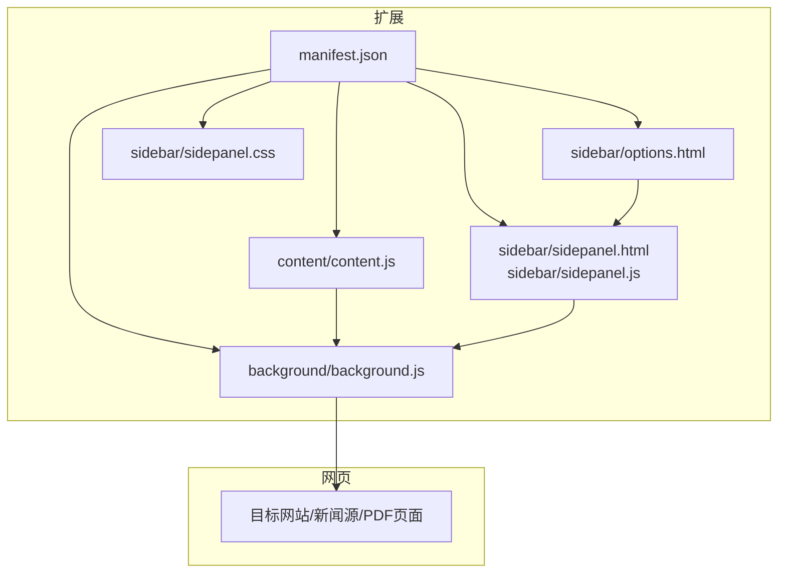
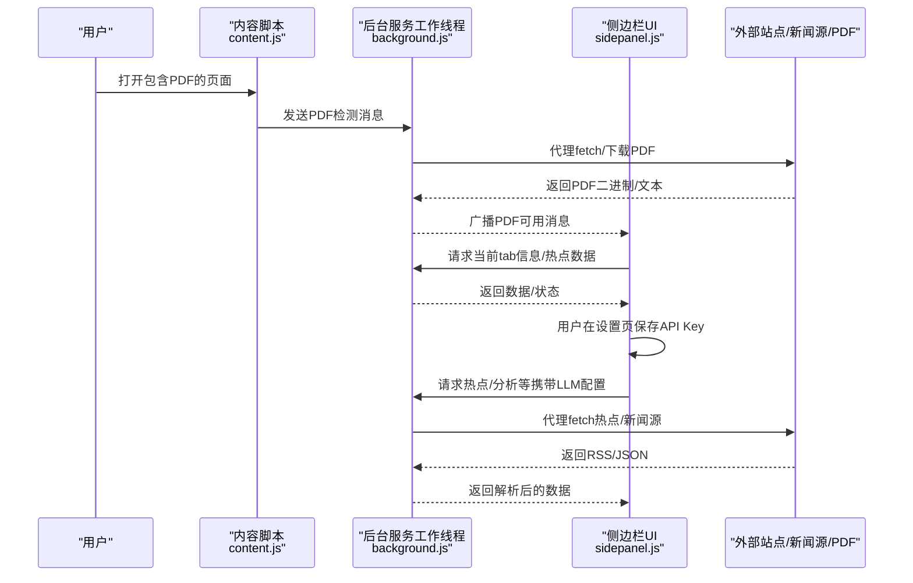
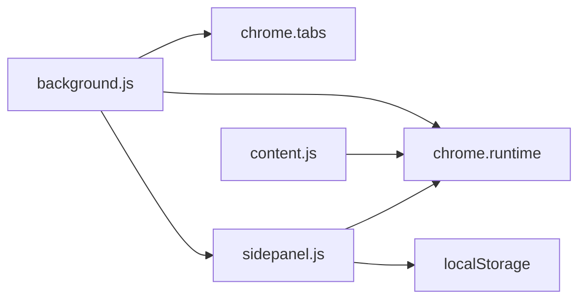

# 安全保护

<cite>
**本文引用的文件**
- [manifest.json](file://manifest.json)
- [background.js](file://background/background.js)
- [content.js](file://content/content.js)
- [sidepanel.js](file://sidebar/sidepanel.js)
- [sidepanel.html](file://sidebar/sidepanel.html)
- [options.html](file://sidebar/options.html)
- [sidepanel.css](file://sidebar/sidepanel.css)
- [README.md](file://README.md)
</cite>

## 目录
1. [简介](#简介)
2. [项目结构](#项目结构)
3. [核心组件](#核心组件)
4. [架构总览](#架构总览)
5. [详细组件分析](#详细组件分析)
6. [依赖分析](#依赖分析)
7. [性能考虑](#性能考虑)
8. [故障排查指南](#故障排查指南)
9. [结论](#结论)
10. [附录](#附录)

## 简介
本文件面向“投资助手”Chrome扩展的安全保护，围绕数据安全、隐私保护、API密钥管理、数据传输加密、本地存储安全、权限最小化、安全审计与风险评估、事件响应与数据删除机制等方面进行系统化梳理与改进建议。文档同时结合仓库现有实现，指出当前存在的安全薄弱环节，并提供可落地的加固方案。

## 项目结构
该项目采用Chrome Extension Manifest V3架构，核心模块包括：
- 扩展清单：声明权限、主机权限、侧边栏路径、后台脚本、可被网页访问的资源等
- 后台脚本：负责侧边栏打开、PDF检测与下载、消息路由、代理fetch（绕过CORS）
- 内容脚本：检测页面内嵌PDF并上报给后台
- 侧边栏界面与逻辑：包含多个功能模块（热点、选股器、估值、财报解读、股票分析、对话、设置等），并持久化用户设置
- 设置页面：用于配置LLM提供商、API地址、API Key、模型等

图表来源
- [manifest.json:1-48](file://manifest.json#L1-L48)
- [background.js:1-307](file://background/background.js#L1-L307)
- [content.js:1-36](file://content/content.js#L1-L36)
- [sidepanel.js:1-800](file://sidebar/sidepanel.js#L1-L800)
- [sidepanel.html:1-646](file://sidebar/sidepanel.html#L1-L646)
- [options.html:1-124](file://sidebar/options.html#L1-L124)
- [sidepanel.css:1-800](file://sidebar/sidepanel.css#L1-L800)

章节来源
- [manifest.json:1-48](file://manifest.json#L1-L48)
- [README.md:108-126](file://README.md#L108-L126)

## 核心组件
- 清单与权限
  - 权限：sidePanel、activeTab、scripting、storage、downloads
  - 主机权限：<all_urls>
  - Web可访问资源：PDF.js库
- 后台服务工作线程
  - 侧边栏打开、PDF检测、PDF二进制下载、消息路由、代理fetch
- 内容脚本
  - 检测页面内嵌PDF并上报
- 侧边栏UI与逻辑
  - 多模块界面、状态管理、设置持久化、事件绑定
- 设置页面
  - LLM提供商、API地址、API Key、模型配置

章节来源
- [manifest.json:6-30](file://manifest.json#L6-L30)
- [background.js:11-117](file://background/background.js#L11-L117)
- [content.js:11-35](file://content/content.js#L11-L35)
- [sidepanel.js:516-584](file://sidebar/sidepanel.js#L516-L584)
- [options.html:46-120](file://sidebar/options.html#L46-L120)

## 架构总览
下图展示了扩展在浏览器中的运行时交互：内容脚本检测PDF，后台服务工作线程负责下载与代理fetch，侧边栏通过消息与后台通信，设置页面持久化用户配置。

图表来源
- [content.js:11-27](file://content/content.js#L11-L27)
- [background.js:21-117](file://background/background.js#L21-L117)
- [sidepanel.js:591-607](file://sidebar/sidepanel.js#L591-L607)
- [options.html:82-120](file://sidebar/options.html#L82-L120)

## 详细组件分析

### API密钥管理
- 当前实现
  - API Key通过设置页面保存至localStorage，未加密存储
  - 侧边栏状态对象包含provider、baseUrl、apiKey、model等字段
  - README强调API Key仅本地存储，不上传到服务器
- 风险与建议
  - 风险：localStorage明文存储，易被XSS或恶意扩展读取；若用户设备被入侵，API Key泄露导致滥用与计费损失
  - 建议：
    - 使用浏览器密钥链API（如chrome.declarativeNetRequest或受支持的加密存储API）进行密钥加密存储
    - 若无专用API，采用对称加密（如Web Crypto API）对localStorage中的API Key进行加密，密钥由用户口令派生（PBKDF2 + HKDF），并配合一次性口令或生物识别解锁
    - 实施密钥轮换：允许用户更新API Key而不丢失其他设置；后台在读取时校验有效性，失败则提示重新配置
    - 传输加密：确保所有对外请求均走HTTPS，拒绝HTTP回退
    - 最小暴露：仅在必要时将API Key注入到需要的请求中，避免全局可见

章节来源
- [sidepanel.js:529-534](file://sidebar/sidepanel.js#L529-L534)
- [options.html:82-120](file://sidebar/options.html#L82-L120)
- [README.md:140-141](file://README.md#L140-L141)

### 数据传输加密
- 当前实现
  - 后台代理fetch支持自定义headers与POST body，但未强制HTTPS校验
  - 设置页面允许自定义API Base URL（含HTTP）
- 风险与建议
  - 风险：若Base URL为HTTP，或外部站点返回混合内容，可能导致中间人攻击、证书链不被信任
  - 建议：
    - 默认仅允许HTTPS Base URL；若用户输入HTTP，弹出警告并阻止请求
    - 强制TLS版本与套件白名单（如TLS 1.2+，禁用过时算法）
    - 对外部站点返回的证书进行严格校验，拒绝自签名或不受信CA
    - 对RSS/JSON解析前进行长度与类型校验，防止超大响应导致内存耗尽

章节来源
- [background.js:65-116](file://background/background.js#L65-L116)
- [options.html:55-58](file://sidebar/options.html#L55-L58)

### 本地存储安全
- 当前实现
  - 设置保存在localStorage，键名为er_settings
  - 侧边栏状态对象包含大量运行时数据（PDF文本、报告、聊天历史、热点数据等）
- 风险与建议
  - 风险：localStorage未加密，可能被XSS或恶意脚本读取；敏感数据（API Key、聊天历史）与非敏感数据混存
  - 建议：
    - 敏感数据与非敏感数据分离存储：API Key单独加密存储；聊天历史与分析缓存可明文但限定生命周期
    - 实施最小化存储：仅保留必要的短期数据；定期清理过期热点、分析缓存
    - 存储权限控制：避免将敏感数据写入跨域可访问的存储；必要时使用扩展私有存储
    - 数据清理策略：提供“清除所有数据”按钮，删除localStorage、IndexedDB（如有）、缓存目录

章节来源
- [sidepanel.js:609-637](file://sidebar/sidepanel.js#L609-L637)
- [sidepanel.js:516-584](file://sidebar/sidepanel.js#L516-L584)

### 隐私保护政策
- 当前实现
  - README声明：API Key仅本地存储，不上传到服务器；数据隐私：财报文本和选股请求仅发送到配置的LLM API
- 建议补充
  - 明确用户数据处理原则：最小化收集、透明度、用户同意、可撤销授权
  - 第三方服务集成安全：对LLM提供商进行供应商审计，明确数据共享限制与合规要求（如GDPR/CCPA）
  - Chrome扩展权限最小化：当前清单包含<all_urls>与storage等权限，建议逐步收敛至最小必要范围（如仅对特定域名开放）

章节来源
- [README.md:140-142](file://README.md#L140-L142)
- [manifest.json:6-15](file://manifest.json#L6-L15)

### XSS与CSRF防护
- XSS
  - 风险：侧边栏HTML拼接、Markdown渲染、RSS/JSON解析可能引入XSS
  - 建议：对所有用户输入与外部数据进行严格的HTML转义与白名单过滤；使用DOMPurify等库净化HTML；避免innerHTML直接拼接
- CSRF
  - 风险：后台代理fetch未使用CSRF令牌或Origin校验
  - 建议：对来自扩展的消息通道增加CSRF令牌校验；仅允许来自扩展的消息触发fetch；对跨域请求进行Origin/Referer校验

章节来源
- [background.js:192-251](file://background/background.js#L192-L251)
- [sidepanel.js:301-405](file://sidebar/sidepanel.js#L301-L405)

### API滥用防护
- 风险：LLM调用可能被滥用，导致高额计费
- 建议：
  - 速率限制：对LLM请求进行限频（如每分钟请求数）
  - 金额上限：在设置中允许用户设定月度预算，超出则阻断请求
  - 请求审计：记录每次请求的摘要（模型、时间、字符数），便于审计与复核

章节来源
- [sidepanel.js:529-534](file://sidebar/sidepanel.js#L529-L534)
- [options.html:46-68](file://sidebar/options.html#L46-L68)

### 安全配置检查点
- 清单权限
  - 是否仅授予必要权限（sidePanel、activeTab、scripting、storage、downloads）
  - 是否避免使用<all_urls>或限制到最小范围
- 传输安全
  - 是否仅允许HTTPS Base URL
  - 是否强制TLS版本与套件
- 存储安全
  - API Key是否加密存储
  - 是否区分敏感与非敏感数据
- 输入与输出
  - 是否对所有外部数据进行净化与长度限制
  - 是否对RSS/JSON解析进行健壮性检查

章节来源
- [manifest.json:6-15](file://manifest.json#L6-L15)
- [background.js:65-116](file://background/background.js#L65-L116)
- [sidepanel.js:529-534](file://sidebar/sidepanel.js#L529-L534)

### 漏洞扫描与修复建议
- 建议使用静态分析工具（ESLint、SonarQube）与依赖扫描（npm audit）识别潜在漏洞
- 动态测试：对XSS、CSRF、API滥用进行渗透测试
- 修复优先级：高危（XSS/CSRF/API滥用）> 中危（证书校验不足）> 低危（权限过大）

章节来源
- [background.js:192-251](file://background/background.js#L192-L251)
- [sidepanel.js:301-405](file://sidebar/sidepanel.js#L301-L405)

### 安全事件响应流程
- 事件识别：监控异常请求、错误日志、用户举报
- 事件分级：轻微（数据泄露风险低）、严重（API Key泄露、大规模滥用）
- 处置步骤：
  - 立即：冻结受影响的API Key，通知用户，限制请求
  - 调查：回溯日志、定位漏洞、评估影响范围
  - 修复：发布热修复版本，强制HTTPS、加密存储、权限收敛
  - 通告：向用户公开事件与补救措施
- 预防：建立自动化告警与回归测试

章节来源
- [sidepanel.js:529-534](file://sidebar/sidepanel.js#L529-L534)
- [background.js:65-116](file://background/background.js#L65-L116)

### 用户数据删除机制
- 删除范围：localStorage中的er_settings、侧边栏状态中的敏感数据（聊天历史、PDF文本、分析缓存）
- 触发方式：提供“清除所有数据”按钮，点击后执行：
  - 清空localStorage.er_settings
  - 重置sidepanel状态对象中的敏感字段
  - 清理临时缓存（如有）
- 可选：提供“导出/备份”功能，允许用户自行备份设置

章节来源
- [sidepanel.js:609-637](file://sidebar/sidepanel.js#L609-L637)
- [sidepanel.js:516-584](file://sidebar/sidepanel.js#L516-L584)

## 依赖分析
- 外部依赖
  - PDF.js：本地打包，用于PDF文本提取
  - LLM API：OpenAI兼容接口，支持多种提供商
- 内部依赖
  - sidepanel.js依赖localStorage与扩展消息通道
  - background.js依赖chrome APIs（tabs、runtime、sidePanel）
  - content.js依赖chrome.runtime与DOM API

图表来源
- [background.js:1-307](file://background/background.js#L1-L307)
- [content.js:1-36](file://content/content.js#L1-L36)
- [sidepanel.js:591-607](file://sidebar/sidepanel.js#L591-L607)

章节来源
- [manifest.json:22-30](file://manifest.json#L22-L30)
- [README.md:132-136](file://README.md#L132-L136)

## 性能考虑
- PDF下载与分块传输：对大文件进行分块传输，避免消息传递过大
- RSS解析：对XML/JSON进行类型判断与长度限制，防止内存溢出
- 缓存策略：对热点数据与分析结果设置合理的缓存与失效时间

章节来源
- [background.js:125-177](file://background/background.js#L125-L177)
- [background.js:192-251](file://background/background.js#L192-L251)

## 故障排查指南
- API Key无效
  - 检查设置页面是否保存成功
  - 确认Base URL为HTTPS
  - 查看控制台错误与网络请求
- PDF无法解析
  - 确认PDF URL有效且可访问
  - 检查Content-Type是否为application/pdf
  - 查看后台日志与错误提示
- 热点/新闻源无法加载
  - 检查网络连接与外部站点可用性
  - 确认RSS/JSON格式正确
  - 查看代理fetch返回的状态码与错误信息

章节来源
- [options.html:102-120](file://sidebar/options.html#L102-L120)
- [background.js:125-177](file://background/background.js#L125-L177)
- [background.js:65-116](file://background/background.js#L65-L116)

## 结论
本扩展在功能上较为完整，但在数据安全与隐私保护方面存在明显改进空间。建议优先实施API Key加密存储、HTTPS强制与证书校验、敏感数据隔离与清理策略，并收敛扩展权限至最小范围。同时建立完善的审计与事件响应机制，保障用户数据与资金安全。

## 附录
- 安全审计清单
  - 清单权限是否最小化
  - API Key是否加密存储
  - 是否强制HTTPS与证书校验
  - 是否对所有外部数据进行净化与长度限制
  - 是否具备用户数据删除机制
  - 是否具备API滥用防护与限额
  - 是否具备事件响应流程与通告机制

章节来源
- [manifest.json:6-15](file://manifest.json#L6-L15)
- [sidepanel.js:529-534](file://sidebar/sidepanel.js#L529-L534)
- [background.js:65-116](file://background/background.js#L65-L116)
- [options.html:46-68](file://sidebar/options.html#L46-L68)