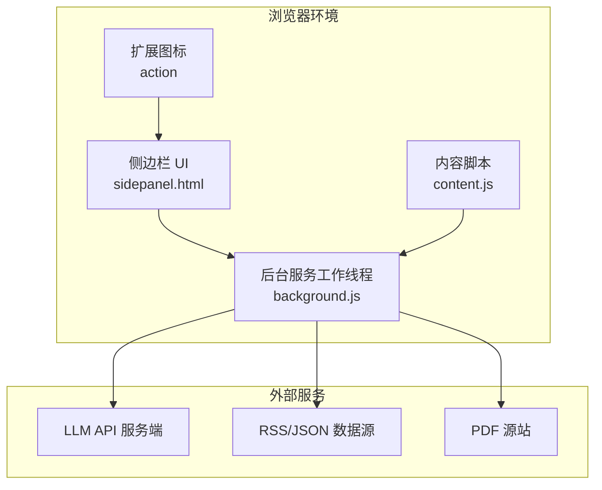
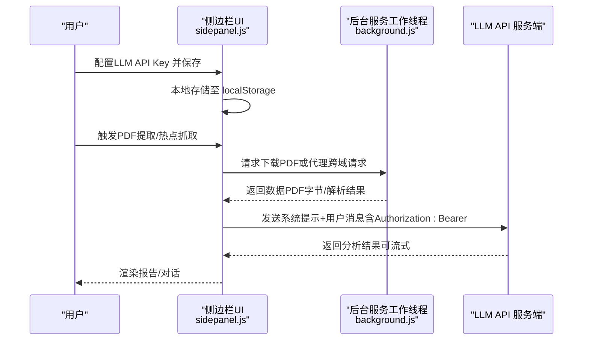
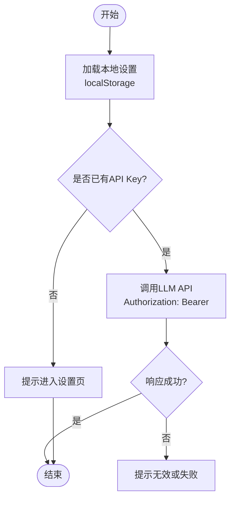
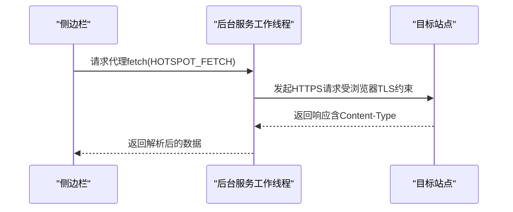
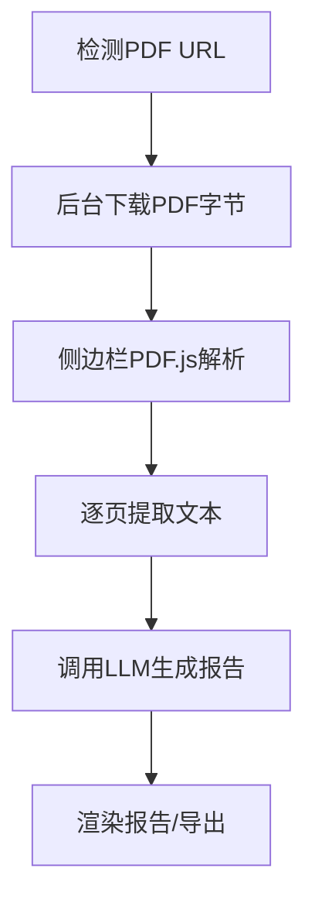
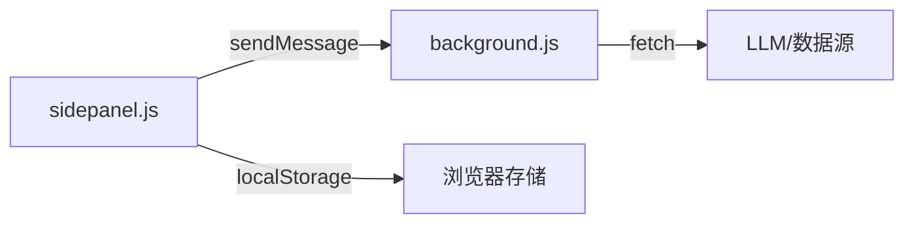

# 数据安全

<cite>
**本文引用的文件**   
- [manifest.json](file://manifest.json)
- [background.js](file://background/background.js)
- [content.js](file://content/content.js)
- [sidepanel.js](file://sidebar/sidepanel.js)
- [sidepanel.html](file://sidebar/sidepanel.html)
- [options.html](file://sidebar/options.html)
- [README.md](file://README.md)
</cite>

## 目录
1. [简介](#简介)
2. [项目结构](#项目结构)
3. [核心组件](#核心组件)
4. [架构总览](#架构总览)
5. [详细组件分析](#详细组件分析)
6. [依赖分析](#依赖分析)
7. [性能考量](#性能考量)
8. [故障排查指南](#故障排查指南)
9. [结论](#结论)
10. [附录](#附录)

## 简介
本文件面向“数据安全”主题，围绕该Chrome扩展在API密钥管理、数据传输安全、本地存储安全、PDF数据处理与用户输入验证等方面的实际实现进行系统化梳理与改进建议。文档同时结合扩展的Manifest V3、Service Worker、内容脚本与侧边栏UI的交互，给出可落地的安全配置示例与最佳实践。

## 项目结构
该项目采用Manifest V3标准，包含后台服务工作线程(background)、内容脚本(content)、侧边栏UI与本地PDF.js库。整体数据流从用户触发开始，经由侧边栏收集敏感配置，通过后台服务工作线程发起跨域请求与PDF下载，最终在侧边栏渲染并输出分析结果。

图表来源
- [manifest.json:1-48](file://manifest.json#L1-L48)
- [background.js:1-117](file://background/background.js#L1-L117)
- [content.js:1-36](file://content/content.js#L1-L36)
- [sidepanel.js:3360-3425](file://sidebar/sidepanel.js#L3360-L3425)

章节来源
- [manifest.json:1-48](file://manifest.json#L1-L48)
- [background.js:1-117](file://background/background.js#L1-L117)
- [content.js:1-36](file://content/content.js#L1-L36)
- [sidepanel.js:3360-3425](file://sidebar/sidepanel.js#L3360-L3425)

## 核心组件
- 后台服务工作线程：负责侧边栏打开、PDF检测与下载、跨域数据抓取、消息路由与RSS/XML解析。
- 内容脚本：检测普通网页中的嵌入式PDF并上报后台。
- 侧边栏UI：负责LLM配置、热点抓取、PDF提取与分析、对话、导出等功能；敏感配置通过localStorage持久化。
- PDF.js：本地打包，用于在侧边栏解析PDF文本。

章节来源
- [background.js:1-177](file://background/background.js#L1-L177)
- [content.js:1-36](file://content/content.js#L1-L36)
- [sidepanel.js:2565-2697](file://sidebar/sidepanel.js#L2565-L2697)
- [sidepanel.html:1-646](file://sidebar/sidepanel.html#L1-L646)

## 架构总览
下图展示了从用户触发到LLM分析的关键交互路径，以及敏感数据在何处被使用与传输。

图表来源
- [sidepanel.js:609-637](file://sidebar/sidepanel.js#L609-L637)
- [sidepanel.js:3360-3425](file://sidebar/sidepanel.js#L3360-L3425)
- [background.js:37-117](file://background/background.js#L37-L117)

## 详细组件分析

### API密钥管理策略
- 存储位置与可见性
  - 侧边栏设置页面与选项页均使用localStorage保存LLM配置（包含API Key）。该配置在扩展内部可见，不上传至任何服务器。
  - 侧边栏在首次使用或检测到未配置时会引导用户进入设置页。
- 访问令牌管理
  - 调用LLM API时，通过Authorization头携带Bearer Token，遵循OpenAI兼容接口约定。
- 密钥轮换机制
  - 当前实现未内置密钥轮换逻辑。建议在设置页增加“切换密钥/批量轮换”的交互，并在切换时校验有效性后再写入localStorage。

图表来源
- [sidepanel.js:609-637](file://sidebar/sidepanel.js#L609-L637)
- [sidepanel.js:3360-3425](file://sidebar/sidepanel.js#L3360-L3425)
- [options.html:82-121](file://sidebar/options.html#L82-L121)

章节来源
- [sidepanel.js:609-637](file://sidebar/sidepanel.js#L609-L637)
- [sidepanel.js:3360-3425](file://sidebar/sidepanel.js#L3360-L3425)
- [options.html:82-121](file://sidebar/options.html#L82-L121)
- [README.md:140-141](file://README.md#L140-L141)

### 数据传输安全
- HTTPS与TLS
  - LLM调用通过HTTPS POST至配置的baseUrl，遵循浏览器默认的TLS校验。
- 防止中间人攻击
  - 由于扩展未实现自定义证书校验或SNI/OCSP校验，建议：
    - 仅使用官方/可信提供商的HTTPS域名；
    - 在设置页对baseUrl进行白名单校验；
    - 对响应进行严格的状态码与内容类型校验。
- CORS与跨域
  - 后台服务工作线程具备host_permissions，可绕过CORS限制直接fetch任意URL；侧边栏通过chrome.runtime.sendMessage转发请求，避免前端直连跨域。

图表来源
- [background.js:64-117](file://background/background.js#L64-L117)

章节来源
- [background.js:64-117](file://background/background.js#L64-L117)
- [sidepanel.js:3360-3425](file://sidebar/sidepanel.js#L3360-L3425)

### 本地存储安全实践
- 敏感数据隔离
  - API Key与设置仅保存在localStorage中，扩展未将其上传至任何服务器。
- 存储权限控制
  - Manifest V3下扩展通过权限声明获得storage与downloads等能力；建议仅授予必要权限，避免过度授权。
- 定期清理与销毁
  - 当前未实现自动清理机制。建议：
    - 提供“清除设置/密钥”的一键操作；
    - 在设置页增加“过期提醒/轮换提醒”；
    - 对localStorage中的敏感字段设置有效期与失效策略。

章节来源
- [manifest.json:6-12](file://manifest.json#L6-L12)
- [sidepanel.js:609-637](file://sidebar/sidepanel.js#L609-L637)
- [README.md:140-141](file://README.md#L140-L141)

### PDF数据处理过程中的安全防护
- PDF检测与下载
  - 后台服务工作线程检测PDF URL并下载二进制数据；对chrome://pdf-viewer类型的URL进行src参数解析，避免重复下载。
- 解析与文本提取
  - 侧边栏加载本地PDF.js，逐页提取文本并拼接；对极小文本量（<50字符）提示可能是扫描版PDF。
- 传输与渲染
  - PDF字节在扩展内部传输，不离开浏览器；最终在侧边栏渲染为Markdown报告。

图表来源
- [background.js:21-34](file://background/background.js#L21-L34)
- [background.js:125-177](file://background/background.js#L125-L177)
- [sidepanel.js:2587-2697](file://sidebar/sidepanel.js#L2587-L2697)

章节来源
- [background.js:21-34](file://background/background.js#L21-L34)
- [background.js:125-177](file://background/background.js#L125-L177)
- [sidepanel.js:2587-2697](file://sidebar/sidepanel.js#L2587-L2697)

### 用户输入数据的验证与清理
- 输入来源
  - 股票代码/名称搜索、热点关键词过滤、手动粘贴PDF文本等。
- 现状
  - 侧边栏对输入进行基础长度与格式判断；热点关键词过滤在前端进行拼接与匹配。
- 建议
  - 对用户输入进行最小化白名单校验（如股票代码仅允许数字/字母）；
  - 对粘贴文本进行长度截断与HTML/JS清洗；
  - 对RSS/JSON URL进行来源白名单与协议校验。

章节来源
- [sidepanel.js:1619-1626](file://sidebar/sidepanel.js#L1619-L1626)
- [sidepanel.js:2699-2717](file://sidebar/sidepanel.js#L2699-L2717)

### Chrome扩展特有的安全考虑与限制
- Manifest V3权限模型
  - 仅声明必要权限（storage、downloads、sidePanel、activeTab、scripting等），避免过度授权。
- 内容脚本限制
  - 无法注入Chrome内置PDF查看器（chrome://pdf-viewer），因此PDF下载与解析由后台与侧边栏协作完成。
- 消息通道
  - 通过chrome.runtime.sendMessage建立受信任的消息通道，避免直接跨域调用。

章节来源
- [manifest.json:6-12](file://manifest.json#L6-L12)
- [content.js:1-36](file://content/content.js#L1-L36)
- [background.js:37-117](file://background/background.js#L37-L117)

## 依赖分析
- 组件耦合
  - 侧边栏与后台通过chrome.runtime消息通信耦合；后台与外部API/数据源松耦合。
- 外部依赖
  - PDF.js本地打包，减少运行时网络依赖。
- 潜在风险
  - 若localStorage被恶意扩展读取，API Key可能泄露；建议引入扩展间沙箱与最小权限原则。

图表来源
- [sidepanel.js:3360-3425](file://sidebar/sidepanel.js#L3360-L3425)
- [background.js:64-117](file://background/background.js#L64-L117)

章节来源
- [sidepanel.js:3360-3425](file://sidebar/sidepanel.js#L3360-L3425)
- [background.js:64-117](file://background/background.js#L64-L117)

## 性能考量
- PDF分块传输：后台对大体积PDF进行分块传输，降低消息传递开销。
- 流式渲染：LLM流式响应在前端逐步渲染，提升交互体验。
- 缓存与去抖：热点抓取与搜索输入使用定时器去抖，减少重复请求。

章节来源
- [background.js:159-177](file://background/background.js#L159-L177)
- [sidepanel.js:3386-3452](file://sidebar/sidepanel.js#L3386-L3452)

## 故障排查指南
- API Key无效/401
  - 侧边栏在调用LLM失败时会提示并引导进入设置页；检查baseUrl/model配置与网络连通性。
- PDF提取失败
  - 检查PDF URL是否可访问、Content-Type是否为PDF或octet-stream；若为chrome://pdf-viewer，确认src参数解析成功。
- 跨域请求失败
  - 后台服务工作线程通过host_permissions绕过CORS限制；若仍失败，检查目标站点CORS策略与浏览器网络日志。

章节来源
- [sidepanel.js:3343-3357](file://sidebar/sidepanel.js#L3343-L3357)
- [background.js:125-177](file://background/background.js#L125-L177)
- [background.js:64-117](file://background/background.js#L64-L117)

## 结论
该扩展在数据安全方面已具备基础实践：敏感配置本地存储、HTTPS调用、最小权限授权与消息通道隔离。为进一步强化安全，建议引入密钥轮换、来源白名单校验、输入清洗与定期清理机制，并在设置页提供更明确的安全提示与审计能力。

## 附录

### 安全配置示例与最佳实践
- API密钥管理
  - 在设置页提供“切换/轮换”按钮，切换前先校验新Key的有效性。
  - 对localStorage中的敏感字段设置过期时间与失效策略。
- 数据传输
  - 仅允许HTTPS；对baseUrl进行白名单校验；对响应状态码与Content-Type进行严格校验。
- 本地存储
  - 提供“清除设置/密钥”一键操作；对敏感字段进行最小化暴露。
- PDF处理
  - 对极小文本量进行提示；对URL进行来源与协议校验；对大文件采用分块传输。
- 用户输入
  - 对搜索/粘贴输入进行白名单与长度限制；对RSS/JSON URL进行来源校验。

章节来源
- [sidepanel.js:609-637](file://sidebar/sidepanel.js#L609-L637)
- [sidepanel.js:3360-3425](file://sidebar/sidepanel.js#L3360-L3425)
- [background.js:125-177](file://background/background.js#L125-L177)