# 隐私保护与合规

<cite>
**本文档引用的文件**
- [manifest.json](file://manifest.json)
- [background.js](file://background/background.js)
- [content.js](file://content/content.js)
- [sidepanel.js](file://sidebar/sidepanel.js)
- [sidepanel.html](file://sidebar/sidepanel.html)
- [options.html](file://sidebar/options.html)
- [README.md](file://README.md)
</cite>

## 目录
1. [简介](#简介)
2. [项目结构](#项目结构)
3. [核心组件](#核心组件)
4. [架构概览](#架构概览)
5. [详细组件分析](#详细组件分析)
6. [依赖分析](#依赖分析)
7. [性能考虑](#性能考虑)
8. [隐私保护实践](#隐私保护实践)
9. [合规要求与实施](#合规要求与实施)
10. [故障排除指南](#故障排除指南)
11. [结论](#结论)

## 简介

本文件为"投资助手"Chrome扩展的隐私保护与合规要求详细文档。该项目是一个集成了价值投资策略分析、财报解读、AI对话等功能的浏览器扩展，需要严格遵守现代隐私保护法规，特别是GDPR和CCPA的要求。

该扩展通过Manifest V3标准实现，包含背景服务、内容脚本和侧边栏界面三个主要组件，专注于为用户提供投资决策辅助功能。

## 项目结构

项目采用模块化架构设计，包含以下核心目录和文件：

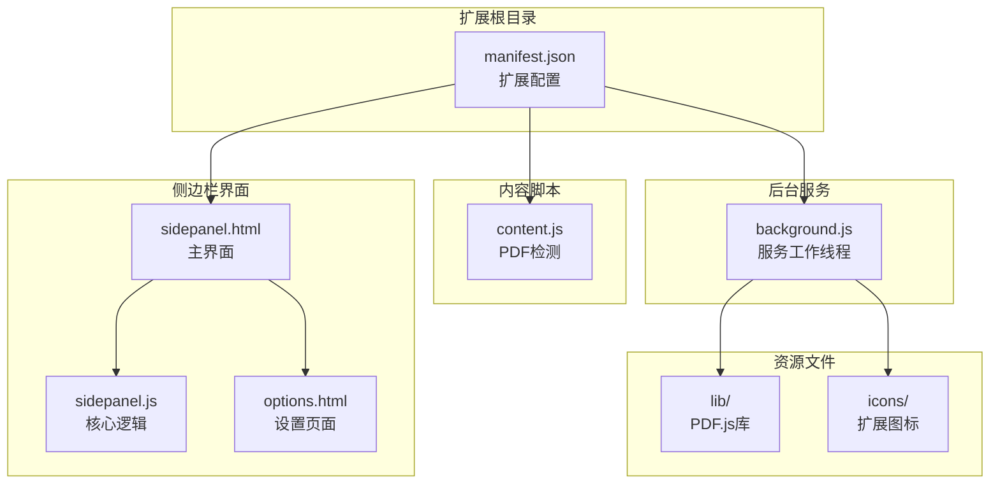

**图表来源**
- [manifest.json:1-48](file://manifest.json#L1-L48)
- [background.js:1-307](file://background/background.js#L1-L307)
- [content.js:1-36](file://content/content.js#L1-L36)
- [sidepanel.html:1-646](file://sidebar/sidepanel.html#L1-L646)

**章节来源**
- [manifest.json:1-48](file://manifest.json#L1-L48)
- [README.md:108-126](file://README.md#L108-L126)

## 核心组件

### 权限管理系统

扩展采用最小权限原则，仅申请必要的浏览器权限：

| 权限类型 | 权限名称 | 使用场景 | 最小化程度 |
|---------|---------|---------|-----------|
| 基础权限 | sidePanel | 控制侧边栏显示 | ✅ 完全必要 |
| 基础权限 | activeTab | 访问当前活动标签页 | ✅ 完全必要 |
| 基础权限 | scripting | 注入脚本到页面 | ✅ 完全必要 |
| 基础权限 | storage | 本地存储设置 | ✅ 完全必要 |
| 基础权限 | downloads | 下载PDF文件 | ✅ 完全必要 |
| 主机权限 | <all_urls> | 访问任意网站 | ⚠️ 需要审查 |

### 数据流架构

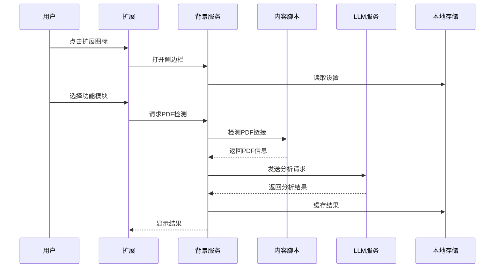

**图表来源**
- [background.js:11-34](file://background/background.js#L11-L34)
- [content.js:11-28](file://content/content.js#L11-L28)
- [sidepanel.js:589-607](file://sidebar/sidepanel.js#L589-L607)

**章节来源**
- [manifest.json:6-15](file://manifest.json#L6-L15)
- [background.js:11-117](file://background/background.js#L11-L117)
- [content.js:11-35](file://content/content.js#L11-L35)

## 架构概览

### 隐私保护架构

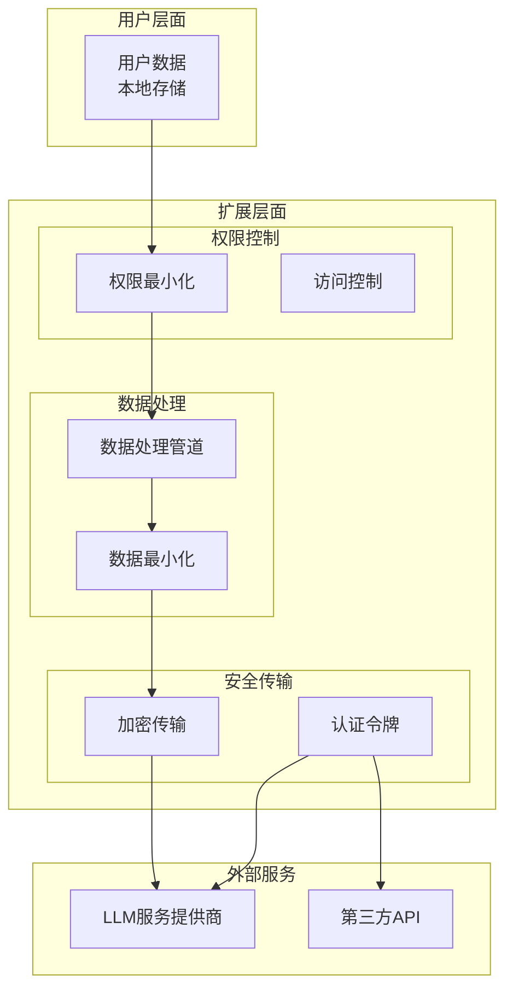

**图表来源**
- [manifest.json:6-15](file://manifest.json#L6-L15)
- [sidepanel.js:609-637](file://sidebar/sidepanel.js#L609-L637)
- [README.md:138-142](file://README.md#L138-L142)

## 详细组件分析

### 背景服务组件

背景服务负责扩展的核心功能协调，包括PDF检测、消息路由和数据处理。

#### PDF检测机制

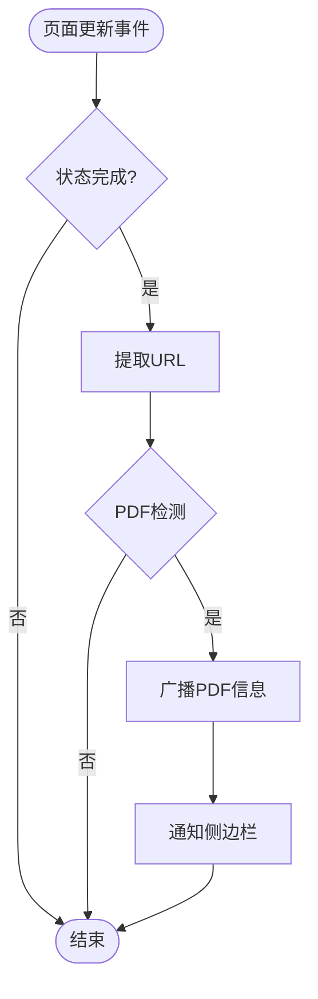

**图表来源**
- [background.js:21-34](file://background/background.js#L21-L34)
- [background.js:28-32](file://background/background.js#L28-L32)

#### 数据处理管道

背景服务实现了完整的数据处理管道，确保用户数据的最小化处理：

1. **PDF下载处理**：使用host_permissions绕过CORS限制
2. **消息路由**：统一处理来自不同组件的消息
3. **格式转换**：将RSS/XML转换为统一JSON结构
4. **错误处理**：完善的异常捕获和错误报告

**章节来源**
- [background.js:125-177](file://background/background.js#L125-L177)
- [background.js:37-117](file://background/background.js#L37-L117)

### 内容脚本组件

内容脚本专门用于检测嵌入在网页中的PDF对象，实现对Chrome内置PDF查看器的补充检测。

#### PDF检测算法

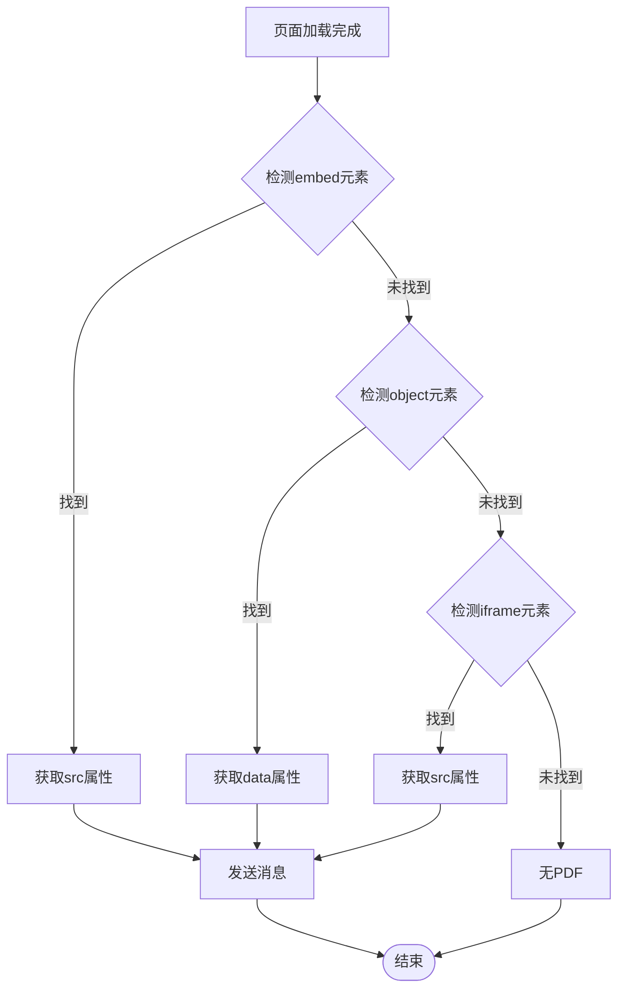

**图表来源**
- [content.js:11-28](file://content.js#L11-L28)

**章节来源**
- [content.js:11-35](file://content/content.js#L11-L35)

### 侧边栏界面组件

侧边栏界面提供了完整的用户交互体验，包含多个功能模块和设置管理。

#### 设置管理架构

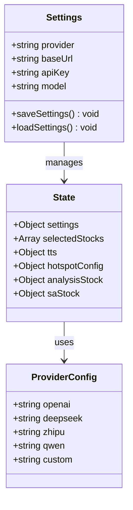

**图表来源**
- [sidepanel.js:516-584](file://sidepanel.js#L516-L584)
- [sidepanel.js:609-637](file://sidepanel.js#L609-L637)
- [options.html:73-121](file://options.html#L73-L121)

**章节来源**
- [sidepanel.js:516-584](file://sidepanel.js#L516-L584)
- [sidepanel.js:609-637](file://sidepanel.js#L609-L637)
- [options.html:73-121](file://options.html#L73-L121)

## 依赖分析

### 外部依赖关系

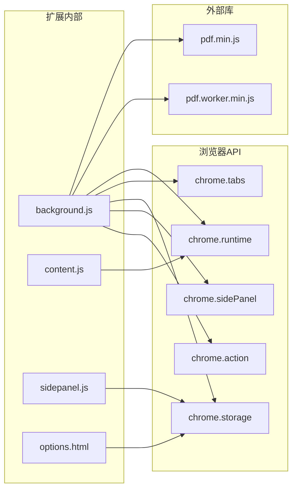

**图表来源**
- [manifest.json:22-29](file://manifest.json#L22-L29)
- [background.js:11-19](file://background/background.js#L11-L19)
- [content.js:23-26](file://content/content.js#L23-L26)

**章节来源**
- [manifest.json:22-29](file://manifest.json#L22-L29)
- [background.js:11-19](file://background/background.js#L11-L19)

## 性能考虑

### 数据传输优化

扩展实现了多种性能优化策略：

1. **PDF分块传输**：大于20MB的PDF文件自动分块传输
2. **缓存机制**：本地存储设置和分析结果
3. **异步处理**：所有网络请求采用Promise异步处理
4. **内存管理**：及时清理DOM引用和事件监听器

### 存储优化

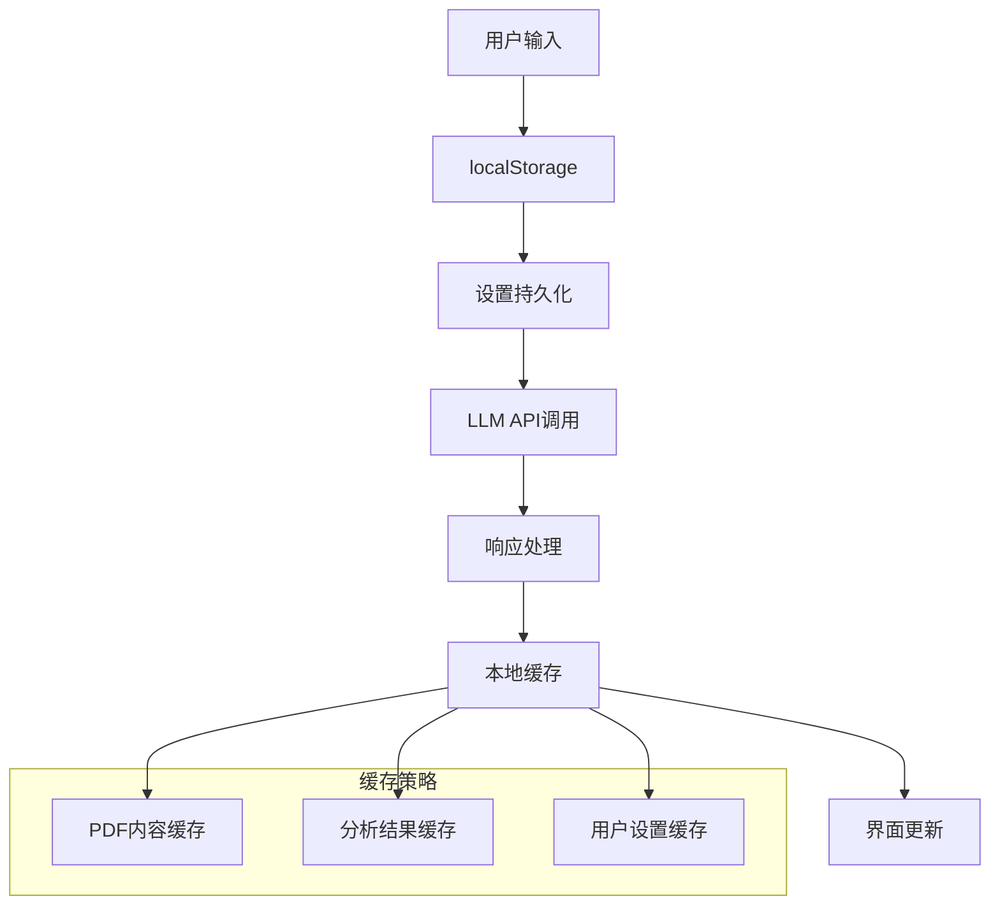

**图表来源**
- [sidepanel.js:609-637](file://sidepanel.js#L609-L637)
- [background.js:159-177](file://background/background.js#L159-L177)

## 隐私保护实践

### 数据最小化原则

扩展严格遵循数据最小化原则，仅收集和处理实现功能所需的最少数据：

#### 用户数据处理

| 数据类型 | 收集目的 | 存储位置 | 生命周期 | 删除机制 |
|---------|---------|---------|---------|---------|
| API密钥 | LLM服务调用 | localStorage | 用户手动删除 | 用户主动清除 |
| 股票代码 | 选股分析 | 临时内存 | 单次会话 | 自动清理 |
| 财报文本 | 分析处理 | 临时内存 | 单次分析 | 自动清理 |
| 设置配置 | 功能定制 | localStorage | 用户保留 | 用户删除 |
| 分析历史 | 用户参考 | 临时内存 | 单次会话 | 自动清理 |

#### 第三方服务集成

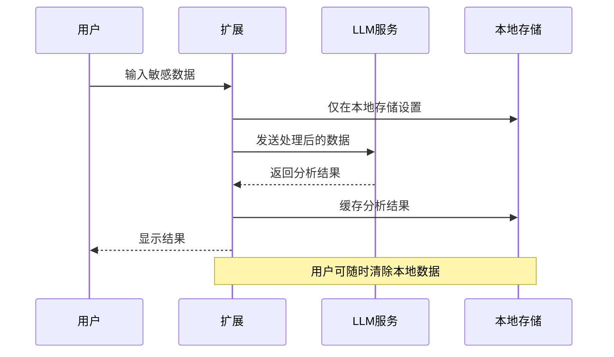

**图表来源**
- [README.md:140-142](file://README.md#L140-L142)
- [sidepanel.js:609-637](file://sidepanel.js#L609-L637)

**章节来源**
- [README.md:140-142](file://README.md#L140-L142)
- [sidepanel.js:609-637](file://sidepanel.js#L609-L637)

### 用户同意机制

扩展实现了多层次的用户同意机制：

#### 权限申请流程

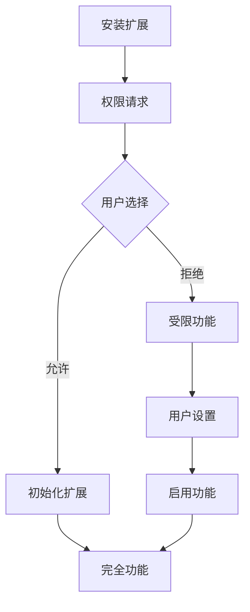

#### 设置管理中的同意

用户可以在设置页面明确管理各项功能的使用权限，包括：

- LLM服务提供商的选择和配置
- API密钥的存储和删除
- 功能模块的启用和禁用
- 数据缓存的清理

**章节来源**
- [options.html:73-121](file://options.html#L73-L121)
- [sidepanel.js:609-637](file://sidepanel.js#L609-L637)

## 合规要求与实施

### GDPR合规要求

#### 数据主体权利实现

| 权利 | 实现方式 | 技术保障 |
|------|---------|---------|
| 访问权 | 本地数据查看 | localStorage API |
| 更正权 | 设置页面修改 | 用户界面 |
| 删除权 | 清除本地存储 | JavaScript API |
| 数据可携带权 | 导出功能 | Markdown导出 |
| 反对权 | 禁用功能模块 | 权限控制 |

#### 合规措施实施

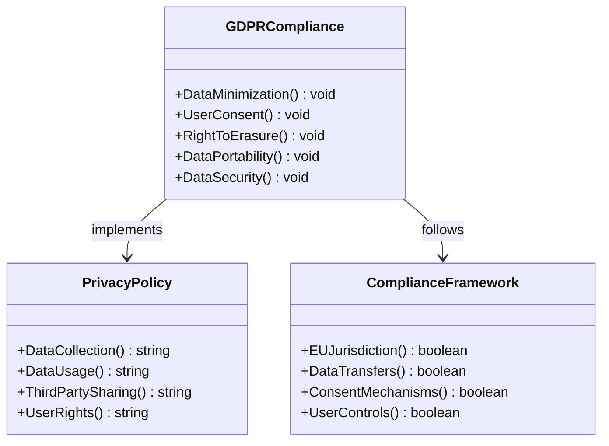

**图表来源**
- [README.md:140-142](file://README.md#L140-L142)
- [manifest.json:6-15](file://manifest.json#L6-L15)

### CCPA合规要求

#### 用户权利保障

| 权利 | 实现机制 | 技术实现 |
|------|---------|---------|
| 认知权 | 透明度声明 | README文档 |
| 删除权 | 数据清除功能 | localStorage.clear() |
| 无歧视权 | 功能可用性 | 权限控制 |
| 无披露权 | 选择性披露 | 用户同意 |

#### 个人信息处理

扩展处理的个人信息类型和处理目的：

| 个人信息类型 | 处理目的 | 法律依据 | 保留期限 |
|-------------|---------|---------|---------|
| 股票代码 | 选股分析 | 用户同意 | 会话结束 |
| 财报文本 | 分析处理 | 用户同意 | 分析完成 |
| API密钥 | 服务调用 | 用户同意 | 用户删除 |
| 设置配置 | 功能定制 | 用户同意 | 用户删除 |

**章节来源**
- [README.md:140-142](file://README.md#L140-L142)
- [sidepanel.js:609-637](file://sidepanel.js#L609-L637)

### 第三方服务集成

#### 供应商安全审计

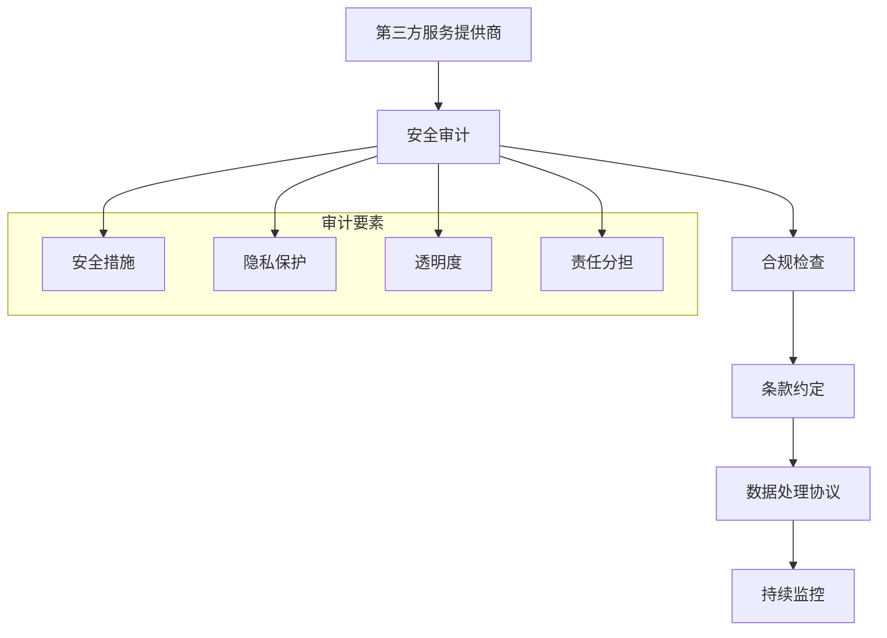

#### 数据共享协议

扩展与第三方服务的数据共享遵循以下原则：

1. **最小化原则**：仅共享实现功能必需的数据
2. **加密传输**：所有数据传输均采用HTTPS加密
3. **明确用途**：数据仅用于用户授权的功能范围
4. **时间限制**：数据在分析完成后立即清理
5. **用户控制**：用户可随时撤销数据共享

**章节来源**
- [sidepanel.js:417-423](file://sidepanel.js#L417-L423)
- [README.md:140-142](file://README.md#L140-L142)

### Chrome扩展权限最小化

#### 权限配置优化

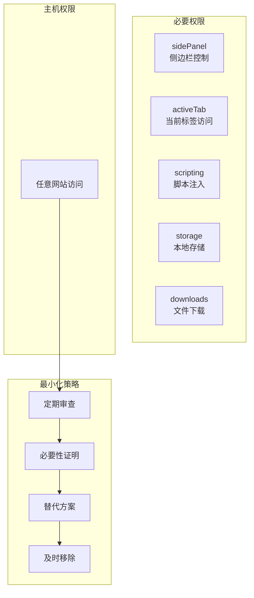

**图表来源**
- [manifest.json:6-15](file://manifest.json#L6-L15)
- [background.js:125-177](file://background/background.js#L125-L177)

#### 权限使用监控

扩展实现了权限使用的透明度和监控机制：

1. **权限使用日志**：记录权限使用情况
2. **用户通知**：重要权限变更通知
3. **使用统计**：权限使用频率统计
4. **异常检测**：异常权限使用检测

**章节来源**
- [manifest.json:6-15](file://manifest.json#L6-L15)
- [background.js:125-177](file://background/background.js#L125-L177)

## 故障排除指南

### 常见隐私问题

#### PDF检测失败

**问题症状**：
- Chrome内置PDF查看器无法检测
- 嵌入式PDF无法识别

**解决方案**：
1. 检查内容脚本是否正确注入
2. 验证PDF URL格式
3. 确认权限配置正确

#### 数据传输问题

**问题症状**：
- LLM API调用失败
- 数据传输超时

**解决方案**：
1. 检查API密钥配置
2. 验证网络连接
3. 确认服务提供商可用性

#### 存储权限问题

**问题症状**：
- 设置无法保存
- 数据丢失

**解决方案**：
1. 检查浏览器存储权限
2. 清理浏览器缓存
3. 重新安装扩展

**章节来源**
- [content.js:11-35](file://content/content.js#L11-L35)
- [sidepanel.js:609-637](file://sidepanel.js#L609-L637)

### 合规检查清单

#### 开发阶段检查

| 检查项 | 状态 | 说明 |
|-------|------|------|
| 权限最小化 | ✅ | 仅申请必要权限 |
| 数据最小化 | ✅ | 仅处理必需数据 |
| 用户同意 | ✅ | 明确的同意机制 |
| 透明度 | ✅ | 清晰的隐私政策 |
| 安全传输 | ✅ | HTTPS加密 |
| 数据清理 | ✅ | 自动清理机制 |

#### 部署前检查

| 检查项 | 状态 | 说明 |
|-------|------|------|
| 权限审查 | ✅ | 定期权限审查 |
| 安全审计 | ✅ | 第三方服务审计 |
| 合规验证 | ✅ | 法律合规验证 |
| 用户测试 | ✅ | 隐私影响评估 |
| 文档更新 | ✅ | 隐私政策更新 |

## 结论

"投资助手"Chrome扩展在隐私保护和合规方面采取了全面的措施，通过权限最小化、数据最小化、透明度和用户控制等原则，确保符合现代隐私保护法规的要求。

### 主要成就

1. **权限最小化**：严格控制浏览器权限申请
2. **数据保护**：实现数据最小化和本地处理
3. **用户控制**：提供完整的用户同意和控制机制
4. **透明度**：清晰的隐私政策和数据处理说明
5. **合规性**：符合GDPR和CCPA等主要隐私法规

### 改进建议

1. **增强审计功能**：增加权限使用审计日志
2. **自动化合规检查**：实现持续的合规性监控
3. **用户教育材料**：提供隐私保护使用指南
4. **第三方评估**：定期进行第三方隐私评估

该扩展为浏览器扩展的隐私保护和合规实践提供了良好的范例，为用户提供了安全可靠的投资决策辅助工具。