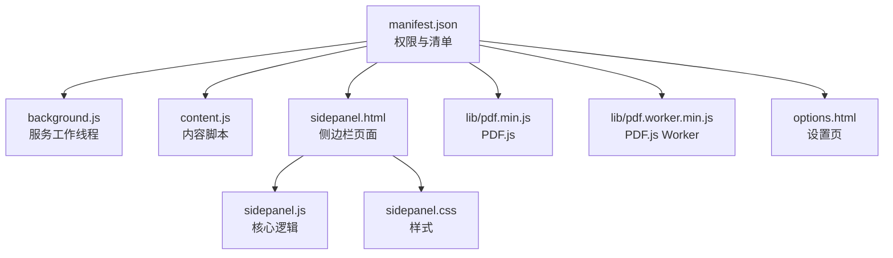
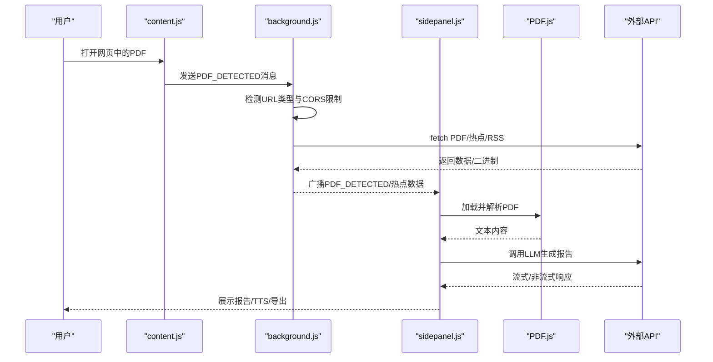
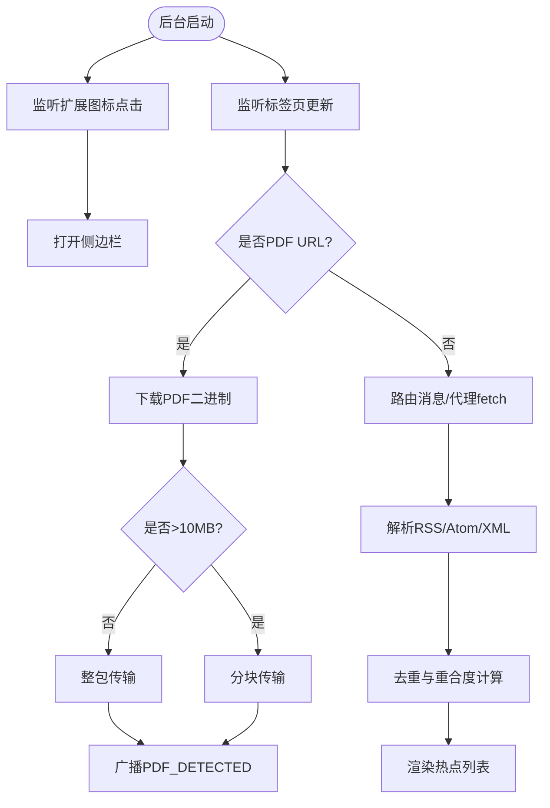

# 性能与安全

<cite>
**本文引用的文件**
- [manifest.json](file://manifest.json)
- [background.js](file://background/background.js)
- [content.js](file://content/content.js)
- [sidepanel.js](file://sidebar/sidepanel.js)
- [sidepanel.html](file://sidebar/sidepanel.html)
- [sidepanel.css](file://sidebar/sidepanel.css)
- [options.html](file://sidebar/options.html)
- [README.md](file://README.md)
</cite>

## 目录
1. [简介](#简介)
2. [项目结构](#项目结构)
3. [核心组件](#核心组件)
4. [架构总览](#架构总览)
5. [详细组件分析](#详细组件分析)
6. [依赖关系分析](#依赖关系分析)
7. [性能考量与优化](#性能考量与优化)
8. [安全与隐私保护](#安全与隐私保护)
9. [故障排查指南](#故障排查指南)
10. [结论](#结论)
11. [附录](#附录)

## 简介
本文件面向“投资助手”Chrome扩展的性能优化与安全保护，围绕加载优化、内存管理、网络请求优化、用户体验（加载状态、错误处理、反馈机制）、数据安全（API密钥管理、传输加密、本地存储安全）、隐私政策与合规、安全审计与风险评估、性能监控与安全日志等方面进行系统化梳理与落地建议。文档同时提供可视化图示，帮助开发者与运维人员快速定位问题与制定改进方案。

## 项目结构
该项目采用Chrome Extension Manifest V3架构，包含后台服务工作线程、内容脚本、侧边栏界面与本地资源库。核心模块如下：
- 后台服务工作线程：负责侧边栏打开、PDF检测与下载、消息路由、热点抓取与RSS解析、跨域代理请求等
- 内容脚本：检测网页内嵌PDF并上报后台
- 侧边栏界面：包含热点信息、选股器、估值计算器、财报解读、股票分析、AI对话等模块
- 本地资源：PDF.js库与Worker，用于PDF文本提取
- 扩展清单：声明权限、侧边栏、web-accessible资源、图标与选项页



图表来源
- [manifest.json](file://manifest.json)
- [background.js](file://background/background.js)
- [content.js](file://content/content.js)
- [sidepanel.js](file://sidebar/sidepanel.js)
- [sidepanel.html](file://sidebar/sidepanel.html)
- [sidepanel.css](file://sidebar/sidepanel.css)
- [options.html](file://sidebar/options.html)

章节来源
- [manifest.json](file://manifest.json)
- [README.md](file://README.md)

## 核心组件
- 后台服务工作线程（background.js）
  - 侧边栏打开与行为配置
  - PDF检测与下载（绕过CORS限制）
  - 消息路由与跨域代理fetch
  - RSS/Atom解析与热点聚合
- 内容脚本（content.js）
  - 检测网页内嵌PDF并上报后台
- 侧边栏核心（sidepanel.js）
  - 策略模板与选股器
  - 财报解读与PDF文本提取
  - 股票分析框架
  - AI对话与流式输出
  - 热点信息抓取与聚合
  - 估值计算器（DCF/PE/DDM/EVA等）
  - TTS播报与导出
- 侧边栏界面（sidepanel.html/css）
  - 标签页与面板布局
  - 搜索提示与输入交互
  - 加载状态与Toast反馈
- 设置页（options.html）
  - LLM服务商、API地址、API Key、模型配置
  - 关注公司管理

章节来源
- [background.js](file://background/background.js)
- [content.js](file://content/content.js)
- [sidepanel.js](file://sidebar/sidepanel.js)
- [sidepanel.html](file://sidebar/sidepanel.html)
- [sidepanel.css](file://sidebar/sidepanel.css)
- [options.html](file://sidebar/options.html)

## 架构总览
扩展采用“后台服务工作线程 + 侧边栏界面 + 内容脚本”的三层架构。侧边栏负责用户交互与展示，后台负责网络与数据处理，内容脚本负责网页内PDF检测。PDF.js本地打包，避免在线CDN带来的加载与隐私风险。



图表来源
- [content.js](file://content/content.js)
- [background.js](file://background/background.js)
- [sidepanel.js](file://sidebar/sidepanel.js)

## 详细组件分析

### 后台服务工作线程（background.js）
- 侧边栏打开与行为配置
  - 监听扩展图标点击，打开侧边栏
  - 安装时设置默认侧边栏行为
- PDF检测与下载
  - 监听标签页更新，识别PDF URL（含chrome://pdf-viewer）
  - 通过background的host_permissions绕过CORS限制，下载PDF二进制
  - 对超大PDF进行分块传输，降低消息传递开销
- 消息路由与跨域代理
  - 接收侧边栏请求，代理fetch热点与RSS数据
  - 自动识别RSS/Atom/XML与JSON，统一返回结构
- RSS解析与热点聚合
  - DOMParser解析RSS/Atom
  - 关键字与领域标签映射
  - 重合度计算与去重合并



图表来源
- [background.js](file://background/background.js)

章节来源
- [background.js](file://background/background.js)

### 内容脚本（content.js）
- 仅检测网页内嵌PDF（embed/object/iframe），不检测Chrome内置PDF查看器
- 将检测到的PDF URL通过runtime.sendMessage上报后台

章节来源
- [content.js](file://content/content.js)

### 侧边栏核心（sidepanel.js）
- 策略模板与选股器
  - 多策略模板（格雷厄姆/巴菲特/林奇/费雪/芒格/综合）
  - 实时搜索提示与键盘导航
  - 选股标签管理与批量分析
- 财报解读与PDF处理
  - PDF检测与自动提取
  - 文本截断与LLM调用
  - TTS播报与纲要导航
- 股票分析框架
  - 投资公司分析框架（商业模式/财务稳健性/管理层/估值/风险/预期）
- AI对话与流式输出
  - 流式响应与滚动跟随
  - 上下文记忆与提示词控制
- 热点信息抓取与聚合
  - 并行抓取内置与自定义RSS/JSON
  - 领域分类与关键词过滤
  - 重合度计算与排序
- 估值计算器
  - DCF/PE/DDM/EVA等多模型
  - 自动参数填充与WACC估算
- 导出与TTS
  - Markdown导出与下载目录
  - TTS播报与进度条

章节来源
- [sidepanel.js](file://sidebar/sidepanel.js)

### 设置页（options.html）
- LLM服务商与API配置
- 关注公司管理（本地localStorage）

章节来源
- [options.html](file://sidebar/options.html)

## 依赖关系分析
- manifest.json声明权限与侧边栏、web-accessible资源
- sidepanel.js依赖PDF.js库与Worker
- sidepanel.js通过chrome.runtime与background.js通信
- sidepanel.js通过chrome.tabs与content.js间接交互

```mermaid
graph LR
M["manifest.json"] --> BG["background.js"]
M --> CT["content.js"]
M --> SP["sidepanel.js"]
M --> PDF["lib/pdf.min.js"]
M --> PWD["lib/pdf.worker.min.js"]
SP --> PDF
SP --> PWD
SP <- --> BG
SP <- --> CT
```

图表来源
- [manifest.json](file://manifest.json)
- [background.js](file://background/background.js)
- [content.js](file://content/content.js)
- [sidepanel.js](file://sidebar/sidepanel.js)

章节来源
- [manifest.json](file://manifest.json)
- [sidepanel.js](file://sidebar/sidepanel.js)

## 性能考量与优化

### 加载优化
- 侧边栏懒加载与延迟初始化
  - 仅在首次打开侧边栏时加载PDF.js与初始化模块
  - 通过DOMContentLoaded事件触发初始化，避免阻塞页面
- 资源加载策略
  - PDF.js与Worker本地打包，减少CDN依赖
  - 侧边栏HTML/CSS/JS按需加载，减少首屏体积
- 搜索与提示
  - 输入防抖与节流（setTimeout/clearTimeout），降低API调用频率
  - 键盘导航减少DOM操作与重绘

章节来源
- [sidepanel.js](file://sidebar/sidepanel.js)
- [sidepanel.html](file://sidebar/sidepanel.html)
- [sidepanel.css](file://sidebar/sidepanel.css)

### 内存管理
- 大对象与二进制数据
  - PDF下载后转换为Uint8Array并通过分块传输，避免一次性大对象占用
  - 文本截断策略，防止LLM输入过大导致内存峰值
- 事件与定时器
  - 及时清理定时器与事件监听器，避免泄漏
  - 自动刷新定时器集中管理，支持启动/停止
- DOM与渲染
  - 列表渲染采用虚拟滚动思路（最多显示100条），减少DOM节点
  - 热点聚合后去重，限制总数（最多500条）

章节来源
- [background.js](file://background/background.js)
- [sidepanel.js](file://sidebar/sidepanel.js)

### 网络请求优化策略
- 跨域代理与缓存
  - 通过background代理fetch热点与RSS，统一处理CORS与错误
  - 并行抓取多个数据源，Promise.allSettled收集结果，提升成功率
- 数据解析与压缩
  - RSS/Atom解析后统一结构，减少前端重复解析
  - 大文本截断与关键词保留，降低传输与渲染压力
- 重合度与去重
  - 基于Jaccard相似度的新闻去重，减少重复渲染与存储

章节来源
- [background.js](file://background/background.js)
- [sidepanel.js](file://sidebar/sidepanel.js)

### 用户体验优化
- 加载状态管理
  - Loading遮罩与进度文案，支持多阶段提示
  - Toast反馈与状态提示，增强用户感知
- 错误处理与回退
  - API失败时降级提示与重试建议
  - PDF解析失败时引导手动粘贴
- 交互与反馈
  - 纲要导航与TTS播报，提升阅读体验
  - 流式输出与滚动跟随，降低等待感

章节来源
- [sidepanel.js](file://sidebar/sidepanel.js)

## 安全与隐私保护

### API密钥管理
- 存储位置
  - LLM API Key存储在localStorage，不在客户端上传至任何服务器
- 配置与校验
  - 设置页提供服务商选择与API Key输入
  - 调用前校验API Key，失败时引导用户重新配置
- 建议
  - 采用HTTPS与最小权限原则
  - 定期轮换密钥，避免长期暴露

章节来源
- [options.html](file://sidebar/options.html)
- [sidepanel.js](file://sidebar/sidepanel.js)
- [README.md](file://README.md)

### 数据传输加密
- HTTPS与可信源
  - 所有外部API调用使用HTTPS
  - 限定可信数据源（内置RSS/JSON与自定义URL）
- 代理与隔离
  - 通过background代理fetch，隐藏真实请求来源
  - 仅传递必要参数，避免敏感信息泄露

章节来源
- [background.js](file://background/background.js)
- [sidepanel.js](file://sidebar/sidepanel.js)

### 本地存储安全
- localStorage使用
  - 存储设置与关注公司列表
  - 建议对敏感字段进行简单混淆或分段存储
- 文件导出
  - 导出路径可配置，避免写入受限目录
  - 导出失败时降级为浏览器下载

章节来源
- [options.html](file://sidebar/options.html)
- [sidepanel.js](file://sidebar/sidepanel.js)

### 隐私保护与合规
- 数据最小化
  - 仅收集必要的股票代码/名称与用户输入
- 第三方服务集成
  - 东方财富、财联社、巨潮资讯等第三方接口
  - 明确数据用途与保留期限
- 合规要求
  - 遵循Chrome扩展隐私与安全政策
  - 提供清晰的隐私声明与用户同意机制

章节来源
- [README.md](file://README.md)
- [sidepanel.js](file://sidebar/sidepanel.js)

### 安全审计清单与风险评估
- 审计清单
  - 权限最小化审查（sidePanel、activeTab、scripting、storage、downloads、<all_urls>）
  - API Key存储与传输加密
  - PDF.js本地化与版本更新策略
  - 热点抓取源的可信性与HTTPS强制
  - 用户输入与HTML转义（XSS防护）
- 风险评估
  - 高风险：API Key泄露、热点源被篡改
  - 中风险：PDF解析失败、LLM调用超时
  - 低风险：UI渲染性能、TTS播报延迟

章节来源
- [manifest.json](file://manifest.json)
- [background.js](file://background/background.js)
- [sidepanel.js](file://sidebar/sidepanel.js)

### 性能监控与安全日志
- 性能监控
  - 关键路径埋点：PDF提取耗时、LLM调用耗时、热点抓取耗时
  - 资源加载统计：PDF.js加载、Worker初始化、侧边栏首屏时间
- 安全日志
  - API调用错误码与响应体摘要
  - PDF下载失败与URL解析异常
  - 用户操作轨迹（搜索、导出、TTS）

章节来源
- [sidepanel.js](file://sidebar/sidepanel.js)
- [background.js](file://background/background.js)

## 故障排查指南
- PDF无法提取
  - 检查是否为扫描版PDF，建议手动粘贴文本
  - 确认URL可访问且Content-Type为application/pdf
- LLM调用失败
  - 校验API Key有效性与服务商可用性
  - 检查网络与HTTPS连接
- 热点信息不更新
  - 检查数据源URL与RSS格式
  - 确认自动刷新定时器正常运行
- TTS播报异常
  - 检查浏览器语音合成权限
  - 降低语速或分段播报

章节来源
- [sidepanel.js](file://sidebar/sidepanel.js)
- [background.js](file://background/background.js)

## 结论
本扩展在性能与安全方面具备良好的基础：后台代理fetch、PDF.js本地化、热点聚合与去重、流式输出与TTS播报等。建议进一步完善API密钥轮换、HTTPS强制、输入转义与埋点监控，以提升整体安全性与用户体验。

## 附录
- 术语
  - LLM：大语言模型
  - RSS/Atom：聚合内容协议
  - DCF：现金流折现模型
  - WACC：加权平均资本成本
- 参考
  - Chrome扩展Manifest V3与Side Panel API
  - PDF.js官方文档与最佳实践