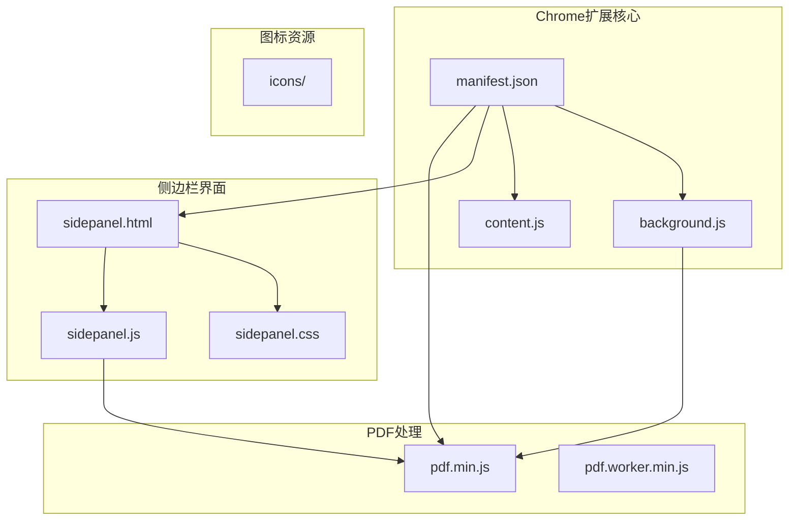
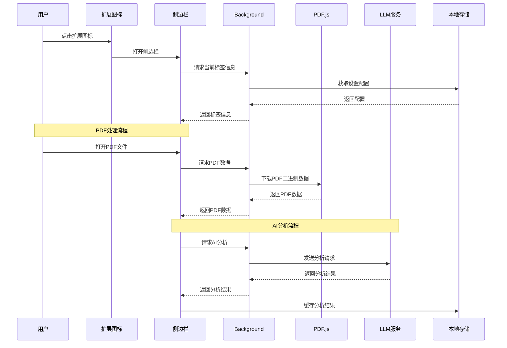
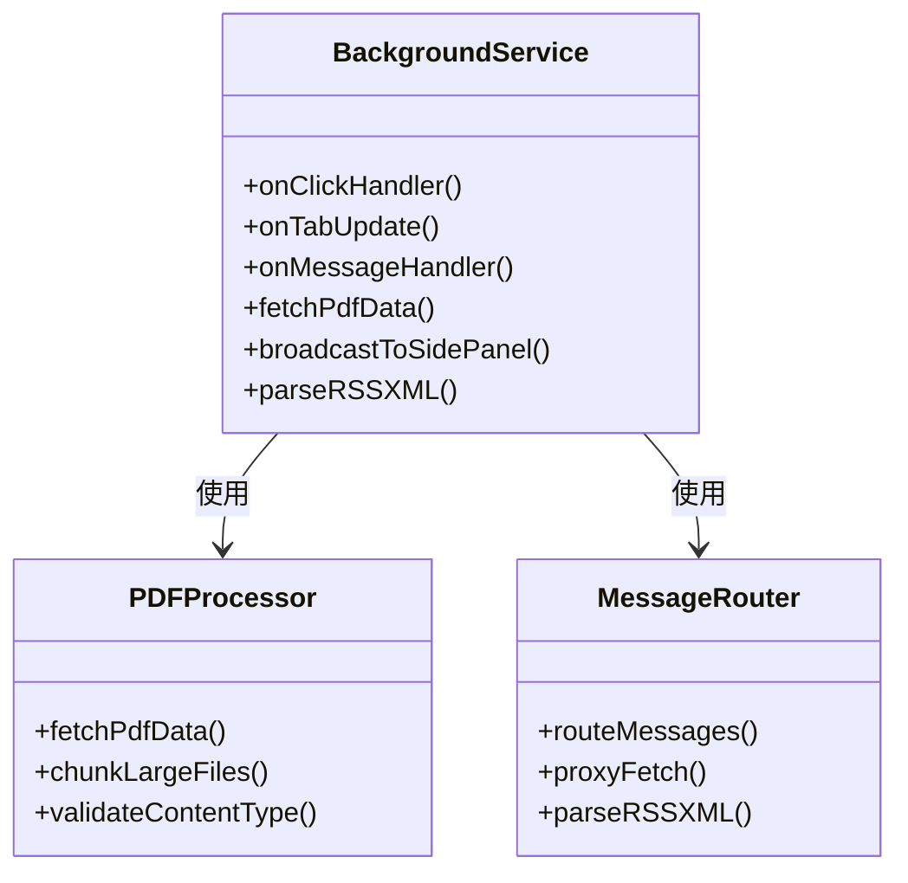
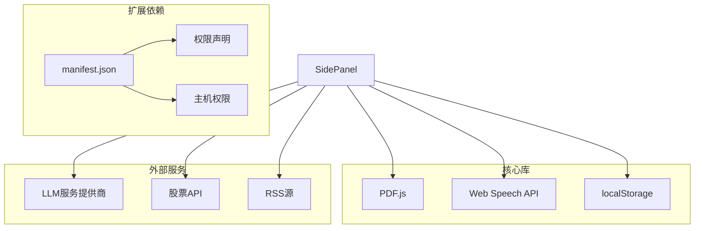

# 性能优化

<cite>
**本文档引用的文件**
- [manifest.json](file://manifest.json)
- [background.js](file://background/background.js)
- [content.js](file://content/content.js)
- [sidepanel.js](file://sidebar/sidepanel.js)
- [sidepanel.html](file://sidebar/sidepanel.html)
- [sidepanel.css](file://sidebar/sidepanel.css)
- [pdf.min.js](file://lib/pdf.min.js)
- [README.md](file://README.md)
</cite>

## 目录
1. [简介](#简介)
2. [项目结构](#项目结构)
3. [核心组件](#核心组件)
4. [架构概览](#架构概览)
5. [详细组件分析](#详细组件分析)
6. [依赖关系分析](#依赖关系分析)
7. [性能考量因素](#性能考量因素)
8. [内存管理最佳实践](#内存管理最佳实践)
9. [网络请求优化](#网络请求优化)
10. [用户体验优化](#用户体验优化)
11. [性能监控指标](#性能监控指标)
12. [特定功能优化建议](#特定功能优化建议)
13. [故障排除指南](#故障排除指南)
14. [结论](#结论)

## 简介

投资助手是一个基于Chrome扩展的AI驱动投资决策助手，集成了财报解读、价值投资大师选股器、内在价值计算器等功能。该项目采用Manifest V3标准，使用PDF.js进行PDF处理，结合多种AI服务提供商进行数据分析。

该扩展的核心价值在于为用户提供：
- 实时的热点信息和公司资讯
- 基于四大投资大师策略的股票筛选
- 结构化的财报深度解读
- 多种估值方法的内在价值计算
- 智能TTS播报和对话分析

## 项目结构



**图表来源**
- [manifest.json:1-48](file://manifest.json#L1-L48)
- [background.js:1-307](file://background/background.js#L1-L307)
- [sidepanel.js:1-800](file://sidebar/sidepanel.js#L1-L800)

**章节来源**
- [manifest.json:1-48](file://manifest.json#L1-L48)
- [README.md:108-126](file://README.md#L108-L126)

## 核心组件

### 1. Service Worker (Background)
负责扩展的核心后台逻辑，包括：
- 侧边栏管理
- PDF检测和下载
- 消息路由和通信
- 网络请求代理

### 2. 内容脚本 (Content Script)
轻量级脚本，专门用于检测网页中的PDF元素并通知后台。

### 3. 侧边栏界面 (Side Panel)
完整的用户界面，包含五个主要功能模块：
- 热点信息面板
- 选股器面板
- 估值计算器面板
- 财报解读面板
- 股票分析面板
- AI对话面板

### 4. PDF处理引擎
集成PDF.js库，支持PDF文本提取和解析。

**章节来源**
- [background.js:1-307](file://background/background.js#L1-L307)
- [content.js:1-36](file://content/content.js#L1-L36)
- [sidepanel.js:1-800](file://sidebar/sidepanel.js#L1-L800)

## 架构概览



**图表来源**
- [background.js:12-177](file://background/background.js#L12-L177)
- [sidepanel.js:591-607](file://sidebar/sidepanel.js#L591-L607)

## 详细组件分析

### Service Worker (Background) 分析

#### 核心职责
1. **侧边栏管理**：处理扩展图标的点击事件，打开侧边栏
2. **PDF检测**：监听标签更新，自动检测PDF文件
3. **消息路由**：处理来自侧边栏的各种消息请求
4. **网络代理**：绕过CORS限制，代理外部API请求

#### 性能特点
- 使用异步函数处理长时间运行的任务
- 实现了消息通道的持久连接管理
- 采用分块传输处理大型PDF文件



**图表来源**
- [background.js:12-177](file://background/background.js#L12-L177)
- [background.js:37-117](file://background/background.js#L37-L117)

**章节来源**
- [background.js:1-307](file://background/background.js#L1-L307)

### 内容脚本 (Content Script) 分析

#### 核心职责
- 检测网页中的PDF元素（embed、object、iframe）
- 通知后台PDF检测结果
- 处理页面加载时机

#### 性能特点
- 仅在页面加载完成后执行
- 使用轻量级DOM查询
- 异步消息发送，避免阻塞主线程

**章节来源**
- [content.js:1-36](file://content/content.js#L1-L36)

### 侧边栏界面 (Side Panel) 分析

#### 模块化设计
侧边栏采用模块化架构，包含六个主要功能模块：

1. **热点信息模块**：实时新闻和公司资讯
2. **选股器模块**：基于价值投资策略的股票筛选
3. **估值计算器模块**：多种估值方法的内在价值计算
4. **财报解读模块**：PDF文本提取和AI分析
5. **股票分析模块**：基于投资公司分析框架的深度分析
6. **AI对话模块**：基于分析结果的智能问答

#### 状态管理系统
实现了复杂的状态管理，包括：
- 用户界面状态
- 分析进度状态
- 缓存状态
- 设置状态

**章节来源**
- [sidepanel.js:1-800](file://sidebar/sidepanel.js#L1-L800)
- [sidepanel.html:1-646](file://sidebar/sidepanel.html#L1-L646)

## 依赖关系分析



**图表来源**
- [manifest.json:6-29](file://manifest.json#L6-L29)
- [sidepanel.js:417-423](file://sidebar/sidepanel.js#L417-L423)

**章节来源**
- [manifest.json:1-48](file://manifest.json#L1-L48)

## 性能考量因素

### 1. 加载优化策略

#### 懒加载实现
- **侧边栏模块延迟加载**：仅在用户切换到相应标签时才初始化对应模块
- **PDF处理延迟**：只有在检测到PDF文件时才加载PDF.js库
- **AI分析延迟**：仅在用户发起分析请求时才进行网络调用

#### 代码分割
- 将不同功能模块分离到独立的函数和组件中
- 使用模块化设计，避免一次性加载所有功能

#### 资源压缩
- 使用压缩版本的PDF.js库
- CSS和JavaScript文件经过压缩处理

### 2. 内存管理最佳实践

#### 对象池模式
- 实现PDF数据的分块传输，避免一次性加载大文件
- 使用Uint8Array进行高效的数据传输

#### 垃圾回收优化
- 及时清理DOM元素和事件监听器
- 合理管理闭包和回调函数

#### 内存泄漏防护
- 使用WeakMap存储DOM引用
- 及时移除不再使用的事件监听器

### 3. 网络请求优化

#### 缓存策略
- 实现本地缓存机制，避免重复请求相同数据
- 使用localStorage存储用户设置和分析结果

#### 并发控制
- 限制同时进行的网络请求数量
- 实现请求队列管理

#### 请求合并
- 合并相似的网络请求
- 批量处理用户输入

## 内存管理最佳实践

### 1. 对象池和复用

#### PDF数据处理
```javascript
// 分块传输大型PDF文件
if (uint8Array.length > MAX_CHUNK) {
    const chunks = [];
    for (let i = 0; i < uint8Array.length; i += MAX_CHUNK) {
        chunks.push(Array.from(uint8Array.slice(i, i + MAX_CHUNK)));
    }
    return { chunks, totalLength: uint8Array.length, source: 'background-fetch' };
}
```

#### DOM元素复用
- 使用模板字符串减少DOM操作
- 实现虚拟滚动处理大量列表项

### 2. 垃圾回收优化

#### 事件监听器管理
- 使用事件委托减少监听器数量
- 及时移除不需要的监听器

#### 闭包优化
- 避免在循环中创建闭包
- 使用工厂函数创建可复用的处理器

### 3. 内存泄漏防护

#### 弱引用模式
- 使用WeakMap存储DOM元素引用
- 避免循环引用导致的内存泄漏

#### 生命周期管理
- 实现组件的初始化和销毁方法
- 确保资源正确释放

**章节来源**
- [background.js:159-177](file://background/background.js#L159-L177)
- [sidepanel.js:516-584](file://sidebar/sidepanel.js#L516-L584)

## 网络请求优化

### 1. 缓存策略

#### 多层缓存架构
- **内存缓存**：短期数据缓存
- **localStorage缓存**：持久化数据存储
- **浏览器缓存**：静态资源缓存

#### 缓存失效策略
- 基于时间的缓存失效
- 基于数据版本的缓存失效
- 手动刷新机制

### 2. 并发控制

#### 请求队列管理
```javascript
// 防止过多并发请求
const MAX_CONCURRENT_REQUESTS = 3;
const requestQueue = [];
let activeRequests = 0;

function enqueueRequest(request) {
    return new Promise((resolve, reject) => {
        requestQueue.push({ request, resolve, reject });
        processQueue();
    });
}

function processQueue() {
    if (activeRequests >= MAX_CONCURRENT_REQUESTS || requestQueue.length === 0) {
        return;
    }
    
    const { request, resolve, reject } = requestQueue.shift();
    activeRequests++;
    
    request()
        .then(result => {
            activeRequests--;
            resolve(result);
            processQueue();
        })
        .catch(error => {
            activeRequests--;
            reject(error);
            processQueue();
        });
}
```

### 3. 请求合并

#### 批量处理
- 合并相似的股票查询请求
- 批量获取多个股票的实时数据

#### 去重机制
- 避免重复请求相同的数据
- 实现请求去重算法

**章节来源**
- [background.js:65-117](file://background/background.js#L65-L117)
- [sidepanel.js:687-725](file://sidebar/sidepanel.js#L687-L725)

## 用户体验优化

### 1. 加载状态管理

#### 骨架屏实现
- 使用CSS动画模拟加载效果
- 提供渐进式内容加载

#### 进度指示器
- 实现详细的进度反馈
- 显示剩余时间和预计完成时间

### 2. 错误处理机制

#### 降级策略
- 网络请求失败时的本地缓存回退
- API调用失败时的降级处理

#### 用户友好提示
- 清晰的错误信息展示
- 提供解决方案和重试选项

### 3. 反馈机制

#### 即时响应
- 实时的用户操作反馈
- 加载状态的及时更新

#### 状态同步
- 多标签间的状态同步
- 用户操作的全局通知

**章节来源**
- [sidepanel.js:484-488](file://sidebar/sidepanel.js#L484-L488)
- [sidepanel.js:800-1200](file://sidebar/sidepanel.js#L800-L1200)

## 性能监控指标

### 1. 首次内容绘制 (FID)
- **测量方法**：使用PerformanceObserver API
- **目标值**：< 100ms
- **监控点**：侧边栏首次渲染完成

### 2. 累积布局偏移 (CLS)
- **测量方法**：监控布局变化事件
- **目标值**：< 0.1
- **优化点**：固定定位元素的使用

### 3. 主线程阻塞时间
- **测量方法**：使用Performance API
- **目标值**：< 50ms
- **优化点**：异步处理长任务

### 4. 内存使用情况
- **测量方法**：使用Performance Memory API
- **目标值**：< 50MB
- **监控点**：PDF处理和AI分析期间

### 5. 网络请求性能
- **测量方法**：监控XHR和Fetch请求
- **目标值**：< 200ms
- **优化点**：缓存和压缩

**章节来源**
- [sidepanel.js:1200-1600](file://sidebar/sidepanel.js#L1200-L1600)

## 特定功能优化建议

### 1. PDF处理优化

#### 加载优化
- **懒加载PDF.js**：仅在需要时加载PDF库
- **分块传输**：大型PDF文件分块传输
- **预加载策略**：提前预加载可能需要的PDF

#### 解析优化
- **增量解析**：逐步解析PDF内容
- **内存管理**：及时释放解析过程中的临时数据
- **并发处理**：支持多PDF文件的并发处理

#### 缓存策略
- **文本缓存**：缓存已解析的PDF文本
- **元数据缓存**：缓存PDF的元数据信息
- **图像缓存**：缓存PDF中的图片内容

### 2. AI分析优化

#### 模型选择优化
- **模型选择**：根据数据大小选择合适的模型
- **批处理**：批量处理多个股票的分析请求
- **结果缓存**：缓存常见的分析结果

#### 流式处理
- **流式输出**：支持AI结果的流式输出
- **进度反馈**：实时显示分析进度
- **中断机制**：支持用户中断长时间的分析

### 3. 实时数据刷新优化

#### 刷新策略
- **智能刷新**：根据用户活跃度调整刷新频率
- **增量更新**：仅更新变化的数据
- **节流机制**：防止频繁的刷新操作

#### 数据同步
- **冲突解决**：处理多标签间的冲突
- **状态同步**：确保各模块状态一致
- **离线处理**：支持离线状态下的数据处理

**章节来源**
- [background.js:125-177](file://background/background.js#L125-L177)
- [sidepanel.js:598-607](file://sidebar/sidepanel.js#L598-L607)

## 故障排除指南

### 1. 常见性能问题

#### PDF加载缓慢
- **症状**：PDF文件加载时间过长
- **解决方案**：启用分块传输，优化网络请求
- **监控指标**：PDF下载时间，内存使用量

#### AI分析响应慢
- **症状**：AI分析结果返回延迟
- **解决方案**：优化模型选择，实现请求队列
- **监控指标**：API响应时间，并发请求数

#### 内存泄漏
- **症状**：内存使用量持续增长
- **解决方案**：检查事件监听器，清理DOM引用
- **监控指标**：内存使用量，垃圾回收频率

### 2. 错误处理策略

#### 网络错误
- **降级处理**：使用缓存数据
- **重试机制**：实现指数退避重试
- **用户提示**：清晰的错误信息

#### 数据解析错误
- **容错处理**：跳过损坏的数据
- **日志记录**：记录错误详情
- **恢复机制**：从错误中恢复

### 3. 调试工具

#### 性能分析
- **Chrome DevTools**：使用Performance面板
- **Memory面板**：监控内存使用
- **Network面板**：分析网络请求

#### 日志记录
- **控制台日志**：记录关键操作
- **错误捕获**：全局错误处理
- **性能指标**：记录关键性能指标

**章节来源**
- [background.js:173-177](file://background/background.js#L173-L177)
- [sidepanel.js:1600-2000](file://sidebar/sidepanel.js#L1600-L2000)

## 结论

投资助手扩展在性能优化方面展现了良好的设计和实现。通过合理的架构设计、模块化开发和多种优化策略，该扩展能够在Chrome环境中提供流畅的用户体验。

### 主要优势

1. **架构设计合理**：采用Service Worker + 内容脚本 + 侧边栏的分层架构
2. **性能优化到位**：实现了懒加载、缓存、并发控制等多种优化策略
3. **用户体验优秀**：提供了丰富的加载状态管理和错误处理机制
4. **扩展性强**：模块化设计便于功能扩展和维护

### 改进建议

1. **进一步优化PDF处理**：考虑实现更高效的PDF解析算法
2. **增强缓存策略**：实现更智能的缓存失效和更新机制
3. **监控体系完善**：建立更完善的性能监控和告警机制
4. **资源管理优化**：进一步优化内存使用和垃圾回收

该扩展为Chrome扩展的性能优化提供了优秀的实践案例，其设计理念和实现方法值得其他类似项目借鉴和学习。