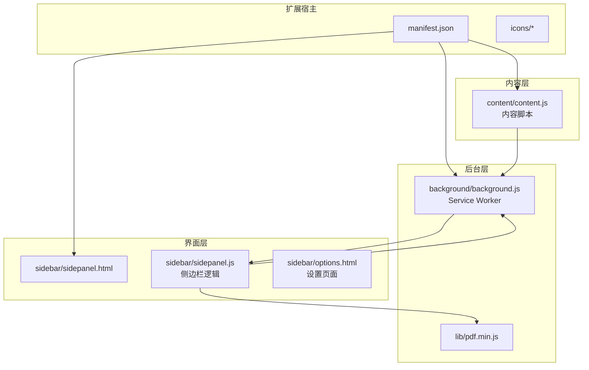
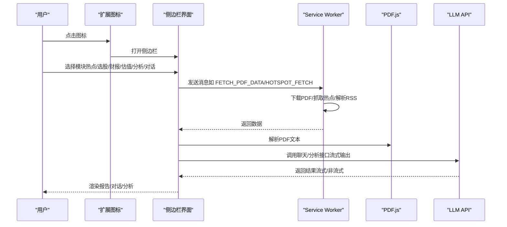
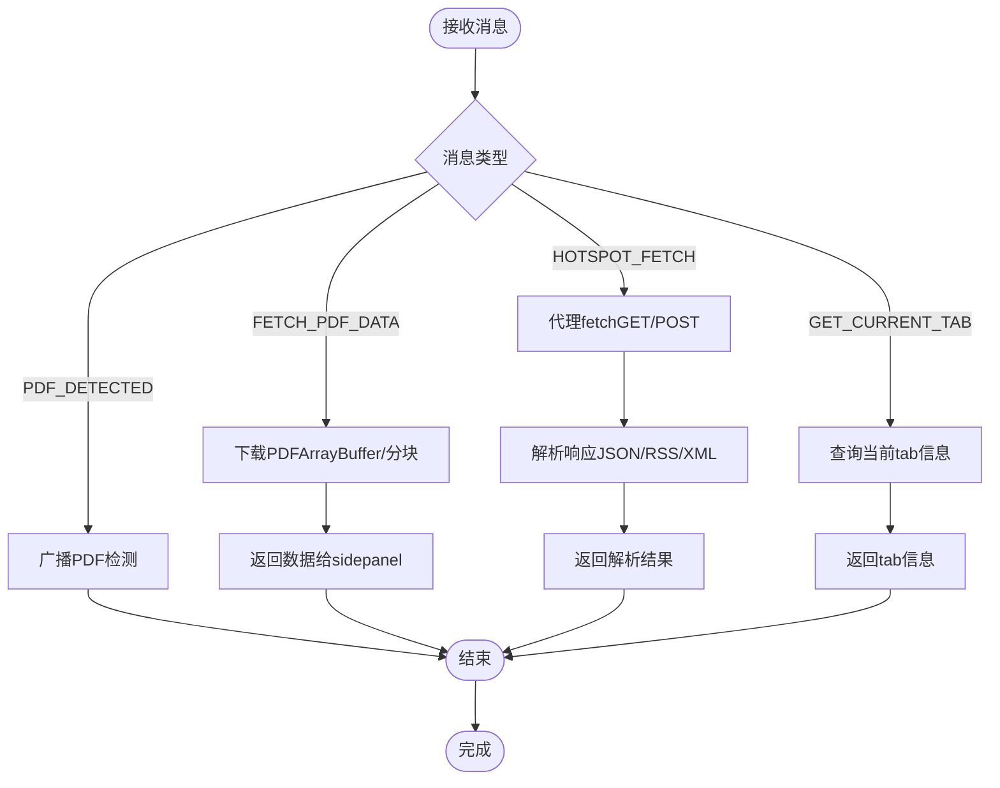
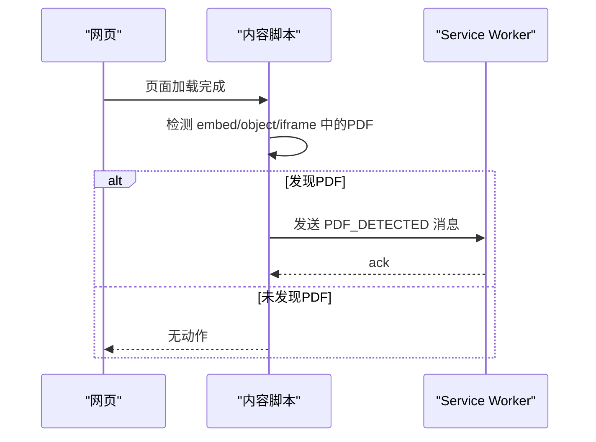
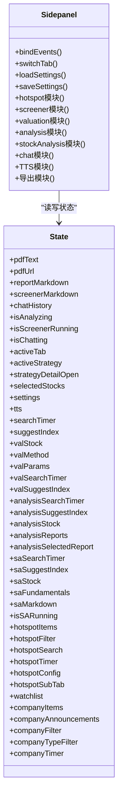
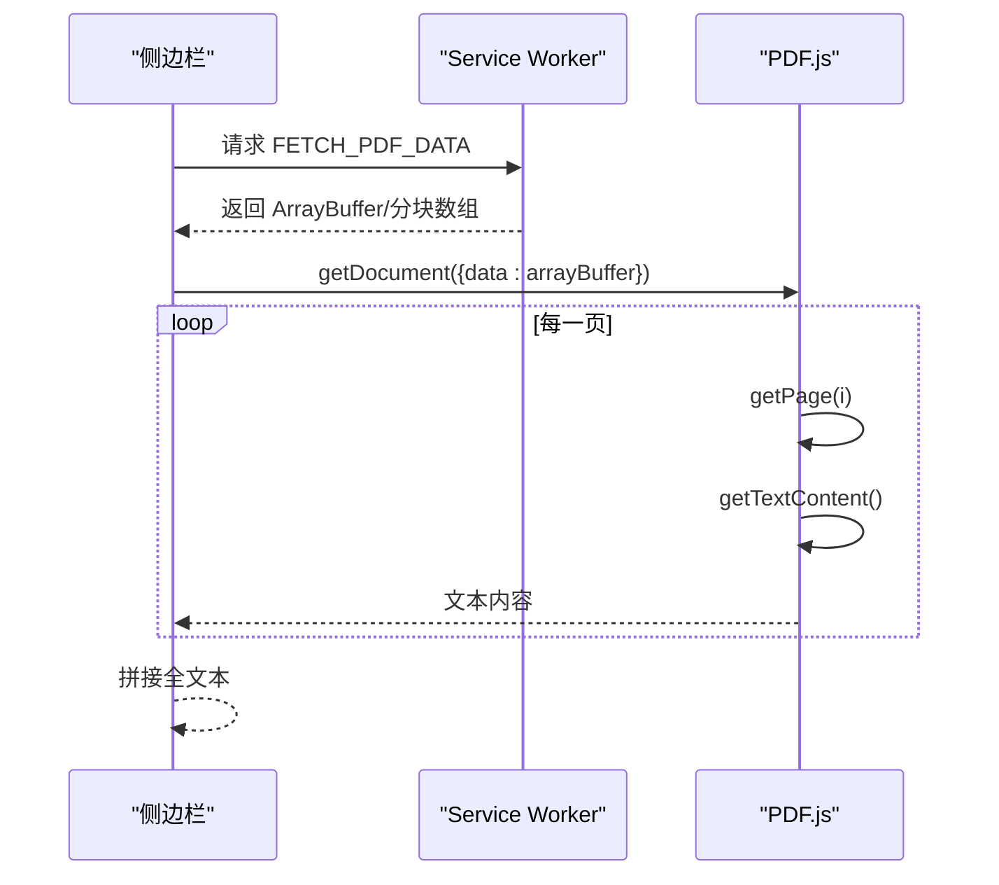
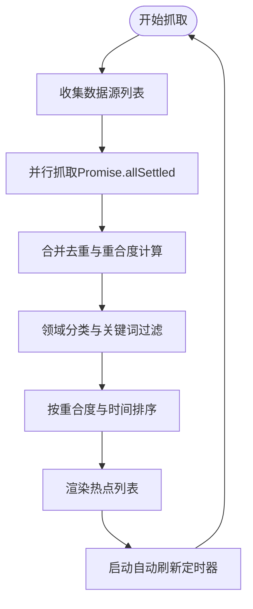
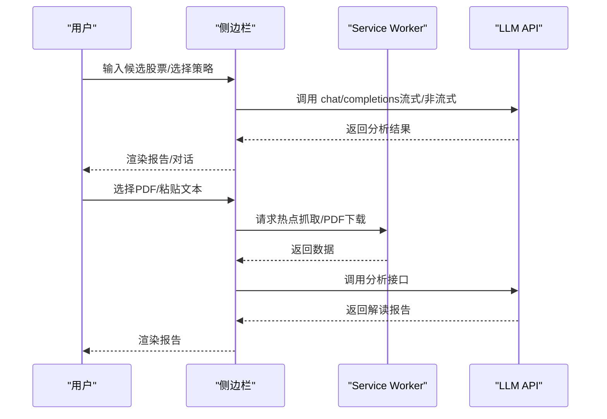
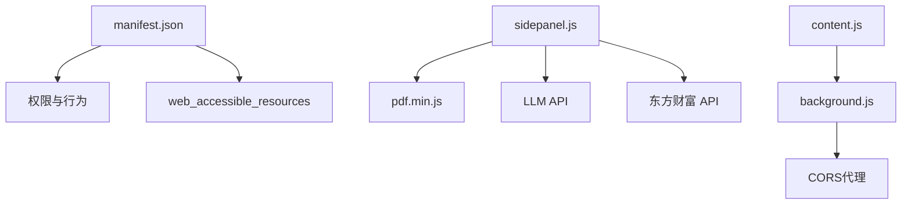

# 技术架构

<cite>
**本文档引用的文件**
- [manifest.json](file://manifest.json)
- [background.js](file://background/background.js)
- [content.js](file://content/content.js)
- [sidepanel.js](file://sidebar/sidepanel.js)
- [sidepanel.html](file://sidebar/sidepanel.html)
- [options.html](file://sidebar/options.html)
- [pdf.min.js](file://lib/pdf.min.js)
- [README.md](file://README.md)
</cite>

## 目录
1. [简介](#简介)
2. [项目结构](#项目结构)
3. [核心组件](#核心组件)
4. [架构总览](#架构总览)
5. [详细组件分析](#详细组件分析)
6. [依赖分析](#依赖分析)
7. [性能考量](#性能考量)
8. [故障排查指南](#故障排查指南)
9. [结论](#结论)
10. [附录](#附录)

## 简介
本项目是一个基于 Chrome Extension Manifest V3 的投资助手扩展，提供“热点信息”、“选股器”、“内在价值计算器”、“财报解读”、“股票分析”和“AI对话”六大功能模块。系统采用 Side Panel API 作为主界面容器，通过 Service Worker（background）协调消息路由、PDF 下载与解析、热点数据抓取与聚合，内容脚本（content）负责在普通网页中检测嵌入式 PDF，侧边栏界面（sidepanel）承载所有交互逻辑与状态管理。

## 项目结构
项目采用按功能模块划分的目录结构，核心文件包括：
- manifest.json：扩展清单，声明权限、侧边栏、后台脚本、可访问资源等
- background/background.js：Service Worker，负责消息路由、PDF 下载、热点抓取、RSS 解析
- content/content.js：内容脚本，检测页面中的嵌入式 PDF 并上报
- sidebar/sidepanel.js：侧边栏主逻辑，包含状态管理、事件绑定、模块化功能实现
- sidebar/sidepanel.html：侧边栏页面结构（四标签布局）
- sidebar/options.html：设置页面（LLM 服务商配置）
- lib/pdf.min.js：PDF.js 库（本地打包，供侧边栏使用）

**图表来源**
- [manifest.json](file://manifest.json)
- [background.js](file://background/background.js)
- [content.js](file://content/content.js)
- [sidepanel.js](file://sidebar/sidepanel.js)
- [sidepanel.html](file://sidebar/sidepanel.html)
- [options.html](file://sidebar/options.html)
- [pdf.min.js](file://lib/pdf.min.js)

**章节来源**
- [manifest.json](file://manifest.json)
- [README.md](file://README.md)

## 核心组件
- Service Worker（background）：负责消息路由、PDF 下载与解析、热点数据抓取与聚合、RSS/XML 解析、CORS 代理
- 内容脚本（content）：检测页面中的嵌入式 PDF，向 background 上报
- 侧边栏界面（sidepanel）：四大标签页（热点、选股器、估值、财报解读、股票分析、对话），内置状态管理与事件处理
- PDF.js：本地打包的 PDF.js 库，用于在侧边栏中解析 PDF 文本
- 设置页面（options）：LLM 服务商配置与 API Key 管理

**章节来源**
- [background.js](file://background/background.js)
- [content.js](file://content/content.js)
- [sidepanel.js](file://sidebar/sidepanel.js)
- [sidepanel.html](file://sidebar/sidepanel.html)
- [options.html](file://sidebar/options.html)
- [pdf.min.js](file://lib/pdf.min.js)

## 架构总览
系统采用“后台服务工作线程 + 内容脚本 + 侧边栏界面”的三层架构：
- 交互入口：点击扩展图标打开侧边栏（Side Panel API）
- 数据通道：content 脚本检测 PDF → background 下载/解析 → sidepanel 渲染
- 状态中心：sidepanel.js 内置状态对象集中管理 UI 与业务状态
- 外部集成：通过 background 的代理请求访问外部 RSS/JSON API，LLM API（OpenAI 兼容）

**图表来源**
- [background.js](file://background/background.js)
- [sidepanel.js](file://sidebar/sidepanel.js)
- [pdf.min.js](file://lib/pdf.min.js)

## 详细组件分析

### Service Worker（background）职责与实现
- 侧边栏打开与行为控制：监听 action 点击，设置打开行为
- PDF 检测与下载：监听 tab 更新，识别 PDF URL；在 background 中下载 PDF（不受 CORS 限制），支持分块传输
- 消息路由：处理来自 sidepanel 的 FETCH_PDF_DATA、HOTSPOT_FETCH、GET_CURRENT_TAB 等消息
- RSS/XML 解析：统一解析 RSS/Atom，提取标题、链接、摘要、时间、来源等字段
- CORS 代理：对热点抓取与外部 API 请求进行代理，支持 GET/POST、headers、body

**图表来源**
- [background.js](file://background/background.js)

**章节来源**
- [background.js](file://background/background.js)

### 内容脚本（content）职责与实现
- 唯一职责：检测页面中的 embed/object/iframe 中的 PDF，向 background 发送 PDF_DETECTED 消息
- 由于 Chrome 内置 PDF 查看器（chrome://pdf-viewer）无法注入 content script，因此 PDF 的实际下载与解析在 background + sidepanel 中完成

**图表来源**
- [content.js](file://content/content.js)
- [background.js](file://background/background.js)

**章节来源**
- [content.js](file://content/content.js)

### 侧边栏界面（sidepanel）职责与实现
- 四标签布局：热点、选股器、估值、财报解读、股票分析、对话
- 状态管理：内置 state 对象，涵盖 PDF 文本、报告、选股器、TTS、搜索计时器、热点配置、关注公司等
- 事件绑定：标签切换、设置、搜索提示、热点过滤、TTS 播报、导出、对话等
- 模块化功能：
  - 热点信息：并行抓取多数据源（内置+自定义），去重与重合度计算，领域分类，自动刷新
  - 选股器：多策略模板（格雷厄姆/巴菲特/林奇/费雪/芒格/综合），调用 LLM 进行筛选分析
  - 估值计算器：支持 DCF、格雷厄姆、DDM、相对PE、EVA 五种方法，参数自动填充
  - 财报解读：PDF 文本提取与解析，调用 LLM 生成结构化报告，支持 TTS 播报与纲要导航
  - 股票分析：基于投资公司分析框架，生成投资策略建议
  - 对话：基于已生成报告的上下文进行继续问答，支持流式输出

**图表来源**
- [sidepanel.js](file://sidebar/sidepanel.js)

**章节来源**
- [sidepanel.js](file://sidebar/sidepanel.js)
- [sidepanel.html](file://sidebar/sidepanel.html)

### PDF.js 集成与解析
- 侧边栏加载 pdf.min.js 与 pdf.worker.min.js，设置 GlobalWorkerOptions.workerSrc
- 通过 background 下载 PDF（支持分块传输），在 sidepanel 中使用 PDF.js 提取文本，逐页解析并拼接
- 对于 chrome://pdf-viewer 类型 URL，解析出原始 PDF 地址后再下载

**图表来源**
- [sidepanel.js](file://sidebar/sidepanel.js)
- [background.js](file://background/background.js)
- [pdf.min.js](file://lib/pdf.min.js)

**章节来源**
- [sidepanel.js](file://sidebar/sidepanel.js)
- [pdf.min.js](file://lib/pdf.min.js)

### 热点信息模块（热点抓取与聚合）
- 数据源：内置（财联社电报、东方财富7×24、巨潮资讯等）+ 自定义 RSS/JSON API
- 并行抓取：Promise.allSettled 并行执行各数据源任务
- 去重与重合度：基于标题关键词的 Jaccard 相似度，合并重复新闻，统计来源数量作为重合度
- 领域分类：关键词映射到半导体、新能源、AI科技、机器人、核电、伊朗战况等
- 自动刷新：基于配置的时间间隔定时抓取，支持热更新显示

**图表来源**
- [sidepanel.js](file://sidebar/sidepanel.js)

**章节来源**
- [sidepanel.js](file://sidebar/sidepanel.js)

### 选股器与财报解读（LLM 集成）
- 选股器：支持多策略模板，输入候选股票（代码/名称/行业/条件），调用 LLM 生成筛选报告
- 财报解读：支持 PDF 文本提取或手动粘贴，构建结构化财报文本，调用 LLM 生成深度解读报告
- 对话：基于已生成报告的上下文进行继续问答，支持流式输出
- LLM 调用：统一通过 callLLM/callLLMChat，支持流式与非流式两种模式

**图表来源**
- [sidepanel.js](file://sidebar/sidepanel.js)
- [background.js](file://background/background.js)

**章节来源**
- [sidepanel.js](file://sidebar/sidepanel.js)
- [background.js](file://background/background.js)

## 依赖分析
- Manifest V3 权限与行为
  - sidePanel：启用侧边栏
  - activeTab/scripting/storage/downloads：允许对当前标签页注入脚本、读写存储、下载文件
  - host_permissions：<all_urls>：允许对任意 URL 发起请求（用于 PDF 下载与热点抓取）
  - web_accessible_resources：将 PDF.js 库暴露给网页上下文
- 第三方依赖
  - PDF.js：本地打包，用于 PDF 文本提取
  - LLM API：OpenAI 兼容接口（支持 GPT-4、DeepSeek、智谱、通义千问等）
  - 东方财富 API：股票搜索、行情、财务数据、公告、新闻等
- 版本与兼容性
  - Chrome Extension Manifest V3
  - PDF.js 版本：3.11.174（从 pdf.min.js 注释中可见）
  - Web API：Service Worker、chrome.* API、Web Speech API、Fetch API、localStorage

**图表来源**
- [manifest.json](file://manifest.json)
- [sidepanel.js](file://sidebar/sidepanel.js)
- [background.js](file://background/background.js)
- [pdf.min.js](file://lib/pdf.min.js)

**章节来源**
- [manifest.json](file://manifest.json)
- [pdf.min.js](file://lib/pdf.min.js)
- [README.md](file://README.md)

## 性能考量
- PDF 下载与解析
  - 大 PDF 分块传输（>10MB 分块），避免消息传递过大导致性能问题
  - PDF.js 逐页解析，按页提取文本并拼接，减少内存峰值
- 热点抓取
  - 并行抓取多数据源，Promise.allSettled 保证部分失败不影响整体
  - 去重与重合度计算限制在前200条，避免 O(n²) 复杂度过高
- LLM 调用
  - 流式输出（SSE）提升交互体验，及时反馈
  - 文本截断与关键词保留，确保 LLM 输入长度适中
- UI 交互
  - 搜索输入防抖/节流（setTimeout 清理），降低请求频率
  - 滚动追踪与纲要导航，提升阅读效率

[本节为通用指导，不直接分析具体文件]

## 故障排查指南
- API Key 无效或 401
  - 现象：调用 LLM 失败，提示 API Key 无效
  - 处理：打开设置页面重新配置，保存后重试
- PDF 下载失败
  - 现象：无法下载 PDF 或返回错误
  - 处理：检查 URL 是否为 chrome://pdf-viewer 类型，确认已解析出原始地址；检查网络与 CORS 代理
- 热点抓取异常
  - 现象：热点列表为空或抓取失败
  - 处理：检查数据源开关、自定义 RSS/JSON 地址、关键词过滤；查看控制台错误
- TTS 播报异常
  - 现象：播报失败或无法暂停/继续
  - 处理：检查浏览器语音合成权限；确保报告已生成并构建了章节列表
- 导出失败
  - 现象：导出到指定目录失败，回落到浏览器默认下载
  - 处理：确认扩展具有 downloads 权限；检查目标目录是否存在

**章节来源**
- [sidepanel.js](file://sidebar/sidepanel.js)
- [background.js](file://background/background.js)

## 结论
本项目通过清晰的三层架构（background、content、sidepanel）实现了从 PDF 检测、热点抓取、LLM 分析到报告渲染的完整闭环。Service Worker 作为中枢协调各类异步任务与消息路由，侧边栏界面承担状态管理与交互逻辑，内容脚本负责轻量的 PDF 检测。系统在安全性（权限最小化、API Key 本地存储）、性能（分块传输、并行抓取、流式输出）与可扩展性（模块化设计、多策略模板、多数据源支持）方面均具备良好实践。

[本节为总结性内容，不直接分析具体文件]

## 附录
- 安装与使用
  - 开启开发者模式，加载已解压的扩展程序
  - 首次使用需在设置页面配置 LLM 服务商与 API Key
  - 使用方式：点击扩展图标打开侧边栏，选择相应模块进行操作
- 许可证：MIT License

**章节来源**
- [README.md](file://README.md)