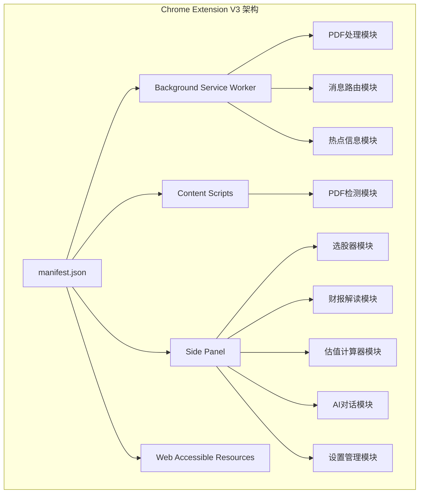
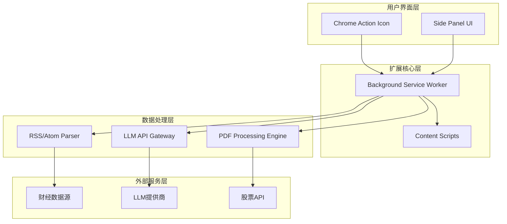
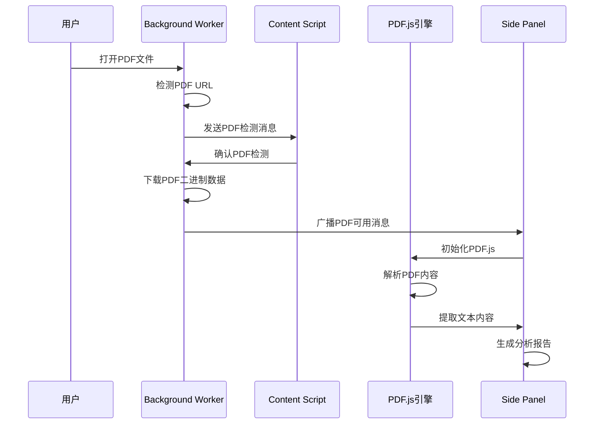
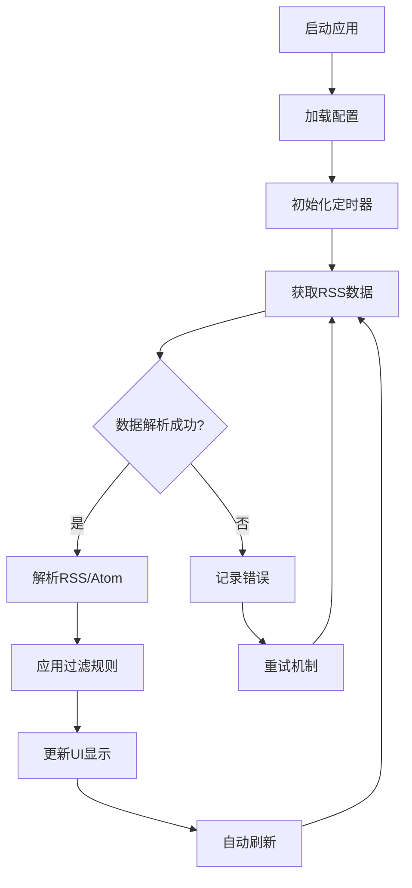
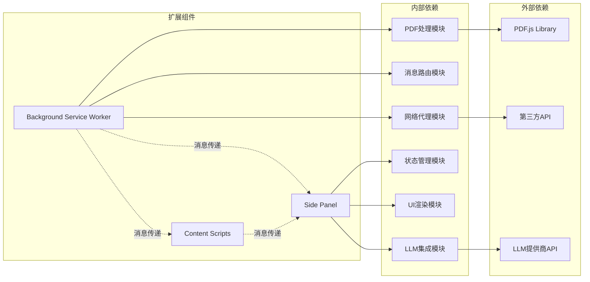

# 整体架构设计

<cite>
**本文档引用的文件**
- [manifest.json](file://manifest.json)
- [background.js](file://background/background.js)
- [content.js](file://content/content.js)
- [sidepanel.js](file://sidebar/sidepanel.js)
- [sidepanel.html](file://sidebar/sidepanel.html)
- [sidepanel.css](file://sidebar/sidepanel.css)
- [options.html](file://sidebar/options.html)
- [pdf.min.js](file://lib/pdf.min.js)
- [README.md](file://README.md)
</cite>

## 目录
1. [引言](#引言)
2. [项目结构](#项目结构)
3. [核心组件](#核心组件)
4. [架构概览](#架构概览)
5. [详细组件分析](#详细组件分析)
6. [依赖关系分析](#依赖关系分析)
7. [性能考量](#性能考量)
8. [故障排除指南](#故障排除指南)
9. [结论](#结论)

## 引言

投资助手扩展是一个基于Chrome Extension V3架构的AI驱动投资决策助手。该项目融合了巴菲特、林奇、费雪、芒格、格雷厄姆等多位价值投资大师的策略思想，提供了财报解读、选股器、内在价值计算器、AI对话等核心功能。系统采用现代浏览器扩展架构，通过服务工作线程、内容脚本和侧边栏界面的协同工作，为用户提供完整的投资分析体验。

## 项目结构

该项目采用清晰的模块化组织结构，遵循Chrome Extension V3的最佳实践：



**图表来源**
- [manifest.json:1-48](file://manifest.json#L1-L48)
- [background.js:1-307](file://background/background.js#L1-L307)
- [content.js:1-36](file://content/content.js#L1-L36)

**章节来源**
- [manifest.json:1-48](file://manifest.json#L1-L48)
- [README.md:108-126](file://README.md#L108-L126)

## 核心组件

### 服务工作线程 (Background Service Worker)

服务工作线程是整个扩展的核心协调者，负责以下关键职责：

- **侧边栏管理**：控制侧边栏的打开、关闭和行为配置
- **PDF检测与处理**：监控标签页更新，自动检测PDF文件
- **消息路由**：在扩展各部分之间传递消息
- **网络请求代理**：绕过CORS限制，代理外部API请求
- **RSS/Atom解析**：统一处理各种RSS格式的数据源

### 内容脚本 (Content Script)

内容脚本运行在目标网页环境中，专门负责：

- **PDF嵌入检测**：检测网页中嵌入的PDF对象（embed/object/iframe）
- **PDF信号转发**：将检测到的PDF信息发送给服务工作线程
- **轻量级处理**：避免在内容脚本中执行复杂的PDF解析任务

### 侧边栏界面 (Side Panel)

侧边栏界面提供完整的用户交互体验，包含六个主要功能模块：

- **热点信息模块**：聚合多个财经新闻源的数据
- **选股器模块**：基于五位大师策略的股票筛选
- **估值计算器模块**：多种估值方法的内在价值计算
- **财报解读模块**：AI驱动的财报深度分析
- **股票分析模块**：基于投资公司分析框架的综合分析
- **AI对话模块**：与用户进行投资相关的问答

**章节来源**
- [background.js:11-186](file://background/background.js#L11-L186)
- [content.js:11-35](file://content/content.js#L11-L35)
- [sidepanel.js:12-584](file://sidebar/sidepanel.js#L12-L584)

## 架构概览

系统采用分层架构设计，确保各组件职责清晰、耦合度低：



**图表来源**
- [background.js:37-117](file://background/background.js#L37-L117)
- [sidepanel.js:516-584](file://sidebar/sidepanel.js#L516-L584)

### 系统边界

系统边界定义了扩展与外部世界的交互接口：

- **浏览器API边界**：通过Chrome Extension API与浏览器交互
- **网络边界**：通过服务工作线程代理外部网络请求
- **权限边界**：严格控制所需的最小权限集合
- **数据边界**：确保用户数据的安全性和隐私保护

**章节来源**
- [manifest.json:6-12](file://manifest.json#L6-L12)

## 详细组件分析

### PDF处理系统

PDF处理是系统的核心功能之一，采用了多层次的设计策略：



**图表来源**
- [background.js:21-34](file://background/background.js#L21-L34)
- [background.js:125-177](file://background/background.js#L125-L177)
- [content.js:11-27](file://content/content.js#L11-L27)

#### PDF处理流程

PDF处理系统采用"检测-下载-解析-分析"的完整流程：

1. **自动检测**：服务工作线程监控标签页更新，自动识别PDF文件
2. **安全下载**：利用服务工作线程的host_permissions权限，绕过CORS限制
3. **分块传输**：对大型PDF文件进行分块传输，避免消息传递限制
4. **本地解析**：使用PDF.js在侧边栏环境中解析PDF内容
5. **内容提取**：提取文本、表格、图像等结构化信息

#### 技术决策权衡

**选择Side Panel API而非传统弹窗的原因**：

1. **用户体验**：Side Panel提供更大的交互空间，适合复杂的投资分析界面
2. **功能完整性**：支持多个功能模块的同时展示和交互
3. **性能优势**：与服务工作线程更好的集成，减少不必要的通信开销
4. **现代标准**：符合Chrome Extension V3的发展方向

**章节来源**
- [background.js:125-177](file://background/background.js#L125-L177)
- [content.js:6-8](file://content/content.js#L6-L8)

### 热点信息模块

热点信息模块实现了多数据源聚合和智能过滤：



**图表来源**
- [sidepanel.js:598-607](file://sidebar/sidepanel.js#L598-L607)
- [sidepanel.js:609-637](file://sidebar/sidepanel.js#L609-L637)

#### 数据源管理

系统支持多种数据源配置：

- **内置数据源**：财联社电报API、东方财富7×24小时API
- **RSS订阅**：支持标准RSS 2.0和Atom格式
- **自定义API**：允许用户添加个人数据源
- **关键词过滤**：支持多关键词组合过滤

**章节来源**
- [sidepanel.js:564-584](file://sidebar/sidepanel.js#L564-L584)

### 选股器模块

选股器模块集成了五位价值投资大师的核心策略：

```mermaid
classDiagram
class StrategyTemplate {
+name : string
+icon : string
+shortDesc : string
+criteria : array
+prompt : string
+evaluate(stock) evaluation
}
class GrahamStrategy {
+criteria : [
"PE < 15",
"PB < 1.5",
"股息率 ≥ 3%",
"流动比率 ≥ 2.0"
]
+evaluate(stock) evaluation
}
class BuffettStrategy {
+criteria : [
"ROE ≥ 15%",
"护城河识别",
"管理层质量",
"定价权"
]
+evaluate(stock) evaluation
}
class LynchStrategy {
+criteria : [
"PEG < 1.0",
"公司分类",
"盈利增长",
"机构持股"
]
+evaluate(stock) evaluation
}
class FisherStrategy {
+criteria : [
"研发投入",
"利润率",
"管理层深度",
"长期导向"
]
+evaluate(stock) evaluation
}
class MungerStrategy {
+criteria : [
"ROIC > WACC",
"逆向排除",
"压力测试",
"理性思维"
]
+evaluate(stock) evaluation
}
StrategyTemplate <|-- GrahamStrategy
StrategyTemplate <|-- BuffettStrategy
StrategyTemplate <|-- LynchStrategy
StrategyTemplate <|-- FisherStrategy
StrategyTemplate <|-- MungerStrategy
```

**图表来源**
- [sidepanel.js:14-297](file://sidebar/sidepanel.js#L14-L297)

#### 综合评分机制

系统采用加权评分的方式整合多个策略：

- **格雷厄姆策略**：20%权重，关注安全边际
- **巴菲特策略**：25%权重，关注护城河和管理层
- **林奇策略**：20%权重，关注成长性和PEG
- **费雪策略**：20%权重，关注长期成长动力
- **芒格策略**：15%权重，关注逆向思维和理性决策

**章节来源**
- [sidepanel.js:251-297](file://sidebar/sidepanel.js#L251-L297)

### 估值计算器模块

估值计算器支持五种经典的估值方法：

| 估值方法 | 核心公式 | 适用场景 | 参数要求 |
|---------|---------|---------|---------|
| DCF折现 | 两阶段FCF折现 + 永续终值 | 成长期/成熟期企业 | FCF、WACC、增长率 |
| 格雷厄姆 | V = EPS × (8.5+2g) × 4.4/Y | 价值型/深度低估 | EPS、增长率、Yield |
| DDM股息 | V = D1 / (r - g) | 稳定分红的成熟企业 | D1、r、g |
| 相对PE/PB | PE估值 + PB估值均值 | 有可比同行的企业 | 可比公司数据 |
| EVA经济附加值 | 价值 = IC + Σ(ROIC-WACC)×IC/(1+WACC)^t | 资本效率型分析 | ROIC、WACC、投资资本 |

**章节来源**
- [sidepanel.js:425-512](file://sidebar/sidepanel.js#L425-L512)

## 依赖关系分析

系统采用松耦合的设计，通过消息传递实现组件间的通信：



**图表来源**
- [background.js:37-117](file://background/background.js#L37-L117)
- [sidepanel.js:516-584](file://sidebar/sidepanel.js#L516-L584)

### 权限管理

系统严格控制所需权限，确保最小权限原则：

- **sidePanel**：允许打开和控制侧边栏
- **activeTab**：访问当前活动标签页的信息
- **scripting**：在页面中注入脚本
- **storage**：存储用户设置和数据
- **downloads**：下载文件（用于PDF处理）

**章节来源**
- [manifest.json:6-12](file://manifest.json#L6-L12)

## 性能考量

### 内存管理

系统采用渐进式加载和懒加载策略：

- **模块化加载**：侧边栏界面按需加载各个功能模块
- **图片和PDF缓存**：合理管理内存使用，避免重复加载
- **定时器管理**：及时清理不再使用的定时器

### 网络优化

- **请求合并**：将多个相似请求合并为一次网络调用
- **缓存策略**：对热点数据实施缓存，减少重复请求
- **错误重试**：实现智能重试机制，提高成功率

### 用户体验优化

- **进度指示**：为长时间操作提供进度反馈
- **离线支持**：部分功能支持离线使用
- **响应式设计**：适配不同屏幕尺寸

## 故障排除指南

### 常见问题诊断

**PDF无法检测**
1. 检查是否使用Chrome内置PDF查看器
2. 确认服务工作线程权限配置正确
3. 验证网络连接和CORS设置

**LLM API调用失败**
1. 检查API Key配置
2. 验证网络连接
3. 确认API提供商服务状态

**侧边栏无法打开**
1. 检查Chrome扩展权限设置
2. 重启浏览器扩展
3. 清除扩展缓存

### 日志和调试

系统提供详细的日志记录机制：

- **错误日志**：记录所有异常和错误信息
- **性能日志**：监控关键操作的执行时间
- **用户行为日志**：记录用户操作轨迹

**章节来源**
- [background.js:174-176](file://background/background.js#L174-L176)

## 结论

投资助手扩展展现了现代Chrome Extension架构的最佳实践。通过精心设计的服务工作线程、内容脚本和侧边栏界面的协同配合，系统实现了强大的投资分析功能。

### 技术优势

1. **架构清晰**：层次分明，职责明确
2. **性能优异**：合理的资源管理和优化策略
3. **用户体验**：直观易用的界面设计
4. **扩展性强**：模块化设计便于功能扩展

### 未来发展

系统具备良好的扩展基础，可以进一步增强的功能包括：

- **多语言支持**：国际化功能扩展
- **高级分析工具**：更多技术分析指标
- **数据导出**：支持多种格式的数据导出
- **云端同步**：用户设置和数据的云端备份

该架构设计为投资决策提供了强大而灵活的技术基础，能够适应不断变化的市场需求和技术发展。