# 侧边栏界面模块

<cite>
**本文档引用的文件**
- [sidepanel.js](file://sidebar/sidepanel.js)
- [sidepanel.css](file://sidebar/sidepanel.css)
- [sidepanel.html](file://sidebar/sidepanel.html)
- [options.html](file://sidebar/options.html)
- [background.js](file://background/background.js)
- [content.js](file://content/content.js)
- [manifest.json](file://manifest.json)
- [README.md](file://README.md)
</cite>

## 目录
1. [简介](#简介)
2. [项目结构](#项目结构)
3. [核心组件](#核心组件)
4. [架构概览](#架构概览)
5. [详细组件分析](#详细组件分析)
6. [依赖分析](#依赖分析)
7. [性能考虑](#性能考虑)
8. [故障排除指南](#故障排除指南)
9. [结论](#结论)
10. [附录](#附录)

## 简介

投资助手是一个基于Chrome扩展的侧边栏界面模块，融合了巴菲特、林奇、费雪、芒格、格雷厄姆等价值投资大师策略，提供AI驱动的投资决策辅助工具。该模块实现了多标签页界面设计，包括热点信息、选股器、估值计算器、财报解读、股票分析和AI对话等功能。

## 项目结构

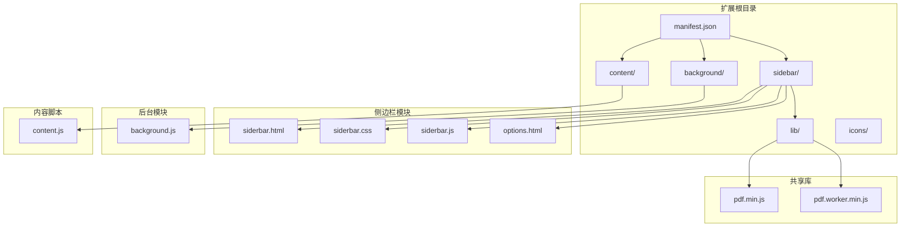

**图表来源**
- [manifest.json:1-48](file://manifest.json#L1-L48)
- [sidepanel.html:1-646](file://sidebar/sidepanel.html#L1-L646)
- [sidepanel.js:1-50](file://sidebar/sidepanel.js#L1-L50)

**章节来源**
- [manifest.json:1-48](file://manifest.json#L1-L48)
- [README.md:108-126](file://README.md#L108-L126)

## 核心组件

### 状态管理系统

侧边栏采用集中式状态管理模式，通过单一状态对象管理所有UI状态和业务数据：

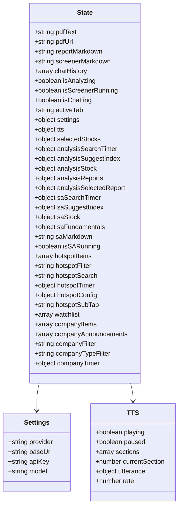

**图表来源**
- [sidepanel.js:516-584](file://sidebar/sidepanel.js#L516-L584)

### 多标签页界面设计

系统采用三标签页布局，支持热点信息、选股器、估值计算器、财报解读、股票分析和AI对话六大功能模块：

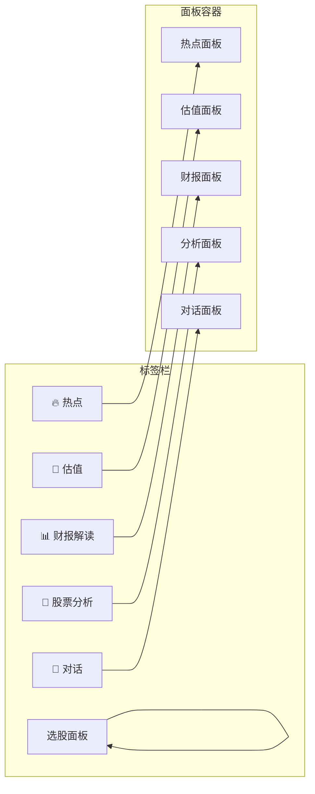

**图表来源**
- [sidepanel.html:33-40](file://sidebar/sidepanel.html#L33-L40)
- [sidepanel.js:990-1005](file://sidebar/sidepanel.js#L990-L1005)

**章节来源**
- [sidepanel.js:516-584](file://sidebar/sidepanel.js#L516-L584)
- [sidepanel.html:33-40](file://sidebar/sidepanel.html#L33-L40)

## 架构概览

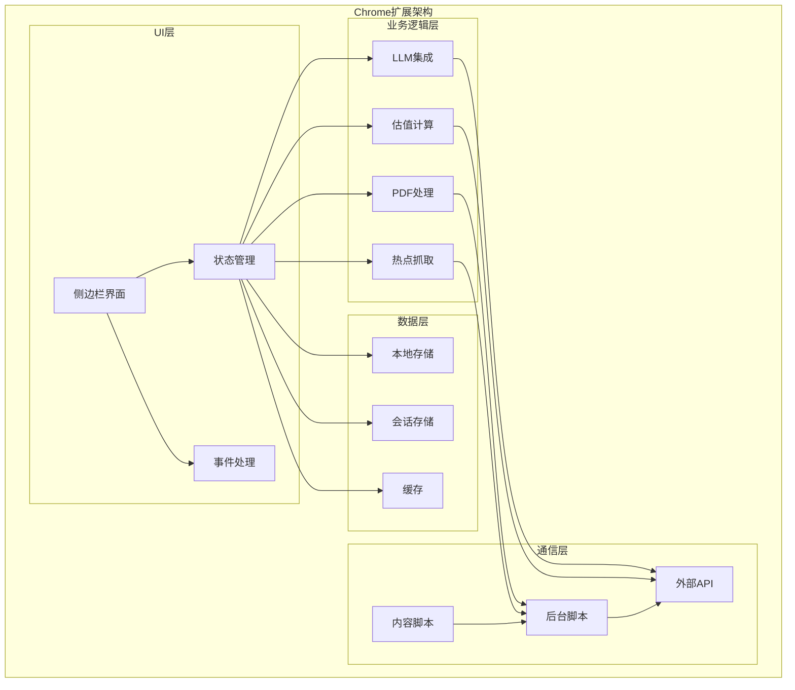

**图表来源**
- [sidepanel.js:1-50](file://sidebar/sidepanel.js#L1-L50)
- [background.js:1-307](file://background/background.js#L1-L307)
- [content.js:1-36](file://content/content.js#L1-L36)

## 详细组件分析

### 热点信息模块

热点信息模块实现了多数据源聚合、智能分类和自动刷新功能：

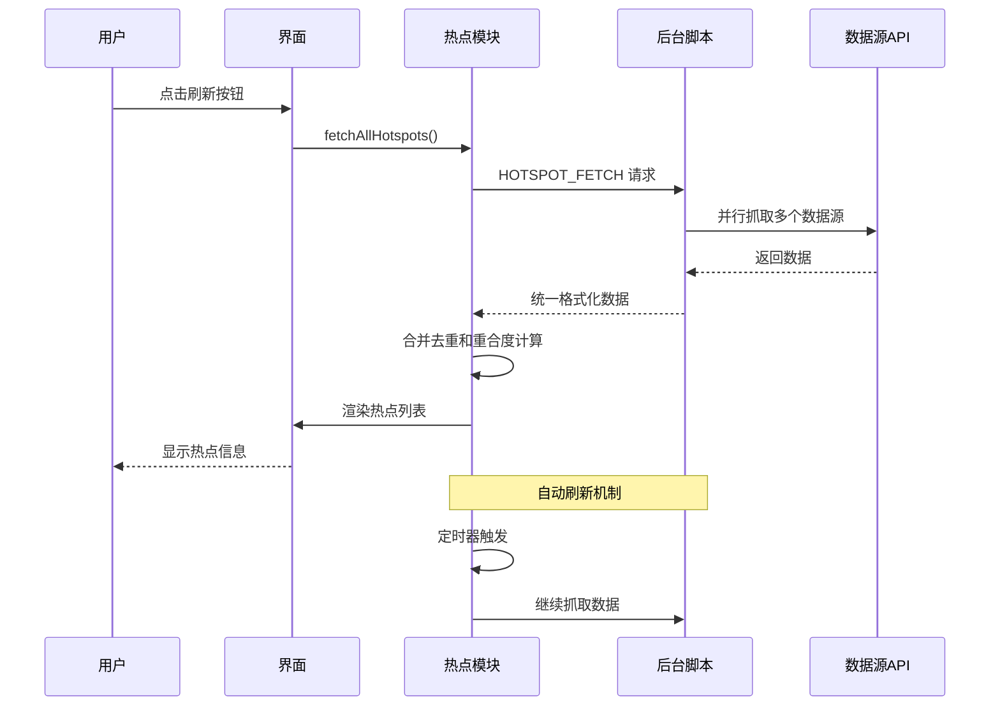

**图表来源**
- [sidepanel.js:1291-1363](file://sidebar/sidepanel.js#L1291-L1363)
- [background.js:64-116](file://background/background.js#L64-L116)

#### 数据源配置系统

系统支持多种数据源配置，包括内置API和自定义RSS源：

| 数据源类型 | 默认启用 | 示例URL | 特点 |
|------------|----------|---------|------|
| 财联社电报 | ✅ | https://www.cls.cn/nodeapi/... | 实时财经新闻 |
| 东方财富7×24 | ✅ | http://rss.eastmoney.com/... | 资金流向数据 |
| 巨潮资讯 | ✅ | http://www.cninfo.com.cn/... | 上市公司公告 |
| 华尔街见闻 | ✅ | https://rss.wallstreetcn.com/ | 国际财经资讯 |
| 雪球热门 | ✅ | https://xueqiu.com/rss/... | 投资者社区内容 |
| 自定义RSS | ❌ | 用户输入 | 灵活扩展 |

**章节来源**
- [sidepanel.js:1043-1068](file://sidebar/sidepanel.js#L1043-L1068)
- [sidepanel.js:1641-1668](file://sidebar/sidepanel.js#L1641-L1668)

### 选股器模块

选股器模块集成了五位价值投资大师的策略模板，支持多策略融合分析：

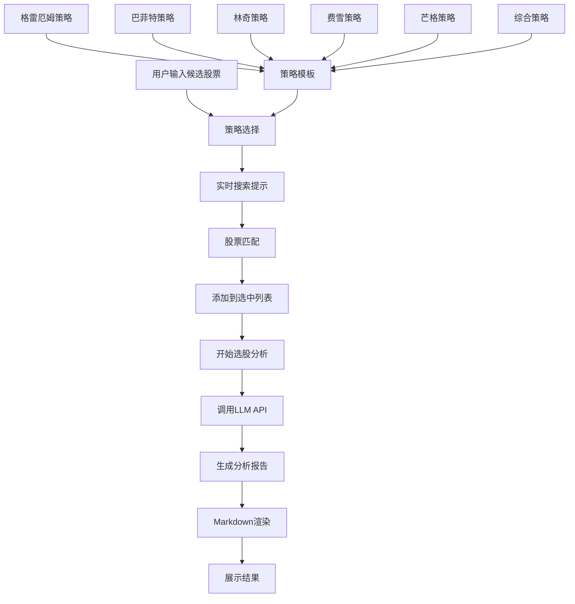

**图表来源**
- [sidepanel.js:2504-2563](file://sidebar/sidepanel.js#L2504-L2563)
- [sidepanel.js:14-297](file://sidebar/sidepanel.js#L14-L297)

#### 策略模板系统

系统内置了五位投资大师的经典策略模板：

| 策略名称 | 核心理念 | 关键指标 | 适用场景 |
|----------|----------|----------|----------|
| 格雷厄姆 | 深度价值 · 安全边际 | PE<15, PB<1.5, 股息≥3% | 价值投资入门 |
| 巴菲特 | 护城河 · 优质企业 | ROE≥15%, 定价权, 管理层 | 成长价值投资 |
| 林奇 | PEG · 成长价值 | PEG<1, 盈利增长15-30% | 成长股挖掘 |
| 费雪 | 长期成长 · 15要点 | 研发投入, 利润率 | 长期持有策略 |
| 芒格 | 理性 · 逆向思维 | ROIC>WACC, 压力测试 | 理性投资决策 |
| 综合 | 多策略融合 · 严选 | 5大师加权评分 | 综合评估 |

**章节来源**
- [sidepanel.js:14-297](file://sidebar/sidepanel.js#L14-L297)

### 财报解读模块

财报解读模块实现了从PDF提取到AI分析的完整流程：

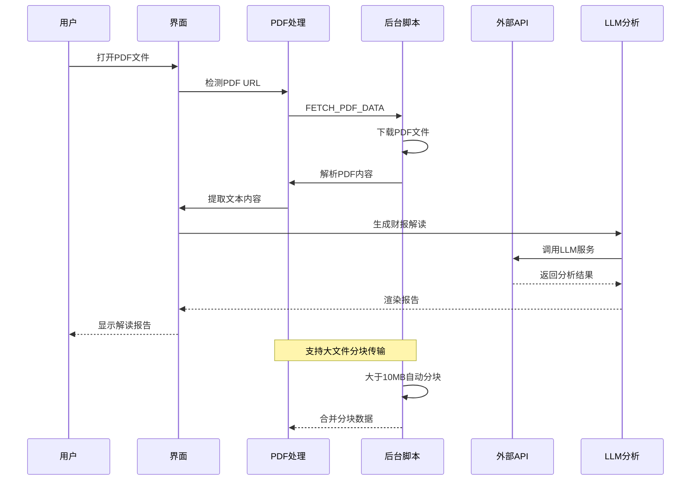

**图表来源**
- [sidepanel.js:2613-2697](file://sidebar/sidepanel.js#L2613-L2697)
- [background.js:125-177](file://background/background.js#L125-L177)

#### 财报数据提取流程

系统支持多种财报数据源的提取和整合：

| 数据类型 | 获取方式 | 数据源 | 用途 |
|----------|----------|--------|------|
| 实时行情 | 东方财富API | push2.eastmoney.com | 股价、涨跌幅、PE/PB |
| 财务指标 | 东方财富API | datacenter-web.eastmoney.com | 主要财务指标 |
| 利润表 | 东方财富API | datacenter-web.eastmoney.com | 收入、成本、利润 |
| 资产负债表 | 东方财富API | datacenter-web.eastmoney.com | 资产、负债、权益 |
| 现金流量表 | 东方财富API | datacenter-web.eastmoney.com | 经营、投资、筹资现金流 |
| 历史趋势 | 多期API调用 | datacenter-web.eastmoney.com | 趋势分析和对比 |

**章节来源**
- [sidepanel.js:2896-3010](file://sidebar/sidepanel.js#L2896-L3010)
- [sidepanel.js:3016-3288](file://sidebar/sidepanel.js#L3016-L3288)

### 估值计算器模块

估值计算器模块提供了五种经典估值方法的可视化实现：

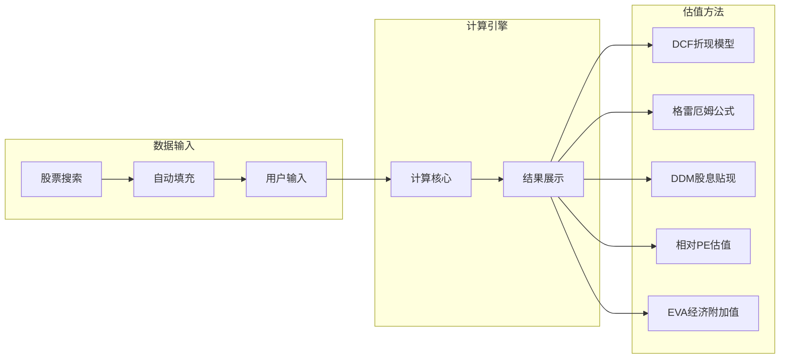

**图表来源**
- [sidepanel.js:846-901](file://sidebar/sidepanel.js#L846-L901)

#### 估值方法对比

| 估值方法 | 核心公式 | 适用场景 | 优点 | 局限性 |
|----------|----------|----------|------|--------|
| DCF折现 | 两阶段FCF折现 + 永续终值 | 成长期/成熟期企业 | 贴现现金流理论基础 | 参数敏感性强 |
| 格雷厄姆 | V = EPS × (8.5+2g) × 4.4/Y | 价值型/深度低估 | 简单易懂，安全边际 | 假设过于简化 |
| DDM股息 | V = D1 / (r - g) | 稳定分红的成熟企业 | 适合稳定分红股 | 仅适用于分红稳定公司 |
| 相对PE/PB | PE估值 + PB估值 均值 | 有可比同行的企业 | 快速比较，直观明了 | 同行可比性要求高 |
| EVA经济附加值 | 价值 = IC + Σ(ROIC-WACC)×IC/(1+WACC)^t | 资本效率型分析 | 注重经济利润 | 计算复杂，参数难确定 |

**章节来源**
- [sidepanel.js:846-901](file://sidebar/sidepanel.js#L846-L901)

### AI对话模块

AI对话模块实现了流式输出的智能问答功能：

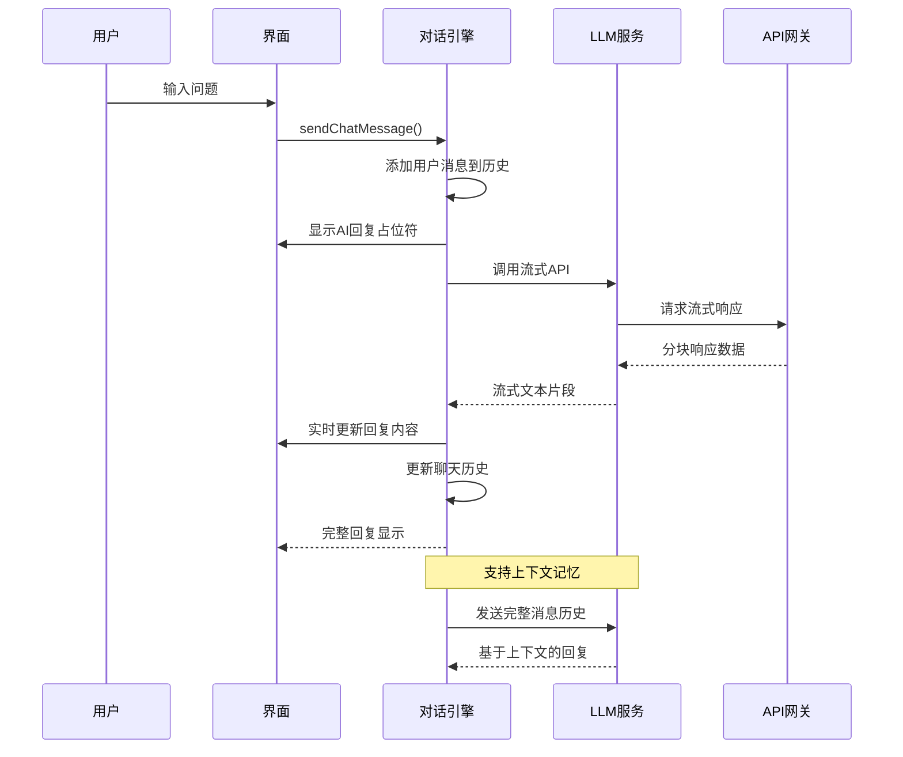

**图表来源**
- [sidepanel.js:3763-3801](file://sidebar/sidepanel.js#L3763-L3801)
- [sidepanel.js:3397-3425](file://sidebar/sidepanel.js#L3397-L3425)

**章节来源**
- [sidepanel.js:3763-3801](file://sidebar/sidepanel.js#L3763-L3801)

## 依赖分析

### 外部依赖关系

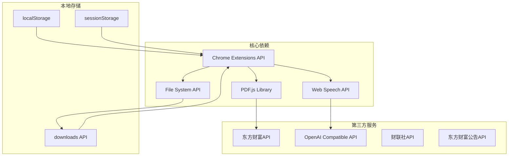

**图表来源**
- [manifest.json:6-12](file://manifest.json#L6-L12)
- [sidepanel.js:2567-2583](file://sidebar/sidepanel.js#L2567-L2583)

### 模块间耦合关系

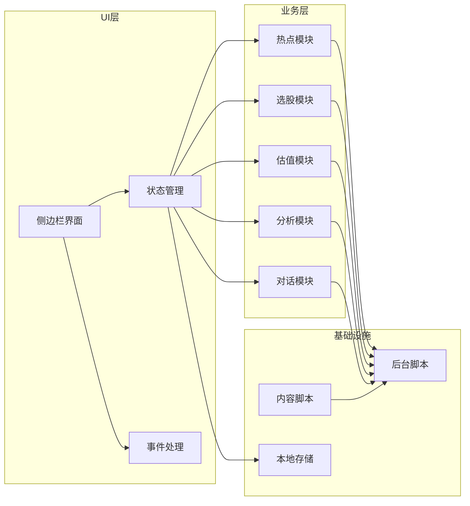

**图表来源**
- [sidepanel.js:591-607](file://sidebar/sidepanel.js#L591-L607)
- [background.js:12-19](file://background/background.js#L12-L19)

**章节来源**
- [manifest.json:6-12](file://manifest.json#L6-L12)
- [sidepanel.js:591-607](file://sidebar/sidepanel.js#L591-L607)

## 性能考虑

### 内存管理策略

系统采用了多项内存优化措施：

1. **状态清理机制**：在标签切换时自动清理不需要的状态数据
2. **事件监听器管理**：及时移除不再使用的事件监听器
3. **DOM元素复用**：通过模板复用减少DOM节点创建
4. **图片和媒体资源**：延迟加载和及时释放

### 网络请求优化

```mermaid
flowchart TD
A[用户发起请求] --> B{请求类型}
B --> |热点数据| C[并行请求多个数据源]
B --> |股票搜索| D[防抖处理(300ms)]
B --> |PDF下载| E[分块传输(>10MB)]
B --> |LLM调用| F[流式响应处理]
C --> G[请求去重]
D --> H[智能缓存]
E --> I[进度反馈]
F --> J[实时渲染]
G --> K[合并结果]
H --> L[减少请求次数]
I --> M[用户体验优化]
J --> N[流畅体验]
```

**图表来源**
- [sidepanel.js:1324-1333](file://sidebar/sidepanel.js#L1324-L1333)
- [sidepanel.js:3427-3452](file://sidebar/sidepanel.js#L3427-L3452)

### 响应式设计

系统实现了完整的响应式布局：

| 设备类型 | 屏幕宽度 | 布局特点 | 交互方式 |
|----------|----------|----------|----------|
| 桌面端 | ≥768px | 四列布局，完整功能 | 鼠标点击，键盘快捷键 |
| 平板端 | 480-767px | 三列布局，功能精简 | 触摸手势，点击操作 |
| 移动端 | <480px | 单列布局，滚动浏览 | 触摸滑动，手势操作 |

**章节来源**
- [sidepanel.css:1-800](file://sidebar/sidepanel.css#L1-L800)

## 故障排除指南

### 常见问题诊断

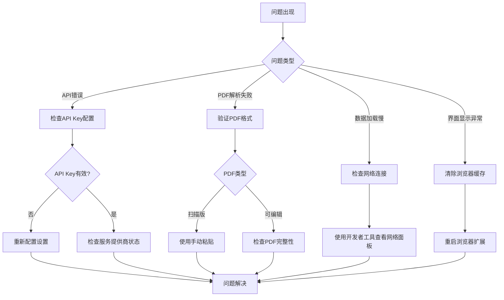

**图表来源**
- [sidepanel.js:2551-2562](file://sidebar/sidepanel.js#L2551-L2562)
- [sidepanel.js:3343-3357](file://sidebar/sidepanel.js#L3343-L3357)

### 错误处理机制

系统建立了完善的错误处理体系：

1. **网络错误处理**：自动重试机制和用户友好的错误提示
2. **API调用错误**：详细的错误信息收集和上报
3. **UI渲染错误**：优雅降级和备用方案
4. **资源加载错误**：渐进增强和功能降级

**章节来源**
- [sidepanel.js:2551-2562](file://sidebar/sidepanel.js#L2551-L2562)
- [sidepanel.js:3343-3357](file://sidebar/sidepanel.js#L3343-L3357)

## 结论

投资助手侧边栏界面模块展现了现代Web应用的优秀实践，通过精心设计的状态管理、事件处理和UI组件协调，实现了复杂业务逻辑的高效执行。模块具有以下特点：

1. **架构清晰**：采用分层架构，职责分离明确
2. **扩展性强**：支持多策略融合和自定义配置
3. **用户体验优秀**：响应式设计和流畅的交互体验
4. **性能优化到位**：内存管理和网络请求优化
5. **可靠性高**：完善的错误处理和故障恢复机制

该模块为投资决策提供了强大的AI辅助工具，是Chrome扩展开发的优秀范例。

## 附录

### API接口定义

| 接口名称 | 方法 | URL | 请求参数 | 响应数据 |
|----------|------|-----|----------|----------|
| 获取热点数据 | GET | /nodeapi/updateTelegraphList | app, os, sv | 财联社电报数据 |
| 股票搜索 | GET | /api/suggest/get | input, type, count | 股票匹配结果 |
| 财报数据 | GET | /api/data/v1/get | reportName, filter | 财务报表数据 |
| LLM调用 | POST | /chat/completions | model, messages, stream | AI分析结果 |

### 配置选项

| 配置项 | 类型 | 默认值 | 描述 |
|--------|------|--------|------|
| provider | string | 'deepseek' | LLM服务提供商 |
| baseUrl | string | 'https://api.deepseek.com/v1' | API基础URL |
| apiKey | string | '' | 服务密钥 |
| model | string | 'deepseek-chat' | 模型名称 |
| interval | number | 5 | 自动刷新间隔(分钟) |
| clsEnabled | boolean | true | 财联社数据源启用 |
| eastmoneyEnabled | boolean | true | 东方财富数据源启用 |

### 开发规范

1. **代码风格**：采用ES6+语法，模块化设计
2. **命名约定**：变量使用驼峰命名，函数使用动宾结构
3. **错误处理**：每个异步操作都有对应的错误处理
4. **性能优化**：使用防抖、节流和缓存机制
5. **安全性**：敏感信息加密存储，API调用鉴权