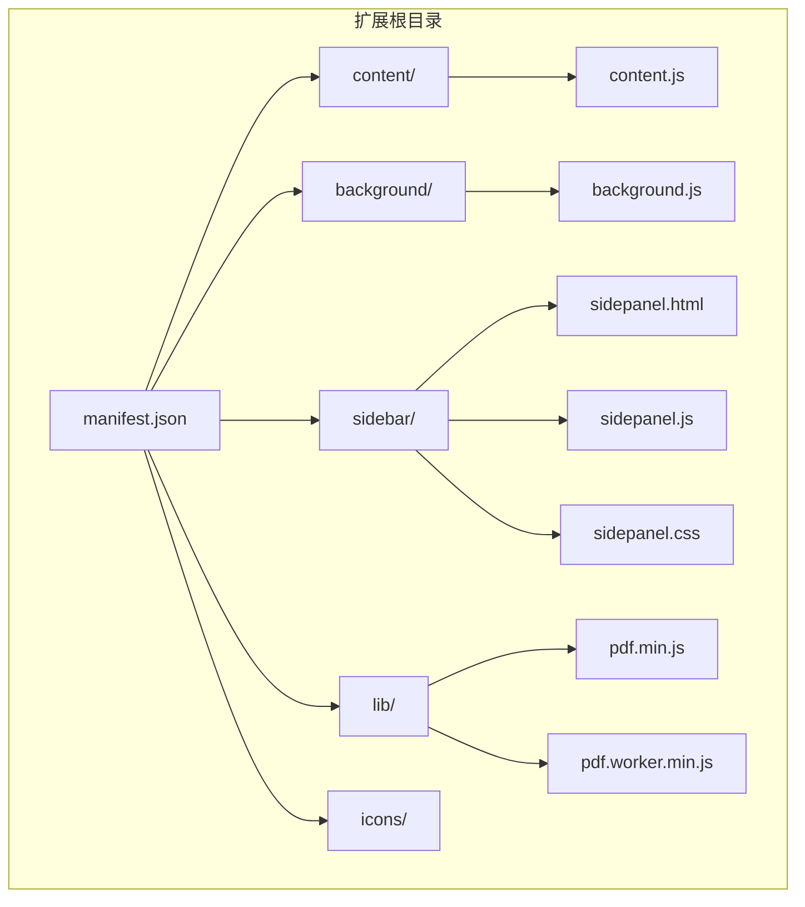
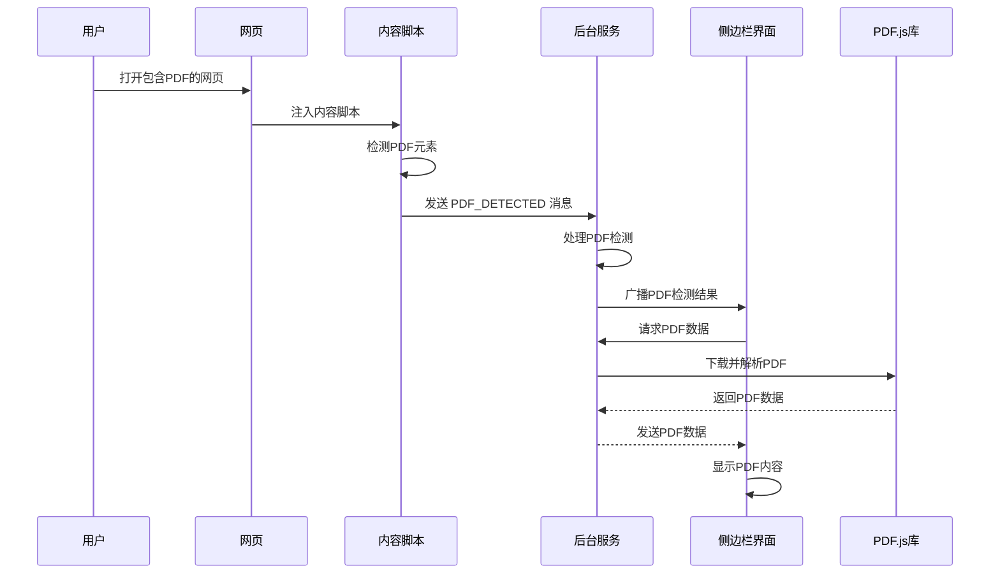
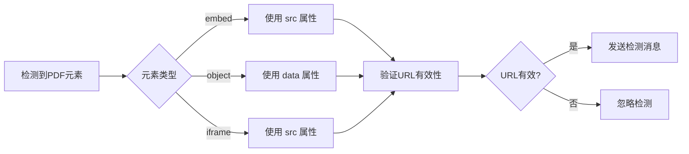
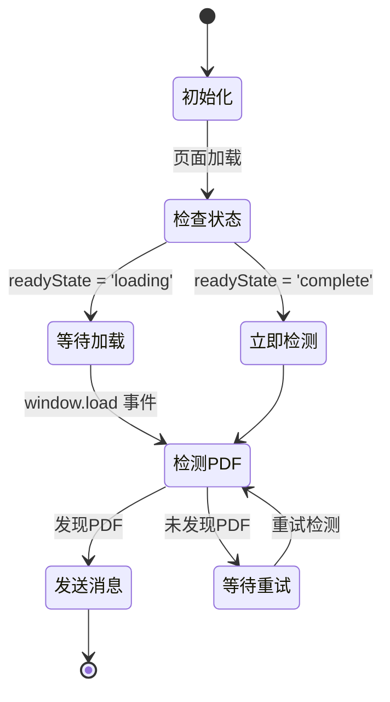
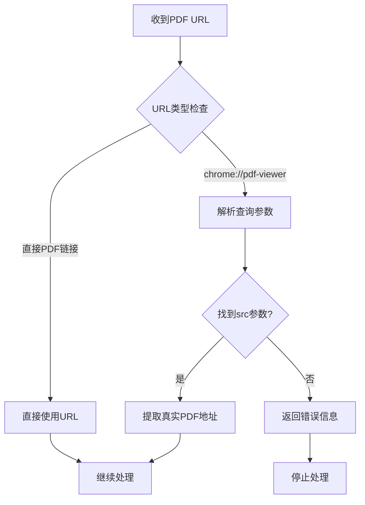
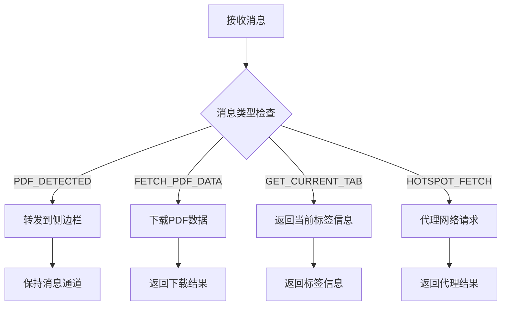
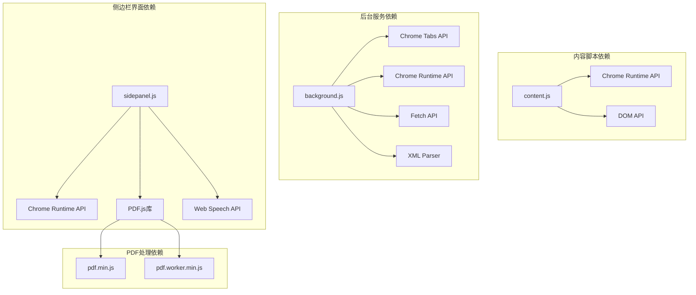
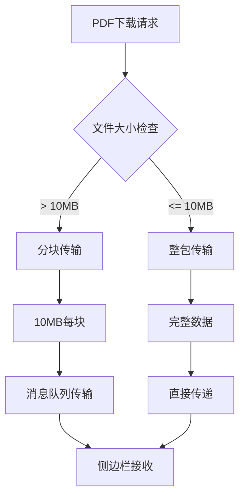

# 内容脚本模块

<cite>
**本文档引用的文件**
- [content.js](file://content/content.js)
- [background.js](file://background/background.js)
- [manifest.json](file://manifest.json)
- [sidepanel.js](file://sidebar/sidepanel.js)
- [sidepanel.html](file://sidebar/sidepanel.html)
- [pdf.min.js](file://lib/pdf.min.js)
- [README.md](file://README.md)
</cite>

## 目录
1. [简介](#简介)
2. [项目结构](#项目结构)
3. [核心组件](#核心组件)
4. [架构概览](#架构概览)
5. [详细组件分析](#详细组件分析)
6. [依赖分析](#依赖分析)
7. [性能考虑](#性能考虑)
8. [故障排除指南](#故障排除指南)
9. [结论](#结论)

## 简介

内容脚本模块是 Chrome 扩展中的轻量级组件，专门负责在网页环境中检测嵌入式 PDF 文件。该模块采用最小化设计，专注于单一职责：识别网页中的 PDF 嵌入元素并向后台服务发送检测通知。

该模块的设计充分考虑了 Chrome 浏览器的安全模型，特别是 Chrome PDF 查看器的特殊性。由于 Chrome 内置 PDF 查看器（chrome://pdf-viewer/）无法注入内容脚本，因此内容脚本仅作为补充信号源，真正的 PDF 下载和解析在后台服务中完成。

## 项目结构

项目采用模块化架构，内容脚本位于 `content/` 目录下，与后台服务、侧边栏界面和其他组件分离：



**图表来源**
- [manifest.json:1-48](file://manifest.json#L1-L48)
- [content.js:1-36](file://content/content.js#L1-L36)
- [background.js:1-307](file://background/background.js#L1-L307)

**章节来源**
- [manifest.json:1-48](file://manifest.json#L1-L48)
- [README.md:108-126](file://README.md#L108-L126)

## 核心组件

### 内容脚本核心功能

内容脚本模块实现了三个核心功能：

1. **PDF 元素检测**：扫描网页中的 embed、object、iframe 元素
2. **URL 提取**：从检测到的 PDF 元素中提取实际的 PDF 地址
3. **消息通信**：通过 Chrome runtime API 向后台服务发送检测结果

### 检测算法实现

```mermaid
flowchart TD
Start([页面加载检测]) --> CheckReady{document.readyState}
CheckReady --> |complete| DetectPDF[检测 PDF 元素]
CheckReady --> |loading| WaitLoad[等待 load 事件]
WaitLoad --> DetectPDF
DetectPDF --> FindEmbed[查找 embed[type='application/pdf']]
FindEmbed --> FindObj[查找 object[type='application/pdf']]
FindObj --> FindIframe[查找 iframe[src*='.pdf']]
FindIframe --> ExtractURL{提取 URL}
ExtractURL --> |成功| SendMsg[发送消息到后台]
ExtractURL --> |失败| NoPDF[无 PDF 检测]
SendMsg --> End([结束])
NoPDF --> End
```

**图表来源**
- [content.js:12-28](file://content/content.js#L12-L28)

### 通信协议设计

内容脚本与后台服务之间的通信采用标准化的消息传递机制：

| 消息类型 | 发送方 | 接收方 | 数据结构 | 用途 |
|---------|--------|--------|----------|------|
| PDF_DETECTED | content.js | background.js | `{ url, title }` | PDF 检测通知 |
| FETCH_PDF_DATA | sidepanel.js | background.js | `{ url }` | PDF 数据请求 |
| GET_CURRENT_TAB | sidepanel.js | background.js | `null` | 获取当前标签信息 |
| HOTSPOT_FETCH | sidepanel.js | background.js | `{ url, options }` | 代理网络请求 |

**章节来源**
- [content.js:22-27](file://content/content.js#L22-L27)
- [background.js:37-117](file://background/background.js#L37-L117)

## 架构概览

内容脚本模块在整个扩展架构中扮演着桥梁角色，连接网页环境和后台服务：



**图表来源**
- [content.js:1-36](file://content/content.js#L1-L36)
- [background.js:21-34](file://background/background.js#L21-L34)
- [sidepanel.js:974-979](file://sidebar/sidepanel.js#L974-L979)

## 详细组件分析

### PDF 检测算法

内容脚本实现了多层检测机制，确保能够识别各种形式的 PDF 嵌入：

#### 元素类型检测

| 元素类型 | 属性检测 | 用途 |
|---------|----------|------|
| embed | `type="application/pdf"` | 标准 PDF 嵌入 |
| object | `type="application/pdf"` | 兼容性支持 |
| iframe | `src` 包含 `.pdf` | PDF 文件直接加载 |

#### URL 提取策略



**图表来源**
- [content.js:12-21](file://content/content.js#L12-L21)

#### 页面加载状态处理

内容脚本智能处理页面的不同加载阶段：



**图表来源**
- [content.js:30-35](file://content/content.js#L30-L35)

**章节来源**
- [content.js:11-35](file://content/content.js#L11-L35)

### Chrome PDF 查看器兼容性

内容脚本模块特别处理了 Chrome 内置 PDF 查看器的特殊性：

#### URL 处理机制

Chrome PDF 查看器使用特殊的 URL 格式：
```
chrome://pdf-viewer/?src=https://example.com/file.pdf
```

后台服务需要从这种格式中提取真实的 PDF 地址。

#### 兼容性策略



**图表来源**
- [background.js:125-137](file://background/background.js#L125-L137)

**章节来源**
- [content.js:6-8](file://content/content.js#L6-L8)
- [background.js:125-137](file://background/background.js#L125-L137)

### 消息路由系统

后台服务实现了复杂的消息路由机制，支持多种消息类型：

#### 消息处理流程



**图表来源**
- [background.js:37-117](file://background/background.js#L37-L117)

**章节来源**
- [background.js:37-117](file://background/background.js#L37-L117)

## 依赖分析

### 外部依赖关系

内容脚本模块的依赖关系相对简单，主要依赖于 Chrome 扩展 API：



**图表来源**
- [content.js:1-36](file://content/content.js#L1-L36)
- [background.js:1-307](file://background/background.js#L1-L307)
- [sidepanel.js:1-800](file://sidebar/sidepanel.js#L1-L800)

### 权限和安全模型

扩展权限配置体现了最小权限原则：

| 权限类型 | 权限名称 | 用途 | 安全级别 |
|---------|----------|------|----------|
| 主要权限 | sidePanel | 打开侧边栏 | 高 |
| 主要权限 | activeTab | 访问当前标签 | 中 |
| 主要权限 | scripting | 注入脚本 | 高 |
| 主要权限 | storage | 本地存储 | 中 |
| 主要权限 | downloads | 文件下载 | 中 |
| 主机权限 | <all_urls> | 通用网络访问 | 高 |

**章节来源**
- [manifest.json:6-15](file://manifest.json#L6-L15)

## 性能考虑

### 内存使用优化

内容脚本模块在内存使用方面采用了多项优化策略：

1. **延迟初始化**：仅在页面完全加载后才执行 PDF 检测
2. **一次性检测**：避免重复扫描相同的 DOM 元素
3. **异步处理**：所有网络请求都采用异步方式处理

### 网络性能优化

后台服务在处理 PDF 下载时采用了分块传输机制：



**图表来源**
- [background.js:159-167](file://background/background.js#L159-L167)

### 并发处理能力

系统支持多标签页并发处理：

- **独立的后台服务**：每个标签页的 PDF 检测相互独立
- **消息队列机制**：确保消息按顺序正确处理
- **资源隔离**：避免内存泄漏和资源竞争

## 故障排除指南

### 常见问题诊断

#### PDF 检测失败

**症状**：内容脚本无法检测到网页中的 PDF

**可能原因**：
1. PDF 通过 JavaScript 动态加载
2. PDF 通过第三方插件渲染
3. PDF URL 采用特殊编码格式

**解决方案**：
1. 检查 PDF 是否在页面加载完成后才出现
2. 确认 PDF URL 格式是否符合预期
3. 验证 Chrome PDF 查看器的兼容性

#### 消息通信异常

**症状**：侧边栏无法显示 PDF 检测结果

**可能原因**：
1. 后台服务未正确启动
2. 消息格式不匹配
3. Chrome runtime API 权限问题

**解决方案**：
1. 检查扩展是否正确安装
2. 验证消息格式和数据结构
3. 确认扩展权限配置

#### 性能问题

**症状**：扩展运行缓慢或占用过多内存

**可能原因**：
1. 大量 PDF 文件同时加载
2. 内存泄漏
3. 重复的 DOM 操作

**解决方案**：
1. 实施 PDF 检测缓存机制
2. 优化内存使用和垃圾回收
3. 减少不必要的 DOM 查询

**章节来源**
- [content.js:1-36](file://content/content.js#L1-L36)
- [background.js:1-307](file://background/background.js#L1-L307)

## 结论

内容脚本模块虽然设计简洁，但在整个扩展架构中发挥着关键作用。其核心优势包括：

1. **专注性**：单一职责确保了代码的简洁性和可靠性
2. **兼容性**：充分考虑了 Chrome 浏览器的各种特殊情况
3. **扩展性**：清晰的消息通信接口便于功能扩展
4. **安全性**：遵循最小权限原则，保护用户隐私

该模块的成功实施展示了如何在 Chrome 扩展环境中优雅地处理复杂的浏览器兼容性问题，为用户提供无缝的 PDF 检测体验。通过与其他组件的紧密协作，内容脚本模块构成了整个投资助手扩展的重要基础设施。