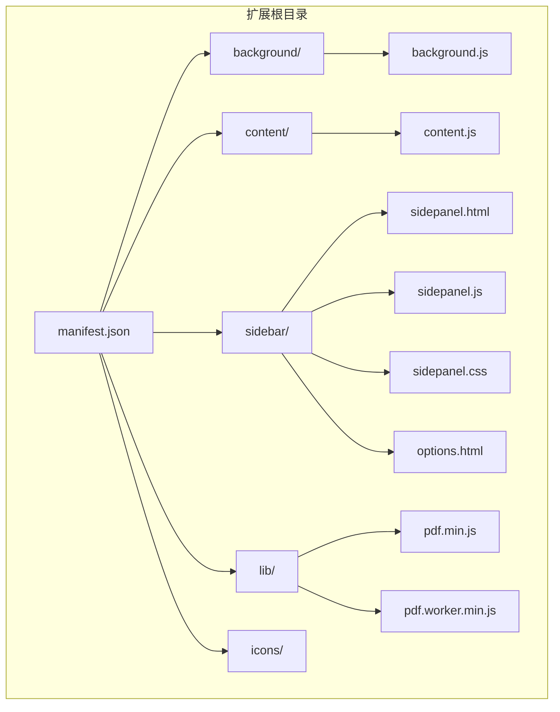
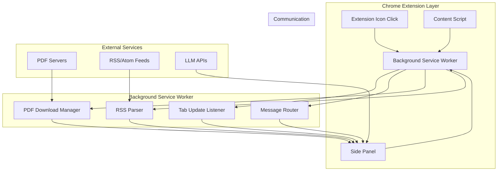
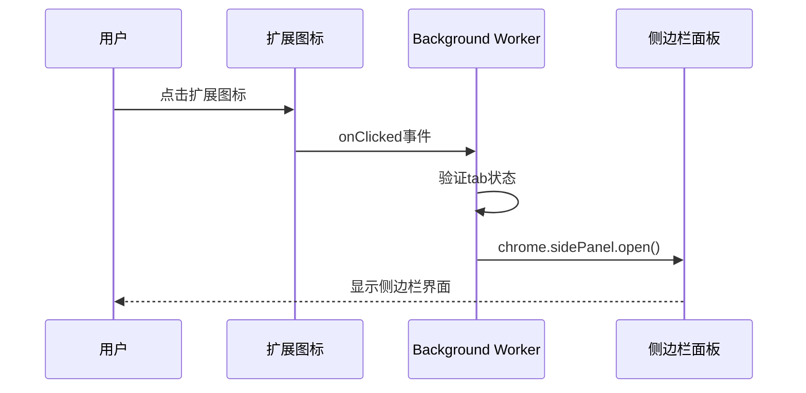
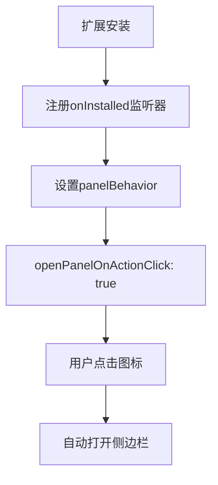
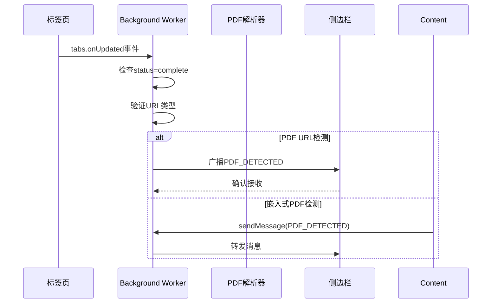
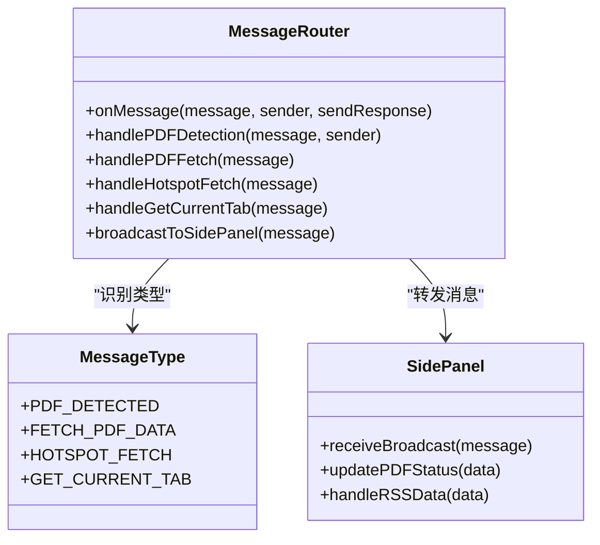
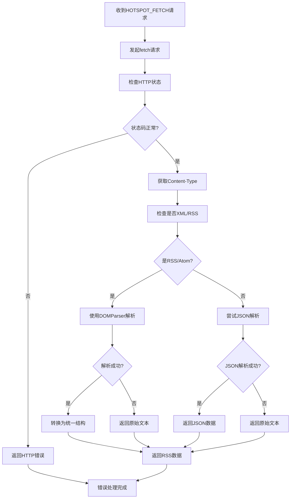
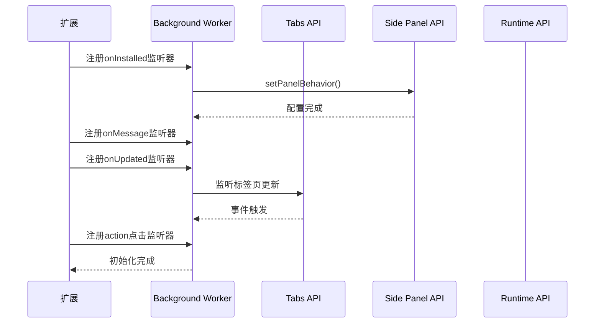
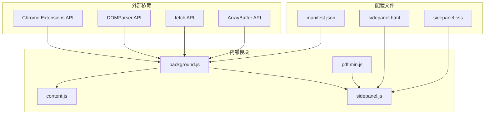

# 服务工作线程模块

<cite>
**本文档引用的文件**
- [background.js](file://background/background.js)
- [manifest.json](file://manifest.json)
- [sidepanel.js](file://sidebar/sidepanel.js)
- [content.js](file://content/content.js)
- [sidepanel.html](file://sidebar/sidepanel.html)
- [sidepanel.css](file://sidebar/sidepanel.css)
- [pdf.min.js](file://lib/pdf.min.js)
- [README.md](file://README.md)
</cite>

## 目录
1. [简介](#简介)
2. [项目结构](#项目结构)
3. [核心组件](#核心组件)
4. [架构概览](#架构概览)
5. [详细组件分析](#详细组件分析)
6. [依赖关系分析](#依赖关系分析)
7. [性能考虑](#性能考虑)
8. [故障排除指南](#故障排除指南)
9. [结论](#结论)

## 简介

服务工作线程模块是投资助手Chrome扩展的核心后台处理引擎，负责管理扩展的后台功能，包括PDF文件检测、数据下载、消息路由和侧边栏控制。该模块采用Chrome Extension Manifest V3标准，利用Service Worker技术实现高效的后台处理能力。

## 项目结构

该项目采用模块化设计，主要包含以下核心目录和文件：



**图表来源**
- [manifest.json:1-48](file://manifest.json#L1-L48)
- [background.js:1-307](file://background/background.js#L1-L307)

**章节来源**
- [manifest.json:1-48](file://manifest.json#L1-L48)
- [README.md:108-126](file://README.md#L108-L126)

## 核心组件

服务工作线程模块包含以下关键组件：

### 1. 扩展图标点击处理器
- 监听扩展图标点击事件
- 自动打开侧边栏面板
- 配置侧边栏行为

### 2. PDF检测系统
- 监听标签页更新事件
- 检测PDF文件URL
- 处理Chrome PDF查看器URL
- 通知侧边栏PDF发现

### 3. 消息路由中心
- 处理来自不同模块的消息
- 实现跨模块通信
- 管理异步响应

### 4. 数据下载代理
- 绕过CORS限制
- 下载PDF二进制数据
- 处理大文件分块传输
- 支持POST请求

### 5. RSS/Atom解析器
- 解析XML格式数据
- 标准化数据结构
- 支持多种RSS版本

**章节来源**
- [background.js:11-177](file://background/background.js#L11-L177)
- [background.js:36-117](file://background/background.js#L36-L117)
- [background.js:188-306](file://background/background.js#L188-L306)

## 架构概览

服务工作线程模块采用分层架构设计，实现了清晰的职责分离：



**图表来源**
- [background.js:12-117](file://background/background.js#L12-L117)
- [content.js:11-28](file://content/content.js#L11-L28)
- [sidepanel.js:589-607](file://sidebar/sidepanel.js#L589-L607)

## 详细组件分析

### 扩展图标点击事件处理

扩展图标点击事件处理是服务工作线程模块的入口点，负责启动侧边栏功能：



**图表来源**
- [background.js:12-14](file://background/background.js#L12-L14)

该处理机制具有以下特点：
- 异步处理确保用户体验流畅
- 自动验证tab有效性
- 与Chrome侧边栏API无缝集成

**章节来源**
- [background.js:12-19](file://background/background.js#L12-L19)

### 侧边栏打开控制

侧边栏控制功能通过Chrome的Side Panel API实现，提供灵活的面板管理：



**图表来源**
- [background.js:17-19](file://background/background.js#L17-L19)
- [manifest.json:16-18](file://manifest.json#L16-L18)

**章节来源**
- [background.js:17-19](file://background/background.js#L17-L19)

### PDF检测机制

PDF检测机制通过监听标签页更新事件，自动识别PDF文件：



**图表来源**
- [background.js:21-34](file://background/background.js#L21-L34)
- [content.js:11-28](file://content/content.js#L11-L28)

PDF检测支持以下URL格式：
- 直接PDF链接：`.pdf`
- 查询参数PDF：`*.pdf?*`
- 锚点PDF：`*.pdf#*`
- Chrome PDF查看器：`chrome://pdf-viewer/`

**章节来源**
- [background.js:21-34](file://background/background.js#L21-L34)
- [content.js:11-28](file://content/content.js#L11-L28)

### 消息路由系统

消息路由系统是服务工作线程模块的核心通信中枢，处理来自不同模块的消息：



**图表来源**
- [background.js:37-117](file://background/background.js#L37-L117)

消息路由支持以下消息类型：

| 消息类型 | 描述 | 参数 | 返回值 |
|---------|------|------|--------|
| PDF_DETECTED | PDF文件检测通知 | `{url, title, tabId}` | `{status: 'ok'}` |
| FETCH_PDF_DATA | PDF数据下载请求 | `url` | `{data: Array, source: 'background'}` |
| HOTSPOT_FETCH | RSS/Atom数据获取 | `{url, options}` | `{data: Object, format: String}` |
| GET_CURRENT_TAB | 获取当前标签信息 | 无 | `{...tabInfo}` |

**章节来源**
- [background.js:37-117](file://background/background.js#L37-L117)

### PDF下载处理流程

PDF下载处理流程实现了绕过CORS限制的二进制数据下载：

```mermaid
flowchart TD
A[收到FETCH_PDF_DATA请求] --> B[解析URL类型]
B --> C{是否chrome://pdf-viewer?}
C --> |是| D[提取实际PDF URL]
C --> |否| E[使用原始URL]
D --> F[发起fetch请求]
E --> F
F --> G[检查HTTP状态]
G --> H{状态码正常?}
H --> |否| I[返回错误信息]
H --> |是| J[检查Content-Type]
J --> K[转换为ArrayBuffer]
K --> L{文件大小>10MB?}
L --> |是| M[分块传输(10MB/块)]
L --> |否| N[直接传输]
M --> O[返回chunks数组]
N --> P[返回data数组]
I --> Q[错误处理完成]
O --> Q
P --> Q
```

**图表来源**
- [background.js:125-177](file://background/background.js#L125-L177)

PDF下载的关键特性：
- **CORS绕过**：利用background权限访问任意URL
- **二进制处理**：使用ArrayBuffer确保数据完整性
- **大文件优化**：超过10MB自动分块传输
- **Chrome PDF支持**：自动解析chrome://pdf-viewer URL

**章节来源**
- [background.js:125-177](file://background/background.js#L125-L177)

### RSS/Atom数据源解析

RSS/Atom数据源解析功能提供了强大的XML数据处理能力：



**图表来源**
- [background.js:65-116](file://background/background.js#L65-L116)
- [background.js:192-251](file://background/background.js#L192-L251)

RSS/Atom解析支持的数据格式：
- **RSS 2.0**：支持多个频道和项目
- **Atom**：支持标准Atom格式
- **XML**：通用XML格式支持
- **JSON**：自动JSON格式检测

**章节来源**
- [background.js:65-116](file://background/background.js#L65-L116)
- [background.js:192-251](file://background/background.js#L192-L251)

### 模块初始化流程

服务工作线程模块的初始化流程确保了所有功能的正确配置：



**图表来源**
- [background.js:17-19](file://background/background.js#L17-L19)
- [background.js:37-37](file://background/background.js#L37-L37)
- [background.js:21-21](file://background/background.js#L21-L21)
- [background.js:12-12](file://background/background.js#L12-L12)

**章节来源**
- [background.js:17-19](file://background/background.js#L17-L19)

## 依赖关系分析

服务工作线程模块的依赖关系体现了清晰的架构设计：



**图表来源**
- [background.js:1-307](file://background/background.js#L1-L307)
- [manifest.json:1-48](file://manifest.json#L1-L48)

**章节来源**
- [manifest.json:6-15](file://manifest.json#L6-L15)

## 性能考虑

服务工作线程模块在设计时充分考虑了性能优化：

### 1. 内存管理
- **大文件分块传输**：超过10MB的PDF自动分块，避免内存溢出
- **及时释放资源**：使用ArrayBuffer后及时清理
- **异步处理**：所有耗时操作采用异步执行

### 2. 网络优化
- **CORS绕过**：利用background权限避免跨域限制
- **缓存策略**：合理使用浏览器缓存机制
- **连接复用**：复用HTTP连接减少延迟

### 3. 事件处理
- **事件去抖**：对频繁触发的事件进行去抖处理
- **批量处理**：合并相似的事件处理
- **超时控制**：设置合理的操作超时时间

### 4. 内存优化
- **对象池**：复用临时对象减少GC压力
- **懒加载**：按需加载非关键功能
- **内存监控**：定期检查内存使用情况

## 故障排除指南

### 常见问题及解决方案

#### 1. PDF下载失败
**问题症状**：PDF下载返回错误信息
**可能原因**：
- 目标服务器拒绝访问
- URL格式不正确
- 网络连接问题

**解决步骤**：
1. 检查目标URL的有效性
2. 验证网络连接状态
3. 确认目标服务器允许访问

#### 2. RSS解析错误
**问题症状**：RSS数据解析失败
**可能原因**：
- XML格式不规范
- 编码格式不支持
- 网络请求超时

**解决步骤**：
1. 验证XML格式的正确性
2. 检查字符编码设置
3. 重试网络请求

#### 3. 消息通信失败
**问题症状**：消息无法正确传递
**可能原因**：
- 侧边栏未打开
- 消息格式不正确
- 权限配置问题

**解决步骤**：
1. 确认侧边栏状态
2. 验证消息格式
3. 检查扩展权限

**章节来源**
- [background.js:173-176](file://background/background.js#L173-L176)
- [background.js:98-100](file://background/background.js#L98-L100)

### 调试技巧

#### 1. 日志记录
- 使用`console.log`记录关键操作
- 捕获并记录异常信息
- 监控内存使用情况

#### 2. 状态监控
- 监控标签页状态变化
- 跟踪消息传递过程
- 检查网络请求状态

#### 3. 性能分析
- 使用Chrome DevTools分析性能
- 监控内存泄漏
- 优化事件处理逻辑

## 结论

服务工作线程模块展现了现代Chrome扩展开发的最佳实践，通过精心设计的架构实现了高效、可靠的后台处理能力。该模块的主要优势包括：

### 技术优势
- **架构清晰**：职责分离，模块化设计
- **性能优异**：异步处理，内存优化
- **功能完整**：涵盖PDF处理、数据解析、消息通信等核心功能
- **扩展性强**：易于添加新功能和第三方集成

### 设计亮点
- **CORS绕过**：巧妙利用background权限解决跨域问题
- **智能检测**：自动识别各种PDF格式和来源
- **统一接口**：标准化的消息路由系统
- **错误处理**：完善的异常处理和恢复机制

### 应用价值
该模块为投资助手扩展提供了坚实的技术基础，支持复杂的PDF处理、RSS数据获取和实时消息通信等功能，为用户提供了一站式的投资分析解决方案。

通过持续的优化和维护，服务工作线程模块将继续为扩展的发展提供强有力的技术支撑，为用户创造更大的价值。