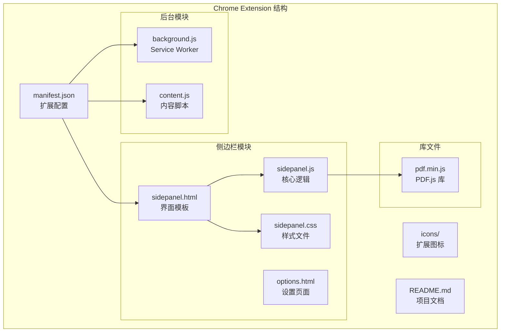
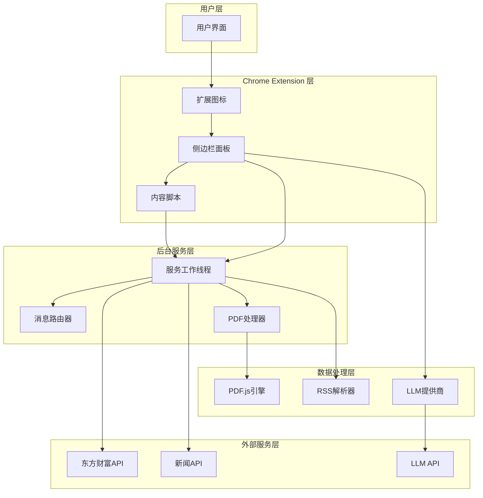
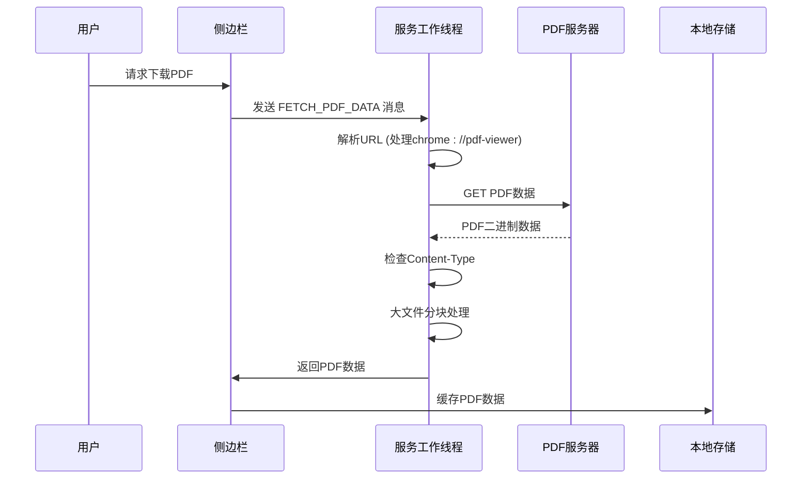
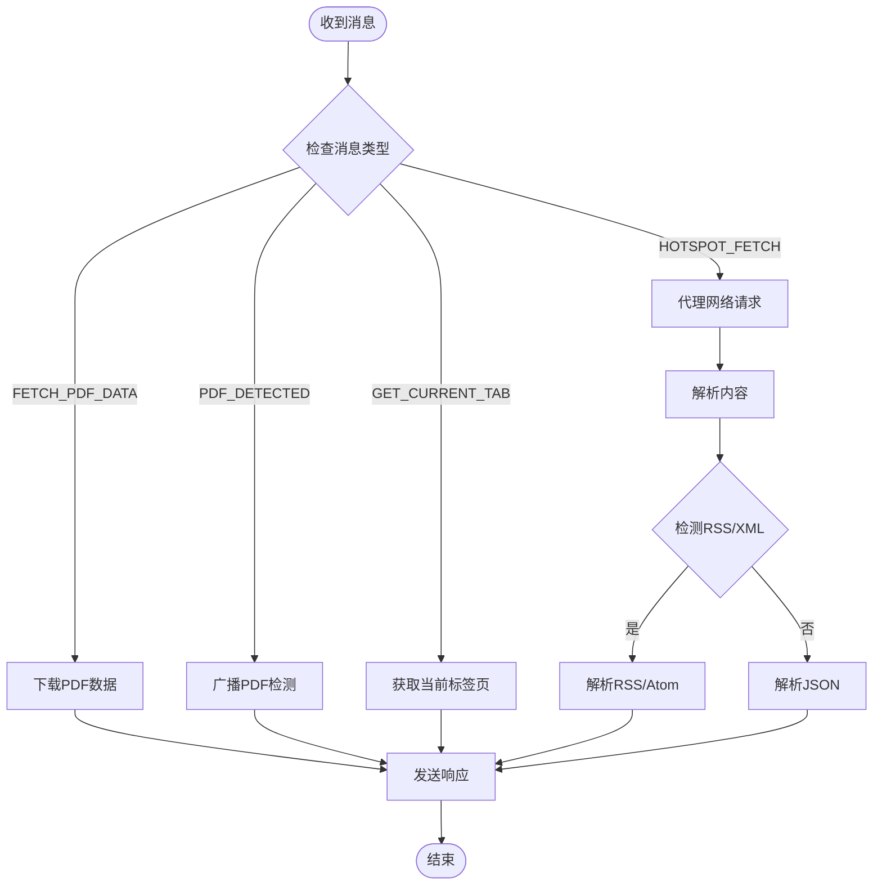
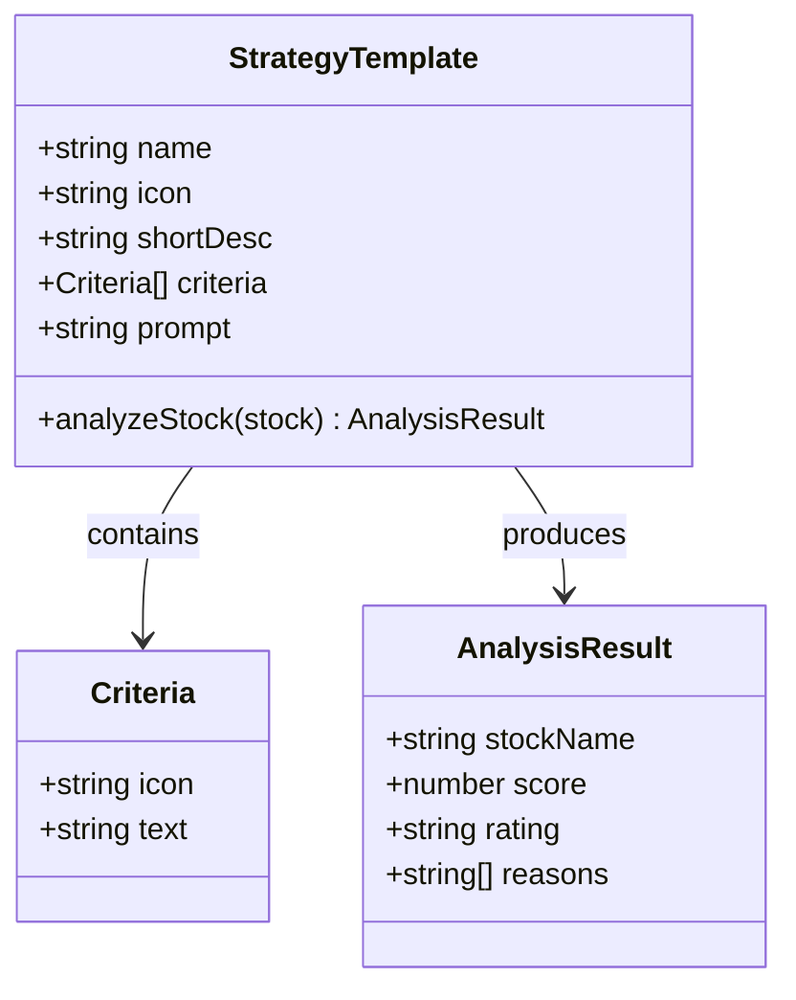
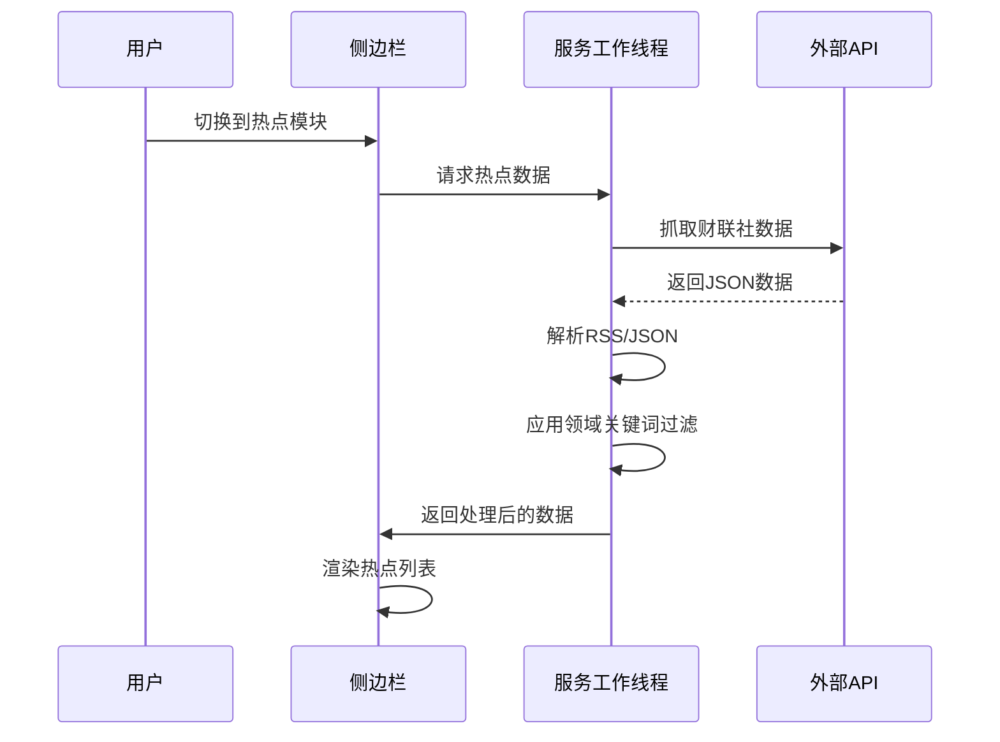
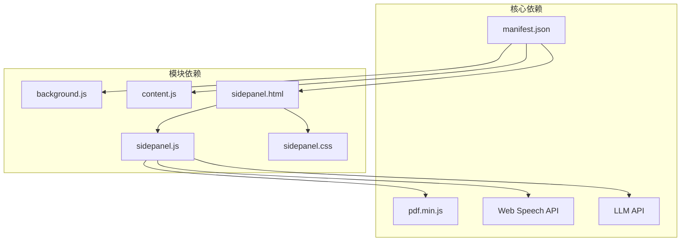
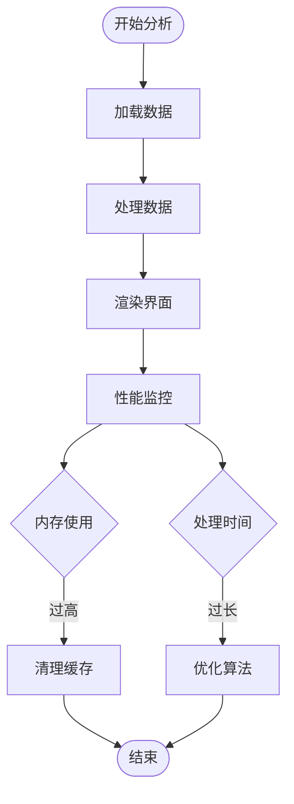

# 核心模块设计

<cite>
**本文档引用的文件**
- [manifest.json](file://manifest.json)
- [background.js](file://background/background.js)
- [content.js](file://content/content.js)
- [sidepanel.js](file://sidebar/sidepanel.js)
- [sidepanel.html](file://sidebar/sidepanel.html)
- [sidepanel.css](file://sidebar/sidepanel.css)
- [options.html](file://sidebar/options.html)
- [pdf.min.js](file://lib/pdf.min.js)
- [README.md](file://README.md)
</cite>

## 目录
1. [简介](#简介)
2. [项目结构](#项目结构)
3. [核心组件](#核心组件)
4. [架构概览](#架构概览)
5. [详细组件分析](#详细组件分析)
6. [依赖关系分析](#依赖关系分析)
7. [性能考虑](#性能考虑)
8. [故障排除指南](#故障排除指南)
9. [结论](#结论)

## 简介

投资助手是一个基于 Chrome Extension Manifest V3 的投资分析工具，集成了多个核心功能模块。该项目采用现代前端技术栈，提供了从 PDF 财报解读到多策略选股器的完整投资决策支持系统。

**主要功能模块**：
- **服务工作线程模块**：负责 PDF 下载处理、消息路由和后台任务管理
- **内容脚本模块**：检测 PDF 元素、页面交互和数据提取
- **侧边栏界面模块**：提供完整的用户交互界面和数据分析功能

## 项目结构

项目采用模块化设计，每个功能模块都有独立的文件结构：



**图表来源**
- [manifest.json:1-48](file://manifest.json#L1-L48)
- [background.js:1-307](file://background/background.js#L1-L307)
- [sidepanel.js:1-800](file://sidebar/sidepanel.js#L1-L800)

**章节来源**
- [manifest.json:1-48](file://manifest.json#L1-L48)
- [README.md:108-126](file://README.md#L108-L126)

## 核心组件

### 服务工作线程模块

服务工作线程是整个扩展的核心协调者，负责管理侧边栏打开、PDF 文件检测、PDF 二进制数据下载和消息路由。

**主要职责**：
1. **侧边栏管理**：监听用户点击动作，控制侧边栏的打开和关闭
2. **PDF 检测**：监控标签页更新，自动检测 PDF 文件
3. **数据下载**：在后台环境中下载 PDF 二进制数据，绕过 CORS 限制
4. **消息路由**：处理来自不同模块的消息传递

**关键实现特征**：
- 使用 Chrome Extension Manifest V3 的 Service Worker
- 支持多种 PDF URL 格式检测（直接链接、查询参数、chrome://pdf-viewer）
- 实现了高效的 PDF 数据分块传输机制
- 提供 RSS/Atom XML 解析功能

**章节来源**
- [background.js:11-34](file://background/background.js#L11-L34)
- [background.js:125-177](file://background/background.js#L125-L177)
- [background.js:182-186](file://background/background.js#L182-L186)

### 内容脚本模块

内容脚本专注于在普通网页中检测嵌入的 PDF 元素，为用户提供额外的 PDF 检测信号。

**主要职责**：
1. **PDF 元素检测**：扫描页面中的 embed/object/iframe PDF 元素
2. **消息通知**：将检测到的 PDF 信息发送给服务工作线程
3. **页面集成**：与页面内容无缝集成，不影响用户体验

**实现特点**：
- 仅检测普通网页中的嵌入式 PDF，不处理 Chrome 内置 PDF 查看器
- 支持多种 PDF 元素类型（embed、object、iframe）
- 使用 DOMContentLoaded 事件确保页面完全加载后再进行检测

**章节来源**
- [content.js:11-28](file://content/content.js#L11-L28)

### 侧边栏界面模块

侧边栏界面模块提供了完整的用户交互界面，包含五个主要功能面板。

**五大功能模块**：

1. **热点信息模块**：实时抓取财经新闻和公告
2. **选股器模块**：基于多策略的价值投资分析
3. **估值计算器模块**：多种估值方法的内在价值计算
4. **财报解读模块**：PDF 财报的结构化分析
5. **股票分析模块**：基于投资公司分析框架的深度分析

**界面设计特点**：
- 响应式设计，适配不同屏幕尺寸
- 渐进式加载，提升用户体验
- 丰富的交互效果和状态反馈

**章节来源**
- [sidepanel.js:14-297](file://sidebar/sidepanel.js#L14-L297)
- [sidepanel.html:1-646](file://sidebar/sidepanel.html#L1-L646)

## 架构概览

系统采用分层架构设计，实现了清晰的模块分离和职责划分：



**图表来源**
- [background.js:37-117](file://background/background.js#L37-L117)
- [sidepanel.js:974-986](file://sidebar/sidepanel.js#L974-L986)

## 详细组件分析

### 服务工作线程模块详细分析

#### PDF 下载处理机制

服务工作线程实现了高效的 PDF 下载和处理机制：



**图表来源**
- [background.js:125-177](file://background/background.js#L125-L177)

#### 消息路由系统

服务工作线程实现了灵活的消息路由机制：



**图表来源**
- [background.js:37-117](file://background/background.js#L37-L117)

**章节来源**
- [background.js:37-117](file://background/background.js#L37-L117)

### 内容脚本模块详细分析

#### PDF 元素检测算法

内容脚本实现了智能的 PDF 元素检测机制：

```mermaid
flowchart TD
PageLoad[页面加载完成] --> ScanElements[扫描PDF元素]
ScanElements --> CheckEmbed{检测embed[type="application/pdf"]}
ScanElements --> CheckObject{检测object[type="application/pdf"]}
ScanElements --> CheckIframe{检测iframe[src*=".pdf"]}
CheckEmbed --> |找到| ExtractEmbed[提取embed.src]
CheckObject --> |找到| ExtractObject[提取object.data]
CheckIframe --> |找到| ExtractIframe[提取iframe.src]
CheckEmbed --> |未找到| CheckObject
CheckObject --> |未找到| CheckIframe
CheckIframe --> |未找到| NoPDF[无PDF元素]
ExtractEmbed --> SendMsg[发送PDF检测消息]
ExtractObject --> SendMsg
ExtractIframe --> SendMsg
SendMsg --> End([结束])
NoPDF --> End
```

**图表来源**
- [content.js:11-28](file://content/content.js#L11-L28)

**章节来源**
- [content.js:11-28](file://content/content.js#L11-L28)

### 侧边栏界面模块详细分析

#### 价值投资策略模板系统

侧边栏实现了多策略价值投资分析框架：



**图表来源**
- [sidepanel.js:14-297](file://sidebar/sidepanel.js#L14-L297)

#### 热点信息模块架构

热点信息模块实现了复杂的数据抓取和处理系统：



**图表来源**
- [sidepanel.js:1073-1200](file://sidebar/sidepanel.js#L1073-L1200)

**章节来源**
- [sidepanel.js:14-297](file://sidebar/sidepanel.js#L14-L297)
- [sidepanel.js:1026-1200](file://sidebar/sidepanel.js#L1026-L1200)

## 依赖关系分析

### 模块间依赖关系



**图表来源**
- [manifest.json:1-48](file://manifest.json#L1-L48)
- [sidepanel.js:1-800](file://sidebar/sidepanel.js#L1-L800)

### 外部依赖分析

**主要外部依赖**：
1. **PDF.js**：PDF 文本提取和渲染
2. **Web Speech API**：TTS 播报功能
3. **LLM API**：AI 分析和对话
4. **东方财富 API**：股票数据和财务信息
5. **新闻 RSS API**：财经新闻和公告

**章节来源**
- [manifest.json:22-30](file://manifest.json#L22-L30)
- [README.md:128-136](file://README.md#L128-L136)

## 性能考虑

### 优化策略

1. **懒加载机制**：侧边栏界面采用延迟加载，减少初始加载时间
2. **内存管理**：PDF 数据采用分块传输，避免大文件内存溢出
3. **缓存策略**：本地存储用户设置和搜索历史
4. **异步处理**：所有网络请求采用异步处理，避免阻塞主线程

### 性能监控



## 故障排除指南

### 常见问题及解决方案

1. **PDF 无法下载**
   - 检查 CORS 限制和权限设置
   - 验证 PDF URL 格式
   - 确认服务工作线程正常运行

2. **消息通信失败**
   - 检查 Chrome 扩展权限
   - 验证消息格式和类型
   - 确认模块间依赖关系

3. **界面显示异常**
   - 检查 CSS 样式文件
   - 验证 DOM 结构完整性
   - 确认事件绑定正确性

**章节来源**
- [background.js:173-177](file://background/background.js#L173-L177)

## 结论

投资助手扩展展现了现代 Chrome Extension 开发的最佳实践，通过合理的模块化设计和清晰的职责分离，实现了功能丰富且性能优异的投资分析工具。

**核心优势**：
- **模块化架构**：清晰的职责分离和依赖管理
- **用户体验**：流畅的界面交互和响应式设计
- **技术先进性**：采用最新的 Chrome Extension 技术栈
- **扩展性强**：易于添加新功能和第三方集成

**未来发展建议**：
1. 增加更多的投资策略模板
2. 优化大数据量处理性能
3. 扩展多语言支持
4. 增强离线功能支持