# 状态管理系统

<cite>
**本文档引用的文件**
- [manifest.json](file://manifest.json)
- [background.js](file://background/background.js)
- [sidepanel.js](file://sidebar/sidepanel.js)
- [content.js](file://content/content.js)
- [sidepanel.html](file://sidebar/sidepanel.html)
- [sidepanel.css](file://sidebar/sidepanel.css)
- [README.md](file://README.md)
</cite>

## 目录
1. [简介](#简介)
2. [项目结构](#项目结构)
3. [核心组件](#核心组件)
4. [架构概览](#架构概览)
5. [详细组件分析](#详细组件分析)
6. [依赖分析](#依赖分析)
7. [性能考虑](#性能考虑)
8. [故障排除指南](#故障排除指南)
9. [结论](#结论)

## 简介

投资助手是一个基于Chrome扩展的状态管理系统，采用集中式状态管理模式设计。该系统通过单一状态源管理所有模块的数据状态，实现了跨模块的状态共享和同步机制。

该状态管理系统的核心特点包括：
- **集中式状态管理**：单一状态对象管理所有模块状态
- **模块化架构**：支持热点信息、选股器、估值计算器、财报解读等多个功能模块
- **实时状态同步**：通过消息传递机制实现实时状态更新
- **持久化策略**：结合localStorage和chrome.storage实现数据持久化
- **并发控制**：通过状态标志防止并发操作冲突

## 项目结构

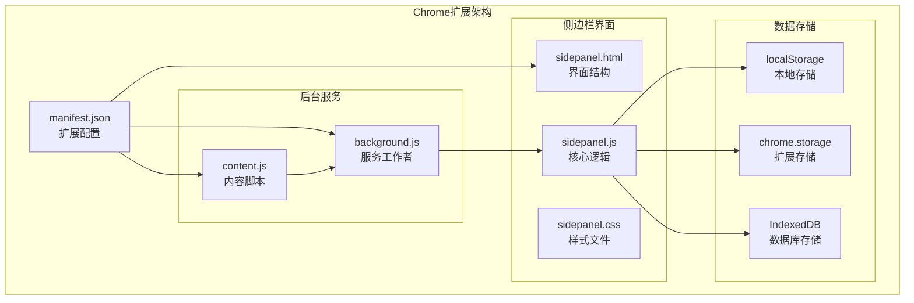

**图表来源**
- [manifest.json:1-48](file://manifest.json#L1-L48)
- [background.js:1-307](file://background/background.js#L1-L307)
- [sidepanel.js:514-584](file://sidebar/sidepanel.js#L514-L584)

**章节来源**
- [manifest.json:1-48](file://manifest.json#L1-L48)
- [README.md:108-126](file://README.md#L108-L126)

## 核心组件

### 状态管理核心架构

系统采用单一状态对象管理模式，所有模块共享同一个状态实例：

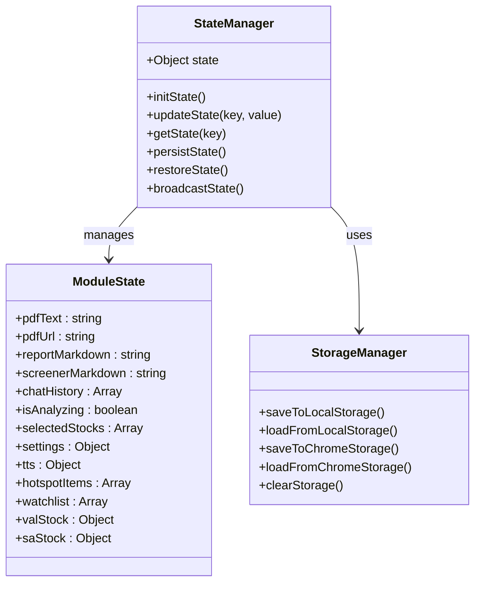

**图表来源**
- [sidepanel.js:514-584](file://sidebar/sidepanel.js#L514-L584)
- [sidepanel.js:609-637](file://sidebar/sidepanel.js#L609-L637)

### 状态数据结构

系统状态采用层次化设计，包含以下主要部分：

| 状态类别 | 字段名称 | 数据类型 | 描述 |
|---------|----------|----------|------|
| 基础状态 | pdfText | string | PDF提取的文本内容 |
| 基础状态 | pdfUrl | string | 当前PDF文件URL |
| 基础状态 | reportMarkdown | string | 财报解读报告内容 |
| 基础状态 | screenerMarkdown | string | 选股器分析报告 |
| 基础状态 | chatHistory | Array | 对话历史记录 |
| 状态标志 | isAnalyzing | boolean | 分析状态标识 |
| 状态标志 | isScreenerRunning | boolean | 选股器运行状态 |
| 状态标志 | isChatting | boolean | 对话状态标识 |
| 导航状态 | activeTab | string | 当前激活标签页 |
| 导航状态 | activeStrategy | string | 当前策略选择 |
| 股票数据 | selectedStocks | Array | 已选择的股票列表 |
| 设置数据 | settings | Object | 用户配置信息 |
| TTS状态 | tts | Object | 文本转语音状态 |
| 热点数据 | hotspotItems | Array | 热点信息列表 |
| 关注列表 | watchlist | Array | 关注的公司列表 |
| 估值数据 | valStock | Object | 估值分析股票信息 |
| 分析数据 | saStock | Object | 股票分析股票信息 |

**章节来源**
- [sidepanel.js:514-584](file://sidebar/sidepanel.js#L514-L584)

## 架构概览

### 状态管理模式

系统采用集中式状态管理模式，通过单一状态源管理所有模块的数据：

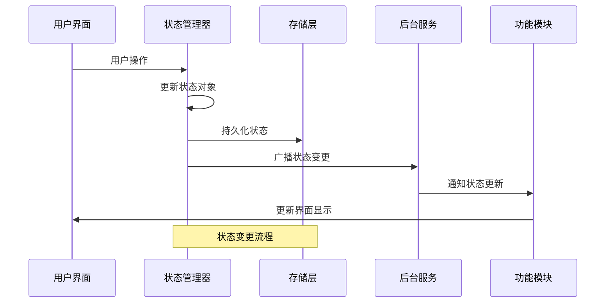

**图表来源**
- [sidepanel.js:974-986](file://sidebar/sidepanel.js#L974-L986)
- [background.js:37-117](file://background/background.js#L37-L117)

### 模块间通信机制

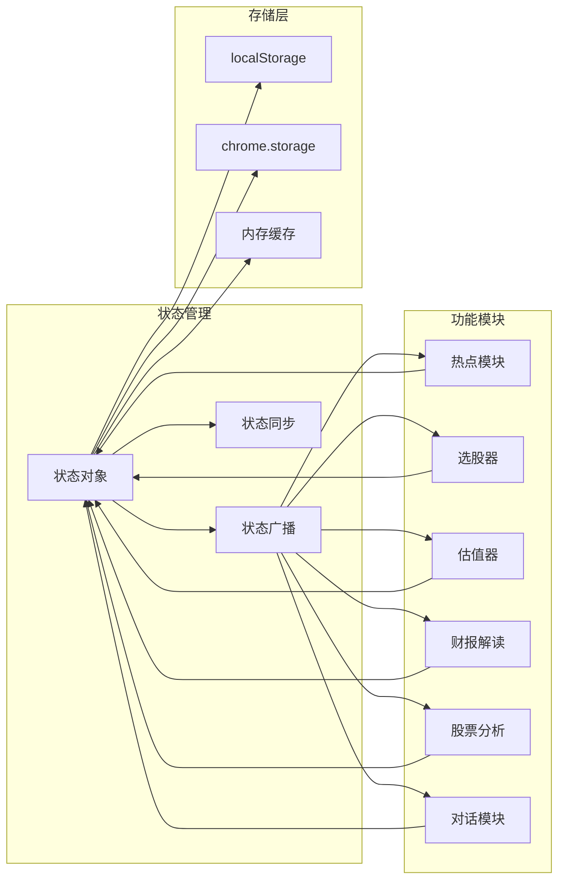

**图表来源**
- [sidepanel.js:1073-1086](file://sidebar/sidepanel.js#L1073-L1086)
- [background.js:182-186](file://background/background.js#L182-L186)

## 详细组件分析

### 状态初始化与管理

状态管理器负责初始化和维护整个应用的状态：

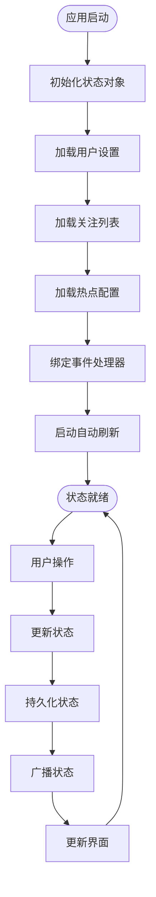

**图表来源**
- [sidepanel.js:589-607](file://sidebar/sidepanel.js#L589-L607)
- [sidepanel.js:609-637](file://sidebar/sidepanel.js#L609-L637)

### 热点信息模块状态管理

热点信息模块采用复杂的状态管理策略：

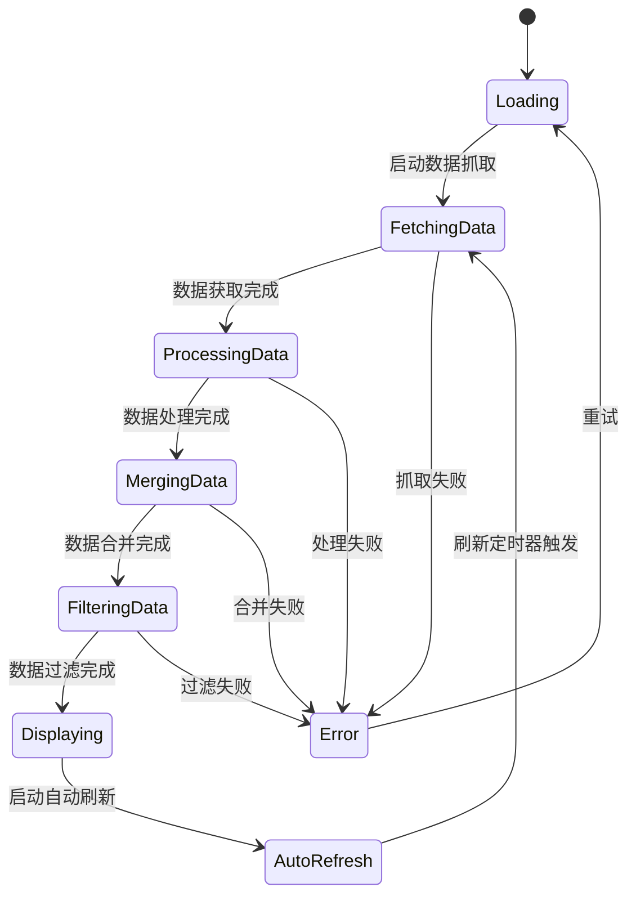

**图表来源**
- [sidepanel.js:1291-1363](file://sidebar/sidepanel.js#L1291-L1363)
- [sidepanel.js:1619-1636](file://sidebar/sidepanel.js#L1619-L1636)

### 选股器模块状态管理

选股器模块的状态管理具有复杂的交互流程：

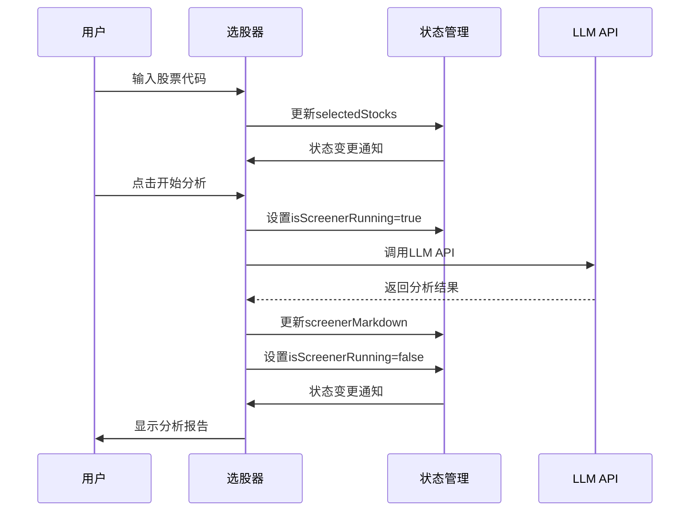

**图表来源**
- [sidepanel.js:2504-2563](file://sidebar/sidepanel.js#L2504-L2563)
- [sidepanel.js:830-844](file://sidebar/sidepanel.js#L830-L844)

### 估值计算器模块状态管理

估值计算器模块采用参数驱动的状态管理模式：

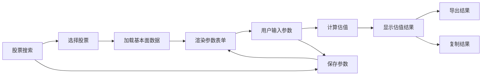

**图表来源**
- [sidepanel.js:4124-4160](file://sidebar/sidepanel.js#L4124-L4160)
- [sidepanel.js:4611-4653](file://sidebar/sidepanel.js#L4611-L4653)

### 财报解读模块状态管理

财报解读模块采用多阶段的状态管理流程：

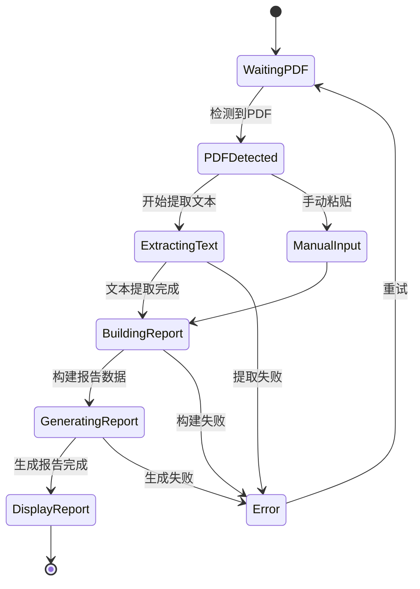

**图表来源**
- [sidepanel.js:2613-2697](file://sidebar/sidepanel.js#L2613-L2697)
- [sidepanel.js:3292-3358](file://sidebar/sidepanel.js#L3292-L3358)

## 依赖分析

### 核心依赖关系

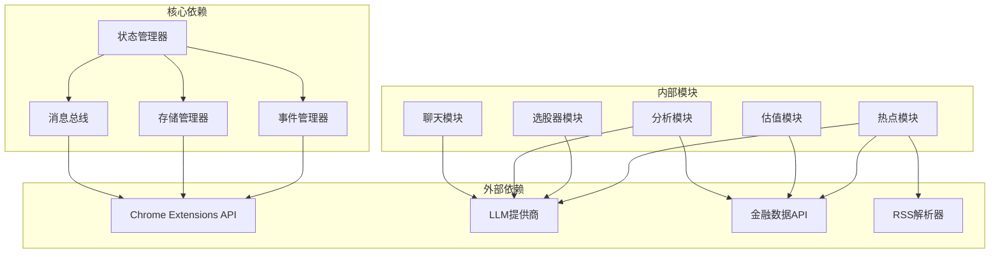

**图表来源**
- [background.js:1-307](file://background/background.js#L1-L307)
- [sidepanel.js:1073-1086](file://sidebar/sidepanel.js#L1073-L1086)

### 数据流依赖

系统采用双向数据流设计，确保状态的一致性和完整性：

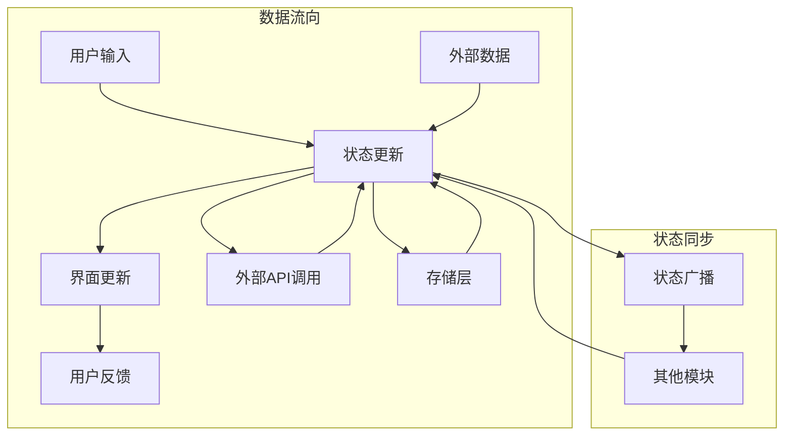

**图表来源**
- [sidepanel.js:974-986](file://sidebar/sidepanel.js#L974-L986)
- [background.js:37-117](file://background/background.js#L37-L117)

**章节来源**
- [background.js:1-307](file://background/background.js#L1-L307)
- [sidepanel.js:1073-1086](file://sidebar/sidepanel.js#L1073-L1086)

## 性能考虑

### 状态更新优化策略

系统采用多种优化策略来提升性能：

1. **防抖和节流机制**
   - 搜索输入防抖延迟处理
   - 自动刷新定时器节流
   - 状态更新批量处理

2. **内存管理优化**
   - 大数据分块传输
   - 状态对象属性懒加载
   - 无用数据及时清理

3. **异步处理优化**
   - 并行数据抓取
   - 流式数据处理
   - 缓存机制优化

### 并发控制策略

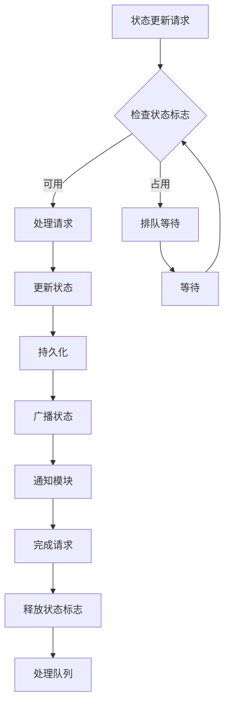

**图表来源**
- [sidepanel.js:2517-2563](file://sidebar/sidepanel.js#L2517-L2563)
- [sidepanel.js:1619-1636](file://sidebar/sidepanel.js#L1619-L1636)

### 缓存策略

系统采用多层次缓存策略：

| 缓存层级 | 缓存类型 | 缓存策略 | 有效期 |
|---------|----------|----------|--------|
| 本地缓存 | localStorage | 持久化存储 | 永久有效 |
| 会话缓存 | 内存缓存 | 会话期间有效 | 浏览器会话 |
| API缓存 | 接口缓存 | 预加载策略 | 5-10分钟 |
| 图片缓存 | PDF缓存 | 分块缓存 | 1-2小时 |

**章节来源**
- [sidepanel.js:1619-1636](file://sidebar/sidepanel.js#L1619-L1636)
- [sidepanel.js:2517-2563](file://sidebar/sidepanel.js#L2517-L2563)

## 故障排除指南

### 常见问题诊断

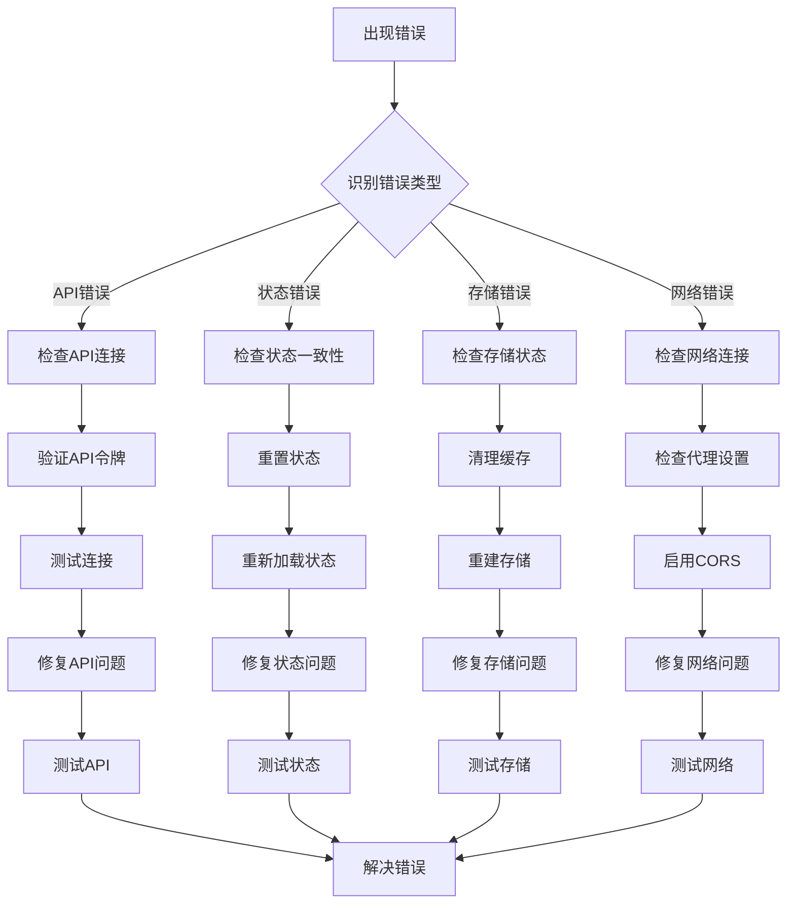

**图表来源**
- [sidepanel.js:3343-3358](file://sidebar/sidepanel.js#L3343-L3358)
- [background.js:112-117](file://background/background.js#L112-L117)

### 错误处理策略

系统采用多层次的错误处理机制：

1. **前端错误处理**
   - 用户友好的错误提示
   - 自动重试机制
   - 错误日志记录

2. **后端错误处理**
   - API错误捕获
   - 状态回滚机制
   - 数据完整性检查

3. **存储错误处理**
   - 数据备份机制
   - 恢复策略
   - 数据迁移

### 调试工具

系统提供多种调试工具支持：

| 调试工具 | 功能描述 | 使用场景 |
|---------|----------|----------|
| 控制台日志 | 详细的操作日志 | 开发调试 |
| 状态监控 | 实时状态查看 | 问题诊断 |
| 性能分析 | 性能瓶颈识别 | 性能优化 |
| 网络监控 | 网络请求跟踪 | 网络问题排查 |

**章节来源**
- [sidepanel.js:3343-3358](file://sidebar/sidepanel.js#L3343-L3358)
- [background.js:112-117](file://background/background.js#L112-L117)

## 结论

投资助手的状态管理系统展现了现代前端应用的最佳实践。通过采用集中式状态管理模式，系统实现了：

1. **统一的状态管理**：单一状态源确保了数据的一致性和完整性
2. **模块化架构设计**：清晰的功能模块划分便于维护和扩展
3. **高效的性能优化**：多种优化策略确保了良好的用户体验
4. **完善的错误处理**：多层次的错误处理机制提升了系统稳定性

该状态管理系统为类似的投资分析工具提供了优秀的参考范例，其设计理念和实现方式值得其他项目借鉴和学习。