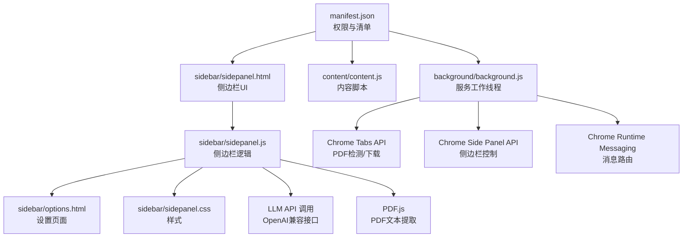
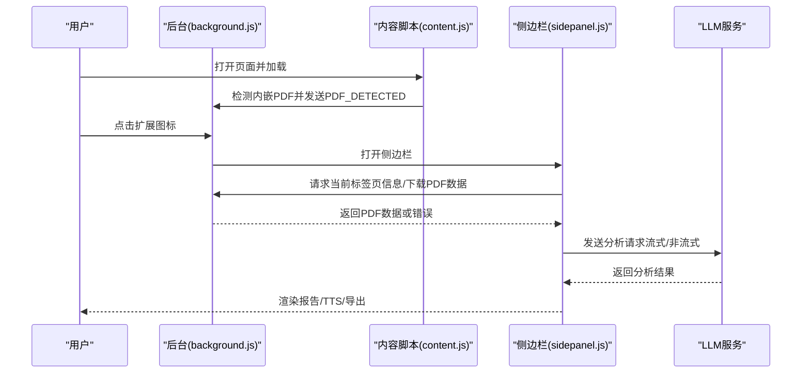
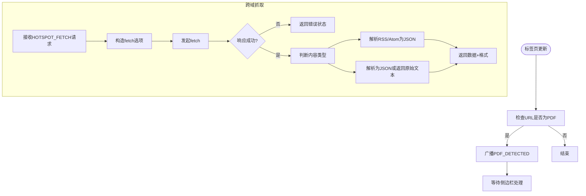
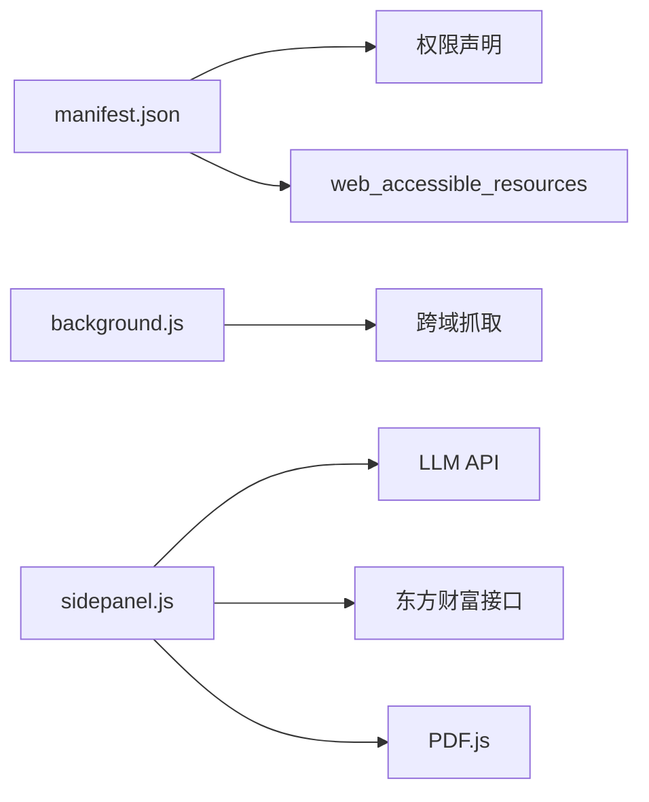

# 故障排除

<cite>
**本文引用的文件**
- [manifest.json](file://manifest.json)
- [background.js](file://background/background.js)
- [content.js](file://content/content.js)
- [sidepanel.js](file://sidebar/sidepanel.js)
- [sidepanel.html](file://sidebar/sidepanel.html)
- [options.html](file://sidebar/options.html)
- [sidepanel.css](file://sidebar/sidepanel.css)
- [README.md](file://README.md)
</cite>

## 目录
1. [简介](#简介)
2. [项目结构](#项目结构)
3. [核心组件](#核心组件)
4. [架构总览](#架构总览)
5. [详细组件分析](#详细组件分析)
6. [依赖分析](#依赖分析)
7. [性能考虑](#性能考虑)
8. [故障排除指南](#故障排除指南)
9. [结论](#结论)
10. [附录](#附录)

## 简介
本指南面向“投资助手”Chrome扩展的使用者与技术支持团队，提供系统化的故障排除方法，涵盖安装问题、功能异常与性能问题的诊断步骤，以及日志查看、错误诊断、问题定位、调试工具使用与最佳实践。同时包含用户反馈收集与问题分类建议、预防性维护与性能监控方法，以及标准化的问题处理流程与解决方案模板。

## 项目结构
该扩展采用 Manifest V3 架构，核心文件组织如下：
- manifest.json：声明权限、侧边栏、后台脚本、可访问资源与图标
- background/background.js：后台服务工作线程，负责侧边栏打开、PDF检测与下载、消息路由
- content/content.js：内容脚本，检测页面内嵌PDF并通知后台
- sidebar/sidepanel.html：侧边栏UI结构
- sidebar/sidepanel.js：侧边栏主逻辑（热点、选股、估值、财报解读、对话、TTS、导出等）
- sidebar/options.html：设置页面（LLM提供商、API Key、模型等）
- sidebar/sidepanel.css：侧边栏样式
- README.md：功能说明与使用指南

图表来源
- [manifest.json:1-48](file://manifest.json#L1-L48)
- [background.js:1-307](file://background/background.js#L1-L307)
- [content.js:1-36](file://content/content.js#L1-L36)
- [sidepanel.js:1-800](file://sidebar/sidepanel.js#L1-L800)
- [sidepanel.html:1-646](file://sidebar/sidepanel.html#L1-L646)
- [options.html:1-124](file://sidebar/options.html#L1-L124)

章节来源
- [manifest.json:1-48](file://manifest.json#L1-L48)
- [README.md:1-147](file://README.md#L1-L147)

## 核心组件
- 后台服务工作线程（background.js）
  - 侧边栏打开与行为控制
  - PDF URL检测（含chrome://pdf-viewer）
  - 跨域数据抓取与RSS/XML解析
  - PDF二进制数据下载与分块传输
  - 消息路由与广播
- 内容脚本（content.js）
  - 检测页面内嵌PDF（embed/object/iframe），通知后台
- 侧边栏（sidepanel.js）
  - 热点信息抓取与领域分类
  - 选股器（多策略模板）
  - 估值计算器（DCF/格雷厄姆/DDM/PE/EVA）
  - 财报解读（PDF提取+LLM分析）
  - AI对话（流式输出）
  - TTS播报与纲要导航
  - Markdown导出与下载
- 设置（options.html）
  - LLM提供商、API地址、API Key、模型配置
  - 关注公司管理

章节来源
- [background.js:1-307](file://background/background.js#L1-L307)
- [content.js:1-36](file://content/content.js#L1-L36)
- [sidepanel.js:1-800](file://sidebar/sidepanel.js#L1-L800)
- [options.html:1-124](file://sidebar/options.html#L1-L124)

## 架构总览
扩展采用“后台服务工作线程 + 侧边栏UI + 内容脚本”的典型架构。后台负责跨域抓取与PDF下载，侧边栏承载交互逻辑与LLM调用，内容脚本负责页面内嵌PDF检测。

图表来源
- [background.js:21-117](file://background/background.js#L21-L117)
- [content.js:11-36](file://content/content.js#L11-L36)
- [sidepanel.js:2567-2697](file://sidebar/sidepanel.js#L2567-L2697)
- [sidepanel.js:3360-3425](file://sidebar/sidepanel.js#L3360-L3425)

## 详细组件分析

### 后台服务工作线程（PDF检测与消息路由）
- PDF检测
  - 监听标签页更新，识别PDF URL（含chrome://pdf-viewer）
  - 通过广播向侧边栏推送PDF_DETECTED
- 跨域抓取
  - 使用fetch绕过CORS限制，支持POST与自定义UA
  - 自动识别RSS/Atom/XML与JSON
  - 解析RSS/Atom为统一JSON结构
- PDF下载
  - 支持chrome://pdf-viewer类型的src参数解析
  - 大文件分块传输（>10MB）
  - Content-Type校验与warn日志

图表来源
- [background.js:21-117](file://background/background.js#L21-L117)
- [background.js:125-177](file://background/background.js#L125-L177)
- [background.js:192-307](file://background/background.js#L192-L307)

章节来源
- [background.js:1-307](file://background/background.js#L1-L307)

### 内容脚本（内嵌PDF检测）
- 检测页面中的embed/object/iframe指向PDF
- 通过chrome.runtime.sendMessage通知后台
- 仅作为补充信号源，实际下载与解析在后台与侧边栏完成

章节来源
- [content.js:1-36](file://content/content.js#L1-L36)

### 侧边栏（热点、选股、估值、财报解读、对话、TTS、导出）
- 热点信息
  - 并行抓取多个数据源（内置API+RSS+自定义）
  - 领域关键词映射与重合度计算
  - 自动刷新与过滤
- 选股器
  - 多策略模板（格雷厄姆/巴菲特/林奇/费雪/芒格/综合）
  - LLM调用与流式输出
- 估值计算器
  - 多种估值方法参数化
  - 自动/建议/必填参数提示
- 财报解读
  - PDF文本提取（PDF.js）
  - 构建结构化财务文本
  - LLM分析与Markdown渲染
- 对话
  - 流式输出与上下文记忆
- TTS与导出
  - 纲要导航与章节播报
  - Markdown导出到下载目录

章节来源
- [sidepanel.js:1026-1800](file://sidebar/sidepanel.js#L1026-L1800)
- [sidepanel.js:1800-2800](file://sidebar/sidepanel.js#L1800-L2800)
- [sidepanel.js:2800-3800](file://sidebar/sidepanel.js#L2800-L3800)
- [sidepanel.js:3800-4800](file://sidebar/sidepanel.js#L3800-L4800)
- [sidepanel.js:4800-5523](file://sidebar/sidepanel.js#L4800-L5523)

### 设置（LLM提供商与关注公司）
- LLM提供商、API地址、API Key、模型配置
- 关注公司管理（添加/删除/搜索）

章节来源
- [options.html:1-124](file://sidebar/options.html#L1-L124)
- [sidepanel.js:2000-2120](file://sidebar/sidepanel.js#L2000-L2120)

## 依赖分析
- 权限与API
  - sidePanel、activeTab、scripting、storage、downloads
  - host_permissions: <all_urls>用于后台跨域抓取
- 资源访问
  - web_accessible_resources包含PDF.js库
- 三方服务
  - LLM API（OpenAI兼容）
  - 东方财富数据接口
  - RSS/JSON数据源

图表来源
- [manifest.json:6-30](file://manifest.json#L6-L30)
- [sidepanel.js:3360-3425](file://sidebar/sidepanel.js#L3360-L3425)
- [sidepanel.js:4242-4324](file://sidebar/sidepanel.js#L4242-L4324)

章节来源
- [manifest.json:1-48](file://manifest.json#L1-L48)

## 性能考虑
- PDF下载分块传输（>10MB）
- 并行抓取热点数据源
- 流式LLM输出减少等待
- 缓存与自动刷新间隔配置
- 大文本截断与表格渲染优化

[本节为通用指导，不涉及具体文件分析]

## 故障排除指南

### 一、安装与权限问题
- 症状
  - 扩展未显示、无法打开侧边栏、权限不足
- 诊断步骤
  - 确认已开启“开发者模式”，正确加载扩展
  - 检查manifest.json权限声明与side_panel配置
  - 在chrome://extensions中查看权限状态
- 解决方案
  - 重新加载扩展
  - 授予必要权限（storage、downloads、activeTab、scripting）
  - 确认web_accessible_resources包含PDF.js

章节来源
- [manifest.json:6-30](file://manifest.json#L6-L30)
- [README.md:83-90](file://README.md#L83-L90)

### 二、侧边栏与PDF功能异常
- 症状
  - 点击扩展图标无反应、侧边栏未打开
  - 打开侧边栏但未检测到PDF
- 诊断步骤
  - 检查后台脚本是否监听到PDF_URL变更
  - 确认chrome://pdf-viewer链接是否包含src参数
  - 验证PDF.js库是否正确加载
- 解决方案
  - 重新点击扩展图标或刷新页面
  - 对于chrome://pdf-viewer，确保后台能解析src参数
  - 检查console是否有PDF.js加载失败或全局对象不可用错误

章节来源
- [background.js:21-34](file://background/background.js#L21-L34)
- [background.js:125-177](file://background/background.js#L125-L177)
- [sidepanel.js:2567-2583](file://sidebar/sidepanel.js#L2567-L2583)
- [sidepanel.js:2613-2697](file://sidebar/sidepanel.js#L2613-L2697)

### 三、热点信息抓取异常
- 症状
  - 热点列表为空、刷新无响应、领域过滤无效
- 诊断步骤
  - 检查数据源开关与RSS启用状态
  - 查看控制台错误与Promise.allSettled结果
  - 验证时间格式解析与重合度计算
- 解决方案
  - 保存热点配置并重启自动刷新
  - 检查自定义RSS/JSON地址可用性
  - 清理过期数据（24小时内）

章节来源
- [sidepanel.js:1070-1120](file://sidebar/sidepanel.js#L1070-L1120)
- [sidepanel.js:1290-1363](file://sidebar/sidepanel.js#L1290-L1363)
- [sidepanel.js:1370-1492](file://sidebar/sidepanel.js#L1370-L1492)

### 四、选股器与估值计算器问题
- 症状
  - 选股失败、API Key无效、参数缺失
- 诊断步骤
  - 检查设置页面API Key是否保存
  - 确认所选策略模板与输入格式
  - 验证基本面数据接口返回
- 解决方案
  - 在设置页面重新填写并保存API Key
  - 检查必填参数是否完整
  - 若接口失败，改为手动填参

章节来源
- [sidepanel.js:2504-2563](file://sidebar/sidepanel.js#L2504-L2563)
- [sidepanel.js:4055-4800](file://sidebar/sidepanel.js#L4055-L4800)

### 五、财报解读与LLM分析异常
- 症状
  - PDF文本提取失败、LLM调用超时、报告为空
- 诊断步骤
  - 检查PDF文本长度与页面数
  - 确认LLM API地址与Key有效
  - 查看流式输出是否中断
- 解决方案
  - 对扫描版PDF建议手动粘贴
  - 检查网络与API服务状态
  - 适当缩短输入文本长度

章节来源
- [sidepanel.js:2621-2697](file://sidebar/sidepanel.js#L2621-L2697)
- [sidepanel.js:3319-3358](file://sidebar/sidepanel.js#L3319-L3358)
- [sidepanel.js:3360-3425](file://sidebar/sidepanel.js#L3360-L3425)

### 六、对话功能与TTS问题
- 症状
  - 对话无响应、TTS播报异常
- 诊断步骤
  - 检查speechSynthesis状态与权限
  - 确认章节文本构建与高亮
- 解决方案
  - 重新开始播报或暂停后继续
  - 检查浏览器TTS设置

章节来源
- [sidepanel.js:3760-3800](file://sidebar/sidepanel.js#L3760-L3800)
- [sidepanel.js:3612-3716](file://sidebar/sidepanel.js#L3612-L3716)

### 七、导出与下载问题
- 症状
  - 导出失败、文件未保存到指定目录
- 诊断步骤
  - 检查chrome.downloads.download回调与lastError
  - 验证导出目录是否存在
- 解决方案
  - 降级使用传统下载方式
  - 确认下载权限与目录路径

章节来源
- [sidepanel.js:3717-3760](file://sidebar/sidepanel.js#L3717-L3760)

### 八、日志查看与错误诊断
- 日志位置
  - 扩展页面：chrome://extensions → 调试视图
  - 后台脚本：background.js中的console输出
  - 侧边栏：sidepanel.js中的console与toast提示
- 常见错误
  - API Key无效/401
  - PDF下载失败/Content-Type异常
  - RSS/XML解析错误
  - PDF.js加载失败或全局对象不可用

章节来源
- [background.js:125-177](file://background/background.js#L125-L177)
- [sidepanel.js:3360-3425](file://sidebar/sidepanel.js#L3360-L3425)

### 九、调试工具与最佳实践
- 调试工具
  - Chrome DevTools → Extensions → 调试视图
  - Network面板查看fetch与LLM请求
  - Console查看错误与warn日志
- 最佳实践
  - 逐步验证：权限→后台消息→侧边栏UI→LLM调用
  - 使用最小化输入复现问题
  - 记录版本号与manifest配置

章节来源
- [manifest.json:1-48](file://manifest.json#L1-L48)

### 十、用户反馈与问题分类
- 反馈收集
  - 版本信息、操作步骤、截图/录屏
  - manifest权限与设置页面截图
- 问题分类
  - 安装/权限类
  - 功能异常类（热点/选股/估值/财报/对话/TTS/导出）
  - 性能问题类（加载慢/内存占用高）
- 分类模板
  - 症状简述、复现步骤、期望结果、实际结果、日志与截图、环境信息

[本节为通用指导，不涉及具体文件分析]

### 十一、预防性维护与性能监控
- 预防措施
  - 定期检查LLM服务可用性与配额
  - 监控热点数据源可用性与RSS解析
  - 优化PDF文本截断与表格渲染
- 性能监控
  - 关注LLM响应时间与流式输出稳定性
  - 监控PDF下载与解析耗时
  - 侧边栏UI滚动与TTS高亮性能

[本节为通用指导，不涉及具体文件分析]

### 十二、标准化问题处理流程
- 流程步骤
  - 重现与记录 → 分类与分级 → 诊断与日志采集 → 解决与验证 → 复盘与改进
- 解决模板
  - 问题描述、影响范围、根因分析、修复方案、验证方法、后续动作

[本节为通用指导，不涉及具体文件分析]

## 结论
通过系统化的故障排除流程与工具使用，可以高效定位并解决“投资助手”扩展在安装、功能与性能方面的问题。建议在日常运维中建立标准化的反馈收集与问题分类机制，配合预防性维护与性能监控，持续提升用户体验与系统稳定性。

## 附录
- 快速检查清单
  - 权限与清单：manifest.json
  - 后台消息：background.js
  - 侧边栏UI与逻辑：sidepanel.js
  - 设置与数据：options.html
  - PDF.js加载：sidepanel.js
  - LLM调用：sidepanel.js

[本节为通用指导，不涉及具体文件分析]