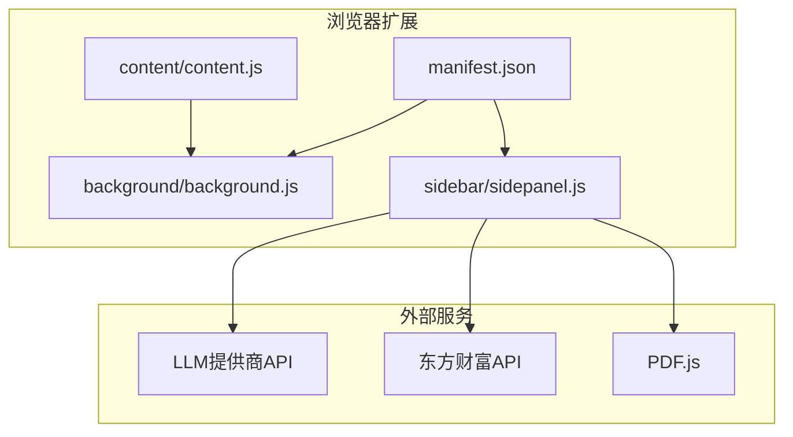
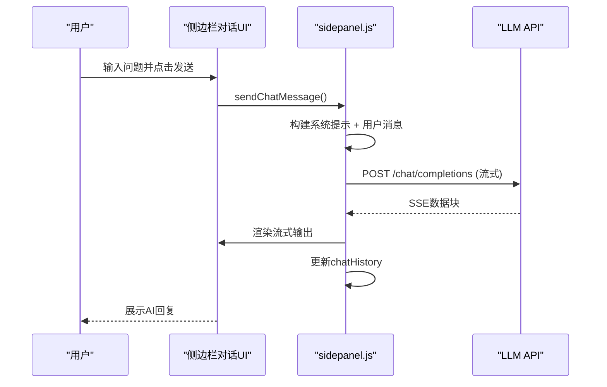
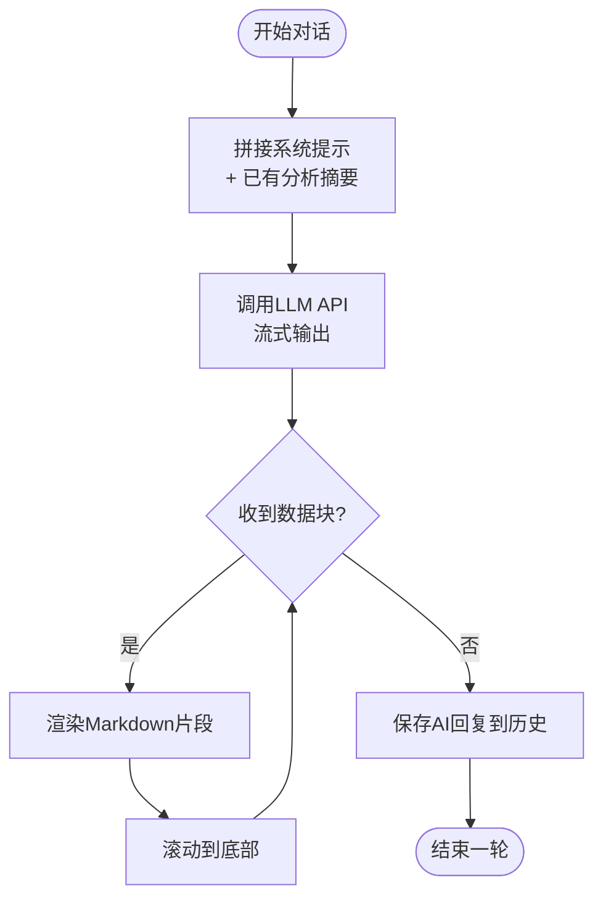
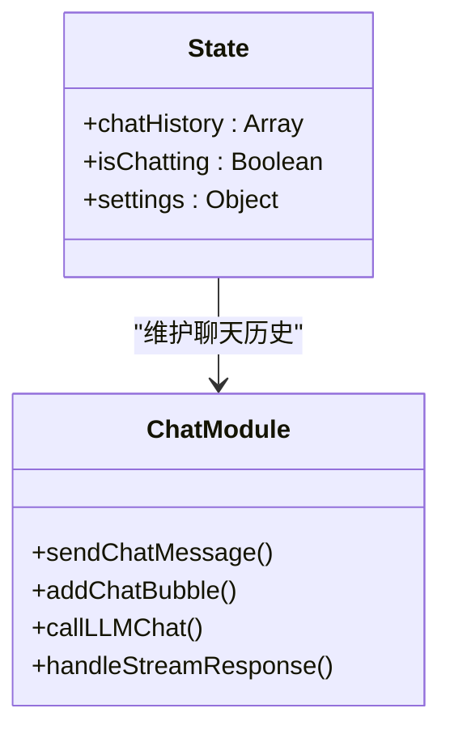
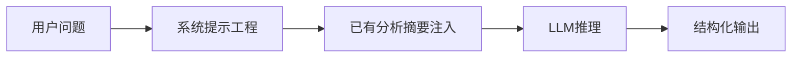
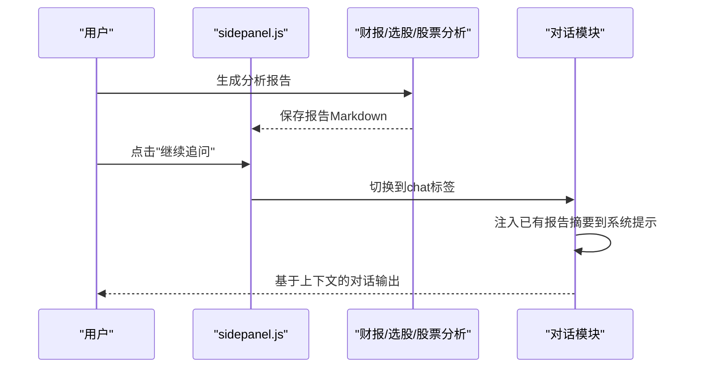
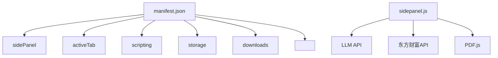

# AI对话分析

<cite>
**本文档引用的文件**
- [manifest.json](file://manifest.json)
- [background.js](file://background/background.js)
- [content.js](file://content/content.js)
- [sidepanel.js](file://sidebar/sidepanel.js)
- [README.md](file://README.md)
</cite>

## 目录
1. [简介](#简介)
2. [项目结构](#项目结构)
3. [核心组件](#核心组件)
4. [架构总览](#架构总览)
5. [详细组件分析](#详细组件分析)
6. [依赖分析](#依赖分析)
7. [性能考虑](#性能考虑)
8. [故障排除指南](#故障排除指南)
9. [结论](#结论)
10. [附录](#附录)

## 简介
本项目是一个基于Chrome扩展的AI对话分析系统，围绕"财报解读 + 大师选股器 + 内在价值计算器"构建，融合巴菲特、林奇、费雪、芒格、格雷厄姆等价值投资策略。其中AI对话分析功能支持多轮问答、上下文保持、对话历史管理、提示词工程（系统提示与用户输入处理）、以及与侧边栏其他模块（如财报解读、选股器、股票分析）的无缝衔接。

## 项目结构
项目采用Chrome Extension Manifest V3架构，核心文件分布如下：
- manifest.json：扩展清单，声明权限、侧边栏、后台脚本、可访问资源等
- background/background.js：后台服务工作线程，负责PDF检测、跨域数据抓取、消息路由
- content/content.js：内容脚本，检测网页中的嵌入PDF并上报后台
- sidebar/sidepanel.js：侧边栏主逻辑，包含AI对话、财报解读、选股器、估值计算、股票分析等模块
- README.md：项目说明与使用指南

**图表来源**
- [manifest.json:1-48](file://manifest.json#L1-L48)
- [background.js:1-307](file://background/background.js#L1-L307)
- [content.js:1-36](file://content/content.js#L1-L36)
- [sidepanel.js:1-5523](file://sidebar/sidepanel.js#L1-L5523)

**章节来源**
- [manifest.json:1-48](file://manifest.json#L1-L48)
- [README.md:1-147](file://README.md#L1-L147)

## 核心组件
- 侧边栏AI对话模块：负责接收用户输入、维护对话历史、调用LLM API、流式输出渲染
- 系统提示工程：内置多套系统提示（分析报告、对话、股票分析等），确保AI输出结构化与专业性
- 上下文保持机制：通过聊天历史数组与系统消息拼接，实现多轮对话的上下文延续
- 消息路由与状态管理：在sidepanel.js中集中管理聊天历史、LLM配置、流式渲染状态
- 与财报解读/选股器/股票分析的联动：对话可基于已生成的报告摘要进行深入追问

**章节来源**
- [sidepanel.js:407-416](file://sidebar/sidepanel.js#L407-L416)
- [sidepanel.js:3397-3425](file://sidebar/sidepanel.js#L3397-L3425)
- [sidepanel.js:3761-3822](file://sidebar/sidepanel.js#L3761-L3822)

## 架构总览
AI对话分析的整体架构分为三层：
- UI交互层：侧边栏对话面板，包含输入框、发送按钮、消息气泡、常用问题按钮
- 业务逻辑层：sidepanel.js中的对话函数、系统提示拼接、流式输出处理
- 数据与集成层：LLM API调用、流式响应解析、与PDF提取、财报解读、选股器等模块的数据共享

**图表来源**
- [sidepanel.js:3763-3801](file://sidebar/sidepanel.js#L3763-L3801)
- [sidepanel.js:3397-3425](file://sidebar/sidepanel.js#L3397-L3425)
- [sidepanel.js:3427-3452](file://sidebar/sidepanel.js#L3427-L3452)

## 详细组件分析

### 组件A：AI对话模块（上下文保持与多轮问答）
- 功能职责
  - 接收用户输入，构建消息历史
  - 调用LLM API，支持流式输出
  - 渲染消息气泡，支持滚动跟随
  - 维护chatHistory，实现上下文延续
- 关键实现
  - 系统提示：CHAT_SYSTEM_PROMPT + 已有分析报告摘要（最多5000字符）
  - 聊天历史：state.chatHistory，每次新增用户消息与AI回复
  - 流式渲染：handleStreamResponse + renderMarkdown，边接收边渲染
  - 发送流程：sendChatMessage → callLLMChat → handleStreamResponse

**图表来源**
- [sidepanel.js:3397-3425](file://sidebar/sidepanel.js#L3397-L3425)
- [sidepanel.js:3427-3452](file://sidebar/sidepanel.js#L3427-L3452)
- [sidepanel.js:3763-3801](file://sidebar/sidepanel.js#L3763-L3801)

**章节来源**
- [sidepanel.js:407-416](file://sidebar/sidepanel.js#L407-L416)
- [sidepanel.js:3397-3425](file://sidebar/sidepanel.js#L3397-L3425)
- [sidepanel.js:3427-3452](file://sidebar/sidepanel.js#L3427-L3452)
- [sidepanel.js:3763-3801](file://sidebar/sidepanel.js#L3763-L3801)

### 组件B：消息管理与历史存储策略
- 状态结构
  - state.chatHistory：数组，保存用户与AI的对话记录
  - state.isChatting：布尔，防止并发发送
  - state.settings：包含provider、baseUrl、apiKey、model
- 存储与恢复
  - 聊天历史仅保存在内存中，随页面生命周期存在
  - 若需持久化，可在现有结构基础上扩展localStorage或chrome.storage
- 历史长度与截断
  - 系统提示中对已有分析摘要进行截断（约5000字符），避免超出上下文窗口

**图表来源**
- [sidepanel.js:516-584](file://sidebar/sidepanel.js#L516-L584)
- [sidepanel.js:3397-3425](file://sidebar/sidepanel.js#L3397-L3425)

**章节来源**
- [sidepanel.js:516-584](file://sidebar/sidepanel.js#L516-L584)
- [sidepanel.js:3397-3425](file://sidebar/sidepanel.js#L3397-L3425)

### 组件C：提示词工程与系统提示
- 系统提示模板
  - CHAT_SYSTEM_PROMPT：对话原则（数据导向、量化分析、对比参考、风险与机会并重）
  - ANALYSIS_SYSTEM_PROMPT：财报解读报告模板（10大模块）
  - STOCK_ANALYSIS_SYSTEM_PROMPT：股票分析框架（6大维度）
- 提示词注入
  - 对话时将已有分析报告摘要（最多5000字符）注入系统消息，确保AI基于真实数据回答
  - 财报解读与股票分析模块同样采用系统提示模板，保证输出结构一致

**图表来源**
- [sidepanel.js:407-416](file://sidebar/sidepanel.js#L407-L416)
- [sidepanel.js:3319-3358](file://sidebar/sidepanel.js#L3319-L3358)
- [sidepanel.js:514-513](file://sidebar/sidepanel.js#L514-L513)

**章节来源**
- [sidepanel.js:407-416](file://sidebar/sidepanel.js#L407-L416)
- [sidepanel.js:3319-3358](file://sidebar/sidepanel.js#L3319-L3358)
- [sidepanel.js:514-513](file://sidebar/sidepanel.js#L514-L513)

### 组件D：与侧边栏其他模块的集成
- 财报解读模块：生成分析报告后，可通过"继续追问"按钮进入对话，系统提示中自动注入报告摘要
- 选股器模块：基于策略模板生成报告后，可进入对话深入探讨
- 股票分析模块：基于投资公司分析框架生成报告后，可进入对话进行细节追问

**图表来源**
- [sidepanel.js:3319-3358](file://sidebar/sidepanel.js#L3319-L3358)
- [sidepanel.js:3763-3801](file://sidebar/sidepanel.js#L3763-L3801)

**章节来源**
- [sidepanel.js:3319-3358](file://sidebar/sidepanel.js#L3319-L3358)
- [sidepanel.js:3763-3801](file://sidebar/sidepanel.js#L3763-L3801)

## 依赖分析
- 扩展权限与能力
  - sidePanel：控制侧边栏打开与行为
  - activeTab/scripting/storage/downloads：与当前标签页交互、本地存储、下载导出
  - host_permissions：<all_urls>：允许后台脚本访问任意URL（用于绕过CORS）
- 外部依赖
  - LLM API：OpenAI兼容模式，支持多提供商（DeepSeek、智谱、通义千问等）
  - 东方财富API：股票搜索、行情、财务数据
  - PDF.js：PDF文本提取（打包在扩展内）

**图表来源**
- [manifest.json:6-12](file://manifest.json#L6-L12)
- [manifest.json:13-15](file://manifest.json#L13-L15)
- [sidepanel.js:417-423](file://sidebar/sidepanel.js#L417-L423)

**章节来源**
- [manifest.json:1-48](file://manifest.json#L1-L48)
- [sidepanel.js:417-423](file://sidebar/sidepanel.js#L417-L423)

## 性能考虑
- 流式输出优化：通过SSE流式接收，边到边渲染，减少等待时间
- 文本截断：对话系统提示中对已有报告摘要进行截断，避免超出上下文窗口导致的性能与准确性问题
- 并发控制：state.isChatting防止重复发送，提升稳定性
- 数据缓存：PDF文本、分析报告在内存中缓存，避免重复请求

[本节为通用指导，无需特定文件分析]

## 故障排除指南
- API Key无效或401
  - 现象：对话发送后显示"API Key 无效"
  - 处理：打开设置面板，重新配置LLM提供商与API Key
  - 参考实现：callLLM/callLLMChat中对响应状态的检查与错误提示
- CORS限制导致PDF下载失败
  - 现象：PDF检测到但下载失败
  - 处理：后台脚本使用host_permissions绕过CORS，确保manifest权限正确
  - 参考实现：background.js中的fetchPdfData与HOTSPOT_FETCH
- 流式输出异常
  - 现象：AI回复无显示或显示不完整
  - 处理：检查网络连接与API可用性；确认SSE数据格式符合预期
  - 参考实现：handleStreamResponse对data:行的解析与错误捕获

**章节来源**
- [sidepanel.js:3397-3425](file://sidebar/sidepanel.js#L3397-L3425)
- [sidepanel.js:3427-3452](file://sidebar/sidepanel.js#L3427-L3452)
- [background.js:125-177](file://background/background.js#L125-L177)
- [background.js:64-116](file://background/background.js#L64-L116)

## 结论
本项目的AI对话分析功能通过清晰的模块划分、完善的系统提示工程、严谨的上下文保持机制，实现了与侧边栏其他模块（财报解读、选股器、股票分析）的自然衔接。其流式输出与状态管理确保了良好的用户体验，同时通过权限与外部API集成提供了强大的数据支撑能力。建议后续可考虑增加对话历史的本地持久化与导入导出能力，进一步提升实用性。

[本节为总结性内容，无需特定文件分析]

## 附录

### 界面操作指南
- 打开侧边栏：点击扩展图标，自动打开侧边栏
- 切换到对话标签：在侧边栏中点击"💬 AI对话"标签
- 发送消息：在输入框输入问题，点击发送或按回车
- 常用问题：点击右侧"常用问题"按钮，快速发起典型追问
- 继续追问：在财报解读/选股器/股票分析完成后，点击"继续追问"进入对话

**章节来源**
- [README.md:90-106](file://README.md#L90-L106)
- [sidepanel.js:958-972](file://sidebar/sidepanel.js#L958-L972)

### 最佳实践与技巧
- 提问技巧
  - 明确背景：在提问前简要说明股票/报告/分析的背景
  - 结构化问题：使用"对比/趋势/风险/机会"等维度提问
  - 量化需求：要求给出具体数字与百分比变化
- 解读AI回复
  - 关注数据支撑：优先采纳有数据依据的结论
  - 对比参考：结合同行业/历史数据进行交叉验证
  - 风险提示：重视AI指出的风险与不确定性
- 与模块联动
  - 先生成报告，再进行深入对话，可获得更精准的分析
  - 使用"继续追问"按钮，可直接基于报告摘要进行二次分析

**章节来源**
- [sidepanel.js:409-415](file://sidebar/sidepanel.js#L409-L415)
- [sidepanel.js:3319-3358](file://sidebar/sidepanel.js#L3319-L3358)