# 价值投资大师选股器

<cite>
**本文档引用的文件**
- [manifest.json](file://manifest.json)
- [sidepanel.html](file://sidebar/sidepanel.html)
- [sidepanel.js](file://sidebar/sidepanel.js)
- [sidepanel.css](file://sidebar/sidepanel.css)
- [background.js](file://background/background.js)
- [content.js](file://content/content.js)
</cite>

## 目录
1. [项目概述](#项目概述)
2. [项目结构](#项目结构)
3. [核心组件](#核心组件)
4. [架构概览](#架构概览)
5. [详细组件分析](#详细组件分析)
6. [依赖关系分析](#依赖关系分析)
7. [性能考虑](#性能考虑)
8. [故障排除指南](#故障排除指南)
9. [结论](#结论)

## 项目概述

价值投资大师选股器是一个基于Chrome扩展的价值投资分析工具，融合了格雷厄姆、巴菲特、林奇、费雪和芒格五位价值投资大师的核心理念。该工具通过AI驱动的分析引擎，为用户提供智能化的股票筛选和投资决策支持。

### 核心功能特性

- **多策略融合**：集成五大价值投资大师的经典策略
- **AI驱动分析**：基于LLM的深度分析和报告生成
- **实时数据集成**：连接东方财富等权威数据源
- **多维度评估**：财务指标、估值分析、基本面研究
- **可视化展示**：直观的结果展示和交互体验

## 项目结构

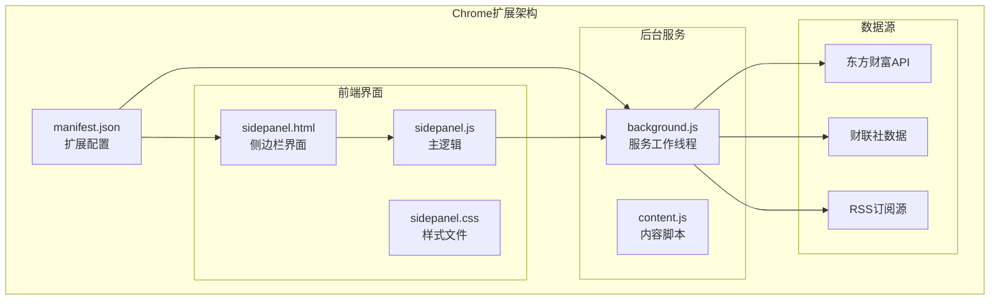

**图表来源**
- [manifest.json:1-48](file://manifest.json#L1-L48)
- [sidepanel.html:1-646](file://sidebar/sidepanel.html#L1-L646)
- [sidepanel.js:1-800](file://sidebar/sidepanel.js#L1-L800)
- [background.js:1-307](file://background/background.js#L1-L307)

**章节来源**
- [manifest.json:1-48](file://manifest.json#L1-L48)
- [sidepanel.html:1-646](file://sidebar/sidepanel.html#L1-L646)

## 核心组件

### 价值投资大师策略模板

系统内置了五位投资大师的核心策略模板，每个策略都有明确的筛选标准和评估维度：

#### 格雷厄姆深度价值策略
- **核心标准**：PE < 15、PB < 1.5、股息率 ≥ 3%
- **安全边际**：内在价值比市场价格低至少33%
- **财务稳健性**：近10年无亏损记录

#### 巴菲特护城河策略
- **护城河识别**：品牌、网络效应、转换成本、成本优势、牌照
- **ROE要求**：连续5年 ≥ 15%
- **所有者盈余**：持续增长的净利润

#### 彼得·林奇PEG策略
- **PEG计算**：PE/盈利增长率 < 1.0
- **公司分类**：6种不同类型的投资策略
- **增长质量**：15%-30%的理想增长率区间

#### 费雪长期成长策略
- **研发投入**：研发费用/营收占比高
- **销售团队**：强于行业平均水平的销售组织
- **管理层深度**：不依赖单一个人

#### 芒格理性投资策略
- **逆向思维**：先排除糟糕的，再看剩下的
- **ROIC分析**：投入资本回报率 > WACC
- **压力测试**：最坏情况下的生存能力

**章节来源**
- [sidepanel.js:14-297](file://sidebar/sidepanel.js#L14-L297)

### 选股器工作流程

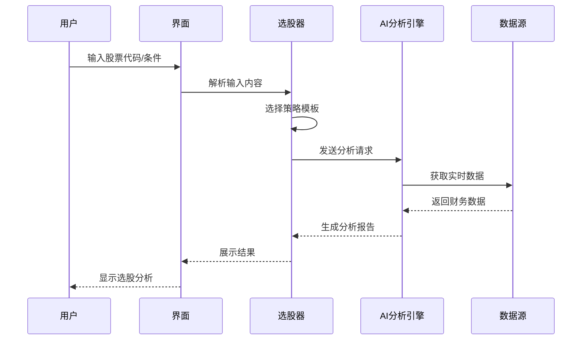

**图表来源**
- [sidepanel.js:2504-2563](file://sidebar/sidepanel.js#L2504-L2563)

## 架构概览

### 系统架构图

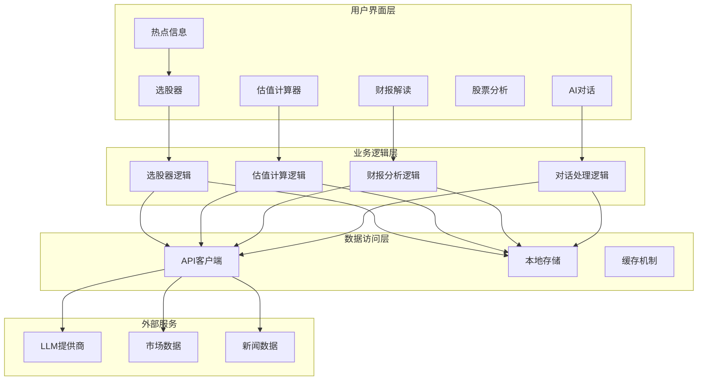

**图表来源**
- [sidepanel.js:516-584](file://sidebar/sidepanel.js#L516-L584)
- [background.js:36-117](file://background/background.js#L36-L117)

### 数据流分析

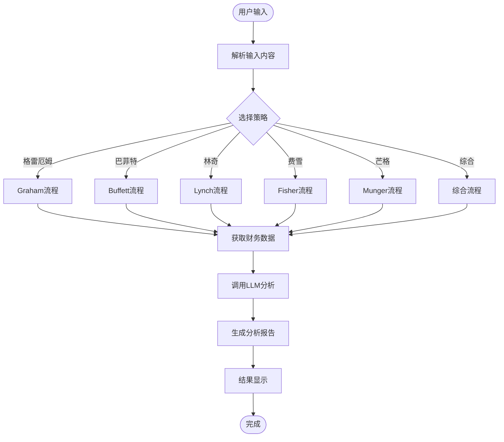

**图表来源**
- [sidepanel.js:2525-2563](file://sidebar/sidepanel.js#L2525-L2563)

## 详细组件分析

### 选股器核心逻辑

#### 策略模板系统

系统采用统一的策略模板架构，确保不同大师策略的一致性和可扩展性：

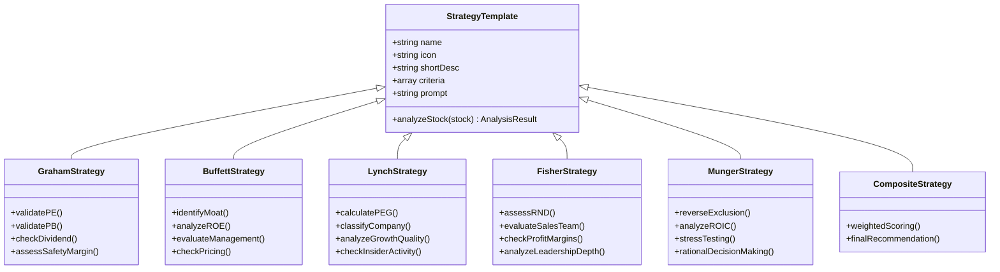

**图表来源**
- [sidepanel.js:14-297](file://sidebar/sidepanel.js#L14-L297)

#### 选股器执行流程

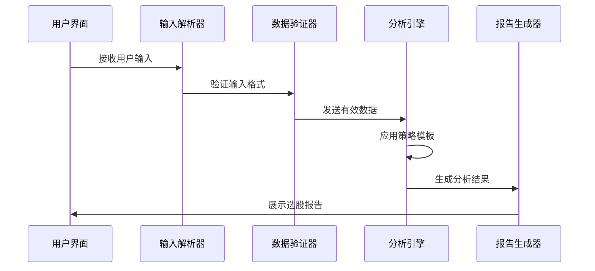

**图表来源**
- [sidepanel.js:2504-2563](file://sidebar/sidepanel.js#L2504-L2563)

**章节来源**
- [sidepanel.js:2482-2563](file://sidebar/sidepanel.js#L2482-L2563)

### 估值计算器组件

#### 估值方法矩阵

系统提供了多种估值方法，每种方法都有相应的参数配置和计算逻辑：

| 估值方法 | 核心公式 | 适用场景 | 关键参数 |
|---------|---------|---------|---------|
| DCF现金流折现 | V = ΣFCF/(1+r)^t + TV/(1+r)^n | 成长型企业 | FCF、增长率、WACC、预测期 |
| 格雷厄姆内在价值 | V = EPS × (8.5 + 2g) × 4.4/Y | 价值投资 | EPS、增长率、AAA收益率 |
| DDM股利折现 | V = D1/(r-g) | 稳定分红企业 | DPS、增长率、要求回报率 |
| 相对估值PE/PB | V = 市场倍数 × 基础指标 | 同行业比较 | PE、PB、EPS、BVPS |
| EVA经济附加值 | V = IC + Σ(EVAt)/(1+r)^t | 价值创造评估 | IC、ROIC、WACC、预测年数 |

#### 估值参数自动填充机制

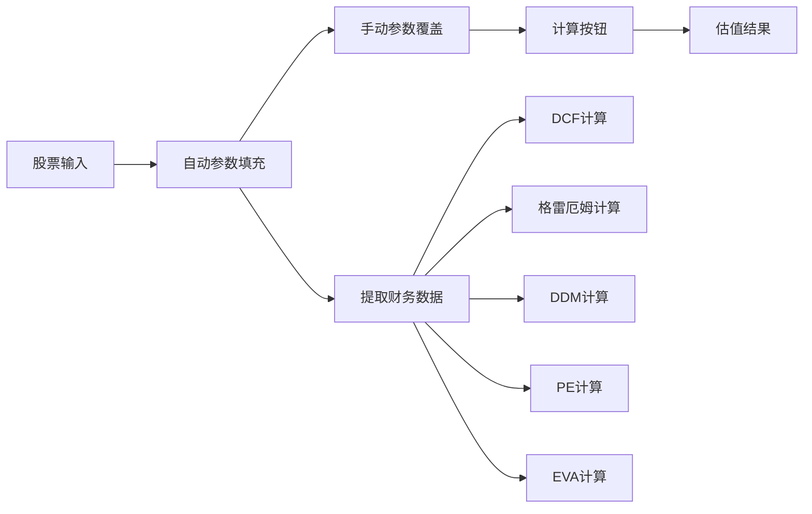

**图表来源**
- [sidepanel.js:4061-4653](file://sidebar/sidepanel.js#L4061-L4653)

**章节来源**
- [sidepanel.js:4055-4653](file://sidebar/sidepanel.js#L4055-L4653)

### 数据获取与处理

#### 多源数据集成

系统通过多种渠道获取实时市场数据和财务信息：

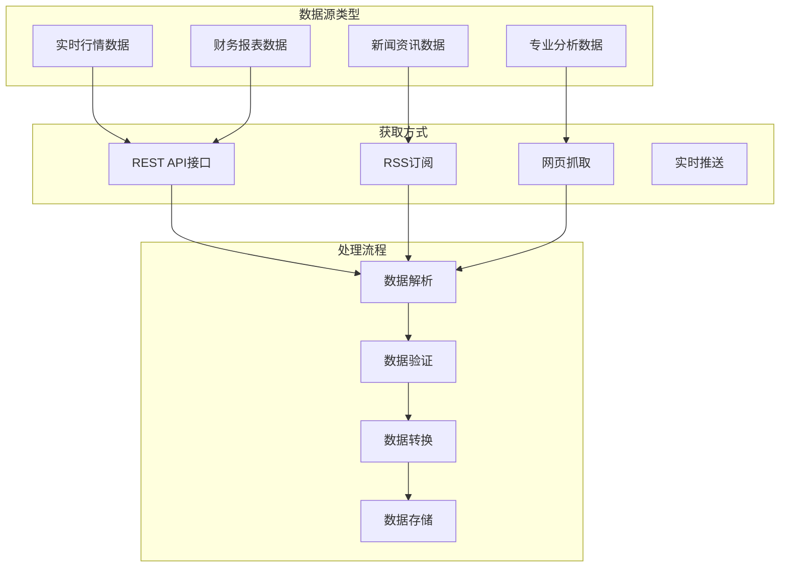

**图表来源**
- [background.js:1073-117](file://background/background.js#L1073-L117)

**章节来源**
- [background.js:1073-117](file://background/background.js#L1073-L117)

## 依赖关系分析

### 外部依赖

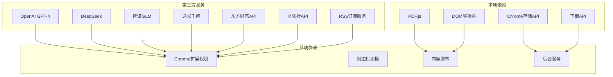

**图表来源**
- [manifest.json:6-30](file://manifest.json#L6-L30)
- [sidepanel.js:417-423](file://sidebar/sidepanel.js#L417-L423)

### 内部模块依赖

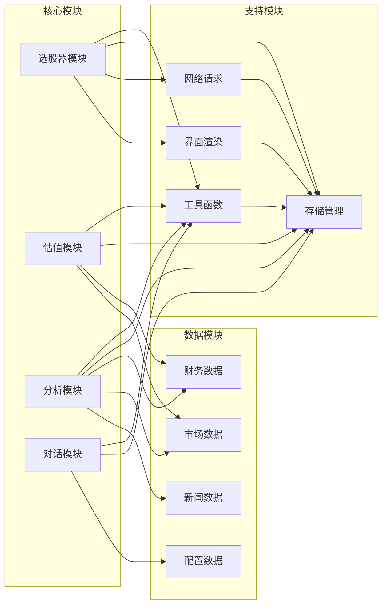

**图表来源**
- [sidepanel.js:516-584](file://sidebar/sidepanel.js#L516-L584)

**章节来源**
- [manifest.json:6-30](file://manifest.json#L6-L30)

## 性能考虑

### 数据缓存策略

系统采用了多层次的数据缓存机制来提升性能：

1. **本地存储缓存**：使用Chrome存储API缓存常用数据
2. **内存缓存**：短期数据缓存减少重复请求
3. **智能刷新**：根据数据时效性动态调整刷新频率

### 并行处理优化

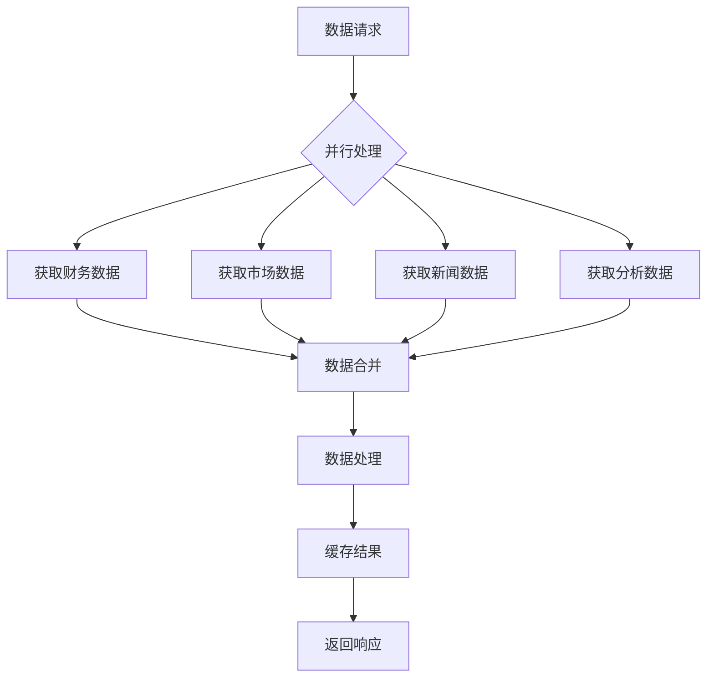

### 内存管理

系统实现了智能的内存管理策略：

- **垃圾回收**：定期清理不再使用的数据
- **分页加载**：大数据集的分页处理
- **懒加载**：按需加载非关键数据

## 故障排除指南

### 常见问题诊断

#### API密钥配置问题

**症状**：分析失败，提示API Key无效
**解决方案**：
1. 检查设置面板中的API配置
2. 验证API密钥的有效性
3. 确认网络连接正常

#### 数据获取失败

**症状**：选股器无法获取股票数据
**解决方案**：
1. 检查网络连接状态
2. 验证股票代码格式正确
3. 重新启动浏览器扩展

#### 性能问题

**症状**：页面响应缓慢或卡顿
**解决方案**：
1. 清理浏览器缓存
2. 关闭不必要的标签页
3. 重启Chrome扩展服务

### 调试工具

系统提供了内置的调试工具：

- **控制台日志**：详细的错误信息输出
- **状态监控**：实时显示系统运行状态
- **性能分析**：分析数据处理耗时

**章节来源**
- [sidepanel.js:2551-2560](file://sidebar/sidepanel.js#L2551-L2560)

## 结论

价值投资大师选股器是一个功能完整、架构清晰的价值投资分析工具。通过融合五位投资大师的经典理念，系统为用户提供了智能化的股票筛选和投资决策支持。

### 主要优势

1. **策略完整性**：涵盖了价值投资的核心理念
2. **AI驱动**：利用先进的自然语言处理技术
3. **数据丰富**：集成多个权威数据源
4. **用户体验**：直观友好的界面设计
5. **扩展性强**：模块化架构便于功能扩展

### 发展方向

1. **算法优化**：持续改进AI分析算法
2. **数据增强**：增加更多数据源和指标
3. **个性化定制**：支持用户自定义策略参数
4. **移动端适配**：开发移动版本应用
5. **社区功能**：增加用户交流和分享功能

该系统为价值投资者提供了一个强大而实用的分析工具，有助于提高投资决策的质量和效率。