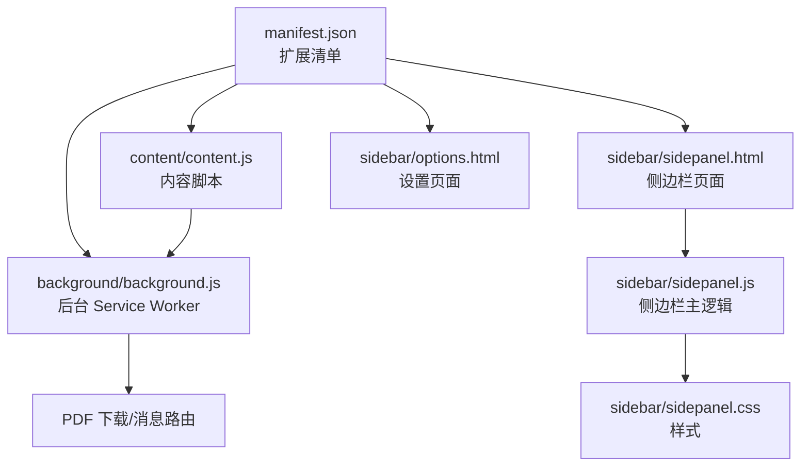
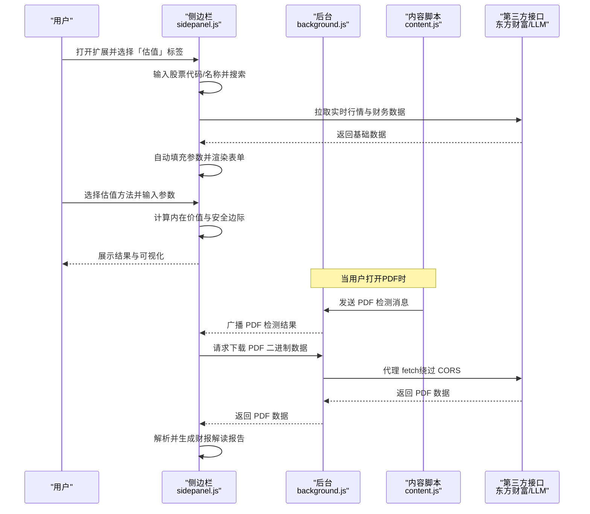
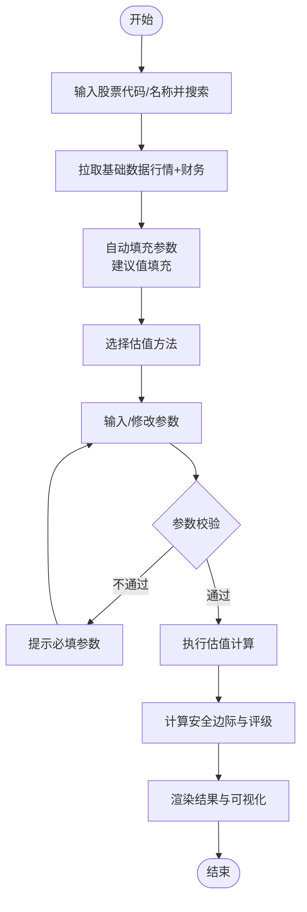
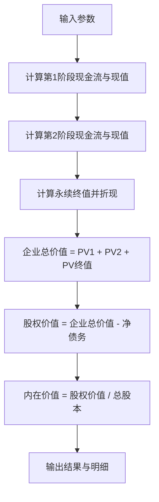
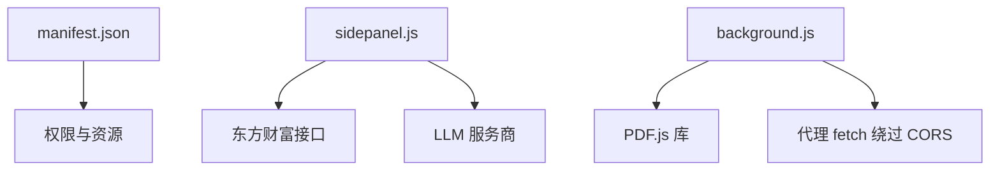

# 企业内在价值计算器

<cite>
**本文档引用的文件**
- [manifest.json](file://manifest.json)
- [README.md](file://README.md)
- [background/background.js](file://background/background.js)
- [content/content.js](file://content/content.js)
- [sidebar/sidepanel.js](file://sidebar/sidepanel.js)
- [sidebar/sidepanel.html](file://sidebar/sidepanel.html)
- [sidebar/sidepanel.css](file://sidebar/sidepanel.css)
- [sidebar/options.html](file://sidebar/options.html)
</cite>

## 目录
1. [简介](#简介)
2. [项目结构](#项目结构)
3. [核心组件](#核心组件)
4. [架构总览](#架构总览)
5. [详细组件分析](#详细组件分析)
6. [依赖关系分析](#依赖关系分析)
7. [性能考虑](#性能考虑)
8. [故障排除指南](#故障排除指南)
9. [结论](#结论)
10. [附录](#附录)

## 简介
本项目是一个 Chrome 扩展，提供「企业内在价值计算器」等核心功能，融合巴菲特、林奇、费雪、芒格、格雷厄姆等多位价值投资大师策略，结合 DCF 折现现金流模型、相对估值法、资产基础法等多种估值方法，帮助用户进行股票估值与投资决策。

## 项目结构
该项目采用 Manifest V3 架构，核心文件分布如下：
- manifest.json：扩展配置，声明权限、侧边栏页面、后台脚本等
- background/background.js：后台 Service Worker，负责 PDF 下载、消息路由、RSS/XML 解析
- content/content.js：内容脚本，检测网页中的 PDF 嵌入并通知后台
- sidebar/sidepanel.js：侧边栏主逻辑，包含选股器、财报解读、股票分析、AI 对话、估值计算器等模块
- sidebar/sidepanel.html：侧边栏页面结构
- sidebar/sidepanel.css：侧边栏样式
- sidebar/options.html：设置页面（LLM 服务商、API Key 等）

**图表来源**
- [manifest.json:1-48](file://manifest.json#L1-L48)
- [background/background.js:1-307](file://background/background.js#L1-L307)
- [content/content.js:1-36](file://content/content.js#L1-L36)
- [sidebar/sidepanel.html:1-646](file://sidebar/sidepanel.html#L1-L646)
- [sidebar/sidepanel.js:1-800](file://sidebar/sidepanel.js#L1-L800)
- [sidebar/sidepanel.css:1-800](file://sidebar/sidepanel.css#L1-L800)
- [sidebar/options.html:1-124](file://sidebar/options.html#L1-L124)

**章节来源**
- [manifest.json:1-48](file://manifest.json#L1-L48)
- [README.md:108-127](file://README.md#L108-L127)

## 核心组件
- 估值计算器模块：支持 DCF 折现现金流、格雷厄姆内在价值、DDM 股利折现模型、相对估值（PE/PB）、EVA 经济附加值等方法
- 选股器模块：基于多策略框架筛选候选股票
- 财报解读模块：自动提取 PDF 财报并生成结构化解读报告
- 股票分析模块：基于投资公司分析框架生成深度分析报告
- 设置模块：配置 LLM 服务商、API Key、模型等

**章节来源**
- [sidebar/sidepanel.js:4055-4814](file://sidebar/sidepanel.js#L4055-L4814)
- [sidebar/sidepanel.js:2482-2563](file://sidebar/sidepanel.js#L2482-L2563)
- [sidebar/sidepanel.js:2720-3010](file://sidebar/sidepanel.js#L2720-L3010)
- [sidebar/sidepanel.js:4920-5362](file://sidebar/sidepanel.js#L4920-L5362)
- [sidebar/options.html:42-124](file://sidebar/options.html#L42-L124)

## 架构总览
扩展采用「侧边栏 + 后台 + 内容脚本」的架构：
- 侧边栏：用户交互界面，承载估值、选股、财报解读、股票分析等功能
- 后台：处理 PDF 下载、跨域请求、RSS/XML 解析、消息路由
- 内容脚本：检测网页中的 PDF 嵌入，辅助后台进行数据获取

**图表来源**
- [sidebar/sidepanel.js:846-901](file://sidebar/sidepanel.js#L846-L901)
- [sidebar/sidepanel.js:4212-4324](file://sidebar/sidepanel.js#L4212-L4324)
- [sidebar/sidepanel.js:4611-4653](file://sidebar/sidepanel.js#L4611-L4653)
- [background/background.js:21-54](file://background/background.js#L21-L54)
- [background/background.js:125-177](file://background/background.js#L125-L177)
- [content/content.js:11-28](file://content/content.js#L11-L28)

**章节来源**
- [background/background.js:1-307](file://background/background.js#L1-L307)
- [content/content.js:1-36](file://content/content.js#L1-L36)
- [sidebar/sidepanel.js:846-901](file://sidebar/sidepanel.js#L846-L901)
- [sidebar/sidepanel.js:4212-4324](file://sidebar/sidepanel.js#L4212-L4324)
- [sidebar/sidepanel.js:4611-4653](file://sidebar/sidepanel.js#L4611-L4653)

## 详细组件分析

### 估值计算器组件分析
估值计算器支持五种经典估值方法，参数自动填充与建议值结合，计算结果包含安全边际与可视化对比。

- 方法定义与参数
  - DCF 折现现金流：自由现金流、两阶段增长率、永续增长率、WACC、总股本、净债务
  - 格雷厄姆内在价值：EPS、预期增长率、AAA 债券收益率
  - DDM 股利折现模型：每股股利、股利增长率、要求回报率
  - 相对估值（PE/PB）：EPS、BVPS、行业平均 PE/PB
  - EVA 经济附加值：投入资本、ROIC、WACC、预测年数

- 自动参数填充
  - 从东方财富接口自动填充：PE、PB、EPS、BVPS、总股本、净债务、ROIC、WACC、FCF 等
  - 建议值：如 WACC 估算、默认 PE/PB 参考、增长率建议等

- 计算流程
  - 收集参数并校验
  - 根据所选方法执行相应公式计算
  - 计算安全边际百分比与低估/高估判定
  - 渲染结果与可视化柱状图

**图表来源**
- [sidebar/sidepanel.js:4212-4324](file://sidebar/sidepanel.js#L4212-L4324)
- [sidebar/sidepanel.js:4536-4607](file://sidebar/sidepanel.js#L4536-L4607)
- [sidebar/sidepanel.js:4611-4653](file://sidebar/sidepanel.js#L4611-L4653)
- [sidebar/sidepanel.js:4658-4814](file://sidebar/sidepanel.js#L4658-L4814)

**章节来源**
- [sidebar/sidepanel.js:4055-4814](file://sidebar/sidepanel.js#L4055-L4814)

### DCF 折现现金流模型详解
DCF 模型通过预测未来自由现金流并折现至现值，考虑两阶段增长与永续终值。

- 关键步骤
  - 第1阶段：按 g1 增长 n1 年，折现求和
  - 第2阶段：按 g2 增长 n2 年，折现求和
  - 永续终值：FCFn2 × (1 + gt) / (r - gt)，折现至现值
  - 企业总价值 = PV1 + PV2 + PV终值
  - 股权价值 = 企业总价值 - 净债务
  - 内在价值 = 股权价值 / 总股本

- 参数含义
  - fcf0：当前自由现金流（亿）
  - growth1/growth2：第1/2阶段增长率（%）
  - years1/years2：第1/2阶段年数
  - terminalG：永续增长率（%）
  - wacc：折现率（%）
  - shares：总股本（亿股）
  - netDebt：净债务（亿）

**图表来源**
- [sidebar/sidepanel.js:4658-4707](file://sidebar/sidepanel.js#L4658-L4707)

**章节来源**
- [sidebar/sidepanel.js:4658-4707](file://sidebar/sidepanel.js#L4658-L4707)

### 相对估值与资产基础法
- 相对估值（PE/PB）
  - 通过 EPS × 行业平均 PE 与 BVPS × 行业平均 PB 的均值得到内在价值
  - 适合有可比同行的企业

- 资产基础法（基于 EVA）
  - 价值 = 投入资本 + ∑(ROIC - WACC) × 投入资本 / (1 + WACC)^t
  - 适合资本效率型企业，关注超额回报

**章节来源**
- [sidebar/sidepanel.js:4757-4780](file://sidebar/sidepanel.js#L4757-L4780)
- [sidebar/sidepanel.js:4782-4814](file://sidebar/sidepanel.js#L4782-L4814)

### 参数设置与假设说明
- 增长率预测
  - 成长期企业：第1阶段增长率通常为 8%-15%，第2阶段为 3%-5%
  - 成熟期企业：两阶段增长率接近 3%-5%，永续增长率 2%-3%
  - 可参考公司历史增长、行业均值与管理层指引

- 折现率（WACC）选择
  - 通过 CAPM 简化估算：权益成本约 10%，债务成本约 5%，结合资产负债结构计算
  - 也可使用公司当前 PE 推导隐含增长率作为参考

- 预测期长度
  - 成长期：5-10 年（第1阶段）
  - 成熟期：5-10 年（第2阶段）
  - EVA 法通常预测 10 年

- 安全边际
  - 安全边际 = (内在价值 - 当前市价) / 内在价值 × 100%
  - 一般认为安全边际 > 25% 为较高安全边际，> 10% 为可接受

**章节来源**
- [sidebar/sidepanel.js:4518-4532](file://sidebar/sidepanel.js#L4518-L4532)
- [sidebar/sidepanel.js:4822-4832](file://sidebar/sidepanel.js#L4822-L4832)

### 计算示例与应用场景
- 示例场景
  - 成长型科技公司：使用 DCF 两阶段模型，假设第1阶段 15% 增长 5 年，第2阶段 5% 增长 10 年，WACC 10%，永续增长率 3%
  - 成熟消费企业：使用相对估值（PE/PB）与 DDM 模型交叉验证
  - 资本密集企业：使用 EVA 法评估 ROIC 超过 WACC 的超额回报

- 应用场景
  - 选股前的初步估值与安全边际判断
  - 财报解读后的深入分析与投资建议
  - 股价异动时的快速估值校准

**章节来源**
- [README.md:25-47](file://README.md#L25-L47)
- [sidebar/sidepanel.js:4658-4707](file://sidebar/sidepanel.js#L4658-L4707)

### 估值结果解读与投资决策
- 安全边际与评级
  - 安全边际 > 25%：强烈低估（建议买入）
  - 安全边际 10%-25%：低估（可关注）
  - 安全边际 < 10%：合理或高估（谨慎）

- 结合其他方法
  - DCF 与相对估值交叉验证，降低单一模型偏差
  - EVA 法评估资本效率，关注 ROIC 与 WACC 的差距

- 投资建议
  - 优先选择安全边际高、护城河清晰、管理层优秀的企业
  - 关注估值变化趋势与公司基本面改善信号

**章节来源**
- [sidebar/sidepanel.js:4822-4860](file://sidebar/sidepanel.js#L4822-L4860)

### 界面操作指南与结果分析技巧
- 估值标签操作
  - 输入股票代码/名称，自动搜索并拉取基础数据
  - 自动填充参数，必要时手动调整
  - 选择估值方法，点击「计算内在价值」查看结果
  - 查看安全边际、低估/高估判定与可视化对比

- 结果分析技巧
  - 关注参数敏感性：增长率与 WACC 对结果影响最大
  - 对比不同方法：DCF 与相对估值差异较大时需深入分析
  - 结合趋势：查看历史财务指标与现金流趋势

**章节来源**
- [sidebar/sidepanel.html:291-371](file://sidebar/sidepanel.html#L291-L371)
- [sidebar/sidepanel.js:4212-4324](file://sidebar/sidepanel.js#L4212-L4324)
- [sidebar/sidepanel.js:4611-4653](file://sidebar/sidepanel.js#L4611-L4653)

## 依赖关系分析
- 扩展权限与资源
  - permissions：sidePanel、activeTab、scripting、storage、downloads
  - host_permissions：<all_urls>
  - web_accessible_resources：PDF.js 库
  - action：扩展图标与默认标题
  - side_panel：默认侧边栏页面

- 外部接口
  - 东方财富：股票搜索、实时行情、财务数据、公告与研报
  - LLM 服务商：OpenAI、DeepSeek、智谱、通义千问、自定义 API
  - PDF.js：本地解析 PDF

**图表来源**
- [manifest.json:6-30](file://manifest.json#L6-L30)
- [sidebar/sidepanel.js:1073-117](file://sidebar/sidepanel.js#L1073-L117)
- [background/background.js:66-116](file://background/background.js#L66-L116)
- [background/background.js:125-177](file://background/background.js#L125-L177)

**章节来源**
- [manifest.json:1-48](file://manifest.json#L1-L48)
- [background/background.js:1-307](file://background/background.js#L1-L307)
- [sidebar/sidepanel.js:1073-117](file://sidebar/sidepanel.js#L1073-L117)

## 性能考虑
- PDF 处理
  - 大文件 PDF 分块传输，避免消息传递过大
  - 使用 ArrayBuffer 与分块数组，提升传输稳定性

- 数据获取
  - 并行拉取多个接口数据，减少等待时间
  - 缓存与去重热点信息，降低重复请求

- UI 交互
  - 参数输入实时校验，避免无效计算
  - 流式渲染报告，提升用户体验

**章节来源**
- [background/background.js:159-177](file://background/background.js#L159-L177)
- [sidebar/sidepanel.js:1324-1334](file://sidebar/sidepanel.js#L1324-L1334)
- [sidebar/sidepanel.js:3386-3395](file://sidebar/sidepanel.js#L3386-L3395)

## 故障排除指南
- API Key 无效
  - 检查设置页面中的 LLM 服务商、API Key、模型名称
  - 保存设置后重启分析流程

- PDF 无法解析
  - 确认 PDF URL 可访问，Chrome 内置 PDF 查看器地址需特殊处理
  - 若为扫描版 PDF，建议手动粘贴文本

- 数据不足
  - 财报解读需要足够的财务数据，若接口失败，可手动输入关键指标
  - 估值计算缺少参数时，系统会提示必填项

- CORS 限制
  - 后台通过代理 fetch 绕过 CORS，确保 host_permissions 配置正确

**章节来源**
- [sidebar/options.html:102-121](file://sidebar/options.html#L102-L121)
- [sidebar/sidepanel.js:2613-2697](file://sidebar/sidepanel.js#L2613-L2697)
- [sidebar/sidepanel.js:4627-4636](file://sidebar/sidepanel.js#L4627-L4636)
- [background/background.js:66-116](file://background/background.js#L66-L116)

## 结论
本项目通过「侧边栏 + 后台 + 内容脚本」的架构，提供了完整的投资分析工具链。估值计算器集成多种经典估值方法，结合自动参数填充与安全边际计算，帮助用户进行科学的投资决策。配合选股器、财报解读与股票分析模块，形成从「发现标的」到「深度分析」的闭环体验。

## 附录
- 使用方式
  - 安装扩展后，点击扩展图标打开侧边栏
  - 在「估值」标签中输入股票代码/名称，选择估值方法并计算
  - 在「财报解读」标签中打开 PDF 或手动粘贴文本生成报告
  - 在「设置」标签中配置 LLM 服务商与 API Key

- 注意事项
  - 估值结果仅供参考，不构成投资建议
  - API Key 存储在本地，不上传至任何服务器
  - 数据隐私与免责声明详见项目说明

**章节来源**
- [README.md:83-147](file://README.md#L83-L147)
- [sidebar/options.html:42-124](file://sidebar/options.html#L42-L124)