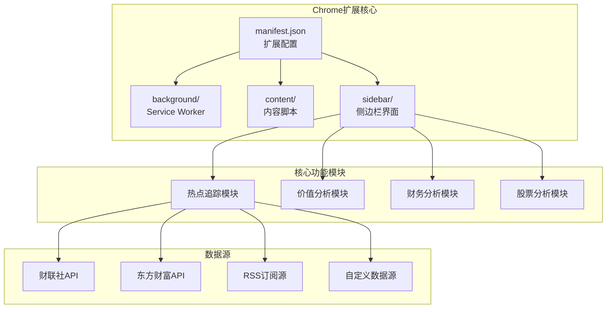
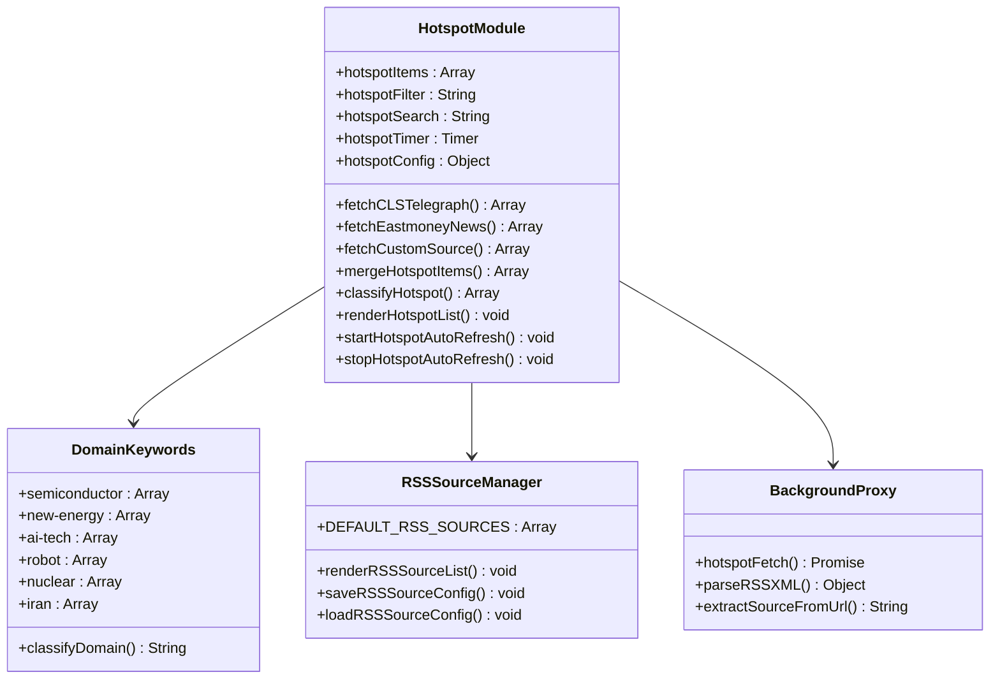
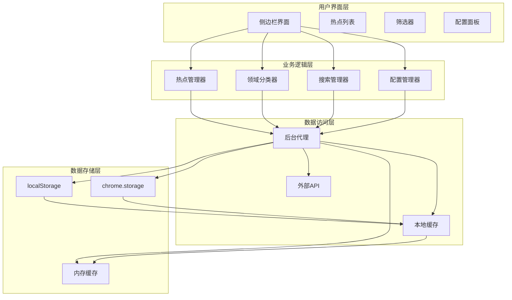
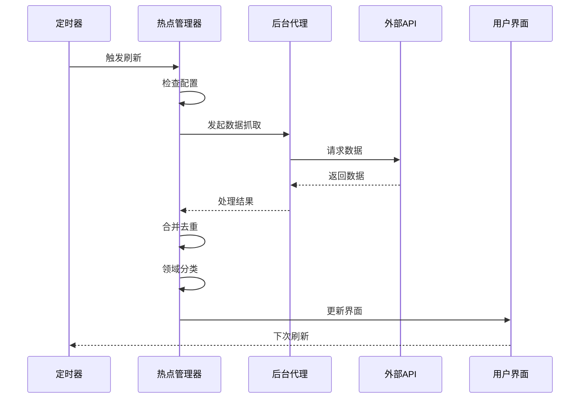
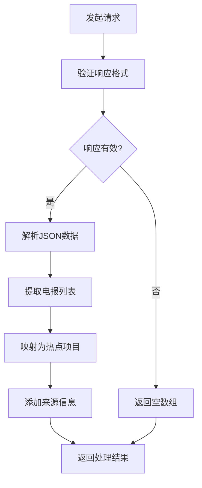
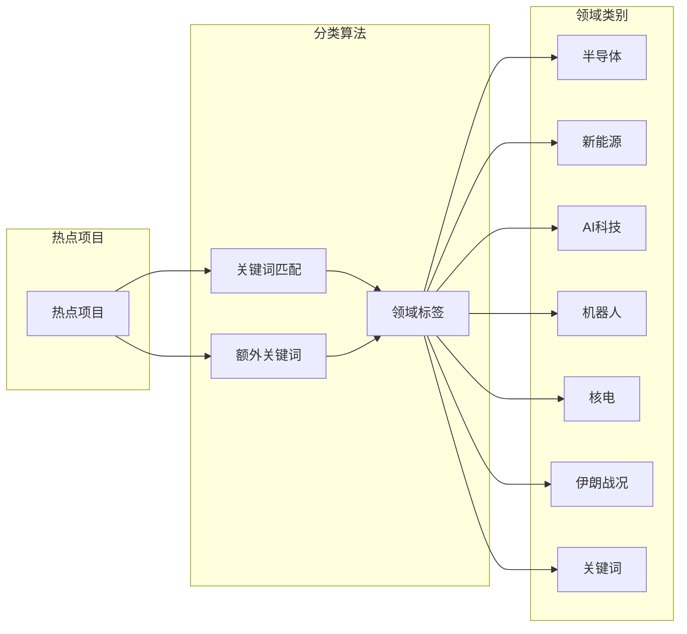
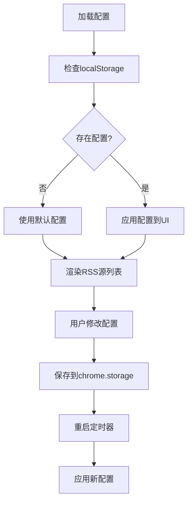
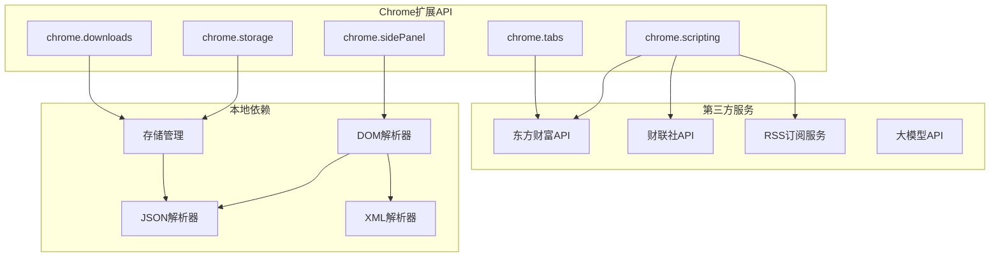
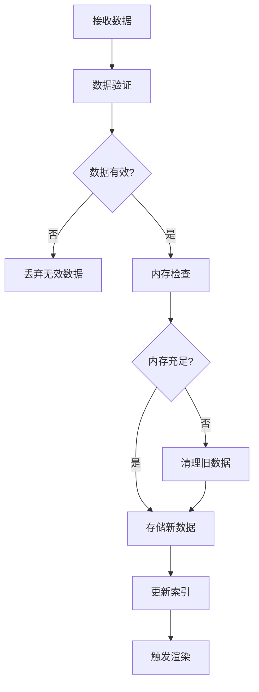

# 实时热点追踪

<cite>
**本文档引用的文件**
- [manifest.json](file://manifest.json)
- [background.js](file://background/background.js)
- [content.js](file://content/content.js)
- [sidepanel.js](file://sidebar/sidepanel.js)
- [options.html](file://sidebar/options.html)
- [README.md](file://README.md)
</cite>

## 目录
1. [简介](#简介)
2. [项目结构](#项目结构)
3. [核心组件](#核心组件)
4. [架构概览](#架构概览)
5. [详细组件分析](#详细组件分析)
6. [依赖分析](#依赖分析)
7. [性能考虑](#性能考虑)
8. [故障排除指南](#故障排除指南)
9. [结论](#结论)
10. [附录](#附录)

## 简介

实时热点追踪是投资助手Chrome扩展的核心功能模块，旨在为用户提供多数据源聚合的实时财经资讯。该功能集成了财联社、东方财富等主流财经媒体的数据源，通过智能分类和筛选机制，帮助用户快速获取和分析市场热点信息。

该模块采用现代化的前端架构，利用Chrome扩展的Side Panel API提供沉浸式的用户体验，同时通过Service Worker实现后台数据抓取和消息路由功能。

## 项目结构

项目采用模块化架构设计，主要包含以下核心目录：

**图表来源**
- [manifest.json:1-48](file://manifest.json#L1-L48)
- [sidepanel.js:1026-1068](file://sidebar/sidepanel.js#L1026-L1068)

**章节来源**
- [manifest.json:1-48](file://manifest.json#L1-L48)
- [README.md:108-126](file://README.md#L108-L126)

## 核心组件

### 热点追踪模块架构

热点追踪模块是整个扩展的核心功能，负责多数据源的信息聚合、处理和展示。该模块采用事件驱动的设计模式，通过定时器实现自动刷新机制。

**图表来源**
- [sidepanel.js:1026-1068](file://sidebar/sidepanel.js#L1026-L1068)
- [sidepanel.js:1070-1211](file://sidebar/sidepanel.js#L1070-L1211)
- [sidepanel.js:1245-1270](file://sidebar/sidepanel.js#L1245-L1270)

### 数据源配置系统

系统支持多种数据源类型的配置，包括内置API、RSS订阅和自定义URL：

| 数据源类型 | 配置选项 | 默认状态 | 示例URL |
|------------|----------|----------|---------|
| 财联社API | `clsEnabled` | 启用 | `https://www.cls.cn/nodeapi/...` |
| 东方财富API | `eastmoneyEnabled` | 启用 | `https://np-listapi.eastmoney.com/...` |
| RSS订阅源 | `DEFAULT_RSS_SOURCES` | 部分启用 | `https://rss.cls.cn/rss/...` |
| 自定义URL | `customSources` | 禁用 | `https://api.example.com/news` |

**章节来源**
- [sidepanel.js:564-584](file://sidebar/sidepanel.js#L564-L584)
- [sidepanel.js:1040-1068](file://sidebar/sidepanel.js#L1040-L1068)
- [sidepanel.js:1641-1668](file://sidebar/sidepanel.js#L1641-L1668)

## 架构概览

热点追踪功能采用分层架构设计，确保了良好的可维护性和扩展性：

**图表来源**
- [sidepanel.js:1026-1068](file://sidebar/sidepanel.js#L1026-L1068)
- [background.js:37-117](file://background/background.js#L37-L117)

## 详细组件分析

### 自动刷新机制

自动刷新机制是热点追踪功能的核心特性，通过定时器实现周期性的数据更新：

**图表来源**
- [sidepanel.js:1619-1626](file://sidebar/sidepanel.js#L1619-L1626)
- [sidepanel.js:1291-1363](file://sidebar/sidepanel.js#L1291-L1363)

#### 刷新配置选项

| 配置项 | 默认值 | 单位 | 说明 |
|--------|--------|------|------|
| `interval` | 5 | 分钟 | 刷新间隔时间 |
| `clsEnabled` | true | 布尔值 | 财联社数据源开关 |
| `eastmoneyEnabled` | true | 布尔值 | 东方财富数据源开关 |
| `customSources` | [] | 数组 | 自定义数据源URL列表 |
| `extraKeywords` | [] | 数组 | 额外关键词列表 |

**章节来源**
- [sidepanel.js:564-584](file://sidebar/sidepanel.js#L564-L584)
- [sidepanel.js:1619-1626](file://sidebar/sidepanel.js#L1619-L1626)

### 多数据源聚合机制

系统支持四种主要的数据源类型，每种都有特定的处理逻辑：

#### 1. 财联社电报数据源

财联社API提供实时的财经新闻和市场动态：

**图表来源**
- [sidepanel.js:1091-1120](file://sidebar/sidepanel.js#L1091-L1120)

#### 2. 东方财富新闻数据源

东方财富API提供7×24小时的财经资讯：

| 字段 | 类型 | 描述 |
|------|------|------|
| `title` | String | 新闻标题 |
| `summary` | String | 新闻摘要 |
| `showTime` | Date | 发布时间 |
| `mediaName` | String | 媒体名称 |
| `url` | String | 原文链接 |

#### 3. RSS订阅源

系统内置了23个RSS订阅源，涵盖主要财经媒体：

| 媒体 | 订阅源 | 类型 | 状态 |
|------|--------|------|------|
| 财联社 | `rss.cls.cn` | RSS | 启用 |
| 东方财富 | `rss.eastmoney.com` | RSS | 启用 |
| 上交所 | `sse.com.cn` | RSS | 禁用 |
| 深交所 | `szse.cn` | RSS | 禁用 |
| 路透社 | `cn.reuters.com` | RSS | 启用 |

#### 4. 自定义数据源

用户可以添加任意的RSS或JSON API数据源：

**章节来源**
- [sidepanel.js:1155-1211](file://sidebar/sidepanel.js#L1155-L1211)
- [sidepanel.js:1040-1068](file://sidebar/sidepanel.js#L1040-L1068)

### 领域过滤和关键词搜索

系统实现了智能的领域分类和关键词搜索功能：

#### 领域分类体系

**图表来源**
- [sidepanel.js:1245-1270](file://sidebar/sidepanel.js#L1245-L1270)

#### 关键词匹配算法

系统使用Jaccard相似度算法进行热点项目的去重和合并：

| 相似度阈值 | 合并规则 | 重合度计算 |
|------------|----------|------------|
| ≥ 0.4 | 合并为同一事件 | 来源数量 |
| < 0.4 | 保持独立 | 1源 |
| 无相似度 | 独立事件 | 1源 |

**章节来源**
- [sidepanel.js:1371-1492](file://sidebar/sidepanel.js#L1371-L1492)

### 数据源配置指南

#### 内置数据源配置

系统提供了完善的内置数据源配置管理：

**图表来源**
- [sidepanel.js:1693-1717](file://sidebar/sidepanel.js#L1693-L1717)

#### 自定义URL添加步骤

1. **访问配置界面**
   - 点击热点追踪模块的配置按钮
   - 打开数据源配置面板

2. **添加自定义URL**
   - 在"自定义数据源"文本框中输入完整的URL
   - 支持RSS和JSON格式
   - 每行一个URL

3. **配置数据格式**
   - 系统自动检测数据格式
   - RSS格式自动解析为统一结构
   - JSON格式支持多种数据结构

4. **测试连接**
   - 点击"测试"按钮验证URL有效性
   - 查看解析结果预览

5. **保存配置**
   - 点击"保存"按钮保存配置
   - 系统自动重启定时器应用新配置

**章节来源**
- [sidepanel.js:1641-1668](file://sidebar/sidepanel.js#L1641-L1668)
- [sidepanel.js:1673-1688](file://sidebar/sidepanel.js#L1673-L1688)

### 热点信息分类展示

系统实现了多层次的热点信息分类展示机制：

#### 热点热度分级

| 热度级别 | 来源数量 | 显示样式 | 颜色标识 |
|----------|----------|----------|----------|
| 🔥 爆热 | ≥ 3 | 红色高亮 | 红色边框 |
| 📌 温热 | 2 | 黄色强调 | 黄色边框 |
| 普通 | 1 | 默认样式 | 灰色边框 |

#### 领域标签系统

| 领域 | 标签颜色 | 关键词示例 | 显示图标 |
|------|----------|------------|----------|
| 半导体 | 蓝色 | 芯片、IC设计、光刻 | 🧪 |
| 新能源 | 绿色 | 电池、光伏、储能 | ☀️ |
| AI科技 | 紫色 | 人工智能、大模型、GPU | 🤖 |
| 机器人 | 橙色 | 人形机器人、工业机器人 | ⚙️ |
| 核电 | 红色 | 核反应堆、核燃料 | ⚡ |
| 伊朗战况 | 黑色 | 战争、冲突、制裁 | ⚔️ |

**章节来源**
- [sidepanel.js:1533-1564](file://sidebar/sidepanel.js#L1533-L1564)
- [sidepanel.js:1597-1598](file://sidebar/sidepanel.js#L1597-L1598)

## 依赖分析

### 外部依赖关系

**图表来源**
- [manifest.json:6-15](file://manifest.json#L6-L15)
- [background.js:1073-1086](file://background/background.js#L1073-L1086)

### 内部模块依赖

系统采用模块化设计，各功能模块之间保持松耦合：

| 模块 | 依赖模块 | 功能描述 |
|------|----------|----------|
| 热点追踪 | 配置管理 | 数据抓取和展示 |
| 配置管理 | 存储管理 | 用户配置持久化 |
| 搜索功能 | 热点追踪 | 关键词搜索 |
| 分析功能 | 热点追踪 | 数据分析和报告生成 |

**章节来源**
- [manifest.json:22-30](file://manifest.json#L22-L30)
- [background.js:16-19](file://background/background.js#L16-L19)

## 性能考虑

### 数据抓取优化

系统采用了多项性能优化措施：

1. **并发抓取**
   - 使用Promise.allSettled并行处理多个数据源
   - 避免单个数据源失败影响整体性能

2. **智能缓存**
   - 本地缓存热点数据减少重复抓取
   - 内存缓存提高渲染性能

3. **数据去重**
   - 基于Jaccard相似度的去重算法
   - 限制比较范围避免O(n²)复杂度

### 内存管理

**图表来源**
- [sidepanel.js:1275-1286](file://sidebar/sidepanel.js#L1275-L1286)

### 网络请求优化

系统通过以下方式优化网络请求：

- **CORS代理**：通过background脚本绕过CORS限制
- **请求合并**：将多个API请求合并为单个请求
- **错误重试**：实现智能的错误重试机制
- **超时控制**：设置合理的请求超时时间

## 故障排除指南

### 常见问题诊断

#### 数据源连接失败

**症状**：热点列表显示空白或加载失败

**诊断步骤**：
1. 检查网络连接状态
2. 验证数据源URL有效性
3. 查看浏览器开发者工具的网络面板
4. 检查CORS错误信息

**解决方案**：
- 更换备用数据源
- 检查防火墙设置
- 清除浏览器缓存

#### 自动刷新异常

**症状**：热点信息不自动更新

**诊断步骤**：
1. 检查定时器状态
2. 验证配置参数
3. 查看控制台错误日志

**解决方案**：
- 重启扩展
- 重新配置刷新间隔
- 检查系统时间设置

#### 数据解析错误

**症状**：RSS或JSON数据解析失败

**诊断步骤**：
1. 验证数据格式正确性
2. 检查编码格式
3. 查看解析错误详情

**解决方案**：
- 转换为标准格式
- 检查字符编码
- 使用备用解析器

**章节来源**
- [background.js:112-116](file://background/background.js#L112-L116)
- [sidepanel.js:1631-1636](file://sidebar/sidepanel.js#L1631-L1636)

### 调试工具使用

系统提供了丰富的调试工具：

1. **开发者工具**
   - Network面板查看网络请求
   - Console面板查看错误日志
   - Storage面板查看存储状态

2. **配置重置**
   - 清除localStorage中的配置
   - 重置为默认配置
   - 重新初始化模块

3. **日志监控**
   - 启用详细日志模式
   - 查看数据抓取过程
   - 监控性能指标

## 结论

实时热点追踪功能通过精心设计的架构和优化的算法，成功实现了多数据源的高效聚合和智能展示。该功能不仅提供了丰富的财经资讯，更重要的是通过智能化的分类和筛选机制，帮助用户快速定位有价值的信息。

系统的模块化设计确保了良好的可维护性和扩展性，而自动刷新机制和智能去重算法则保证了数据的新鲜度和准确性。通过合理的性能优化和故障排除机制，该功能能够在各种环境下稳定运行。

未来可以在以下几个方面进一步改进：
- 增加更多的数据源类型支持
- 优化移动端的用户体验
- 提供更精细的个性化推荐
- 增强数据分析和可视化功能

## 附录

### 使用技巧和最佳实践

#### 信息获取最佳实践

1. **合理配置刷新频率**
   - 一般情况下使用5分钟刷新间隔
   - 重要事件时可适当缩短刷新间隔
   - 避免过于频繁的刷新影响性能

2. **精准设置领域过滤**
   - 根据投资偏好选择相关领域
   - 使用关键词搜索功能精确定位
   - 定期清理不相关的过滤条件

3. **充分利用自定义数据源**
   - 添加权威的财经媒体RSS源
   - 配置行业特定的新闻源
   - 定期评估和优化数据源质量

#### 配置优化建议

1. **数据源选择策略**
   - 优先选择API稳定的官方数据源
   - 保持RSS源的多样性和互补性
   - 定期清理失效的数据源链接

2. **性能优化配置**
   - 控制热点项目数量在合理范围内
   - 合理设置关键词匹配阈值
   - 定期清理过期的热点信息

3. **用户体验优化**
   - 根据个人习惯调整界面布局
   - 设置合适的字体大小和颜色主题
   - 利用快捷键提高操作效率

**章节来源**
- [sidepanel.js:1619-1626](file://sidebar/sidepanel.js#L1619-L1626)
- [sidepanel.js:1693-1717](file://sidebar/sidepanel.js#L1693-L1717)