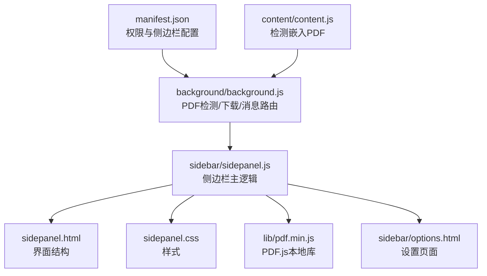
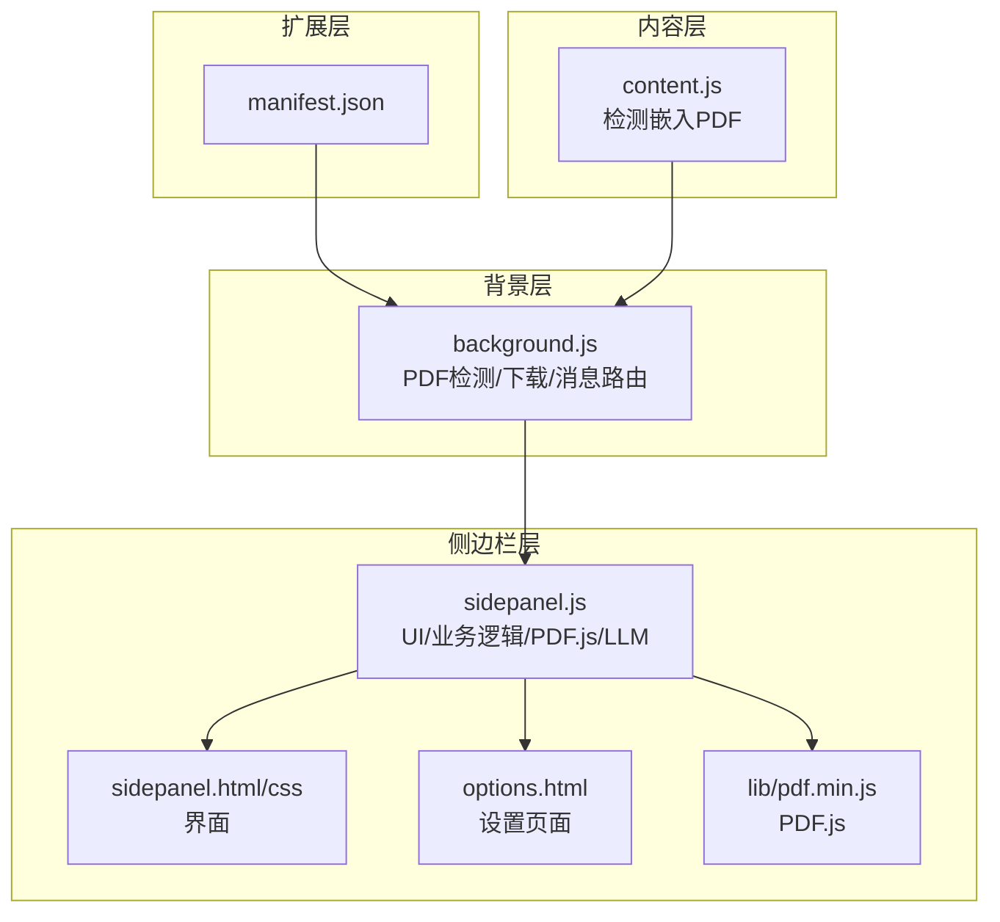
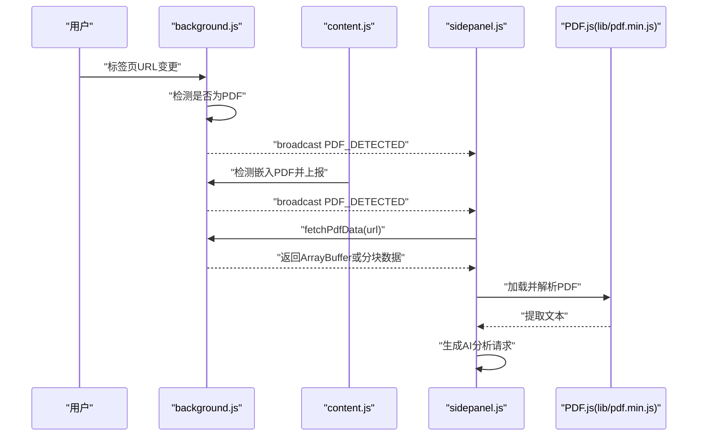
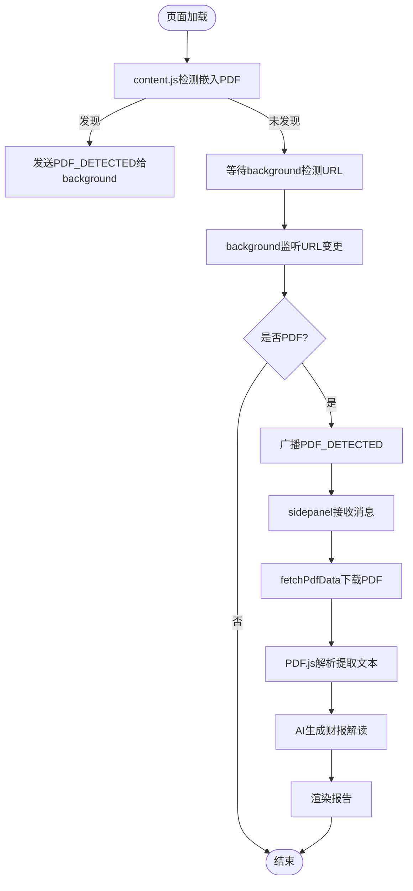
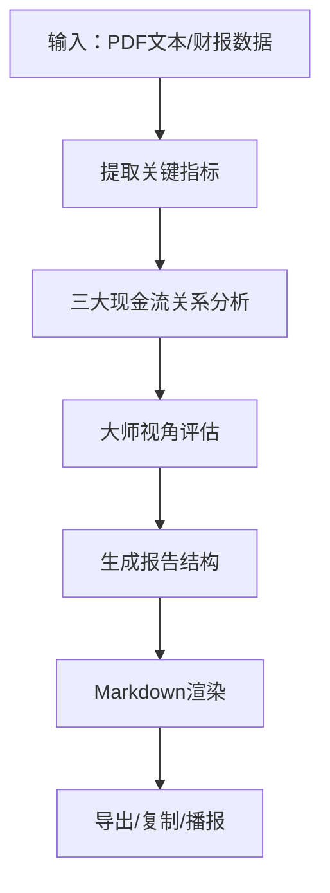
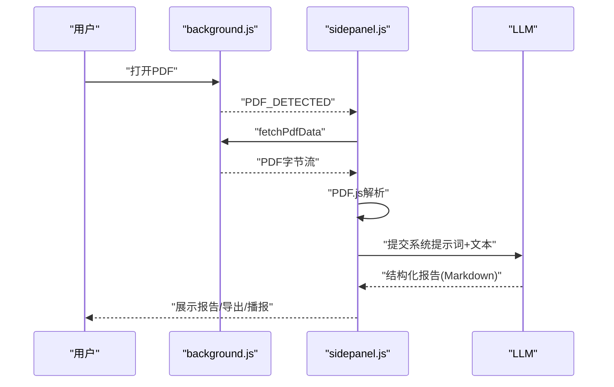
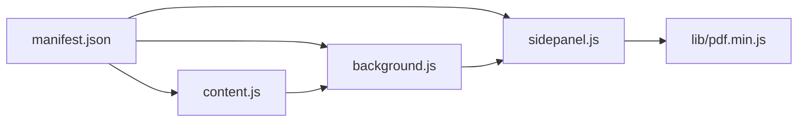

# 智能财报解读

<cite>
**本文引用的文件**
- [manifest.json](file://manifest.json)
- [background.js](file://background/background.js)
- [content.js](file://content/content.js)
- [sidepanel.js](file://sidebar/sidepanel.js)
- [sidepanel.html](file://sidebar/sidepanel.html)
- [sidepanel.css](file://sidebar/sidepanel.css)
- [options.html](file://sidebar/options.html)
- [README.md](file://README.md)
- [pdf.min.js](file://lib/pdf.min.js)
</cite>

## 目录
1. [简介](#简介)
2. [项目结构](#项目结构)
3. [核心组件](#核心组件)
4. [架构总览](#架构总览)
5. [详细组件分析](#详细组件分析)
6. [依赖关系分析](#依赖关系分析)
7. [性能考量](#性能考量)
8. [故障排查指南](#故障排查指南)
9. [结论](#结论)
10. [附录](#附录)

## 简介
本项目是一个基于 Chrome 扩展的“智能财报解读”工具，融合巴菲特、林奇、费雪、芒格与格雷厄姆五大价值投资大师的分析框架，提供从 PDF 自动检测、文本提取、AI 驱动的结构化财报解读到多维度投资建议的全流程能力。系统采用 Manifest V3 + Side Panel API，结合 PDF.js 实现 PDF 文本提取，通过背景脚本绕过 CORS 限制下载 PDF，侧边栏前端负责交互与报告渲染。

## 项目结构
- manifest.json：声明权限、侧边栏路径、web_accessible_resources、action 图标等
- background/background.js：Service Worker，负责 PDF 检测、PDF 下载、消息路由、RSS/XML 解析
- content/content.js：内容脚本，检测网页中嵌入的 PDF（embed/object/iframe），向 background 发送信号
- sidebar/sidepanel.{html,css,js}：侧边栏界面与逻辑，包含热点信息、选股器、估值计算器、财报解读、股票分析、AI 对话等模块
- lib/pdf.min.js：PDF.js 库（本地打包），用于 PDF 文本提取
- sidebar/options.html：设置页面，保存 LLM 服务商与 API Key

图表来源
- [manifest.json:1-48](file://manifest.json#L1-L48)
- [background.js:1-307](file://background/background.js#L1-L307)
- [content.js:1-36](file://content/content.js#L1-L36)
- [sidepanel.js:1-800](file://sidebar/sidepanel.js#L1-L800)
- [sidepanel.html:1-646](file://sidebar/sidepanel.html#L1-L646)
- [sidepanel.css:1-800](file://sidebar/sidepanel.css#L1-L800)
- [options.html:1-124](file://sidebar/options.html#L1-L124)
- [pdf.min.js:1-22](file://lib/pdf.min.js#L1-L22)

章节来源
- [manifest.json:1-48](file://manifest.json#L1-L48)
- [README.md:108-126](file://README.md#L108-L126)

## 核心组件
- PDF 自动检测与下载
  - 背景脚本监听标签页更新，识别 .pdf、含查询参数或 chrome://pdf-viewer 的 URL，向侧边栏广播“PDF_DETECTED”
  - 内容脚本检测 embed/object/iframe 中的 PDF，辅助信号
  - 侧边栏收到消息后，通过 background.fetchPdfData 获取 PDF 字节流（支持分块传输）
- 文本提取与解析
  - 侧边栏使用 PDF.js（本地 lib/pdf.min.js）解析 PDF，提取文本
- AI 驱动的财报解读
  - 侧边栏构造系统提示词与用户输入，调用 LLM（OpenAI/DeepSeek/智谱/通义/自定义）生成结构化报告
  - 报告融合四大投资大师（巴菲特/林奇/费雪/芒格）与格雷厄姆的安全边际理念
- 报告结构与关键指标
  - 报告包含：核心业绩概览、业务亮点、增长驱动力、不及预期原因、投资风险、管理层观点、大师视角、同行业对比、行业分析、综合评述
  - 关键指标涵盖：营收、归母净利润、扣非净利润、毛利率、净利率、ROE、经营/投资/筹资现金流、资产负债率、流动比率等

章节来源
- [background.js:21-34](file://background/background.js#L21-L34)
- [content.js:11-28](file://content/content.js#L11-L28)
- [sidepanel.js:300-405](file://sidebar/sidepanel.js#L300-L405)
- [pdf.min.js:1-22](file://lib/pdf.min.js#L1-L22)

## 架构总览
系统采用“扩展 + 侧边栏 + PDF.js + LLM”的分层架构：
- 扩展层：manifest 声明权限与 side panel
- 背景层：Service Worker 负责 PDF 检测与下载、消息路由、RSS/XML 解析
- 内容层：content script 辅助检测嵌入 PDF
- 侧边栏层：UI 与业务逻辑，负责 PDF 文本提取、AI 对话、报告生成与展示

图表来源
- [manifest.json:1-48](file://manifest.json#L1-L48)
- [background.js:1-307](file://background/background.js#L1-L307)
- [content.js:1-36](file://content/content.js#L1-L36)
- [sidepanel.js:1-800](file://sidebar/sidepanel.js#L1-L800)
- [sidepanel.html:1-646](file://sidebar/sidepanel.html#L1-L646)
- [sidepanel.css:1-800](file://sidebar/sidepanel.css#L1-L800)
- [options.html:1-124](file://sidebar/options.html#L1-L124)
- [pdf.min.js:1-22](file://lib/pdf.min.js#L1-L22)

## 详细组件分析

### PDF 自动检测与下载机制
- 背景脚本监听 tabs.onUpdated，识别 .pdf、带查询参数或 chrome://pdf-viewer 的 URL，广播 PDF_DETECTED
- content script 检测 embed/object/iframe 中的 PDF，向 background 发送 PDF_DETECTED
- 侧边栏收到消息后，调用 background.fetchPdfData：
  - 若 URL 为 chrome://pdf-viewer，解析 src 参数获取真实 PDF 地址
  - 使用 fetch 获取 PDF，校验 Content-Type，必要时转换为 ArrayBuffer
  - 大文件（>10MB）分块传输，便于消息传递
- 侧边栏使用 PDF.js 解析 PDF，提取文本并进入分析流程

图表来源
- [background.js:21-34](file://background/background.js#L21-L34)
- [background.js:125-177](file://background/background.js#L125-L177)
- [content.js:11-28](file://content/content.js#L11-L28)
- [sidepanel.js:974-986](file://sidebar/sidepanel.js#L974-L986)
- [pdf.min.js:1-22](file://lib/pdf.min.js#L1-L22)

章节来源
- [background.js:21-34](file://background/background.js#L21-L34)
- [background.js:125-177](file://background/background.js#L125-L177)
- [content.js:11-28](file://content/content.js#L11-L28)
- [sidepanel.js:974-986](file://sidebar/sidepanel.js#L974-L986)

### 内容脚本与后台脚本协作
- content script 仅检测网页中的 PDF，不处理下载与解析，避免在 chrome://pdf-viewer 中注入失败
- background 负责下载 PDF（不受 CORS 限制）、消息路由、RSS/XML 解析
- sidepanel 负责 UI、状态管理、PDF.js 解析、LLM 调用与报告渲染

图表来源
- [content.js:11-28](file://content/content.js#L11-L28)
- [background.js:21-34](file://background/background.js#L21-L34)
- [sidepanel.js:974-986](file://sidebar/sidepanel.js#L974-L986)

章节来源
- [content.js:11-28](file://content/content.js#L11-L28)
- [background.js:21-34](file://background/background.js#L21-L34)
- [sidepanel.js:974-986](file://sidebar/sidepanel.js#L974-L986)

### AI 驱动的财务报表分析流程
- 系统提示词（ANALYSIS_SYSTEM_PROMPT）定义报告结构与大师视角评估维度
- 关键指标识别与判断：严格依据阈值进行等级划分（优秀/良好/一般/较差）
- 三大现金流关系分析：经营现金流/净利润比率、投资现金流/经营现金流比率、筹资现金流/经营现金流比率
- 大师视角融合：
  - 巴菲特：护城河、ROE、所有者盈余、留存收益效率、管理层、定价权、估值合理性
  - 林奇：公司分类、PEG、盈利增长、负债水平、现金流、增长持续性
  - 费雪：市场空间、研发投入、销售组织、利润率趋势、管理层深度、成本控制、长期导向
  - 芒格：逆向排除、ROIC vs WACC、竞争壁垒趋势、压力测试、管理层理性、心理偏误、决策质量
- 输出格式：Markdown 表格与分级结构，支持导出与复制

图表来源
- [sidepanel.js:300-405](file://sidebar/sidepanel.js#L300-L405)

章节来源
- [sidepanel.js:300-405](file://sidebar/sidepanel.js#L300-L405)

### 四大投资大师分析框架融合
- 格雷厄姆：安全边际、PE/PB、股息、流动比率、负债权益比、盈利稳定性、内在价值
- 巴菲特：护城河、ROE、所有者盈余、留存收益效率、管理层、定价权、合理价格
- 林奇：PEG、公司分类、盈利增长率、负债水平、机构持股、回购、内部人交易
- 费雪：研发投入、销售团队、利润率、管理层深度、新产品管线、成本意识、劳资关系
- 芒格：逆向思维、ROIC vs WACC、竞争壁垒趋势、压力测试、管理层理性、心理偏误、决策质量

章节来源
- [sidepanel.js:14-297](file://sidebar/sidepanel.js#L14-L297)

### 使用流程：从 PDF 检测到分析报告生成
- 打开浏览器中任意 PDF（含 chrome://pdf-viewer）
- 点击扩展图标，自动打开侧边栏
- 背景脚本检测到 PDF 后广播消息，侧边栏开始下载并解析 PDF
- 提取文本后，侧边栏调用 LLM 生成结构化财报解读报告
- 支持纲要导航、TTS 播报、导出 Markdown、继续对话深入分析

图表来源
- [background.js:21-34](file://background/background.js#L21-L34)
- [background.js:125-177](file://background/background.js#L125-L177)
- [sidepanel.js:974-986](file://sidebar/sidepanel.js#L974-L986)

章节来源
- [README.md:103-106](file://README.md#L103-L106)

## 依赖关系分析
- manifest.json
  - permissions：sidePanel、activeTab、scripting、storage、downloads
  - host_permissions：<all_urls>
  - web_accessible_resources：pdf.min.js、pdf.worker.min.js
  - action：扩展图标与默认标题
- background.js
  - 监听 tabs.onUpdated，检测 PDF URL
  - 监听 runtime.onMessage，处理 FETCH_PDF_DATA、PDF_DETECTED、GET_CURRENT_TAB、HOTSPOT_FETCH
  - 提供 fetchPdfData、parseRSSXML 等工具函数
- content.js
  - 检测 embed/object/iframe 中的 PDF，向 background 发送 PDF_DETECTED
- sidepanel.js
  - 状态管理、事件绑定、PDF 解析、LLM 调用、报告渲染、TTS 播报、导出
  - 定义 ANALYSIS_SYSTEM_PROMPT、CHAT_SYSTEM_PROMPT、DEFAULT_PROVIDERS 等常量
- pdf.min.js
  - PDF.js 本地库，用于 PDF 文本提取

图表来源
- [manifest.json:1-48](file://manifest.json#L1-L48)
- [background.js:1-307](file://background/background.js#L1-L307)
- [content.js:1-36](file://content/content.js#L1-L36)
- [sidepanel.js:1-800](file://sidebar/sidepanel.js#L1-L800)
- [pdf.min.js:1-22](file://lib/pdf.min.js#L1-L22)

章节来源
- [manifest.json:1-48](file://manifest.json#L1-L48)
- [background.js:1-307](file://background/background.js#L1-L307)
- [content.js:1-36](file://content/content.js#L1-L36)
- [sidepanel.js:1-800](file://sidebar/sidepanel.js#L1-L800)
- [pdf.min.js:1-22](file://lib/pdf.min.js#L1-L22)

## 性能考量
- PDF 下载与解析
  - 大文件分块传输（>10MB），降低消息传递开销
  - PDF.js 本地加载，避免网络抖动影响
- LLM 调用
  - 通过 options.html 配置 LLM 服务商与 API Key，支持多提供商
  - 侧边栏状态管理避免重复请求
- UI 与交互
  - 侧边栏采用虚拟滚动与懒加载，热点信息最多保留 500 条，过滤 24 小时内数据
  - TTS 播报支持语速调节与进度条

## 故障排查指南
- PDF 无法检测
  - 确认 URL 以 .pdf 结尾或包含查询参数/锚点，或为 chrome://pdf-viewer
  - 检查 background 是否广播 PDF_DETECTED，content script 是否检测到嵌入 PDF
- PDF 下载失败
  - 检查 background.fetchPdfData 返回的错误信息（HTTP 状态、Content-Type）
  - 对于 chrome://pdf-viewer，确认 src 参数解析成功
- LLM 无响应或报错
  - 检查 options.html 中 LLM 服务商、API 地址、API Key 是否正确保存
  - 确认 sidepanel.js 中 DEFAULT_PROVIDERS 与当前配置一致
- 报告为空或解析异常
  - 确认 PDF.js 成功解析文本
  - 检查 ANALYSIS_SYSTEM_PROMPT 是否被正确传入 LLM

章节来源
- [background.js:125-177](file://background/background.js#L125-L177)
- [content.js:11-28](file://content/content.js#L11-L28)
- [sidepanel.js:609-637](file://sidebar/sidepanel.js#L609-L637)
- [options.html:72-121](file://sidebar/options.html#L72-L121)

## 结论
本项目通过“PDF 自动检测 + 背景下载 + 侧边栏解析 + AI 结构化解读”的完整链路，实现了从财报 PDF 到多维度投资建议的闭环。依托五大价值投资大师框架，系统在关键指标识别、现金流关系分析、风险与机会评估等方面提供了严谨、可复现的分析流程，适合希望提升财报解读效率与质量的投资者使用。

## 附录
- 报告结构与关键指标解释
  - 核心业绩概览：简述本期财报定调，关键指标同比/环比与判断等级
  - 业务亮点：3-5 个数据支撑的正面信号
  - 增长驱动力：量/价/结构/效率四维分析
  - 不及预期原因：深挖根因与持续性判断
  - 投资风险：短期+中长期+行业红旗信号
  - 管理层观点：从 MD&A/业绩说明会提炼管理层关键表态
  - 大师视角：巴菲特/林奇/费雪/芒格逐项评估与综合评分
  - 同行业趋势对比：横向对比表与趋势分析
  - 行业深度分析：周期定位评分与竞争格局五力分析
  - 综合评述：定调+评级+前瞻信号
- 投资建议解读方法
  - 结合大师评分与安全边际，给出“强烈推荐/推荐/观望/回避”的结论
  - 关注现金流质量、护城河变化、管理层理性与市场偏误，避免情绪化决策

章节来源
- [sidepanel.js:300-405](file://sidebar/sidepanel.js#L300-L405)