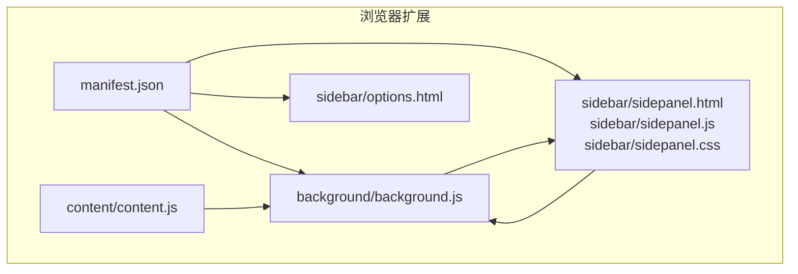
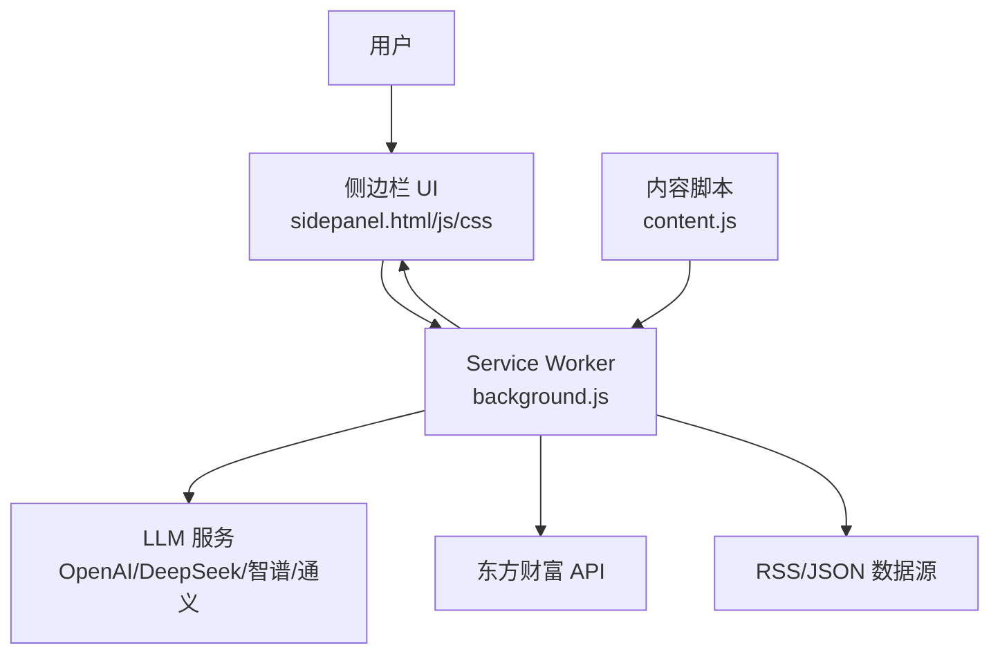
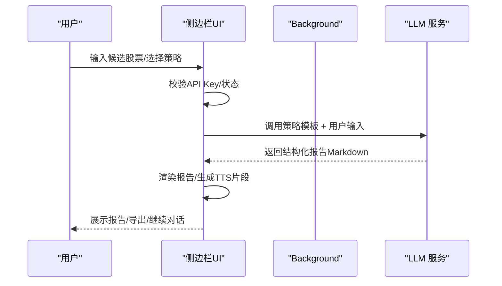
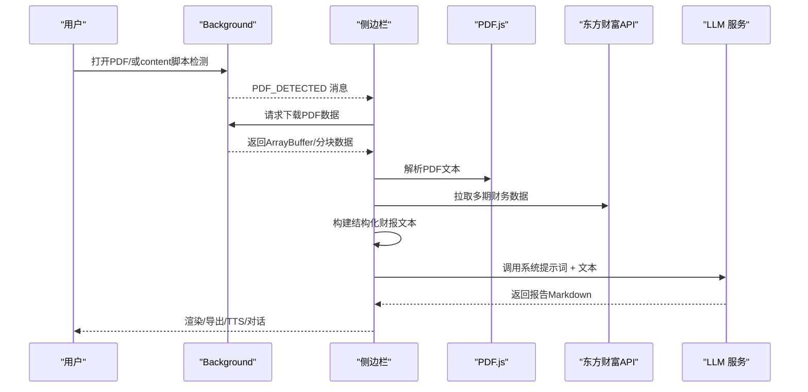
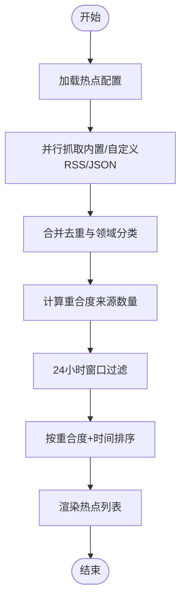
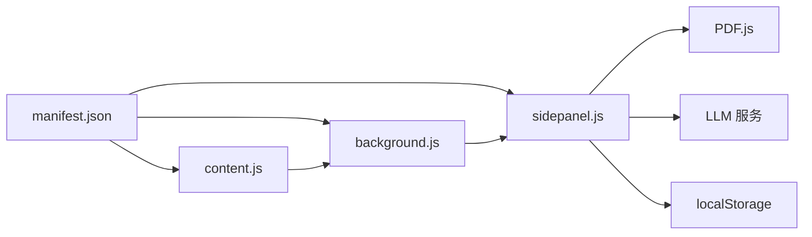

# 核心功能

<cite>
**本文引用的文件**
- [manifest.json](file://manifest.json)
- [background.js](file://background/background.js)
- [content.js](file://content/content.js)
- [sidepanel.html](file://sidebar/sidepanel.html)
- [sidepanel.js](file://sidebar/sidepanel.js)
- [sidepanel.css](file://sidebar/sidepanel.css)
- [options.html](file://sidebar/options.html)
- [README.md](file://README.md)
</cite>

## 目录
1. [简介](#简介)
2. [项目结构](#项目结构)
3. [核心组件](#核心组件)
4. [架构总览](#架构总览)
5. [详细组件分析](#详细组件分析)
6. [依赖关系分析](#依赖关系分析)
7. [性能考量](#性能考量)
8. [故障排查指南](#故障排查指南)
9. [结论](#结论)
10. [附录](#附录)

## 简介
本项目是一个基于 Chrome 扩展的“投资助手”，围绕五大核心功能模块构建：价值投资大师选股器、智能财报解读、企业内在价值计算器、实时热点追踪、AI 对话分析。系统采用 Manifest V3 + Side Panel API，结合 PDF.js、Web Speech API 与 LLM（OpenAI/DeepSeek/智谱/通义等）实现从数据采集、结构化解析到智能分析与可视化的完整闭环。

## 项目结构
- manifest.json：声明扩展权限、侧边栏路径、图标、下载资源等
- background/background.js：Service Worker，负责侧边栏开关、PDF 检测与下载、热点抓取、消息路由
- content/content.js：内容脚本，检测网页内嵌 PDF，向 background 发送信号
- sidebar/sidepanel.html：侧边栏页面，包含六大标签页（热点、选股器、估值、财报解读、股票分析、对话）
- sidebar/sidepanel.js：侧边栏主逻辑，涵盖所有功能模块、状态管理、事件绑定、UI 渲染
- sidebar/sidepanel.css：侧边栏样式
- sidebar/options.html：设置页（LLM 服务商、API Key、模型、关注公司等）
- README.md：功能说明、安装与使用指南

图表来源
- [manifest.json:1-48](file://manifest.json#L1-L48)
- [background.js:1-307](file://background/background.js#L1-L307)
- [content.js:1-36](file://content/content.js#L1-L36)
- [sidepanel.html:1-646](file://sidebar/sidepanel.html#L1-L646)
- [sidepanel.js:1-800](file://sidebar/sidepanel.js#L1-L800)
- [options.html:1-124](file://sidebar/options.html#L1-L124)

章节来源
- [manifest.json:1-48](file://manifest.json#L1-L48)
- [README.md:108-126](file://README.md#L108-L126)

## 核心组件
- 侧边栏（Side Panel）：承载六大功能模块，支持标签切换、TTS 播报、纲要导航、导出 Markdown
- Service Worker（Background）：负责 PDF 检测与下载、热点抓取与聚合、跨源请求代理、消息路由
- 内容脚本（Content）：检测网页内嵌 PDF，辅助 background 完成 PDF 识别
- LLM 集成：支持多家 LLM 服务商，统一通过代理接口调用，流式输出
- 数据源：东方财富 API（股票搜索、行情、财务数据、公告）、RSS/JSON 数据源（热点）

章节来源
- [sidepanel.js:514-584](file://sidebar/sidepanel.js#L514-L584)
- [background.js:36-117](file://background/background.js#L36-L117)
- [content.js:11-36](file://content/content.js#L11-L36)
- [sidepanel.html:32-646](file://sidebar/sidepanel.html#L32-L646)

## 架构总览
系统采用“侧边栏 + Service Worker + 内容脚本”的三层架构。侧边栏负责交互与展示；Service Worker 处理跨域与下载；内容脚本负责 PDF 检测。LLM 通过 background 代理调用，热点数据通过 background 并行抓取与聚合，最终在侧边栏渲染。

图表来源
- [sidepanel.html:1-646](file://sidebar/sidepanel.html#L1-L646)
- [sidepanel.js:1-800](file://sidebar/sidepanel.js#L1-L800)
- [background.js:1-307](file://background/background.js#L1-L307)
- [content.js:1-36](file://content/content.js#L1-L36)

## 详细组件分析

### 价值投资大师选股器
- 功能概述：基于五位价值投资大师策略（格雷厄姆、巴菲特、彼得·林奇、费雪、芒格）与综合策略，对候选股票进行筛选与评分，输出结构化报告
- 核心流程：
  1) 输入候选股票（代码/名称/行业/条件描述）
  2) 选择策略（格雷厄姆/巴菲特/林奇/费雪/芒格/综合）
  3) 调用 LLM，按策略模板输出评分与结论
  4) 支持导出 Markdown、继续对话
- 关键实现点：
  - 策略模板与评分维度集中定义在 sidepanel.js 中
  - 事件绑定与运行逻辑集中在 runScreener
  - UI 通过 Markdown 渲染与 TTS 播报集成

图表来源
- [sidepanel.js:2504-2563](file://sidebar/sidepanel.js#L2504-L2563)
- [sidepanel.js:2482-2499](file://sidebar/sidepanel.js#L2482-L2499)
- [sidepanel.html:224-289](file://sidebar/sidepanel.html#L224-L289)

章节来源
- [sidepanel.js:14-297](file://sidebar/sidepanel.js#L14-L297)
- [sidepanel.js:2482-2563](file://sidebar/sidepanel.js#L2482-L2563)
- [sidepanel.html:224-289](file://sidebar/sidepanel.html#L224-L289)

### 智能财报解读
- 功能概述：支持两种入口：打开财报 PDF（自动检测并提取）或手动粘贴文本；自动拉取多期财务数据，构建结构化文本，交由 LLM 生成十段式深度解读报告
- 核心流程：
  1) 检测 PDF（chrome://pdf-viewer 或 .pdf URL）
  2) background 下载 PDF（处理大文件分块）
  3) sidepanel 使用 PDF.js 解析文本
  4) 拉取多期财务数据（利润表/资产负债表/现金流量表/主要指标/行情）
  5) 构建结构化财报文本
  6) 调用 LLM 生成报告（系统提示词内置）
  7) 支持导出 Markdown、TTS 播报、继续对话
- 关键实现点：
  - PDF 检测与下载：background.js
  - PDF 解析与分页提取：sidepanel.js
  - 财务数据拉取与文本构建：sidepanel.js
  - 报告生成与渲染：sidepanel.js

图表来源
- [background.js:21-34](file://background/background.js#L21-L34)
- [background.js:125-177](file://background/background.js#L125-L177)
- [sidepanel.js:2613-2697](file://sidebar/sidepanel.js#L2613-L2697)
- [sidepanel.js:2720-3010](file://sidebar/sidepanel.js#L2720-L3010)

章节来源
- [background.js:125-177](file://background/background.js#L125-L177)
- [sidepanel.js:2613-2697](file://sidebar/sidepanel.js#L2613-L2697)
- [sidepanel.js:2720-3010](file://sidebar/sidepanel.js#L2720-L3010)

### 企业内在价值计算器
- 功能概述：输入股票名称/代码，自动搜索匹配并拉取基础财务数据，支持五种经典估值方法（DCF、格雷厄姆、DDM、相对PE/PB、EVA），输出内在价值与安全边际
- 核心流程：
  1) 搜索股票（东方财富 API）
  2) 自动填充参数（PE/PB/ROE/ROIC/现金流等）
  3) 选择估值方法，输入或确认参数
  4) 计算内在价值与安全边际，可视化对比
- 关键实现点：
  - 股票搜索与参数填充：sidepanel.js
  - 估值方法切换与参数渲染：sidepanel.js
  - 计算与结果展示：sidepanel.js

章节来源
- [sidepanel.html:291-371](file://sidebar/sidepanel.html#L291-L371)
- [sidepanel.js:846-901](file://sidebar/sidepanel.js#L846-L901)

### 实时热点追踪
- 功能概述：聚合财联社、东方财富、巨潮资讯、雪球、金十等多源 RSS/JSON 数据，按领域关键词与自定义关键词进行分类与去重，支持自动刷新与热度标记
- 核心流程：
  1) 配置数据源（内置/自定义RSS/JSON）
  2) 并行抓取各数据源
  3) 合并去重与领域分类（Jaccard 相似度）
  4) 计算重合度（来源数量），高热度标记
  5) 过滤与排序（24小时窗口、重合度优先、时间倒序）
  6) 渲染列表、支持领域过滤与关键词搜索
- 关键实现点：
  - 数据源配置与保存：sidepanel.js
  - 并行抓取与聚合：fetchAllHotspots
  - 去重与相似度计算：computeHotspotOverlap
  - 渲染与交互：renderHotspotList/bindHotspotEvents

图表来源
- [sidepanel.js:1291-1363](file://sidebar/sidepanel.js#L1291-L1363)
- [sidepanel.js:1371-1492](file://sidebar/sidepanel.js#L1371-L1492)
- [sidepanel.js:1497-1585](file://sidebar/sidepanel.js#L1497-L1585)

章节来源
- [sidepanel.js:1026-1068](file://sidebar/sidepanel.js#L1026-L1068)
- [sidepanel.js:1291-1363](file://sidebar/sidepanel.js#L1291-L1363)
- [sidepanel.js:1371-1492](file://sidebar/sidepanel.js#L1371-L1492)
- [sidepanel.js:1497-1585](file://sidebar/sidepanel.js#L1497-L1585)

### AI 对话分析
- 功能概述：基于已生成的报告或选股结果，继续与 LLM 进行深入问答；支持常用问题建议、流式输出、继续分析
- 核心流程：
  1) 选择“对话”标签
  2) 输入问题或点击建议
  3) 调用 LLM（CHAT_SYSTEM_PROMPT + 上下文）
  4) 流式输出回答，支持继续提问
- 关键实现点：
  - 对话 UI 与事件绑定：sidepanel.js
  - 系统提示词：CHAT_SYSTEM_PROMPT
  - 与报告/选股结果的上下文衔接

章节来源
- [sidepanel.html:545-562](file://sidebar/sidepanel.html#L545-L562)
- [sidepanel.js:958-979](file://sidebar/sidepanel.js#L958-L979)
- [sidepanel.js:407-415](file://sidebar/sidepanel.js#L407-L415)

### 股票分析（投资公司分析框架）
- 功能概述：基于“投资公司分析框架”对股票进行全面分析，包括行业与商业模式、财务稳健性、管理层质量、估值分析、核心风险、预期与触发点
- 核心流程：
  1) 搜索股票（东方财富 API）
  2) 获取实时行情与财务数据
  3) 调用 LLM（STOCK_ANALYSIS_SYSTEM_PROMPT）生成报告
  4) 支持导出 Markdown、继续对话
- 关键实现点：
  - 框架提示词：STOCK_ANALYSIS_SYSTEM_PROMPT
  - 数据拉取与报告生成：sidepanel.js

章节来源
- [sidepanel.html:442-543](file://sidebar/sidepanel.html#L442-L543)
- [sidepanel.js:425-512](file://sidebar/sidepanel.js#L425-L512)
- [sidepanel.js:902-956](file://sidebar/sidepanel.js#L902-L956)

## 依赖关系分析
- manifest.json 声明权限与侧边栏路径，background 与 sidepanel 通过 runtime 通信
- background.js 依赖 Web API（fetch、DOMParser、chrome.*）与 PDF.js（通过 web_accessible_resources 注入）
- content.js 仅负责 PDF 检测，不直接解析 PDF
- sidepanel.js 依赖 PDF.js、Web Speech API（TTS）、LLM 代理接口、LocalStorage（设置与关注列表）

图表来源
- [manifest.json:6-30](file://manifest.json#L6-L30)
- [background.js:125-177](file://background/background.js#L125-L177)
- [sidepanel.js:2567-2583](file://sidebar/sidepanel.js#L2567-L2583)
- [sidepanel.js:609-637](file://sidebar/sidepanel.js#L609-L637)

章节来源
- [manifest.json:6-30](file://manifest.json#L6-L30)
- [background.js:125-177](file://background/background.js#L125-L177)
- [sidepanel.js:2567-2583](file://sidebar/sidepanel.js#L2567-L2583)

## 性能考量
- PDF 大文件分块传输：background.js 对大于 10MB 的 PDF 进行分块传输，避免消息传递过大导致性能问题
- 并行抓取热点：fetchAllHotspots 使用 Promise.allSettled 并行抓取多个数据源，缩短等待时间
- 去重与相似度计算：computeHotspotOverlap 限制比较范围（前 200 条）与 Jaccard 相似度阈值，平衡准确度与性能
- 自动刷新与缓存：热点与公司资讯支持定时刷新，减少重复抓取
- UI 渲染优化：热点列表与报告内容均限制展示数量（最多 100 条），滚动追踪与分页加载提升体验

章节来源
- [background.js:159-177](file://background/background.js#L159-L177)
- [sidepanel.js:1324-1334](file://sidebar/sidepanel.js#L1324-L1334)
- [sidepanel.js:1417-1427](file://sidebar/sidepanel.js#L1417-L1427)
- [sidepanel.js:1527-1528](file://sidebar/sidepanel.js#L1527-L1528)

## 故障排查指南
- PDF 无法解析或下载失败
  - 检查 PDF URL 是否为 chrome://pdf-viewer，若为嵌入 PDF，需通过 background 代理下载
  - 确认 background 有 host_permissions 权限，避免 CORS 限制
  - 若 PDF 过大，确认分块传输逻辑是否正常
- LLM 调用失败
  - 检查设置页 API Key 是否正确保存
  - 确认所选 LLM 服务商可用，必要时切换为自定义 API
- 热点抓取异常
  - 检查数据源配置（内置/自定义 RSS/JSON）是否启用
  - 查看控制台错误日志，确认热点抓取函数返回的数据结构
- 对话无响应
  - 确认已生成报告或选股结果，对话上下文依赖已有内容
  - 检查网络与 LLM 服务状态

章节来源
- [background.js:125-177](file://background/background.js#L125-L177)
- [sidepanel.js:958-979](file://sidebar/sidepanel.js#L958-L979)
- [sidepanel.js:1073-1086](file://sidebar/sidepanel.js#L1073-L1086)
- [options.html:72-121](file://sidebar/options.html#L72-L121)

## 结论
本项目通过清晰的功能划分与稳定的架构设计，将价值投资理念与现代 AI 能力结合，形成从“热点追踪—财报解读—选股—估值—对话”的完整分析闭环。侧边栏 UI 简洁直观，Service Worker 负责复杂的数据与网络处理，内容脚本承担轻量检测，整体具备良好的可维护性与扩展性。

## 附录
- 使用建议
  - 首次使用：在设置页配置 LLM 服务商与 API Key，保存后即可使用
  - 选股器：输入候选股票或行业/条件描述，选择策略后一键分析
  - 财报解读：打开 PDF 或粘贴文本，系统自动提取并生成报告
  - 热点追踪：配置数据源与关键词，自动刷新并高亮热点
  - 估值计算器：输入股票名称/代码，自动填充参数并计算内在价值
  - 对话分析：基于报告或选股结果继续深入问答
- 最佳实践
  - 优先使用官方内置数据源，必要时添加自定义 RSS/JSON
  - 对热点进行领域与关键词过滤，提高信息相关性
  - 结合多策略与多框架（大师策略、公司分析框架）交叉验证
  - 定期导出报告为 Markdown，便于归档与分享

章节来源
- [README.md:90-147](file://README.md#L90-L147)
- [sidepanel.html:564-617](file://sidebar/sidepanel.html#L564-L617)